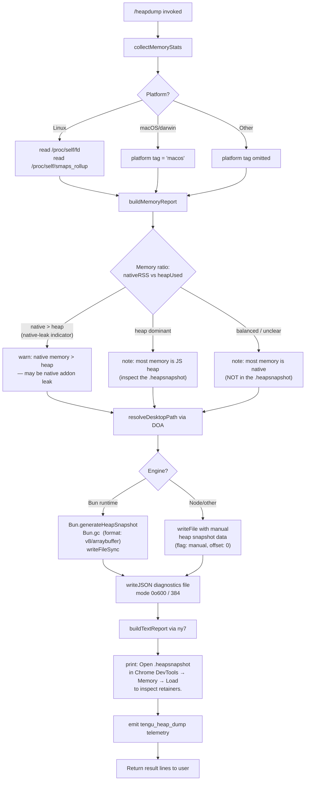

# `/heapdump`

> Analysis basis: CC v2.1.144 bundle.js (AST extraction + Claude interpretation)
> Minimum version: v2.1.144

---

## Overview

`/heapdump` is a hidden, non-interactive diagnostic command that captures a JS heap snapshot of the running Claude Code process, writes it to `~/Desktop`, and prints a concise memory-analysis report alongside a Chrome DevTools usage hint. It is intended for developer/debug use and is not surfaced in the normal command list.

---

## Registration

| Field | Value |
|---|---|
| type | `local` |
| name | `heapdump` |
| description | `Dump the JS heap to ~/Desktop` |
| supportsNonInteractive | `true` |
| isHidden | `true` |
| module_id | `WTq` |
| load_inline | `true` |
| loc_byte | `11600862` |
| loc_byte_end | `11601025` |
| loc_line | `7211` |
| arbor_handler.name | `ly7` |
| arbor_handler.fqn | `claude-2.1.144::ly7` |
| arbor_handler.kind | `AsyncFunction` |
| arbor_handler.resolution_path | `module_id` |
| arbor_handler.n_hits | `0` |

Analysis basis: CC v2.1.144 bundle.js:+11600862

---

## Input Branching

The command accepts an optional free-text argument but its primary branching is internal (platform detection, memory-ratio evaluation, heap-engine selection). There are 4+ distinct paths, so a flowchart is used.



Analysis basis: CC v2.1.144 bundle.js:+11598393 – +11600418

---

## Behavioral Spec

### 1. Entry Point — Main Handler (`ly7`)

```
async function heapdumpHandler(args):
    lines = []
    lines.push(
        "Open the .heapsnapshot in Chrome DevTools → Memory → Load to inspect retainers."
    )
    report = await runDumpAndCollect(args)   // XTq
    lines = lines.concat(report)
    return lines.join("\n")
```

Analysis basis: CC v2.1.144 bundle.js:+11599731, +11599850, +11599877, +11599999

---

### 2. Orchestrator — Run Dump and Collect (`XTq`)

```
async function runDumpAndCollect(args):
    // Step 1 — gather memory statistics
    stats = await collectMemoryStats()       // dy7

    // Step 2 — format column labels
    columnLabel = formatColumnLabel()        // K  (padEnd with "  " separator)

    // Step 3 — resolve Desktop output path
    desktopPath = resolveDesktopPath()       // DOA  (ju8.homedir + "Desktop")

    // Step 4 — build output filename using path join (XF_.join)
    outputPath = path.join(desktopPath, generateFilename())

    // Step 5 — write heap snapshot
    snapshotJson = generateHeapSnapshot()    // cy7
    fs.writeFile(outputPath, snapshotJson, { mode: 384 })   // 0o600
    serialized = JSON.stringify(stats)       // CH

    // Step 6 — flag for telemetry + invoke tengu_heap_dump
    emit("tengu_heap_dump")                  // d

    // Step 7 — build error/warning annotations
    annotations = buildAnnotations(stats)    // b_, tU, kH

    // Step 8 — return structured result
    return buildResult(stats, outputPath, annotations)   // v
```

Analysis basis: CC v2.1.144 bundle.js:+11598393, +11598452, +11598689, +11598798, +11598841, +11598857, +11598932, +11598981, +11599152

File write mode is octal `0o600` (numeric `384`), ensuring the snapshot is readable only by the current user.
Analysis basis: CC v2.1.144 bundle.js:+11598876

---

### 3. Memory Statistics Collector (`dy7`)

```
async function collectMemoryStats():
    mem    = process.memoryUsage()
    heap   = v8.getHeapStatistics()           // fP8.getHeapStatistics
    res    = process.resourceUsage()
    uptime = process.uptime()
    spaces = v8.getHeapSpaceStatistics()      // fP8.getHeapSpaceStatistics
    handles  = process._getActiveHandles()
    requests = process._getActiveRequests()

    // Linux: read file-descriptor count from /proc/self/fd
    if fs.readdirSync("/proc/self/fd") succeeds:
        fdCount = result.length
    // Linux: read smaps_rollup for native RSS
    smaps = fs.readFile("/proc/self/smaps_rollup", "utf8")

    // Load bun:jsc module for additional JSC statistics (G)
    jscStats = require("bun:jsc")    // loc_byte 11596285

    // Accumulate warning lines
    warnings = []
    // RSS-to-heap ratio check (threshold: 100)
    ratio = mem.rss / mem.heapUsed
    if ratio > 100:
        warnings.push(
            "Native memory > heap - leak may be in native addons (node-pty, sharp, etc.)"
        )
    // Time window: 3600 seconds; chunk: 1048576 bytes
    // toFixed formatting for display values (X.toFixed)
    return { mem, heap, spaces, handles, requests, smaps, fdCount, jscStats, warnings, uptime }
```

Key constants:
- RSS/heap warning threshold: `100` (bundle.js:+11596578)
- Time window constant: `3600` seconds (bundle.js:+11596426)
- Chunk size constant: `1048576` bytes (1 MiB) (bundle.js:+11596431)
- Platform paths: `/proc/self/fd` (bundle.js:+11596137), `/proc/self/smaps_rollup` (bundle.js:+11596200)
- smaps encoding: `utf8` (bundle.js:+11596226)
- Warnings message: `"Native memory > heap - leak may be in native addons…"` (bundle.js:+11596664)

Analysis basis: CC v2.1.144 bundle.js:+11595894 – +11596787

---

### 4. Desktop Path Resolver (`DOA`)

```
function resolveDesktopPath():
    home = os.homedir()                           // ju8.homedir
    // Standard path: <home>/Desktop
    base = path.join(home, "Desktop")             // q5.join, literal "Desktop" at +1005075

    // WSL / Windows path override: scan /mnt/c/Users
    // filters out: "Public", "Default", "Default User", "All Users"
    // maps to /mnt/c/Users/<username>/Desktop
    if platform indicates WSL:
        base = resolveWSLDesktop("/mnt/c/Users")  // literal at +1005297

    // Sanitize path (q.replace)
    // Apply m6 (mkdir-if-missing helper)
    return ensureDir(base)                        // m6, v
```

Analysis basis: CC v2.1.144 bundle.js:+1005022, +1005029, +1005065, +1005205, +1005242, +1005514
Special WSL handling literals: `/mnt/c/Users` (+1005297), `Public` (+1005341), `Default` (+1005360), `Default User` (+1005380), `All Users` (+1005405)

---

### 5. Heap Snapshot Generator (`cy7`)

```
function generateHeapSnapshot(outputPath):
    // Bun runtime path
    if isBunRuntime():
        snapshot = Bun.generateHeapSnapshot("v8", "arraybuffer")  // +11599456, +11599461
        Bun.gc(/* expose: */ true)                                 // +11599488
        fs.writeFileSync(outputPath, snapshot)                     // jTq.writeFileSync
    else:
        // Node.js fallback path
        // uses manual flag (literal "manual" at +11598369, offset 0 at +11598380)
        writeManualHeapSnapshot(outputPath)

    // Memory cap hint: "auto-1.5GB" label present at +11599049
```

Analysis basis: CC v2.1.144 bundle.js:+11598932, +11599411, +11599431, +11599488
Heap format constants: `"v8"` (bundle.js:+11599456), `"arraybuffer"` (bundle.js:+11599461), `"manual"` (bundle.js:+11598369), memory label `"auto-1.5GB"` (bundle.js:+11599049)

---

### 6. Text Report Builder (`ny7`)

```
function buildTextReport(stats):
    lines = []

    // Memory breakdown with Math.max for column alignment
    heapMB  = (stats.heapUsed  / 1073741824 * 1024).toFixed(1)   // 1 GiB = 1073741824 bytes (+11600780)
    rssMB   = (stats.rss       / 1073741824 * 1024).toFixed(1)
    // Column width: 8 chars (+11600506)

    if heapDominant(stats):
        lines.push("— most memory is JS heap (inspect the .heapsnapshot)")   // +11600174
    else:
        lines.push("— most memory is native (NOT in the .heapsnapshot)")     // +11600234

    if noObviousLeaks(stats):
        lines.push("  (no obvious leak indicators)")   // +11600371

    // Fallback message (zsH helper)
    lines.push("No obvious leak indicators. Check heap snapshot for retained objects.")
    // literal at +11597783

    // macOS platform tag: "macos" (+11597518), runtime check "darwin" (+11597937)
    // result format: "text" (+11599763)

    return lines
```

Analysis basis: CC v2.1.144 bundle.js:+11600106, +11600174, +11600234, +11600371, +11600418
Byte constant for GiB conversion: `1073741824` (bundle.js:+11600780)
Column width: `8` characters (bundle.js:+11600506)

---

## State & Side Effects

| Item | Detail |
|---|---|
| Telemetry | `tengu_heap_dump` (bundle.js:+11598983) — fired once per invocation after snapshot write |
| Telemetry (indirect, bg subsystem) | `tengu_bg_dispatch_sigkill_escalate`, `tengu_bg_dispatch_low_mem`, `tengu_bg_spare_enable`, `tengu_bg_spare_claim`, `tengu_bg_spare_claim_fail`, `tengu_bg_proto_mismatch`, `tengu_bg_dispatch_stale_drop`, `tengu_bg_attach_legacy_autorespawn`, `tengu_bg_attach`, `tengu_bg_attach_stall_gave_up`, `tengu_bg_attach_stall_respawn`, `tengu_bg_attach_kick` — from shared bg-dispatch infrastructure reached via callGraph; not specific to heapdump itself |
| File written | `<desktop>/claudecode-<timestamp>.heapsnapshot` (JSON), mode `0o600` (bundle.js:+11598876) |
| File written | Companion diagnostics JSON alongside the snapshot (via `OsH.writeFile`) |
| Bun GC | `Bun.gc(true)` called after snapshot generation to expose all reachable objects (bundle.js:+11599488) |
| Directory creation | Desktop path created if absent via `m6` (mkdir-if-missing) |
| appState changes | None detected at depth-2 traversal |
| Sound | None detected |
| Hook registration | `OHA.register` reached via `h1` (bundle.js:+57049); appears to be a process/signal hook in the logging subsystem, not specific to heapdump |

---

## Version History

| Version | Change |
|---|---|
| v2.1.144 | Initial analysis |

---

## Common Mistakes

1. **Expecting visible output in the UI**: `/heapdump` is `isHidden: true` and will not appear in `/help` or command autocomplete. It must be typed in full.
2. **Running on a non-Desktop OS or in CI**: The Desktop path resolver requires `~/Desktop` to exist (or a valid `/mnt/c/Users/<user>/Desktop` on WSL). In headless environments the directory may not exist; the command attempts to create it via `m6` but failure will abort the dump.
3. **Interpreting the snapshot on Windows without WSL**: The `.heapsnapshot` file is written to the resolved Desktop path (potentially a WSL path). Open it directly in Chrome DevTools via **Memory → Load** as instructed in the output.
4. **Assuming Bun is always used**: On standard Node.js builds the Bun-specific path (`Bun.generateHeapSnapshot`) is skipped and a manual snapshot path is used instead; both produce a valid `.heapsnapshot` file.
5. **Ignoring the native-memory warning**: If the report prints `"Native memory > heap"` (RSS/heap ratio > 100), the heap snapshot will NOT capture the memory in question — native addon profiling tools are required.
6. **Snapshot file permissions**: The file is written with mode `0o600` (owner read/write only). Attempting to open it as another user will fail.

---

## Appendix — Identifier Mapping

> For bundle debugging only. Identifiers change across versions.

| Identifier | Role |
|---|---|
| `ly7` | Main async handler for `/heapdump` (Arbor-resolved entry point) |
| `XTq` | Orchestrator: coordinates stats collection, path resolution, snapshot write, and result assembly |
| `dy7` | Memory statistics collector (calls `process.memoryUsage`, `v8.getHeapStatistics`, `/proc` reads, etc.) |
| `cy7` | Heap snapshot generator (Bun or Node path, calls `Bun.generateHeapSnapshot` / `Bun.gc`) |
| `ny7` | Text report builder (formats MB values, emits diagnostic summary lines) |
| `DOA` | Desktop path resolver (homedir + "Desktop", WSL path handling) |
| `I6` | Likely a filesystem utility (shared with other call sites) |
| `WV` | Called by `I6`; likely low-level fs helper |
| `G` | JSC/bun:jsc module loader helper |
| `P26` | Called by `G`; likely module-cache lookup |
| `bE8` | Called by `G`; likely module-load or error wrapper |
| `P` | Background MCP/daemon connection pool or transport layer |
| `kH` | Error-logging / error annotation helper (`Sc.logError` reached from here) |
| `b_` | Error construction utility (calls `Error`, `String`) |
| `X` | Subprocess / PTY communication channel object |
| `j` | Buffer/stream accumulator used with `X` |
| `w` | Background daemon session manager (spawns, kills, memory-monitors subprocesses) |
| `B5` | Stream-end / flush helper |
| `hL5` | Background session protocol handler (dispatches ping, nudge, yield, lease, etc.) |
| `GH` | String conversion helper |
| `v` | Result/response formatter used after orchestrator completes |
| `vfK` | Sub-formatter or renderer within `v` |
| `YHA` | Internationalisation or color-code helper within `vfK` |
| `H` | Random/timeout utility (Math.random + setTimeout) |
| `CH` | JSON serializer wrapper (`JSON.stringify`) |
| `_` | Generic utility (toUpperCase, push) |
| `x4` | Path/string manipulation helper (replace, lastIndexOf, slice) |
| `d8A` | Path-map builder (GfK.map) |
| `q` | File-descriptor or temp-file manager (`t_K.unlinkSync`) |
| `A` | String case normaliser (`f.toLowerCase`) |
| `YhH` | Output writer wrapper |
| `h8A` | Low-level stream write helper |
| `yfK` | File-write pipeline (mkdir, appendFile, rotate logic) |
| `pSH` | Log-flush / batch scheduler (clearTimeout, setImmediate, push) |
| `z_H` | Path join + write helper within `yfK` |
| `m6` | mkdir-if-missing / ensure-directory utility |
| `kN8` | Append-size tracker (`A8`) |
| `s8A` | Path-join + fs.stat helper |
| `a8A` | File-rotation helper (stat, rename, unlink) |
| `kfK` | Chunked append-file writer (mkdir, appendFile, rotate) |
| `h1` | Process/signal hook registrar (`OHA.register`) |
| `K` | Column-label formatter (`L.map`, `f.padEnd`) |
| `L` | Async work-queue item (add, finally, delete) |
| `f` | Resource-closer (close handles on finally) |
| `d` | Telemetry emitter / event dispatcher |
| `tU` | Annotation or warning tagger used after snapshot write |
| `zsH` | Fallback/no-leak message emitter |

---

Note: index built via Arbor fallback; some signals (telemetry, literals) may be missing — see arbor-fallback.js.