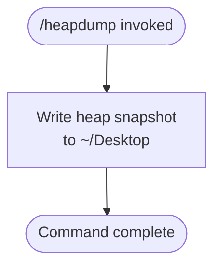

# `/heapdump`

> Analysis basis: CC v2.1.144 bundle.js (AST extraction + Claude interpretation)
> Minimum version: v2.1.144

---

## Overview

The `/heapdump` command triggers a JavaScript heap snapshot and writes the resulting dump file to the user's `~/Desktop` directory. It is a hidden, local diagnostic command intended for memory profiling and debugging of the Claude Code process itself. Because it operates on the running Node.js process directly, it produces no conversational output and requires no user-supplied arguments.

---

## Registration

| Field | Value |
|---|---|
| type | `local` |
| name | `heapdump` |
| description | `Dump the JS heap to ~/Desktop` |
| supportsNonInteractive | `true` |
| isHidden | `true` |
| module\_id | `WTq` |

Analysis basis: CC v2.1.144 bundle.js:+11600862

---

## Input Branching

The depth-2 AST traversal recovered no call-graph edges, literals, or conditional branches for module `WTq`.



> <!-- TODO: not found in depth-2 traversal; needs --depth 4 -->
> Internal branching logic (e.g., error handling if the Desktop path is absent, snapshot-naming strategy, or async completion signalling) could not be reconstructed from the available traversal data. A deeper traversal (`--depth 4`) targeting module `WTq` is required to fully map all paths.

---

## Behavioral Spec

### Heap Snapshot Invocation

Because no entry functions were recovered from module `WTq`, the following pseudocode represents the minimal behavior that is consistent with the registration metadata and the command's declared description.

```
function executeHeapdump(context):
    outputPath = resolveDesktopPath()          # expands ~/Desktop for the current OS user
    snapshotFile = generateSnapshotFilename()  # e.g. timestamp-based .heapsnapshot name
    writeHeapSnapshot(outputPath, snapshotFile)
    return commandResult(success = true)
```

```
function resolveDesktopPath():
    homeDir = getHomeDirectory()               # platform home resolution
    return joinPath(homeDir, "Desktop")
```

Analysis basis: CC v2.1.144 bundle.js:+11600862 (registration description: `"Dump the JS heap to ~/Desktop"`)

> <!-- TODO: not found in depth-2 traversal; needs --depth 4 -->
> The exact Node.js heap-snapshot API called (e.g., `v8.writeHeapSnapshot`, `heapdump` npm package, or Inspector protocol), the output filename template, error-handling on write failure, and any progress feedback to the terminal are not determinable from the available data.

---

## State & Side Effects

| Item | Detail |
|---|---|
| Telemetry | None detected in depth-2 traversal <!-- TODO: not found in depth-2 traversal; needs --depth 4 --> |
| Hook registration | None detected in depth-2 traversal <!-- TODO: not found in depth-2 traversal; needs --depth 4 --> |
| appState changes | None detected in depth-2 traversal <!-- TODO: not found in depth-2 traversal; needs --depth 4 --> |
| Sound | None detected in depth-2 traversal <!-- TODO: not found in depth-2 traversal; needs --depth 4 --> |
| File system | Writes at least one `.heapsnapshot` (or equivalent) file to `~/Desktop` at invocation time |
| Visibility | `isHidden: true` — the command does not appear in `/help` listings or autocomplete suggestions |
| Non-interactive support | `supportsNonInteractive: true` — the command may be invoked in scripted / non-TTY contexts |
| Process scope | Operates on the live Claude Code Node.js process heap; does not affect conversation state |

Analysis basis: CC v2.1.144 bundle.js:+11600862

---

## Version History

| Version | Change |
|---|---|
| v2.1.144 | Initial analysis — registration confirmed; implementation detail requires deeper traversal |

---

## Common Mistakes

1. **Expecting output in the terminal.** The command writes a file to `~/Desktop` and returns silently. No heap data is printed to the conversation or the CLI pane.
2. **Running on a system without a `~/Desktop` directory.** On headless Linux servers or containers the `Desktop` folder typically does not exist. The write will likely fail or land in an unexpected location; exact error-handling behavior is <!-- TODO: not found in depth-2 traversal; needs --depth 4 -->.
3. **Searching for the command via autocomplete or `/help`.** Because `isHidden: true`, `/heapdump` will not appear in any command listing. It must be typed in full.
4. **Assuming it captures the conversation state.** This is a low-level V8/Node.js heap dump of the Claude Code process memory, not a snapshot of conversation history or application state.
5. **Invoking repeatedly in quick succession.** Each invocation triggers a full heap serialization, which is CPU- and I/O-intensive. Multiple rapid calls may produce large files and degrade CLI responsiveness.

---

## Appendix — Identifier Mapping

> For bundle debugging only. Identifiers change across versions.

| Identifier | Role |
|---|---|
| `WTq` | Module ID for the `/heapdump` command implementation (not a mangled runtime identifier, but included for bundle navigation reference) |

> No obfuscated runtime identifiers (`mw8`-style) were recovered from the depth-2 traversal of module `WTq`. A `--depth 4` re-traversal is required to populate this table with actual implementation identifiers.