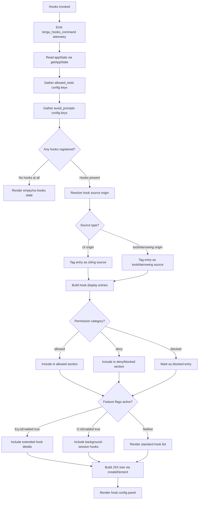

# `/hooks`

> Analysis basis: CC v2.1.144 bundle.js (AST extraction + Claude interpretation)
> Minimum version: v2.1.144

---

## Overview

The `/hooks` command displays the current hook configurations that are registered for tool lifecycle events in Claude Code. It renders a JSX-based UI component immediately upon invocation, reading from application state to present an organized view of all active hook entries grouped by tool event type, permission category, and source (CLI argument vs. configuration file).

---

## Registration

| Field | Value |
|---|---|
| type | `local-jsx` |
| name | `hooks` |
| description | `View hook configurations for tool events` |
| loc_byte | `11495201` |
| loc_byte_end | `11495351` |
| loc_line | `7089` |
| immediate | `true` |
| module_id | `J0q` |
| load_inline | `true` |
| arbor_handler.name | `Wk7` |
| arbor_handler.fqn | `claude-2.1.144::Wk7` |
| arbor_handler.kind | `AsyncFunction` |
| arbor_handler.resolution_path | `module_id` |
| arbor_handler.n_hits | `0` |

Analysis basis: CC v2.1.144 bundle.js:+11495201

---

## Input Branching

The command has multiple distinct rendering branches based on hook configuration state. The logic fans out across permission categories, source origins, and feature-flag checks.



Analysis basis: CC v2.1.144 bundle.js:+11495033, +11495041, +11495071

---

## Behavioral Spec

### 1. Handler Entry Point

The async handler `Wk7` is the primary entry point resolved via `module_id → J0q`.

```
async function hooksCommandHandler(context):
    emitTelemetry("tengu_hooks_command")         // +11495001
    appState = readAppState()                     // via getAppState, +11495033
    hookDisplayData = buildHookDisplayModel(appState)  // mZ, +11495041
    return createElement(HooksViewComponent, hookDisplayData)  // +11495071
```

Analysis basis: CC v2.1.144 bundle.js:+11494999

---

### 2. App State Access

The state reader (`y_`) calls `H.getAppState` and selects specific keys from the configuration object.

```
function readAppState():
    state = H.getAppState()                      // +10049670
    allowedTools = state["allowed_tools"]        // +10049778
    avoidPrompts = state["avoid_prompts"]        // +10049833
    effortSetting = state["effort"]              // +10049935
    modelSetting  = state["model"]               // +10049948
    return buildHookEntries(state)               // Xb_ → Y1, +10049796
```

Analysis basis: CC v2.1.144 bundle.js:+10049670

---

### 3. Hook Display Model Construction

`mZ` orchestrates the full display model. It aggregates several sub-pipelines:

```
function buildHookDisplayModel(appState):
    // Resolve per-hook metadata (source, type) — hX sub-pipeline
    hookMetaList = resolveHookMetadata(appState)      // hX, +8992475

    // Filter hooks — _6H sub-pipeline
    filteredHooks = filterHooks(hookMetaList)          // _6H, +8992507

    // Build permission-aware hook entries — Pk_ sub-pipeline
    permissionEntries = buildPermissionEntries(filteredHooks)  // Pk_, +8992532

    // Build keyed display map — XK sub-pipeline
    keyedDisplay = buildKeyedDisplay(permissionEntries)    // XK, +8992544

    // Build grouped hook panel — K6H sub-pipeline
    groupedPanel = buildGroupedHookPanel(keyedDisplay)    // K6H, +8992632

    // Check feature-flag gating
    if featureFlagExtended.isEnabled():                   // Eq.isEnabled, +8992702
        extendedEntries = filterExtendedHooks(hookMetaList)  // K.filter, +8992778

    if backgroundSessionFlag.isEnabled():                 // O.isEnabled, +8992832
        backgroundEntries = filterBackgroundHooks()

    return assembleDisplayModel(groupedPanel, extendedEntries, backgroundEntries)
```

Analysis basis: CC v2.1.144 bundle.js:+8992436

---

### 4. Hook Metadata Resolution

`hX` classifies each hook entry by its origin and permission type.

```
function resolveHookMetadata(rawConfig):
    for each hook in rawConfig:
        // Determine config source
        if hook.source == "cli":                          // +3197102
            tag = "cli"
            emitTelemetry("tengu_slate_harbor")           // +3197132
        else if hook.source == "remote":                  // +3197113
            tag = "remote"

        // Classify SDK context
        switch hook.sdkKind:
            case "sdk-ts":     …                          // +3197359
            case "sdk-py":     …                          // +3197373
            case "sdk-cli":    …                          // +3197387
            case "local-agent": …                         // +3197402

        // Build permission descriptor — P6
        descriptor = buildPermissionDescriptor(hook)      // P6, +3197129

    return metaList
```

Analysis basis: CC v2.1.144 bundle.js:+3196950

---

### 5. Hook Filtering

`_6H` removes hooks that should not be surfaced in the display, then delegates to the source-type resolver `iX6`.

```
function filterHooks(hookList):
    candidateList = hookList.filter(isDisplayable)        // H.filter, +8991788

    for each candidate in candidateList:
        // Resolve deny-type hooks — XLH sub-pipeline
        denyHooks = resolveDenyHooks(candidate)           // iX6 → XLH, +9772439
        // "deny" literal recognized at +9771790

        // Resolve narrowing source
        if candidate.source == "cliArg":                  // +9772376
            applyCliArgNarrowing(candidate)
        else if candidate.source == "toolsNarrowing":     // +9772397
            applyToolsNarrowing(candidate)                // VAq, +9772480

    return filteredList
```

Analysis basis: CC v2.1.144 bundle.js:+8991788

---

### 6. Permission Entry Builder

`su` (called via `Pk_`) constructs per-hook permission records with platform awareness.

```
function buildPermissionEntry(hook):
    if platform == "windows":                             // +3198432
        applyWindowsPathNormalization(hook)
    emitTelemetry("tengu_cobalt_ridge")                   // +3198526
    descriptor = buildPermissionDescriptor(hook)          // P6, +3198523
    return permissionRecord
```

Analysis basis: CC v2.1.144 bundle.js:+3198425

---

### 7. Grouped Hook Panel Builder

`K6H` is the most complex sub-component, assembling the final visual groupings.

```
function buildGroupedHookPanel(keyedDisplay):
    // Render keyed display header row
    headerRow = buildKeyedDisplay(keyedDisplay)           // XK, +8991164

    // Apply label transform
    labelledRow = applyLabelTransform(headerRow)          // $Y, +8991180

    // Render "blocked" entries
    blockedEntries = collectBlocked(keyedDisplay)         // "blocked" literal, +8991849
    blockedPanel = renderBlockedPanel(blockedEntries)     // OD, +8991301

    // Render tool-search / Vertex AI warning if applicable
    // Warning: "[ToolSearch:optimistic] disabled: Vertex AI..." (+9397340)
    toolSearchWarning = maybeRenderToolSearchWarning()    // Kh → US_, +8991744

    // Check agent-teams flag
    if hasFlag("--agent-teams"):                          // +5282059
        agentSection = buildAgentTeamsSection()           // M9, +8991525
        emitTelemetry("tengu_amber_flint")                // +5282171

    // Compose sub-panels: action hooks, event hooks, blocking hooks
    actionHooks  = buildActionHookPanel()                 // C87 → Lo9/t_, +8991484
    eventHooks   = buildEventHookPanel()                  // h87 → Br9/t_, +8991531
    blockingHooks = buildBlockingHookPanel()              // R87 → lr9/t_, +8991537

    return assembleGroupedPanel(
        headerRow, blockedPanel, toolSearchWarning,
        agentSection, actionHooks, eventHooks, blockingHooks
    )
```

Analysis basis: CC v2.1.144 bundle.js:+8991164

---

### 8. Model/Tier Resolver

`US_` (called via `Kh`) resolves model tier labels for display alongside hook entries.

```
function resolveModelTier(modelIdentifier):
    if modelIdentifier == "standard":                     // +9396326
        return standardTierLabel
    else if modelIdentifier starts with "tst":            // +9396405
        if random() * 100 < threshold:                   // 100 literal, +9396418
            return tstTierLabel
    else if modelIdentifier == "tst-auto":                // +9396455
        return autoTierLabel

    // Platform-specific routing
    switch apiProvider:
        case "bedrock":      …                            // +2021996
        case "foundry":      …                            // +2022046
        case "anthropicAws": …                            // +2022102
        case "mantle":       …                            // +2022156
        case "vertex":       …                            // +2022204
        case "firstParty":   …                            // +2022213
        // default endpoint: "api.anthropic.com"          // +2022902
```

Analysis basis: CC v2.1.144 bundle.js:+9396265

---

### 9. Background Session / Daemon Status

`NVq` checks daemon status which feeds into the background-session hook display branch.

```
function checkDaemonStatus():
    sessionStore = viL.getStore()                         // n9, +3906103
    statusPath = buildStatusPath("daemon.status.json")    // SG6, +11730149
    timestamp = Date.now()                                // +11730261
    payload = serializePayload(CH → JSON.stringify)       // +11730316
    if sessionStatus == "stopped":                        // +14577307
        label = "background session"                      // +14577350
    return daemonStatus
```

Analysis basis: CC v2.1.144 bundle.js:+11730246

---

## State & Side Effects

| Item | Detail |
|---|---|
| Telemetry: `tengu_hooks_command` | Fired immediately on command invocation (bundle.js:+11495001) |
| Telemetry: `tengu_slate_harbor` | Fired when a hook entry with `cli` source origin is classified (bundle.js:+3197132) |
| Telemetry: `tengu_cobalt_ridge` | Fired during permission-entry construction in `su` (bundle.js:+3198526) |
| Telemetry: `tengu_amber_flint` | Fired when `--agent-teams` flag is active during panel assembly (bundle.js:+5282171) |
| `immediate: true` | Command renders its JSX output without waiting for user to press Enter — output appears inline immediately |
| `H.getAppState` | Read-only access to application state; no mutations observed in depth-2 traversal |
| `viL.getStore` | Reads async-local session store for daemon status (bundle.js:+3906103) |
| `Date.now` | Timestamp sampled during daemon status check (bundle.js:+11730261) |
| `Math.random` / `setTimeout` | Used in state module `H`; not directly in hook display path (bundle.js:+12668351, +12668388) |
| `t_K.unlinkSync` | Called from `q` in the process-close path; not triggered by normal `/hooks` display (bundle.js:+14520889) |
| Hook registration | None — `/hooks` is a read-only viewer; it does not register new hooks |
| appState changes | None observed; command is purely read-only |
| Sound | None observed in traversal |
| Feature flag: `Eq.isEnabled` | Gates display of extended hook detail rows (bundle.js:+8992702) |
| Feature flag: `O.isEnabled` | Gates display of background-session hook entries (bundle.js:+8992832) |

---

## Version History

| Version | Change |
|---|---|
| v2.1.144 | Initial analysis |

---

## Common Mistakes

1. **Expecting mutation**: `/hooks` is a read-only display command. It does not add, remove, or modify any hook configuration — use the settings files or CLI flags to change hooks.
2. **Confusing source labels**: Hooks tagged `cliArg` were provided via command-line argument; hooks tagged `toolsNarrowing` originate from tool-narrowing configuration. These are distinct display categories.
3. **Missing `immediate` behavior**: Because `immediate: true` is set, the hooks panel renders inline without requiring an explicit submit — pressing Enter is not needed to trigger the display.
4. **Expecting all hooks when feature flags are off**: The extended hook detail rows and background-session hook entries are gated behind feature flags (`Eq.isEnabled`, `O.isEnabled`). If those flags are not active, those sections will not appear.
5. **Vertex AI tool-search warning**: When running against a Vertex AI endpoint, a warning about the `[ToolSearch:optimistic]` feature being disabled will appear in the hooks panel unless `ENABLE_TOOL_SEARCH=true` is set (bundle.js:+9397340).

---

## Appendix — Identifier Mapping

> For bundle debugging only. Identifiers change across versions.

| Identifier | Role |
|---|---|
| `Wk7` | Primary async handler for `/hooks` command (arbor_handler) |
| `d` | Telemetry emission helper called at handler entry |
| `y_` | App-state reader; calls `H.getAppState` and selects config keys |
| `H` | App-state module; also contains `Math.random`/`setTimeout` utilities |
| `Xb_` | Hook entry builder delegating to `Y1` |
| `Y1` | Low-level hook entry constructor |
| `mZ` | Top-level hook display model assembler |
| `xH` | String utility / identifier helper |
| `hX` | Hook metadata classifier (source origin, SDK kind) |
| `PF` | Sub-utility called inside hook metadata classification |
| `Cq` | String coercion / normalization helper |
| `P6` | Permission descriptor builder |
| `f56` | Permission sub-field builder A |
| `M56` | Permission sub-field builder B |
| `Cs` | Permission categorization helper |
| `Vr6` | Deduplication / cache-check helper using `T$H` and `m1_` sets |
| `y6` | Timestamp-aware hook record builder; calls `Date.now` |
| `_6H` | Hook filter that removes non-displayable hooks |
| `iX6` | Source-type resolver (deny, cliArg, toolsNarrowing) |
| `XLH` | Deny-hook resolver; uses `yD8.flatMap` |
| `iR_` | Additional hook resolver sub-pipeline |
| `VAq` | Tools-narrowing application helper |
| `Pk_` | Permission entry pipeline orchestrator |
| `su` | Per-hook permission record constructor (platform-aware) |
| `t_` | React/UI hook registration helper; uses `Ls_.set` |
| `RV6` | Bound callback helper within `t_` |
| `XK` | Keyed display row builder |
| `K6H` | Grouped hook panel builder (largest sub-component) |
| `$Y` | Label transform helper |
| `OD` | Blocked-entry panel renderer; uses `Cq` |
| `aiH` | Auxiliary display helper in grouped panel |
| `C87` | Action-hook panel builder; delegates to `Lo9` and `t_` |
| `M9` | Agent-teams section builder; checks `--agent-teams` flag |
| `k34` | Sub-utility in agent-teams builder |
| `h87` | Event-hook panel builder; delegates to `Br9` and `t_` |
| `R87` | Blocking-hook panel builder; delegates to `lr9` and `t_` |
| `Kh` | Tool-search / model-tier section builder |
| `US_` | Model-tier label resolver (standard, tst, tst-auto) |
| `v` | Display-value formatter; handles uppercase, trim, debug mode |
| `JA` | API provider classifier helper |
| `i5` | Auxiliary helper in tool-search section |
| `A` | File-handle / process-close module (`toLowerCase` on file names) |
| `f` | Process-close handler (calls `A.close`, `q.close`) |
| `q` | Temp-file cleanup module (`t_K.unlinkSync`) |
| `L` | Promise finalization helper for process resources |
| `K` | Display row collection (map/filter/padEnd operations) |
| `vL` | Visibility/layout helper |
| `O` | Background-session feature flag module |
| `k8` | Sub-utility inside feature-flag module `O` |
| `$` | Session/process list module; uses `NVq` |
| `NVq` | Daemon status checker; reads `daemon.status.json` |
| `Qa` | Session metadata accessor |
| `n9` | Async-local store reader (`viL.getStore`) |
| `SG6` | Status file path builder (`vVq.join`, `n8`) |
| `CH` | JSON serialization helper (`JSON.stringify`) |

---

Note: index built via Arbor fallback; some signals (telemetry, literals) may be missing — see arbor-fallback.js.