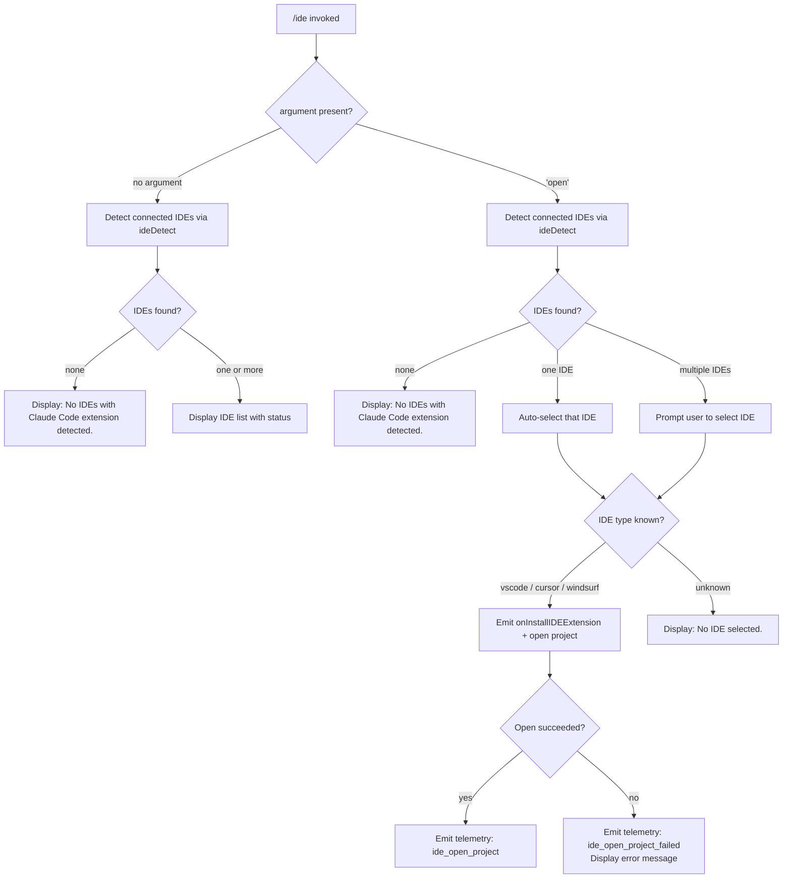

# `/ide`

> Analysis basis: CC v2.1.144 bundle.js (AST extraction + Claude interpretation)
> Minimum version: v2.1.144

---

## Overview

The `/ide` command manages IDE integrations for Claude Code and displays their current connection status. When invoked with the optional `open` argument, it attempts to open the current project in a detected IDE (VS Code, Cursor, or Windsurf) that has the Claude Code extension installed. Without the argument, it presents the list of connected IDEs and their statuses.

---

## Registration

| Field | Value |
|---|---|
| type | `local-jsx` |
| name | `ide` |
| description | `Manage IDE integrations and show status` |
| argumentHint | `[open]` |
| module_id | `FMq` |
| load_inline | `true` |
| loc_byte | `10658904` |
| loc_byte_end | `10659060` |
| loc_line | `5847` |
| arbor_handler.name | `sP7` |
| arbor_handler.fqn | `claude-2.1.144::sP7` |
| arbor_handler.kind | `AsyncFunction` |
| arbor_handler.resolution_path | `module_id` |
| arbor_handler.n_hits | `0` |

Analysis basis: CC v2.1.144 bundle.js:+10658904

---

## Input Branching

The command has four distinct paths based on the argument and IDE state, warranting a Mermaid flowchart.



Analysis basis: CC v2.1.144 bundle.js:+10654964, +10655086, +10655181, +10655319, +10655379

---

## Behavioral Spec

### Handler Entry Point

The primary handler is `sP7` (resolved via Arbor `module_id` path from module `FMq`). It is an `AsyncFunction`.

Analysis basis: CC v2.1.144 bundle.js:+10654964

```
async function ideCommandHandler(userArgs, appState):
    emit telemetry("tengu_ext_ide_command")        // always fires on entry

    // Retrieve connection state
    connectionInfo = getConnectionInfo(appState)   // calls C6 → kR6 → NR6.getStore

    // Detect IDEs with the Claude Code extension
    detectedIDEs = await ideDetect()               // calls YQH → jA8 → e$4

    if detectedIDEs is empty:
        display("No IDEs with Claude Code extension detected.")
        return

    // Determine action based on argument
    if userArgs includes "open":
        selectedIDE = selectIDE(detectedIDEs)      // interactive if > 1 IDE
        if selectedIDE is null:
            display("No IDE selected.")
            return
        result = await openProject(selectedIDE, appState)  // calls Rj
        if result succeeded:
            emit telemetry("ide_open_project")
            display bold(selectedIDE.name) + " opened"
        else:
            emit telemetry("ide_open_project_failed")
            display error
    else:
        renderIDEStatusList(detectedIDEs)          // calls lP7 for JSX render
```

Analysis basis: CC v2.1.144 bundle.js:+10654964, +10655086, +10655110, +10655179, +10655492, +10655516, +10655580, +10656049, +10656093, +10656120, +10656159

---

### IDE Detection (`ideDetect` — `YQH`)

Scans the local environment for running IDE processes with the Claude Code extension installed.

```
async function ideDetect():
    // Phase 1: check known IDE config directories via e$4
    candidates = []
    for each potentialIDEPath in knownIDEPaths():
        // Skips system dirs: /mnt/c/Users/Public, Default, Default User, All Users
        if path is valid and not excluded:
            candidates.push(path)

    // Phase 2: on Linux, also run process scan
    if platform == "linux":
        psOutput = exec("ps aux | grep -E 'code|cursor|windsurf|idea|...' | grep -v grep")
        parse psOutput for running IDE processes

    // Phase 3: look up port/socket info per candidate via s$4 → seA
    results = await Promise.all(candidates.map(c => resolveIDEPort(c)))

    // Normalise results: filter nulls, deduplicate
    ideList = results.filter(Boolean)

    if ideList is empty:
        emit telemetry("ide_detect_failed")
    else:
        emit telemetry("ide_detect")

    return ideList
```

Analysis basis: CC v2.1.144 bundle.js:+5230614, +5230663, +5230677, +5231957, +5232021, +5235465, +5235491

Known excluded Windows user directories (WSL scenario): `Public`, `Default`, `Default User`, `All Users`
(bundle.js:+5228799, +5228818, +5228838, +5228863)

IDE identifier strings searched on Linux: `code`, `cursor`, `windsurf`, `idea`, `pycharm`, `webstorm`, `phpstorm`, `rubymine`, `clion`, `goland`, `rider`, `datagrip`, `dataspell`, `aqua`, `gateway`, `fleet`, `android-studio`
(bundle.js:+5235491)

The base search paths include the user's home directory `.claude` folder and `ide` subdirectory (bundle.js:+5228498, +5228420).

---

### IDE-Specific Path Normalisation (`Rj`)

Once an IDE is selected for the `open` action, its type label is normalised and a platform-specific open command is constructed.

```
function normaliseAndOpen(selectedIDE, projectPath):
    ideName = selectedIDE.name.toLowerCase()      // toLowerCase at 5236366

    // Extract display label
    label = basename(selectedIDE.path)            // UI.basename at 5236424

    // Determine IDE type keyword
    if ideName contains "vscode" or "code":
        keyword = "vscode"
    else if ideName contains "cursor":
        keyword = "cursor"
    else if ideName contains "windsurf":
        keyword = "windsurf"
    else if ideName contains "jetbrains" / "appcode" / etc:
        keyword = "jetbrains"
    // … other JetBrains variants

    // Build and issue open-project IPC call via daemon
    openProjectViaIPC(keyword, projectPath)
    emit _.onInstallIDEExtension callback
```

Analysis basis: CC v2.1.144 bundle.js:+5236366, +5236424, +10655379, +10655420, +10655461, +10656093

---

### Path Normalisation Utility (`ru_`)

A helper used internally when constructing open-project arguments. It normalises a list of file paths (up to 3 items) and produces a comma-separated summary string.

```
function buildPathSummary(paths):
    sample = paths.slice(0, 3)                 // constant 3 at 10658441
    normalised = sample.map(p =>
        path.normalize(p, "NFC")               // NFC normalisation at 10658509
    )
    if paths.length > 3:
        return normalised.join(", ") + ", …"   // literals at 10658666, 10658680
    else:
        return normalised.join(", ")
```

Analysis basis: CC v2.1.144 bundle.js:+10658368, +10658387, +10658411, +10658441, +10658472, +10658497, +10658509, +10658518, +10658558, +10658584, +10658643, +10658666, +10658680

---

### Connection State Query (`C6` / `kR6`)

Retrieves the current IDE connection state from the application store, used to populate the status display.

```
function getIDEConnectionState():
    store = NR6.getStore()                // AsyncLocalStorage or similar
    if store has active connection:
        return store.connectionData       // calls ad
    else:
        return null                       // calls q_ → WV for fallback
```

Analysis basis: CC v2.1.144 bundle.js:+10658404, +965498, +965519, +965549, +965568

---

### Status Display Rendering (`lP7`)

The JSX renderer (`lP7`) is invoked at the end of the non-`open` path to draw the current IDE status list in the terminal UI. It is a `local-jsx` component, meaning the output is rendered inline in Claude Code's terminal interface.

Analysis basis: CC v2.1.144 bundle.js:+10656575

---

## State & Side Effects

| Item | Detail |
|---|---|
| Telemetry: `tengu_ext_ide_command` | Fired on every invocation of `/ide` (bundle.js:+10654966) |
| Telemetry: `ide_detect` | Fired when at least one IDE with the extension is found (bundle.js:+5231957) |
| Telemetry: `ide_detect_failed` | Fired when IDE detection returns empty results (bundle.js:+5232021) |
| Telemetry: `ide_open_project` | Fired after a successful project-open action (bundle.js:+10655519) |
| Telemetry: `ide_open_project_failed` | Fired when the project-open action fails (bundle.js:+10655626) |
| Hook registration | `_.onInstallIDEExtension` callback emitted when an IDE open succeeds (bundle.js:+10656093) |
| appState changes | Reads IDE connection state from store; no direct writes observed at depth-2 |
| IPC / daemon | Uses `sse-ide` and `ws-ide` connection endpoints (bundle.js:+10652951, +10652971) |
| Sound | None observed |
| Path normalisation | All paths Unicode-normalised to NFC form before display or transmission (bundle.js:+10658509) |

---

## Version History

| Version | Change |
|---|---|
| v2.1.144 | Initial analysis |

---

## Common Mistakes

1. **Invoking `/ide open` with no IDE running** — If no IDE with the Claude Code extension is active, the command exits immediately with "No IDEs with Claude Code extension detected." rather than attempting to launch an IDE. Start the IDE and install the extension first.
2. **WSL path exclusions** — When running inside WSL, user directories under `/mnt/c/Users/` such as `Public`, `Default`, `Default User`, and `All Users` are explicitly excluded from IDE scanning. Personal user directories are still scanned correctly.
3. **`/ide open` with multiple IDEs** — When more than one IDE is detected, the command presents a selection prompt. Bypassing the prompt or pressing Escape results in "No IDE selected." with no project opened.
4. **JetBrains detection** — JetBrains IDEs (IntelliJ, PyCharm, WebStorm, etc.) are detected via the Linux process scan or config-directory scan, but opening a project may behave differently from VS Code / Cursor / Windsurf. Verify the Claude Code plugin is installed in the JetBrains IDE Marketplace.
5. **Extension not installed** — The detection phase checks whether the Claude Code extension is present, not merely whether the IDE is running. An IDE without the extension will not appear in the list.

---

## Appendix — Identifier Mapping

> For bundle debugging only. Identifiers change across versions.

| Identifier | Role |
|---|---|
| `sP7` | Primary async handler for `/ide` command (Arbor-resolved entry point) |
| `ru_` | Path-list summary builder; normalises up to 3 paths to NFC, formats with ", " / ", …" |
| `C6` | IDE connection state accessor (delegates to `kR6`) |
| `kR6` | Inner connection-state resolver; reads from `NR6.getStore` and calls `ad` |
| `ad` | Connection data extraction helper |
| `q_` | Fallback connection-state path; calls `WV` |
| `WV` | Default/empty connection state value |
| `YQH` | `ideDetect` — async function that discovers running IDEs with the extension |
| `jA8` | Scans individual IDE candidate directories for extension presence |
| `e$4` | Enumerates known IDE configuration paths; filters excluded Windows/WSL dirs |
| `s$4` | Resolves IDE port/socket info per candidate |
| `seA` | Parses IDE process information; uses `parseInt` / `isNaN` for port parsing |
| `i19` | Regex-based IDE match helper (`H.match` at 5222741) |
| `Rj` | IDE open-project dispatcher; normalises IDE name and calls IPC |
| `V9` | String slice/index utility used during IDE name parsing |
| `gD_` | IDE detection orchestrator called from `sP7` for the open action |
| `f34` | Platform-specific IDE process lister; issues Linux `ps aux` grep command |
| `zX` | IDE extension config path resolver; calls `vPH` |
| `vPH` | Low-level config/platform accessor |
| `nn` | Helper invoked after IDE selection in the open flow |
| `lP7` | JSX renderer for IDE status list (the non-`open` display path) |
| `D8` | Secondary helper called from `sP7`; uses `z_` and `C6` |
| `sf` | Argument parsing helper called early in `sP7` |
| `zQH` | UI formatting helper for IDE status output |
| `kT` | Utility called after IDE list generation in `sP7` |
| `K8` | Small helper; calls `d` (bundle.js:+955651) |
| `H` | Multi-role utility (random delay, string ops, log); context-dependent |
| `A` | Path normaliser / map wrapper |
| `f` | Socket/connection object (close, finally ops) |
| `q` | File-system or set operations context |
| `L` | Promise/task tracker (add, finally, delete) |
| `D` | Daemon manager (normalize, dispose, slice) |
| `P6` | Extension config normaliser |
| `Cs` | Config string helper |
| `xH` | String conversion utility |
| `IF` | Internal flag / feature checker |
| `Vr6` | Extension registry access (has/get/add on `T$H`, `m1_`) |
| `u1_` | Extension registration handler; emits to `hl` |
| `F1_` | Extension finalisation helper |
| `y6` | Config snapshot writer; calls `Date.now` and `fCL` |
| `m6` | Path existence / stat helper |
| `t1_` | Timing utility |
| `V$H` | Config file reader/writer; handles ENOENT, EEXIST, utf-8 |
| `fCL` | File watcher setup (watchFile / unwatchFile) |
| `NVq` | Daemon status query; reads `daemon.status.json` |
| `Qa` | Daemon status parser |
| `n9` | Store getter (`viL.getStore`) |
| `SG6` | Daemon status path builder |
| `CH` | JSON serialiser (`JSON.stringify` wrapper) |
| `fT6` | Platform memory/config check (macos, 1024 MB threshold) |
| `Ta_` | Background spare process spawner (`Bun.spawn`, `--bg-pty-host`) |
| `d9` | Daemon utility; calls `RH` and `bH` |
| `RH` | Error code decoder |
| `bH` | Error string builder |
| `wfq` | Spare process path builder |
| `Kd` | Process path resolver |
| `Jfq` | Alternative spare path builder |
| `VL5` | Spawn argument builder (calls `PM`) |
| `PM` | Array validation helper (`Array.isArray`) |
| `GL5` | Process environment builder (`Object.assign`) |
| `dk` | PTY pid-file path builder |
| `mNH` | PTY pid-directory path builder |
| `d` | Core utility / error formatter |
| `kH` | Error logger / queue manager |
| `b_` | Error constructor wrapper |
| `Aq` | Error formatting helper |
| `D3A` | Error string formatter |
| `bkK` | Error queue rotator |
| `w` | Daemon session manager (kill, spawn, retry logic) |
| `C` | Supervisor worker manager |
| `yAK` | Realpath / stat resolver for workers |
| `O8` | Async error wrapper |
| `iL5` | Worker version path resolver |
| `v$8` | Version file path builder |
| `z` | Daemon control socket writer |
| `BN` | IPC message builder |
| `Xx` | Daemon shutdown sequence (`Promise.race`, `process.exit`) |
| `x` | Session retire-if-settled logic |
| `h` | Session phase accessor |
| `u` | Timer unref wrapper |
| `Ea_` | Claim sender; connects to daemon socket |
| `yc_` | Daemon auth file writer (`JSON.stringify` + `writeFile`) |
| `cW6` | Auth directory path builder |
| `Zu_` | Auth file path builder |
| `v` | Log-level formatter |
| `GH` | String coercion helper |
| `EL5` | Connection attempt loop (5 s timeout, ECONNREFUSED) |
| `ZL5` | Single TCP connect attempt |
| `A8` | Async error classifier |
| `r8` | Timeout-with-abort helper |
| `TL5` | Claim frame builder (`DU.buildClaimFrame`) |
| `dp` | Binary frame encoder (Buffer, writeUInt32BE, writeUInt8) |
| `ka_` | Background session lifecycle manager (spawn, roster, cleanup) |
| `K` | Session formatter |
| `PK` | Job path builder |
| `B0` | Job directory path builder |
| `B9` | Roster file reader/parser |
| `b6` | JSON parser wrapper |
| `wJ` | Active-job checker |
| `QE` | Job state classifier |
| `v5` | Roster writer (`fz`) |
| `fz` | Atomic file writer (randomBytes temp name, rename) |
| `FX` | Roster cache invalidator |
| `roH` | Roster persistence loop |
| `op` | Roster file reader |
| `RX7` | Roster directory initialiser |
| `RLH` | PTY roster path builder |
| `rp` | PTY process path resolver |
| `Gu_` | PTY socket path builder |
| `noH` | PTY socket directory builder |
| `Y` | IDE session config updater |
| `dJH` | Session config key resolver |
| `_Nq` | Config diff calculator |
| `T` | Remote control handler |
| `Z` | IDE session controller (start/stop/updateConfig) |
| `vAK` | Heartbeat sender |
| `V` | Heartbeat timer |
| `M99` | Process kill wrapper |
| `W` | Skill/config change event dispatcher |
| `AOH` | Config change handler (ConfigChange event) |
| `Y4` | Config-change sub-handler |
| `R2` | Hook runner |
| `AFH` | Hook filter helper |
| `pz8` | Skills config accessor |
| `D6H` | Policy settings dispatcher |
| `pqH` | Policy getter |
| `zz8` | Policy setter |
| `ha9` | Policy validator |
| `$rH` | Skills cache clearer |
| `X` | Protocol frame reader |
| `j` | Session write stream |
| `B5` | Frame end/flush helper |
| `hL5` | Protocol message dispatcher (main daemon protocol loop) |
| `RL5` | Protocol reply helper |
| `M` | Message type router |
| `Mz` | Background-service error mapper |
| `Ia_` | Attach context holder |
| `qAK` | Lease renewal scheduler |
| `P` | Terminal repaint coordinator |
| `cG` | Current-directory resolver |
| `u3` | Realpath normaliser |
| `I5H` | Session log reader |
| `yL5` | Stall detector |
| `p` | Screen flush helper |
| `h6H` | Terminal size helper |
| `SL5` | Session phase runner |
| `N` | Away-summary scheduler |
| `t` | Voice toggle silence handler |
| `e` | Voice focus silence handler |
| `g` | MCP tool-use filter |
| `F` | Compose helper |
| `l` | Tool filter helper |
| `r` | Input passthrough writer |
| `c` | Allow/deny gate |
| `UZ6` | Raw socket write helper |
| `G` | Terminal resize broadcaster |