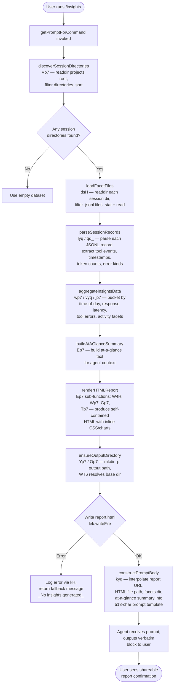

# `/insights`

> Analysis basis: CC v2.1.144 bundle.js (AST extraction + Claude interpretation)
> Minimum version: v2.1.144

---

## Overview

The `/insights` command generates a comprehensive HTML usage-analysis report covering all of the user's Claude Code sessions. It reads and aggregates stored session telemetry ("facets") from disk, renders a self-contained HTML file, and instructs the agent to respond with a fixed confirmation message that includes the report URL — the user never sees raw data, only the final formatted confirmation.

---

## Registration

| Field | Value |
|---|---|
| type | `prompt` |
| name | `insights` |
| description | `Generate a report analyzing your Claude Code sessions` |
| loc_byte | `12125274` |
| loc_byte_end | `12126578` |
| loc_line | `8891` |
| handler_method | `getPromptForCommand` |
| handler_method_start | `12125448` |
| handler_method_end | `12126577` |
| prompt_body.length | `513` |
| prompt_body.trace | `call→kyq(...) (1 literals)` |
| arbor_handler.name | `getPromptForCommand` |
| arbor_handler.fqn | `claude-2.1.144::getPromptForCommand` |
| arbor_handler.kind | `Method` |
| arbor_handler.resolution_path | `direct` |
| arbor_handler.n_hits | `1` |

Analysis basis: CC v2.1.144 bundle.js:+12125274

---

## Input Branching

The command's execution path has more than three distinct branches (session discovery, facet file enumeration, data aggregation, HTML rendering, write-out, and prompt construction), so a Mermaid flowchart is used.



Analysis basis: CC v2.1.144 bundle.js:+12125448

---

## Behavioral Spec

### 1. Handler Entry — `getPromptForCommand`

The handler is an ObjectMethod on the registration object, resolved directly by Arbor (`resolution_path: direct`). It is the sole entry point for the command.

```
async function getPromptForCommand(context):
    // Step 1 — collect session directories
    sessionDirs = await discoverSessionDirectories()

    // Step 2 — load facet records from each session
    facetRecords = await loadFacetFiles(sessionDirs)

    // Step 3 — parse and aggregate raw records into structured data
    aggregated = aggregateInsightsData(facetRecords)

    // Step 4 — compute at-a-glance summary (agent context only)
    summary = buildAtAGlanceSummary(aggregated)

    // Step 5 — render HTML report
    htmlContent = renderHTMLReport(aggregated)

    // Step 6 — write report to disk
    reportPath = resolveReportPath()           // WT6 + path.join
    await ensureOutputDirectory(reportPath)    // Yp7 / Op7
    await fs.writeFile(reportPath, htmlContent)

    // Step 7 — build and return prompt string
    prompt = buildPromptString(aggregated, reportPath, summary)  // kyq
    return prompt
```

Analysis basis: CC v2.1.144 bundle.js:+12125454

---

### 2. Session Directory Discovery — `discoverSessionDirectories` (`Vp7`)

Reads the top-level projects storage root and enumerates first-level subdirectories. The path root is assembled via `path.join` using the literal `"projects"` as the subdirectory name.

```
async function discoverSessionDirectories():
    rootPath = path.join(storageBase, "projects")   // "projects" literal
    entries  = await fs.readdir(rootPath)
    dirs     = entries.filter(entry => entry.isDirectory())

    // Throttled async walk: batch size 10, max concurrency 9
    // Uses setImmediate yielding between batches
    dirs.sort(...)
    return dirs
```

Key literals observed: `"projects"` (bundle.js:+3197472), batch sizes `10` and `9` (bundle.js:+12112199, +12112204), sort/slice cap `50` / `200` (bundle.js:+12112341, +12112346).

Analysis basis: CC v2.1.144 bundle.js:+12112322

---

### 3. Facet File Loading — `loadFacetFiles` (`dsH`)

For each session directory, reads all files matching the `.jsonl` extension, stats each file, and collects their contents.

```
async function loadFacetFiles(sessionDirs):
    results = []
    for dir in sessionDirs:
        entries  = await fs.readdir(dir)
        jsonlFiles = entries.filter(e => e.isFile() && fileMatchesPattern(e))
        // fileMatchesPattern uses Ai() which applies q24.test regex
        for file in jsonlFiles:
            stat = await fs.stat(path.join(dir, file))
            content = await fs.readFile(path.join(dir, file))
            results.push({ path, stat, content })
    return results
```

Filtered extension: `".jsonl"` (bundle.js:+12192467). File stat read via `BL.stat` / `BL.readFile`.

Analysis basis: CC v2.1.144 bundle.js:+12112107

---

### 4. Record Parsing — `parseSessionRecords` (`Iyq`)

Iterates JSONL lines, validates each as JSON, and classifies each record. Tool names are identified against known literals; error categories are matched against known error-kind strings.

```
function parseSessionRecords(rawContent):
    lines = rawContent.split("\n")
    records = []
    for line in lines:
        if not line.trim(): continue
        obj = JSON.parse(line)
        if Array.isArray(obj.content):
            classify(obj)   // tool categorisation, error detection
        records.push(obj)
    return records
```

Known tool-name literals included in classification: `"WebSearch"` (+12052410), `"WebFetch"` (+12052434), `"Edit"` (+12052541), `"Write"` (+12052553). Known error-kind strings: `"Command Failed"` (+12053428), `"User Rejected"` (+12053506), `"Edit Failed"` (+12053600), `"File Changed"` (+12053658), `"File Too Large"` (+12053738), `"File Not Found"` (+12053824).

Time-of-day hour buckets: Morning 6–12 (+12069340), Afternoon 12–18 (+12069387), Evening 18–24 (+12069441), Night 0–6 (+12069493).

Session age cap: `3600` seconds per-session record window (+12053214); stale threshold `1800000` ms (+12059747).

Analysis basis: CC v2.1.144 bundle.js:+12052251

---

### 5. Data Aggregation — `aggregateInsightsData` (`wp7`, `vyq`, `jp7`)

Groups the parsed records into bucketed metrics used by the HTML renderer.

```
function aggregateInsightsData(records):
    byProject   = groupBy(records, r => r.project)
    byTimeOfDay = bucketHours(records)   // Morning/Afternoon/Evening/Night
    responseLatencies = bucketLatencies(records)
    // Latency buckets: "2-10s", "10-30s", "30s-1m", "1-2m", "2-5m", "5-15m", ">15m"
    //   thresholds 120s (+12068712) and 900s (+12068794)
    toolErrors  = countToolErrors(records)
    activityFacets = buildFacets(records)  // vyq — uses Map/Set dedup
    return { byProject, byTimeOfDay, responseLatencies, toolErrors, activityFacets }
```

Maximum per-session token-context window for aggregation: `4096` (+12059223); HTML report content cap: `8192` chars per section (+12067661).

Analysis basis: CC v2.1.144 bundle.js:+12061110

---

### 6. HTML Report Rendering — `renderHTMLReport` (`Ep7` and sub-functions)

Produces a self-contained HTML string. Sub-functions handle individual sections.

```
function renderHTMLReport(aggregated):
    html  = buildHeader()           // inline CSS, color palette
    html += renderAtAGlance(aggregated)         // Tp7
    html += renderResponseTimeChart(aggregated) // W4H
    html += renderTimeOfDayChart(aggregated)    // Gp7
    html += renderToolErrorsSection(aggregated) // Wp7
    html += renderSuggestions(aggregated)
    html += buildFooter()
    return html
```

Color palette literals used in charts: `#2563eb` (+12106157), `#0891b2` (+12106295), `#10b981` (+12106467), `#8b5cf6` (+12106610), `#dc2626` (+12109873), `#16a34a` (+12110122), `#eab308` (+12110615).

Empty-state sentinel strings: `"<p class=\"empty\">No data</p>"` (+12067983), `"<p class=\"empty\">No response time data</p>"` (+12068440), `"<p class=\"empty\">No time data</p>"` (+12069290), `"<p class=\"empty\">No tool errors</p>"` (+12109884).

HTML entities are escaped via `s5`: `&amp;` (+4633409), `&lt;` (+4633433), `&gt;` (+4633456), `&quot;` (+4633507), `&apos;` (+4633532).

Output filename: `"report.html"` (bundle.js:+12114579).

Analysis basis: CC v2.1.144 bundle.js:+12070126

---

### 7. Report Write-Out — `ensureAndWrite` (`Yp7`, `Op7`)

Resolves the output directory through `WT6` (which itself uses `path.join` to construct a path under the storage base with the `"facets"` subdirectory literal at +12051767 and `"usage-data"` at +12051717), creates it with `fs.mkdir`, then writes the HTML file.

```
async function ensureAndWrite(htmlContent):
    baseDir  = resolveBaseDir()          // WT6: storageBase / "usage-data" / "facets"
    outDir   = path.join(baseDir, ...)
    await fs.mkdir(outDir, { recursive: true })
    filePath = path.join(outDir, "report.html")
    await fs.writeFile(filePath, htmlContent, "utf-8")
    return filePath
```

Error on write is caught; fallback literal `"_No insights generated_"` (bundle.js:+12126345) is used as the prompt body in that case.

Analysis basis: CC v2.1.144 bundle.js:+12057922

---

### 8. Prompt Construction — `buildPromptString` (`kyq`)

Invoked from `getPromptForCommand` (bundle.js:+12126480). Interpolates runtime values into the 513-character prompt template. The template instructs the agent to treat all inserted data as context only and to emit the `<message>…</message>` block verbatim as its entire response.

```
function buildPromptString(aggregated, reportPath, summary):
    reportUrl     = deriveUrl(reportPath)
    facetsDir     = path.dirname(reportPath)
    atAGlance     = summary  // "at_a_glance" key, bundle.js:+12065519
    promptText    = templateFill({
        insightsData : serialise(aggregated),
        reportUrl    : reportUrl,
        htmlFile     : reportPath,
        facetsDir    : facetsDir,
        atAGlance    : atAGlance
    })
    return promptText
```

The separator literal `" · "` (bundle.js:+12125906) appears in the at-a-glance summary construction. The round-call to `Math.round` at +12125835 normalises a numeric metric before insertion.

Analysis basis: CC v2.1.144 bundle.js:+12126480

---

### 9. Facet Warm-Up Pass — `warmupMinimal`

A partial warm-up pass identified by literal `"warmup_minimal"` (+12114137) runs before full aggregation when the session list exceeds a threshold (`5` sessions, +12112630). It processes only a slice of sessions (up to `50`) before the full `Promise.all` round.

```
function warmupMinimal(sessionDirs):
    if len(sessionDirs) > 5:
        warmupSlice = sessionDirs.slice(0, 50)
        partialData = processSlice(warmupSlice)
        return partialData
    return null
```

Analysis basis: CC v2.1.144 bundle.js:+12112715

---

## State & Side Effects

| Item | Detail |
|---|---|
| Telemetry | No `tengu_*` events are directly emitted by the `/insights` command handler itself. Events in the call graph (`tengu_transcript_phantom_parent`, `tengu_chain_parent_cycle`, `tengu_chain_timestamp_fallback`, `tengu_chain_parallel_tr_recovered`, `tengu_relink_walk_broken`) belong to shared transcript/chain-walk utilities also used by other subsystems. |
| Filesystem reads | Reads all `.jsonl` facet files under the session storage root (`"projects"`) and the `"usage-data"/"facets"` subdirectory. |
| Filesystem writes | Creates output directory (recursive `mkdir`) and writes `report.html` to the resolved output path. |
| appState changes | None directly. The prompt is returned as a string; no UI state mutations are observed in the depth-2 call graph. |
| Hook registration | None. |
| Sound | None. |
| Network | None. Report is fully local. |
| Encoding | File I/O uses `"utf-8"` (+12057848) for JSON/text; binary buffer reads use `"latin1"` (+12177229) for low-level JSONL scanning in `YU7`/`zU7`. |

---

## Version History

| Version | Change |
|---|---|
| v2.1.144 | Initial analysis |

---

## Common Mistakes

1. **Running `/insights` with no prior sessions**: If no `.jsonl` facet files exist under the storage root, the report renders with empty-state placeholders (`"<p class=\"empty\">No data</p>"`) rather than failing. The agent still delivers the confirmation message, but the report contains no charts.
2. **Expecting real-time data**: The command reads already-persisted facet files; it does not aggregate live session events from the current session at invocation time.
3. **Assuming the agent summarises the data**: The prompt instructs the agent to output the `<message>` block **verbatim** as its entire response. The agent is not free to paraphrase or omit lines; any deviation is contrary to the command's contract.
4. **Confusing the facets directory with the project directory**: The report writes to `usage-data/facets/` (a sibling of the session directories), not inside any individual project folder.
5. **Permission errors on write**: If the storage base directory is read-only, `fs.writeFile` will fail silently and the prompt body degrades to `"_No insights generated_"` (+12126345) with no user-visible error detail beyond that string.

---

## Appendix — Identifier Mapping

> For bundle debugging only. Identifiers change across versions.

| Identifier | Role |
|---|---|
| `__handler_insights` | Synthetic BFS entry point for the `/insights` command handler (bookkeeping alias for `getPromptForCommand`) |
| `Nyq` | Core insights orchestration function — drives the full collect → aggregate → render → write pipeline |
| `Vp7` | Session directory discovery — reads and filters the projects root |
| `CF` | Storage-base path assembler — joins base dir with `"projects"` |
| `dsH` | Facet file loader — readdir + stat + readFile per session directory |
| `Ai` | File-extension predicate — applies `q24` regex to match `.jsonl` files |
| `zp7` | Session metadata reader — reads `session-meta` JSON file |
| `_d_` | Usage-data path resolver — joins storage base with `"usage-data"` |
| `WT6` | Base directory resolver — joins storage base using `n8` helper |
| `b6` | Safe JSON parser wrapper — wraps `JSON.parse` |
| `Yp7` | Output directory creator + HTML writer (primary write path) |
| `Op7` | Alternate output directory creator + HTML writer |
| `B28` | Secondary base-path resolver (sibling of `_d_`) |
| `Dp7` | Report generation coordinator — calls `Mp7`, `HwH`, `Vyq` |
| `Mp7` | Session batch processor — slices + `Promise.all` maps over session chunks |
| `Kp7` | Per-session record processor — drives `qd_` per entry |
| `qd_` | Individual record normaliser and classifier |
| `Iyq` | JSONL line parser and tool/error classifier |
| `wp7` | Metrics aggregator — groups data into buckets for rendering |
| `vyq` | Activity-facet builder — uses Map/Set for deduplication |
| `jp7` | At-a-glance summary builder |
| `Ep7` | Full HTML report renderer |
| `Tp7` | HTML summary section renderer |
| `W4H` | Response-time chart section renderer |
| `Wp7` | Tool-errors section renderer |
| `Gp7` | Time-of-day chart renderer |
| `HwH` | HTML report template assembler |
| `Zyq` | Per-project HTML block generator |
| `sm7` | Project path helper |
| `fK` | HTML fragment utility |
| `IY8` | Cache/hash helper for report segments |
| `J8` | UUID generator for report IDs |
| `OkH` | Assistant message extractor |
| `x0` | HTML post-processor |
| `Vyq` | OS/platform detection helper used during render |
| `oV` | Platform constants provider |
| `WK` | Content filter used during HTML building |
| `kyq` | Prompt-string template filler — interpolates runtime values into 513-char template |
| `CH` | JSON serialiser wrapper (`JSON.stringify`) |
| `$p7` | Existing report reader (checks for cached report before re-generating) |
| `yyq` | Report cache invalidation helper |
| `Ap7` | NaN-guard numeric validator |
| `qd_` | Record normaliser (see above) |
| `Ad_` | Auxiliary data transformer |
| `F28` | Session-state snapshot aggregator |
| `sHH` | Full session-state hydrator — populates Maps for all session metadata fields |
| `KSq` | Session-chain walker — resolves parent→child conversation chains |
| `ESq` | Chain segment extractor |
| `QKH` | Chain entry point resolver |
| `HU7` | Chain deduplicator and sorter |
| `sp7` | Chain queue processor |
| `ep7` | Chain NaN-guard checker |
| `YU7` | Low-level JSONL binary scanner (uses `Buffer`, `openSync`, `readSync`) |
| `DU7` | Alternative low-level JSONL binary reader |
| `zU7` | JSONL structural parser — extracts fields by byte-offset comparison |
| `hiH` | Message-content mapper |
| `Gd_` | Compact-summary text extractor |
| `s06` | Text content normaliser |
| `Ed_` | Attachment/document filter |
| `_U7` | Trim + array-type validator |
| `AU7` | Array-predicate validator |
| `a28` | Session lookup helper |
| `s28` | Session-values enumerator |
| `Ap7` | NaN-safe number validator |
| `PT6` | Path-type classifier |
| `_p7` | File-extension extractor |
| `SOH` | Diff utility caller |
| `M7` | String indexOf helper |
| `qM` | Record quantity normaliser |
| `l7` | HTML-entity escape function |
| `s5` | Core HTML entity replacer |
| `U28` | Extended HTML escape wrapper |
| `V9` | Substring extractor (indexOf + slice) |
| `QsH` | Object-entries summariser |
| `xH` | String coercion helper |
| `kH` | Error logging helper — writes to log and emits `Sc.logError` |
| `b_` | Error-string extractor |
| `GH` | String coercion utility |
| `H_` | Utility wrapper |
| `dvH` | MCP server manager (reached via session-state hydration; not insights-specific) |
| `M` | MCP server registry map |
| `F` | MCP tool set |
| `Nyq` | (see above — core orchestrator) |

---

Note: index built via Arbor fallback; some signals (telemetry, literals) may be missing — see arbor-fallback.js.