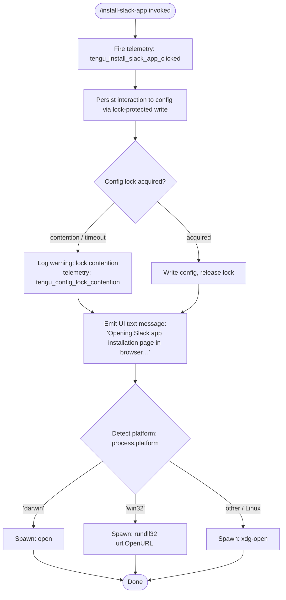

# `/install-slack-app`

> Analysis basis: CC v2.1.144 bundle.js (AST extraction + Claude interpretation)
> Minimum version: v2.1.144

---

## Overview

The `/install-slack-app` command opens the Slack app installation page for Claude in the user's default browser. It is a lightweight, non-interactive action command that fires a telemetry event, persists the interaction to config (via a lock-protected write), and then launches a platform-appropriate browser launcher to navigate the user to the installation URL.

---

## Registration

| Field | Value |
|---|---|
| type | `local` |
| name | `install-slack-app` |
| description | `Install the Claude Slack app` |
| supportsNonInteractive | `false` |
| module_id | `e$q` |
| load_inline | `true` |
| loc_byte | `10745971` |
| loc_byte_end | `10746157` |
| arbor_handler.name | `E27` |
| arbor_handler.fqn | `claude-2.1.144::E27` |
| arbor_handler.kind | `AsyncFunction` |
| arbor_handler.resolution_path | `module_id` |
| arbor_handler.n_hits | `0` |

Analysis basis: CC v2.1.144 bundle.js:+10745971

---

## Input Branching

The command has three distinct platform branches when determining how to open the browser URL, plus a preliminary config-write and telemetry step, warranting a Mermaid flowchart.



Analysis basis: CC v2.1.144 bundle.js:+10745575 (telemetry), +10745723 (UI string), +6413189 (darwin branch), +6413205 (win32 branch), +6413363 (open), +6413289 (rundll32), +6413370 (xdg-open)

---

## Behavioral Spec

### 1. Handler Entry (`installSlackAppHandler`)

The async handler (`E27`) is the resolved entry point per Arbor (`resolution_path: module_id`).

```
async function installSlackAppHandler(context):
    fire telemetry event "tengu_install_slack_app_clicked"
    call saveConfigWithLock(context)
    call openUrlInBrowser(installationUrl)
    return uiTextResult("Opening Slack app installation page in browser…")
```

Analysis basis: CC v2.1.144 bundle.js:+10745575 (telemetry call), +10745615 (saveConfigWithLock call), +10745690 (openUrlInBrowser call), +10745710 (return type "text"), +10745723 (return string)

---

### 2. Config Persistence (`saveConfigWithLock`)

This function (`t6`, resolved as the save-config-with-lock utility) protects the global config file with a file-system lock. It delegates to a lower-level lock acquisition routine (`K9_`) and then performs a config serialization and atomic write sequence.

```
async function saveConfigWithLock(context):
    acquire fileLock(configPath)
    if lock contention detected:
        emit telemetry "tengu_config_lock_contention"
        log warning: "Lock acquisition took longer than expected - another Claude instance may be running"
    read current config from disk (utf-8)
    parse JSON
    if re-read config is missing auth that in-memory cache has:
        emit telemetry "tengu_config_auth_loss_prevented"
        log warning about auth-loss prevention (GH #3117)
        abort write
    merge changes
    write config atomically (temp file + rename)
    release lock
```

Key safety guard: if the re-read disk state would lose authentication data that is present in the memory cache, the write is aborted and `tengu_config_auth_loss_prevented` is emitted (bundle.js:+3165366). This corresponds to a known issue referenced as GH #3117 (bundle.js:+3165214).

Lock contention warning message: `"Lock acquisition took longer than expected - another Claude instance may be running"` (bundle.js:+3164798).

Config parse error is separately telemetered as `tengu_config_parse_error` (bundle.js:+3167468).

Analysis basis: CC v2.1.144 bundle.js:+3161889 (t6→K9_ call), +3164887 (config_lock_contention telemetry), +3165023 (config_stale_write telemetry), +3166831 ("Config accessed before allowed." guard), +3166914 (utf-8 read), +3166887 (readFileSync)

---

### 3. Atomic Config File Write (`atomicConfigWriter`)

The lower-level write utility (`V$H`) performs a safe atomic replacement of the config file:

```
function atomicConfigWriter(configPath, data):
    if configPath not initialized:
        raise Error("Config accessed before allowed.")
    content = readFileSync(configPath, "utf-8")
    parsed = JSON.parse(content)
    validate structure
    write to temp file path (using Date.now() for uniqueness)
    copyFileSync(tempPath, configPath)   # atomic on most FS
    remove temp file
```

Backup directory used: `"backups"` subdirectory (bundle.js:+3166399).
Backup file names contain the `.backup.` infix (bundle.js:+3165684).
Maximum backup files retained: 5 (bundle.js:+3165817).
File mode for new config files: octal `0o600` / decimal `384` (bundle.js:+3166099).

Analysis basis: CC v2.1.144 bundle.js:+3166825 (Error), +3166831 (guard string), +3166887 (readFileSync), +3167958 (Date.now stamp), +3167976 (copyFileSync)

---

### 4. URL Opening (`openUrlInBrowser`)

The URL opener (`iq` → `D8`) resolves a platform-specific subprocess command to navigate the user to the Slack app installation page.

```
async function openUrlInBrowser(url):
    validate url.protocol in ["http:", "https:"]
    platform = process.platform
    if platform == "darwin":
        spawn("open", [url])
    else if platform == "win32":
        spawn("rundll32", ["url,OpenURL", url])
    else:
        spawn("xdg-open", [url])
```

URL protocol validation rejects non-HTTP(S) schemes (bundle.js:+6412880 `"http:"`, +6412902 `"https:"`). A `CP4` guard raises an `Error` for invalid protocols (bundle.js:+6412830).

The `dJ` call (bundle.js:+6413130) provides the subprocess spawning wrapper used before platform dispatch.

Platform constant `"darwin"` at bundle.js:+6413189; `"win32"` at bundle.js:+6413205; `"open"` at bundle.js:+6413363; `"rundll32"` at bundle.js:+6413289; `"url,OpenURL"` at bundle.js:+6413301; `"xdg-open"` at bundle.js:+6413370.

Analysis basis: CC v2.1.144 bundle.js:+6413117 (CP4 validation), +6413238 (D8 platform dispatch)

---

### 5. Background Session Machinery (transitive dependency)

The call graph reveals that the config-lock path (`K9_`) transitively reaches the background session dispatcher (`w`) and daemon spawn subsystem. These are shared infrastructure utilities, not specific to this command. Notable constants surfaced in traversal:

- SIGKILL escalation timeout: 30 s / 15 s (bundle.js:+14542089, +14542100)
- Background session telemetry events: `tengu_bg_dispatch_sigkill_escalate`, `tengu_bg_dispatch_low_mem`, `tengu_bg_spare_enable`, `tengu_bg_spare_claim`, `tengu_bg_spare_claim_fail`, `tengu_bg_spare_spawn`
- Memory pressure check uses `os.freemem()` via `nE8.freemem` (bundle.js:+14542543)
- Memory chunk unit: 1024 bytes (bundle.js:+14542607)

These are background infrastructure side effects and not directly triggered by the `/install-slack-app` user action beyond the config lock acquisition path.

Analysis basis: CC v2.1.144 bundle.js:+14542134, +14542444, +14542471, +14543352

---

## State & Side Effects

| Item | Detail |
|---|---|
| Telemetry — primary | `tengu_install_slack_app_clicked` (bundle.js:+10745577) |
| Telemetry — config lock | `tengu_config_lock_contention` (+3164887), `tengu_config_stale_write` (+3165023), `tengu_config_parse_error` (+3167468), `tengu_config_auth_loss_prevented` (+3165366) |
| Telemetry — bg session | `tengu_bg_dispatch_sigkill_escalate`, `tengu_bg_dispatch_low_mem`, `tengu_bg_spare_enable`, `tengu_bg_spare_claim`, `tengu_bg_spare_claim_fail`, `tengu_bg_spare_spawn` (transitive) |
| Config file write | Global config (`~/.claude.json`) updated via lock-protected atomic write |
| Auth-loss guard | Write aborted if disk state would drop auth credentials present in memory cache (GH #3117) |
| Browser subprocess | `open` / `rundll32 url,OpenURL` / `xdg-open` spawned depending on platform |
| UI output | Single `"text"` message: `"Opening Slack app installation page in browser…"` (bundle.js:+10745710, +10745723) |
| Interactive requirement | `supportsNonInteractive: false` — command is not available in non-interactive/headless mode |
| Hook registration | None observed in depth-2 traversal |
| Sound | None observed in depth-2 traversal |

---

## Version History

| Version | Change |
|---|---|
| v2.1.144 | Initial analysis |

---

## Common Mistakes

1. **Running in non-interactive mode**: The command has `supportsNonInteractive: false`. Attempting to invoke it in CI or piped mode will fail. Use an interactive terminal session.
2. **No browser available**: On Linux, `xdg-open` must be installed and configured. Headless server environments will fail silently or produce an error from the subprocess spawn.
3. **Concurrent Claude instances**: If another Claude Code instance holds the config lock, this command will log a warning about lock contention but will still proceed with URL opening. The config write may be delayed.
4. **Network / firewall restrictions**: The URL opened uses `https:` protocol; corporate firewall rules blocking the Slack installation domain will prevent the page from loading even though the command itself succeeds.
5. **Expecting command output beyond the confirmation string**: The command returns exactly one text message confirming the browser action. There is no follow-up prompt or confirmation dialog.

---

## Appendix — Identifier Mapping

> For bundle debugging only. Identifiers change across versions.

| Identifier | Role |
|---|---|
| `E27` | Main handler — `installSlackAppHandler` (AsyncFunction, Arbor-resolved via module_id `e$q`) |
| `d` | Telemetry emit utility |
| `t6` | Save-global-config-with-lock coordinator |
| `K9_` | Low-level config lock acquisition and atomic write logic |
| `_` | Filesystem abstraction (primary) |
| `m6` | Logging/debug utility |
| `L` | Filesystem abstraction (secondary, used for mkdirSync, statSync, etc.) |
| `q` | Filesystem abstraction (tertiary, used for readFileSync, unlinkSync, etc.) |
| `f` | File handle / stream wrapper |
| `UH1` | Config object merge/assign helper |
| `Yo8` | Default config value provider |
| `v` | HTTP/subprocess request utility |
| `vfK` | HTTP response handler |
| `H` | Random/timing utility (Math.random + setTimeout) |
| `CH` | JSON serialization helper (JSON.stringify wrapper) |
| `x4` | String/path manipulation utility |
| `YhH` | Header construction helper |
| `yfK` | HTTP body encoder / streaming writer |
| `A8` | Async error wrapper / try-catch utility |
| `V$H` | Atomic config file writer |
| `b6` | JSON parse wrapper |
| `TR` | String prefix-strip utility (startsWith + slice) |
| `GV1` | Backup directory manager / file enumerator |
| `kH` | Error logger (Sc.logError path) |
| `L9_` | Path joiner / backup path builder |
| `w` | Background session dispatcher / daemon manager |
| `w56` | Config validation / auth-loss guard helper |
| `A` | Module/process map (toLowerCase normalizer) |
| `V` | Version/path string with startsWith check |
| `P` | MCP server connection manager |
| `bE8` | MCP transport builder |
| `b_` | Error constructor wrapper |
| `Z` | Array/buffer slice holder |
| `aA6` | Atomic symlink-safe file write (uses randomBytes, fchmodSync, fsyncSync, renameSync) |
| `O` | Stat result wrapper (isSymbolicLink check) |
| `O8` | Async error boundary |
| `PpH` | Config path resolver |
| `WV1` | Config entries iterator (Object.entries) |
| `WpH` | Config write timestamp recorder (Date.now) |
| `q9_` | Symlink-aware config path writer |
| `iq` | URL validation + platform browser launcher coordinator |
| `CP4` | URL protocol guard (raises Error for non-HTTP/S) |
| `dJ` | Subprocess spawn wrapper |
| `D8` | Platform-dispatch browser open function |
| `z_` | Subprocess execution engine |
| `vPH` | Child process stdio/event binding setup |
| `D` | Background session lifecycle manager |
| `$hK` | Subprocess output string coercer |
| `C6` | Async store / context retrieval |
| `kR6` | AsyncLocalStorage getStore accessor |
| `q_` | Context/store lookup wrapper |

---

Note: index built via Arbor fallback; some signals (telemetry, literals) may be missing — see arbor-fallback.js.