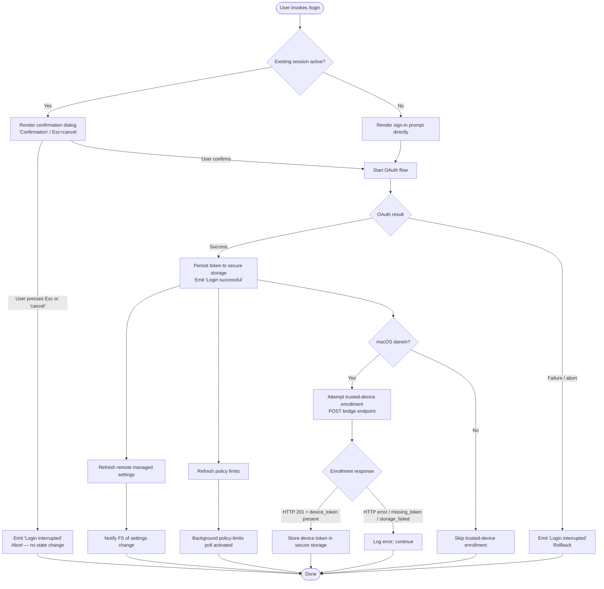

# `/login`

> Analysis basis: CC v2.1.144 bundle.js (AST extraction + Claude interpretation)
> Minimum version: v2.1.144

---

## Overview

The `/login` command initiates an interactive account-switching or sign-in flow that allows the user to authenticate with an Anthropic account via OAuth. It renders a JSX confirmation dialog in the terminal UI, orchestrates the OAuth token acquisition lifecycle, persists credentials to secure storage, and then refreshes downstream subsystems (remote managed settings, policy limits, trusted-device enrollment) that depend on the active authentication state.

---

## Registration

| Field | Value |
|---|---|
| type | `local-jsx` |
| name | `login` |
| description | `Switch Anthropic accounts \| Sign in with your Anthropic account` |
| loc_byte | `10694092` |
| loc_byte_end | `10694325` |
| loc_line | `6331` |
| module_id | `gB9` |
| load_inline | `true` |
| arbor_handler.name | `_$q` |
| arbor_handler.fqn | `claude-2.1.144::_$q` |
| arbor_handler.kind | `Function` |
| arbor_handler.resolution_path | `direct` |
| arbor_handler.n_hits | `2` |

Analysis basis: CC v2.1.144 bundle.js:+10694092

---

## Input Branching

The login flow has more than three distinct paths depending on authentication state, platform, and user responses to the confirmation dialog, so a Mermaid flowchart is used.



Analysis basis: CC v2.1.144 bundle.js:+8442532 (JSX render entry), +8442592 (literal "Login successful"), +8442611 (literal "Login interrupted"), +8442891 (literal "Esc"), +8442909 (literal "cancel"), +6571341 (literal "bridge_trusted_device_enroll"), +6571427 (HTTP 201 check)

---

## Behavioral Spec

### 1. Component Mount and App-State Integration

The handler (`_$q`, resolved via Arbor `direct` path) is a `local-jsx` command, meaning it renders a React component tree rather than emitting a plain text response. On mount it calls `getAppState` to read the current authentication context and `setAppState` to update it after login completes.

```
function loginCommandRoot(props):
    appState = getAppState()
    renderConfirmationShell(appState, onDone=handleLoginDone)
```

Analysis basis: CC v2.1.144 bundle.js:+8442348 (`H.getAppState`), +8442444 (`H.setAppState`)

---

### 2. Confirmation Dialog Rendering

The JSX component (`componentRenderer`) uses `hKH.createElement` to build a `Confirmation` dialog with the following UI controls:

| UI element | Value |
|---|---|
| Dialog label | `"Confirmation"` |
| Cancel key | `"Esc"` |
| Cancel action string | `"cancel"` |
| Confirm action string | `"confirm:no"` (negation guard on current account) |

The dialog is rendered with a memo cache sentinel at slot index 3 (bundle.js:+8442770) and uses React hooks `useReducer`, `useEffect`, and `useMemo` internally (via `mB9`).

```
function renderConfirmationShell(appState, onDone):
    [state, dispatch] = useReducer(loginReducer, initialLoginState)
    useEffect(subscribeToAuthEvents, [])
    memo = useMemo(() => buildDialogProps(appState), [appState])
    return createElement(ConfirmationDialog, {
        label: "Confirmation",
        cancelKey: "Esc",
        cancelValue: "cancel",
        onDone: onDone
    })
```

Analysis basis: CC v2.1.144 bundle.js:+8442867 ("Confirmation"), +8442891 ("Esc"), +8442909 ("cancel"), +8442846 ("confirm:no"), +8440635 (useReducer), +8440669 (useEffect), +8440930 (useMemo)

---

### 3. OAuth Token Acquisition

When the user confirms, the main login orchestrator (`oauthOrchestrator`, mapped from `DdH`) executes the OAuth flow:

```
async function oauthOrchestrator(context):
    // Resolve OAuth endpoint
    baseUrl = resolveOAuthBaseUrl(context)      // prod / staging / local / custom
    if CLAUDE_CODE_CUSTOM_OAUTH_URL set and not in approved list:
        throw Error("CLAUDE_CODE_CUSTOM_OAUTH_URL is not an approved endpoint.")

    // Wait for upstream policy gate
    await waitForPolicyLimitsToLoad()
    if not isPolicyAllowed():
        return interrupt("policy denied")

    // Check trusted-device skip conditions
    if CLAUDE_TRUSTED_DEVICE_TOKEN env var set:
        log("[trusted-device] env var set, skipping enrollment")
    else if essentialTrafficOnly:
        log("[trusted-device] Essential traffic only, skipping enrollment")
    else if no OAuth token yet:
        log("[trusted-device] No OAuth token, skipping enrollment")

    // POST to auth server
    response = await s8.post(authEndpoint, payload, {
        headers: { "Content-Type": "application/json" },
        timeout: 10000,      // 10 s hard timeout
        retryDelay: 500      // ms between retries
    })

    if response.status == 201 and response.body.device_token present:
        storeDeviceToken(response.body.device_token)
    elif response.status in [400..599]:
        emitTelemetry("bridge_trusted_device_enroll", { result: "http_error" })
```

Environment variables observed in literals:
- `ANTHROPIC_API_KEY` (bundle.js:+2914253)
- `CLAUDE_CODE_API_KEY_FILE_DESCRIPTOR` (bundle.js:+2040466)
- `ANTHROPIC_API_KEY or CLAUDE_CODE_OAUTH_TOKEN env var is required` (error message, bundle.js:+2914674)
- `CLAUDE_TRUSTED_DEVICE_TOKEN` (implied by skip-enrollment log literal, bundle.js:+6570555)

OAuth URL environment:

| Environment | Base URL |
|---|---|
| `prod` | `api.anthropic.com` (bundle.js:+2022902) |
| `local` | `http://localhost:8000` / `:4000` / `:3000` (bundle.js:+939760) |
| `staging` | configured separately (bundle.js:+940665) |
| Custom | validated against allow-list; rejected with error if not approved (bundle.js:+940825) |

Analysis basis: CC v2.1.144 bundle.js:+6570694 (waitForPolicyLimitsToLoad), +6570725 (isPolicyAllowed), +6571196 ("application/json"), +6571239 (10000 ms timeout), +6571265 (500 ms retry), +6571427 (HTTP 201 check), +6571725 ("missing_token"), +6571933 ("storage_failed")

---

### 4. Credential Persistence (Secure Storage)

After a successful token is received, `credentialWriter` (`lH1`) writes it to the platform credential store:

```
async function credentialWriter(key, value, options):
    try:
        result = await primaryStore.write(key, value)    // keychain / libsecret
        emitTelemetry("secure_storage_credentials_write", {
            outcome: "primary_transient_skip_fallback"
                  or "plaintext_fallback_used"
                  or "primary_and_fallback_failed"
        })
    catch err:
        if err is transient and skipFallback:
            record("primary_transient_skip_fallback")
        else:
            plaintext_fallback_used → write to file
```

Telemetry outcomes (bundle.js:+2199432, +2199530, +2199679, +2199782):
- `secure_storage_credentials_write` with sub-outcomes as above.

API key is sliced to at most 20 characters for log display (bundle.js:+2042107, literal `20`). Sensitive values are redacted to `"[REDACTED]"` in debug logs (bundle.js:+193402).

Analysis basis: CC v2.1.144 bundle.js:+2199055 (H.read), +2199367 (H.update), +2199411 (_.delete), +2199887 (Promise.all)

---

### 5. Post-Login Subsystem Refresh

On successful credential write, three subsystems are refreshed:

#### 5a. Remote Managed Settings Refresh

`remoteManagedSettingsRefresher` (`EdH`) is called, which:

1. Resolves the current authentication type (`gateway`, `local-agent`, `enterprise`, `team`, `firstParty`, `bedrock`, `vertex`, `anthropicAws`, `foundry`, `mantle`) — Analysis basis: CC v2.1.144 bundle.js:+6608828, +6608961, +6609106, +6609141, +2022102, +2022156, +2022204.
2. Fetches remote settings via HTTPS with `User-Agent` and `If-None-Match` (ETag) headers.
3. Handles HTTP status codes:

| HTTP status | Action |
|---|---|
| 200 | Parse and validate new settings |
| 204 | No content; no update |
| 304 | Use cached settings; log "Using cached settings (304)" |
| 401 | Trigger force-refresh retry; emit `tengu_remote_settings_401_force_refresh_retry` |
| 404 | Delete cached file; log "Deleted cached file (404 response)" |
| other | Emit `remote_managed_settings_unexpected`; use stale cache |

4. On new settings: runs security dialog (`tengu_managed_settings_security_dialog_shown`). User can accept (`tengu_managed_settings_security_dialog_accepted`) or reject (`tengu_managed_settings_security_dialog_rejected`). Rejection falls back to cached settings.
5. Persists accepted settings; notifies FS via `FS.notifyChange` (bundle.js:+6614629).
6. Logs "Remote settings: Refreshed after auth change" (bundle.js:+6614534).

Analysis basis: CC v2.1.144 bundle.js:+6610693 ("Authentication required for remote settings"), +6610781 ("User-Agent"), +6610807 ("If-None-Match"), +6610901–+6610928 (status codes 200/204/304/404)

#### 5b. Policy Limits Refresh

`policyLimitsOrchestrator` (`N$6`) refreshes usage-based policy restrictions:

```
async function policyLimitsOrchestrator(authContext):
    await fetchPolicyLimits(authContext)    // retried with exponential back-off
    if result == 304:
        log("Policy limits: Cache still valid (304 Not Modified)")
    elif result success:
        log("Policy limits: Applied new restrictions successfully")
        emitTelemetry("tengu_policy_limits_fetch", { auth_type: "api_key"|"oauth" })
    elif result fail:
        log("Policy limits: Using stale cache after fetch failure")
    startBackgroundPoll(policyLimitsPollHandler)   // uses setInterval/clearInterval
```

Retry back-off: `ot` (bundle.js:+9899161) uses `Math.min`, `Math.pow`, `Math.random` with base delay 32000 ms, jitter factor 0.25, max retries 10 (literals bundle.js:+9899148, +9899211, +9899241).

Literal log strings observed: "Policy limits: Loading promise timed out, resolving anyway" (bundle.js:+4639036), "Policy limits: Changed during background poll" (bundle.js:+4644096), "Policy limits: Refreshed after auth change" (bundle.js:+4643867).

Analysis basis: CC v2.1.144 bundle.js:+4643793 (N$6 entry), +4638058 (setInterval), +4638126 (clearInterval), +4642396 ("policy_limits_load"), +4644051 ("policy_limits_poll")

#### 5c. Trusted-Device Enrollment (macOS only)

Gated on platform string `"darwin"` (bundle.js:+6571146). Sends HTTP POST to the bridge trusted-device endpoint `/v1/toolbox/shttp/mcp/{server_id}` pattern (bundle.js:+940559) with `Content-Type: application/json` and timeout 10000 ms. On HTTP 201 response, stores `device_token` in secure storage; on failure, emits `"bridge_trusted_device_enroll"` telemetry with the appropriate error code.

---

### 6. Login Result Emission

After the flow completes, the JSX `onDone` callback fires with one of two terminal literals:

| Outcome | Emitted string | loc_byte |
|---|---|---|
| Success | `"Login successful"` | +8442592 |
| Cancelled / error | `"Login interrupted"` | +8442611 |

The component uses `Symbol.for` keying (bundle.js:+8442775) to coordinate with the outer REPL loop and a `react.memo_cache_sentinel` at slot 3 (bundle.js:+8442786).

---

### 7. Permission-Mode State

`permissionStateManager` (`nf`) and `permissionModeUpdater` (`uZH`) apply any updated permission mode after login. Recognized mode values: `"default"`, `"session"`, `"bypassPermissions"` (if enabled), `"setMode"`. Rule sets: `alwaysAllowRules`, `alwaysDenyRules`, `alwaysAskRules`; rule operations: `addRules`, `replaceRules`, `removeRules`, `addDirectories`, `removeDirectories`.

If `bypassPermissions` mode is requested but the session was not launched with that mode (or `disableBypassPermissionsMode` is set), the update is ignored and the literal warning is emitted: "Ignoring permission update: setMode 'bypassPermissions' rejected — mode is not available…" (bundle.js:+4595153).

Analysis basis: CC v2.1.144 bundle.js:+9800247 ("bypassPermissions"), +4595065 ("setMode"), +4595614 ("allow"), +4595654 ("deny")

---

## State & Side Effects

| Item | Detail |
|---|---|
| Telemetry — remote settings 401 | `tengu_remote_settings_401_force_refresh_retry` (bundle.js:+6611910) |
| Telemetry — feature flag bad | `tengu_feature_bad` (bundle.js:+955578) |
| Telemetry — feature flag ok | `tengu_feature_ok` (bundle.js:+955520) |
| Telemetry — feature flag sad | `tengu_feature_sad` (bundle.js:+955653) |
| Telemetry — managed settings security dialog shown | `tengu_managed_settings_security_dialog_shown` (bundle.js:+6607883) |
| Telemetry — managed settings security dialog accepted | `tengu_managed_settings_security_dialog_accepted` (bundle.js:+6607978) |
| Telemetry — managed settings security dialog rejected | `tengu_managed_settings_security_dialog_rejected` (bundle.js:+6608028) |
| Telemetry — policy experiment | `tengu_slate_kestrel` (bundle.js:+4639760) |
| Telemetry — policy limits fetch | `tengu_policy_limits_fetch` (bundle.js:+4642273) |
| Telemetry — bypass permissions mode disabled | `tengu_disable_bypass_permissions_mode` (bundle.js:+9799339) |
| Telemetry — auto mode config | `tengu_auto_mode_config` (bundle.js:+9797366) |
| Telemetry — daemon config reload | `tengu_daemon_config_reload` (bundle.js:+14556317) |
| FS notification | `FS.notifyChange` emitted after settings write (bundle.js:+6614629, +6614961) |
| Hook registration | `OHA.register` called during background poll startup via `h1` (bundle.js:+57049) |
| Interval hooks | `setInterval` / `clearInterval` used by policy-limits background poller `q68` (bundle.js:+4638058, +4638126) |
| Timeout hooks | `setTimeout` / `clearTimeout` used by OAuth retry scheduler (bundle.js:+4639007, +4638891) |
| App state changes | `getAppState` read, `setAppState` written with updated auth and permission mode |
| Credential storage | Writes OAuth token / API key to platform keychain; falls back to plaintext file |
| Cache management | Remote-settings and policy-limits cache files written via `pZH.open` / `A.writeFile` / `A.datasync` / `A.close`; deleted on HTTP 404 via `pZH.unlink` |
| Sound | <!-- TODO: not found in depth-2 traversal; needs --depth 4 --> |

---

## Version History

| Version | Change |
|---|---|
| v2.1.144 | Initial analysis |

---

## Common Mistakes

1. **Invoking `/login` when `ANTHROPIC_API_KEY` is already set in the environment** — the environment variable takes precedence over OAuth tokens. The required env var error "ANTHROPIC_API_KEY or CLAUDE_CODE_OAUTH_TOKEN env var is required" (bundle.js:+2914674) will surface if neither is present after the flow; setting the variable externally may shadow the freshly written token.
2. **Setting `CLAUDE_CODE_CUSTOM_OAUTH_URL` to an unapproved endpoint** — the command will throw "CLAUDE_CODE_CUSTOM_OAUTH_URL is not an approved endpoint." (bundle.js:+940825) and abort the OAuth flow before any credentials are exchanged.
3. **Pressing Esc during the confirmation dialog** — this maps to the `"cancel"` action and produces `"Login interrupted"` with no credential changes. Users sometimes confuse this with a network failure.
4. **Expecting immediate policy-limits enforcement** — policy limits are fetched asynchronously after credential write, with up to 32 s back-off. The "Policy limits: Loading promise timed out, resolving anyway" message (bundle.js:+4639036) indicates the gate resolved before the fetch completed.
5. **Running on non-macOS platforms and expecting trusted-device enrollment** — the enrollment POST is gated behind a `"darwin"` platform check (bundle.js:+6571146); on Linux/Windows the enrollment step is silently skipped.

---

## Appendix — Identifier Mapping

> For bundle debugging only. Identifiers change across versions.

| Identifier | Role |
|---|---|
| `_$q` | Top-level login command handler (Arbor-resolved, `direct` path) |
| `k$8` | Login JSX component body / reducer logic |
| `Nr4` | JSX element factory wrapper calling `hKH.createElement` |
| `xDH` | Outer login component shell; wires `onDone`, `Symbol.for` key, confirmation dialog |
| `TD` | Internal login UI component; uses `useMemo`, `zq`, `BP` |
| `mB9` | Inner hook aggregator (`useReducer`, `useEffect`, `NF`) |
| `NF` | Auth event subscriber (`YpH.subscribe`, `queueMicrotask`) |
| `eZ1` | Micro-task scheduler wrapping `Promise.resolve` |
| `O6` | App-state context reader (`useSyncExternalStore`) |
| `V4_` | Context hook guard (throws `ReferenceError` if used outside provider) |
| `EdH` | Remote managed settings refresh orchestrator |
| `AX_` | Remote managed settings fetch-and-apply core |
| `SD9` | Remote managed settings background poller |
| `rW4` | Remote settings poll iteration handler |
| `HX_` | Remote settings FS notify + file persistence handler |
| `nW4` | Atomic settings file writer (`pZH.open`, `A.writeFile`, `A.datasync`) |
| `ED9` | Remote settings security check dispatcher |
| `PdH` | Settings structure validator (`Object.entries`, case-insensitive header check) |
| `HD9` | Settings digest / hash builder |
| `ZD9` | Remote settings user-rejection handler |
| `GK` | Settings change notification emitter |
| `N$6` | Policy limits refresh + background poll orchestrator |
| `L68` | Policy limits fetch scheduler with timeout |
| `Tm` | Policy limits fetch core (calls `JA`, `n$`, `CA`, `P6`) |
| `v$6` | Policy limits state machine (manages `Ln1`, `qn1`, timers) |
| `qn1` | Policy limits response processor / cache writer |
| `Ln1` | Policy limits background poller |
| `F_4` | Policy limits poll iteration handler |
| `An1` | Policy limits cache file reader (`Hn1.readFileSync`) |
| `p_4` | Policy limits cache file writer (`I$6.writeFile`) |
| `b_4` | Policy limits hash calculator (`el1.createHash`) |
| `u_4` | Policy limits retry scheduler (uses `ot`, `r8`) |
| `ot` | Exponential back-off calculator (`Math.min`, `Math.pow`, `Math.random`) |
| `r8` | Generic async retry helper with abort / clearTimeout |
| `DdH` | OAuth trusted-device enrollment orchestrator |
| `kj_` | Trusted-device pre-check (reads env var, checks essential-traffic flag) |
| `xqH` | Trusted-device policy check wrapper |
| `pY9` | Trusted-device token retrieval helper |
| `f1` | OAuth URL builder and endpoint validator |
| `hK` | Credential read/write coordinator |
| `lH1` | Secure storage read/write state machine |
| `U2H` | Secure storage async read helper |
| `n$` | API key resolution (env var, file descriptor, helper binary) |
| `Rq6` | File-descriptor API key reader (`CLAUDE_CODE_API_KEY_FILE_DESCRIPTOR`) |
| `SK` | API key formatter / validator |
| `OI` | Flag settings loader |
| `SSH` | VSCode integration check (`claude-vscode`) |
| `y6` | OAuth token validator and cache writer |
| `sy` | Token slicer (max 20 chars for display) |
| `JA` | Authentication-type resolver (`bedrock`, `vertex`, `foundry`, etc.) |
| `xH` | String coercion utility |
| `zi` | Auth context builder (gateway/local-agent/enterprise/team) |
| `lz` | Cache clear helper (`jI6.clear`, `LV8.clear`) |
| `nY9` | Settings hash generator (`lY9.createHash`, sha256/hex) |
| `pj_` | Recursive settings structure serializer |
| `r5H` | Settings file path resolver |
| `YCK` | Path builder using `$X`, `x16`, `b6`, `TR` |
| `x16` | Config directory path builder (`l_H`, `twA.join`, `n8`) |
| `lW4` | Remote settings HTTP fetch handler |
| `kD9` | HTTP request executor (ETag, User-Agent, status dispatch) |
| `vD9` | Settings deep-clone utility (`iv` → `structuredClone`) |
| `iv` | Structured clone wrapper |
| `IR` | Settings validation runner (`rRK`, `aRK`) |
| `bH` | Debug logger |
| `RH` | Error logger |
| `CH` | JSON serializer (`JSON.stringify`) |
| `v` | HTTP client / request builder |
| `vfK` | HTTP request factory (`IV`, `IfK`, `YHA`) |
| `yfK` | HTTP response body reader (`Buffer.byteLength`) |
| `x4` | URL sanitizer / redactor (`[REDACTED]`) |
| `YhH` | Header builder |
| `q68` | Interval scheduler (`setInterval` / `clearInterval`) |
| `h1` | Hook registrar (`OHA.register`) |
| `kH` | Error queue manager (`bkK`, `HCH.push`, `Sc.logError`) |
| `Aq` | Network classifier (`essential-traffic`) |
| `bkK` | Rolling error buffer (`ER6.shift` / `ER6.push`) |
| `b_` | Error code extractor |
| `V$_` | Timeout clearer (`clearTimeout`) |
| `S$_` | Timer state holder |
| `P6` | Usage-based plan resolver (`vF.has`, `vF.get`, `y6`) |
| `f56` | Plan feature flag reader |
| `M56` | Plan model resolver |
| `Vr6` | Experiment enrollment checker (`m1_.has`, `T$H.get`) |
| `u1_` | Experiment event emitter (`hl.emit`, `C1_.randomUUID`) |
| `F1_` | Experiment assignment writer |
| `fV1` | Feature value resolver (`L.getFeatureValue`) |
| `Cs` | Client session builder (`xH`, `IF`) |
| `IF` | Internal flags initializer |
| `lu` | GrowthBook loader (`ghL`, `YO`, `QA6`) |
| `DpH` | Session teardown handler (clears all caches on exit) |
| `Q1_` | Process listener remover (`clearInterval`, `process.removeListener`) |
| `x0H` | Session lifecycle manager (`YpH.emit`, `b0`, `kH`) |
| `bs` | Auto-mode availability checker |
| `Ir6` | Auto-mode feature flag reader |
| `KC_` | Keyboard context manager |
| `qC_` | Plan permission checker |
| `uj6` | App-level subscription manager |
| `v9` | Model alias resolver |
| `zq` | Model string normalizer (trim, toLowerCase, replacements) |
| `Mj` | Model display name builder |
| `CmH` | Model compatibility checker (claude-3, opus-4, sonnet-4, haiku-4) |
| `W9` | Inference-profile model checker |
| `aB` | Plan-model intersection validator |
| `Oq` | Subscription plan resolver (`max`, `pro`, `enterprise_usage_based`) |
| `DMH` | Plan-tier dispatcher |
| `Ws` | Workspace plan handler |
| `sxH` | Session plan handler |
| `fw1` | Feature flag plan handler |
| `oV` | Context model resolver |
| `dM` | Default model accessor (`JA`) |
| `wM` | Weighted model selector |
| `EX` | Extended model resolver |
| `yAH` | Auth-based model filter |
| `SAH` | Plan-specific model filter |
| `aV` | Alias model expander |
| `BP` | Top-level model-resolution pipeline |
| `e_` | Model key builder (`KJ`) |
| `KJ` | Credential + model key composer |
| `xR` | Array-type model checker |
| `woH` | Auto-mode config resolver |
| `NR` | Auto-mode state machine (`V8`, `v`) |
| `Y` | Supervisor / daemon session manager |
| `dJH` | IPC message dispatcher |
| `_Nq` | Column-width layout calculator (`Math.max`) |
| `f` | Session file handle manager |
| `T` | Supervisor control handler |
| `vAK` | Heartbeat emitter |
| `V` | Daemon process controller |
| `WLH` | Workspace-level event listener |
| `Ty` | Timing / throttle utility |
| `o9H` | Permission-event emitter (`$L`) |
| `$L` | Permission change broadcaster (`A.emit`) |
| `PLH` | Permission map updater (`nf` reference) |
| `nf` | Permission state manager |
| `Pf` | Permission rule validator |
| `uZH` | Permission mode updater |
| `N$8` | Bypass-permissions gate |
| `g1_` | Bypass-permissions feature flag checker |
| `bj6` | Permission-mode dispatch router |
| `y_` | App-state sub-slice reader |
| `Xb_` | Allowed-tools state accessor |
| `Y1` | Tool-list state reader |
| `GI_` | Global init hook |
| `xj6` | Subscription orchestrator |
| `pB9` | Pre-login validation check |
| `qw` | Theme/context accessor (`tGH.useContext`) |
| `GH` | String coercion utility (display) |
| `KQ` | Settings write finalizer |
| `A8` | File status checker |
| `w$H` | Watchdog / cleanup hook |
| `TV` | Settings telemetry reporter |
| `$m` | File write helper (`K4_`, `W4_`, `A9H`) |
| `q` | File unlink helper (`t_K.unlinkSync`) |
| `A` | Filename normalizer (`f.toLowerCase`) |
| `d` | Telemetry dispatcher |
| `K8` | Secondary telemetry dispatcher |
| `FCH` | Remote settings fetch-control helper |
| `lH1` | (see above — Secure storage read/write state machine) |