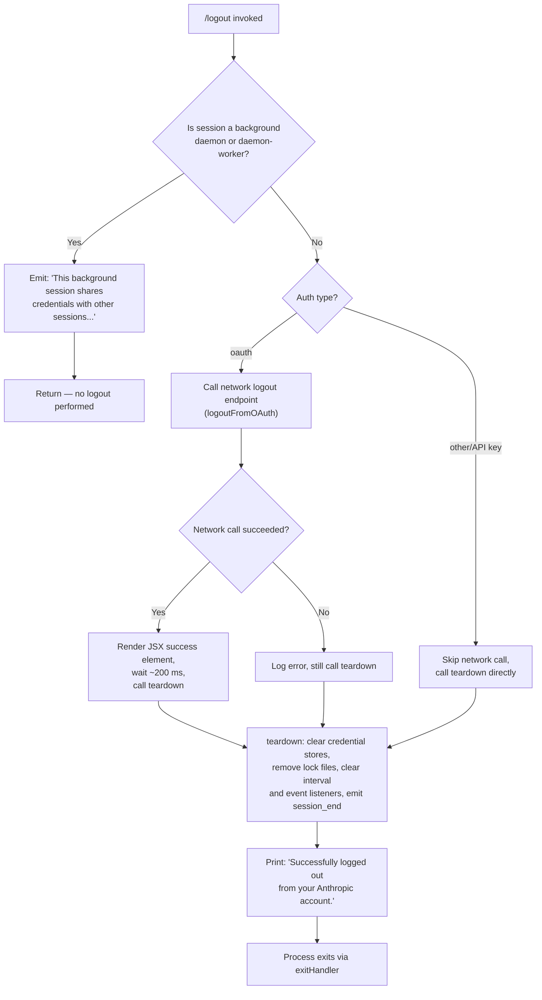

# `/logout`

> Analysis basis: CC v2.1.144 bundle.js (AST extraction + Claude interpretation)
> Minimum version: v2.1.144

---

## Overview

The `/logout` command signs the current user out of their Anthropic account by clearing OAuth credentials, revoking the active session via a network call, and tearing down all session-related state. In background (daemon/daemon-worker) sessions the command is a no-op and emits an informational message instead, because those sessions share credentials with the originating terminal.

---

## Registration

| Field | Value |
|---|---|
| type | `local-jsx` |
| name | `logout` |
| description | Sign out from your Anthropic account |
| loc_byte | `10694386` |
| loc_byte_end | `10694574` |
| loc_line | `6331` |
| module_id | `UZ9` |
| load_inline | `true` |
| arbor_handler.name | `xb4` |
| arbor_handler.fqn | `claude-2.1.144::xb4` |
| arbor_handler.kind | `AsyncFunction` |
| arbor_handler.resolution_path | `module_id` |
| arbor_handler.n_hits | `0` |

Analysis basis: CC v2.1.144 bundle.js:+10694386

---

## Input Branching

Three distinct execution paths exist based on session context and auth type, so a Mermaid flowchart is used.



Analysis basis: CC v2.1.144 bundle.js:+7419017 (handler entry `xb4`), +7419071 (`oauth` branch literal), +7419127 (background-session guard literal)

---

## Behavioral Spec

### 1. Handler Entry — `logoutHandler` (`xb4`)

The Arbor-resolved handler is an `AsyncFunction` reached via `module_id → UZ9`.

```
async function logoutHandler(commandInput):
    sessionType = getSessionType()          // reads G9 → JMH
    authType    = getAuthType()             // normalises via toLowerCase (A)

    if sessionType in {"bg", "daemon", "daemon-worker"}:
        renderMessage(
            "This background session shares credentials …"
        )
        return                              // early exit, no state mutation

    if authType == "oauth":
        try:
            await performOAuthLogout()      // zgH → OE + $L
        catch err:
            logError(err)

    await runFullTeardown()                 // FD6
    renderSuccessMessage(
        "Successfully logged out from your Anthropic account."
    )
    scheduleExit(delayMs=200)               // setTimeout at +7419389
```

Analysis basis: CC v2.1.144 bundle.js:+7419017, +7419040 (`"logout"` literal), +7419071 (`"oauth"` literal), +7419127 (background guard string), +7419326 (success string), +7419389 (setTimeout)

---

### 2. Session-Type Guard

```
function isBackgroundSession(sessionType):
    // literals: "bg", "daemon", "daemon-worker"
    return sessionType in {"bg", "daemon", "daemon-worker"}
```

The guard consults the current process role (`G9` → `JMH`). Background sessions share credentials with the foreground terminal session; mutating credentials from them would silently affect all other sessions.

Analysis basis: CC v2.1.144 bundle.js:+2171033 (`"bg"`), +2171043 (`"daemon"`), +2171057 (`"daemon-worker"`)

---

### 3. OAuth Logout Network Call — `performOAuthLogout` (`zgH`)

```
async function performOAuthLogout():
    userId   = getAttribute("user.id")     // OE → GH
    headers  = buildAuthHeaders()          // $L → aV8
    response = await httpPost(logoutEndpoint, headers)

    // $L iterates Object.entries of token store
    // emits "A.emit" to signal credential invalidation
    // clears token fields
    clearTokenStore()
```

HTTP error classification follows the same taxonomy used elsewhere: `401`/`403` → `"auth"`, `ECONNABORTED` → `"timeout"`, `ECONNREFUSED`/`ENOTFOUND` → `"network"`, others → `"http"` or `"other"`.

Analysis basis: CC v2.1.144 bundle.js:+4889313 (`OE`), +4889330 (`$L`), +4888490 (`A.emit`), +172834 (401), +172843 (403), +172898 (`ECONNABORTED`)

---

### 4. Full Teardown — `runFullTeardown` (`FD6`)

`FD6` is the comprehensive session teardown routine called unconditionally after the network step.

```
async function runFullTeardown():
    // Step 1 — close active subprocess handles (f → A.close, q.close)
    closeAllSubprocesses()

    // Step 2 — remove lock / socket files (q → t_K.unlinkSync)
    removeLockFiles()

    // Step 3 — clear credential and config caches
    clearCredentialCache()    // Pn6 → oD1.clear
    resetConfigState()        // BD6 sub-steps: ez6, Xn6, w$H

    // Step 4 — shut down connection manager (x0H)
    //   · clears intervals: Q1_ → clearInterval
    //   · removes process listeners: process.removeListener ("beforeExit", "exit")
    //   · process.off
    //   · clears sets: T$H, Zr6, K56, m1_, vF
    shutdownConnectionManager()

    // Step 5 — unlink session / socket paths (yD9 → pZH.unlink)
    unlinkSessionFiles()

    // Step 6 — flush and clear telemetry pipeline (y$_ → V$_ → clearTimeout)
    flushTelemetry()
    clearTelemetryTimers()

    // Step 7 — save global config with lock (m__ → Lw1 → t6)
    //   · acquires file lock (lock acquisition warn threshold: 60 000 ms)
    //   · backs up config before writing (keeps last 5 backups)
    //   · uses sha256/hex hash for integrity check
    saveGlobalConfigWithLock()

    // Step 8 — flush credential store (hK → lH1)
    //   · writes secure_storage_credentials_write telemetry on success
    //   · falls back to plaintext if primary store fails (plaintext_fallback_used)
    flushCredentialStore()

    // Step 9 — record oauth_logout event (RH, literal "oauth_logout" at +7418798)
    recordLogoutAuditEvent("oauth_logout")
```

Analysis basis: CC v2.1.144 bundle.js:+7418229 (`Promise.resolve`), +7418259 (`E0_`), +7418280 (`A`), +7418296 (`BD6`), +7418385 (`hK`), +7418795 (`RH`), +7418798 (`"oauth_logout"`), +3145539 (clears), +3146077 (`clearInterval`), +3146135 (`"beforeExit"`)

---

### 5. Config Persistence — `saveGlobalConfigWithLock` (`t6` / `K9_`)

```
function saveGlobalConfigWithLock():
    lockPath = buildLockPath()

    if lockAcquisitionTimeMs > 60_000:
        emitTelemetry("tengu_config_lock_contention")

    // Safety check: refuse to overwrite if re-read config is missing
    // auth that the in-memory cache has (GH #3117 guard)
    if freshRead.missingAuth and cache.hasAuth:
        log("saveGlobalConfig fallback: re-read config is missing auth …")
        emitTelemetry("tengu_config_stale_write")
        return

    backupDir = join(configDir, "backups")
    rotate(backupDir, keepCount=5)          // keep only 5 newest backups

    atomicWriteFile(configPath, newContent, permissions=0o600 /* 384 dec */)
```

Lock timeout ceiling: 60 000 ms (bundle.js:+3165568).  
Backup rotation ceiling: 5 files (bundle.js:+3165817).  
File permissions: `0o600` / 384 decimal (bundle.js:+3166099).

Analysis basis: CC v2.1.144 bundle.js:+3164887 (`tengu_config_lock_contention`), +3165023 (`tengu_config_stale_write`), +3165214 (GH #3117 guard string), +3165568, +3165817, +3166099

---

### 6. Credential Store Flush — `flushCredentialStore` (`lH1`)

```
async function flushCredentialStore():
    // Attempt primary (keychain / secure storage) write
    try:
        await primaryStore.write(credentials)
        trackEvent("secure_storage_credentials_write", outcome="primary_transient_skip_fallback")
    catch primaryErr:
        // Fall back to plaintext
        try:
            await plaintextFallback.write(credentials)
            trackEvent("secure_storage_credentials_write", outcome="plaintext_fallback_used")
        catch fallbackErr:
            trackEvent("secure_storage_credentials_write", outcome="primary_and_fallback_failed")
            throw
```

Analysis basis: CC v2.1.144 bundle.js:+2199432 (`"secure_storage_credentials_write"`), +2199530 (`"primary_transient_skip_fallback"`), +2199679 (`"plaintext_fallback_used"`), +2199782 (`"primary_and_fallback_failed"`)

---

### 7. Exit Rendering — `renderAndExit` (`GK`)

```
function renderAndExit(successMessage):
    // Render JSX element (Z0_.createElement at +7419301)
    element = createElement(SuccessBox, {message: successMessage})
    mount(element)

    // After ~200 ms unmount and flush stdout (KZH)
    setTimeout(() => {
        unmount()
        flushStdout()
        exitProcess()       // rD_ → process.exit
    }, delayMs=200)
```

Delay constant: 200 ms (bundle.js:+7419421).

Analysis basis: CC v2.1.144 bundle.js:+7419301, +7419389, +7419405 (`GK`), +7419421 (200 ms literal), +5248012 (`process.exit`)

---

## State & Side Effects

| Item | Detail |
|---|---|
| Telemetry — config lock contention | `tengu_config_lock_contention` emitted when lock acquisition exceeds 60 000 ms (bundle.js:+3164887) |
| Telemetry — stale config write | `tengu_config_stale_write` emitted when the re-read config is missing auth the cache has (bundle.js:+3165023) |
| Telemetry — config parse error | `tengu_config_parse_error` (bundle.js:+3167468) |
| Telemetry — auth loss prevented | `tengu_config_auth_loss_prevented` (bundle.js:+3165366) |
| Telemetry — feature flag ok/bad/sad | `tengu_feature_ok`, `tengu_feature_bad`, `tengu_feature_sad` (bundle.js:+955520, +955578, +955653) |
| Telemetry — daemon config reload | `tengu_daemon_config_reload` (bundle.js:+14556317) |
| Telemetry — startup perf | `tengu_startup_perf` (bundle.js:+211456) |
| Telemetry — scroll summary | `tengu_scroll_summary` (bundle.js:+5248880) |
| Telemetry — pewter brook | `tengu_pewter_brook` (bundle.js:+3336890) |
| Telemetry — cache eviction hint | `tengu_cache_eviction_hint` (bundle.js:+5249913) |
| Audit event | `"oauth_logout"` recorded to audit log via `RH` (bundle.js:+7418798) |
| Credential cache | `oD1.clear()` called via `Pn6` — in-memory credential cache wiped (bundle.js:+2907954) |
| Secure storage | Keychain entry for `"claude-code-user"` deleted; `"Failed to delete keychain entry"` logged on error (bundle.js:+2041307, +2042040) |
| Lock files | Socket/lock file unlinked via `t_K.unlinkSync` (bundle.js:+14520889) |
| Session socket | Session socket path removed via `pZH.unlink` (bundle.js:+6612608) |
| Telemetry pipeline timers | `clearTimeout` called in `V$_` (bundle.js:+4638891); telemetry socket unlinked via `I$6.unlink` (bundle.js:+4643950) |
| Process listeners | Removed: `"exit"`, `"beforeExit"` via `process.removeListener` / `process.off` (bundle.js:+3146112, +3145420) |
| Internal Sets cleared | `T$H`, `Zr6`, `K56`, `m1_`, `vF` (bundle.js:+3145539–+3145587) |
| Config file | Written atomically with permissions `0o600`; up to 5 rotating backups preserved in `backups/` subdirectory |
| Process exit | `process.exit()` called approximately 200 ms after success message renders (bundle.js:+5248012, +7419421) |
| Sound | <!-- TODO: not found in depth-2 traversal; needs --depth 4 --> |

---

## Version History

| Version | Change |
|---|---|
| v2.1.144 | Initial analysis |

---

## Common Mistakes

1. **Running `/logout` from an IDE background terminal** — If Claude Code is running in a `daemon` or `daemon-worker` session (e.g. an embedded IDE terminal), `/logout` will print an informational message and do nothing. You must run `/logout` from the primary interactive terminal where the main session is active.

2. **Expecting an instant credential wipe** — The command performs several async steps (network revocation, config save with lock, credential store flush) before exiting. Interrupting the process mid-way (e.g. `Ctrl-C`) may leave credentials partially cleared. Always wait for the success message.

3. **Assuming API-key auth uses the same code path** — Only `oauth` auth type triggers the network logout call. If the session is authenticated via a raw API key, the network step is skipped; only local state is cleared.

4. **Conflicting concurrent Claude Code instances** — The config lock contention warning fires when another Claude Code instance holds the config lock for more than 60 seconds. Running `/logout` while another long-running instance is active may delay the process noticeably.

5. **Keychain deletion failures silently allowed** — If the OS keychain rejects the deletion (e.g. locked screen, permission denied), the error is logged but logout still completes using the plaintext fallback path. The keychain entry may persist until the next login.

---

## Appendix — Identifier Mapping

> For bundle debugging only. Identifiers change across versions.

| Identifier | Role |
|---|---|
| `xb4` | Main logout handler (`AsyncFunction`, Arbor-resolved entry point) |
| `FD6` | Full session teardown coordinator |
| `BD6` | Credential / connection state reset sub-routine |
| `G9` | Session-type reader (returns bg / daemon / daemon-worker / interactive) |
| `JMH` | Session-type value resolver |
| `A` | Auth-type normaliser (calls `toLowerCase`) |
| `f` | Subprocess handle wrapper (`.close` / `.finally`) |
| `q` | File-system / lock handle (`.close`, `unlinkSync`, `readFileSync`, etc.) |
| `L` | Async task queue manager (`.add`, `.delete`, `.finally`) |
| `Pn6` | Credential cache clear (`oD1.clear`) |
| `ez6` | Connection state reset sub-step 1 |
| `Xn6` | Connection state reset sub-step 2 |
| `w$H` | Connection state reset sub-step 3 |
| `x0H` | Connection manager shutdown |
| `Cs` | Connection string builder |
| `xH` | String coercion helper |
| `IF` | Internal flag checker |
| `DpH` | Interval / listener teardown |
| `Q1_` | `clearInterval` + `process.removeListener` wrapper |
| `kH` | Error log writer |
| `b_` | Error constructor wrapper |
| `Aq` | Essential-traffic classifier |
| `bkK` | Queue shift/push helper (`ER6`) |
| `yD9` | Session socket / file cleanup |
| `hD9` | Session file path builder |
| `ej_` | Session file removal helper |
| `ewA` | Async file unlink wrapper |
| `l_H` | Path join helper |
| `x16` | Path normalisation utility |
| `y$_` | Telemetry pipeline shutdown |
| `V$_` | Telemetry timer clearTimeout wrapper |
| `S$_` | Telemetry batch flusher |
| `f68` | Telemetry socket path builder |
| `No` | No-op / stub used during teardown sequencing |
| `m__` | Config save orchestrator (calls `Lw1` + `t6`) |
| `Lw1` | Config write-with-lock outer wrapper |
| `$lA` | Config path / hash builder |
| `iV` | Path normalisation + sha256 hashing |
| `zX` | Config value serialiser |
| `vE` | OS user-info reader (`gB6.userInfo`) |
| `v` | Telemetry event emitter / HTTP client |
| `vfK` | HTTP request builder |
| `H` | Random / timer utility (also used as generic local var) |
| `CH` | `JSON.stringify` wrapper |
| `_` | Path / string utility (generic) |
| `x4` | URL / path segment extractor |
| `YhH` | Header builder helper |
| `yfK` | File write utility (atomic) |
| `GH` | `String(…)` coercion wrapper |
| `t6` | Config file read-and-write-with-lock implementation |
| `K9_` | Atomic config writer with backup rotation |
| `m6` | `fs.mkdirSync` / directory-ensure helper |
| `UH1` | Config object merger (`Object.assign`) |
| `d` | Generic data / state accessor |
| `A8` | File stat / existence checker |
| `V$H` | Config file read / parse / validate |
| `w56` | Config schema validator |
| `L9_` | Backup path builder |
| `V` | Active connection object |
| `P` | SDK connection handler |
| `Z` | Supervisor / renderer object |
| `aA6` | Atomic file write (temp + rename, fchmod, fsync) |
| `PpH` | Process environment reader |
| `WV1` | `Object.entries` iterator wrapper |
| `WpH` | `Date.now` timestamp wrapper |
| `q9_` | Config backup path writer |
| `Po8` | Post-save callback |
| `hK` | Credential store flush orchestrator |
| `lH1` | Secure storage read/write with fallback |
| `U2H` | Primary keychain write attempt |
| `a3L` | Storage async-local-storage context runner |
| `RH` | Audit / feature-ok event recorder (`tengu_feature_ok`) |
| `K8` | Feature-sad recorder (`tengu_feature_sad`) |
| `bH` | Feature-bad recorder (`tengu_feature_bad`) |
| `qXH` | Miscellaneous shutdown hook |
| `zgH` | OAuth logout HTTP caller |
| `OE` | OAuth user-ID attribute reader |
| `$L` | OAuth token store clearer / event emitter |
| `aV8` | Auth header builder |
| `OgH` | OTEL metrics attribute setter |
| `cu` | Random-bytes session-ID generator |
| `I6` | Internal flag / WeakRef helper |
| `QO_` | String-coerce helper for OTEL |
| `f5` | Key-join helper |
| `Sa1` | OTEL attribute pair builder |
| `E88` | OTEL attribute object freeze helper |
| `bH6` | Token-store field iterator |
| `GK` | Render-and-exit orchestrator |
| `u1` | Full render / exit sequencer |
| `K` | Column formatter (`padEnd`) |
| `KZH` | Stdout flush + unmount helper |
| `DS` | Drain helper |
| `_s6` | Terminal write-sync helper |
| `iD_` | Pre-exit info display (path / version info) |
| `TV` | Terminal type detector |
| `qR` | Raw terminal mode getter |
| `Lz6` | Config-dir stat checker |
| `n3` | DL / I6 flag toggler |
| `b99` | Escape-sequence builder |
| `rD_` | Process-exit executor (`process.exit` / `process.kill SIGKILL`) |
| `USH` | stdout drain awaiter |
| `Y` | Renderer supervisor (stop / updateConfig / start) |
| `dJH` | Supervisor message dispatcher |
| `_Nq` | Column-width calculator |
| `T` | Input event interceptor (`preventDefault`) |
| `vAK` | Heartbeat helper |
| `l66` | Startup-perf + telemetry flush |
| `eN8` | Telemetry batch writer |
| `w_A` | Telemetry file-path builder |
| `EA8` | Scroll-summary emitter |
| `C99` | Scroll stat collector |
| `R99` | Scroll metric calculator (`Date.now`, `Math.max`, `Math.round`) |
| `aA` | Terminal mode / fullscreen detector |
| `wH6` | Cache-eviction-hint emitter |
| `ZA8` | Promise.race / session-end sequencer |
| `r8` | Abort-timeout helper |

---

Note: index built via Arbor fallback; some signals (telemetry, literals) may be missing — see arbor-fallback.js.