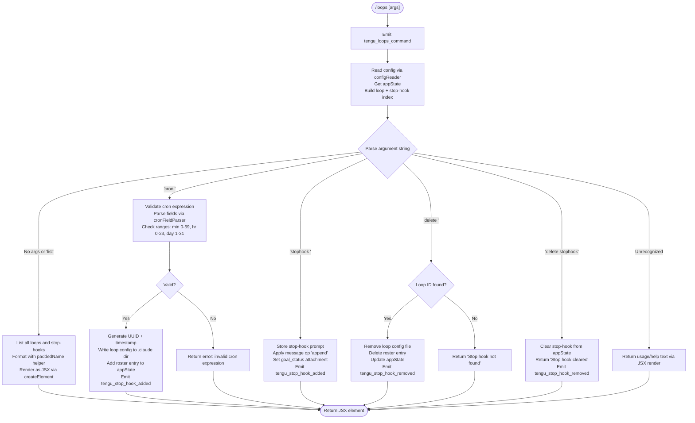

# `/loops`

> Analysis basis: CC v2.1.144 bundle.js (AST extraction + Claude interpretation)
> Minimum version: v2.1.144

---

## Overview

`/loops` is a management interface for **recurring loops** and **stop-hooks** within Claude Code's background-session daemon system. It enables users to list active loops (scheduled recurring agent invocations), create new cron-style loops or stop-hooks, and delete existing ones — all from within an interactive session. The command interacts directly with appState, daemon roster entries, and the filesystem-backed loop configuration store.

---

## Registration

| Field | Value |
|---|---|
| type | `local-jsx` |
| name | `loops` |
| description | `List, create, and delete recurring loops and stop-hooks` |
| loc_byte | `11504710` |
| loc_byte_end | `11504892` |
| loc_line | `7089` |
| immediate | `true` |
| module_id | `Z0q` |
| load_inline | `true` |
| arbor_handler.name | `Ik7` |
| arbor_handler.fqn | `claude-2.1.144::Ik7` |
| arbor_handler.kind | `AsyncFunction` |
| arbor_handler.resolution_path | `module_id` |
| arbor_handler.n_hits | `0` |

Analysis basis: CC v2.1.144 bundle.js:+11504710

---

## Input Branching

The command parses its argument string and dispatches across five or more distinct branches (list, create-cron, create-stophook, delete-loop, delete-stophook, and error cases), satisfying the ≥3 branch threshold.



Analysis basis: CC v2.1.144 bundle.js:+11503667 (handler entry), +11503764 (`"cron"` literal), +11503850 (`"stophook"` literal), +11504109 (`"Stop hook not found"`), +11504131 (`"Stop hook cleared"`)

---

## Behavioral Spec

### 1. Handler Entry and Telemetry

```
async function loopsCommandHandler(args, context):
    emit telemetry("tengu_loops_command")       // always first
    config = await readConfig()                  // via configReader (tTH)
    appState = context.getAppState()
    loopIndex = buildLoopIndex(config, appState) // via indexBuilder (GoH)
    stopHookIndex = buildStopHookIndex(appState)
    subcommand, rest = parseArgs(args)
    dispatch(subcommand, rest, loopIndex, stopHookIndex, context)
```

Analysis basis: CC v2.1.144 bundle.js:+11503667, +11503707, +11503714, +11503718

---

### 2. Config Reader (`tTH`)

```
async function readConfig(projectPath):
    configDir = path.join(projectPath, ".claude")  // ".claude" literal
    raw = await fs.readFile(configDir, "utf-8")     // "utf-8" literal
    parsed = jsonParse(raw)
    validated = validateSchema(parsed)              // via schemaValidator (C1)
    hooks = extractHooks(validated)                 // via hookExtractor (kH)
    return { hooks, validated }
```

File-not-found and permission errors (`ENOENT`, `EACCES`, `EPERM`, `ENOTDIR`, `ELOOP`, `EROFS`) are handled gracefully; the config is treated as empty in those cases.

Analysis basis: CC v2.1.144 bundle.js:+4717531 (`_.readFile`), +4717559 (`"utf-8"`), +4717581 (schemaValidator), +4717603 (hookExtractor)

---

### 3. Cron Expression Parser (`sE` / `Vk7`)

The cron parser accepts a 5-field POSIX-style cron string and validates each field's numeric range. It also produces a human-readable description for display.

```
function parseCronExpression(cronStr):
    trimmed = cronStr.trim()
    fields = trimmed.split(" ")          // 5 expected fields
    validate each field:
        minutes:  0–59   (max 59)        // literal: 59
        hours:    0–23   (max 23)        // literal: 23
        days:     1–31   (max 31)        // literal: 31
        month:    1–12
        weekday:  0–7

    if all fields == "*":
        description = "Every minute"    // literal
    elif minutes == "*" and others == "*":
        description = "Every hour"      // literal

    // Numeric computation uses Math.max, Math.ceil, Math.round
    // Range check uses parseInt with base 10

    return { valid: true, fields, description }

function parseCronField(fieldStr):
    // supports ranges "1-5", lists, and wildcards
    match = fieldStr.match(rangePattern)   // range literal "1-5" present
    if match: collect Set of integers via K.add
    return Array.from(collectedSet)
```

Analysis basis: CC v2.1.144 bundle.js:+11503377 (`Math.max`), +11503400 (60), +11503434 (59), +11503505 (23), +11503558 (31), +4715303 (`H.trim`), +4715423 (`"Every minute"`), +4715640 (`"Every hour"`), +4716347 (`"1-5"`)

---

### 4. Loop Index Builder (`GoH`)

```
function buildLoopIndex(config, appState):
    result = Map()
    for each entry in config.loops:
        paddedName = entry.name.padEnd(40, " ")   // pad width: 40
        result.set(paddedName, entry)
    return result
```

Analysis basis: CC v2.1.144 bundle.js:+9917418, +14565381 (`f.padEnd`), +14567373 (40)

---

### 5. Create Loop (`dFH`)

```
async function createLoop(cronExpr, promptText, context):
    id = crypto.randomUUID()              // via vi1.randomUUID
    timestamp = Date.now()                // literal: 8-char hex prefix
    validated = parseCronExpression(cronExpr)
    if not validated.valid: return error

    loopEntry = {
        id,
        type: "cron",                    // literal
        schedule: cronExpr,
        prompt: promptText,
        createdAt: timestamp
    }

    await writeLoopConfig(loopEntry)     // via configWriter (QFH)
    context.applyMessageOp("append", {
        role: "system",                  // literal
        type: "goal",                    // literal
        goal_status: "goal_set"          // literal
    })
    emit telemetry("tengu_stop_hook_added")
    return renderSuccess(loopEntry)
```

Analysis basis: CC v2.1.144 bundle.js:+11504315, +4718859 (`vi1.randomUUID`), +4718921 (`Date.now`), +11503764 (`"cron"`), +9917746 (`"goal_set"`), +9918104 (`tengu_stop_hook_added`)

---

### 6. Config Writer (`QFH`)

```
async function writeLoopConfig(entry, projectPath):
    dir = path.join(projectPath, ".claude")   // literal ".claude"
    await fs.mkdir(dir, { recursive: true })
    filePath = path.join(dir, entryFileName)
    content = JSON.stringify(entry)           // via CH (JSON serializer)
    await fs.writeFile(filePath, content)
    // Updates internal config cache (g9H)
```

Analysis basis: CC v2.1.144 bundle.js:+4718668, +4718679 (`u68.mkdir`), +4718700 (`".claude"`), +4718776 (`u68.writeFile`)

---

### 7. Create Stop-Hook (`EoH` / `ToH`)

```
async function createStopHook(promptText, context):
    appState = context.getAppState()
    newId = crypto.randomUUID()            // via q9q → H9q.randomUUID

    context.setAppState({
        ...appState,
        stopHook: { id: newId, prompt: promptText }
    })
    context.applyMessageOp("append", {    // "append" literal
        type: "attachment",               // "attachment" literal
        goal: promptText,                 // "goal" literal
        goal_status: "goal_set"
    })
    emit telemetry("tengu_stop_hook_added")
    return renderMessage("Stop hook set")  // literal
```

Analysis basis: CC v2.1.144 bundle.js:+9918005 (`_.setAppState`), +9918415 (`_.applyMessageOp`), +9918438 (`"append"`), +9918503 (`"goal"`), +9918544 (`"attachment"`), +11504427 (`"Stop hook set"`), +9918104 (`tengu_stop_hook_added`)

---

### 8. Delete Loop / Stop-Hook (`EoH` / `ToH`)

```
async function deleteLoopOrStopHook(id, context):
    if id == "stophook":
        appState = context.getAppState()
        clear appState.stopHook
        context.setAppState(appState)
        context.applyMessageOp("append", { type: "goal_status", ... })
        emit telemetry("tengu_stop_hook_removed")
        return renderMessage("Stop hook cleared")   // literal

    else:
        loop = loopIndex.get(id)
        if not loop:
            return renderMessage("Stop hook not found")  // literal
        await deleteLoopFile(loop)
        context.applyMessageOp("append", { ... })
        emit telemetry("tengu_stop_hook_removed")
        return renderSuccess()
```

Analysis basis: CC v2.1.144 bundle.js:+11504109 (`"Stop hook not found"`), +11504131 (`"Stop hook cleared"`), +9918472 (`tengu_stop_hook_removed`), +9918631 (`"goal_status"`)

---

### 9. Listing (`Ik7` dispatch branch)

```
function listLoopsAndHooks(loopIndex, appState):
    rows = []
    for loop in loopIndex.values():
        row = formatLoop(loop)    // padEnd(40), type "cron" or "stophook"
        rows.push(row)

    if appState.stopHook exists:
        rows.push(formatStopHook(appState.stopHook))

    return createElement(ListComponent, { rows })
```

Analysis basis: CC v2.1.144 bundle.js:+11503746 (`A.map`), +11503830 (`q.map`), +11503953, +11504470 (`sB_.createElement`)

---

### 10. Cron Schedule Validation (field ranges)

| Field | Min | Max | Notes |
|---|---|---|---|
| Minutes | 0 | 59 | `parseInt` base-10 |
| Hours | 0 | 23 | |
| Day of month | 1 | 31 | |
| Month | 1 | 12 | |
| Weekday | 0 | 7 | 0 and 7 both = Sunday |
| Range syntax | — | — | `"1-5"` style supported |

Analysis basis: CC v2.1.144 bundle.js:+11503400, +11503434, +11503505, +11503558, +4716347

---

### 11. Background Daemon Interaction

The loop system is deeply coupled to Claude Code's background daemon. When a loop fires:

```
function dispatchLoopRun(loopEntry, daemonContext):
    worker = acquireSpareWorker()           // via spareClaimHandler (Ea_)
    if not worker:
        fallback to direct spawn            // via Ta_ (spareSpawner)

    claim = buildClaimFrame(loopEntry)      // TL5 → DU.buildClaimFrame
    socket = net.connect(daemonSocket)      // dE8.connect
    send(claim, socket)                     // dp (framePacker)

    on timeout (5000 ms):                   // literal: 5000
        throw Error("send-claim timeout")   // literal

    on ECONNREFUSED:
        retry after 500 ms                  // literal: 500
```

Spare worker state machine values: `"spare"`, `"exec"`, `"done"`, `"killed"`, `"stopped"`, `"failed"`, `"crashed"`, `"blocked"`, `"working"`, `"bg"`, `"daemon"`, `"idle"`, `"resuming"`.

Analysis basis: CC v2.1.144 bundle.js:+14523163 (`DU.claim`), +14523620 (`TL5`), +14523466 (`dE8.connect`), +14523740 (5000), +14523796 (`"send-claim timeout"`), +14523888 (`"ECONNREFUSED"`), +14523944 (500), +14542848 (`"spare"`), +14547578 (`"daemon"`)

---

### 12. Memory and Resource Guards

```
function checkMemoryBeforeDispatch():
    freeMem = os.freemem()                      // nE8.freemem
    if platform == "macos":
        threshold = 1024 MB                     // literal: 1024
    if freeMem < threshold:
        emit telemetry("tengu_bg_dispatch_low_mem")
        escalate to SIGKILL if needed           // "SIGKILL" literal
        emit telemetry("tengu_bg_dispatch_sigkill_escalate")
```

Idle timeout: 300,000 ms (5 minutes) before a spare daemon exits with `tengu_daemon_idle_exit`.

Analysis basis: CC v2.1.144 bundle.js:+11995342 (`"macos"`), +11995391 (1024), +14542134 (`tengu_bg_dispatch_sigkill_escalate`), +14542182 (`"SIGKILL"`), +14548316 (300000), +14561318 (`tengu_daemon_idle_exit`)

---

## State & Side Effects

| Item | Detail |
|---|---|
| Telemetry | `tengu_loops_command` (on every invocation); `tengu_stop_hook_added` (create); `tengu_stop_hook_removed` (delete); `tengu_bg_dispatch_sigkill_escalate`; `tengu_daemon_control`; `tengu_bg_dispatch_low_mem`; `tengu_bg_low_mem_mb`; `tengu_daemon_idle_exit`; `tengu_bg_spare_enable`; `tengu_bg_sendclaim_failed`; `tengu_daemon_config_reload`; `tengu_bg_spare_claim`; `tengu_bg_spare_spawn`; `tengu_bg_spare_claim_fail`; `tengu_daemon_yield`; `tengu_bg_spare_refill`; `tengu_daemon_bg_session_create`; `tengu_feature_ok`; `tengu_feature_bad`; `tengu_feature_sad` |
| Filesystem | Writes/deletes loop config JSON under `<project>/.claude/` |
| appState changes | `stopHook` field set/cleared; roster entries updated via `_.rosterEntry`; `setAppState` called on create/delete |
| Message ops | `applyMessageOp("append", ...)` with `attachment`, `goal`, `goal_status` types |
| Daemon socket | `net.connect` to daemon IPC socket when dispatching loop runs |
| Hook registration | `immediate: true` — executes synchronously without waiting for agent turn |
| Sound | None observed in depth-2 traversal |

---

## Version History

| Version | Change |
|---|---|
| v2.1.144 | Initial analysis |

---

## Common Mistakes

1. **Missing cron fields**: The cron expression must have exactly 5 space-separated fields. Fewer or more will fail the field-range validation silently.
2. **Deleting by wrong identifier**: Use the exact loop ID (UUID) shown in the list output; the string `"stophook"` is a special keyword reserved for clearing the stop-hook, not a loop name.
3. **Confusing loops and stop-hooks**: `cron` type loops recur on a schedule; `stophook` fires once at session stop. They are stored and deleted differently.
4. **Stale spare worker pool**: If the daemon is not running, `/loops` create may stall waiting for `send-claim` up to 5 seconds before raising a timeout error.
5. **Weekday range**: Both `0` and `7` represent Sunday in the cron parser; using `8` or above will fail range validation.
6. **Config file permissions**: `EACCES`/`EPERM` on the `.claude` directory causes the command to treat config as empty — loops may appear to vanish after a permissions change.

---

## Appendix — Identifier Mapping

> For bundle debugging only. Identifiers change across versions.

| Identifier | Role |
|---|---|
| `Ik7` | Main async handler for `/loops` command (arbor_handler) |
| `d` | Low-level utility / logger (called at handler entry) |
| `tt` | Config + metadata initializer |
| `tTH` | Config file reader (reads `.claude` dir, validates schema) |
| `m6` | Path utilities helper |
| `g9H` | Config cache / path resolver |
| `oK` | Config object factory |
| `C1` | Schema validator |
| `A8` | Generic async utility |
| `kH` | Hook extractor / hook list builder |
| `b_` | Error wrapper |
| `xH` | String coercion helper |
| `Aq` | Essential-traffic filter |
| `bkK` | Ring-buffer queue (shift/push) |
| `v` | File content processor / message formatter |
| `vfK` | File read pipeline |
| `H` | Random/timer utility; also used as generic variable |
| `CH` | JSON serializer wrapper |
| `x4` | Path token extractor |
| `YhH` | Hash/encoding helper |
| `yfK` | File writer with byte-length check |
| `CI` | Cron-field set parser |
| `dA4` | Cron token splitter (split, match, parseInt) |
| `A` | Generic array/map variable |
| `L` | Promise/lifecycle wrapper |
| `q` | Pending-set tracker |
| `f` | Connection/file handle variable |
| `ME` | Config merge helper |
| `WV` | Base config/defaults object |
| `GoH` | Loop index builder (builds padded name map) |
| `cDH` | Loop map setter |
| `K` | Map / accumulator variable |
| `Id9` | Map transform helper |
| `I6` | Session identity resolver |
| `sE` | Cron expression parser and human-readable description generator |
| `w` | Background worker / spare-pool manager |
| `C` | Worker process controller |
| `yAK` | Filesystem realpath+stat helper |
| `iL5` | PTY host bridge helper |
| `z` | Daemon write stream |
| `bH` | Feature-bad telemetry emitter |
| `RH` | Feature-ok telemetry emitter |
| `fT6` | Memory threshold calculator |
| `P6` | Spare pool policy engine |
| `x` | Retire-if-settled timeout manager |
| `h` | Timeout/ref handle |
| `u` | Timer unref wrapper |
| `Ea_` | Spare worker claim sender (IPC socket) |
| `yc_` | Claim frame writer (mkdir + writeFile) |
| `EL5` | Send-claim timeout enforcer (5000 ms) |
| `TL5` | Claim frame builder (DU.buildClaimFrame) |
| `GH` | String coercion helper (String()) |
| `dp` | IPC frame packer (Buffer.allocUnsafe + writeUInt32BE) |
| `ka_` | Full spare worker lifecycle manager |
| `PK` | Temp path constructor |
| `B9` | Loop config file reader (stat + readFile + cache) |
| `wJ` | Worker state transition to "active" |
| `v5` | Config path builder (fz + BX.join) |
| `roH` | Watcher/retry hook |
| `RLH` | Roster path resolver |
| `dk` | Roster entry parser (split on path) |
| `rp` | Roster writer |
| `cW6` | Roster directory initializer (mkdir) |
| `Y` | Daemon config-reload manager |
| `D` | Worker disposal and restart scheduler |
| `$` | Disposable handle |
| `Ta_` | Spare daemon spawner (Bun.spawn, randomBytes) |
| `J` | Running-process registry iterator |
| `y` | Worker kill helper |
| `j` | Date/weekday calculator |
| `st` | Stop-hook read/filter entry |
| `yo` | Stop-hook existence checker |
| `QFH` | Loop config writer (.claude dir + writeFile) |
| `EoH` | Stop-hook create handler (setAppState + applyMessageOp) |
| `q9q` | UUID generator wrapper (H9q.randomUUID) |
| `Vk7` | Cron expression validator + range checker |
| `dFH` | Loop create handler (UUID + Date.now + QFH) |
| `KXH` | Loop entry schema builder |
| `M` | MCP server / background session manager |
| `dvH` | MCP connection dispatcher |
| `he` | MCP tool descriptor builder |
| `FI` | MCP protocol framer |
| `H_` | Identifier normalizer |
| `P26` | MCP capability filter |
| `S77` | MCP timestamp tracker |
| `h18` | MCP key enumerator |
| `S18` | MCP state initializer |
| `H8` | MCP debug logger |
| `Ah_` | OAuth flow initiator |
| `qh_` | OAuth callback handler |
| `H8q` | MCP connection state tracker |
| `Hh_` | MCP needs-auth handler |
| `xJ_` | MCP transport selector |
| `$7` | MCP error logger |
| `a6q` | MCP connection resetter |
| `W26` | MCP retry counter parser |
| `th_` | MCP timeout parser |
| `k6K` | MCP update applicator |
| `YD8` | MCP update serializer |
| `Pv` | MCP cleanup handler |
| `vq5` | MCP server synchronizer |
| `C18` | MCP capability gate checker |
| `r8` | Retry-with-timeout utility |
| `trH` | MCP connection trace serializer |
| `Qa` | Message trimmer/sanitizer |
| `wMH` | Message body processor |
| `B_H` | Message slice and redact helper |
| `ToH` | Stop-hook delete handler (setAppState + applyMessageOp) |
| `uC_` | Policy gate checker (hooks_gate, trust_gate) |
| `iu` | Policy settings loader |
| `V8` | Policy settings reader (policySettings) |
| `MY` | Policy settings merger |
| `Z_` | Policy gate evaluator |
| `Y7` | ACL rule evaluator |
| `ACL` | Access control list engine |
| `K8` | Logger for policy decisions |
| `qX` | Output token counter |

---

Note: index built via Arbor fallback; some signals (telemetry, literals) may be missing — see arbor-fallback.js.