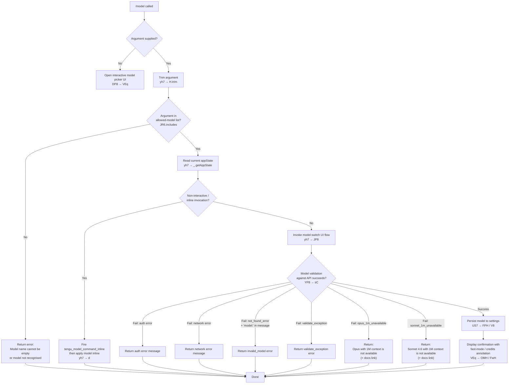

# `/model`

> Analysis basis: CC v2.1.144 bundle.js (AST extraction + Claude interpretation)
> Minimum version: v2.1.144

---

## Overview

The `/model` command lets users set or change the AI model that Claude Code uses for inference. When invoked with a model name argument, it validates the name against account-accessible models, applies the selection to application state, and—when run inline (non-interactively)—fires a dedicated telemetry event. When invoked without an argument, it opens an interactive model picker UI backed by the same validation and settings-persistence logic.

---

## Registration

| Field | Value |
|---|---|
| type | `local` |
| name | `model` |
| description | `Set the AI model for Claude Code` |
| argumentHint | `<model>` |
| supportsNonInteractive | `true` |
| module_id | `DZq` |
| load_inline | `true` |
| loc_byte | `11690163` |
| loc_byte_end | `11690337` |
| loc_line | `7240` |
| arbor_handler.name | `yh7` |
| arbor_handler.fqn | `claude-2.1.144::yh7` |
| arbor_handler.kind | `AsyncFunction` |
| arbor_handler.resolution_path | `module_id` |
| arbor_handler.n_hits | `0` |

Analysis basis: CC v2.1.144 bundle.js:+11690163

---

## Input Branching

The handler has four or more distinct paths depending on whether an argument is supplied, whether the inline/non-interactive path is taken, whether the model name is found in the allowed-model list, and whether validation against the API succeeds. A Mermaid flowchart is used.



Analysis basis: CC v2.1.144 bundle.js:+11682561 (trim), +11682577 (JR6.includes), +11682600 (getAppState), +11682719 (telemetry), +11682784 (DP8 branch), +11647872 (YP8 validation), +11645478 (empty-name error), +11648608 (settings write)

---

## Behavioral Spec

### 1. Entry Point — Main Handler (`yh7`)

```
async function modelCommandHandler(args, appContext):
    rawArg = args.trim()                           // +11682561

    if rawArg not in allowedModelIdentifiers:      // +11682577
        if rawArg is empty:
            return error("Model name cannot be empty")   // +11645478
        // fall through to interactive picker

    currentState = appContext.getAppState()        // +11682600

    if isInlineOrNonInteractive(args):
        emit telemetry("tengu_model_command_inline")  // +11682719
        return applyModelInline(rawArg, appContext)   // +11682717 (d)

    return runInteractiveModelFlow(rawArg, appContext)  // +11682784 (DP8)
```

Analysis basis: CC v2.1.144 bundle.js:+11682561

---

### 2. Interactive Model Picker (`DP8` — `interactiveModelFlow`)

The interactive flow is composed of several sub-functions:

| Sub-function (bundle id) | Descriptive role |
|---|---|
| `oB` | Build and render model option list |
| `FS7` | Handle "sonnet\[1m\]" / "sonnet-4-6\[1m\]" alias resolution |
| `gS7` | Handle generic extended-context alias resolution |
| `BS7` | Validate model against account-tier includes list |
| `VEq` | Render model selection menu and collect user choice |
| `YP8` | Validate chosen model string and perform API probe |
| `mS7` / `pS7` | Construct and display model status line |
| `GH` | Convert values to string for display |

```
function interactiveModelFlow(rawArg, appContext):
    modelList = buildModelOptionList(appContext)       // oB  +11647227
    modelList = annotateFastModeAndCredits(modelList) // bH  +11647240

    // Resolve extended-context aliases
    for each option in modelList:
        if option matches "sonnet[1m]" or "sonnet-4-6[1m]":   // +11649098, +11649124
            option = resolveExtendedContextAlias(option)       // FS7 +11647373
        elif option matches generic [1m] pattern:
            option = resolveGenericExtendedAlias(option)       // gS7 +11647590

    // Account-tier gating
    if not accountTierAllows(rawArg):                 // BS7 +11647816
        emit result("model_switch", "not_allowed")    // +11647243, +11647258
        return

    // Render picker
    choice = renderModelMenu(modelList, rawArg)        // VEq +11647844

    // Validate & persist
    result = validateAndPersistModel(choice, appContext) // YP8 +11647872
    displayModelStatusLine(result)                       // mS7 +11645971
```

Analysis basis: CC v2.1.144 bundle.js:+11647227

---

### 3. Model Option List Builder (`oB`)

```
function buildModelOptionList(appContext):
    baseList = getAvailableModels(appContext)      // qA  +2157845
    mapped   = baseList.map(formatEntry)          // A.map +2157922

    for each entry in mapped:
        entry.name = entry.name.trim()            // M.trim +2157933

        // Prefix filtering
        if entry.name.startsWith("anthropic."):   // +2157998
            entry = tagAsAnthropicProvider(entry)
        if entry.name.startsWith("claude-"):      // +2157619
            entry = tagAsClaudeModel(entry)

        // Tier membership
        if accountIncludes(entry):               // q.includes +2158013
            entry = enrichWithTierInfo(entry)    // SB6 +2158042

        // Model-family alias checks
        entry = applyFamilyAlias(entry)          // $3L, vAH, O3L, ceA

    return mapped
```

Known model family aliases visible in literals:

| Alias token | Meaning |
|---|---|
| `sonnet` | claude-sonnet family |
| `haiku` | claude-haiku family |
| `opus` | claude-opus family |
| `best` | highest-capability model |
| `opusplan` | Opus in plan mode, else Sonnet |
| `[1m]` suffix | Extended 1M-context variant |

Analysis basis: CC v2.1.144 bundle.js:+2157845 (`oB` entry), +2163893 (`sonnet`), +2163932 (`haiku`), +2163971 (`opus`), +2164008 (`best`), +2162410 (`opusplan`), +2163878 (`[1m]`)

---

### 4. Model Validation and API Probe (`YP8` — `validateAndPersistModel`)

```
async function validateAndPersistModel(modelName, appContext):
    trimmed = modelName.trim()                        // +11645441
    if trimmed is empty:
        return error("Model name cannot be empty")    // +11645478

    // Build model option list for membership check
    options = buildModelOptionList(appContext)         // oB +11645512
    lower   = trimmed.toLowerCase()                   // +11645601

    // Account-tier gate
    if not accountTierAllows(lower):                  // IAH.includes +11645620
        return error("not_allowed")

    // Cache check: skip re-validation if already validated
    if validationCache.has(lower):                    // ZEq.has +11645722
        return validationCache.get(lower)

    // API probe — send minimal request to verify model exists
    probeResult = await probeModelWithApi(lower)      // sC +11645767

    if probeResult is auth_error:
        return error("Authentication failed. Please check your API credentials.")  // +11646177
    elif probeResult is network_error:
        return error("Network error. Please check your internet connection.")      // +11646279
    elif probeResult.type == "not_found_error"
         and probeResult.message includes "model:":   // +11646398, +11646417, +11646480
        emit telemetry result("invalid_model")        // +11647916
        return error("invalid_model")
    elif probeResult is validate_exception:
        emit telemetry result("validate_exception")   // +11648024
        return error("validate_exception")

    // Extended-context availability gates
    if lower matches opus_1m_pattern:
        if not account1mAvailable():
            return error(
                "Opus with 1M context is not available for your account. " +
                "Learn more: https://code.claude.com/docs/en/model-config#extended-context-with-1m"
            )                                         // +11647405, +11647443

    if lower matches sonnet_1m_pattern:
        if not account1mAvailable():
            return error(
                "Sonnet 4.6 with 1M context is not available for your account. " +
                "Learn more: https://code.claude.com/docs/en/model-config#extended-context-with-1m"
            )                                         // +11647622, +11647662

    // Persist to settings
    validationCache.set(lower, probeResult)           // ZEq.set +11645930
    persistModelToSettings(lower)                     // mS7 → pS7 +11645971
    return success
```

Analysis basis: CC v2.1.144 bundle.js:+11645441

---

### 5. Settings Persistence (`US7` / `FPH` / `V8`)

```
function persistModelToSettings(modelName):
    // Determine settings scope (first writable wins)
    scope = detectSettingsScope()
    // Scope precedence visible in literals:
    //   "projectSettings"  (+11648624)
    //   "localSettings"    (+11648647)
    //   "policySettings"   (+11648668)
    // "policySettings" is read-only (managed); user writes go to project or local.

    if scope == "policySettings":
        display("Managed settings")                   // +11648770
        return

    // Write model field
    settingsFile = resolveSettingsPath(scope)
    // Paths visible in literals:
    //   .claude/settings.json       (+1198404, +1198414)
    //   .claude/settings.local.json (+1198404, +1198476)
    writeToJson(settingsFile, key="model", value=modelName)  // +11648608

    // Build display annotations
    annotation = ""
    if fastModeActive:
        annotation += " · Fast mode ON"              // +11648367
    if usageCreditsApply:
        annotation += " · Draws from usage credits"  // +11648418
    if not fastModeActive:
        annotation += " · Fast mode OFF"             // +11648464

    displayConfirmation(modelName + annotation)
```

Analysis basis: CC v2.1.144 bundle.js:+11648608 (model key), +11648624 (projectSettings), +11648647 (localSettings), +11648668 (policySettings), +11648770 (managed message), +11648367 (fast-mode ON)

---

### 6. Model Status Line Builder (`pS7`)

```
function buildModelStatusLine(modelName):
    label = dM(modelName)                  // dM +11646699
    lower = modelName.toLowerCase()        // +11646717

    if lower includes recognisedFamilyToken:   // +11646736
        label = formatWithFamilyLabel(label)   // wM +11646790

    return label
```

Known normalised model identifiers used as internal keys (visible in literals):

`opus_4_7` (+11646771), `opus_4_6` (+11646840), `opus-4-5` / `opus_4_5` (+11646885, +11646909), `sonnet_4_6` (+11646980), `sonnet-4-5` / `sonnet_4_5` (+11647029, +11647055)

Analysis basis: CC v2.1.144 bundle.js:+11646699

---

### 7. API Probe Helper (`sC` — `probeModelWithApi`)

```
async function probeModelWithApi(modelName):
    // Sends a minimal "Hi" ephemeral message to verify model accessibility
    // "Hi"        +11645886
    // "ephemeral" +11645911
    payload = buildMinimalRequest(
        model   = modelName,
        message = "Hi",
        cache   = "ephemeral"
    )
    response = await callAnthropicApi(payload)    // gu +12419979 / globalThis.fetch +12420064

    if response.ok:
        emit telemetry("tengu_api_success")       // +12421435
        return success

    // Map error codes
    errorCode = classifyHttpError(response)
    return errorCode
```

Analysis basis: CC v2.1.144 bundle.js:+11645767, +11645886, +11645911, +12419979, +12421435

---

## State & Side Effects

| Item | Detail |
|---|---|
| Telemetry — `tengu_model_command_inline` | Fired when `/model <name>` is run in non-interactive / inline mode (bundle.js:+11682719) |
| Telemetry — `tengu_feature_ok` | Fired on successful feature usage path inside `RH` (bundle.js:+955520) |
| Telemetry — `tengu_feature_bad` | Fired on error/unsupported path inside `bH` (bundle.js:+955578) |
| Telemetry — `tengu_prompt_cache_1h_config` | Fired when 1-hour prompt-cache config is active during API probe (bundle.js:+12381304) |
| Telemetry — `tengu_api_success` | Fired when the API probe call returns successfully (bundle.js:+12421435) |
| Settings write | Writes `"model"` key to `.claude/settings.json` or `.claude/settings.local.json` depending on scope; read-only for `policySettings` |
| Validation cache | Result of API probe is cached in `ZEq` (a Map); subsequent `/model` calls for the same model string skip re-validation (bundle.js:+11645722, +11645930) |
| appState changes | `getAppState()` is read at entry; selected model is propagated into app state after successful validation |
| Sound | None observed in traversal |
| Extended-context gate | 1M-context variants (`[1m]` suffix) are blocked with a user-facing error and docs link when the account flag is absent |

---

## Version History

| Version | Change |
|---|---|
| v2.1.144 | Initial analysis |

---

## Common Mistakes

1. **Passing an empty string** — `/model ` (with trailing space only) is caught immediately by the trim-then-empty check and returns `"Model name cannot be empty"` (bundle.js:+11645478). Always supply a non-empty model identifier.

2. **Using the `[1m]` suffix on an unsupported account** — Specifying `opus[1m]` or `sonnet-4-6[1m]` when the account does not have extended-context access yields an error with a docs link; the model is not applied. Check account capabilities before scripting these aliases.

3. **Expecting immediate persistence on a policy-managed installation** — When `policySettings` controls the model key, the command displays "Managed settings" and does not write to disk. The selection is silently a no-op for the current session.

4. **Repeating validation on every invocation** — The command caches successful API probe results in an internal Map (`ZEq`). If you call `/model claude-sonnet-4-6` twice in the same session, the second call skips the API round-trip. This is intentional but means a mid-session account change (e.g. credit exhaustion) might not be reflected until the cache is cold.

5. **Confusing alias tokens with full model IDs** — Short aliases (`sonnet`, `haiku`, `opus`, `best`, `opusplan`) are resolved internally but are distinct from the full API model IDs (e.g. `claude-sonnet-4-6`). Some aliases may resolve differently depending on plan tier.

6. **Using `/model` non-interactively without a recognised model name** — The `supportsNonInteractive: true` flag means the command can be scripted, but if the supplied name is not in the allowed-model list (`JR6`) the call returns an error rather than opening the picker.

---

## Appendix — Identifier Mapping

> For bundle debugging only. Identifiers change across versions.

| Identifier | Role |
|---|---|
| `yh7` | Main handler for `/model` command (AsyncFunction, Arbor-resolved) |
| `JP8` | Interactive model-switch UI orchestrator |
| `ph` | Model picker component renderer |
| `KK6` | Model list formatter / option builder (inner) |
| `fj` | Format single model entry for display |
| `zq` | Normalise model string (trim, lowercase, alias replace) |
| `BP` | Model option builder / account-tier enrichment |
| `e_` | Account tier resolver |
| `aB` | "max" tier handler |
| `DMH` | "team" / "default_claude_max_5x" tier handler |
| `sxH` | "enterprise" / "enterprise_usage_based" tier handler |
| `oV` | Option-value formatter (uses `dM`, `wM`) |
| `EX` | Extended model info assembler |
| `dM` | Display-model label builder |
| `JA` | String rendering helper |
| `wM` | Model display wrapper |
| `aV` | Alternative-value option formatter |
| `d` | Inline model-apply function |
| `DP8` | Interactive model flow entry (dispatches to `oB`, `bH`, `VEq`, `YP8`) |
| `oB` | Model option list builder |
| `A` | Generic array-transform / item map helper |
| `f` | File/stream handle utility |
| `M` | MCP client manager |
| `dvH` | MCP server connection dispatcher |
| `k6K` | MCP update applicator |
| `L` | Async task queue / set manager |
| `v` | API provider string builder |
| `$` | NVq wrapper / single-item resolver |
| `vq5` | MCP client-entry filter and mapper |
| `K` | List padding / display helper |
| `q` | File-unlock / delete helper |
| `SB6` | Tier-info enrichment (Object.entries based) |
| `B_` | Dependency resolver |
| `rxH` | M3L-includes membership check helper |
| `leA` | indexOf-based alias lookup |
| `$3L` | H.includes + vAH alias resolver |
| `vAH` | IAH.includes membership predicate |
| `O3L` | ceA / startsWith alias resolver |
| `ceA` | H.startsWith check |
| `bH` | Feature-flag / feature-ok gate (fires `tengu_feature_bad`) |
| `FS7` | Sonnet-1M alias resolver |
| `ue` | Model availability checker (yAH, e_, IY9) |
| `yAH` | String display helper (uses xH) |
| `IY9` | y6-based inner check |
| `gS7` | Generic extended-context alias resolver |
| `bqH` | Extended alias probe (yAH, e_, IY9) |
| `BS7` | Account-tier allowlist checker (IAH.includes) |
| `VEq` | Interactive model selection menu renderer |
| `RH` | Feature-ok recorder (fires `tengu_feature_ok`) |
| `DK` | JA + xH composite label builder |
| `xH` | String constructor wrapper |
| `OMH` | Model annotation composer |
| `AD` | Model display-line assembler (DK, BP, zq, ec) |
| `ec` | xH-based string formatter |
| `FwH` | Fast-mode annotation builder |
| `Mj` | zq + BP composite |
| `HT` | yAH-based heading formatter |
| `US7` | Settings-persistence orchestrator |
| `FPH` | Settings file writer (Ou, V8) |
| `V8` | Settings JSON write helper (Lb6, kB) |
| `vR` | Settings file path builder (pV.join) |
| `Hl` | vAH + fj + zq model label helper |
| `YP8` | Model validation + API-probe handler |
| `sC` | API probe caller (gu, fetch, caching) |
| `gu` | Core API request builder and sender |
| `X` | Buffer / stream reader |
| `f0H` | Temperature / model-param filter |
| `G` | P26 + bE8 model-list store |
| `FF7` | H.find / A.find option searcher |
| `Xc_` | SHA-256 hash helper for cache keys |
| `Fr6` | Response-body formatter |
| `Br6` | JA-based response normaliser |
| `yZH` | Prompt-cache config handler (fires `tengu_prompt_cache_1h_config`) |
| `yE` | D__ + xH error formatter |
| `N` | Away-summary generator |
| `RRq` | Rate-limit / response mapper |
| `ZX` | H.replace string sanitiser |
| `jn6` | Temperature-param builder |
| `UP` | H.map token mapper |
| `u3H` | Streaming response assembler |
| `Z7H` | Response chunk handler |
| `JEH` | eq4 + kH error handler |
| `Sg` | tq4 + kH success handler |
| `JH6` | Cache-control header setter |
| `mS7` | Model status-line composer |
| `pS7` | Inner status-line formatter (dM, toLowerCase, wM) |
| `GH` | String conversion helper (String) |