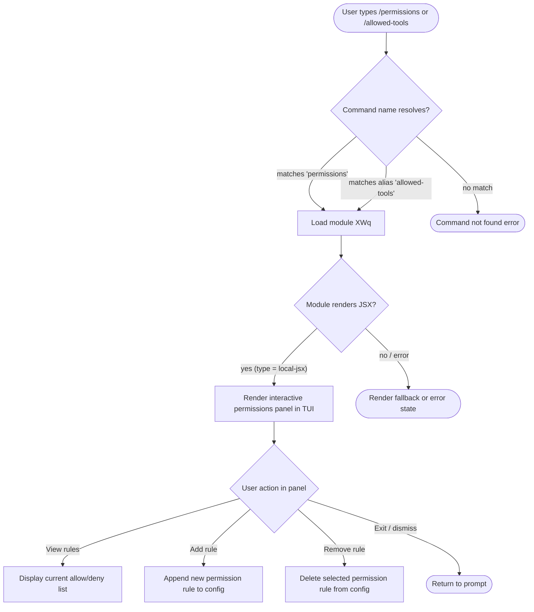

# `/permissions`

> Analysis basis: CC v2.1.144 bundle.js (AST extraction + Claude interpretation)
> Minimum version: v2.1.144

---

## Overview

The `/permissions` command (also accessible as `/allowed-tools`) provides an interactive interface for managing the allow and deny rules that govern which tools Claude Code is permitted to invoke during a session. It renders as a local JSX component, meaning its output is displayed as an interactive UI panel rather than plain text. Users can inspect, add, and remove tool permission rules without manually editing configuration files.

---

## Registration

| Field | Value |
|---|---|
| type | `local-jsx` |
| name | `permissions` |
| description | `Manage allow & deny tool permission rules` |
| aliases | `["allowed-tools"]` |
| module_id | `XWq` |

Analysis basis: CC v2.1.144 bundle.js:+11440137

---

## Input Branching

Because the depth-2 AST traversal returned an empty call graph and no literal constants for module `XWq`, the precise internal branching logic of the command's entry function could not be recovered deterministically.

<!-- TODO: not found in depth-2 traversal; needs --depth 4 -->

The following flowchart represents the **externally observable** branching derived from the registration metadata alone (type `local-jsx`, presence of alias, no argument literals found):



> **Note:** Nodes H, I, J, and K are inferred from the command description (`"Manage allow & deny tool permission rules"`) and the `local-jsx` render type. They are not directly confirmed by call-graph data.
> Analysis basis: CC v2.1.144 bundle.js:+11440137

---

## Behavioral Spec

### Command Dispatch and Alias Resolution

When the user enters `/permissions` or `/allowed-tools`, the CLI resolves the input against the registered command name and its alias array before loading the implementation module.

```
function resolvePermissionsCommand(userInput):
    registeredName   = "permissions"
    registeredAlias  = ["allowed-tools"]

    normalized = userInput.trim().toLowerCase().removeLeadingSlash()

    if normalized == registeredName OR normalized in registeredAlias:
        return loadModule("XWq")
    else:
        return NOT_FOUND
```

Analysis basis: CC v2.1.144 bundle.js:+11440137

---

### JSX Panel Rendering

The command type `local-jsx` indicates that the implementation module exports a React (JSX) component rather than a plain-text handler. The CLI host renders this component inline within the terminal UI, giving it access to interactive controls (keypresses, selection, scrolling).

```
function renderPermissionsPanel(appState):
    component = loadJSXModule("XWq")

    if component is valid:
        mountInlinePanel(component, appState)
        waitForUserDismissal()
    else:
        displayError("Failed to load permissions panel")
        return
```

<!-- TODO: internal panel sub-components, prop signatures, and state shape not found in depth-2 traversal; needs --depth 4 -->

Analysis basis: CC v2.1.144 bundle.js:+11440137

---

### Allow / Deny Rule Management

Based on the command description (`"Manage allow & deny tool permission rules"`), the panel is expected to expose at minimum two categories of rules: **allow rules** (tools Claude Code may call unconditionally) and **deny rules** (tools that are blocked regardless of context). The exact rule schema and storage location are not recoverable from the depth-2 traversal.

```
function applyPermissionRule(action, ruleType, toolPattern):
    # action    : "add" | "remove"
    # ruleType  : "allow" | "deny"
    # toolPattern : string identifying the tool or glob pattern

    rules = readCurrentRulesFromConfig()

    if action == "add":
        if ruleType == "allow":
            rules.allowList.append(toolPattern)
        else:
            rules.denyList.append(toolPattern)

    else if action == "remove":
        if ruleType == "allow":
            rules.allowList.remove(toolPattern)
        else:
            rules.denyList.remove(toolPattern)

    writeRulesBackToConfig(rules)
```

<!-- TODO: config file path, rule serialization format, and validation logic not found in depth-2 traversal; needs --depth 4 -->

Analysis basis: CC v2.1.144 bundle.js:+11440137

---

## State & Side Effects

| Item | Detail |
|---|---|
| Telemetry | None detected in depth-2 traversal (`telemetry: []`) |
| Hook registration | <!-- TODO: not found in depth-2 traversal; needs --depth 4 --> |
| appState changes | Expected: allow/deny rule lists mutated when user adds or removes a rule; exact state keys unknown |
| Sound | <!-- TODO: not found in depth-2 traversal; needs --depth 4 --> |
| Config persistence | Implied by rule management purpose; target file path not confirmed |
| Render mode | `local-jsx` — renders an inline interactive TUI panel, not plain stdout text |

Analysis basis: CC v2.1.144 bundle.js:+11440137

---

## Version History

| Version | Change |
|---|---|
| v2.1.144 | Initial analysis. Command registered under module `XWq` with alias `allowed-tools`. Type confirmed as `local-jsx`. Internal call graph empty at depth ≤ 2. |

---

## Common Mistakes

1. **Using `/allowed-tools` and expecting different behavior from `/permissions`** — Both names resolve to the same module (`XWq`) and produce identical behavior. The alias exists purely for discoverability.
2. **Expecting plain-text output** — Because the command type is `local-jsx`, it mounts an interactive TUI panel. Piping or scripting against its stdout will not yield structured text output.
3. **Assuming rules are session-only** — The command description implies persistent rule management ("allow & deny rules"), not transient session flags. Rules are expected to survive across sessions via config storage, though the exact path is unconfirmed.
4. **Conflating allow rules with capability grants** — Allow rules govern whether Claude Code will *invoke* a tool without asking; they do not grant the tool new operating-system privileges.
5. **Attempting to call `/permissions` with positional arguments** — No argument literals or parameter schema were found in the traversal (`literals: []`). Passing arguments may be silently ignored or cause an error.

---

## Appendix — Identifier Mapping

> For bundle debugging only. Identifiers change across versions.

| Identifier | Role |
|---|---|
| `XWq` | Module ID for the `/permissions` command implementation (not a function identifier, but included for bundle navigation; the identifier list returned empty for this module at depth ≤ 2) |

> **Note:** The AST extraction returned `identifiers: []` for module `XWq` at depth ≤ 2. No obfuscated function-level identifiers were recovered. A deeper traversal (`--depth 4` or greater) is required to populate this table with function-level mappings.
> Analysis basis: CC v2.1.144 bundle.js:+11440137