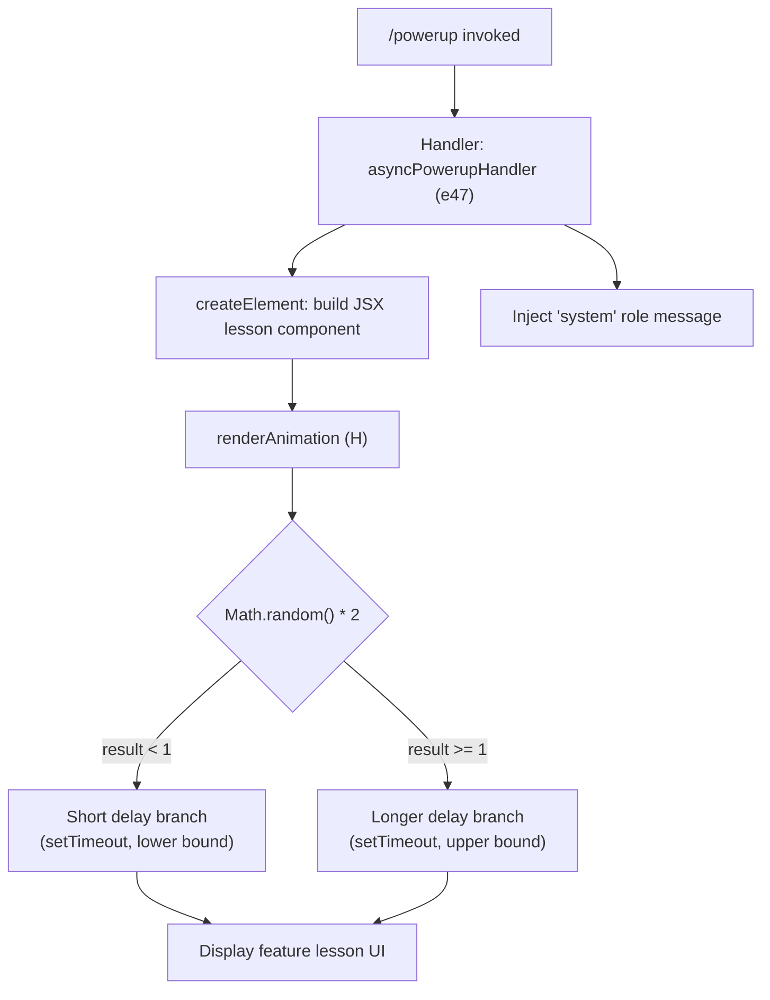

# `/powerup`

> Analysis basis: CC v2.1.132 bundle.js (AST extraction + Claude interpretation)
> Minimum version: v2.1.132

---

## Overview

`/powerup` is a local-jsx slash command that delivers quick interactive lessons to help users discover Claude Code features. When invoked, it renders a JSX component in the terminal UI and triggers a timed animation or display sequence driven by a randomized delay, surfacing feature highlights in a lightweight, self-contained presentation.

---

## Registration

| Field | Value |
|---|---|
| type | `local-jsx` |
| name | `powerup` |
| description | `Discover Claude Code features through quick interactive lessons` |
| module_id | `f9q` |
| load_inline | `true` |
| handler | `e47` (AsyncFunction; resolved via `module_id` path) |
| loc_byte span | `10750140` – `10750320` |
| `loc_byte_end` | `10750320` |
| `arbor_handler.name` | `e47` |
| `arbor_handler.kind` | `AsyncFunction` |
| `arbor_handler.resolution_path` | `module_id` |
| `arbor_handler.fqn` | `claude-2.1.132::e47` |
| `arbor_handler.n_hits` | `0` |

Analysis basis: CC v2.1.132 bundle.js:+10750140

---

## Input Branching

The command accepts no user-supplied arguments in the depth-2 traversal data. Its execution path is linear: invoke the handler, render the JSX component, then schedule a timed side-effect.



Analysis basis: CC v2.1.132 bundle.js:+10750014 (createElement call), +10750049 (renderAnimation call), +10750062 (system literal), +12264283 (random multiplier), +12264299 (threshold), +12264285 (Math.random), +12264322 (setTimeout)

---

## Behavioral Spec

### Handler Entry Point

The primary handler (`asyncPowerupHandler`) is an `AsyncFunction` resolved from module `f9q` via the `module_id` resolution path. It is loaded inline (no separate dynamic import boundary at invocation time).

```
async function asyncPowerupHandler(context):
    lessonComponent = createElement(LessonView, props)
    scheduleAnimation(lessonComponent)
    emit system-role message to conversation context
    return lessonComponent
```

Analysis basis: CC v2.1.132 bundle.js:+10750014, +10750049, +10750062

### JSX Component Rendering

`asyncPowerupHandler` calls the framework's `createElement` function (aliased as `FkA.createElement`) to construct a JSX tree representing the interactive lesson view. This is a **local-jsx** command, meaning the rendered output is displayed directly in the CLI UI rather than forwarded to the agent as a prompt string.

```
function buildLessonComponent(props):
    return createElement(LessonView, {
        role: "system",
        ...props
    })
```

Analysis basis: CC v2.1.132 bundle.js:+10750014 (createElement), +10750062 ("system" role literal)

### System-Role Message Injection

A string literal `"system"` is passed as the role designator at invocation time. This indicates that the lesson display message is injected into the conversation context under the `system` role rather than as a user or assistant turn.

Analysis basis: CC v2.1.132 bundle.js:+10750062

### Randomized Animation / Display Timing

The helper function (`renderAnimation`) introduces a randomized timing delay before the lesson content becomes fully visible. The mechanism:

1. Generate a floating-point value via `Math.random()`.
2. Multiply by the constant `2` to produce a value in the range `[0, 2)`.
3. Compare against the threshold `1`:
   - Values in `[0, 1)` resolve to a shorter display delay.
   - Values in `[1, 2)` resolve to a longer display delay.
4. Pass the selected delay to `setTimeout` to schedule the reveal.

```
function renderAnimation(component):
    raw = Math.random()          // uniform [0, 1)
    scaled = raw * 2             // scale constant: 2  (bundle.js:+12264283)
    threshold = 1                // split point       (bundle.js:+12264299)

    if scaled < threshold:
        delay = computeShortDelay(scaled)
    else:
        delay = computeLongDelay(scaled)

    setTimeout(() => revealComponent(component), delay)
```

Analysis basis: CC v2.1.132 bundle.js:+12264283 (constant `2`), +12264299 (constant `1`), +12264285 (`Math.random`), +12264322 (`setTimeout`)

> **Note on delay magnitude:** The exact millisecond values passed to `setTimeout` are not present in the depth-2 literal set. The two numeric constants `2` and `1` represent the scaling factor and branch threshold respectively, not raw delay durations.
> <!-- TODO: not found in depth-2 traversal; needs --depth 4 -->

---

## State & Side Effects

| Item | Detail |
|---|---|
| Telemetry | None detected in depth-2 traversal (telemetry array is empty) |
| Hook registration | None detected in depth-2 traversal |
| appState changes | None detected in depth-2 traversal |
| Conversation context | Injects a `"system"`-role message at invocation (bundle.js:+10750062) |
| Timer | Schedules one `setTimeout` callback per invocation to drive the animation reveal (bundle.js:+12264322) |
| Randomness | Consumes one `Math.random()` call per invocation; no seed is set — output is non-deterministic (bundle.js:+12264285) |
| Sound | None detected in depth-2 traversal |

---

## Version History

| Version | Change |
|---|---|
| v2.1.132 | Initial analysis |

---

## Common Mistakes

1. **Expecting agent-side handling:** `/powerup` is type `local-jsx` — it renders its output directly in the CLI UI. It does not send a prompt to the Claude agent and does not produce an assistant response in the normal conversation flow.
2. **Assuming deterministic animation timing:** The display delay is randomized via `Math.random()` on every invocation. Do not rely on a fixed reveal time in scripts or tests.
3. **Confusing the system-role injection with a user message:** The lesson content is injected under the `"system"` role. Downstream tooling that filters by role may not surface it in user-visible history.
4. **Expecting telemetry events:** No `tengu_*` telemetry events were found for this command at depth-2. Usage analytics integrations should not assume this command emits any instrumentation signals in v2.1.132.
5. **Re-invoking to change content:** Because the timing is randomized but the lesson content selection logic was not reachable within the depth-2 call graph, it is unclear whether repeated invocations cycle through different lessons or repeat the same one. <!-- TODO: not found in depth-2 traversal; needs --depth 4 -->

---

## Appendix — Identifier Mapping

> For bundle debugging only. Identifiers change across versions.

| Identifier | Role |
|---|---|
| `e47` | Primary async command handler (`asyncPowerupHandler`); AsyncFunction resolved from module `f9q` via `module_id` path (bundle.js:+10750014) |
| `H` | Animation / display-timing helper (`renderAnimation`); calls `Math.random` and `setTimeout` to schedule lesson reveal (bundle.js:+12264285) |
| `FkA` | JSX framework namespace; `FkA.createElement` is the element factory used to build the lesson component (bundle.js:+10750014) |