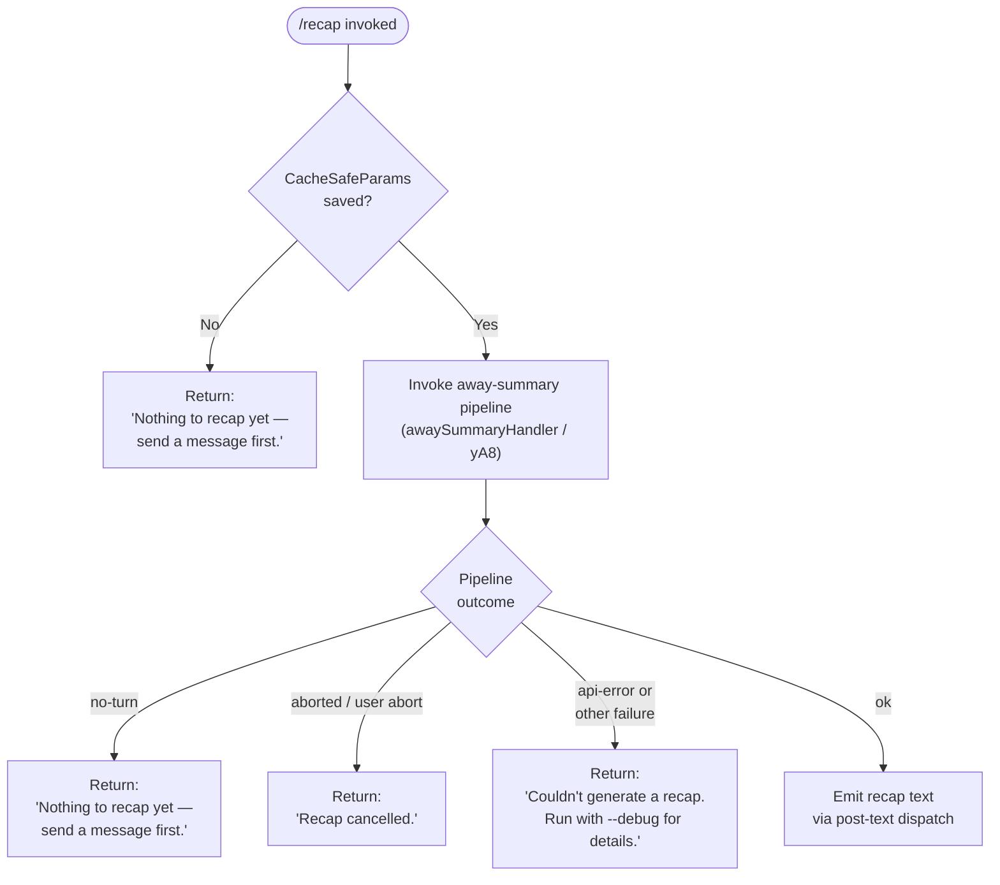

# `/recap`

> Analysis basis: CC v2.1.144 bundle.js (AST extraction + Claude interpretation)
> Minimum version: v2.1.144

---

## Overview

The `/recap` command triggers an on-demand, one-line session recap by invoking the same "away summary" pipeline that normally runs when the user steps away. It inspects the current conversation state, and if any turns have occurred, issues an AI-powered call to produce a concise summary sentence; if no conversation history exists yet, it returns an immediate inline notice instead.

---

## Registration

| Field | Value |
|---|---|
| type | `local` |
| name | `recap` |
| description | `Generate a one-line session recap now` |
| loc_byte | `11955271` |
| loc_byte_end | `11955487` |
| loc_line | `7772` |
| supportsNonInteractive | `false` |
| thinClientDispatch | `post-text` |
| load_inline | `true` |
| load_ident | `Ku7` |
| arbor_handler.name | `Ku7` |
| arbor_handler.fqn | `claude-2.1.144::Ku7` |
| arbor_handler.kind | `AsyncFunction` |
| arbor_handler.resolution_path | `load_ident` |
| arbor_handler.n_hits | `0` |

Analysis basis: CC v2.1.144 bundle.js:+11955271

The handler was resolved via `load_ident`: the registration embeds a `load: () => Promise.resolve({ call: Ku7 })` shape (no separate `module_id`). `Ku7` is the authoritative handler identifier per Arbor.

---

## Input Branching

The command produces at least four distinct outcomes depending on conversation state and the result of the away-summary pipeline, so a flowchart is used.



Analysis basis: CC v2.1.144 bundle.js:+11955021, +11955113, +11955171, +5280702, +5280760

---

## Behavioral Spec

### 1. Handler Entry — `recapCommandHandler` (`Ku7`)

```
async function recapCommandHandler(context):
    result = await awaySummaryHandler(context)

    switch result.status:
        case "no-turn":
            return postText("Nothing to recap yet — send a message first.")
        case "aborted":
            return postText("Recap cancelled.")
        case "api-error", "other":
            return postText("Couldn't generate a recap. Run with --debug for details.")
        case "ok":
            return postText(result.summaryText)
```

Analysis basis: CC v2.1.144 bundle.js:+11954879, +11955021, +11955113, +11955171

`postText` is the `thinClientDispatch: "post-text"` delivery path — the recap string is emitted directly into the conversation UI without opening a new agent turn.

---

### 2. Away-Summary Entry Guard — `awaySummaryHandler` (`yA8`)

```
async function awaySummaryHandler(context):
    cacheSafeParams = loadCacheSafeParams(context)   // zZH

    if cacheSafeParams is null or empty:
        log.debug("[awaySummary] no CacheSafeParams saved, skipping")
        return { status: "no-turn" }

    abortController = new AbortController()
    context.addEventListener("abort", () => abortController.abort())

    result = await runAwaySummaryQuery(cacheSafeParams, abortController, context)
    // buildFlatMessageList / Kq9 is used to flatten turn history before passing

    return result
```

Analysis basis: CC v2.1.144 bundle.js:+5280681, +5280700, +5280702, +5280760, +5280797, +5280828, +5280875, +5280895, +5281237

The literal `"[awaySummary] no CacheSafeParams saved, skipping"` at `+5280702` is logged at `debug` level (literal `"debug"` at `+201277`) when there is no prior session state to summarize.

---

### 3. Away-Summary Query Execution — `runAwaySummaryQuery` (`wZ`)

```
async function runAwaySummaryQuery(params, abortController, context):
    startTime = Date.now()

    // Build the agent session (Zv_ / buildAgentSession)
    session = await buildAgentSession(params, abortController)

    // Retrieve the most recent agent message snapshot (G.at / "main" branch)
    latestMessage = messageHistory.at("main")

    // Generate a request ID (rm / generateRequestId uses crypto.randomBytes 8 bytes, "hex")
    requestId = generateRequestId()

    // Assemble summary request (rHH / assembleSummaryRequest)
    summaryRequest = assembleSummaryRequest(session, latestMessage, requestId)

    // Run the main query loop (Hz7 / runQueryLoop) — tools are denied for away summary
    queryResult = await runQueryLoop(summaryRequest, {
        toolPolicy: "deny",   // literal "deny" at +5280993
        label: "away_summary" // literal "away_summary" at +5281076
    })

    switch queryResult.exitReason:
        case "aborted":
            return { status: "aborted" }
        case "api-error":
            return { status: "api-error" }
        case "ok":
            return { status: "ok", summaryText: queryResult.text }
        default:
            return { status: "other" }
```

Analysis basis: CC v2.1.144 bundle.js:+10047055, +10047171, +10047360, +10047411, +10047435, +10047455, +10047525, +10047586, +5280993, +5281076, +5281220, +5281309, +5281370

Key constraints visible in the literal set:
- **Tool use is prohibited** for the recap query: the away-summary pipeline passes a `"deny"` tool policy, and any tool-use attempt causes an `"Away summary cannot use tools"` error (literal at `+5281008`).
- The query is labeled `"away_summary"` for internal tracking.
- `"abort"` event on the parent context propagates an abort signal into the sub-query (literal `"abort"` at `+5280816`).

---

### 4. Agent Session Construction — `buildAgentSession` (`Zv_`)

```
async function buildAgentSession(cacheSafeParams, abortController):
    appState = context.getAppState()

    // Load conversation messages (i9H / loadConversationMessages)
    messages = await loadConversationMessages(appState)

    // Apply compaction if needed (h3H, Aa1)
    compactedMessages = maybeCompact(messages)

    // Merge session config (Object.assign)
    sessionConfig = Object.assign({}, cacheSafeParams, compactedMessages)

    // Build request ID (rm / generateRequestId — crypto.randomBytes, 8 bytes, "hex" encoding)
    sessionConfig.requestId = generateRequestId()

    // Generate conversation UUID (mqq.randomUUID)
    sessionConfig.conversationId = crypto.randomUUID()

    // Apply avoid_prompts flag (literal "avoid_prompts" at +10045009)
    sessionConfig.flags = [...sessionConfig.flags, "avoid_prompts"]

    return sessionConfig
```

Analysis basis: CC v2.1.144 bundle.js:+10044676, +10044779, +10045009, +10045138, +10045388, +10045494, +10045635, +10045734, +10046262, +10046537, +10046631

The `"avoid_prompts"` flag is set specifically to suppress interactive prompt injection during the background summary call.

---

### 5. Message History Flattening — `buildFlatMessageList` (`Kq9`)

```
function buildFlatMessageList(turns):
    return turns.flatMap(turn => expandTurnToMessages(turn))
```

Analysis basis: CC v2.1.144 bundle.js:+5281326, +5281536

This function is called after the session is verified to have at least one turn, to produce the linear message list fed into the query.

---

### 6. Summary Request Assembly — `assembleSummaryRequest` (`rHH`)

```
function assembleSummaryRequest(session, latestMessage, requestId):
    // Build the display layer (DL / buildDisplayLayer)
    displayLayer = buildDisplayLayer(session)

    // Build the message context filter (xvH / filterMessageContext)
    //   - filters to "ant" provider messages (literal "ant" at +12191085)
    //   - applies relevance ranking (r28, qW8, XU7)
    filteredMessages = filterMessageContext(session.messages)

    return {
        session,
        displayLayer,
        messages: filteredMessages,
        requestId,
        latestMessage
    }
```

Analysis basis: CC v2.1.144 bundle.js:+12154802, +12154826, +12191061, +12191077, +12191085, +12191125, +12191139

---

### 6. Core Query Loop — `runQueryLoop` (`Hz7`)

The recap reuses the full agentic query loop (same function used for normal turns). For `/recap` the loop is constrained as follows:

- **Tools denied**: no tool-use blocks will be issued; any attempted tool use returns the "Away summary cannot use tools" error and marks the result `"deny"`.
- **Single-turn intent**: the summary is expected to complete in one model response; the loop exits with `"ok"` on the first complete assistant message.
- **Compaction eligible**: `D.microcompact` and `D.autocompact` may still fire if the context is very large (literals `"query_microcompact_start"`, `"query_autocompact_start"` are in scope), though this is unlikely for a typical recap call.
- **Output token recovery**: if the model hits its output token limit, the loop injects the recovery prompt (literal `"Output token limit hit. Resume directly…"` at `+10022545`) and continues.

Analysis basis: CC v2.1.144 bundle.js:+10010113, +10015533, +10020559, +10022545, +5280993

---

## State & Side Effects

| Item | Detail |
|---|---|
| Telemetry (via query loop) | `tengu_auto_compact_rapid_refill_breaker`, `tengu_auto_compact_succeeded`, `tengu_ptl_surfaced_to_user`, `tengu_orphaned_messages_tombstoned`, `tengu_model_fallback_triggered`, `tengu_query_error`, `tengu_model_response_keyword_detected`, `tengu_malformed_tool_use_response`, `tengu_stop_hook_block_count`, `tengu_streaming_tool_execution_used`, `tengu_streaming_tool_execution_not_used`, `tengu_loop_dynamic_wakeup_ends_turn`, `tengu_post_autocompact_turn`, `tengu_query_before_attachments`, `tengu_query_after_attachments`, `tengu_mcp_tools_refreshed_mid_turn`, `tengu_feature_ok`, `tengu_feature_bad`, `tengu_forked_agent_default_turns_exceeded`, `tengu_fork_agent_query` |
| Background daemon telemetry | `tengu_bg_spare_enable`, `tengu_bg_low_mem_mb`, `tengu_bg_spare_spawn`, `tengu_bg_dispatch_sigkill_escalate`, `tengu_bg_dispatch_low_mem`, `tengu_bg_spare_claim`, `tengu_bg_spare_claim_fail`, `tengu_daemon_yield` |
| Tool use | **Blocked** — policy `"deny"` is enforced; tool calls produce `"Away summary cannot use tools"` |
| Hook registration | `h1` → `OHA.register` is called within the transcript-writing pipeline (`yfK`), registering a cleanup/rotation hook for the log file |
| appState changes | `H.setAppState` is called during session construction (`Zv_`) to merge session parameters back; `H.getAppState` is read at query-loop entry |
| Conversation mutation | None — `/recap` does not append a user turn or assistant turn to the visible conversation history |
| Output dispatch | `thinClientDispatch: "post-text"` — the result string is posted directly as text output, not as a new conversation message |
| Abort propagation | An `"abort"` event on the parent context propagates into the sub-query's `AbortController` |
| File I/O | Transcript append via `av.appendFile` / `kfK`; log rotation via `a8A` (`av.rename`, `av.unlink`); directory creation via `av.mkdir` |
| supportsNonInteractive | `false` — `/recap` cannot be used in `--no-interactive` / pipe mode |

---

## Version History

| Version | Change |
|---|---|
| v2.1.144 | Initial analysis |

---

## Common Mistakes

1. **Running `/recap` before any conversation turns**: The command will return `"Nothing to recap yet — send a message first."` immediately. The away-summary pipeline requires at least one saved `CacheSafeParams` snapshot, which is only created after the first successful agent turn.

2. **Expecting `/recap` to appear in conversation history**: Because `thinClientDispatch` is `"post-text"`, the recap output is posted as inline text, not as a new user or assistant message. It will not be visible if you programmatically read the conversation transcript.

3. **Using `/recap` in non-interactive / piped mode**: `supportsNonInteractive: false` means the command is rejected outright when stdin is not a TTY. Use a different summarization mechanism in scripts.

4. **Assuming tools are available during recap**: The recap query runs under a `"deny"` tool policy. Any model response that attempts tool use will be blocked and the recap will fail with the "api-error" / "other" path.

5. **Interpreting a `"Recap cancelled."` response as an error**: This response indicates the user (or a parent abort signal) cancelled the in-flight API request, not a model or configuration problem.

---

## Appendix — Identifier Mapping

> For bundle debugging only. Identifiers change across versions.

| Identifier | Role |
|---|---|
| `Ku7` | `recapCommandHandler` — top-level async handler for `/recap`; Arbor-resolved entry point |
| `yA8` | `awaySummaryHandler` — guards CacheSafeParams existence, sets up abort relay, calls query pipeline |
| `zZH` | `loadCacheSafeParams` — reads saved session parameters needed to reconstruct the query context |
| `v` | `formatMessageForLog` / message-formatting utility used inside the transcript pipeline |
| `vfK` | `transcriptWriteHelper` — orchestrates writing a message to the transcript log |
| `YHA` | `transcriptLineFormatter` — formats a single log line |
| `H` | Ambient context / app-state accessor object (overloaded across several call sites) |
| `CH` | `serializeMessage` — calls `JSON.stringify` to serialise a message object |
| `_` | String/message value being processed (role `.toUpperCase` for log prefix) |
| `x4` | `buildLogFilePath` — constructs the per-session log file path via extension strip and directory join |
| `d8A` | `mapGlobalFiles` — maps over `GfK` array to enumerate log-eligible files |
| `q` | File-path array / file-system handle (context-dependent) |
| `A` | File-name string or path string (context-dependent) |
| `YhH` | `writeToLogStream` — calls `H.write` to emit data to the transcript stream |
| `h8A` | `logStreamWriter` — low-level stream write helper |
| `yfK` | `transcriptManager` — manages transcript file lifecycle (mkdir, append, rotate, size check) |
| `pSH` | `batchedWriteQueue` — buffers writes with `setTimeout`/`setImmediate`, joins batches via `$.join` / `L.join` |
| `z_H` | `buildTranscriptPath` — joins directory components and resolves the final path |
| `m6` | `getTranscriptDirectory` — retrieves the configured transcript output directory |
| `kN8` | `checkEisdirError` — handles `"EISDIR"` error codes (literal at `+172013`) during file operations |
| `s8A` | `resolveTranscriptFilePath` — joins path components via `EXH.join` and resolves `I6` |
| `a8A` | `rotateLogFile` — stats the file, renames `.txt` files (literal `".txt"` at `+200247`), unlinks overflow files |
| `kfK` | `appendToTranscript` — mkdir + appendFile + size-check + rotate cycle |
| `h1` | `registerTranscriptHook` — calls `OHA.register` to register cleanup on session end |
| `wZ` | `runAwaySummaryQuery` — orchestrates the full away-summary API call including session build and query loop |
| `Zv_` | `buildAgentSession` — constructs session config from CacheSafeParams + appState |
| `qk` | `createQueryContext` — builds the low-level query context object with abort bindings |
| `i9H` | `loadConversationMessages` — loads and dumps conversation state via `xC` / `_.load` / `H.dump` |
| `h3H` | `maybeApplyCompaction` — applies pre-compaction to the message list if needed |
| `Aa1` | `applySessionOverrides` — merges additional session-level overrides |
| `f` | `closeSessionHandles` — closes `A` and `q` handles on session teardown |
| `kD8` | `buildQueryPayload` — assembles the final API request payload |
| `rm` | `generateRequestId` — generates 8 random bytes encoded as `"hex"` |
| `G` | Message-history / conversation-snapshot store |
| `P26` | `historyItemSerializer` — first serialisation step for history entries |
| `bE8` | `historyItemDeserializer` — deserialisation counterpart |
| `rHH` | `assembleSummaryRequest` — builds the full summary-request object |
| `DL` | `buildDisplayLayer` — constructs display/render layer for the query |
| `xvH` | `filterMessageContext` — filters messages to `"ant"` provider, applies ranking |
| `pb` | `runQueryPipeline` — outer pipeline wrapper calling `Hz7` and `MY8` |
| `Hz7` | `runQueryLoop` — core agentic query loop (streaming, tool execution, compaction, error recovery) |
| `MY8` | `postQueryCleanup` — cleans up `ib` map entries, fires `_e9`, deletes from `OS_` |
| `RH` | `recordTurnMetrics` — records per-turn metric (calls internal `d` logger) |
| `bH` | `recordErrorMetrics` — records error-level metric |
| `C26` | `checkSessionFlag` — checks `aM7` map for session flags |
| `xwH` | `buildContextWindow` — assembles the context window for the API call |
| `$w8` | `applyContextWindowLimits` — trims or truncates context to fit limits |
| `sAq` | `applySessionFlagFilter` — filters messages based on session flags via `C26` |
| `D` | `daemonSessionManager` — manages background daemon sessions (spawn, dispatch, memory checks) |
| `P6` | `spawnBackgroundSession` — spawns or retrieves a background PTY session |
| `$` | `disposableResource` — holds a disposable resource, calls `NVq` on dispose |
| `fT6` | `backgroundSessionFactory` — creates background sessions on macOS (literal `"macos"`) |
| `Ta_` | `spawnBgPtyHost` — spawns the `--bg-pty-host` subprocess via `Bun.spawn` |
| `d` | `internalLogger` — low-level structured logger |
| `kH` | `featureGateCheck` — checks feature gate via `b_`/`xH`, pushes to `HCH`, logs via `Sc.logError` |
| `wz7` | `forkAgentQuery` — runs a forked agent query and emits `tengu_fork_agent_query` telemetry |
| `J8` | `createSubagentSession` — creates a sub-agent session with `UZ.randomUUID` |
| `j` | `subagentSessionRegistry` — map of active sub-agent sessions |
| `w` | `backgroundDispatchLoop` — background worker dispatch loop (SIGKILL escalation, memory checks) |
| `J` | `killAllSubagents` — iterates `A.values()` and issues `y.kill` on each |
| `y` | `subagentProcess` — represents a running sub-agent process handle |
| `Kq9` | `buildFlatMessageList` — flattens turn array via `H.flatMap` into a linear message list |

---

Note: index built via Arbor fallback; some signals (telemetry, literals) may be missing — see arbor-fallback.js.