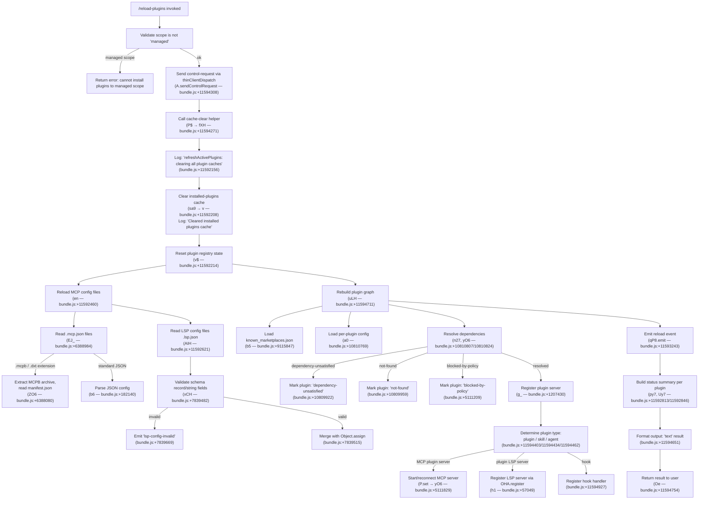

# `/reload-plugins`

> Analysis basis: CC v2.1.144 bundle.js (AST extraction + Claude interpretation)
> Minimum version: v2.1.144

---

## Overview

`/reload-plugins` is a local slash command that activates pending plugin changes within the current Claude Code session without requiring a full restart. It clears all plugin-related caches, re-discovers installed plugins (MCP, LSP, skill/agent types), reloads their configurations, and emits a control request to notify the session of the updated plugin state. The command is intended for interactive use only and dispatches via the `control-request` thin-client path.

---

## Registration

| Field | Value |
|---|---|
| type | `local` |
| name | `reload-plugins` |
| description | `Activate pending plugin changes in the current session` |
| supportsNonInteractive | `false` |
| thinClientDispatch | `control-request` |
| module_id | `OTq` |
| load_inline | `true` |
| loc_byte | `11595248` |
| loc_byte_end | `11595467` |
| loc_line | `7204` |
| arbor_handler.name | `By7` |
| arbor_handler.fqn | `claude-2.1.144::By7` |
| arbor_handler.kind | `AsyncFunction` |
| arbor_handler.resolution_path | `module_id` |
| arbor_handler.n_hits | `0` |

Analysis basis: CC v2.1.144 bundle.js:+11595248

---

## Input Branching

The command follows a largely linear flow with several distinct internal branches when processing the discovered plugin set (errors vs. success, plugin type dispatch, LSP vs. MCP vs. skill/agent paths). There are 4+ distinct processing branches; a Mermaid flowchart is used.



---

## Behavioral Spec

### Main Handler: `reloadPluginsHandler` (By7)

Analysis basis: CC v2.1.144 bundle.js:+11594271

```
async function reloadPluginsHandler(context):
    // Phase 1: Control request
    sendControlRequest(context)               // A.sendControlRequest @ +11594308

    // Phase 2: Clear caches
    clearPluginCaches()                       // P$ @ +11594271
        -> clearInstalledPluginsCache()       // fXH @ +4044976

    // Phase 3: Refresh active plugins
    refreshActivePlugins(context)             // uJH @ +11594679
        -> logDebug("refreshActivePlugins: clearing all plugin caches")  // +11592156
        -> clearInstalledPluginsCache()       // sa9 @ +11592208
             logs "Cleared installed plugins cache"                       // +9142711
        -> resetPluginRegistry()              // v$ @ +11592214
        -> Promise.all([
               reloadMCPConfigs(),            // en @ +11592460
               reloadLSPConfigs(),            // AIH @ +11592621
           ])
        -> buildPluginStatusMap()             // reduce operations @ +11592690/11592715
        -> filterPluginsByType("lsp-manager") // py7 @ +11592813
        -> filterPluginsByType("plugin:")     // Uy7 @ +11592846
        -> emitPluginReloadEvent()            // qP8.emit @ +11593243

    // Phase 4: Reload plugin graph
    reloadPluginGraph(context)                // uLH @ +11594711
        -> loadKnownMarketplaces()            // gg/b5 @ +10810148
        -> loadPerPluginConfigs()             // a0 @ +10810769
        -> resolvePluginDependencies()        // n27 @ +10810807
        -> applyPluginInstallation()          // yO6 @ +10810824

    // Phase 5: Format and return output
    formatPluginStatusOutput()                // jd @ +11594383
        -> buildStatusLines()                 // k8 @ +11594234
    return textResult(output, "text")         // Oe @ +11594754
        // literal "text" @ +11594651
        // separator " · " @ +11594521
```

### Cache-Clearing Subsystem (`clearInstalledPluginsCache`)

Analysis basis: CC v2.1.144 bundle.js:+4044976

```
function clearInstalledPluginsCache():
    // Closes active connections, removes temp entries
    closeActiveConnections()      // f.close, q.close @ +14552828/14552838
    unlinkSyncTempFiles()         // t_K.unlinkSync @ +14520889
    clearPendingQueue()           // L.add / L.finally / L.delete @ +14546613/14622/14636
```

### MCP Config Reload (`reloadMCPConfigs`)

Analysis basis: CC v2.1.144 bundle.js:+6388984

```
async function reloadMCPConfigs():
    configFiles = discoverMCPFiles()          // J39 @ +6388012
        // looks for .mcp.json @ +6388995
        // also handles .mcpb @ +5089067, .dxt @ +5089088
    for each configFile in configFiles:
        if configFile.endsWith(".mcpb") or ".dxt":
            archive = extractMCPBArchive()    // ZO6 @ +5094953
                // reads manifest.json @ +5095087
                // computes md5 hash @ +5095924, hex digest @ +5095948
                // logs "Extracting MCPB archive..." @ +5096272
                // error if no manifest: "No manifest.json found in MCPB file" @ +5096383
        else:
            config = readFile(configFile, "utf-8")  // +6389661
            config = JSON.parse(config)              // b6 @ +182140
    return mergedConfigs
```

### LSP Config Reload (`reloadLSPConfigs`)

Analysis basis: CC v2.1.144 bundle.js:+7839383

```
async function reloadLSPConfigs():
    lspConfigPath = path.join(pluginDir, ".lsp.json")   // LDH.join @ +7839383
                                                          // literal ".lsp.json" @ +7839399
    raw = readFile(lspConfigPath)
    parsed = JSON.parse(raw)                              // b6 @ +7839454
    validated = validateSchema(parsed,
                    record: true, string: true)           // k.record/k.string @ +7839462/7839471
    if invalid:
        emit("lsp-config-invalid")                        // +7839669
        return
    result = Object.assign({}, defaults, validated)       // +7839515
    // Also processes nested plugin paths via Og4 @ +7840205
    //   validates relative paths, rejects ".." traversal  // ".." @ +7839298
    //   error: "Invalid path: must be relative and within plugin directory" @ +7840599
    return result
```

### Plugin Graph Resolution (`applyPluginInstallation` / yO6)

Analysis basis: CC v2.1.144 bundle.js:+5111174

```
async function applyPluginInstallation(pluginEntry):
    // Scope check
    if scope == "managed":
        throw Error("Cannot install plugins to managed scope")  // +4885312
    
    // Policy checks
    if blockedByPolicy():
        markStatus("blocked-by-policy")                  // +5111209
    if marketplaceBlockedByPolicy():
        markStatus("marketplace-blocked-by-policy")      // +5111301
    if noLocalSourceLocation():
        markStatus("local-source-no-location")           // +5111425
    
    // Resolve source type
    switch sourceType:
        case "file":     resolveFileSource()             // +4905172
        case "directory": resolveDirectorySource()       // +4905191
        case "github":   resolveGitHubSource()           // +4905830
        case "git":      resolveGitSource()              // +4905924
        case "url":      resolveURLSource()              // +4906013
        case "npm":      resolveNPMSource()              // +4906044
        case "skills-dir": resolveSkillsDirSource()      // +4906797
        default:         markStatus("resolution-failed") // +5112420

    // Dependency resolution
    if dependencyUnsatisfied():
        markStatus("dependency-unsatisfied")             // +10809922
    if dependencyBlockedByPolicy():
        markStatus("dependency-blocked-by-policy")       // +5112535
    
    // Semver validation
    validateSemver(version)                              // v88: hg.valid/coerce/satisfies @ +4895810
    
    // Register the plugin
    if pluginType == "plugin MCP server":                // literal @ +11594494
        startMCPServer(pluginEntry)                      // P.set @ +5111829
        addToActiveSet()                                 // W.add @ +5112236
    if pluginType == "plugin LSP server":                // literal @ +11594986
        registerLSPServer()                              // h1 → OHA.register @ +57049
    if pluginType == "hook":                             // literal @ +11594927
        registerHook()
    
    // Emit OTEL telemetry for successful install
    emitPluginInstalledMetric({                          // $L → OgH @ +5116923
        "plugin_installed",                              // +5116926
        "plugin.name",                                   // +5116953
        "plugin.version",                                // +5116993
        "marketplace.name",                              // +5117031
        "marketplace.is_official",                       // +5117053
        "install.trigger"                                // +5117096
    })
```

### Plugin Type Dispatch (`filterAndDispatch`)

Analysis basis: CC v2.1.144 bundle.js:+11594403

```
function classifyPlugin(pluginEntry):
    // Reads type string from plugin entry
    switch pluginEntry.type:
        case "plugin":    // literal @ +11594403
            return pluginDispatchHandler()
        case "skill":     // literal @ +11594434
            return skillDispatchHandler()
        case "agent":     // literal @ +11594462
            return agentDispatchHandler()
    // Plugin server labels used in output formatting
    // "plugin MCP server"  @ +11594494
    // "plugin LSP server"  @ +11594986
    // separator " · "      @ +11594521
```

### Output Formatting (`formatStatusOutput` / jd + k8)

Analysis basis: CC v2.1.144 bundle.js:+11594383

```
function formatStatusOutput(pluginResults):
    lines = buildStatusLines(pluginResults)   // k8 @ +11594234
    // Error entries tagged with "error"      // literal @ +11594576
    // Normal entries tagged with "text"      // literal @ +11594651
    // Columns padded to width 40             // literal @ +14567373
    // Two-space column separator "  "        // literal @ +14565402
    output = lines.join(" · ")               // literal " · " @ +11594521
    return { type: "text", content: output }
```

### Plugin Registry Reset (`resetPluginRegistry` / v$)

Analysis basis: CC v2.1.144 bundle.js:+9109970

```
function resetPluginRegistry():
    loadPluginRootConfig()         // BA7 @ +9109970
        -> NT()                    // plugin root paths @ +9109883
        -> Fv_()                   // Object.entries pluginRoot @ +8697258
        -> kH()                    // error logging via Sc.logError @ +961007
    clearSettingsCache()           // D6H @ +9109976
    reloadFlagSettings()           // jD_ @ +9109982
    clearPolicyCache()             // $rH → Kz8.clear @ +9087152
```

---

## State & Side Effects

| Item | Detail |
|---|---|
| Telemetry (direct) | No `tengu_*` events are emitted directly from `By7`; events in the call graph belong to indirectly reachable subsystems (daemon, voice, session) traversed at depth ≤ 2 |
| Indirect telemetry (depth ≤ 2) | `tengu_daemon_yield` (+14560403), `tengu_daemon_control` (+14577473), `tengu_bg_dispatch_sigkill_escalate` (+14542134), `tengu_bg_dispatch_low_mem` (+14542713), `tengu_bg_spare_enable` (+14543352), `tengu_bg_spare_claim` (+14543473), `tengu_bg_spare_claim_fail` (+14543736), `tengu_session_resumed` (+13635726) |
| OTEL metrics | `plugin_installed` event with attributes `plugin.name`, `plugin.version`, `marketplace.name`, `marketplace.is_official`, `install.trigger` emitted when plugin registration succeeds (+5116926) |
| Control request | Sends a `control-request` via `thinClientDispatch` at invocation start (+11594308) |
| Cache invalidation | Clears installed-plugins cache (`fXH`), closes active plugin connections (`f.close`, `q.close`), removes temp files (`t_K.unlinkSync`), clears pending queues |
| File I/O | Reads `.mcp.json`, `.lsp.json`, `manifest.json`, `known_marketplaces.json`, `marketplace.json`, `settings.json`, `settings.local.json` from plugin and config directories |
| Hook registration | LSP servers re-registered via `OHA.register` (+57049); hooks re-registered (+11594927) |
| Plugin registry | `Kz8` (policy cache) cleared (+9087152); plugin state maps updated (`P.set`, `W.add`, `O.set`) |
| EventEmitter | `qP8.emit` fires a reload event (+11593243); `BCH.emit` fires on plugin file write (+1208008); `$L → A.emit` fires OTEL metric events (+4888490) |
| appState changes | Plugin type sets updated (lsp-manager, plugin: prefixed entries); plugin status maps rebuilt via `reduce` (+11592690, +11592715) |
| Sound | None observed in traversal |
| Non-interactive | `supportsNonInteractive: false` — command is blocked in non-interactive mode |

---

## Version History

| Version | Change |
|---|---|
| v2.1.144 | Initial analysis |

---

## Common Mistakes

1. **Running in non-interactive mode**: The command sets `supportsNonInteractive: false`. Attempting to call it from a script or pipe will be rejected at the command-dispatch layer.
2. **Expecting instant MCP reconnection**: The command initiates server restarts asynchronously. Downstream MCP tool availability may lag by one or more event-loop cycles after the command returns.
3. **Using in a managed-scope environment**: If the active plugin scope is `"managed"`, the installation/registration phase will fail with "Cannot install plugins to managed scope" and no plugins will be reloaded.
4. **Treating the command as a full session restart**: `/reload-plugins` only reloads plugin configuration and re-registers plugin servers; it does not reset conversation state, tool permissions, or API session context.
5. **Ignoring `lsp-config-invalid` errors**: When `.lsp.json` fails schema validation, the LSP configuration is silently skipped. Users should inspect the log output for `lsp-config-invalid` entries to diagnose missing LSP tools after a reload.
6. **Relying on MCPB/DXT support without the correct archive format**: The extraction path (`ZO6`) requires a valid `manifest.json` inside the archive; a missing manifest produces the error "No manifest.json found in MCPB file" (+5096383) and the plugin is not loaded.

---

## Appendix — Identifier Mapping

> For bundle debugging only. Identifiers change across versions.

| Identifier | Role |
|---|---|
| `By7` | Main async handler for `/reload-plugins` (arbor_handler) |
| `P$` | Plugin cache clear dispatcher |
| `fXH` | Installed-plugins cache clear implementation |
| `jd` | Output formatter / status line builder wrapper |
| `k8` | Status line builder (column padding) |
| `uJH` | `refreshActivePlugins` — clears caches, reloads all plugin configs, emits reload event |
| `v` | Generic logging / debug utility |
| `vfK` | Log transport / debug output helper |
| `YHA` | Log channel initializer |
| `H` | Generic string / array variable (context-dependent) |
| `CH` | JSON.stringify wrapper |
| `x4` | Path segment builder |
| `d8A` | Path map helper |
| `YhH` | Write helper |
| `h8A` | Low-level write to stream |
| `yfK` | File write pipeline (append, rotate, flush) |
| `pSH` | Write queue / debounce scheduler |
| `z_H` | File path joiner for log writes |
| `m6` | `process.cwd()` or base-directory resolver |
| `kN8` | File stat/exists helper |
| `s8A` | Path join with base directory |
| `a8A` | File rename/rotate helper |
| `kfK` | Append-to-file with mkdir-p |
| `h1` | LSP server registration dispatcher |
| `sa9` | Installed-plugins cache clear wrapper (logs "Cleared installed plugins cache") |
| `v$` | Plugin registry reset (clears policy cache, reloads flag/project settings) |
| `BA7` | Plugin root config loader |
| `NT` | Plugin root path resolver |
| `Fv_` | Plugin root entry enumerator (Object.entries over pluginRoot) |
| `kH` | Plugin error logger (Sc.logError) |
| `D6H` | Settings cache invalidator |
| `jD_` | Flag-settings reloader |
| `$rH` | Policy cache clear (Kz8.clear) |
| `en` | MCP config discovery and reload orchestrator |
| `EJ_` | MCP JSON config reader/parser |
| `O8` | Error code classifier (ENOENT, EISDIR) |
| `b6` | JSON.parse wrapper |
| `Fg` | File extension checker (.mcpb, .dxt) |
| `J39` | Plugin directory scanner (startsWith, includes filters) |
| `ZO6` | MCPB archive extractor (reads manifest.json, computes md5 hash) |
| `GH` | String coercion wrapper |
| `AIH` | LSP config reader/validator (.lsp.json) |
| `Og4` | Nested LSP plugin path processor |
| `$g4` | Relative path safety checker (rejects ".." traversal) |
| `NVq` | Daemon status writer |
| `Qa` | Daemon status helper |
| `n9` | AsyncLocalStorage getStore for request context |
| `SG6` | Daemon status path builder (daemon.status.json) |
| `O` | Plugin output reducer / server map |
| `py7` | lsp-manager plugin filter/mapper |
| `$Tq` | Plugin set membership tester |
| `Uy7` | `plugin:` prefixed plugin filter/mapper |
| `uLH` | Plugin graph reload / dependency resolution orchestrator |
| `gg` | Marketplace config loader entry |
| `b5` | known_marketplaces.json reader |
| `jz8` | Plugin data-directory path builder |
| `PEH` | Plugin entry iterator (Object.entries) |
| `V8` | Plugin schema validator |
| `Lb6` | Plugin source descriptor parser |
| `kB` | Plugin config builder (multi-source type handler) |
| `KZ` | Error factory for managed-scope rejection |
| `IA` | Scope string parser (includes/split) |
| `cX` | Plugin installation validator (policy, path) |
| `U36` | Host-pattern policy checker |
| `S88` | Plugin settings loader |
| `ta1` | Host-pattern matcher |
| `ea1` | Path-pattern matcher |
| `GK4` | GitHub source handler |
| `Ye` | Plugin directory reader |
| `WK4` | Skills-directory source handler |
| `$qH` | marketplace.json reader |
| `XP6` | Plugin marketplace entry resolver |
| `fy_` | Plugin config safe-parse wrapper |
| `A8` | Error code mapper |
| `a0` | Per-plugin config loader (reads local + global) |
| `fD_` | Local plugin config reader |
| `n27` | Plugin dependency set membership checker |
| `yO6` | Plugin installation/registration main function |
| `MZ` | Plugin schema validator (alternate) |
| `n_8` | Plugin scope + dependency checker |
| `N16` | Source path prefix validator ("./") |
| `C6` | User-scope context helper |
| `kR6` | AsyncLocalStorage user-scope getter |
| `vT` | Plugin config file writer |
| `$y_` | Plugin config sync reader |
| `Oy_` | Plugin config entry enumerator |
| `J` | Active plugin process map |
| `y` | Plugin subprocess handle |
| `P` | MCP server connection manager |
| `bE8` | MCP server config builder |
| `b_` | Error/String coercion |
| `pC` | Plugin scope+path validator |
| `oS` | Plugin scope normalizer |
| `v88` | Semver validator (hg.valid/coerce/satisfies) |
| `W` | Plugin active-set manager (debounced reload scheduler) |
| `z` | Plugin process registry (add/clear) |
| `AOH` | Plugin change event emitter |
| `AFH` | Plugin array change detector |
| `Fa1` | Dependency graph resolver (cycle, cross-marketplace checks) |
| `M` | Plugin dependency map |
| `g_` | Plugin server installer/registrar |
| `XO` | Plugin config builder (kB variant) |
| `up8` | Plugin binary path resolver |
| `$X` | Plugin registry cache setter |
| `mm8` | Plugin cache timestamp updater |
| `UPH` | Plugin config upserter |
| `aA6` | Atomic file writer (temp+rename, fchmod, fsync) |
| `lz` | Cache clear (jI6.clear, LV8.clear) |
| `wC6` | Plugin log file writer (mkdir-p, appendFile, writeFile) |
| `vR` | Settings file path builder (.claude/settings.json) |
| `Du` | Settings disk loader (loadSettingsFromDisk_start/end telemetry) |
| `i_8` | Plugin path absolute-path safety checker |
| `F` | Plugin tool filter map |
| `g` | Tool filter/allow-list builder |
| `Q` | Plugin state file reader/deleter |
| `BW6` | Plugin state JSON reader |
| `qfq` | Plugin state JSON deleter |
| `zH` | Plugin message queue push handler |
| `MH` | Message enqueue dispatcher |
| `w` | Worker/subprocess lifecycle manager |
| `l` | Plugin connection filter |
| `o` | Voice/recording subsystem handler (reached at depth 2 via l) |
| `C36` | Semver range validator (hg.validRange/minVersion) |
| `nO_` | Semver range too-complex checker |
| `g_8` | Plugin installation orchestrator wrapper |
| `OA9` | Plugin install step dispatcher |
| `Q_8` | Git/URL source resolver (ls-remote, refs/tags) |
| `DM4` | Git subdir handler |
| `D8` | Shell command executor (z_, C6) |
| `kO6` | Plugin package installer (npm/bun, hash, rename) |
| `sgH` | Plugin archive handler (rm, extract, error on unsupported source type) |
| `o_8` | Plugin install output logger |
| `TA9` | Plugin install temp-dir builder |
| `We` | Plugin content hash calculator (sha256, substring) |
| `Hh` | Plugin data directory resolver |
| `X` | Subprocess stdout reader (Buffer concat, subarray) |
| `h88` | Package manager lockfile detector (yarn.lock, pnpm-lock.yaml) |
| `Um` | Plugin uninstall handler |
| `JzH` | Plugin data-dir path resolver |
| `l_8` | Plugin cleanup (rm) |
| `eY_` | Plugin registry entry updater ("Updated"/"Added" log) |
| `S` | Away-summary scheduler (focused/blurred, 3600000ms window) |
| `uF` | Away-summary focus state tracker |
| `N` | Away-summary generator |
| `V` | Away-summary cache reader |
| `xnq` | Away-summary debounce helper |
| `$H` | Session message handler / conversation loader |
| `C` | Message renderer (kH, iL5, z.write) |
| `DX8` | Conversation dispatch (qM, qq) |
| `OT` | Base64 decode helper (OJ, xxL, RxL, hxL) |
| `qM` | Message queue manager |
| `FKH` | Live session lister |
| `aHH` | Session resume handler |
| `d` | Session state holder |
| `uG` | Event emitter wrapper (ZI6.emit) |
| `K2` | Session key/token helper |
| `lE6` | Project session file renamer |
| `eQ` | Conversation data loader (DL) |
| `VA8` | Conversation metadata writer |
| `DNH` | Conversation save helper (DL) |
| `LyH` | Session init/inherit helper |
| `T` | Remote-control startup handler |
| `oE6` | Session context builder (GV, ccA.map) |
| `NP` | Session policy enforcer |
| `rE6` | Session rate-limit checker |
| `eB` | Session timestamp recorder |
| `L8H` | Session data loader (DL) |
| `aE6` | Session environment initializer (process.chdir, XD, cv, IT) |
| `K8H` | Session metadata appender (H.reAppendSessionMetadata) |
| `h` | Session handle |
| `r` | Allow/deny rule evaluator |
| `c` | Rule context builder (Wl_) |
| `R` | Rule set aggregator |
| `e` | Voice silence timeout handler |
| `G` | Active session ref (P26, bE8) |
| `WM4` | Plugin config merger (pC, IA, MZ, n_8, a0) |
| `u` | Plugin list mapper |
| `Lk` | Plugin name case-normalizer |
| `WM` | String normalizer (xH) |
| `xH` | String constructor wrapper |
| `$L` | OTEL metric emitter (OgH, A.emit) |
| `aV8` | OTEL attribute builder |
| `OgH` | OTEL span builder (cu, I6, QO_, f5, Sa1) |
| `bH6` | OTEL counter helper |
| `Oe` | Final output builder (joins lines, returns text result) |