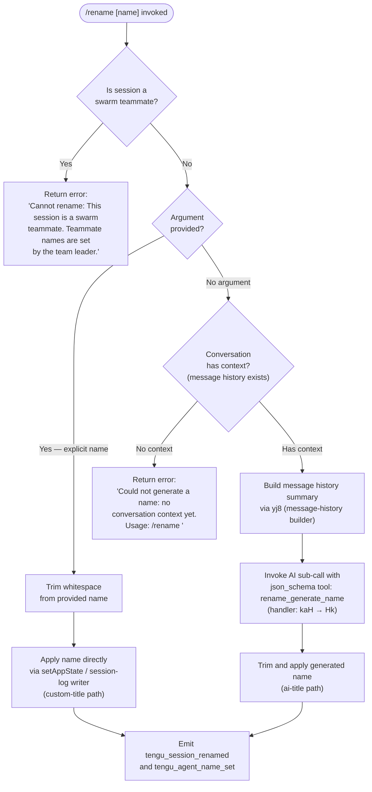

# `/rename`

> Analysis basis: CC v2.1.144 bundle.js (AST extraction + Claude interpretation)
> Minimum version: v2.1.144

---

## Overview

`/rename` (alias `/name`) renames the current conversation session. When called with an explicit name argument the title is applied immediately; when called without an argument the command attempts to auto-generate a name from the conversation context by invoking an AI sub-call that uses a structured JSON-schema tool named `rename_generate_name`. The new title is then persisted to the session log and a telemetry event is emitted.

---

## Registration

| Field | Value |
|---|---|
| type | `local-jsx` |
| name | `rename` |
| description | `Rename the current conversation` |
| argumentHint | `[name]` |
| aliases | `["name"]` |
| immediate | `true` |
| module_id | `dDq` |
| load_inline | `true` |
| loc_byte | `11084844` |
| loc_byte_end | `11085043` |
| loc_line | `6643` |
| arbor_handler.name | `DE7` |
| arbor_handler.fqn | `claude-2.1.144::DE7` |
| arbor_handler.kind | `AsyncFunction` |
| arbor_handler.resolution_path | `module_id` |
| arbor_handler.n_hits | `0` |

Analysis basis: CC v2.1.144 bundle.js:+11084844

---

## Input Branching

Four distinct branches exist (swarm-teammate guard, explicit name provided, no name but conversation exists, no name and no conversation context), so a Mermaid flowchart is used.



---

## Behavioral Spec

### Top-level handler — `asyncRenameHandler` (`DE7`)

The Arbor-resolved handler is `DE7` (an `AsyncFunction`). Its three direct callees are `renameCore` (`Rj8`), `nameInputAccessor` (`H`), and `messageHistoryBuilder` (`hj8`).

Analysis basis: CC v2.1.144 bundle.js:+11084535

```
async function asyncRenameHandler(context):
    rawInput      = nameInputAccessor(context)          // read CLI argument
    historyData   = messageHistoryBuilder(context)      // read message list
    return await renameCore(rawInput, historyData, context)
```

### Swarm-teammate guard — inside `renameCore` (`Rj8`)

Before any renaming logic, the handler calls `isSwarmContext` (`pf`) which reads from the async-local store (`dr8.getStore`). If the session is a swarm teammate the function returns immediately with the literal error string.

Error literal: `"Cannot rename: This session is a swarm teammate. Teammate names are set by the team leader."` (bundle.js:+11084005)

Analysis basis: CC v2.1.144 bundle.js:+11083985

```
function isSwarmContext():
    store = asyncLocalStore.getStore()      // dr8.getStore @ +2168567
    return store !== null && store.index > 0   // value 0 @ +2169720

async function renameCore(rawInput, historyData, context):
    if isSwarmContext():
        return errorResult("Cannot rename: This session...")
    trimmedInput = rawInput.trim()          // H.trim @ +11084110
    if trimmedInput is non-empty:
        applyExplicitName(trimmedInput, context)
    else:
        generateAndApplyName(historyData, context)
```

### Message-history builder — `messageHistoryBuilder` (`yj8`)

Constructs a condensed representation of conversation turns by iterating the history array, pushing entries, joining with separators, and slicing to a manageable length. Filters on role literals `"user"` (+11080306), `"assistant"` (+11080323), `"human"` (+11080422) and content type literals `"text"` (+11080561) and `"isMeta"` / `"origin"` markers (+11080347, +11080382).

Analysis basis: CC v2.1.144 bundle.js:+11082741

```
function messageHistoryBuilder(history):
    parts = []
    for entry in history:
        if Array.isArray(entry.content):
            textParts = entry.content
                .filter(block => block.type === "text")
                .map(block => block.text)
            parts.push(textParts.join(" "))
        else:
            parts.push(entry.content)
    return parts.slice(0, LIMIT).join("\n")     // A.slice @ +11080634
```

### AI name-generation sub-call — `autoNameOrchestrator` (`kaH`)

Called when no explicit name is given. First checks that message history is non-empty; if empty returns the fallback error: `"Could not generate a name: no conversation context yet. Usage: /rename <name>"` (bundle.js:+11084206).

Otherwise it:
1. Calls `queryRunner` (`Hk`) which invokes a structured AI query using the tool schema `rename_generate_name` (literal at +11083405) with `json_schema` format (literal at +11083261) and a `name` field (literal at +11083341).
2. Trims the result via `$u` / `H.trim`.
3. Applies the name through `appStateWriter` (`v`) and `logWriter` (`GH`).

Analysis basis: CC v2.1.144 bundle.js:+11082741–11083680

```
async function autoNameOrchestrator(historyData, context):
    if historyData is empty:
        return errorResult("Could not generate a name: no conversation context yet...")

    rawGenerated = await queryRunner(historyData, {
        toolSchema: "json_schema",
        toolName:   "rename_generate_name",
        field:      "name"
    })

    trimmedName = sanitizeTitle(rawGenerated)   // $u → H.trim @ +1082250
    applyName(trimmedName, context)             // v @ +11083647, GH @ +11083680
```

### Query runner — `queryRunner` (`Hk`)

Calls `conversationSerializer` (`fK`), then `sessionPersist` (`IY8`) for conversation serialisation and cache management, then `agentQuery` (`OkH`) which is the main AI invocation pipeline. Also maps results with `H.map` and builds context via `VX` for API key / endpoint resolution.

Analysis basis: CC v2.1.144 bundle.js:+12417884

```
async function queryRunner(historyData, schemaSpec):
    serialized = conversationSerializer(historyData)   // fK @ +12417884
    cacheKey   = sessionPersist(serialized)            // IY8 @ +12417953
    response   = await agentQuery(cacheKey, schemaSpec) // OkH @ +12418071
    results    = H.map(response, extractField)         // H.map @ +12417970
    return results
```

### Explicit-name application path

When an explicit name is supplied, `renameCore` calls:
- `appStateWriter` (`_.setAppState`) at +11084345 to update in-memory state.
- `sessionStoreWriter` (`Vw8`) at +11084364 which iterates `Object.keys` of the session store (+10124236).
- `fileSystemLogger` (`S3H`) at +11084387 for durable session-log persistence (reads/writes via `UX.readFile`, `UX.stat`, atomic rename via `fz`).
- `logEntryEmitter` (`MNH`) at +11084331 to emit the rename log entry.

Analysis basis: CC v2.1.144 bundle.js:+11084313–11084387

```
function applyExplicitName(name, context):
    appStateStore.setAppState({ title: name })      // _.setAppState @ +11084345
    sessionStoreWriter(name)                         // Vw8 @ +11084364
    fileSystemLogger(name, context)                  // S3H @ +11084387
    logEntryEmitter("custom-title", name, context)   // MNH @ +11084331
                                                     // literal "custom-title" @ +12167365
```

### Session log writer — `logEntryEmitter` (`MNH`)

Calls `formatLogPath` (`o5`) (which uses `N$H.join`, `FU`, `q_` to construct paths), writes via `sessionAppender` (`sb`) or `nameEntryWriter` (`N6H`), and emits `kT6.emit`. Writes use the `"custom-title"` tag (literal +12167365) for explicit renames and `"ai-title"` tag (literal +12167530) for AI-generated names. Also calls `eB` to update timestamps via `Date.now` (+2173024).

Analysis basis: CC v2.1.144 bundle.js:+9948513–9948934

```
function logEntryEmitter(titleKind, name, context):
    logPath = formatLogPath(context)        // o5 @ +9948526
    if titleKind === "custom-title":
        sessionAppender(logPath, name)      // sb @ +9948551
    else:
        nameEntryWriter(logPath, name)      // N6H @ +9948566
    updateTimestamp(logPath)               // eB @ +9948934
    eventBus.emit("rename", name)          // kT6.emit @ +12167444
```

### Random-delay utility (within `H` / `Math.random` path)

A random delay is applied somewhere in the AI name-generation flow (likely to spread API requests): `Math.random` (+12668351) scaled to `[1, 2]` then passed to `setTimeout` (+12668388).

Analysis basis: CC v2.1.144 bundle.js:+12668349–12668388

---

## State & Side Effects

| Item | Detail |
|---|---|
| Telemetry — `tengu_session_renamed` | Fired after successful rename via `ZLH` / `sb`; loc +12167457 |
| Telemetry — `tengu_agent_name_set` | Fired after name set on agent context via `N6H`; loc +12170486 |
| Telemetry — `tengu_off_switch_query` | Fired inside the AI query pipeline; loc +12387875 |
| Telemetry — `tengu_api_before_normalize` | AI sub-call pre-normalization; loc +12389402 |
| Telemetry — `tengu_api_after_normalize` | AI sub-call post-normalization; loc +12390083 |
| Telemetry — `tengu_streaming_idle_timeout` | Idle timeout during AI name-gen streaming; loc +12395404 |
| Telemetry — `tengu_api_slow_first_byte` | Slow first-byte warning in AI name-gen; loc +12396150 |
| Telemetry — `tengu_advisor_strip_retry` | Advisor strip retry in AI pipeline; loc +12397153 |
| Telemetry — `tengu_media_block_strip_retry` | Media block strip retry; loc +12397615 |
| Telemetry — `tengu_mid_conv_system_fallback_retry` | Mid-conversation system fallback; loc +12398914 |
| Telemetry — `tengu_streaming_stall` | Streaming stall event; loc +12400252 |
| Telemetry — `tengu_advisor_tool_call` | Advisor tool invoked; loc +12400953 |
| Telemetry — `tengu_streaming_error` | Streaming error; loc +12401402 |
| Telemetry — `tengu_max_tokens_reached` | Max tokens reached during name-gen; loc +12403937 |
| Telemetry — `tengu_context_window_exceeded` | Context window exceeded; loc +12404254 |
| Telemetry — `tengu_stream_loop_exited_after_watchdog` | Watchdog triggered exit; loc +12404855 |
| Telemetry — `tengu_stream_no_events` | Stream received no events; loc +12405289 |
| Telemetry — `tengu_streaming_stall_summary` | Stall summary; loc +12405521 |
| Telemetry — `tengu_disable_streaming_to_non_streaming_fallback` | Streaming disabled fallback; loc +12406978 |
| Telemetry — `tengu_streaming_fallback_to_non_streaming` | Streaming fallback triggered; loc +12407178 |
| Telemetry — `tengu_streaming_stale_connection_retry` | Stale connection retry; loc +12407636 |
| Telemetry — `tengu_streaming_watchdog_retry` | Watchdog retry; loc +12407923 |
| Telemetry — `tengu_nonstreaming_fallback_started` | Non-streaming fallback started; loc +12408934 |
| Telemetry — `tengu_chair_sermon` | Emitted during message-history build; loc +9836342 |
| Telemetry — `tengu_daemon_yield` | Daemon yield during session write; loc +14560403 |
| appState changes | `_.setAppState` updates in-memory session title; loc +11084345 |
| Session log write | Durable file write via `fz` (atomic rename pattern: `la.writeFile` + `la.rename`); loc +2202287–2202340 |
| Event bus | `kT6.emit` fires rename event for UI / observer subscribers; loc +12167444 |
| Hook registration | `h1` calls `OHA.register`; loc +57049 — hooks registered during session lifecycle |
| Sound | <!-- TODO: not found in depth-2 traversal; needs --depth 4 --> |
| AI sub-call tool schema | Tool name `rename_generate_name`, format `json_schema`, field `name`; locs +11083405, +11083261, +11083341 |

---

## Version History

| Version | Change |
|---|---|
| v2.1.144 | Initial analysis |

---

## Common Mistakes

1. **Calling `/rename` before any messages exist** — the auto-generation path requires at least one conversation turn. Without context the command returns `"Could not generate a name: no conversation context yet. Usage: /rename <name>"` and does nothing. Pass an explicit name instead.
2. **Attempting to rename a swarm teammate session** — sessions running as a swarm sub-agent reject the command unconditionally with `"Cannot rename: This session is a swarm teammate. Teammate names are set by the team leader."` The rename must be issued from the team-leader session.
3. **Expecting an instant result with auto-generation** — when no name is passed, the command performs a full AI sub-call (streaming, with retries). This can take several seconds and may fail with timeout or context-window errors. Supplying an explicit name is always faster.
4. **Using `/name` alias without realising it is identical** — `/name` is a registered alias for `/rename` with identical behaviour; there is no distinction in functionality.
5. **Relying on the generated name being deterministic** — the AI name-generation path uses `Math.random`-based jitter in its timing and calls a live model; the returned title varies between invocations even for the same conversation.

---

## Appendix — Identifier Mapping

> For bundle debugging only. Identifiers change across versions.

| Identifier | Role |
|---|---|
| `DE7` | Top-level async rename handler (Arbor-resolved entry point) |
| `Rj8` | Core rename logic (swarm guard, branch dispatch, state application) |
| `hj8` | Message-history accessor (reads context for auto-name generation) |
| `mW` | Context / app-state reader utility |
| `pf` | Swarm-context detector (reads async-local store) |
| `e2` | Async-local store wrapper |
| `kaH` | Auto-name orchestrator (empty-history guard + AI name-gen coordinator) |
| `yj8` | Message-history builder (formats turns into text summary) |
| `Hk` | Query runner (serialises conversation, invokes AI sub-call) |
| `fK` | Conversation serialiser |
| `IY8` | Session persistence / cache manager (SHA-1 cache, file read/write) |
| `VY8` | Conversation cache lookup helper |
| `zG` | Message normalisation / context-window building pipeline |
| `cK7` | Content-block mapper (processes image and text blocks) |
| `C6` | Utility: path / key resolver |
| `CH` | JSON serialiser wrapper |
| `b6` | JSON parser wrapper |
| `Re9` | Session record builder |
| `A8` | Error code checker |
| `xH` | String coercion utility |
| `L` | Promise-tracking set (add / finally / delete pattern) |
| `J8` | Random UUID generator + process-kill coordinator |
| `j` | Process-map accessor |
| `J` | Process-kill iterator |
| `OkH` | Agent query entry point (wraps `gS_` + `hRq`) |
| `gS_` | Session loader for agent query |
| `hRq` | Main AI streaming query loop (full request/response pipeline) |
| `VX` | API endpoint / key context builder |
| `JA` | API key formatter |
| `gr8` | API key type detector (`sk-ant-` prefix check) |
| `v9` | Auth context builder |
| `oxH` | OAuth / managed-key wrapper |
| `x0` | Post-query state updater |
| `WK` | Context-filter helper |
| `$u` | String trim utility (wraps `H.trim`) |
| `v` | App-state writer (title + metadata update) |
| `vfK` | State persistence coordinator |
| `YHA` | Persistence helpers |
| `x4` | Title slug formatter |
| `d8A` | Character map builder |
| `YhH` | Terminal / TTY writer |
| `h8A` | Raw write helper |
| `yfK` | File-log writer (append + rotate) |
| `pSH` | Buffered output writer (clearTimeout / setTimeout pattern) |
| `z_H` | Log-path resolver |
| `m6` | Home-directory resolver |
| `kN8` | Config-directory resolver |
| `s8A` | Log file path builder |
| `a8A` | Atomic file rotator (stat / rename / unlink) |
| `kfK` | Append-file writer with rotation |
| `h1` | Hook registrar (calls `OHA.register`) |
| `GH` | String coercion logger |
| `I6` | Console / stderr writer |
| `WV` | TTY stream writer |
| `MNH` | Session log-entry emitter (formats and persists rename records) |
| `vh` | Session metadata accessor |
| `o5` | Log-path constructor |
| `FU` | Path join utility A |
| `q_` | Path join utility B |
| `sb` | Session appender (custom-title path) |
| `FZ` | Log-line formatter |
| `G4H` | Synchronous log-file appender |
| `DL` | Deferred log helper |
| `d` | Debug / error logger |
| `N6H` | Name-entry writer (ai-title path) |
| `uZ` | Async utility |
| `ei` | Event emitter helper |
| `M` | MCP server manager |
| `dvH` | MCP server runner / dispatcher |
| `he` | MCP capability merger |
| `FI` | MCP transport factory |
| `K` | Padding / formatting utility |
| `H_` | Lodash-style utility wrapper |
| `P26` | MCP connection status tracker |
| `S77` | MCP heartbeat / timestamp tracker |
| `h18` | MCP capability inspector |
| `S18` | MCP health-check helper |
| `H8` | MCP debug logger |
| `Ah_` | MCP OAuth tool builder |
| `qh_` | MCP OAuth completion handler |
| `H8q` | MCP request deferred handler |
| `Hh_` | MCP capability refresh helper |
| `xJ_` | MCP include-filter checker |
| `y` | Process output writer |
| `$7` | MCP error logger |
| `a6q` | MCP cleanup coordinator |
| `W26` | MCP integer parser A |
| `th_` | MCP integer parser B |
| `k6K` | MCP server updater |
| `YD8` | MCP update serialiser |
| `Pv` | MCP server cleanup handler |
| `$` | Session timestamp updater |
| `NVq` | Session state record builder |
| `vq5` | MCP server reconciler |
| `C18` | MCP tool-set membership checker |
| `r8` | Retry-with-timeout utility |
| `trH` | JSON session serialiser |
| `H6H` | Session-field extractor |
| `ZLH` | Agent-name log writer |
| `eB` | Session timestamp writer |
| `OK6` | Session file read/write coordinator |
| `P$` | Session flag writer |
| `fXH` | Flag persistence helper |
| `Vw8` | Session store key iterator |
| `S3H` | File-system session logger |
| `PK` | Session file path builder |
| `B0` | Jobs sub-directory path builder |
| `F0` | Basename extractor |
| `B9` | Session file reader / cache manager |
| `O8` | Error-code handler |
| `FX` | Cache-entry deleter |
| `v5` | Session file writer |
| `fz` | Atomic file writer (randomBytes temp name + rename) |
| `kH` | Error log writer (push to ring buffer) |
| `b_` | Error formatter |
| `Aq` | Error display helper |
| `D3A` | Error string formatter |
| `bkK` | Ring-buffer manager (shift/push) |

---

Note: index built via Arbor fallback; some signals (telemetry, literals) may be missing — see arbor-fallback.js.