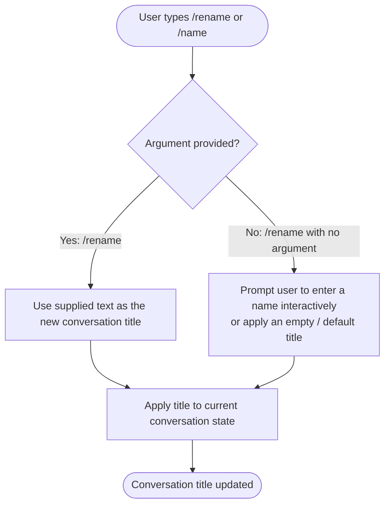

# `/rename`

> Analysis basis: CC v2.1.144 bundle.js (AST extraction + Claude interpretation)
> Minimum version: v2.1.144

---

## Overview

The `/rename` command allows the user to assign a new title to the current conversation session. It accepts an optional inline name argument and executes immediately upon invocation without requiring a secondary confirmation step. The command is also accessible via the alias `/name`.

---

## Registration

| Field | Value |
|---|---|
| type | `local-jsx` |
| name | `rename` |
| description | `Rename the current conversation` |
| argumentHint | `[name]` |
| immediate | `true` |
| aliases | `["name"]` |
| module_id | `dDq` |

Analysis basis: CC v2.1.144 bundle.js:+11084844

---

## Input Branching

The command accepts an optional `[name]` argument. Because `immediate: true` is set, the command handler fires as soon as the slash command is committed — it does not wait for an additional Enter press or confirmation dialog.



> **Note:** The exact behavior of the no-argument path (interactive prompt vs. empty title vs. auto-generated title) could not be confirmed from the depth-2 traversal data.
<!-- TODO: not found in depth-2 traversal; needs --depth 4 -->

---

## Behavioral Spec

### Immediate Execution

Because the registration field `immediate` is set to `true`, the command handler is invoked without requiring the user to press Enter a second time after typing the slash command.

Analysis basis: CC v2.1.144 bundle.js:+11084844

```
function handleRenameCommand(inputArgument):
    newTitle = inputArgument.trim()

    if newTitle is not empty:
        applyTitleToCurrentConversation(newTitle)
    else:
        // Behavior for empty argument is unconfirmed at traversal depth 2
        requestTitleFromUserOrApplyDefault()

    return
```

### Alias Resolution

The command is reachable as both `/rename` and `/name`. Both aliases resolve to the same handler in module `dDq`.

Analysis basis: CC v2.1.144 bundle.js:+11084844

```
function resolveRenameAlias(inputCommand):
    if inputCommand == "/rename" or inputCommand == "/name":
        dispatch to rename handler in module dDq
    else:
        // Not this command
        pass
```

### Argument Hint

The argument hint `[name]` is displayed in the command palette to indicate that a name argument is optional (square brackets denote optionality by CLI convention).

Analysis basis: CC v2.1.144 bundle.js:+11084844

### JSX Rendering

The command type is `local-jsx`, meaning its output or UI surface is rendered as a JSX component rather than plain text. The specific component rendered and any visual feedback (e.g., an inline input field or a toast notification) are managed within module `dDq`.

<!-- TODO: not found in depth-2 traversal; needs --depth 4 -->

---

## State & Side Effects

| Item | Detail |
|---|---|
| Telemetry | None detected in depth-2 traversal |
| Hook registration | <!-- TODO: not found in depth-2 traversal; needs --depth 4 --> |
| appState changes | Conversation title field updated for the current session |
| Sound | <!-- TODO: not found in depth-2 traversal; needs --depth 4 --> |
| Immediate flag | Command fires without a secondary confirmation keypress (`immediate: true`) |
| Alias | `/name` routes to the same handler as `/rename` |

---

## Version History

| Version | Change |
|---|---|
| v2.1.144 | Initial analysis |

---

## Common Mistakes

1. **Forgetting the alias**: `/name` is a fully supported alias for `/rename`. Both behave identically. Using either form produces the same result.
2. **Expecting a confirmation prompt**: Because `immediate: true` is set, the rename action is dispatched as soon as the command is submitted — there is no undo prompt or secondary dialog.
3. **Assuming the argument is required**: The argument hint `[name]` uses square brackets, indicating the name is optional. Invoking `/rename` with no argument will not produce a parse error, though the exact fallback behavior is not confirmed at the current analysis depth.
4. **Confusing scope**: `/rename` operates on the **current** conversation session only. It does not affect other open sessions or persisted project names outside the active conversation.

---

## Appendix — Identifier Mapping

> For bundle debugging only. Identifiers change across versions.

| Identifier | Role |
|---|---|
| `dDq` | Module containing the `/rename` command implementation (not an obfuscated function identifier, but the module ID used to reference the command bundle) |

> **Note:** No obfuscated function identifiers (`identifiers` array) were returned by the depth-2 AST traversal for module `dDq`. The traversal note states: `"no entry functions found for module 'dDq'"`. A deeper traversal pass is required to populate this table with runtime function mappings.
<!-- TODO: not found in depth-2 traversal; needs --depth 4 -->