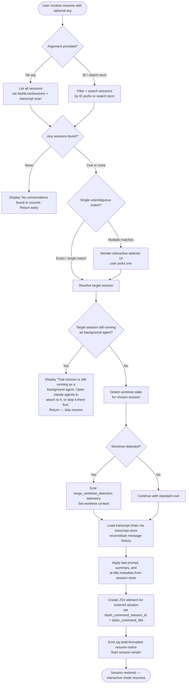

# `/resume`

> Analysis basis: CC v2.1.144 bundle.js (AST extraction + Claude interpretation)
> Minimum version: v2.1.144

---

## Overview

`/resume` (alias: `/continue`) allows users to pick up a previous Claude Code conversation by supplying a conversation ID or a search term. The command queries the live-session registry and the on-disk transcript store, presents matching sessions for selection, and then restores the chosen conversation's context — including worktree state and transcript history — into the current interactive session.

---

## Registration

| Field | Value |
|---|---|
| type | `local-jsx` |
| name | `resume` |
| description | `Resume a previous conversation` |
| argumentHint | `[conversation id or search term]` |
| aliases | `["continue"]` |
| module_id | `ijq` |
| load_inline | `true` |
| loc_byte | `11243419` |
| loc_byte_end | `11243616` |
| loc_line | `6682` |
| arbor_handler.name | `jI7` |
| arbor_handler.fqn | `claude-2.1.144::jI7` |
| arbor_handler.kind | `AsyncFunction` |
| arbor_handler.resolution_path | `module_id` |
| arbor_handler.n_hits | `0` |

Analysis basis: CC v2.1.144 bundle.js:+11243419

---

## Input Branching

Five or more distinct outcomes are possible depending on input, session state, and match results, so a flowchart is used.



Analysis basis: CC v2.1.144 bundle.js:+11242011 through +11242991

---

## Behavioral Spec

### 1. Entry Point — Handler Dispatch (`jI7`)

```
async function resumeCommandHandler(args, appState):
    // args.input is the raw argument string (may be empty)
    liveSessionList = await fetchLiveSessions()          // calls FKH → A.listAllLiveSessions
    allSessions     = filterAndMergeSessions(liveSessionList, args)
    if allSessions is empty:
        display("No conversations found to resume.")     // literal: bundle.js:+11242456
        return

    targetSession = resolveTargetSession(allSessions, args.input)
    if targetSession is null:
        return  // user cancelled multi-select

    if targetSession.isRunningAsBackgroundAgent:
        display("That session is still running as a background agent. " +
                "Open `claude agents` to attach to it, or stop it there first to resume here.")
        // literal: bundle.js:+11242021
        return  // outcome "skip" — bundle.js:+11242224

    worktreeCtx = detectWorktree(targetSession)          // calls LkH
    history     = loadTranscriptChain(targetSession.id)  // calls PX6 → sHH → QKH
    metadata    = extractSessionMetadata(history)        // last-prompt, ai-title, summary

    jsxElement = createElement(restoredSessionView, {    // ZD.createElement — bundle.js:+11242307
        sessionId : targetSession.id,                    // slash_command_session_id — bundle.js:+11242717
        title     : metadata.title,                      // slash_command_title — bundle.js:+11242941
        timestamp : Date.now(),                          // bundle.js:+11242333
        worktree  : worktreeCtx,
        history   : history
    })
    renderBoldNotice(targetSession)                      // cjq → z6.bold — bundle.js:+11239509
    return jsxElement
```

Analysis basis: CC v2.1.144 bundle.js:+11242011

---

### 2. Live-Session Fetch (`FKH`)

```
async function fetchLiveSessions():
    await Promise.resolve()
    sessionData = await YX6()                        // internal helper
    liveSessions = A.listAllLiveSessions()           // bundle.js:+8707667
    // sessions with type "interactive" are included  // literal: bundle.js:+8707758
    return liveSessions
```

Analysis basis: CC v2.1.144 bundle.js:+8707615

---

### 3. Session Filtering (`njq`)

```
function filterSessions(sessions, queryArg):
    filtered = sessions.filter(s => matchesQuery(s, queryArg))  // H.filter — bundle.js:+11241907
    sorted   = qM(filtered)                         // sort by recency — bundle.js:+11241937
    return sorted
```

Analysis basis: CC v2.1.144 bundle.js:+11241907

---

### 4. Worktree Detection (`LkH`)

```
function detectWorktreeForSession(session):
    startTime = Date.now()                           // bundle.js:+11238786
    result    = runSubprocess(["git", "worktree", "list", "--porcelain"])
    // literals: "worktree", "list", "--porcelain"   // bundle.js:+11238841, +11238848

    lines = result.split(newline)
    for each line in lines:
        if line.startsWith("worktree "):             // prefix literal "worktree " — bundle.js:+11239049
            path = line.slice(9)                     // offset 9 — bundle.js:+11239080
            normalised = path.normalize("NFC")       // literal "NFC" — bundle.js:+11239093

    matched = worktrees.find(wt => wt.path.startsWith(session.cwd))
    if no match: fallback = worktrees.filter(wt => ...).sort(localeCompare)

    emit("tengu_worktree_detection", { duration: Date.now() - startTime })
    // telemetry — bundle.js:+11238930
    return matchedWorktree or null

    // error outcomes: "sessionNotFound" — bundle.js:+11239474
    //                 "multipleMatches" — bundle.js:+11239545
```

Analysis basis: CC v2.1.144 bundle.js:+11238786

---

### 5. Transcript Chain Loading (`PX6` / `sHH` / `QKH`)

```
function loadTranscriptChain(sessionId):
    raw = vSq(sessionId)         // entry via PX6 → vSq — bundle.js:+11242762
    // vSq calls sHH to initialize all store maps (assistant, user, system, summary,
    //   last-prompt, custom-title, ai-title, tag, agent-name, agent-color,
    //   agent-setting, mode, permission-mode, isolation-latch, worktree-state,
    //   pr-link, bridge-session, file-history-snapshot, attribution-snapshot,
    //   content-replacement, fork-context-ref, marble-origami-commit,
    //   marble-origami-snapshot)
    // then QKH walks the parent-chain to reconstruct message ordering

    chain = QKH(raw)             // chain builder — bundle.js:+12184271
    // QKH reads transcript files via YU7 / zU7 (binary format, 1 MiB blocks)
    // Detects and recovers parallel tool-result chains
    // Emits telemetry on anomalies:
    //   tengu_transcript_phantom_parent  — bundle.js:+12178306
    //   tengu_transcript_parent_cycle    — bundle.js:+12181865
    //   tengu_chain_parent_cycle         — bundle.js:+12160383
    //   tengu_chain_timestamp_fallback   — bundle.js:+12160532
    //   tengu_chain_parallel_tr_recovered — bundle.js:+12162398

    return chain
```

Analysis basis: CC v2.1.144 bundle.js:+11242762

---

### 6. Background-Agent Guard (`H` / session-state check)

```
function isActiveBackgroundSession(session):
    // Session lifecycle states tracked: "stopped", "resuming", "working",
    // "active", "bg", "idle", "killed", "crashed", "blocked", "done"
    // literals: bundle.js:+14547693 ("idle"), +14547094 ("working"),
    //           +14548530 ("resuming"), +14547120 ("active")
    if session.state not in { "stopped", "killed", "crashed", "done" }:
        return true   // session is live as background agent
    return false
```

Analysis basis: CC v2.1.144 bundle.js:+11242019 (guard check inside `jI7`)

---

### 7. Autocompletion Provider (`tQ`)

```
function resumeAutocomplete(partialInput, appState):
    worktrees     = LkH(appState)        // bundle.js:+12173617
    allSessions   = NSq(appState)        // bundle.js:+12173635
    sessionTokens = VkH(allSessions)     // bundle.js:+12173657
    lowerInput    = partialInput.toLowerCase()   // bundle.js:+12173677

    candidates = sessionTokens
        .filter(t => t.includes(lowerInput))     // bundle.js:+12173802
        .sort(byRecency)                          // z.sort — bundle.js:+12173950
        .slice(0, maxResults)                     // z.slice — bundle.js:+12174016
        .map(buildCompletionItem)                 // qM — bundle.js:+12173850

    return candidates
```

Analysis basis: CC v2.1.144 bundle.js:+12173617

---

### 8. Random Jitter for Background Spare Spawning (`H`)

```
function spawnBackgroundSpare():
    delay = Math.random() * 2 + 1    // literals 2 and 1 — bundle.js:+12668349, +12668365
    setTimeout(doSpawn, delay * 1000)  // bundle.js:+12668388
```

This is a daemon-level helper reachable from the call graph; it is not user-visible but fires when the command indirectly triggers background-session pre-warming.

Analysis basis: CC v2.1.144 bundle.js:+12668351

---

## State & Side Effects

| Item | Detail |
|---|---|
| Telemetry — worktree detection | `tengu_worktree_detection` (bundle.js:+11238930) — fired on every resume attempt |
| Telemetry — transcript anomalies | `tengu_transcript_phantom_parent` (+12178306), `tengu_transcript_parent_cycle` (+12181865), `tengu_chain_parent_cycle` (+12160383), `tengu_chain_timestamp_fallback` (+12160532), `tengu_chain_parallel_tr_recovered` (+12162398) |
| Telemetry — background daemon | `tengu_bg_spare_enable` (+14541551), `tengu_bg_spare_spawn` (+14541911), `tengu_bg_dispatch_sigkill_escalate` (+14542134), `tengu_bg_dispatch_low_mem` (+14542713), `tengu_bg_spare_claim` (+14543473), `tengu_bg_spare_claim_fail` (+14543736), `tengu_bg_sendclaim_failed` (+14523319), `tengu_bg_low_mem_mb` (+11995369), `tengu_daemon_control` (+14577473), `tengu_daemon_yield` (+14560403), `tengu_daemon_idle_exit` (+14561318), `tengu_daemon_config_reload` (+14556317), `tengu_bg_spare_refill` (literal "daemon_bg_spare_refill" at +14521785) |
| Telemetry — feature flags | `tengu_feature_ok` (+955520), `tengu_feature_bad` (+955578) |
| Telemetry — relink walk | `tengu_relink_walk_broken` (+12159893) |
| appState changes | Restores `slash_command_session_id` and `slash_command_title` into app state (+11242717, +11242941); rehydrates full message history from transcript chain |
| Session store writes | None — `/resume` is read-only with respect to the transcript store; session metadata maps are populated in memory only |
| UI rendering | Produces a JSX element (`ZD.createElement` — +11242307); emits a bold-formatted heading via `z6.bold` (+11239509) |
| Background session guard | Blocks resume and prints advisory message when target session is still running as a background agent (+11242021) |
| Sound | <!-- TODO: not found in depth-2 traversal; needs --depth 4 --> |
| Hook registration | <!-- TODO: not found in depth-2 traversal; needs --depth 4 --> |

---

## Version History

| Version | Change |
|---|---|
| v2.1.144 | Initial analysis |

---

## Common Mistakes

1. **Providing a partial ID that matches multiple sessions** — the command enters interactive multi-select mode; if the terminal does not support interactive input (e.g. piped stdin), the selector may not render correctly.
2. **Trying to resume a running background agent session** — the command deliberately refuses and instructs the user to open `claude agents` first; it is not a bug.
3. **Invoking `/resume` with no arguments in a project with many old sessions** — the full list may be long; providing an ID prefix or a search term narrows results immediately.
4. **Expecting `/continue` to behave differently from `/resume`** — both names are registered to the same handler; they are identical in behavior (alias declared at bundle.js:+11243419).
5. **Assuming the command rewrites history** — the transcript chain is loaded read-only; the resumed session continues appending to the same on-disk transcript, it does not create a copy.

---

## Appendix — Identifier Mapping

> For bundle debugging only. Identifiers change across versions.

| Identifier | Role |
|---|---|
| `jI7` | Main async handler for `/resume` (arbor-resolved entry point) |
| `njq` | Session list filter + sort helper |
| `FKH` | Live-session fetcher (calls `A.listAllLiveSessions`) |
| `LkH` | Worktree detection helper (runs `git worktree list --porcelain`) |
| `z_` | Subprocess / worktree runner wrapper |
| `vPH` | Process-spawn utility (child-process abstraction) |
| `kH` | Error-normalisation / logging helper |
| `GH` | String coercion utility (calls `String()`) |
| `q_` | Path-resolution helper |
| `JX8` | Session rendering bootstrapper |
| `hT6` | Session view constructor |
| `NSq` | Bulk session/file reader (reads project directories, JSONL transcripts) |
| `VkH` | Completion-token builder (constructs autocomplete candidates from sessions) |
| `EU7` | Completion-item decorator |
| `tQ` | Autocomplete provider for `/resume` argument |
| `PX6` | Transcript-chain entry coordinator |
| `vSq` | Transcript store initializer |
| `sHH` | Session-store map hydrator (populates all metadata maps) |
| `QKH` | Parent-chain walker / chain builder |
| `HU7` | Chain-merge and deduplication helper |
| `sp7` | Chain ordering / sort helper |
| `ESq` | Parallel-chain recovery helper |
| `ep7` | Timestamp validation helper inside chain builder |
| `YU7` | Binary transcript file reader (JSONL + binary format) |
| `zU7` | Transcript buffer parser |
| `DU7` | Transcript file sync-reader |
| `KSq` | Session-index walker |
| `ap7` | Session-index entry processor |
| `dKH` | Session-descriptor builder (assembles all store map lookups) |
| `hiH` | Session header map helper |
| `Gd_` | Content-block text extractor |
| `Ed_` | Attachment / image block extractor |
| `s06` | Compact-summary block processor |
| `$d_` | Combined block extractor entry |
| `o28` | Timestamp parser (`Date.parse` wrapper) |
| `a28` | Ancestry-map get/set helper |
| `s28` | Ancestry value collector |
| `PX6` | (see above — transcript-chain coordinator) |
| `Ai` | Agent-ID regex validator |
| `ti` | Session type constant holder |
| `lLH` | List-layout helper for session picker UI |
| `cjq` | Bold-text notice emitter (`z6.bold`) |
| `qM` | Recency sort comparator |
| `WV` | Working-directory resolver |
| `FU` | File-utility wrapper |
| `dG` | Directory-listing helper |
| `D3A` | String-normalisation helper |
| `bkK` | LRU / ring-buffer utility |
| `Aq` | Aggregation helper |
| `xH` | Safe `String()` coercion |
| `b_` | Error constructor wrapper |
| `CF` | Projects-directory path builder |
| `JO` | Path-suffix stripper |
| `iJH` | File-entry enricher |
| `zd_` | Recursive directory scanner |
| `ET6` | Metadata get/set cache |
| `P6` | Daemon-config accessor |
| `D` | Background-daemon session manager |
| `Ta_` | Background PTY host spawner |
| `Ea_` | Daemon socket connector |
| `ka_` | Session lifecycle manager (create/retire/cleanup) |
| `w` | Background-worker pool manager |
| `C` | Worker process wrapper |
| `x` | Worker retire-if-settled helper |
| `fT6` | Memory-limit checker |
| `BN` | First-party telemetry router |
| `Xx` | Daemon exit-race coordinator |
| `RH` | Telemetry event emitter ("tengu_feature_ok") |
| `bH` | Telemetry event emitter ("tengu_feature_bad") |
| `z` | Session-state store |
| `N` | Away-summary scheduler |
| `yA8` | Away-summary API caller |
| `h1q` | UUID generator wrapper (`crypto.randomUUID`) |
| `S` | Away-summary state machine |
| `g$8` | Rate-limit state reader |
| `j65` | Away-summary telemetry emitter |
| `CPH` | JSONL chunk parser |
| `lhK` | JSONL line-splitter |
| `ihK` | JSONL object parser |
| `nhK` | JSONL header parser |
| `dvH` | MCP server-config differ |
| `k6K` | MCP update applier |
| `vq5` | MCP client reconciler |
| `M` | MCP server manager |
| `H_` | Prompt-message formatter |
| `C1` | File-permission error handler |
| `g` | MCP tool-use filter |
| `eH` | MCP tool-use event source |
| `YH` | Orphaned-permission map |
| `c` | Permission-allow set |
| `r` | Permission-deny set |
| `BW6` | Session-file read helper |
| `qfq` | Session-file unlink helper |
| `Q` | File-I/O queue |
| `ISq` | Transcript record at-index accessor |
| `OU7` | Buffer comparison utility |
| `MH` | Stream-chunk manager |
| `zH` | Chunk-store helper |
| `_H` | Voice-toggle silence timeout handler |
| `e` | Voice-focus silence timeout handler |
| `t` | Voice-toggle max-duration handler |
| `o` | Voice recording session manager |
| `Bp7` | Session-batch processor |
| `kp` | Session-patch applier |
| `m8A` | Message content normaliser |
| `b8A` | Message role validator |
| `x8A` | Message text sanitiser |
| `qP` | Session-query predicate builder |