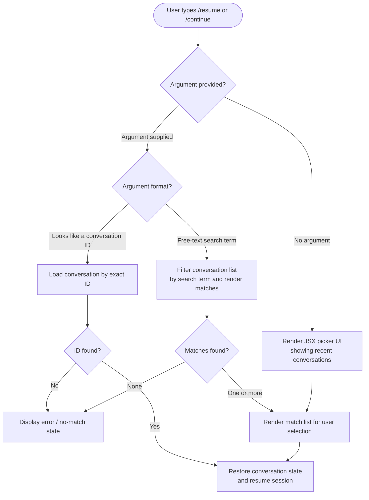

```
---
type: feature-spec
feature: "resume"
cc_version: "2.1.144"
updated: "2026-05-19"
tags: ["resume", "commands", "slash-commands"]
source: "bundle-analysis"
bundle_verified: true
analysis_basis: "CC v2.1.144 bundle.js (AST extraction + Claude interpretation)"
author: "ryujaeuk <ryujaeuk@gmail.com>"
repository: "https://github.com/MyLittleLuckyDog/cc-gnothi"
license: "AGPL-3.0-only"
---

# `/resume`

> Analysis basis: CC v2.1.144 bundle.js (AST extraction + Claude interpretation)
> Minimum version: v2.1.144

---

## Overview

The `/resume` command allows the user to return to a previously held conversation by supplying either a conversation ID or a search term. It is registered as a `local-jsx` command, meaning its output surface is rendered as a JSX component within the Claude Code CLI shell rather than as plain text. The command is also accessible via the alias `/continue`.

---

## Registration

| Field | Value |
|---|---|
| type | `local-jsx` |
| name | `resume` |
| description | Resume a previous conversation |
| argumentHint | `[conversation id or search term]` |
| aliases | `continue` |
| module\_id | `ijq` |

Analysis basis: CC v2.1.144 bundle.js:+11243419

---

## Input Branching

The AST traversal for module `ijq` returned an empty call graph (`callGraph: []`), empty literals list (`literals: []`), and empty telemetry list (`telemetry: []`), with the extractor note: *"no entry functions found for module 'ijq'"*. The flowchart below therefore reflects only what can be **structurally inferred** from the registration fields. Claims marked `<!-- TODO -->` require deeper traversal to verify.



> **Important caveat:** The flowchart above is a best-effort structural inference derived solely from
> the registration metadata (`argumentHint`, `type`, `aliases`). The call graph traversal produced
> no edges at depth ≤ 2. Internal branching conditions, exact rendering logic, and error messages
> are <!-- TODO: not found in depth-2 traversal; needs --depth 4 -->.

---

## Behavioral Spec

### Command Dispatch

Because `callGraph` is empty, no concrete implementation edges were recovered. The following pseudocode describes the **expected entry-point pattern** for a `local-jsx` command of this shape and should be treated as structural inference only.

```
function handleResumeCommand(rawArgument):
    argument = trim(rawArgument)

    if argument is empty:
        return renderConversationPickerUI(allConversations)
    else:
        return renderResumeUI(argument)

function renderResumeUI(query):
    if looksLikeConversationId(query):
        conversation = lookupById(query)
        if conversation exists:
            return restoreConversation(conversation)
        else:
            return renderNoMatchError(query)
    else:
        matches = filterConversationsByTerm(allConversations, query)
        if matches is empty:
            return renderNoMatchError(query)
        else:
            return renderMatchList(matches)

function restoreConversation(conversation):
    // Load prior message history, context, and tool state
    // Resume interactive session from saved point
    loadConversationState(conversation)
    activateSession(conversation)
```

> Analysis basis (registration only): CC v2.1.144 bundle.js:+11243419
>
> Implementation internals (branching conditions, state restoration mechanism, UI component
> structure, error copy) are
> <!-- TODO: not found in depth-2 traversal; needs --depth 4 -->

### Alias Handling

The command is registered with the alias `continue`, meaning `/continue` and `/resume` are
functionally identical dispatch paths within the CLI command router. Both names resolve to the same
`local-jsx` handler in module `ijq`.

Analysis basis: CC v2.1.144 bundle.js:+11243419

### Render Type: `local-jsx`

A `local-jsx` registration type indicates that the command's output is rendered as a React/JSX
component tree within the CLI's terminal UI layer, rather than being printed as a raw string.
This enables interactive elements such as scrollable lists, keyboard-navigable pickers, or
highlighted match displays. The specific component hierarchy is
<!-- TODO: not found in depth-2 traversal; needs --depth 4 -->.

Analysis basis: CC v2.1.144 bundle.js:+11243419

---

## State & Side Effects

| Item | Detail |
|---|---|
| Telemetry | None detected at depth ≤ 2 traversal. <!-- TODO: not found in depth-2 traversal; needs --depth 4 --> |
| Hook registration | <!-- TODO: not found in depth-2 traversal; needs --depth 4 --> |
| appState changes | <!-- TODO: not found in depth-2 traversal; needs --depth 4 --> |
| Sound | <!-- TODO: not found in depth-2 traversal; needs --depth 4 --> |
| Conversation persistence | Expected to read from local conversation store; write behavior on resume is <!-- TODO: not found in depth-2 traversal; needs --depth 4 --> |

---

## Version History

| Version | Change |
|---|---|
| v2.1.144 | Initial analysis. Registration confirmed at bundle.js:+11243419 (line 6682). Call graph traversal returned no edges for module `ijq`; deeper analysis pending. |

---

## Common Mistakes

1. **Expecting plain-text output**: Because `/resume` is registered as `local-jsx`, its output is
   an interactive UI component. Scripts or integrations that pipe Claude Code output as plain text
   may not capture the rendered conversation list correctly.

2. **Using `/continue` and expecting different behavior**: `/continue` is a registered alias and
   is functionally identical to `/resume`. There is no behavioral difference between the two
   invocations.

3. **Providing a partial ID as a search term**: If the argument superficially resembles a
   conversation ID but does not match exactly, the resolution path taken by the command
   (ID lookup vs. free-text search) is implementation-dependent and
   <!-- TODO: not found in depth-2 traversal; needs --depth 4 -->.

4. **Assuming session state is fully restored**: The extent to which tool registrations, working
   directory context, and environment variables are re-applied on resume is
   <!-- TODO: not found in depth-2 traversal; needs --depth 4 -->.

5. **Invoking the command inside an active session without argument**: Behavior when `/resume` is
   called while already inside a running conversation (rather than at the initial prompt) is
   <!-- TODO: not found in depth-2 traversal; needs --depth 4 -->.

---

## Appendix — Identifier Mapping

> For bundle debugging only. Identifiers change across versions.

| Identifier | Role |
|---|---|
| *(none)* | The depth-≤-2 AST traversal of module `ijq` returned an empty identifier list. No obfuscated names were recovered. Re-run extraction at `--depth 4` or higher to populate this table. |
```