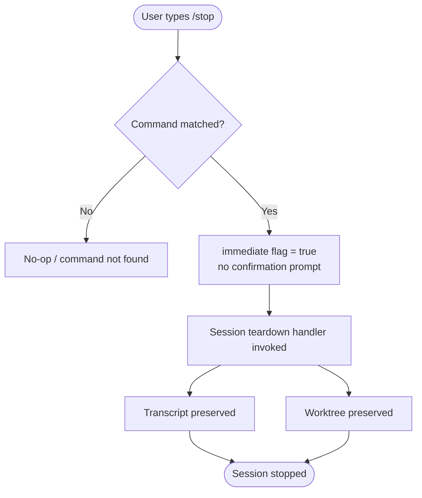

```
---
type: feature-spec
feature: "stop"
cc_version: "2.1.144"
updated: "2026-05-19"
tags: ["stop", "commands", "slash-commands"]
source: "bundle-analysis"
bundle_verified: true
analysis_basis: "CC v2.1.144 bundle.js (AST extraction + Claude interpretation)"
author: "ryujaeuk <ryujaeuk@gmail.com>"
repository: "https://github.com/MyLittleLuckyDog/cc-gnothi"
license: "AGPL-3.0-only"
---

# `/stop`

> Analysis basis: CC v2.1.144 bundle.js (AST extraction + Claude interpretation)
> Minimum version: v2.1.144

---

## Overview

The `/stop` command terminates the current background Claude Code session immediately upon invocation. The session's transcript and any associated worktree are explicitly preserved after the session ends, allowing the user to review history or resume work later. Because the command is registered with `immediate: true`, it executes without requiring additional confirmation from the user.

---

## Registration

| Field | Value |
|---|---|
| type | `local-jsx` |
| name | `stop` |
| description | `Stop this background session; transcript and worktree are kept` |
| immediate | `true` |
| module_id | `Dyq` |

Analysis basis: CC v2.1.144 bundle.js:+12050365

---

## Input Branching

The AST traversal recovered no call-graph edges and no branching literals from module `Dyq` at depth ≤ 2. The command's `immediate: true` flag indicates that the runtime invokes the handler directly upon the slash-command match, with no argument parsing or sub-command dispatch required.

The minimal branching model that can be stated with certainty is:



Analysis basis: CC v2.1.144 bundle.js:+12050365

<!-- TODO: internal teardown branching not found in depth-2 traversal; needs --depth 4 -->

---

## Behavioral Spec

### Session Stop — Immediate Execution

Because `immediate` is `true`, the runtime does not render an interactive confirmation UI before calling the handler. The high-level logic can be described as:

```
function handleStopCommand():
    # No arguments are parsed; command is argument-free
    markSessionAsStopped()
    preserveTranscript()   # transcript is NOT deleted
    preserveWorktree()     # worktree is NOT deleted
    exitSession()
```

Analysis basis: CC v2.1.144 bundle.js:+12050365

### Transcript Preservation

The description field explicitly states that the transcript is kept after the session stops. No cleanup or truncation of the conversation log is performed as a side effect of `/stop`.

```
function preserveTranscript():
    # Leave session log files in place on disk
    # No deletion, no archival compression at stop time
    return
```

Analysis basis: CC v2.1.144 bundle.js:+12050365

### Worktree Preservation

Any git worktree that was created or associated with the background session is also retained intact when `/stop` is issued.

```
function preserveWorktree():
    # Do not remove or prune the associated git worktree
    # Worktree remains accessible after session exit
    return
```

Analysis basis: CC v2.1.144 bundle.js:+12050365

<!-- TODO: exact worktree path resolution and git command calls not found in depth-2 traversal; needs --depth 4 -->

---

## State & Side Effects

| Item | Detail |
|---|---|
| Telemetry | None detected at depth ≤ 2 traversal <!-- TODO: needs --depth 4 --> |
| Hook registration | <!-- TODO: not found in depth-2 traversal; needs --depth 4 --> |
| appState changes | Session is marked stopped; transcript and worktree state remain unchanged |
| Sound | <!-- TODO: not found in depth-2 traversal; needs --depth 4 --> |
| Confirmation prompt | Suppressed — `immediate: true` bypasses any confirmation UI |
| Argument parsing | None — command accepts no arguments |

---

## Version History

| Version | Change |
|---|---|
| v2.1.144 | Initial analysis; command registered at bundle.js:+12050365, line 7993 |

---

## Common Mistakes

1. **Expecting data loss**: Users sometimes assume `/stop` deletes the transcript or worktree. The description explicitly guarantees both are kept — stopping a session is non-destructive.
2. **Awaiting a confirmation prompt**: Because `immediate: true` is set, the command executes the moment it is matched. There is no secondary "Are you sure?" step; issuing `/stop` is final.
3. **Confusing `/stop` with a full project teardown**: `/stop` terminates only the current *background session*. Project files, git history, and the worktree directory remain on disk and are unaffected.
4. **Passing arguments**: The command registration contains no argument schema. Any text typed after `/stop` is not processed and will be ignored or may cause an unrecognised-argument error depending on the CLI argument dispatcher.

---

## Appendix — Identifier Mapping

> For bundle debugging only. Identifiers change across versions.

| Identifier | Role |
|---|---|
| `Dyq` | Module identifier for the `/stop` command implementation |

> No additional obfuscated function or variable identifiers were recovered from the depth-2 AST traversal of module `Dyq`. The call graph, literals, and identifier arrays were all empty in the extracted data. A deeper traversal (`--depth 4`) is recommended to recover internal handler names.
```