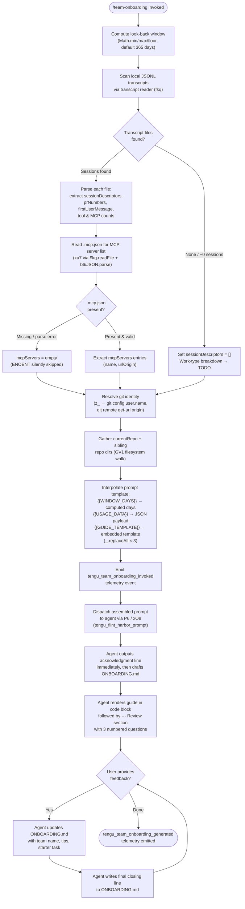

# `/team-onboarding`

> Analysis basis: CC v2.1.144 bundle.js (AST extraction + Claude interpretation)
> Minimum version: v2.1.144

---

## Overview

`/team-onboarding` is a `prompt`-type slash command that analyzes the invoking user's local Claude Code transcript history and co-authors a structured `ONBOARDING.md` guide suitable for teammates who are new to Claude Code. The command collects usage statistics (session descriptors, MCP server configurations, repository context) over a configurable look-back window (default 365 days), interpolates them into a multi-section template, and sends the assembled prompt to the agent for collaborative, iterative guide generation.

---

## Registration

| Field | Value |
|---|---|
| `type` | `prompt` |
| `name` | `team-onboarding` |
| `description` | Help teammates ramp on Claude Code with a guide from your usage |
| `isHidden` | `false` |
| `handler_method` | `getPromptForCommand` |
| `handler_method_start` (byte) | 11978652 |
| `handler_method_end` (byte) | 11979308 |
| `loc_byte` | 11978314 |
| `loc_byte_end` | 11979309 |
| `loc_line` | 7914 |
| `prompt_body.length` | 4539 characters |
| `prompt_body.trace` | `identifier→$ (local→1 ext vars)` |
| `arbor_handler.name` | `getPromptForCommand` |
| `arbor_handler.fqn` | `claude-2.1.144::getPromptForCommand` |
| `arbor_handler.kind` | `Method` |
| `arbor_handler.resolution_path` | `direct` |
| `arbor_handler.n_hits` | 2 |
| `handler_method_start` | `11978652` |
| `handler_method_end` | `11979308` |

Analysis basis: CC v2.1.144 bundle.js:+11978314

---

## Input Branching

The handler executes through more than three distinct paths (data collection, window computation, MCP config loading, git identity resolution, prompt template interpolation, and guide dispatch), so a Mermaid flowchart is used.



Analysis basis: CC v2.1.144 bundle.js:+11978652 – +11979308

---

## Behavioral Spec

### 1. Look-back Window Computation

```
function computeWindowDays(userArg):
    # Three Math calls constrain the value to a safe integer range
    raw    = parseIntOrDefault(userArg, default=365)
    clamped = Math.min(Math.max(Math.floor(raw), 1), 365)
    return clamped          # unit: days; used as WINDOW_DAYS in prompt
```

Default window: **365 days** (bundle literal at bundle.js:+11978901).

Analysis basis: CC v2.1.144 bundle.js:+11978855 – +11978873

---

### 2. Transcript Collection and Parsing (`transcriptReader`)

```
async function collectTranscripts(windowDays):
    cutoff    = Date.now() - windowDays * 24 * 60 * 1000   # ms; literals at +11967155/+11967158/+11967164
    transcriptDir = resolveTranscriptDirectory()             # platform projects dir
    files     = await usH.readdir(transcriptDir)
    jsonlFiles = files.filter(f => path.extname(f) === ".jsonl")   # literal ".jsonl" at +11967270

    sessions  = []
    for each file in jsonlFiles:
        stats = await usH.stat(join(transcriptDir, file))
        if not stats.isFile():
            continue
        raw = await usH.readFile(join(transcriptDir, file))
        lines = raw.split("\n")                              # $.split at +11967640

        descriptor = extractDescriptor(lines)
        # Regex passes: Su7.exec (session title), hu7.exec (PR numbers),
        #               Ru7.exec (content blocks / first user message)
        # MCP detection: scan for '"name":"mcp__' literal at +11967849
        # Tool-call counting: scan for '"content":[' literal at +11968199
        # Depth limit: first 10 lines sampled for efficiency             (+11967666)
        # PR number capped at 3                                          (+11968302)

        if descriptor.timestamp >= cutoff:
            sessions.push(descriptor)

    return sessions   # array of sessionDescriptors
```

Analysis basis: CC v2.1.144 bundle.js:+11967142 – +11968339

---

### 3. MCP Server Configuration Loading (`mcpConfigReader`)

```
async function loadMcpServers(workspaceRoot):
    configPath = path.join(workspaceRoot, ".mcp.json")      # literal at +11969381
    try:
        raw  = await $kq.readFile(configPath, "utf8")       # encoding literal at +11969394
        obj  = JSON.parse(raw)                              # b6 at +11969404
        servers = obj["mcpServers"] ?? {}                   # key literal at +11969437
        return normalizeServerList(servers)                  # v, O8 helpers
    catch (ENOENT | parse error):
        return []
```

Analysis basis: CC v2.1.144 bundle.js:+11969357 – +11969616

---

### 4. Git Identity Resolution (`gitIdentityResolver`)

```
async function resolveGitIdentity():
    nameResult   = await runGit(["config", "user.name"])    # literals at +11970004/+11970011/+11970020
    originResult = await runGit(["remote", "get-url", "origin"])  # literals at +11970076/+11970085/+11970095

    generatedBy  = nameResult.stdout.trim()   # used in ONBOARDING.md author field
    remoteUrl    = originResult.stdout.trim()
    return { generatedBy, remoteUrl }
    # SPH parses git remote URL to extract host/org/repo components
    # Handles "git/" prefix (literal at +1054664) and localhost (literal at +1058783)
```

Analysis basis: CC v2.1.144 bundle.js:+11970001 – +11970192

---

### 5. Repository Discovery (`repoWalker`)

```
function discoverRepos(workspaceRoot):
    currentRepo = path.basename(workspaceRoot)
    siblings    = []
    parentDir   = path.dirname(workspaceRoot)
    entries     = _.readdirStringSync(parentDir)

    for each entry in entries:
        entryPath = path.join(parentDir, entry)
        if entryPath.startsWith(workspaceRoot): continue    # skip self
        stat = _.statSync(entryPath)
        if stat is directory:
            siblings.push(entry)

    return { currentRepo, siblings }
    # GV1 also maintains a "backups" subdirectory (literal at +3166399)
```

Analysis basis: CC v2.1.144 bundle.js:+3166432 – +3167077 (GV1)

---

### 6. Prompt Assembly and Dispatch (`getPromptForCommand`)

```
function getPromptForCommand(context):
    { windowDays, sessions, mcpServers, gitIdentity, repos } = gatherData(context)

    usagePayload = JSON.stringify({
        sessionDescriptors : sessions,
        mcpServers         : mcpServers,
        currentRepo        : repos.currentRepo,
        siblingRepos       : repos.siblings,
        generatedBy        : gitIdentity.generatedBy,
        totalSessions      : sessions.length
    })

    # Three sequential replaceAll calls substitute template variables:
    prompt = BASE_PROMPT_TEMPLATE
                .replaceAll("{{WINDOW_DAYS}}",    String(windowDays))   # literal at +11979058
                .replaceAll("{{GUIDE_TEMPLATE}}", GUIDE_TEMPLATE)        # literal at +11979098
                .replaceAll("{{USAGE_DATA}}",     usagePayload)          # literal at +11979133

    emit("tengu_team_onboarding_invoked", { windowDays, sessionCount: sessions.length })

    return { type: "text", content: prompt }   # return type literal "text" at +11979292
```

Analysis basis: CC v2.1.144 bundle.js:+11979036 – +11979292

---

### 7. Agent-side Guide Generation (Prompt Instructions Summary)

The assembled prompt instructs the agent to follow a strict, ordered protocol:

1. **Immediate acknowledgment** — The very first visible output must be a blockquote referencing `WINDOW_DAYS` and the onboarding purpose. No pre-thinking, no tool calls before this line.

2. **Work-type classification** — Classify every entry in `sessionDescriptors` into one of seven canonical categories: Build Feature, Debug Fix, Improve Quality, Analyze Data, Plan Design, Prototype, Write Docs. Categories are derived from title, `prNumbers`, and first user message. Top 3–5 categories with approximate percentages are surfaced. Tool and MCP counts serve only as a weak tiebreaker when first messages are uninformative. New categories may only be invented if no existing category fits.

3. **Context gathering** — Populate repo list from `currentRepo` plus workspace siblings; infer MCP server purpose from `name` and `urlOrigin`. Team Tips and Get Started sections are left as `TODO` placeholders at this stage.

4. **Draft generation** — Write `ONBOARDING.md` using the embedded `GUIDE_TEMPLATE`. Real numbers from `usagePayload` replace every placeholder. ASCII bar charts use `█` (filled) and `░` (empty) at 20 characters wide. `generatedBy` populates the author field; omitted if absent.

5. **Turn close-out** — Guide is rendered in a fenced code block. A `---` rule and `**Review**` heading follow. Three numbered review questions are posed (team name confirmation, starter task, team tips).

6. **Iterative update** — After the user responds, `ONBOARDING.md` is updated with team name, tips, and starter task. The session closes with a fixed verbatim closing line directing the user to distribute the file.

Analysis basis: CC v2.1.144 bundle.js:+11978652 – +11979308 (prompt_body, length 4539)

---

## State & Side Effects

| Item | Detail |
|---|---|
| Telemetry: `tengu_team_onboarding_invoked` | Emitted at handler entry; carries `windowDays` and session count (bundle.js:+11978912) |
| Telemetry: `tengu_team_onboarding_generated` | Emitted after the agent produces the guide (bundle.js:+11979177) |
| Telemetry: `tengu_flint_harbor_prompt` | Emitted when prompt is dispatched to the agent runtime via `P6` (bundle.js:+11978689) |
| Telemetry: `tengu_flint_harbor_share` | Emitted by the `xO8` share helper when context is forwarded (bundle.js:+8985546) |
| Telemetry: `tengu_config_parse_error` | Emitted if config file read/parse fails inside the config accessor (bundle.js:+3167468) |
| Telemetry: `tengu_feature_ok` / `tengu_feature_bad` | Feature-flag check outcomes (bundle.js:+955520 / +955578) |
| Telemetry: background session events | `tengu_bg_dispatch_sigkill_escalate`, `tengu_bg_dispatch_low_mem`, `tengu_bg_spare_enable`, `tengu_bg_spare_claim`, `tengu_bg_spare_claim_fail`, `tengu_bg_spare_spawn`, `tengu_daemon_control`, `tengu_bg_low_mem_mb` — emitted by the background daemon layer invoked to run the prompt session |
| Telemetry: `tengu_growthbook_experiment` / `GrowthbookExperimentEvent` | Emitted by A/B framework during feature-flag evaluation (bundle.js:+3138152/+3138579) |
| File write | Agent writes `ONBOARDING.md` in the working directory during guide generation |
| File read | `.mcp.json` read from workspace root at invocation (bundle.js:+11969381) |
| File read | JSONL transcript files read from the local Claude Code projects directory (bundle.js:+11967183) |
| Config access | Global config accessor `V$H` reads config before command runs; access before initialization raises `"Config accessed before allowed."` (bundle.js:+3166831) |
| Hook registration | `h1` registers with `OHA.register` (bundle.js:+57049) — lifecycle hook for file watch setup/teardown via `fCL` |
| File watch | `xr6.watchFile` / `xr6.unwatchFile` used by `fCL` to track transcript file changes during session |
| appState changes | Session UUID generated via `C1_.randomUUID` and added to active session registry (`m1_.add`, `K56.add`); removed on completion |
| Random bytes | `TV1.randomBytes(32)` produces hex session token (bundle.js:+3170375/+3170388) |
| Git subprocess | `git config user.name` and `git remote get-url origin` spawned for identity/repo resolution (bundle.js:+11970004 – +11970095) |
| Sound | No sound events found in depth-2 traversal |

---

## Version History

| Version | Change |
|---|---|
| v2.1.144 | Initial analysis — command introduced; 365-day default window; seven task-type taxonomy; three-phase Review flow |

---

## Common Mistakes

1. **Running outside a git repository** — `git config user.name` and `git remote get-url origin` will fail silently; `generatedBy` and the repo name will be omitted from the guide. Ensure the working directory is inside a git repo for a fully populated output.

2. **No transcript history** — If the Claude Code projects directory contains no `.jsonl` files within the look-back window, `sessionDescriptors` will be empty and the work-type breakdown section in `ONBOARDING.md` will be left as `TODO`. Run the command after accumulating at least a few sessions for a meaningful guide.

3. **Missing `.mcp.json`** — MCP server entries in the guide will be blank. Create or commit a `.mcp.json` in the workspace root so teammates receive accurate setup instructions.

4. **Skipping the Review questions** — The Team Tips and Get Started sections are deliberately left as `TODO` after the first draft. The agent expects the user to answer all three Review questions; bypassing them produces an incomplete guide.

5. **Manually editing the prompt template variables** — The three placeholders (`{{WINDOW_DAYS}}`, `{{USAGE_DATA}}`, `{{GUIDE_TEMPLATE}}`) are substituted programmatically by `_.replaceAll` inside `getPromptForCommand`. Editing them in the raw command output has no effect on the data injected.

6. **Assuming the look-back window is unlimited** — The window is hard-clamped to a maximum of **365 days** (bundle.js:+11978901). Specifying a larger value will be silently reduced to 365.

---

## Appendix — Identifier Mapping

> For bundle debugging only. Identifiers change across versions.

| Identifier | Role |
|---|---|
| `__handler_team-onboarding` | Synthetic BFS entry point for the command handler (not a real bundle symbol; prefer `getPromptForCommand` per arbor_handler) |
| `P6` | Prompt dispatch / session launcher — routes assembled prompt to the agent runtime |
| `f56` | Sub-helper called by session launcher (exact role not resolved at depth-2) |
| `M56` | Sub-helper called by session launcher (exact role not resolved at depth-2) |
| `Cs` | Session context builder — assembles context object passed to launcher |
| `xH` | String conversion utility used in context building |
| `IF` | Feature-flag evaluator |
| `lu` | Feature-flag resolution helper (calls `ghL`, `YO`, `QA6`) |
| `Vr6` | Session deduplication / registry check — consults `m1_` and `T$H` maps |
| `u1_` | New session initializer — generates UUID, emits session-creation events |
| `R0H` | First-party session classifier (literal `"firstParty"`) |
| `cu` | Random token generator — calls `TV1.randomBytes(32)`, hex-encodes |
| `CH` | JSON serializer wrapper (`JSON.stringify`) |
| `RRL` | Post-session cleanup or result relay |
| `F1_` | Session finalization handler |
| `Zw1` | Finalization sub-step (calls `FmH`) |
| `B_` | Finalization sub-step (calls `Du`) |
| `LV1` | Finalization sub-step (exact role not resolved at depth-2) |
| `dRH` | Permission / allow-list check (consults `TNK`) |
| `y6` | File snapshot / transcript recorder — reads, copies, and watches files |
| `m6` | Shared module reference (exact role not resolved at depth-2) |
| `t1_` | Shared utility (exact role not resolved at depth-2) |
| `V$H` | Config file accessor — reads config JSON, raises error if accessed too early |
| `q` | Filesystem module alias (node `fs` / Bun fs layer) |
| `b6` | JSON.parse wrapper |
| `TR` | Path/string prefix stripper (`.startsWith` + `.slice`) |
| `_` | General utility / filesystem sync ops (`readdirStringSync`, `statSync`, `toUpperCase`) |
| `A8` | Shared helper (exact role not resolved at depth-2) |
| `GV1` | Repository discovery — walks sibling directories, maintains backups subdir |
| `v` | Model/variant formatter — trims, uppercases, formats model identifiers |
| `kH` | Error logger / transcript error handler (`Sc.logError`, pushes to `HCH`) |
| `d` | Shared low-level helper (exact role not resolved at depth-2) |
| `L9_` | Path join helper — resolves subpaths within a base directory |
| `w` | Background daemon manager — spawns, monitors, kills background sessions |
| `fCL` | File-watch lifecycle manager — sets up/tears down `xr6.watchFile` listeners |
| `Rl` | Watch callback handler (exact role not resolved at depth-2) |
| `h1` | Hook registrar — calls `OHA.register` for lifecycle hooks |
| `uu7` | Main usage-data aggregator — orchestrates transcript scanning, MCP config loading, git resolution |
| `q_` | Projects directory resolver (calls `WV`) |
| `WV` | Platform-specific projects path provider |
| `cG` | Project path builder — joins MCH paths and applies `hV`/`JO` transformations |
| `hV` | Path normalizer (joins with `MCH`, calls `n8`) |
| `JO` | Path slug transformer — replaces separators, slices, calls `XyK` |
| `H` | Shared string / event utility (also used as `Math.random` / `setTimeout` wrapper in retry logic) |
| `XyK` | Absolute-value + hash helper for path slug computation |
| `fkq` | JSONL transcript parser — reads files, extracts session descriptors, PR numbers, MCP usage, tool counts |
| `C1` | Error code classifier (calls `A8`) |
| `K` | Array mapping utility |
| `L` | Promise queue / task runner |
| `f` | Stream / file handle abstraction |
| `O` | File-stat helper (calls `k8`) |
| `k8` | Low-level stat result accessor |
| `$` | Transcript line source (split on newlines); also `NVq` record builder |
| `NVq` | Session record constructor (calls `Qa`, `Date.now`, `n9`, `SG6`, `CH`) |
| `z` | Background session controller — stop/status/daemon operations |
| `RH` | Background session stop handler |
| `bH` | Background session stop-failure handler |
| `BN` | Daemon control dispatcher (calls `IF`, `ZF.push`, `R0H`, `x1_`) |
| `Xx` | Process race/exit coordinator (`Promise.race`, `process.exit`) |
| `D` | Daemon process manager — spawns, monitors, recycles background agents |
| `fT6` | Platform detector (distinguishes `"macos"` / `"windows"`) |
| `Ta_` | Background spare-session spawner (`Bun.spawn`, `VU.mkdir/unlink`) |
| `xu7` | MCP config file reader — reads `.mcp.json`, parses `mcpServers` |
| `O8` | Object normalizer helper (calls `A8`) |
| `bu7` | Additional usage-data sub-collector (exact role not resolved at depth-2) |
| `z_` | Git subprocess runner — executes `git config user.name` and `git remote get-url origin` |
| `vPH` | Child-process abstraction layer — full subprocess lifecycle (spawn, pipe, timeout, kill) |
| `TYA` | Platform command wrapper (adds `.exe`/`cmd /q` on win32) |
| `iu8` | Async iterator helper |
| `ru8` | Async iterator helper variant |
| `au8` | Iterator completion helper |
| `yzA` | Finite-number validator |
| `tA6` | Subprocess execution core (`GSK`, error handling, `Boolean`) |
| `nu8` | `Reflect.apply` / `Reflect.defineProperty` utility |
| `KYA` | Process `"exit"` event listener registrar |
| `kzA` | Timeout-race wrapper (`setTimeout`, `clearTimeout`, `Promise.race`) |
| `SzA` | Signal-kill wrapper (`H.kill`, `q.finally`) |
| `vzA` | stdin/event bridge |
| `NzA` | `SIGTERM` / `H.kill` sender |
| `AYA` | Parallel output collector (`Promise.all`, `lu8`, `cu8`) |
| `A16` | Output chunk aggregator (calls `Nu8`) |
| `HYA` | Stream pipe handler (`A.pipe`, `sR6`, `oSK`) |
| `_YA` | `szA.default` stream adapter |
| `bzA` | stdout/stderr multiplexer (`mu8.bind` for stdout/stderr/all streams) |
| `$hK` | String coercion helper |
| `SPH` | Git remote URL parser — extracts host, org, repo from remote URL string |
| `xhK` | URL host/port splitter (calls `V9`) |
| `V9` | String index/slice splitter |
| `xO8` | Prompt share dispatcher — forwards final prompt context via `Aq`, `CA`, `P6` |
| `Aq` | Context accessor / resolver (calls `D3A`) |
| `D3A` | Deep context resolver (calls `xH`) |

---

Note: index built via Arbor fallback; some signals (telemetry, literals) may be missing — see arbor-fallback.js.