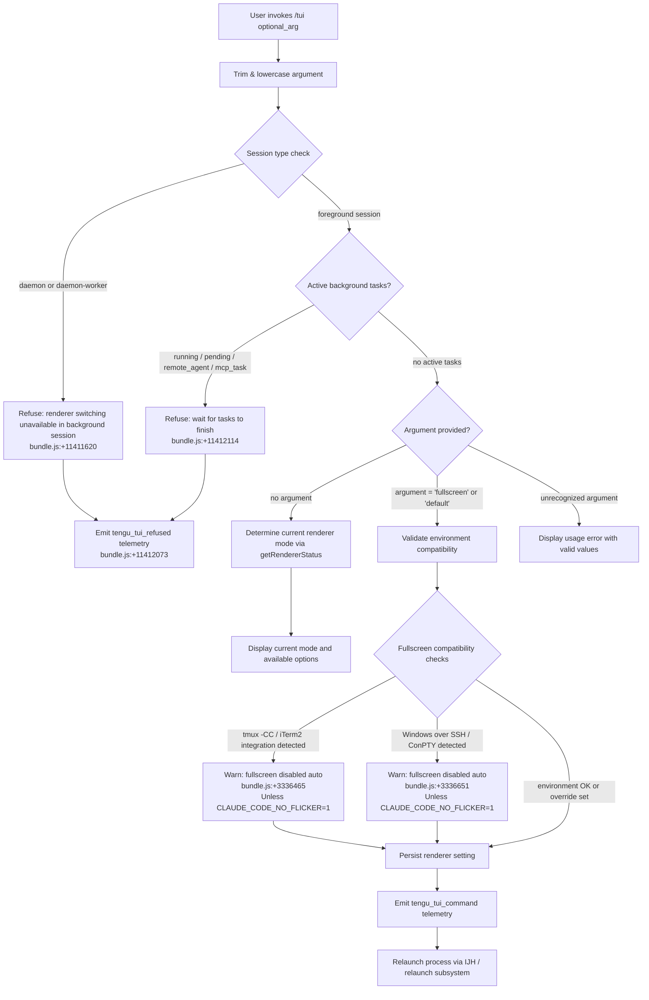

# `/tui`

> Analysis basis: CC v2.1.144 bundle.js (AST extraction + Claude interpretation)
> Minimum version: v2.1.144

---

## Overview

The `/tui` command switches the active terminal UI renderer between `default` and `fullscreen` modes at runtime. It validates environment compatibility and session state before performing the switch, emitting a graceful process relaunch to apply the new renderer. The command refuses to operate in background/daemon sessions or when active background tasks are pending.

---

## Registration

| Field | Value |
|---|---|
| type | `local-jsx` |
| name | `tui` |
| description | `Set the terminal UI renderer (default \| fullscreen)` |
| argumentHint | `[default\|fullscreen]` |
| module_id | `c2q` |
| load_inline | `true` |
| loc_byte | `11413342` |
| loc_byte_end | `11413524` |
| loc_line | `6993` |
| arbor_handler.name | `ZN7` |
| arbor_handler.fqn | `claude-2.1.144::ZN7` |
| arbor_handler.kind | `AsyncFunction` |
| arbor_handler.resolution_path | `module_id` |
| arbor_handler.n_hits | `0` |

Analysis basis: CC v2.1.144 bundle.js:+11413342

---

## Input Branching

The command has 5+ distinct outcome paths based on argument value, session type, task state, and environment compatibility. A Mermaid flowchart is used.



---

## Behavioral Spec

### Handler Entry — `tuiCommandHandler` (ZN7)

The primary async handler resolves via module `c2q` and is identified by Arbor as `ZN7` at resolution path `module_id`.

```
async function tuiCommandHandler(args, appContext):
    rawArg = args.trim()                         // bundle.js:+11411317
    mode   = rawArg.toLowerCase()                // bundle.js:+14567299

    sessionType = getSessionType(appContext)      // calls sessionTypeResolver (B_→Du)
    if sessionType in ["daemon", "daemon-worker"]:
        emit telemetry("tengu_tui_refused")       // bundle.js:+11412073
        return errorMessage(BACKGROUND_SESSION_MSG)
            // "Renderer switching isn't available in a background session..."
            // bundle.js:+11411620

    activeTasks = collectActiveTasks(appContext)  // Object.values, bundle.js:+11411945
    if any task.status in ["running","pending","remote_agent","mcp_task"]:
        emit telemetry("tengu_tui_refused")       // bundle.js:+11412073
        return errorMessage(BACKGROUND_TASKS_MSG)
            // "Cannot switch renderers while background tasks are running..."
            // bundle.js:+11412114

    if mode == "" or mode not in ["fullscreen","default"]:
        return renderCurrentModeUI(appContext)    // no argument → show status

    compatResult = checkRendererCompatibility(mode, appContext)  // calls XI
    // compatResult carries one of the reason codes from C$H sub-checks

    if compatResult.blocked and not env.CLAUDE_CODE_NO_FLICKER:
        // display auto-disable warning but may still proceed with default

    persistRendererSetting(mode)                 // calls dxL→P6
    emit telemetry("tengu_tui_command",          // bundle.js:+11412545
        {mode, uptime: Math.round(process.uptime()), ...})

    relaunchProcess(appContext)                  // calls d2q→IJH
```

Analysis basis: CC v2.1.144 bundle.js:+11411317

---

### Session Type Gate — `sessionTypeResolver` (B_ → Du)

```
function resolveSessionType(appContext):
    settings = loadSettingsFromDisk()           // Du→mp8, bundle.js:+1205452
    // emits "loadSettingsFromDisk_start" / "loadSettingsFromDisk_end"
    // emits log event "settings_load_started" / "settings_load_completed"
    sessionKind = readSessionKind(appContext)   // kB subsystem
    return sessionKind
    // possible values: "system","daemon","daemon-worker","local-agent","bg"
```

Analysis basis: CC v2.1.144 bundle.js:+11411342

---

### Active Task Collection

```
function collectActiveTasks(appContext):
    allTasks = Object.values(appContext.taskRegistry)  // bundle.js:+11411945
    blockers = allTasks.filter(t =>
        t.status in ["running","pending","remote_agent","mcp_task"])
    return blockers
    // strings sourced: bundle.js:+11411984, +11412006, +11412027, +11412052
```

Analysis basis: CC v2.1.144 bundle.js:+11411945

---

### Renderer Compatibility Check — `checkRendererCompatibility` (XI)

```
function checkRendererCompatibility(mode, env):
    // XI calls several environment probes: bundle.js:+11412412

    isTmuxCC = detectTmuxControlMode()          // gxL: checks for "screen","tmux" prefix
                                                 //  then spawnSync tmux display-message -p
                                                 //  "#{client_control_mode}", timeout 2000ms
                                                 //  bundle.js:+3335719,+3335793
    isITerm  = checkITermApp()                  // gxL: H.startsWith("iTerm.app")
                                                 //  bundle.js:+3335496

    if (isTmuxCC or isITerm) and mode=="fullscreen":
        // "fullscreen disabled: tmux -CC (iTerm2 integration mode)..."
        // bundle.js:+3336465
        return {blocked:true, reason:"tmux_cc_auto_off"}

    isWinSSH = detectWindowsOverSSH()           // Iq_: platform=="windows", bundle.js:+3336003
    if isWinSSH and mode=="fullscreen":
        // "fullscreen disabled: Windows over SSH (ConPTY re-rendering)..."
        // bundle.js:+3336651
        return {blocked:true, reason:"win_ssh_auto_off"}

    // Additional reason codes tracked by C$H / getRendererStatus:
    //   "bg_forced_on"     bundle.js:+3337218
    //   "env_off"          bundle.js:+3337248
    //   "env_on"           bundle.js:+3337306
    //   "settings_on"      bundle.js:+3337423
    //   "settings_off"     bundle.js:+3337457
    //   "downsell_on"      bundle.js:+3337530
    //   "gb_on"            bundle.js:+3337595
    //   "gb_off"           bundle.js:+3337603

    return {blocked:false, reason:null}
```

Analysis basis: CC v2.1.144 bundle.js:+11412412

---

### Environment Variables Consulted

| Variable | Purpose |
|---|---|
| `CLAUDE_CODE_NO_FLICKER` | Overrides auto-disable of fullscreen when tmux-CC or Windows-SSH is detected (bundle.js:+11409627) |
| `CLAUDE_CODE_DISABLE_ALTERNATE_SCREEN` | Disables alternate screen sequences globally (bundle.js:+11409652) |
| `CLAUDE_CODE_FORCE_FULLSCREEN_UPSELL` | Forces display of fullscreen upsell prompt (bundle.js:+11409691) |

---

### Process Relaunch — `relaunchOrchestrator` (d2q → IJH)

When a renderer switch is committed the process relaunches in-place:

```
async function relaunchOrchestrator(context):
    // IJH: bundle.js:+11409552

    // 1. Stat working directory to verify it is still accessible
    //    B2q.stat  bundle.js:+11408168

    // 2. Flush in-flight analytics with timeout
    //    Promise.all + timeout 30000ms ("flush timeout (relaunch)")
    //    bundle.js:+11408283, +11408289

    // 3. Drain output hook queue
    //    USH→OHA.drain  bundle.js:+11408334

    // 4. Wait for analytics flush with separate timeout
    //    ZA8, race 500ms ("analytics flush timeout")
    //    bundle.js:+11408401

    // 5. Build argv for resumed session
    //    includes "--resume" flag  bundle.js:+11408221
    //    CB_: resolves cwd, i$, oK   bundle.js:+11408666

    // 6. Re-exec via native execve (m2q)
    //    loads bun:ffi  bundle.js:+11407342
    //    macOS: /usr/lib/libSystem.B.dylib  bundle.js:+11407386
    //    Linux: libc.so.6  bundle.js:+11407415
    //    M.execve  bundle.js:+11407741

    // 7. On exec failure: write PID file (SP→zhH.writeFileSync),
    //    emit "relaunch_spawn_error", process.exit  bundle.js:+11409021,+11409045

    // Signal handling during relaunch window:
    //    process.removeAllListeners  bundle.js:+11408739
    //    registers SIGINT, SIGTERM, SIGHUP  bundle.js:+11408710,+11408719,+11408729
```

Analysis basis: CC v2.1.144 bundle.js:+11408092

---

### Settings Persistence — `persistRendererSetting` (dxL → P6)

```
function persistRendererSetting(mode):
    // Writes "fullscreen" or "default" into user settings
    // P6: accesses vF map (settings cache), T$H, K56
    //   bundle.js:+3144509 – f56 (field getter)
    //   bundle.js:+3144546 – M56 (field setter)
    //   bundle.js:+3144581 – Cs (settings writer)
    // Cs calls xH (string normalizer) and IF (formatter)
    //   bundle.js:+3143271, +3143307
    // y6 records timestamp via Date.now  bundle.js:+3163804
    // Vr6 guards against duplicate writes via m1_.has/add  bundle.js:+3142150
```

Analysis basis: CC v2.1.144 bundle.js:+3336847

---

### Terminal Capability Detection — `terminalCapabilityProbe` (XI → pUL, jK_)

```
function probeTerminalCapabilities(env):
    // Checks for known IDE terminal embeddings:
    //   "cursor"   bundle.js:+3407614
    //   "vscode"   bundle.js:+3407663
    //   d56.isJetBrainsIdeTerminal  bundle.js:+3406945
    //   Es.includes (TERM_PROGRAM list)  bundle.js:+3406917

    // Version range for xterm.js embedded in IDEs:
    //   min 1092000, max 1105000  bundle.js:+3407739,+3407750
    //   identified as "xterm.js"  bundle.js:+3407783

    // Platform checks:
    //   "darwin" bundle.js:+3407149
    //   "win32"  bundle.js:+3407195

    // pUL: parseFloat, Number.isNaN, Math.min capped at 20
    //   bundle.js:+3408065,+3408086,+3408110,+3408121

    // jK_: mUL sub-probe for JetBrains-specific terminal versions
    //   bundle.js:+3406907
```

Analysis basis: CC v2.1.144 bundle.js:+11412412

---

## State & Side Effects

| Item | Detail |
|---|---|
| Telemetry — `tengu_tui_refused` | Fired when the command is rejected due to background session or active tasks (bundle.js:+11412073) |
| Telemetry — `tengu_tui_command` | Fired on successful renderer switch commitment; carries mode and uptime (bundle.js:+11412545) |
| Telemetry — `tengu_amber_creek` | Fired from renderer-status subsystem (bundle.js:+3336982) |
| Telemetry — `tengu_pewter_brook` | Fired from renderer-status subsystem (bundle.js:+3336890) |
| Telemetry — `tengu_scroll_summary` | Fired during relaunch scroll/restore sequence (bundle.js:+5248880) |
| Telemetry — `tengu_slate_kestrel` | Fired from settings-persistence path (bundle.js:+4639760) |
| Telemetry — `tengu_bg_dispatch_sigkill_escalate` | Fired from background session manager during cleanup (bundle.js:+14542134) |
| Telemetry — `tengu_bg_dispatch_low_mem` | Fired from background session memory monitor (bundle.js:+14542713) |
| Telemetry — `tengu_bg_spare_enable` | Fired when spare background session slot is enabled (bundle.js:+14543352) |
| Telemetry — `tengu_bg_spare_claim` | Fired when a spare session is claimed (bundle.js:+14543473) |
| Telemetry — `tengu_bg_spare_claim_fail` | Fired when spare session claim fails (bundle.js:+14543736) |
| Telemetry — `tengu_daemon_control` | Fired from daemon lifecycle management (bundle.js:+14577473) |
| Settings write | Renderer mode (`"fullscreen"` or `"default"`) is persisted to user settings via `P6` subsystem |
| Process relaunch | On commit, the process re-execs itself via native `execve` with `--resume`; existing signal handlers are replaced |
| Cache clear | `lz` clears `jI6` and `LV8` caches as part of relaunch prep (bundle.js:+26086, +26098) |
| Hook drain | `OHA.drain` is called before process replacement (bundle.js:+57092) |
| File I/O | On relaunch failure, a PID/error file is written via `zhH.writeFileSync` (bundle.js:+188794) |

---

## Version History

| Version | Change |
|---|---|
| v2.1.144 | Initial analysis |

---

## Common Mistakes

1. **Invoking `/tui` from a background/daemon session** — The command will always refuse with the message "Renderer switching isn't available in a background session…" You must detach first and run the command from a foreground session.
2. **Running `/tui` while background tasks are active** — Tasks with status `running`, `pending`, `remote_agent`, or `mcp_task` block the switch. Use `/tasks` to stop them first.
3. **Expecting immediate visual effect without relaunch** — The renderer switch requires a full process re-exec (`execve`). The session will restart; unsaved in-memory state that is not part of the resumed conversation may be lost.
4. **Trying to force fullscreen in tmux `-CC` or Windows-over-SSH without the override variable** — Without `CLAUDE_CODE_NO_FLICKER=1`, the command will downgrade to `default` automatically and display a warning.
5. **Passing an unrecognized argument** — Only the literals `fullscreen` and `default` are accepted (case-insensitive). Any other value triggers the usage display rather than a switch.

---

## Appendix — Identifier Mapping

> For bundle debugging only. Identifiers change across versions.

| Identifier | Role |
|---|---|
| `ZN7` | Main async handler for `/tui` command (tuiCommandHandler) |
| `B_` | Session type resolver dispatcher |
| `Du` | Settings-and-session bootstrap (calls mp8, kB, AR, j9) |
| `AR` | Settings load helper called from Du |
| `j9` | Performance/memory sampling helper |
| `cx` | perf_hooks require wrapper |
| `mp8` | Settings disk loader (loadSettingsFromDisk core) |
| `T8` | Log file appender used during settings load |
| `PI6` | Settings sub-loader |
| `m16` | Flag-settings set manager |
| `KJA` | Policy/user settings merger |
| `K` | Column pad formatter (padEnd 40) |
| `o5H` | Settings file path resolver (userSettings, projectSettings, localSettings) |
| `NB` | Settings parser / normalizer |
| `_JA` | SDK inline settings handler |
| `kB` | Session context builder |
| `q_` | Session kind reader |
| `NH6` | Session context field accessor |
| `PI8` | Session context field accessor |
| `EH6` | Session context field accessor |
| `_XH` | Session context field accessor |
| `kH6` | Session context field accessor |
| `l5H` | Session context field accessor |
| `n5H` | Session context field accessor |
| `yp8` | Session context field accessor |
| `BwA` | Session context field accessor |
| `mc` | Session context field accessor |
| `p16` | WSL / platform settings accessor |
| `XI6` | Session bootstrap finalizer |
| `aA` | Renderer status aggregator (getRendererStatus) |
| `dRH` | Renderer status cache check |
| `vq_` | Color/background mode probe |
| `Cq` | String normalization for color mode |
| `xH` | Generic string normalizer |
| `Ql` | Renderer preference reader |
| `QxL` | tmux / iTerm detection runner |
| `gxL` | Terminal multiplexer prefix checker |
| `v` | Debug/log writer |
| `vfK` | Log level filter |
| `YHA` | Log sink router |
| `H` | Randomized delay / timer utility (Math.random + setTimeout) |
| `CH` | JSON.stringify wrapper |
| `_` | Generic collection or utility |
| `x4` | Argument sanitizer / redactor |
| `d8A` | Arg-map sanitizer |
| `YhH` | Terminal write wrapper |
| `h8A` | Raw H.write wrapper |
| `yfK` | File logger (append-to-log-file pipeline) |
| `pSH` | Buffered output flusher |
| `z_H` | Log line builder |
| `m6` | Error/info logger |
| `kN8` | Log rotation helper |
| `s8A` | Log path builder |
| `a8A` | Log file roller (stat/rename/unlink) |
| `kfK` | Log file appender with rotation |
| `h1` | Hook registrar (OHA.register) |
| `Iq_` | Windows/platform check for fullscreen guard |
| `dxL` | Settings persist dispatcher |
| `P6` | Settings write core |
| `f56` | Settings field getter |
| `M56` | Settings field setter |
| `Cs` | Settings object writer |
| `Vr6` | Deduplication guard for settings writes |
| `y6` | Settings write with timestamp |
| `G9` | JMH caller (session mode probe) |
| `JMH` | Session mode resolver |
| `d` | Generic data accessor |
| `C$H` | Renderer status full aggregator (reason-code producer) |
| `g_` | Full-context loader / working-directory bootstrap |
| `XO` | Context initializer (calls o5H, kB) |
| `up8` | Partial settings loader |
| `$X` | File-context builder |
| `Rc` | File reader with encoding detection |
| `BM` | File stat / special-device checker |
| `yR6` | File encoding logger |
| `SR6` | Line ending string constant accessor |
| `O8` | Error code normalizer (A8 caller) |
| `A8` | ENOENT/EISDIR error code handler |
| `mm8` | EC6 timestamp recorder |
| `UPH` | Path + session context resolver |
| `Kb6` | Config base-path resolver |
| `aA6` | Atomic file writer (open/write/fsync/rename) |
| `O` | Symbolic-link status checker |
| `k8` | lstat mode constant |
| `lz` | Cache clearing utility (jI6, LV8) |
| `wC6` | git-ignore / config-dir resolver |
| `C6` | Async-store context getter |
| `kR6` | NR6 store getter |
| `Em8` | QL caller (queue flush) |
| `vm8` | z_ caller (diff/patch subsystem) |
| `z_` | Diff/patch executor |
| `uhK` | Home-dir config path builder |
| `vR` | .claude/settings path joiner |
| `kH` | History ring-buffer manager |
| `b_` | Error/string coercer |
| `Aq` | D3A caller (string coerce) |
| `D3A` | String coerce via xH |
| `bkK` | ER6 shift/push ring buffer ops |
| `XI` | Terminal capability / IDE detection orchestrator |
| `Hf6` | Terminal info struct accessor |
| `dJ` | Terminal descriptor getter |
| `jK_` | JetBrains version probe |
| `mUL` | JetBrains sub-probe |
| `F$H` | Fallback terminal descriptor |
| `pUL` | Version number parser (parseFloat/Math.min) |
| `XK_` | Version string extractor |
| `IF` | Ink/React renderer factory |
| `lu` | Renderer component builder |
| `ghL` | Renderer root element builder |
| `Lz` | JA layout caller |
| `YO` | Renderer option accessor |
| `QA6` | D3A caller in renderer path |
| `pq` | Feature-flag / allow-feedback checker |
| `Kn1` | Feedback-config loader |
| `N$_` | Config file reader wrapper (Tm, An1) |
| `Tm` | Config struct builder |
| `An1` | Config file sync reader |
| `k0H` | xH caller in flag path |
| `d2q` | Relaunch entry point |
| `IJH` | Relaunch orchestrator (exec-based process replacement) |
| `bb` | Version/path bundle builder |
| `v$8` | PM / path joiner helper |
| `jHH` | Local bin path builder |
| `PM` | Array.isArray guard / path array handler |
| `vh` | Working directory validator |
| `I6` | WV caller (promise resolver) |
| `WV` | Promise resolve helper |
| `Kz6` | Interval-clear wrapper (eD_) |
| `eD_` | clearInterval wrapper |
| `KZH` | Ink unmount + terminal restore |
| `DS` | Terminal state descriptor |
| `_s6` | ANSI save/restore cursor writer |
| `EA8` | Scroll-summary emitter |
| `TV` | Scroll context accessor |
| `C99` | Scroll metrics accessor |
| `R99` | Scroll metrics calculator (Date.now, Math.max, Math.round) |
| `Tf` | Race-with-timeout promise helper |
| `gZ` | DL / hook-drain caller |
| `DL` | h1 drain caller |
| `USH` | OHA.drain wrapper |
| `ZA8` | Analytics flush with race timeout |
| `r8` | Abort-controller timeout helper |
| `CB_` | Resume-argv builder |
| `oK` | WV caller in argv builder |
| `m2q` | Native execve wrapper (bun:ffi, libc) |
| `$` | NVq caller (arg list handler) |
| `w` | Background session process manager |
| `M` | execve syscall binding holder |
| `z` | Daemon stop / signal sender |
| `GH` | String coerce in process path |
| `SP` | Relaunch-failure file writer |

---

Note: index built via Arbor fallback; some signals (telemetry, literals) may be missing — see arbor-fallback.js.