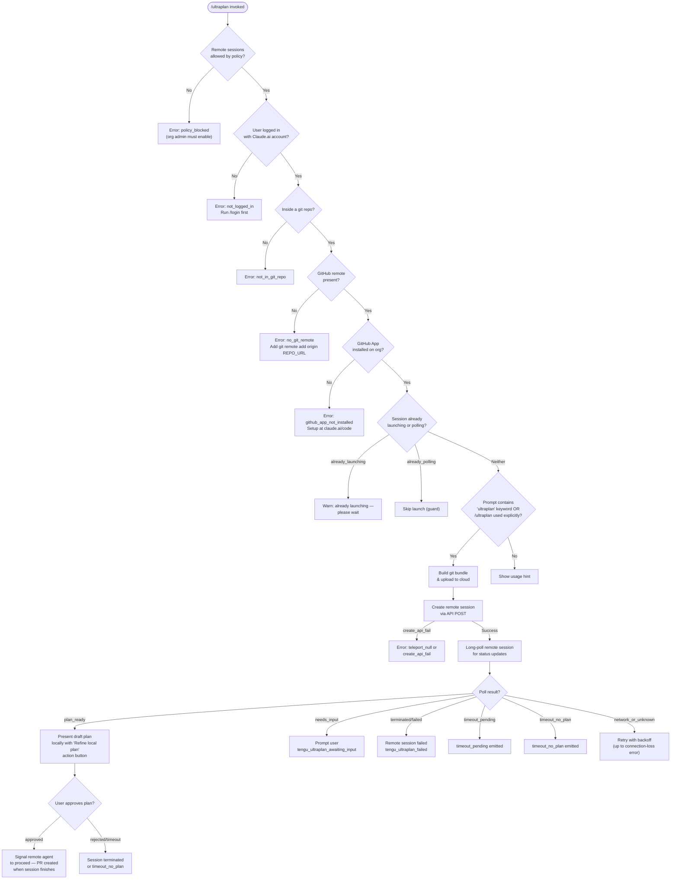

# `/ultraplan`

> Analysis basis: CC v2.1.144 bundle.js (AST extraction + Claude interpretation)
> Minimum version: v2.1.144

---

## Overview

`/ultraplan` is a remote-planning slash command that dispatches the user's prompt to a Claude Code web session, where a remote agent drafts a structured plan that the user can review, edit, and approve before execution proceeds. The command manages the full lifecycle of this remote session: precondition checking, git bundle upload, session creation via the Anthropic cloud API, long-poll-based status tracking, plan presentation to the local user, and final approval or failure handling. Results, when accepted, land as a pull request created by the remote agent.

---

## Registration

| Field | Value |
|---|---|
| type | `local-jsx` |
| name | `ultraplan` |
| description | `… · Claude Code on the web drafts a plan you can edit and approve. See …` |
| argumentHint | `<prompt>` |
| load_inline | `true` |
| load_ident | `BI7` |
| loc_byte | `11276683` |
| loc_byte_end | `11276927` |
| loc_line | `6773` |
| arbor_handler.name | `BI7` |
| arbor_handler.fqn | `claude-2.1.144::BI7` |
| arbor_handler.kind | `AsyncFunction` |
| arbor_handler.resolution_path | `load_ident` |
| arbor_handler.n_hits | `1` |

Analysis basis: CC v2.1.144 bundle.js:+11276683

The handler is inlined via a `load: () => Promise.resolve({ call: BI7 })` shape; Arbor resolved it via the `load_ident` path (n_hits = 1). The call graph therefore starts at `BI7`, treated as the command's main handler throughout this spec.

---

## Input Branching

The command has several distinct input and state-transition branches evaluated at invocation time, warranting a Mermaid flowchart.



Analysis basis: CC v2.1.144 bundle.js:+11274836, +11272098, +11268302, +11258619, +11258634

---

## Behavioral Spec

### 1. Handler Entry — `mainHandler` (BI7)

```
async function mainHandler(context):
    check setting "allow_remote_sessions" — if false, abort
    retrieve appState via getAppState()
    if state is "already_polling":
        log "already polling" guard, return
    if state is "already_launching":
        display warning "ultraplan: already launching. Please wait..."
        return
    call preconditionCheck(context)      // → preconditionResult
    if preconditionResult is not OK:
        display preconditionResult.errorMessage
        emit telemetry for failure kind
        return
    call launchRemoteSession(context)    // → sessionHandle or error
    if sessionHandle is null (teleport_null):
        log create_api_fail, display error
        return
    setAppState with session reference
    call pollAndReact(sessionHandle, context)
    on completion: setAppState to cleared
```

Analysis basis: CC v2.1.144 bundle.js:+11274836, +11274854, +11274889, +11274964, +11275160, +11275191, +11275277, +11275315, +11275349, +11275378

---

### 2. Prompt / Keyword Detection — `promptExtractor` (WX8 → PX8 → GXq)

```
function extractUltraplanPrompt(rawInput):
    // Check if "ultraplan" appears anywhere in rawInput (case-insensitive, global regex "gi")
    matches = rawInput.matchAll(/ultraplan/gi)
    if no matches:
        return { valid: false }
    // Slice out the prompt portion after the keyword
    sliced = rawInput.slice(...)
    // Normalise whitespace: replace pattern "$1$2", trim to max 5 trailing segments
    normalised = sliced.replace("$1$2", ...).trim()
    return { valid: true, prompt: normalised }
```

The regex flag `"gi"` is a literal found at bundle.js:+11260446. The replacement template `"$1$2"` is at bundle.js:+11261042. The trim constant `5` is at bundle.js:+11261065.

If the keyword is absent and the command was not invoked as `/ultraplan` explicitly, the usage hint is shown:
> `Usage: /ultraplan \<prompt\>, or include "ultraplan" anywhere in your prompt`

Analysis basis: CC v2.1.144 bundle.js:+11274836, +11260917, +11260945, +11261016, +11260048, +11260446, +11260265

---

### 3. Precondition Check — `checkRemoteEligibility` (ld9)

```
async function checkRemoteEligibility(context):
    results = await Promise.all([
        checkAuth(),          // must be Claude.ai login, not API key
        checkGitRepo(),       // must be inside a git repository
        checkGitRemote(),     // must have remote.origin.url (git config --get)
        checkGithubApp(),     // GitHub App must be installed on org
        checkOrgPolicy(),     // allow_remote_sessions org setting
        checkByoc()           // BYOC flag from "byoc" literal
    ])
    for each result:
        if not OK: return first failure with error code and message
    emit "bg_remote_eligibility_check" telemetry
    return OK
```

Known precondition error codes and their user-visible messages (Analysis basis: CC v2.1.144 bundle.js:+8743490, +8743591, +8743729, +8743846, +8744000):

| Code | Message |
|---|---|
| `not_logged_in` | "Please run /login and sign in with your Claude.ai account (not Console)." |
| `not_in_git_repo` | *(git detection failure)* |
| `no_git_remote` | "Background tasks require a GitHub remote. Add one with \`git remote add origin REPO_URL\`." |
| `github_app_not_installed` | *(directs to claude.ai/code setup)* |
| `policy_blocked` | "Remote sessions are disabled by your organization's policy. Contact your organization admin to enable them." |

Additionally, a Claude.ai-account-specific auth message exists at bundle.js:+8672598.

Analysis basis: CC v2.1.144 bundle.js:+8676631, +8676766, +8676701

---

### 4. Git Bundle Upload — `uploadGitBundle` (tv_)

```
async function uploadGitBundle(repoPath):
    emit telemetry "teleport_git_bundle_upload"
    if not in git repo:
        raise "Not in a git repository"  // "empty_repo" code
    // Attempt to locate HEAD commit; if repo has no commits:
    //   raise "Repository has no commits yet"
    // Create seed refs:
    //   refs/seed/stash  and  refs/seed/root  via "update-ref"
    // Run "git stash create" to capture working-tree changes
    // Run "git for-each-ref --count=1 refs/" to verify refs exist
    // Determine bundle strategy (head / fallback_head / squashed / fallback_squashed)
    // Write bundle to temp file "_source_seed.bundle"
    // Upload bundle; on failure emit "upload_failed"
    // On success emit "success"; clean up temp file via CiH.unlink
    emit telemetry "tengu_ccr_bundle_upload"
```

Bundle mode decision outcomes: `head`, `fallback_head`, `squashed`, `fallback_squashed` (bundle.js:+8720049, +8720088, +8720123, +8720166).
Mode is reported via `tengu_teleport_bundle_mode` telemetry (bundle.js:+8733749).

Analysis basis: CC v2.1.144 bundle.js:+8718220, +8718249, +8718278, +8718310, +8718350, +8718401, +8720324

---

### 5. Remote Session Creation — `teleportToRemote` (lKH)

```
async function createRemoteSession(bundleRef, prompt, context):
    // Policy check: org must permit remote sessions
    if policy blocked: raise "Remote sessions are disabled..."
    // Auth token check
    token = getAccessToken()
    if not token: raise "No access token found for remote session creation"
    // Org UUID fetch (with 15 000 ms timeout — bundle.js:+8673029)
    orgUuid = await fetchOrgUuid()
    if not orgUuid: raise "Unable to get organization UUID for remote session creation"
    // Determine environment (cloud env list via si / IiH helpers)
    //   API header: "anthropic-beta: ccr-byoc-2025-07-29" (bundle.js:+8733339)
    //   API header: "x-organization-uuid" (bundle.js:+8733361)
    envId = selectEnvironment()    // prefers existing env; auto-creates "Default" cloud env if none
    if no env available: raise "No environments available for session creation"
    // Generate session title via generateTitle() — max 75 chars (bundle.js:+8721389)
    //   title template: "claude/task" with "{description}" placeholder
    title = await generateTitle(prompt)
    // POST session creation
    //   Expected success: HTTP 201 (bundle.js:+8734673)
    //   Errors guarded: 401, 403, 429, 500 (bundle.js:+8734732, +8734736, +8734740, +8734637)
    response = await s8.post(sessionEndpoint, payload)
    if response has no session_id:
        raise "Server returned a malformed session response (no session id)"
    emit "tengu_ccr_session_link" telemetry
    return sessionHandle
```

A UUID is generated for each session via `HN_.randomUUID` (bundle.js:+8732173).
A control request of type `set_permission_mode` is sent during setup (bundle.js:+8732209).
The environment selection checks `bridge` type (bundle.js:+8736360) and falls back to auto-creating a `"Default"` environment at the `anthropic_cloud` provider (bundle.js:+8673609, +8673639).

Analysis basis: CC v2.1.144 bundle.js:+8732521, +8732530, +8732582, +8732660, +8732690, +8733278, +8734581, +8735193, +8735228

---

### 6. Long-Poll Loop — `pollSessionStatus` (jXq)

```
async function pollSessionStatus(sessionId, abortSignal):
    startTime = Date.now()
    maxTimeout = 5400 seconds (bundle.js:+11267772)  // 90 minutes
    pollInterval = 1000 ms (bundle.js:+8749770)
    maxPollDuration = 1 800 000 ms (bundle.js:+8749777)  // 30 minutes per segment

    loop:
        if abortSignal.aborted: raise "poll stopped by caller"
        elapsed = Date.now() - startTime
        response = await s8.get(pollEndpoint, { timeout: 10 000 ms })
        status = response.status  // one of: pending, running, idle, starting,
                                  //         requires_action, plan_ready, needs_input,
                                  //         approved, remote, teleport, terminated,
                                  //         completed, archived, hook_started,
                                  //         hook_progress, hook_response
        emit "tengu_ultraplan_timeout_seconds" with elapsed/1000

        switch status:
            case "plan_ready":
                emit "tengu_ultraplan_plan_ready"
                return { outcome: "plan_ready", planText: extractPlanText(response) }
            case "needs_input":
                emit "tengu_ultraplan_awaiting_input"
                return { outcome: "needs_input" }
            case "approved":
                emit "tengu_ultraplan_approved"
                return { outcome: "approved" }
            case "terminated" | "completed" | "archived":
                emit "tengu_ultraplan_failed"
                return { outcome: "failed" }
            case "requires_action":
                handle hook events
            default:
                // still running; check for timeout
                if elapsed > maxTimeout * 1000:
                    if planText is available: return "timeout_pending"
                    else:                     return "timeout_no_plan"
                sleep(pollInterval)
                continue

    on network error (network_or_unknown):
        retry up to connection-loss threshold
        if exhausted: display "Lost connection to the remote session after repeated retries..."
```

Timeout display uses `Math.round(elapsed / 60000)` with singular/plural `"minute"/"minutes"` (bundle.js:+11258764, +11258773).
Retry uses exponential jitter via `Math.random` (bundle.js:+12668351) and `setTimeout` (bundle.js:+12668388).

Analysis basis: CC v2.1.144 bundle.js:+11257429, +11257558, +11257568, +11257624, +11257793, +11257927, +11258084, +11258619, +11258634, +11258749, +11267772

---

### 7. Plan Presentation & Approval — `reactToSessionOutcome` (xI7 / UI7)

```
async function reactToSessionOutcome(pollResult, context):
    switch pollResult.outcome:
        case "plan_ready":
            // Display plan text prefixed with "Here is a draft plan to refine:"
            // (bundle.js:+11268079)
            // Present action: "Refine local plan" button (bundle.js:+11273259)
            // Tag: "plan" (bundle.js:+11273294)
            // Wait for user interaction
            if user approves:
                emit "tengu_ultraplan_approved"
                // Signal remote session: "Results will land as a pull request
                //  when the remote session finishes. There is nothing to do here."
                // (bundle.js:+11269344)
                postApprovalSignal(sessionId)
            else:
                terminate session

        case "needs_input":
            // Show prompt to user and forward response to remote agent
            emit "tengu_ultraplan_awaiting_input"

        case "failed" | "timeout_no_plan":
            // Display: "Remote Ultraplan session failed. Wait for the user's next instructions."
            // (bundle.js:+11270138)
            emit "tengu_ultraplan_failed"

        case "unexpected_error":
            // Display: "Ultraplan hit an unexpected error during launch. Wait for the user's next instructions."
            // (bundle.js:+11274373)
            emit via telemetry "unexpected_error"
            // Attempt to archive orphaned session (failure logged as
            //   "ultraplan: failed to archive orphaned session" — bundle.js:+11274521)
```

The plan text is extracted by searching for a marker within the remote session transcript; if the marker is missing the code reports `"extract_marker_missing"` (bundle.js:+11258187).
A `"task-notification"` hook is registered for remote progress events (bundle.js:+11273115).
The local agent is instructed with a `"system"` role message (bundle.js:+11274929) tagged `"slash"` (bundle.js:+11274982).

Analysis basis: CC v2.1.144 bundle.js:+11268079, +11268132, +11268162, +11268302, +11268382, +11268450, +11268858, +11269344, +11269731, +11270138, +11270249, +11273259, +11273294

---

### 8. Background Session Process Management — `backgroundSessionManager` (w / ka_)

```
// Daemon-side: manages the local background process that backs the remote session
function manageBackgroundSession(sessionHandle):
    on low memory (nE8.freemem < threshold):
        emit "tengu_bg_dispatch_low_mem"
        escalate to SIGKILL if needed ("tengu_bg_dispatch_sigkill_escalate")
    maintain spare session pool:
        emit "tengu_bg_spare_enable" / "tengu_bg_spare_claim" / "tengu_bg_spare_spawn"
    session lifecycle states: done, killed, stopped, crashed, blocked, working,
                              resuming, transient, spare, exec, daemon
    on idle timeout: emit "tengu_daemon_idle_exit"
    IPC via Unix socket (dE8.connect / SIGTERM / SIGKILL)
    max retry threshold: 100 (bundle.js:+14542206)
    idle GC interval: 300 000 ms (bundle.js:+14548316)
    spare session timeout: 30 s check / 15 s grace (bundle.js:+14542089, +14542100)
```

Analysis basis: CC v2.1.144 bundle.js:+14542134, +14542444, +14542471, +14542793, +14543352, +14543406, +14543435

---

## State & Side Effects

| Item | Detail |
|---|---|
| **Telemetry** | `tengu_ultraplan_create_failed` (bundle.js:+11272135) |
| | `tengu_ultraplan_prompt_identifier` (bundle.js:+11267905) |
| | `tengu_ultraplan_launched` (bundle.js:+11273806) |
| | `tengu_ultraplan_timeout_seconds` (bundle.js:+11267738) |
| | `tengu_ultraplan_awaiting_input` (bundle.js:+11268382) |
| | `tengu_ultraplan_plan_ready` (bundle.js:+11268450) |
| | `tengu_ultraplan_approved` (bundle.js:+11268858) |
| | `tengu_ultraplan_failed` (bundle.js:+11269731) |
| | `tengu_ccr_bundle_seed_enabled` (bundle.js:+8677096) |
| | `tengu_ccr_bundle_upload` (bundle.js:+8718542) |
| | `tengu_teleport_bundle_mode` (bundle.js:+8733749) |
| | `tengu_ccr_session_link` (bundle.js:+8728147) |
| | `tengu_teleport_source_decision` (bundle.js:+8738750) |
| | `tengu_teleport_generate_title` (bundle.js:+8721693) |
| | `tengu_bg_remote_eligibility_check` — eligibility check outcome |
| | `tengu_bg_dispatch_sigkill_escalate` (bundle.js:+14542134) |
| | `tengu_bg_dispatch_low_mem` (bundle.js:+14542713) |
| | `tengu_bg_spare_enable/claim/spawn/claim_fail` |
| | `tengu_daemon_idle_exit` (bundle.js:+14561318) |
| | `tengu_bg_sendclaim_failed` (bundle.js:+14523319) |
| | `tengu_config_parse_error` (bundle.js:+3167468) |
| | `tengu_slate_kestrel` (bundle.js:+4639760) |
| | `tengu_feature_ok` / `tengu_feature_bad` (bundle.js:+955520, +955578) |
| **Hook registration** | Registers `"task-notification"` hook for remote-progress events (bundle.js:+11273115); registers font/display hooks via `OHA.register` (bundle.js:+57049) |
| **appState changes** | `getAppState` read at entry; `setAppState` written with session reference on launch, then cleared on completion (bundle.js:+11275160, +11275378) |
| **File I/O** | Writes `_source_seed.bundle` temp file; deletes via `CiH.unlink` (bundle.js:+8720324); may create/read files under `.claude/backups` (bundle.js:+3166399); config files read via `Hn1.readFileSync` with `"utf-8"` encoding |
| **Network** | HTTP POST to session endpoint (HTTP 201 expected); GET poll (10 000 ms timeout — bundle.js:+8740551); POST to approval endpoint (HTTP 409 for conflict — bundle.js:+8740752); `"anthropic-beta: ccr-byoc-2025-07-29"` header; `"anthropic-version: 2023-06-01"` header |
| **Git operations** | `git config --get remote.origin.url`; `git stash create`; `git for-each-ref`; `git update-ref`; `git rev-parse --verify HEAD`; `git symbolic-ref --short refs/remotes/origin/HEAD`; `git show-ref --quiet` |
| **Sound** | None identified in depth-2 traversal |

---

## Version History

| Version | Change |
|---|---|
| v2.1.144 | Initial analysis — `load_ident` handler `BI7` registered as `local-jsx`; full remote-plan lifecycle including git bundle upload, cloud session creation, long-poll, plan approval, and PR-based result delivery |

---

## Common Mistakes

1. **Using an API key instead of a Claude.ai account** — The `not_logged_in` precondition specifically requires Claude.ai OAuth login (`/login`). API key authentication is explicitly rejected with its own error message (bundle.js:+8672598).

2. **No GitHub remote configured** — The command requires `git remote add origin <REPO_URL>` before invocation. Local-only git repos produce `no_git_remote` and block launch (bundle.js:+8743729).

3. **GitHub App not installed on the organisation** — Even with a remote, the GitHub App must be authorised. The error code `github_app_not_installed` (bundle.js:+8743846) is surfaced with a link to `claude.ai/code`.

4. **Running `/ultraplan` twice before the first session starts** — The `already_launching` guard (bundle.js:+11272368) will display a warning and refuse to launch a second session. Wait for the first session's plan to appear.

5. **Repository with no commits** — An empty repo (no `HEAD`) triggers `empty_repo` / `"Repository has no commits yet"` (bundle.js:+8718310). Run `git add . && git commit -m "initial"` first.

6. **Organisation policy blocking remote sessions** — The `policy_blocked` error (bundle.js:+8744000) can only be resolved by an organisation administrator enabling remote sessions.

7. **Omitting the prompt** — Invoking `/ultraplan` with no argument and without the word "ultraplan" in context triggers the usage hint rather than launching a session (bundle.js:+11272414).

---

## Appendix — Identifier Mapping

> For bundle debugging only. Identifiers change across versions.

| Identifier | Role |
|---|---|
| `BI7` | Main handler (`AsyncFunction`) — ultraplan command entry point |
| `WX8` | Prompt extraction wrapper — calls `PX8` and normalises result |
| `PX8` | Inner prompt parser — delegates to `GXq` |
| `GXq` | Regex-based "ultraplan" keyword scanner with match collection |
| `pq` | Feature/setting eligibility checker (checks `allow_product_feedback`, org settings) |
| `Kn1` | Setting lookup helper |
| `N$_` | Nested setting resolver |
| `Tm` | Tier/plan resolver (firstParty, enterprise, team) |
| `An1` | Config file reader (`readFileSync` UTF-8) |
| `Aq` | API traffic-mode helper (essential-traffic / no-telemetry) |
| `D3A` | Traffic classification decision |
| `xH` | String coercion utility |
| `k0H` | Secondary string utility |
| `sDH` | App-state accessor/dispatcher |
| `_G6` | Launch-guard and precondition orchestrator |
| `kXq` | Launch-state flag setter (already_polling / already_launching) |
| `EX8` | Precondition entry dispatcher |
| `TX8` | Precondition runner — calls `P6` and `hI7` |
| `P6` | Feature-flag evaluator |
| `hI7` | Secondary precondition evaluator |
| `UI7` | Remote session lifecycle controller |
| `MvH` | Eligibility check coordinator |
| `ld9` | `checkRemoteEligibility` — full precondition promise chain |
| `bI7` | Plan text builder — joins chunks with "Here is a draft plan to refine:" prefix |
| `CI7` | Plan chunk formatter |
| `lKH` | `teleportToRemote` — full remote session creation function |
| `C6` | API client factory |
| `JM` | Error classification helper |
| `qN_` | Org-UUID fetch helper |
| `kH` | Token/credential fetch utility with error logging |
| `EN` | Error wrapper / normaliser |
| `f1` | Environment (local/staging/prod) resolver |
| `Ez` | Axios request builder with auth headers |
| `tv_` | `uploadGitBundle` — git bundle creation and upload |
| `I6` | UUID/ID generator shim |
| `v` | Log-level / severity formatter |
| `Uy` | Git remote URL resolver (`git config --get remote.origin.url`) |
| `hc9` | Control-request builder (event/control_request/set_permission_mode) |
| `CH` | JSON serialiser wrapper |
| `Sc9` | Session-link telemetry emitter |
| `si` | `listEnvironments` — fetches available cloud environments |
| `IiH` | `createDefaultEnvironment` — auto-creates "Default" cloud env |
| `GH` | String coercion / display helper |
| `He4` | Title generator — calls Anthropic API for short task title (≤75 chars) |
| `qC` | Feature-flag read with boolean coercion |
| `eIH` | `checkGithubAppInstalled` — GitHub App installation check |
| `CV` | Default-branch resolver (`git symbolic-ref`, `show-ref`) |
| `v9` | Misc async utility (Ua/zq/Mj chain) |
| `b_` | Error string extractor |
| `Ac` | Cancellation check helper |
| `BY` | Abort/cancel signal wrapper |
| `$D` | Base-URL resolver (localhost/staging/prod) |
| `t_` | Module initialisation / export binder |
| `z3_` | Secondary URL config resolver |
| `mI7` | Session-state flag (Boolean) |
| `biH` | Remote-agent session poller setup |
| `Jh` | Random-bytes token generator |
| `F38` | Browser/external URL opener |
| `NW` | Session timestamp recorder |
| `Oe4` | Session status display formatter |
| `xc9` | Full session poll loop with hook-event handling |
| `xk` | Task-store manager (task_started / task_updated events) |
| `J_7` | Task creation handler |
| `D_7` | Task update handler |
| `j_7` | Task retention handler |
| `X_7` | Task key iterator |
| `f6H` | Task field accessor (user_typed / active / aborted) |
| `xI7` | `reactToSessionOutcome` — interprets poll result and drives UI |
| `jXq` | `pollSessionStatus` — long-poll loop with timeout logic |
| `yI7` | Timeout-seconds telemetry emitter |
| `pI7` | Awaiting-input handler |
| `TX6` | File cleanup utility (unlink / rm) |
| `K` | Column formatter (padEnd) |
| `UQ` | Approval POST sender |
| `h1` | Hook registration helper (`OHA.register`) |
| `uI7` | Orphaned-session archiver |
| `y6` | Config/state file manager |
| `m6` | Base config directory resolver |
| `t1_` | Config write helper |
| `V$H` | Config read-write with backup (`copyFileSync`, `readdirStringSync`) |
| `b6` | JSON parse wrapper |
| `TR` | Config key prefix stripper |
| `A8` | Config merge helper |
| `GV1` | Backup directory enumerator |
| `L9_` | Backup path builder |
| `$` | Utility set / NVq wrapper |
| `w` | Background session process supervisor |
| `C` | Child-process write/kill manager |
| `bH` | Bad-feature telemetry recorder |
| `RH` | Good-feature telemetry recorder |
| `fT6` | macOS memory threshold checker |
| `x` | Idle-timeout / unref manager |
| `Ea_` | IPC socket connect/write/end helper |
| `ka_` | Background session lifecycle handler (done/killed/stopped/crashed states) |
| `D` | Spare-session garbage collector |
| `h` | Idle timer reference holder |
| `fCL` | File-watch setup (watchFile / unwatchFile) |
| `Rl` | File-change listener |
| `caH` | Parallel eligibility aggregator (`Promise.all`) |

---

Note: index built via Arbor fallback; some signals (telemetry, literals) may be missing — see arbor-fallback.js.