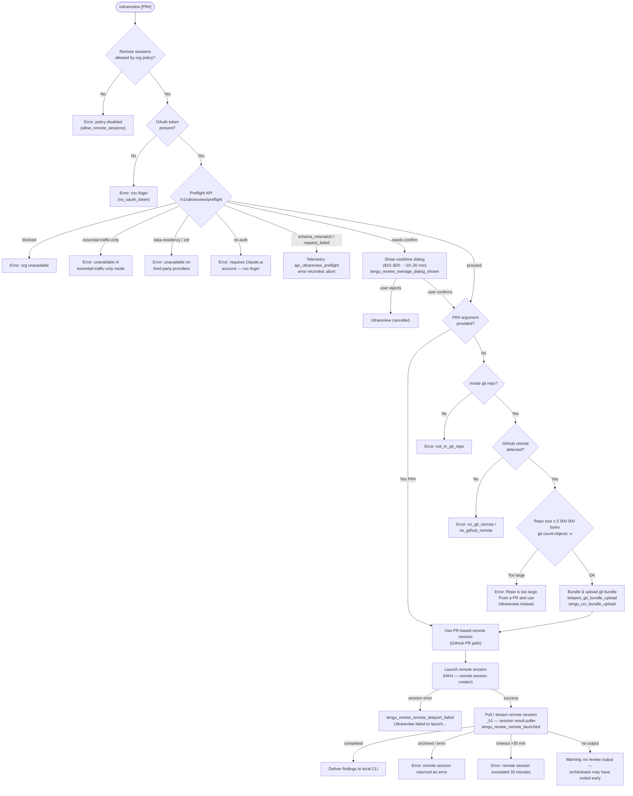

# `/ultrareview`

> Analysis basis: CC v2.1.143 bundle.js (AST extraction + Claude interpretation)
> Minimum version: v2.1.143

---

## Overview

`/ultrareview` is a cloud-hosted bug-finding command that launches a remote Claude Code session on the web to find and verify bugs in the current Git branch (or a specified PR number). It performs preflight eligibility checks, optionally packages and uploads a Git bundle of the local repository, and streams the results back to the local CLI. The command runs asynchronously on Anthropic's infrastructure and is estimated to cost between $10–$20 USD per invocation with an expected runtime of approximately 10–20 minutes.

---

## Registration

| Field | Value |
|---|---|
| type | `local-jsx` |
| name | `ultrareview` |
| description | ` ... · Est. cost ... USD · Finds and verifies bugs in your branch. Runs in Claude Code on the web. See ...` |
| loc_byte | `11265162` |
| loc_byte_end | `11265421` |
| loc_line | `6784` |
| module_id | `Tjq` |
| load_inline | `true` |
| arbor_handler.name | `CV7` |
| arbor_handler.fqn | `claude-2.1.143::CV7` |
| arbor_handler.kind | `AsyncFunction` |
| arbor_handler.resolution_path | `module_id` |
| arbor_handler.n_hits | `1` |

Analysis basis: CC v2.1.143 bundle.js:+11265162–+11265421

The handler `CV7` was resolved by Arbor via the `module_id` path (`Tjq` → module exports → `CV7`). The registration uses a `load_inline` shape. All pseudocode below uses `CV7` as the main handler entry point.

---

## Input Branching

The command has well over three distinct execution branches (policy checks, preflight API responses, repo-size gate, PR-number vs. bundle path, remote session lifecycle states). A Mermaid flowchart is used.



Analysis basis: CC v2.1.143 bundle.js:+11262949, +11262952, +11262986, +11223685, +11226079, +11227541, +11230406, +11230890

---

## Behavioral Spec

### 1. Policy Gate — `allow_remote_sessions`

Before any network activity, the handler reads the `allow_remote_sessions` configuration flag.

```
function policyGate(appState):
    if appState.config["allow_remote_sessions"] is falsy:
        emitError("Remote sessions are disabled by your organization's policy."
                  " Contact your organization admin to enable them.")
        return ABORT
    // random jitter delay (Math.random * 2, setTimeout)
    continue
```

Analysis basis: CC v2.1.143 bundle.js:+11262952 (flag name), +11262986 (error string), +12638154–+12638193 (jitter)

---

### 2. Preflight API Check — `aJq`

After the policy gate passes, `aJq` calls `GET /v1/ultrareview/preflight` with a 5 000 ms timeout and the `teleport-org` header. The server response is a status discriminant that drives the branch table below.

```
async function preflightCheck(oauthToken, orgUUID):
    response = await httpGet("/v1/ultrareview/preflight",
                             headers={"teleport-org": orgUUID},
                             timeout=5000)
    switch response.status:
        case "blocked":
            return {outcome: "BLOCKED"}
        case "essential-traffic-only":
            return {outcome: "ESSENTIAL_TRAFFIC_ONLY",
                    message: "Ultrareview runs in Claude Code on the web and is "
                             "unavailable when essential-traffic-only mode is active."}
        case "data-residency" | "zdr":
            return {outcome: "DATA_RESIDENCY",
                    message: "Ultrareview runs in Claude Code on the web and is "
                             "unavailable on third-party providers."}
        case "no-auth":
            return {outcome: "NO_AUTH",
                    message: "Ultrareview requires a Claude.ai account. Run /login..."}
        case "proceed":
            return {outcome: "PROCEED"}
        case "needs-confirm":
            return {outcome: "NEEDS_CONFIRM"}
        default:
            recordTelemetry("api_ultrareview_preflight", {error: "schema_mismatch"
                            | "request_failed"})
            return {outcome: "ERROR"}
```

Analysis basis: CC v2.1.143 bundle.js:+11223685 (endpoint), +11223719 (`teleport-org`), +11223742 (5 000 ms), +11223461 (`blocked`), +11223779 (`essential-traffic-only`), +11223934 (`data-residency`), +11223923 (`zdr`), +11224074 (`no-auth`), +11227541 (`proceed`), +11227921 (`needs-confirm`), +11224306 (`api_ultrareview_preflight`), +11224334 (`schema_mismatch`), +11224495 (`request_failed`)

---

### 3. Cost Confirmation Dialog — `lp_` / `mNH`

When preflight returns `needs-confirm`, a dialog is presented to the user with the estimated cost and duration before proceeding.

```
function showConfirmationDialog():
    display costEstimate = "$10-$20"
    display durationEstimate = "~10–20 min"
    emit telemetry("tengu_review_overage_dialog_shown")
    result = await promptUser(["confirm", "cancel"])
    if result == "confirm":
        continue
    else:
        emit "Ultrareview cancelled."
        return ABORT
```

Analysis basis: CC v2.1.143 bundle.js:+11223149 (`$10-$20`), +11223241 (`~10–20 min`), +11263586 (`tengu_review_overage_dialog_shown`), +11227854 (`confirm`), +11263891 (`Ultrareview cancelled.`)

If the org's usage cap is exceeded and the dialog is suppressed by policy, `tengu_review_overage_blocked` is emitted instead.

Analysis basis: CC v2.1.143 bundle.js:+11263251 (`tengu_review_overage_blocked`)

---

### 4. Git Context Resolution — `cp_`

`cp_` collects git state needed to choose the code-delivery path.

```
async function resolveGitContext(args):
    // Detect git repo
    isInsideWorkTree = run("git rev-parse --is-inside-work-tree")
    if failed: return {error: "not_in_git_repo"}

    // Resolve remote URL
    remoteUrl = run("git config --get remote.origin.url")
    if missing: return {error: "no_git_remote"}

    // Sanitize credentials from URL  (://***@ replacement)
    safeUrl = redactCredentials(remoteUrl)

    // Resolve current branch
    currentBranch = run("git branch --abbrev-ref HEAD").trim()

    // Resolve default branch (symbolic-ref refs/remotes/origin/HEAD --short)
    // Falls back to "main" then "master" via show-ref
    defaultBranch = resolveDefaultBranch()

    // Compute merge-base diff stat
    mergeBase = run("git merge-base <defaultBranch> HEAD")
    diffStat = run("git diff --shortstat <mergeBase>")

    // Parse PR number if provided as argument
    if args includes PR#:
        return {mode: "pr", prNumber: PR#, remoteUrl, currentBranch}
    else:
        return {mode: "bundle", remoteUrl, currentBranch, diffStat}
```

Analysis basis: CC v2.1.143 bundle.js:+6615049 (`rev-parse`), +6615061 (`--is-inside-work-tree`), +1050868 (`remote.origin.url`), +1053843 (`://***@`), +1059429 (`--abbrev-ref`), +1059444 (`HEAD`), +1059601 (`symbolic-ref`), +1059626 (`refs/remotes/origin/HEAD`), +1059739 (`main`), +1059746 (`master`), +11226610 (`merge-base`), +11227125 (`diff`), +11227132 (`--shortstat`), +11225950 (`pr`)

---

### 5. Repository Size Check — `oS1` / `rS1`

If not using a PR number, the bundle path checks repo size before bundling.

```
async function checkRepoSize():
    output = run("git count-objects -v")
    sizeKiB = parseField(output, "size-pack") * 1024
    maxBytes = 5_000_000
    emit telemetry("tengu_ccr_bundle_max_bytes", {maxBytes})
    if sizeKiB > maxBytes:
        emitError("Repo is too large to bundle. Push a PR and use"
                  " `/ultrareview <PR#>` instead.")
        return TOO_LARGE
    return OK
```

Analysis basis: CC v2.1.143 bundle.js:+7992719 (`count-objects`), +7992735 (`-v`), +7992934 (1024 multiplier), +7993160 (5 000 000 byte cap), +11226079 (error string)

---

### 6. Git Bundle Creation and Upload — `lT_`

```
async function createAndUploadBundle(sessionParams):
    emit telemetry("teleport_git_bundle_upload")

    // Verify repo is not empty
    commitCount = run("git for-each-ref --count=1 refs/")
    if commitCount == 0: return {error: "empty_repo", msg: "Repository has no commits yet"}

    // Stash uncommitted changes temporarily
    stashRef = run("git stash create")  // refs/seed/stash

    // Bundle strategies attempted in order:
    //   1. "head"           — full HEAD bundle
    //   2. "fallback_head"  — fallback HEAD approach
    //   3. "squashed"       — squashed bundle
    //   4. "fallback_squashed"

    bundleFile = writeTempFile("ccr-seed.bundle")
    run("git bundle create <bundleFile> ...")

    // Upload bundle via signed URL
    uploadResult = await uploadToSignedUrl(bundleFile)
    emit telemetry("tengu_ccr_bundle_upload", {strategy, result})

    // Clean up temp files (BlH.unlink)
    deleteTempFile(bundleFile)
    deleteTempFile("_source_seed.bundle")

    if uploadResult == "success":
        return {bundleRef: uploadResult.ref}
    else:
        return {error: "upload_failed"}
```

Analysis basis: CC v2.1.143 bundle.js:+7995718 (`teleport_git_bundle_upload`), +7995779 (`Not in a git repository`), +7995819 (`refs/seed/stash`), +7995837 (`refs/seed/root`), +7995921 (`for-each-ref`), +7995936 (`--count=1`), +7996125 (`Repository has no commits yet`), +7996203 (`stash`), +7996857 (`ccr-seed`), +7996868 (`.bundle`), +7997160 (`_source_seed.bundle`), +7997454 (`success`), +7997305 (`upload_failed`), +7997518–+7997635 (strategy names)

---

### 7. GitHub App Preflight — `LZH`

Before creating a remote session via the GitHub path, `LZH` verifies the GitHub App is installed.

```
async function checkGithubAppInstalled(accessToken, orgUUID):
    if not accessToken:
        log("checkGithubAppInstalled: No access token found, assuming app not installed")
        return false
    if not orgUUID:
        log("checkGithubAppInstalled: No org UUID found, assuming app not installed")
        return false
    response = await httpGet(githubPreflightEndpoint,
                             timeout=15000,
                             headers={"is" | "is not"})
    if response.status == 400: return false
    return response.installed
```

Analysis basis: CC v2.1.143 bundle.js:+6615196 (log string), +6615309 (log string), +6613617 (15 000 ms timeout), +6615967 (400 status), +6615707 (`is`), +6615712 (`is not`)

---

### 8. Remote Session Creation — `HKH`

`HKH` is the central remote-session creator. It resolves the target cloud environment, determines the bundle delivery mode, and POSTs to the session-creation endpoint.

```
async function createRemoteSession(params):
    // Policy re-check
    if policy == "policy_blocked":
        throw Error("Remote sessions are disabled by your organization's policy.")

    // Token validation
    accessToken = getAccessToken()
    if not accessToken:
        throw Error("No access token found for remote session creation")

    // Org UUID resolution
    orgUUID = getOrgUUID()
    if not orgUUID:
        throw Error("Unable to get organization UUID for remote session creation")

    // Determine bundle mode
    bundleMode = chooseBundleMode(params)
    // modes: "too_large" | "bundle" | "explicit_env_bundle" | "git_repository"
    //        | "explicit_source_url" | "no_git_at_all"
    emit telemetry("tengu_teleport_bundle_mode", {mode: bundleMode})

    // Select or auto-create cloud environment
    envList = await listEnvironments()  // teleport_environments_list
    if envList empty:
        autoEnv = await createDefaultEnvironment()  // teleport_default_environment_create
        if autoEnv fails:
            warn("Could not create a cloud environment. Set one up at "
                 "https://claude.ai/code/onboarding?magic=env-setup")
            return {error: "env_create"}

    // POST session creation
    response = await httpPost(sessionEndpoint,
                              headers={
                                  "anthropic-beta": "ccr-byoc-2025-07-29",
                                  "x-organization-uuid": orgUUID,
                                  "Content-Type": "application/json",
                                  "anthropic-version": "2023-06-01"
                              },
                              body={task: params, bundleRef, envId})
    if response.status in [401, 403, 429]: handleAuthOrRateError()
    if response.status != 201: throw Error("Server returned a malformed session response")
    if not response.sessionId:
        throw Error("Server returned a malformed session response (no session id)")

    emit telemetry("tengu_ccr_session_link", {sessionId})
    return {sessionId: response.sessionId}
```

Analysis basis: CC v2.1.143 bundle.js:+8010051, +8010159, +8010469 (error strings), +8010791 (`anthropic-beta`), +8010808 (`ccr-byoc-2025-07-29`), +8010830 (`x-organization-uuid`), +6609528 (`Content-Type`), +6609562 (`anthropic-version`), +6609582 (`2023-06-01`), +8011144–+8011370 (bundle mode strings), +8012145 (201), +8012206–+8012214 (401/403/429), +8012533 (no session id string), +8005616 (`tengu_ccr_session_link`), +8013878 (`No environments available`)

---

### 9. Session Polling and Result Delivery — `_h1`

After the session is created, `_h1` polls and streams the remote session lifecycle.

```
async function pollRemoteSession(sessionId):
    maxDuration = 1_800_000  // 30 minutes in ms
    startTime = Date.now()

    loop:
        if Date.now() - startTime > maxDuration:
            return {error: "remote session exceeded 30 minutes"}

        status = await fetchSessionStatus(sessionId)
        switch status:
            case "pending" | "starting" | "running":
                deliverProgressEvents()  // hook_progress, hook_response, hook_started
                sleep(pollingInterval)
                continue
            case "completed":
                result = extractLastAssistantMessage(sessionMessages)
                if result is empty:
                    return {error: "no review output — orchestrator may have exited early"}
                return {outcome: "success", result}
            case "archived" | "error":
                return {error: "remote session returned an error"}
            case "idle":
                // transient, keep polling
                continue
```

Analysis basis: CC v2.1.143 bundle.js:+8027257 (1 800 000 ms), +8027528 (`assistant`), +8027701 (`archived`), +8027776 (`completed`), +8028447 (`hook_progress`), +8028476 (`hook_response`), +8028967 (`hook_started`), +8029057 (`SessionStart`), +8029284 (`starting`), +8029835 (`remote session returned an error`), +8029876 (`remote session exceeded 30 minutes`), +8029913 (`no review output`)

---

### 10. Top-Level Handler Dispatch — `CV7`

```
async function CV7_ultrareviewHandler(cmdArgs, appState):
    // Step 1: Policy gate
    if not policyGate(appState): return

    // Step 2: Preflight
    preflightResult = await preflightCheck(oauthToken, orgUUID)
    if preflightResult.outcome != PROCEED and != NEEDS_CONFIRM:
        emit telemetry("tengu_review_remote_precondition_failed", {reason})
        renderError(preflightResult.message)
        return

    // Step 3: Confirmation dialog (if needed)
    if preflightResult.outcome == NEEDS_CONFIRM:
        confirmed = await showConfirmationDialog()
        if not confirmed: return

    // Step 4: Git context
    gitCtx = await resolveGitContext(cmdArgs)
    if gitCtx.error:
        emit telemetry("tengu_review_remote_precondition_failed", {gitCtx.error})
        return

    // Step 5: Size check (bundle path only)
    if gitCtx.mode == "bundle":
        sizeOk = await checkRepoSize()
        if not sizeOk: return

    // Step 6: Bundle & upload (bundle path only)
    if gitCtx.mode == "bundle":
        bundleResult = await createAndUploadBundle(gitCtx)
        if bundleResult.error: return

    // Step 7: Remote session
    try:
        session = await createRemoteSession({...gitCtx, bundleResult})
        emit telemetry("tengu_review_remote_launched")
        // Step 8: Poll
        result = await pollRemoteSession(session.sessionId)
        deliverResultToUser(result)
    catch e:
        emit telemetry("tengu_review_remote_teleport_failed", {error: e})
        renderError("Ultrareview failed to launch the remote session."
                    " Check that this is a GitHub repo and try again.")
```

Analysis basis: CC v2.1.143 bundle.js:+11262949, +11262984, +11263133, +11263213, +11263249, +11263394, +11263402, +11263698, +11263805, +11263869

---

## State & Side Effects

| Item | Detail |
|---|---|
| Telemetry: `tengu_review_remote_precondition_failed` | Emitted when any preflight or git-context check fails (bundle.js:+11224974) |
| Telemetry: `tengu_review_remote_launched` | Emitted after remote session is successfully created (bundle.js:+11230890) |
| Telemetry: `tengu_review_remote_teleport_failed` | Emitted when the remote session launch throws (bundle.js:+11230406) |
| Telemetry: `tengu_review_overage_dialog_shown` | Emitted when cost confirmation dialog is presented (bundle.js:+11263586) |
| Telemetry: `tengu_review_overage_blocked` | Emitted when usage cap suppresses dialog (bundle.js:+11263251) |
| Telemetry: `tengu_review_bughunter_config` | Emitted during bughunter configuration resolution (bundle.js:+11223032) |
| Telemetry: `tengu_ccr_bundle_max_bytes` | Repo size check result (bundle.js:+7992634) |
| Telemetry: `tengu_ccr_bundle_upload` | Bundle upload result + strategy (bundle.js:+7996011) |
| Telemetry: `tengu_ccr_bundle_seed_enabled` | Seed bundle feature flag active (bundle.js:+6617684) |
| Telemetry: `tengu_teleport_bundle_mode` | Selected code-delivery mode (bundle.js:+8011218) |
| Telemetry: `tengu_ccr_session_link` | Remote session ID recorded (bundle.js:+8005616) |
| Telemetry: `tengu_teleport_source_decision` | Source decision for teleport (bundle.js:+8016230) |
| Telemetry: `tengu_slate_kestrel` | Feature eligibility signal (bundle.js:+10022817) |
| Telemetry: `tengu_feature_ok` / `tengu_feature_bad` / `tengu_feature_sad` | Feature gate outcomes (bundle.js:+955068, +955126, +955201) |
| Telemetry: `tengu_bg_spare_enable` / `tengu_bg_spare_spawn` | Spare background agent lifecycle (bundle.js:+14502634, +14502994) |
| Telemetry: `tengu_daemon_control` | Daemon control events (bundle.js:+14538273) |
| Telemetry: `tengu_daemon_config_reload` | Daemon config reload (bundle.js:+14517117) |
| Telemetry: `api_ultrareview_preflight` | Preflight API call outcome (bundle.js:+11224306) |
| Telemetry: `teleport_git_bundle_upload` | Git bundle upload (bundle.js:+7995718) |
| Telemetry: `teleport_environments_list` | Cloud env listing (bundle.js:+6613102) |
| Telemetry: `teleport_default_environment_create` | Auto-created default cloud env (bundle.js:+6613902) |
| Telemetry: `teleport_generate_title` | Title generation for remote task (bundle.js:+7999162) |
| Daemon interaction | Spawns / communicates with local daemon (`daemon.status.json` read); sends `daemon_stop` / `daemon_stop_failed` signals (bundle.js:+11707334, +14538198) |
| appState reads | `allow_remote_sessions` (policy), `allow_product_feedback`, feature flags `firstParty`/`enterprise`/`team` (bundle.js:+11262952, +10026179, +10022617, +10022903, +10022938) |
| File I/O | Creates temp `.bundle` files (`ccr-seed.bundle`, `_source_seed.bundle`); deletes after upload (bundle.js:+7996857, +7997160) |
| Network | `POST /v1/ultrareview/preflight` (preflight); session creation POST; bundle signed-URL upload; session status polling (bundle.js:+11223685) |
| Sound | <!-- TODO: not found in depth-2 traversal; needs --depth 4 --> |
| Admin settings URL | `/admin-settings/` (shown in org-blocked context) (bundle.js:+11263373) |

---

## Version History

| Version | Change |
|---|---|
| v2.1.143 | Initial analysis |

---

## Common Mistakes

1. **Running without a Claude.ai OAuth session.** The command requires an OAuth token (not an API key). Using only `ANTHROPIC_API_KEY` will result in a `no_oauth_token` / `no-auth` error. Run `/login` first.
2. **Running in a repository larger than 5 MB pack size.** When the repo's `git count-objects -v` pack size exceeds 5 000 000 bytes, the command refuses to bundle and advises opening a PR then supplying its number as an argument (`/ultrareview <PR#>`).
3. **Running in a repository with no GitHub remote.** The command requires `remote.origin.url` to point to `github.com`. Non-GitHub remotes (GitLab, Bitbucket, bare SSH URLs to other hosts) will fail the GitHub-remote check.
4. **Running in essential-traffic-only mode.** Organizations with strict network policies that restrict non-essential traffic will see a block; the command cannot be used in this mode regardless of auth status.
5. **Running in data-residency / zero-data-retention environments.** Because Ultrareview executes on Anthropic's web infrastructure, data-residency and ZDR-configured accounts are incompatible.
6. **Running in a repo with no commits.** If the repository has been initialized but has no commits yet (`git for-each-ref refs/` returns nothing), the bundle step fails with "Repository has no commits yet."
7. **Dismissing the cost confirmation dialog.** If `needs-confirm` is returned by preflight and the user declines the dialog, the session is silently cancelled. This is by design, not a bug.

---

## Appendix — Identifier Mapping

> For bundle debugging only. Identifiers change across versions.

| Identifier | Role |
|---|---|
| `CV7` | Main async handler for `/ultrareview` (Arbor-resolved, `module_id` path) |
| `uq` | Feature eligibility / gate check helper |
| `N1q` | Sub-step within eligibility check |
| `wC_` | Inner eligibility validation wrapper |
| `bp` | Feature flag evaluator (firstParty / enterprise / team) |
| `I1q` | File read helper within eligibility (readFileSync, utf-8) |
| `zq` | Traffic mode resolver (`essential-traffic`, `no-telemetry`) |
| `A$A` | Telemetry mode classifier |
| `xH` | String coercion / formatting utility |
| `K0H` | Secondary string helper (calls `xH`) |
| `H` | Random jitter delay (Math.random + setTimeout) |
| `cp_` | Git context collector (branch, remote URL, diff stat) |
| `A18` | Git repo detection (`rev-parse --is-inside-work-tree`) |
| `S6` | App state accessor |
| `Uh6` | Async store accessor (`ph6.getStore`) |
| `__` | General utility (calls `GV`) |
| `$_` | Session / token manager (spawns `KXH`) |
| `KXH` | Core session lifecycle manager |
| `D` | Background spare agent manager (freemem, Date.now, 2 000 ms loop) |
| `_SK` | String serialization helper |
| `NH` | Error / log push helper (`xRH.push`, `Wc.logError`) |
| `A` | Text trimming / lowercasing pipeline |
| `f` | Connection close / lifecycle handler |
| `d` | Low-level data/state primitive |
| `ky` | Remote URL resolver and cache (`HCH` map, git config) |
| `JB` | Cache lookup helper (calls `Xu8`) |
| `Xu8` | Map get helper (`V_H.get` with `remoteUrl` key) |
| `K` | String padding/mapping utility |
| `L` | Set add/delete with finally handler |
| `v` | URL normalization / sanitization pipeline |
| `G5K` | URL parser sub-step |
| `hH` | JSON serializer (`JSON.stringify`) |
| `_` | String upper/lowercase transformer |
| `P7` | Credential redaction (`[REDACTED]` insertion) |
| `cSH` | URL component extractor (`X6A`) |
| `Z5K` | Git file content reader (Buffer.byteLength, path ops) |
| `_CH` | Credential scrubber (`://***@` replacement) |
| `fXH` | URL scheme parser (https/http detection) |
| `kzA` | URL split/includes helper |
| `m1` | Substring extractor (indexOf + slice) |
| `oS1` | Repo size gate orchestrator |
| `rS1` | Byte count parser (`git count-objects -v`) |
| `iS1` | Size check inner helper |
| `G6` | Feature flag set manager (`sMH`, `x76`, `PF`) |
| `Y8` | Session state reader |
| `z` | Daemon stop controller (`daemon_stop` / `daemon_stop_failed`) |
| `SH` | Daemon stop signaller |
| `mH` | Daemon stop failure signaller |
| `xN` | Daemon control event emitter |
| `jF` | Daemon shutdown helper (`O9H.shutdown`) |
| `$0H` | Signal router (`sR`) |
| `cA_` | Event emitter with UUID generation (`QA_.randomUUID`) |
| `Ox` | Process exit orchestrator (Promise.race + Promise.all + process.exit) |
| `JF` | Shutdown finalizer |
| `EF` | Timer clearance helper (clearTimeout, `Z9_`) |
| `r8` | Abort/timeout wrapper (setTimeout, clearTimeout, Error) |
| `CV` | Default branch resolver (`symbolic-ref refs/remotes/origin/HEAD`) |
| `Wu8` | Map get helper (`V_H.get` with `defaultBranch` key) |
| `FJ` | Current branch resolver (`git branch --abbrev-ref HEAD`) |
| `ju8` | Map get helper (`V_H.get` with `branch` key) |
| `$` | General session/task object (findLast, dispose) |
| `JZq` | Daemon status file reader (`daemon.status.json`) |
| `ha` | File helper (`lfH`) |
| `d1` | Store accessor (`znL.getStore`) |
| `r06` | Path joiner for daemon status file |
| `lp_` | Preflight orchestrator (calls `aJq`, `mNH`) |
| `aJq` | Preflight API caller (`/v1/ultrareview/preflight`) |
| `R6` | JSON parser |
| `Qp_` | Preflight response status router |
| `J8` | Data helper (calls `d`) |
| `mNH` | Cost confirmation dialog presenter |
| `VaH` | Bughunter config reader |
| `af8` | Auth token / subscription checker |
| `lV` | Auth level helper |
| `QMH` | Subscription plan resolver |
| `L5` | Plan detail extractor |
| `Uw` | Auth initializer (ANTHROPIC_API_KEY, apiKeyHelper) |
| `N6` | Session state machine (Date.now, nhL) |
| `HA` | Subscription type classifier (stripe/apple/google) |
| `SR` | Array/string inclusion checker |
| `Pu` | Role checker (max/pro/admin/billing/owner/primary_owner) |
| `fq` | Role validation helper |
| `Cl8` | Role constant A |
| `Rl8` | Role constant B |
| `Zr` | Bughunter config accessor (calls `VaH`) |
| `RV7` | JSX render orchestrator for ultrareview UI |
| `np_` | Main render/display function for ultrareview output |
| `xVH` | Background eligibility check initiator (calls `dz1`) |
| `dz1` | Background eligibility runner (uq, A18, ky, policy checks) |
| `T` | Key event handler (preventDefault, remoteControlAtStartup) |
| `m` | Input event source |
| `c2` | User settings accessor (`userSettings`) |
| `Y` | Supervisor/config lifecycle (start/stop/updateConfig) |
| `xYH` | Display helper for ultrareview status |
| `rJq` | Config-based display segment |
| `HKH` | Remote session creator and manager (core teleport logic) |
| `YM` | Session parameter builder (`R8_`) |
| `aT_` | Session attribute helper |
| `jN` | Org UUID resolver |
| `K9` | OAuth URL validator (local/staging/prod) |
| `Dz` | HTTP header builder (`_9H`) |
| `lT_` | Git bundle upload executor |
| `V6` | Version resolver (`GV`) |
| `sS1` | UUID generator for session (`iT_.randomUUID`) |
| `aS1` | Session link recorder (calls `d`) |
| `Hi` | Environment list fetcher (`teleport_environments_list`) |
| `LdH` | Default environment creator (`teleport_default_environment_create`) |
| `XH` | String coercer |
| `Rg4` | Task prompt builder (`claude/task`, `json_schema`) |
| `tR` | Concurrent session state manager |
| `LZH` | GitHub App installation checker |
| `R1` | Result formatter (`Na`, `r1`, `rJ`) |
| `v_` | Error stringifier |
| `nd` | Cancellation detector |
| `NY` | Notification helper |
| `FlH` | Remote agent session poller initiator |
| `iS` | Session token generator (`Cyq.randomBytes`) |
| `Kf8` | Browser/remote session opener (`xr.open`) |
| `KW` | Session pending state handler |
| `Fg4` | Session state string builder |
| `_h1` | Session result poller and streaming handler |
| `mVH` | Result delivery to local CLI (`rY`) |
| `rY` | CLI output writer (`s_`, `L$_`) |
| `hV7` | JSX mapper for display fragments |
| `dp_` | Cancellation handler ("Ultrareview cancelled.") |