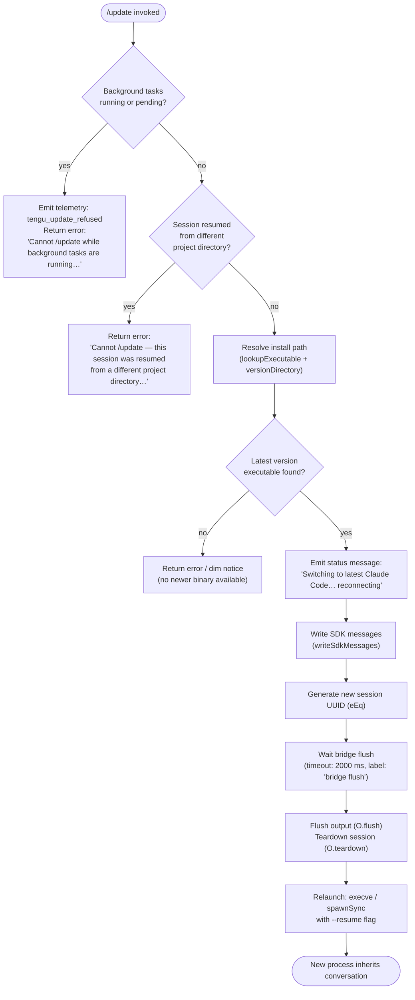

# `/update`

> Analysis basis: CC v2.1.144 bundle.js (AST extraction + Claude interpretation)
> Minimum version: v2.1.144

---

## Overview

The `/update` command performs an in-process hot-swap of Claude Code to the latest installed version while preserving the active conversation. It serialises current session state, flushes all pending I/O, relaunches the process via `execve`/`spawnSync`, and restores the conversation with `--resume`. The command is hidden from the normal command palette and only executes in interactive, foreground sessions.

---

## Registration

| Field | Value |
|---|---|
| type | `local` |
| name | `update` |
| description | `Switch to the latest version (conversation continues)` |
| loc_byte | `11676882` |
| loc_byte_end | `11677084` |
| loc_line | `7239` |
| supportsNonInteractive | `false` |
| isHidden | `true` |
| module_id | `_Zq` |
| load_inline | `true` |
| arbor_handler.name | `Ph7` |
| arbor_handler.fqn | `claude-2.1.144::Ph7` |
| arbor_handler.kind | `AsyncFunction` |
| arbor_handler.resolution_path | `module_id` |
| arbor_handler.n_hits | `0` |

Analysis basis: CC v2.1.144 bundle.js:+11676882

---

## Input Branching

The handler has four or more distinct guard branches before it reaches the relaunch path, so a Mermaid flowchart is used.



Analysis basis: CC v2.1.144 bundle.js:+11674763 – +11676305

---

## Behavioral Spec

### 1. Guard: Background-Task Check

```
async function checkBackgroundTasks(appState):
    runningOrPending = tasks where status in {"running", "pending"}
    if runningOrPending is not empty:
        emit telemetry("tengu_update_refused")
        return ErrorResult(
            "Cannot /update while background tasks are running — " +
            "wait for them to finish, then try again."
        )
```

The handler iterates `Object.values(appState)` collecting tasks whose status is `"running"` or `"pending"` (bundle.js:+11675038, +11675060). If any exist, the update is refused immediately and `tengu_update_refused` is fired (bundle.js:+11674777).

Analysis basis: CC v2.1.144 bundle.js:+11675000

---

### 2. Guard: Project-Directory Mismatch

```
async function checkProjectDirectory(appState):
    # Identifies messages whose role begins with "assistant-"
    # to detect whether the session was started in a different cwd
    if sessionOriginatesInDifferentDirectory(appState):
        return ErrorResult(
            "Cannot /update — this session was resumed from a different " +
            "project directory. Restart manually with --resume to continue " +
            "on the latest version."
        )
```

The prefix `"assistant-"` (bundle.js:+11675683) is used to detect cross-directory resumed sessions. The full error literal is at bundle.js:+11675382.

Analysis basis: CC v2.1.144 bundle.js:+11675565

---

### 3. Executable Resolution

```
function resolveLatestExecutable():
    # Step 1: locate "claude" via PATH lookup (lookupInPath)
    claudePath = lookupInPath("claude")          # uses Bun.which internally

    # Step 2: derive the versioned install directory
    versionDir  = buildVersionDirectory()        # ~/.local/share/…/versions/
    binPath     = path.join(versionDir, "bin")   # ~/.local/share/…/versions/<ver>/bin

    # Step 3: determine executable basename
    exeName     = path.basename(currentExecutable, 8)  # strips 8-char suffix
    fullPath    = path.join(binPath, exeName)

    return fullPath
```

Path construction uses the `"versions"` subdirectory (bundle.js:+8425814) inside `~/.local/share` (bundle.js:+7455364, +7455373). The `"bin"` segment is appended at bundle.js:+7455444. The numeric `8` is used as the basename trim length (bundle.js:+4028237).

Analysis basis: CC v2.1.144 bundle.js:+11674677, +11674925

---

### 4. Pre-Relaunch Sequence

```
async function preRelaunchSequence(ctx):
    # 4a. Append "last-prompt" history entry
    appendHistoryEntry("last-prompt", ctx)       # cF_ path, bundle.js:+12154645

    # 4b. Persist hook registrations
    persistHooks(ctx)                            # DL / h1 / OHA.register path

    # 4c. Emit status text to UI
    writeSdkMessages(ctx, {
        type: "text",
        text: "Switching to latest Claude Code… reconnecting"
    })

    # 4d. Generate new session UUID
    newSessionId = crypto.randomUUID()           # eEq / TP8.randomUUID

    # 4e. Wait for bridge flush with timeout
    await waitWithTimeout(2000, "bridge flush")  # Tf, bundle.js:+11675955

    # 4f. Flush and tear down the output bridge
    await ctx.output.flush()                     # O.flush
    await ctx.output.teardown()                  # O.teardown
```

The status string `"Switching to latest Claude Code… reconnecting"` is literal at bundle.js:+11675875. The bridge-flush timeout is **2000 ms** (bundle.js:+11675955).

Analysis basis: CC v2.1.144 bundle.js:+11675601 – +11675996

---

### 5. Relaunch (execve / spawnSync)

```
async function relaunchProcess(executablePath, ctx):
    # 5a. Remove all existing signal listeners
    process.removeAllListeners("SIGINT")
    process.removeAllListeners("SIGHUP")

    # 5b. Re-register minimal signal handlers for the handoff window
    process.on("beforeExit", handler)
    process.on("exit", handler)

    # 5c. Build argument list
    args = buildRelaunchArgs(ctx)    # includes "--resume" flag
    env  = buildRelaunchEnv(ctx)     # Object.entries / Object.assign

    # 5d. Primary: execve (replaces process image)
    try:
        execve(executablePath, args, env, stdio="inherit")
    except err:
        emit telemetry("relaunch_spawn_error")   # literal at bundle.js:+11409021

    # 5e. Fallback: spawnSync (if execve fails)
    result = spawnSync(executablePath, args, { stdio: "inherit" })
    if result.status != 0:
        process.exit(128)            # exit code 128, bundle.js:+11409158

    # 5f. Write PID file for parent tracking (SP / zhH.writeFileSync)
    writeFileSync(pidFilePath, currentPid)

    # 5g. Kill original process group
    process.kill(pgid, "SIGTERM")   # bundle.js:+11409110
    process.exit(result.status)
```

The `--resume` flag is passed as a string literal (bundle.js:+11408221). `stdio: "inherit"` ensures the terminal stays connected (bundle.js:+11408831). Exit code `128` signals relaunch failure (bundle.js:+11409158).

Analysis basis: CC v2.1.144 bundle.js:+11408739 – +11409110

---

### 6. Cleanup Orchestration (relaunchOrchestrator / IJH)

```
async function relaunchOrchestrator(executablePath, ctx):
    # Parallel: stop spinner animation + flush analytics
    await Promise.all([
        stopSpinner(),                       # Kz6 / eD_ / clearInterval
        unmountUI(),                         # KZH / H.unmount
        scrollSummary(),                     # EA8 / tengu_scroll_summary
        flushAnalytics(timeout=500)          # ZA8 / Promise.race
    ])

    # Await flush with 30 000 ms hard timeout ("flush timeout (relaunch)")
    await waitWithTimeout(30000, "flush timeout (relaunch)")

    # Drain OHA queue
    await drainQueue()                       # USH / OHA.drain

    # Timeout guard: "cleanup timeout"
    await waitWithTimeout(_, "cleanup timeout")

    # Dynamic-load new module into current process (m2q path)
    newModule = loadModule(executablePath)   # require / dlopen / Buffer.from

    # Pass environment to new module and execve
    relaunchProcess(executablePath, ctx)
```

The flush timeout is **30 000 ms** (bundle.js:+11408283, label `"flush timeout (relaunch)"` at bundle.js:+11408289). Analytics flush uses a **500 ms** race timeout (bundle.js:+5249169). The `"analytics flush timeout"` label appears at bundle.js:+11408401.

Analysis basis: CC v2.1.144 bundle.js:+11408092 – +11409045

---

## State & Side Effects

| Item | Detail |
|---|---|
| Telemetry — `tengu_update_refused` | Fired when update is blocked by running/pending background tasks (bundle.js:+11674777) |
| Telemetry — `tengu_scroll_summary` | Fired during UI cleanup / scroll summary before relaunch (bundle.js:+5248880) |
| Telemetry — `tengu_amber_creek` | Fired in fullscreen-mode detection path (bundle.js:+3336982) |
| Telemetry — `tengu_pewter_brook` | Fired in fullscreen-mode detection path (bundle.js:+3336890) |
| Telemetry — `tengu_bg_dispatch_sigkill_escalate` | Fired if a background worker requires SIGKILL escalation during teardown (bundle.js:+14542134) |
| Telemetry — `tengu_feature_bad` / `tengu_feature_ok` | Feature-flag probe result events (bundle.js:+955578, +955520) |
| Telemetry — `tengu_bg_low_mem_mb` | Low-memory condition in background session detected (bundle.js:+11995369) |
| Telemetry — `tengu_bg_dispatch_low_mem` | Dispatcher detects low memory (bundle.js:+14542713) |
| Telemetry — `tengu_daemon_idle_exit` | Daemon exits due to idle timeout (bundle.js:+14561318) |
| Telemetry — `tengu_bg_spare_enable` / `_claim` / `_spawn` / `_claim_fail` | Spare-worker lifecycle events (bundle.js:+14543352, +14543473, +14541911, +14543736) |
| Telemetry — `tengu_bg_sendclaim_failed` | Background send-claim failed (bundle.js:+14523319) |
| Telemetry — `tengu_daemon_control` | Daemon start/stop control event (bundle.js:+14577473) |
| Hook registration | `OHA.register` called via `DL` / `h1` to persist hooks across the relaunch boundary (bundle.js:+57049) |
| History entry | `"last-prompt"` entry appended via `cF_` / `_.appendEntry` before teardown (bundle.js:+12154645) |
| appState changes | `_.getAppState` read; `_.setAppState` written to embed new session ID before relaunch (bundle.js:+11675629, +11675765) |
| UUID generation | New session UUID created via `crypto.randomUUID()` (bundle.js:+11673750) |
| PID file | Written via `zhH.writeFileSync` + `mN8.join` to allow parent-process tracking (bundle.js:+188794) |
| Signal listeners | All existing `SIGINT`/`SIGHUP` listeners removed; minimal `beforeExit`/`exit` listeners added for handoff window (bundle.js:+11408710, +11408729, +11408885, +11408926) |
| Process exit | `process.exit` called with code `128` on relaunch failure, or after `process.kill` on success (bundle.js:+11409045, +11409158) |
| Sound | None detected in depth-2 traversal |

---

## Version History

| Version | Change |
|---|---|
| v2.1.144 | Initial analysis |

---

## Common Mistakes

1. **Running `/update` during an active background task** — The command refuses immediately with the message "Cannot /update while background tasks are running…". Wait for all background tasks to reach a terminal state before retrying.
2. **Resuming a session from a different project directory then invoking `/update`** — The cross-directory guard fires and the update is blocked. Use `claude --resume` manually in the correct directory to get the latest version.
3. **Expecting `/update` to appear in the command palette** — The registration sets `isHidden: true`, so the command does not surface in autocomplete; it must be typed in full.
4. **Assuming `/update` works in non-interactive (`--print`) mode** — `supportsNonInteractive: false` means the command is rejected in headless/pipe contexts.
5. **Interrupting the process during the 2-second bridge-flush window** — Sending a signal between `O.flush` and `execve` can leave the session in an inconsistent state; the hard 30 000 ms flush-timeout guard exists precisely to prevent this, but manual interruption bypasses it.

---

## Appendix — Identifier Mapping

> For bundle debugging only. Identifiers change across versions.

| Identifier | Role |
|---|---|
| `Ph7` | Main async handler for `/update` (arbor_handler, AsyncFunction) |
| `ZP8` | Executable path resolver — looks up `"claude"` binary and version directory |
| `Y$` | PATH-lookup wrapper (delegates to `Bun.which`) |
| `uYA` | Inner `Bun.which` caller |
| `bb` | Version-directory builder (constructs `~/.local/share/…/versions/` path) |
| `v$8` | Versioned path join helper |
| `PM` | Array membership / validation helper |
| `mYH` | Home-directory path resolver (uses `JV9.homedir`) |
| `q78` | `os.homedir()` wrapper |
| `jHH` | Additional path-join helper for binary directory |
| `G9` | Background task state inspector |
| `JMH` | Task-status classifier (emits `"bg"` / `"daemon"` / `"daemon-worker"` modes) |
| `d` | Shared logger / debug utility |
| `F0` | Executable basename extractor (uses `BX.basename` with length `8`) |
| `I6` | Generic promise/async utility |
| `WV` | Low-level environment reader |
| `vh` | Current executable path accessor |
| `CB_` | Directory resolver for current executable (uses `g2q.dirname`) |
| `q_` | Environment variable reader variant |
| `oK` | Alternate environment variable reader |
| `e6H` | Project-directory mismatch detector |
| `pr` | Hook registry accessor (`jU7.has`) |
| `r28` | Hook set reader |
| `cF_` | History / last-prompt appender (`_.appendEntry`) |
| `DL` | Hook persistence orchestrator |
| `h1` | Hook registration caller (`OHA.register`) |
| `kH` | Feature-flag / telemetry probe dispatcher |
| `b_` | Error formatter for feature flags |
| `xH` | String coercion utility |
| `Aq` | Feature-flag result aggregator |
| `D3A` | Feature-flag value extractor |
| `bkK` | Ring-buffer manager (`ER6.shift` / `ER6.push`) |
| `uZ` | App-state session-ID updater |
| `O` | Output-bridge object (`writeSdkMessages`, `flush`, `teardown`) |
| `k8` | SDK message serialiser |
| `eEq` | Session UUID generator (`TP8.randomUUID`) |
| `Tf` | Timed-wait helper (`setTimeout` + `Promise.race` + `clearTimeout`) |
| `IJH` | Relaunch orchestrator — tears down UI, flushes analytics, calls `execve`/`spawnSync` |
| `Kz6` | Spinner-stop coordinator (delegates to `eD_` / `clearInterval`) |
| `eD_` | `clearInterval` wrapper |
| `KZH` | UI unmount handler (`H.unmount`, writes to `IzH`) |
| `H` | Ink/React render root (unmount, random, setTimeout) |
| `DS` | Display-state cleanup |
| `_s6` | Terminal restore writer (`Ht.writeSync`, escape sequences `\x1b7`/`\x1b8`) |
| `PGH` | Terminal-multiplexer detector (ghostty ≥ 1.2.0, iTerm2 ≥ 3.6.6) |
| `wGH` | Terminal scroll guard |
| `m0` | tmux/screen escape-sequence replacer |
| `EA8` | Scroll-summary emitter (`tengu_scroll_summary`) |
| `TV` | Scroll-summary data collector |
| `C99` | Scroll-summary content builder |
| `R99` | Scroll-timing calculator (`Date.now`, `Math.max`, `Math.round`) |
| `S99` | Scroll-state store |
| `aA` | Fullscreen / render mode orchestrator |
| `dRH` | Fullscreen capability tester (`TNK.has`) |
| `vq_` | Fullscreen state reader |
| `Ql` | Render-mode selector (`QxL`) |
| `v` | Terminal-environment classifier (handles tmux-CC / ConPTY detection) |
| `Iq_` | Boolean capability checker |
| `B_` | Display utility (`Du`) |
| `dxL` | Fullscreen entry helper |
| `P6` | Render/paint dispatcher |
| `gZ` | Additional hook/drain helper |
| `USH` | Queue drain caller (`OHA.drain`) |
| `ZA8` | Analytics flush with race timeout (500 ms) |
| `r8` | Child-process launcher with abort support |
| `K` | Process-list formatter (`L.map`, `f.padEnd`) |
| `q` | Temp-file cleanup (`t_K.unlinkSync`) |
| `L` | Active-process tracker (`q.add`, `f.finally`, `q.delete`) |
| `m2q` | Dynamic module loader / execve caller (`require`, `f.dlopen`, `M.execve`) |
| `f` | Native library handle (FFI) |
| `A` | Process registry map |
| `$` | Pending-process queue |
| `NVq` | Queue-push event recorder (`Date.now`) |
| `w` | Background worker supervisor |
| `C` | Worker process controller |
| `bH` | Worker error-state handler |
| `RH` | Worker result-state handler |
| `fT6` | Low-memory probe (`P6`, threshold 1024 MB) |
| `x` | Worker idle/retire manager |
| `Ea_` | Background session claim/connect handler |
| `ka_` | Background session lifecycle manager |
| `D` | Background session disposal / spawn helper |
| `A8` | Session-state applicator |
| `h` | Worker handle |
| `M` | MCP execve orchestrator |
| `dvH` | MCP server connection builder |
| `k6K` | MCP update applier (`H.applyMcpUpdate`) |
| `vq5` | MCP client reconciler (`_.getClients`) |
| `z` | Daemon I/O bridge |
| `BN` | Daemon notification emitter |
| `Xx` | Daemon race-exit handler (`process.exit`) |
| `GH` | String coercion wrapper |
| `SP` | PID-file writer (`zhH.writeFileSync` + `mN8.join`) |

---

Note: index built via Arbor fallback; some signals (telemetry, literals) may be missing — see arbor-fallback.js.