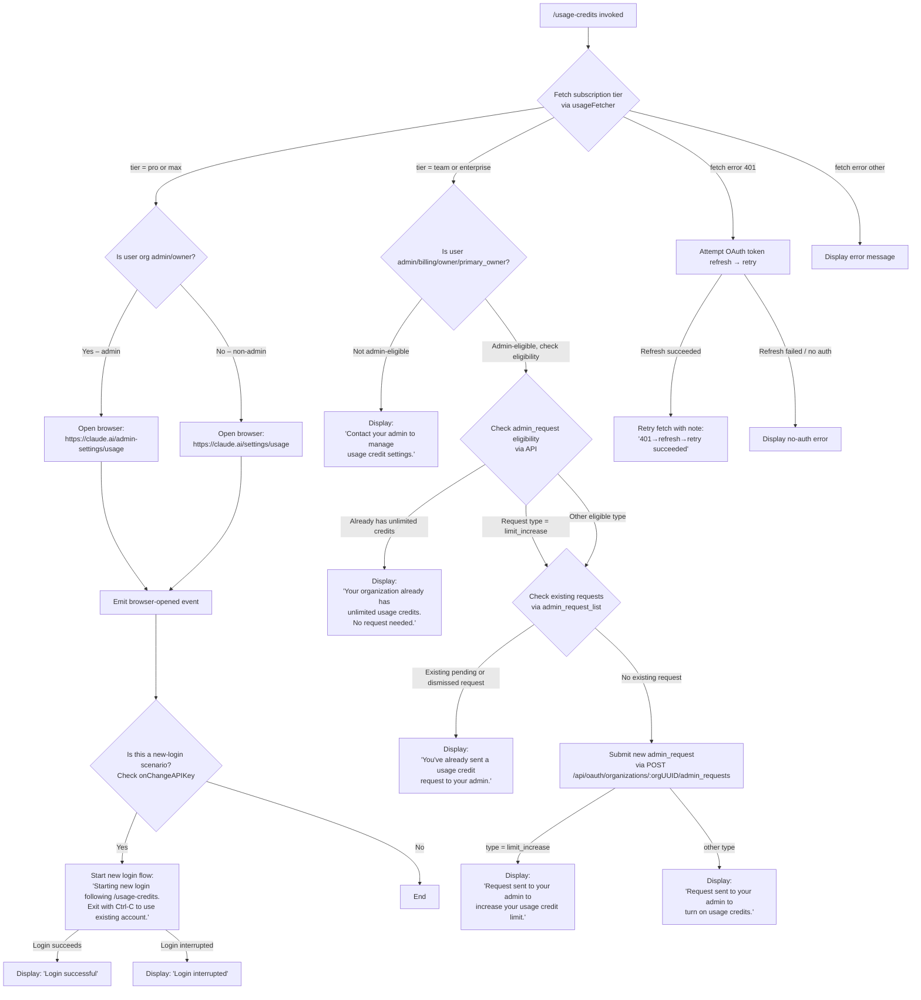

# `/usage-credits`

> Analysis basis: CC v2.1.144 bundle.js (AST extraction + Claude interpretation)
> Minimum version: v2.1.144

---

## Overview

`/usage-credits` is an interactive command that helps users who have hit a Claude usage limit to configure or request usage credits. It checks the user's subscription tier and organizational role, then either surfaces a browser link to manage usage settings, sends an admin-request to raise the credit limit, or prompts a new login flow — depending on the account state detected at runtime.

---

## Registration

| Field | Value |
|---|---|
| type | `local-jsx` |
| name | `usage-credits` |
| description | `Configure usage credits to keep working when you hit a limit` |
| loc_byte | `8492458` |
| loc_byte_end | `8492668` |
| loc_line | `2762` |
| module_id | `NI_` |
| load_inline | `true` |
| arbor_handler.name | `Bj6` |
| arbor_handler.fqn | `claude-2.1.144::Bj6` |
| arbor_handler.kind | `AsyncFunction` |
| arbor_handler.resolution_path | `module_id` |
| arbor_handler.n_hits | `0` |

Analysis basis: CC v2.1.144 bundle.js:+8492458

---

## Input Branching

The command has more than three distinct execution paths determined by subscription tier, organizational role, and API state. A Mermaid flowchart is used.



Analysis basis: CC v2.1.144 bundle.js:+8490877, +8445447, +8444506, +8446706, +8446747, +8491144

---

## Behavioral Spec

### 1. Handler Entry — `usageCreditsHandler` (`Bj6`)

The command's async handler is `Bj6`, resolved by Arbor via `module_id → NI_`.

```
async function usageCreditsHandler(context):
    subscriptionInfo  = await fetchSubscriptionAndOrgInfo(context)   // Oq
    planChecker       = buildPlanChecker(context)                     // P6
    subscriptionKinds = getSubscriptionKindMap(context)               // Y$H
    urlOpener         = getUrlOpener(context)                         // Aq
    creditsOrchestrator = orchestrateUsageCredits(context, ...)       // S$8

    if context.requiresNewLogin:
        log("Starting new login following /usage-credits. " +
            "Exit with Ctrl-C to use existing account.")
        result = await triggerLoginFlow(context)
        if result.success:
            log("Login successful")
        else:
            log("Login interrupted")

    emit telemetry: tengu_ember_latch
    register onChangeAPIKey callback
```

Analysis basis: CC v2.1.144 bundle.js:+8490877, +8490907, +8490921, +8490961, +8490969, +8491039, +8491074, +8491144, +8491246, +8490924

---

### 2. Subscription & Org Info Fetch — `fetchSubscriptionAndOrgInfo` (`Oq`)

```
function fetchSubscriptionAndOrgInfo(context):
    authConfig  = resolveAuthConfig(context)       // Zn8
    envConfig   = resolveEnvConfig(context)        // En8
    orgResolver = resolveOrganization(context)     // KJ
    return buildSubscriptionContext(authConfig, envConfig, orgResolver)  // CA
```

Analysis basis: CC v2.1.144 bundle.js:+2930899, +2930912, +2930922, +2930945

---

### 3. Organization Resolution — `resolveOrganization` (`KJ`)

Determines backend provider and collects auth credentials for the API call.

```
function resolveOrganization(context):
    token = getAuthToken(context)                // SK → xH
    if not token:
        throw Error("ANTHROPIC_API_KEY or CLAUDE_CODE_OAUTH_TOKEN env var is required")
        // literal at bundle.js:+2914674

    provider = detectProvider(context)           // Lz → JA
    // recognized providers: bedrock, foundry, anthropicAws, mantle, vertex, firstParty
    // (literals at +2021996, +2022046, +2022102, +2022156, +2022204, +2022213)

    flagSettings = readFlagSettings(context)     // OI → flagSettings literal at +2915194
    apiKeyHelper = resolveApiKeyHelper(context)  // n$ → apiKeyHelper literal at +2914347
    // falls back to "none" if no helper (+2914386)
    // checks ANTHROPIC_API_KEY env (+2914253)

    return { token, provider, flagSettings, apiKeyHelper }
```

Analysis basis: CC v2.1.144 bundle.js:+2912300, +2912398, +2912419, +2912427, +2912453, +2912562, +2912666

---

### 4. Plan / Tier Check — `buildPlanChecker` (`P6`)

```
function buildPlanChecker(context):
    // Uses api.anthropic.com (literal at +3143410)
    // Maintains a deduplication set (m1_.has / m1_.add) to avoid duplicate plan checks
    // Growthbook experiment integration: emits "GrowthbookExperimentEvent" (+3138152)
    //   using randomBytes(32).toString("hex") for experiment ID (+3170375, +3170388)
    //   only fires in "production" environment (+3138006)
    //   emits "growthbook_experiment" telemetry event (+3138579)

    if T$H.has(planId):
        return cachedPlan
    planData = fetchPlanFromApi(context)        // IF → lu
    storePlanResult(planData)                   // Vr6 → F1_
    return planData
```

Analysis basis: CC v2.1.144 bundle.js:+3144509, +3144546, +3144581, +3144598, +3144609, +3144621, +3144635, +3144652, +3144672

---

### 5. Subscription Kind Mapping — `getSubscriptionKindMap` (`Y$H`)

Maps subscription type strings to structured objects used for branching.

```
function getSubscriptionKindMap(context):
    // Recognized subscription kind strings:
    //   "stripe_subscription"            (+2930652)
    //   "stripe_subscription_contracted" (+2930679)
    //   "apple_subscription"             (+2930717)
    //   "google_play_subscription"       (+2930743)

    stripeKinds    = buildKindEntry(["stripe_subscription",
                                     "stripe_subscription_contracted"], ...)   // f5
    appleAndGoogle = buildKindEntry(["apple_subscription",
                                     "google_play_subscription"], ...)         // e_

    return { stripeKinds, appleAndGoogle }
```

Analysis basis: CC v2.1.144 bundle.js:+2930605, +2930627, +2930652, +2930679, +2930717, +2930743

---

### 6. URL Opener — `openUrl` (`Aq`)

Opens a URL in the system default browser.

```
function openUrl(url):
    validate url has scheme "http:" or "https:"  // CP4, literals at +6412880, +6412902
    if error: throw Error

    if platform == "darwin":                     // literal at +6413189
        spawn("open", [url])                     // literal at +6413363
    elif platform == "win32":                    // literal at +6413205
        spawn("rundll32", ["url,OpenURL", url])  // literals at +6413289, +6413301
    else:
        spawn("xdg-open", [url])                 // literal at +6413370
```

Analysis basis: CC v2.1.144 bundle.js:+8490969, +6413117, +6413130, +6413189, +6413205, +6413238

---

### 7. Credits Orchestrator — `orchestrateUsageCredits` (`S$8`)

This is the core decision engine.

```
async function orchestrateUsageCredits(context, orgInfo, planChecker, subscriptionKinds, urlOpener):

    // Step A: Fetch usage via /api/oauth/usage (timeout 5000ms, +8444698)
    //         Content-Type: application/json (+8444712, +8444727)
    usageData = await fetchUsageData("/api/oauth/usage")   // qiH → d9

    // Step B: Check if plan is already unlimited
    eligibility = await checkAdminRequestEligibility(orgInfo)  // cB9
    // API endpoint: api_admin_request_eligibility (+8444173)
    if eligibility.unlimited:
        display("Your organization already has unlimited usage credits. No request needed.")
        // literal at +8445706
        return

    // Step C: Branch by subscription tier (pro / max vs team / enterprise)
    if tier in ["pro", "max"]:           // literals at +8490888, +8490899
        if isAdmin(orgInfo):
            openUrl("https://claude.ai/admin-settings/usage")  // +8446706
        else:
            openUrl("https://claude.ai/settings/usage")        // +8446747
        emit event "browser-opened"      // literal at +8446814
        return

    if tier in ["team", "enterprise"]:   // literals at +8445458, +8445470
        // Check organizational role
        if role not in ["admin", "billing", "owner", "primary_owner"]:
            // literals at +2024886, +2024894, +2024904, +2024912
            display("Contact your admin to manage usage credit settings.")
            // literal at +8445865
            return

        // Step D: List existing admin requests
        existingRequests = await listAdminRequests(orgInfo)   // dB9
        // API endpoint: api_admin_request_list (+8443822)
        // Appends status filter: statuses=[pending, dismissed] (+8443925, +8446031, +8446041)

        if existingRequests has pending or dismissed:
            display("You've already sent a usage credit request to your admin.")
            // literal at +8446100
            return

        // Step E: Submit new admin request
        newRequest = await createAdminRequest(orgInfo)        // QB9
        // POST /api/oauth/organizations/:orgUUID/admin_requests (+8443614)
        // API endpoint alias: api_admin_request_create (+8443557)

        if newRequest.type == "limit_increase":              // literal at +8445801
            display("Request sent to your admin to increase your usage credit limit.")
            // literal at +8446339
        else:
            display("Request sent to your admin to turn on usage credits.")
            // literal at +8446405

    // Step F: Handle errors
    if error is Axios error:                                  // nB9 → s8.isAxiosError
        if error.status == 401:
            // attempt token refresh and retry; on success suffix " (401→refresh→retry succeeded)"
            // literal at +8444913
        if error.status == 500:                              // literal at +8445116
            display error.detail                             // literal at +8445322
        if error.status >= 400:
            display error message
```

Analysis basis: CC v2.1.144 bundle.js:+8445447, +8445487, +8445515, +8445544, +8445797, +8446009, +8446253, +8446476, +8446486, +8446543, +8446573, +8446864

---

### 8. Auth-Error Handling — `handleAuthError` (`SE`)

```
function handleAuthError(error):
    if not isAxiosError(error):
        return propagate(error)
    if error.status == 401:
        attempt token refresh via tokenRefreshManager (yu)
        // P__.get / P__.delete / P__.set (+2925873, +2925924, +2925947)
        retry original request
    if error.status == 403:
        throw "OAuth token has been revoked"   // literal at +2945922
    else:
        display CA error display
```

Analysis basis: CC v2.1.144 bundle.js:+8444575, +2945767, +2945828, +2945856, +2945922

---

### 9. Error Formatter — `formatError` (`kH`)

```
function formatError(err):
    message = extractMessage(err)              // b_ → String/Error
    rendered = renderText(message)             // xH
    logEntry = buildLogEntry(message)          // Aq → D3A
    rotate history buffer (max 20 entries)     // bkK: ER6.shift / ER6.push, literal +2042107
    push to HCH display buffer                 // HCH.push (+960967)
    if critical: Sc.logError(...)              // +961007
```

Analysis basis: CC v2.1.144 bundle.js:+960607, +960620, +960866, +960949, +960967, +961007

---

### 10. Login Trigger Sub-flow

When the handler detects that the session has no valid credentials after the credits flow, it initiates a fresh login.

```
function maybeStartNewLogin(context):
    log("Starting new login following /usage-credits. " +
        "Exit with Ctrl-C to use existing account.")
    // literal at +8491144

    result = await loginFlow(context)

    register onChangeAPIKey callback
    // changes API key/token on successful login (+8491246)

    if result.ok:
        log("Login successful")    // literal at +8491269
    else:
        log("Login interrupted")   // literal at +8491288
```

Analysis basis: CC v2.1.144 bundle.js:+8491144, +8491246, +8491269, +8491288

---

## State & Side Effects

| Item | Detail |
|---|---|
| Telemetry | `tengu_ember_latch` (bundle.js:+8490924) — fired on handler entry; `tengu_feature_ok` (bundle.js:+955520) — feature gate passed; `tengu_feature_bad` (bundle.js:+955578) — feature gate failed |
| Growthbook experiment | Emits `GrowthbookExperimentEvent` and `growthbook_experiment` event in production only; uses 32-byte random hex ID (bundle.js:+3138152, +3138579) |
| API calls | `GET /api/oauth/usage` (timeout 5000 ms); `GET` eligibility check (`api_admin_request_eligibility`); `GET` request list (`api_admin_request_list`); `POST /api/oauth/organizations/:orgUUID/admin_requests` |
| Browser launch | Opens `https://claude.ai/admin-settings/usage` or `https://claude.ai/settings/usage` depending on role; fires `browser-opened` event (bundle.js:+8446814) |
| Token state | On 401 response, triggers OAuth token refresh via token-refresh manager (`yu`); updates `P__` map; may set `no-auth` flag (bundle.js:+8444812) |
| Login state | May invoke full login flow; registers `onChangeAPIKey` callback to propagate new credentials (bundle.js:+8491246) |
| History buffer | Error messages rotated through a fixed-size ring buffer (`ER6`, max 20 entries) and pushed to display buffer `HCH` |
| appState changes | `flagSettings` read from app state (bundle.js:+2915194); plan check results cached in `T$H` and dedup set `m1_` |
| Sound | None detected |

---

## Version History

| Version | Change |
|---|---|
| v2.1.144 | Initial analysis |

---

## Common Mistakes

1. **Running `/usage-credits` on a `team` or `enterprise` plan as a non-admin member** will only display "Contact your admin to manage usage credit settings." — no request is submitted and no browser is opened. Only roles `admin`, `billing`, `owner`, and `primary_owner` can trigger the admin-request flow.

2. **Running `/usage-credits` when the organization already has unlimited credits** terminates immediately with an informational message. There is no action the user can take from this command in that state.

3. **Expecting immediate effect**: the command submits an admin *request*; it does not grant credits. A separate admin action is required before usage resumes.

4. **Interrupting the login sub-flow with Ctrl-C**: the command itself warns about this. Pressing Ctrl-C exits the new-login flow and leaves the existing session unchanged. The literal "Exit with Ctrl-C to use existing account." is intentional guidance, not an error.

5. **Missing `ANTHROPIC_API_KEY` or OAuth token**: if neither environment variable is set, the command throws immediately during organization resolution with the message "ANTHROPIC_API_KEY or CLAUDE_CODE_OAUTH_TOKEN env var is required" (bundle.js:+2914674).

6. **Duplicate admin requests**: the command checks for pre-existing `pending` or `dismissed` requests before posting. Attempting to submit again will be silently blocked with "You've already sent a usage credit request to your admin."

---

## Appendix — Identifier Mapping

> For bundle debugging only. Identifiers change across versions.

| Identifier | Role |
|---|---|
| `Bj6` | `usageCreditsHandler` — async top-level handler for `/usage-credits` |
| `Oq` | `fetchSubscriptionAndOrgInfo` — gathers subscription and org context |
| `Zn8` | `resolveAuthConfig` — resolves authentication configuration |
| `En8` | `resolveEnvConfig` — resolves environment configuration |
| `KJ` | `resolveOrganization` — resolves organization, provider, and credentials |
| `SK` | `getAuthToken` — retrieves current auth token |
| `xH` | `renderText` — renders text for display |
| `$I` | `buildAuthContext` — assembles auth context object |
| `uB6` | `readOAuthTokenHelper` — reads OAuth token via helper |
| `J1H` | `buildTokenReader` — constructs token-reading utility |
| `tc` | `readOAuthTokenFromFd` — reads OAuth token from file descriptor |
| `OI` | `readFlagSettings` — reads feature flag settings from app state |
| `Lz` | `detectProvider` — detects backend provider (bedrock, vertex, etc.) |
| `JA` | `mapProviderName` — maps provider name to canonical form |
| `cJ` | `resolveApiKeySource` — determines API key source |
| `n$` | `resolveApiKeyHelper` — resolves API key helper or falls back to `none` |
| `D76` | `validateApiKeyHelper` — validates the API key helper value |
| `SSH` | `checkVscodeEnv` — checks for VS Code environment (`claude-vscode`) |
| `Rq6` | `readApiKeyFromFd` — reads API key from file descriptor |
| `y6` | `recordTimestampedEvent` — records a timestamped telemetry event |
| `sy` | `sliceHistoryBuffer` — slices the history buffer (max 20 entries) |
| `lV` | `getSessionContext` — retrieves current session context |
| `P6` | `buildPlanChecker` — builds plan-check utility with caching |
| `f56` | `fetchPlanDetails` — fetches plan details from API |
| `M56` | `parsePlanResponse` — parses the plan API response |
| `Cs` | `buildApiClient` — constructs the Anthropic API client |
| `IF` | `createHttpClient` — creates the underlying HTTP client |
| `lu` | `configureHttpClient` — configures HTTP client options |
| `Vr6` | `cachePlanResult` — caches and deduplicates plan check results |
| `u1_` | `initGrowthbookExperiment` — initialises Growthbook experiment tracking |
| `R0H` | `buildExperimentContext` — builds experiment context object |
| `cu` | `generateExperimentId` — generates random 32-byte hex experiment ID |
| `CH` | `serializeToJson` — serialises data via JSON.stringify |
| `RRL` | `sendExperimentReport` — sends Growthbook experiment report |
| `F1_` | `storePlanResult` — persists plan result to cache store |
| `Zw1` | `writeCacheEntry` — writes a cache entry |
| `B_` | `readCacheEntry` — reads a cache entry |
| `LV1` | `invalidatePlanCache` — invalidates the plan cache |
| `dRH` | `checkCacheBlacklist` — checks if cache key is blacklisted |
| `Y$H` | `getSubscriptionKindMap` — maps subscription type strings to structured objects |
| `f5` | `buildStripeKindEntry` — builds Stripe subscription kind entries |
| `e_` | `buildMobileKindEntry` — builds Apple/Google Play subscription kind entries |
| `xR` | `checkSubscriptionIncludes` — checks if subscription type is in allowed list |
| `H` | `getRandomOrTimer` — utility for Math.random / setTimeout operations |
| `Aq` | `openUrl` — opens a URL in the default browser |
| `D3A` | `formatUrlForDisplay` — formats a URL for display output |
| `S$8` | `orchestrateUsageCredits` — core credits decision engine |
| `Vu` | `checkOrgRole` — checks user's organisational role |
| `qiH` | `fetchAndDispatchUsage` — fetches usage data and dispatches result |
| `d9` | `buildApiRequest` — builds an API request object |
| `_` | `getRequestDefaults` — returns default request parameters |
| `RH` | `applyRequestHeader` — applies a request header |
| `bH` | `applyRequestBody` — applies a request body |
| `IE` | `checkSubscriptionEligibility` — checks if subscription is eligible |
| `SE` | `handleAuthError` — handles 401/403 Axios errors with token refresh |
| `yu` | `tokenRefreshManager` — manages OAuth token refresh lifecycle |
| `v` | `buildHttpRequest` — builds and executes an HTTP request |
| `vfK` | `resolveRequestOptions` — resolves full HTTP request options |
| `x4` | `normalizeRequestPath` — normalises the request path |
| `YhH` | `applyHeaderTransform` — applies header transformation |
| `yfK` | `resolveRequestBody` — resolves and encodes the request body |
| `cB9` | `checkAdminRequestEligibility` — checks eligibility for admin credit request |
| `dB9` | `listAdminRequests` — lists existing admin requests (pending/dismissed) |
| `A` | `buildFormData` — builds form-data or append helper |
| `f` | `closeFormData` — closes a form-data stream |
| `QB9` | `createAdminRequest` — POSTs a new admin credit request |
| `nB9` | `classifyAxiosError` — classifies Axios errors by status code |
| `BY` | `displayMessage` — displays a message to the user |
| `GH` | `formatStatusString` — formats a status code as string |
| `kH` | `formatError` — formats and logs an error with history rotation |
| `b_` | `extractErrorMessage` — extracts message string from Error or string |
| `bkK` | `rotateHistoryBuffer` — rotates the error history ring buffer (ER6) |
| `iq` | `openBrowserUrl` — higher-level browser-open orchestrator |
| `CP4` | `validateUrlScheme` — validates URL scheme is http: or https: |
| `dJ` | `spawnBrowserProcess` — spawns the OS browser process |
| `D8` | `runChildProcess` — runs a child process with timeout |
| `z_` | `manageChildProcess` — manages child process lifecycle |
| `C6` | `buildChildProcessArgs` — builds child process argument array |

---

Note: index built via Arbor fallback; some signals (telemetry, literals) may be missing — see arbor-fallback.js.