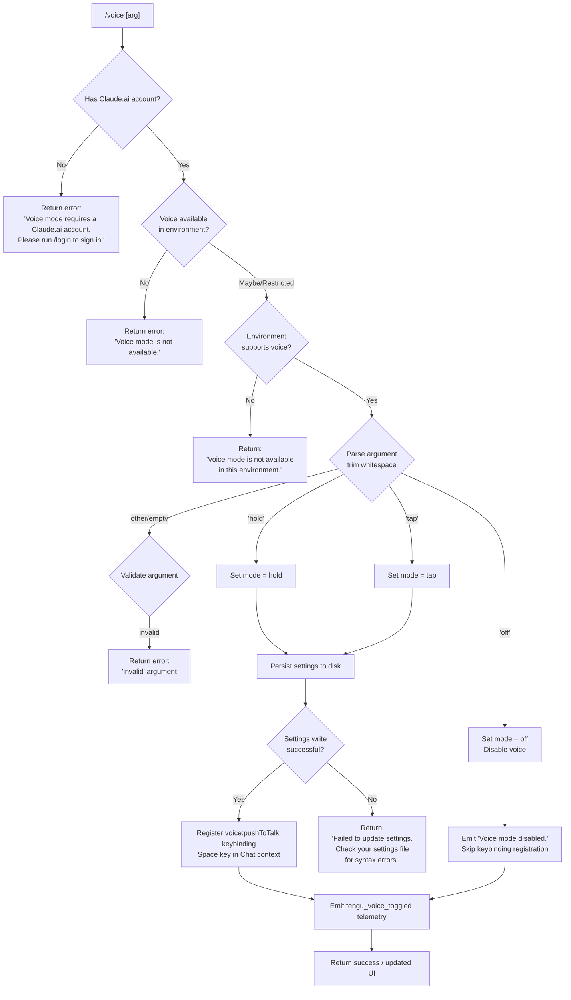

# `/voice`

> Analysis basis: CC v2.1.144 bundle.js (AST extraction + Claude interpretation)
> Minimum version: v2.1.144

---

## Overview

The `/voice` command toggles the voice input mode in Claude Code's interactive CLI. It accepts one of three sub-mode arguments (`hold`, `tap`, or `off`) and updates the user's persistent settings accordingly — or disables voice if the environment does not support it. A push-to-talk keybinding (`voice:pushToTalk`, defaulting to `Space` in the `Chat` context) is registered when voice mode is enabled.

---

## Registration

| Field | Value |
|---|---|
| type | `local` |
| name | `voice` |
| description | `Toggle voice mode` |
| argumentHint | `[hold\|tap\|off]` |
| supportsNonInteractive | `false` |
| isHidden | `null` |
| module_id | `uNq` |
| load_inline | `true` |
| loc_byte | `11954556` |
| loc_byte_end | `11954798` |
| loc_line | `7772` |
| arbor_handler.name | `_u7` |
| arbor_handler.fqn | `claude-2.1.144::_u7` |
| arbor_handler.kind | `AsyncFunction` |
| arbor_handler.resolution_path | `module_id` |
| arbor_handler.n_hits | `1` |

Analysis basis: CC v2.1.144 bundle.js:+11954556

---

## Input Branching

The command has 5+ distinct outcome paths based on account type, environment capability, argument value, and settings persistence. A Mermaid flowchart is used.



Analysis basis: CC v2.1.144 bundle.js:+11952010 – +11954278

---

## Behavioral Spec

### Top-Level Handler (`_u7`)

The primary handler is the `AsyncFunction` identified as `_u7` (resolved via `module_id → uNq`).

Analysis basis: CC v2.1.144 bundle.js:+11952010

```
async function voiceCommandHandler(args, context):

    # Step 1: Account / auth gate
    accountStatus = checkVoiceAccountEligibility(context)
    if accountStatus == NOT_CLAUDE_AI_ACCOUNT:
        return textResult(
            "Voice mode requires a Claude.ai account. Please run /login to sign in."
        )

    # Step 2: Platform availability gate
    if not isPlatformVoiceCapable(context):
        return textResult("Voice mode is not available.")

    # Step 3: Argument normalization
    rawArg = args.trim()         # calls H.trim at +11952302

    # Step 4: Sub-mode validation
    mode = parseVoiceMode(rawArg)   # calls Hu7 (normalizeVoiceMode) at +11952235
    # mode ∈ {"hold", "tap", "off", "invalid"}

    if mode == "invalid":
        return textResult("invalid")

    # Step 5: Emit core telemetry immediately
    emitTelemetry("tengu_voice_toggled", { mode: mode })   # +11952552

    # Step 6: Settings persistence
    if mode == "off":
        settingsOk = persistVoiceSettings(context, disabled=true)
        if not settingsOk:
            return textResult(
                "Failed to update settings. Check your settings file for syntax errors."
            )
        return textResult("Voice mode disabled.")

    # Step 7: Environment check (done after arg parsing, before write)
    if not isEnvironmentVoiceAvailable(context):
        return textResult("Voice mode is not available in this environment.")

    # Step 8: Persist voice mode setting
    settingsOk = persistVoiceSettings(context, mode=mode)
    if not settingsOk:
        return textResult(
            "Failed to update settings. Check your settings file for syntax errors."
        )

    # Step 9: Register push-to-talk keybinding
    registerKeybinding(
        action = "voice:pushToTalk",
        context = "Chat",
        key = "Space"
    )

    # Step 10: Update MCP / app state
    applyMcpAndDaemonUpdates(context)

    return successResult()
```

Analysis basis: CC v2.1.144 bundle.js:+11952010

---

### Voice Mode Normalizer (`Hu7`)

Called from the handler at +11952235. Trims input and maps it to one of the four canonical tokens.

```
function normalizeVoiceMode(rawInput):
    trimmed = rawInput.trim()          # H.trim at +11951880
    if trimmed == "hold":   return "hold"    # literal at +11951927
    if trimmed == "tap":    return "tap"     # literal at +11951939
    if trimmed == "off":    return "off"     # literal at +11951950
    return "invalid"                         # literal at +11951971
```

Analysis basis: CC v2.1.144 bundle.js:+11951880

---

### Account Eligibility Check (`RsH` / `DQ_`)

`RsH` (accountEligibilityCheck) is called from `_u7` at +11952010 and delegates to `DQ_` (resolveAccountFlags) at +11942543.

```
function accountEligibilityCheck(context):
    flags = resolveAccountFlags(context)    # DQ_ at +11942543
    boolFlag = Boolean(flags)               # Boolean at +11942481
    supplemental = fetchSupplementalAuth()  # sG6 at +11942550
    return { eligible: boolFlag, supplemental }
```

Analysis basis: CC v2.1.144 bundle.js:+11942543

---

### Settings Load and Persist (`B_` → `Du` / `g_`)

Settings loading is orchestrated by `B_` (settingsBootstrap) at +11952188, which calls `Du` (loadSettingsFromDisk) at +1205452. Persistence is handled by `g_` (writeSettings) at +11952371.

```
function settingsBootstrap():
    Du()   # loadSettingsFromDisk — emits "loadSettingsFromDisk_start"
           # and "loadSettingsFromDisk_end" performance marks

function loadSettingsFromDisk():
    # Reads from (in order, merged):
    #   flagSettings, policySettings, userSettings,
    #   projectSettings, localSettings, SDK inline settings
    # Paths: ~/.claude/settings.json, ~/.claude/settings.local.json
    start = Date.now()
    emitLog("info", "settings_load_started")
    settings = mergeSettingsLayers()
    emitLog("info", "settings_load_completed")
    return settings

async function writeSettings(context, voiceMode):
    # Resolves config file path via wC6 (configFileLocator)
    configPath = resolveConfigPath(context)

    # Reads current config, merges voice mode field
    current = await readConfigFile(configPath)
    updated = merge(current, { voice: voiceMode })

    # Atomic write via temp-file + rename pattern (aA6)
    atomicWriteFile(configPath, JSON.stringify(updated))

    # Clears in-memory caches (lz)
    clearConfigCaches()

    return true   # or false on parse/write error
```

Analysis basis: CC v2.1.144 bundle.js:+11952188, +1205452, +1207154

---

### Keybinding Registration (`Pj`)

Called from `_u7` at +11953817. Registers the push-to-talk action in the `Chat` context bound to `Space`.

```
function registerVoiceKeybinding():
    actionName = "voice:pushToTalk"   # literal at +11953820
    context   = "Chat"                # literal at +11953839
    defaultKey = "Space"              # literal at +11953846

    # Load user keybindings from keybindings.json (ks6 at +3759311)
    userBindings = loadUserKeybindings()

    # Merge default binding; user override wins if present
    effectiveKey = userBindings.lookup(context, actionName) ?? defaultKey

    # Register via Pj → ks6 → Uf6 pipeline
    bindingRegistry.register(context, actionName, effectiveKey)

    # Telemetry if fallback used (tengu_keybinding_fallback_used)
    if effectiveKey == defaultKey and userHadCustomBinding:
        emitTelemetry("tengu_keybinding_fallback_used")
```

Analysis basis: CC v2.1.144 bundle.js:+11953817, +11953820, +11953839, +11953846

---

### Microphone Permission Hint

When voice mode is unavailable due to OS-level microphone permissions, the literal string referencing `"System Settings → Privacy & Security → Microphone"` (at +11953358) is surfaced in the error path.

Analysis basis: CC v2.1.144 bundle.js:+11953358

---

### MCP / Daemon State Update (`M` → `dvH`)

After a successful settings write, `_u7` calls `M` (mcpStateApplier) at +11953126, which delegates to `dvH` (applyMcpUpdate) at +14272075. This re-evaluates all MCP server connections and daemon configuration.

```
function applyMcpStateAfterVoiceToggle(context):
    dvH(context)    # triggers full MCP reconnect evaluation
    k6K(context)    # applies pending MCP updates
    vq5(context)    # filters and re-dispatches to active clients
```

Analysis basis: CC v2.1.144 bundle.js:+11953126, +14272075

---

## State & Side Effects

| Item | Detail |
|---|---|
| Telemetry | `tengu_voice_toggled` (emitted on every non-error path, +11952552) |
| Telemetry (indirect) | `tengu_keybinding_fallback_used` (+3759393), `tengu_custom_keybindings_loaded` (+3751613), `tengu_config_parse_error` (+3167468) |
| Settings file written | `~/.claude/settings.json` — voice mode field updated atomically |
| Config caches cleared | In-memory config caches invalidated via `lz` (cacheClearer, +1207811) after write |
| Keybinding registered | `voice:pushToTalk` → `Space` in `Chat` context (when mode ≠ `off`) |
| appState changes | Voice mode field in app state updated; MCP client state re-evaluated |
| Hook registration | `h1` (OHA.register at +57049) called from settings-watch path (`fCL`) |
| Sound | None observed |
| Non-interactive | Not supported (`supportsNonInteractive: false`) |

---

## Version History

| Version | Change |
|---|---|
| v2.1.144 | Initial analysis |

---

## Common Mistakes

1. **Running `/voice` without a Claude.ai account.** The command hard-gates on account type before inspecting the argument. Use `/login` first.
2. **Omitting the argument.** An empty or whitespace-only argument resolves to `"invalid"` and returns an error. Always supply `hold`, `tap`, or `off`.
3. **Expecting it to work in non-interactive mode.** `supportsNonInteractive: false` — the command is silently unavailable in pipe/CI contexts.
4. **Ignoring the microphone permission error.** On macOS, if the OS denies microphone access, the error message instructs navigating to `System Settings → Privacy & Security → Microphone` (+11953358). Granting permission there is required before re-running the command.
5. **Editing `settings.json` while voice mode is toggling.** A concurrent write from another process can cause a JSON parse error, producing the "Failed to update settings. Check your settings file for syntax errors." message.
6. **Expecting keybindings to persist without a `keybindings.json` entry.** The `Space` key default is applied programmatically; customisation requires a proper `{ "bindings": [...] }` structure in `keybindings.json`.

---

## Appendix — Identifier Mapping

> For bundle debugging only. Identifiers change across versions.

| Identifier | Role |
|---|---|
| `_u7` | Main async handler for `/voice` (arbor_handler) |
| `RsH` | Account eligibility check |
| `DQ_` | Resolve account flags (called by RsH) |
| `KJ` | Auth/API key validation orchestrator |
| `SK` | API key reader |
| `$I` | API key helper resolver |
| `Lz` | First-party auth check |
| `cJ` | Auth token accessor |
| `n$` | API key validation core |
| `J1H` | Auth error emitter |
| `sG6` | Supplemental auth fetcher |
| `B_` | Settings bootstrap (load on startup) |
| `Du` | Load settings from disk |
| `AR` | Settings merge accumulator |
| `j9` | Memory usage sampler (perf) |
| `cx` | perf_hooks require wrapper |
| `mp8` | Settings load orchestrator |
| `T8` | Append-to-log-file utility |
| `PI6` | Policy settings reader |
| `m16` | Flag settings manager |
| `KJA` | Settings key aggregator |
| `o5H` | User settings file resolver |
| `NB` | SDK inline settings handler |
| `_JA` | SDK settings injector |
| `kB` | Settings layer merger |
| `q_` | WSL environment detector |
| `Hu7` | Voice mode argument normalizer |
| `H` | Random/setTimeout utility (also used in math contexts) |
| `g_` | Voice settings writer (async) |
| `XO` | Config path + merger entry |
| `up8` | Settings layer uploader |
| `$X` | File read wrapper |
| `Rc` | File content reader (encoding-aware) |
| `BM` | File stat / symlink resolver |
| `v` | Text content normalizer |
| `yR6` | File encoding detector |
| `SR6` | BOM stripper |
| `O8` | ENOENT guard |
| `A8` | Error code extractor |
| `mm8` | EC6 timestamp setter |
| `UPH` | Config path builder |
| `Kb6` | Config directory resolver |
| `aA6` | Atomic file writer (temp + rename) |
| `CH` | JSON serializer |
| `lz` | In-memory config cache clearer |
| `wC6` | Config file locator / async writer |
| `C6` | Context store reader |
| `kR6` | AsyncLocalStorage getter |
| `Em8` | Git check-ignore runner |
| `vm8` | gitignore-aware path filter |
| `z_` | Git subprocess launcher |
| `uhK` | .config/claude ignore path builder |
| `vR` | .claude settings path joiner |
| `kH` | Persistent log appender |
| `b_` | Error message coercer |
| `xH` | String coercer |
| `Aq` | Log ring-buffer writer |
| `D3A` | Log string formatter |
| `bkK` | Log ring-buffer shift/push |
| `d` | Deferred/promise utility |
| `M` | MCP state applier |
| `dvH` | Apply MCP update (full reconnect evaluation) |
| `he` | MCP server config merger |
| `EqH` | Enterprise MCP config handler |
| `Se` | SDK MCP config handler |
| `hz6` | SSE/HTTP MCP config handler |
| `FI` | MCP feature flag integrator |
| `J3` | Feature flag resolver |
| `BJ_` | Feature flag branch handler |
| `H_` | Identity/pass-through wrapper |
| `P26` | MCP server list filter |
| `S77` | MCP connection status checker |
| `sh_` | MCP needs-auth cache reader |
| `h18` | MCP tool hash builder |
| `Hi` | Tool descriptor builder |
| `Cj` | SHA-256 hasher |
| `S18` | MCP server state tracker |
| `hK` | Connection state logger |
| `H8` | MCP debug logger |
| `Ah_` | MCP connection orchestrator |
| `uL7` | MCP transport selector |
| `vB` | OAuth token store accessor |
| `P6H` | MCP OAuth flow handler |
| `BrH` | OAuth pending-set manager |
| `D` | Daemon memory/spare manager |
| `FY8` | MCP needs-auth cache writer |
| `QQ` | MCP reconnect loop |
| `Yu` | OAuth token getter |
| `Y` | Supervisor config updater |
| `$7` | MCP error logger |
| `GH` | String coercer (error paths) |
| `mL7` | MCP transport timeout handler |
| `xL7` | SSH environment detector |
| `qh_` | MCP client query handler |
| `UrH` | OAuth cache getter |
| `FrH` | OAuth pending getter |
| `H8q` | MCP status dispatcher |
| `n9` | AsyncLocalStorage session getter |
| `zD8` | needs-auth cache path builder |
| `Hh_` | MCP tool hash verifier |
| `xJ_` | MCP tool list builder |
| `t6` | Tool descriptor constructor |
| `A` | Lowercase string normalizer |
| `J` | Process kill orchestrator |
| `y` | Background process writer |
| `a6q` | Async iterator mapper |
| `Zn` | Iterator protocol helper |
| `W26` | parseInt wrapper (batch size) |
| `th_` | parseInt wrapper (timeout) |
| `k6K` | MCP update applicator |
| `YD8` | MCP update serializer |
| `Pv` | MCP cleanup runner |
| `trH` | MCP cleanup serializer |
| `$` | Daemon NVq entry point |
| `NVq` | Daemon status recorder |
| `Qa` | Daemon config writer |
| `SG6` | daemon.status.json path builder |
| `vq5` | MCP client dispatcher |
| `C18` | Tool permission checker |
| `r8` | Timeout/retry wrapper |
| `Pj` | Keybinding registration entry |
| `ks6` | Keybinding config loader |
| `Uf6` | Keybinding file parser |
| `b4_` | Keybinding schema validator |
| `zm` | Keybinding release emitter |
| `M9H` | keybindings.json path builder |
| `b6` | JSON.parse wrapper |
| `bH` | Deferred result holder |
| `Is6` | Keybinding array validator |
| `Zs6` | Keybinding entry flattener |
| `tb1` | Keybinding deferred resolver |
| `R4_` | Keybinding duplicate detector |
| `C4_` | Keybinding block compiler |
| `RH` | Result holder |
| `ys6` | Keybinding action mapper |
| `p4_` | Keybinding action block parser |
| `BQL` | Action block validator |
| `mGH` | Keybinding display name mapper |
| `ESH` | Locale/language detector |
| `y6` | Config file watcher |
| `t1_` | File watch debouncer |
| `V$H` | Config file reader (with backup) |
| `TR` | Config prefix stripper |
| `GV1` | Config backup directory scanner |
| `L9_` | Backup path joiner |
| `w` | Daemon worker manager |
| `C` | Child process writer |
| `fT6` | macOS memory threshold checker |
| `x` | Worker retire-if-settled |
| `P6` | Daemon process spawner |
| `Ea_` | IPC socket connector |
| `ka_` | Worker lifecycle manager |
| `h` | Worker handle |
| `fCL` | File-watch registration helper |
| `Rl` | Watch callback debouncer |
| `h1` | OHA hook registrar |

---

Note: index built via Arbor fallback; some signals (telemetry, literals) may be missing — see arbor-fallback.js.