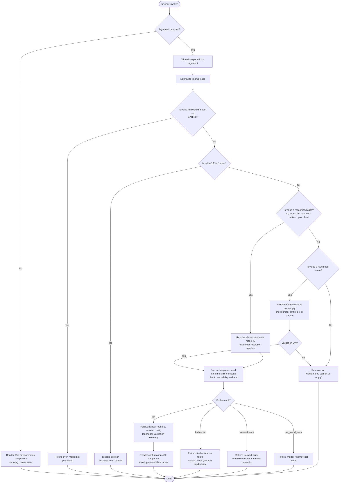

# `/advisor`

> Analysis basis: CC v2.1.145 bundle.js (AST extraction + Claude interpretation)
> Minimum version: v2.1.145

---

## Overview

`/advisor` configures the Advisor Tool, which allows Claude Code to consult a stronger model for guidance at key decision points during a task. The command accepts an optional model name or shorthand alias and persists the chosen advisor model to the active session configuration. When invoked without arguments, it renders a JSX component that displays the current advisor state and available options.

---

## Registration

| Field | Value |
|---|---|
| type | `local-jsx` |
| name | `advisor` |
| description | Configure the Advisor Tool to consult a stronger model for guidance at key moments during a task |
| loc_byte | 11681236 |
| loc_byte_end | 11681523 |
| loc_line | 7213 |
| argumentHint | `null` |
| isHidden | `null` |
| module_id | `BZq` |
| load_inline | `true` |
| arbor_handler.name | `qC7` |
| arbor_handler.fqn | `claude-2.1.145::qC7` |
| arbor_handler.kind | `AsyncFunction` |
| arbor_handler.resolution_path | `module_id` |
| arbor_handler.n_hits | 1 |

Analysis basis: CC v2.1.145 bundle.js:+11681236

---

## Input Branching

The command has four or more distinct paths depending on the presence and value of the argument string, so a flowchart is used.



Analysis basis: CC v2.1.145 bundle.js:+11680694 through +11681005

---

## Behavioral Spec

### Top-level handler (`qC7`)

The command's main entry point is the async function resolved by Arbor under the identifier `qC7` in module `BZq`. It is loaded inline via `load_inline: true`.

```
async function advisorCommandHandler(rawArg, context):
    trimmedArg = rawArg.trim()                       // +11680694

    if trimmedArg is empty:
        return createElement(AdvisorStatusComponent) // +11680730

    normalizedArg = trimmedArg                       // passed to modelSetup

    jsxElement = buildAdvisorUI(                     // +11680848
        normalizedArg,
        modelSelectionHelper,
        modelDisplayHelper
    )

    modelSetupResult = runModelSetup(normalizedArg)  // +11680862

    render(jsxElement + modelSetupResult)
    join(outputParts)                                // +11681005
```

Analysis basis: CC v2.1.145 bundle.js:+11680694

---

### Model normalization and alias resolution (`n1`)

`n1` handles converting a user-supplied string to a canonical model identifier. It accepts the trimmed argument and applies several transformations and table lookups.

```
function resolveModelAlias(input):
    trimmed = input.trim()                          // +2164261
    lower   = trimmed.toLowerCase()                 // +2164272

    // Reject known bad-actor provider patterns
    providerClass = classifyProvider(lower)         // +2164290 (zT -> dAH -> xH)

    // Strip internal annotation brackets e.g. "[1m]"
    cleaned = trimmed.replace(annotationPattern, "") // +2164300

    // Keyword alias table (checked in order):
    if lower includes "opusplan":  return opusPlanModelId  // +2164357
    replace "[1m]" suffix                                   // +2164383
    if lower == "sonnet":          return sonnetModelId    // +2164398
    if lower == "haiku":           return haikuModelId     // +2164437
    if lower == "opus":            return opusModelId      // +2164476
    if lower == "best":            return bestModelId      // +2164513

    // Model-family checks (juH, Av, oH9)
    familyId = deriveModelFamily(lower)             // +2164452

    // Provider-specific prefix handling
    if isAnthropicPrefixed(lower):                 // +2164527
        return normalizedProviderModel(lower)

    // Inject provider context
    result = attachProviderContext(lower)           // +2164545 / +2164551

    // Generate display-safe version for UI
    displayName = buildDisplayName(lower)           // +2164559

    // Final cleanup: replace any residual annotation markers
    return result.replace(residualPattern, "")      // +2164603
```

Analysis basis: CC v2.1.145 bundle.js:+2164261

Recognized alias literals (from `literals` array):

| Alias | Meaning |
|---|---|
| `opusplan` | Opus planning variant (+2164357) |
| `sonnet` | Sonnet family (+2164398) |
| `haiku` | Haiku family (+2164437) |
| `opus` | Opus family (+2164476) |
| `best` | Automatically picks the best available model (+2164513) |

Disable tokens:

| Value | Effect |
|---|---|
| `off` | Disables the advisor (+11680770) |
| `unset` | Clears any previously set advisor (+11680781) |

---

### Model setup and validation pipeline (`L28`)

`L28` is called with the normalized model name and is responsible for both pre-flight validation and the live model probe.

```
async function runModelSetup(modelName):
    trimmed = modelName.trim()                      // +11673284

    if trimmed is empty:
        throw Error("Model name cannot be empty")   // +11673321

    lower = trimmed.toLowerCase()                   // +11673444

    if lower in blockedModelList (BAH):             // +11673463
        return errorUI("Model not permitted")

    if activeModelSet (xZq) already has lower:      // +11673565
        return existingEntry

    probeResult = probeModel(trimmed)               // +11673610 (Mb)

    if probe OK:
        activeModelSet.set(lower, probeResult)      // +11673773
        return buildResultUI(probeResult)           // +11673814 (lR7 / nR7)
```

Analysis basis: CC v2.1.145 bundle.js:+11673284

---

### Model probe (`Mb` / `iu`)

`Mb` orchestrates a live, low-cost probe call to the target model. Internally it delegates to the API session factory (`iu`), which constructs authentication headers, resolves credentials, and executes a minimal API request.

```
async function probeModel(canonicalModelId):
    // Build probe message: single-turn "Hi" message
    probeMessages = [{ role: "user", content: "Hi" }]   // +11673729
    cacheControl  = "ephemeral"                          // +11673754

    // Resolve authentication
    token = getToken()                                   // +2894558
    apiKey = resolveApiKey(env.ANTHROPIC_API_KEY)        // +2915124

    // Set headers
    headers = {
        "User-Agent":              buildUserAgent(),     // +2890106
        "X-Claude-Code-Session-Id": sessionId,          // +2890124
        "x-app":                   appContext,           // +2890078
    }

    // Execute fetch with timeout
    response = await fetch(apiEndpoint, {
        method: "POST",
        headers: headers,
        signal: AbortSignal.timeout(10000),              // +2211698
        body: JSON.stringify({ model: canonicalModelId, messages: probeMessages })
    })

    if response is auth error:
        return { error: "Authentication failed. Please check your API credentials." }  // +11674020
    if response is network error:
        return { error: "Network error. Please check your internet connection." }      // +11674122
    if response.type == "not_found_error":
        return { error: "model: <name> not found" }     // +11674241 / +11674323

    hash = computeHash(canonicalModelId)                 // +12410169 (sha256, +12410184)
    telemetry.emit("tengu_api_success")                  // +12457294

    return { success: true, modelId: canonicalModelId, hash: hash }
```

Analysis basis: CC v2.1.145 bundle.js:+12455811 / +2890062

---

### Model name display helper (`nR7`)

`nR7` maps a stored model identifier to a human-readable display name using the current provider context and a short alias table.

```
function resolveModelDisplayName(modelId):
    context = getProviderContext()                   // +11674542 (cM)
    lower   = modelId.toLowerCase()                 // +11674560

    if lower includes known alias:                  // +11674579
        return aliasLabel

    // Alias table checked:
    // "opus-4-7" / "opus_4_7"   (+11674590 / +11674614)
    // "opus-4-6" / "opus_4_6"   (+11674659 / +11674683)
    // "opus-4-5" / "opus_4_5"   (+11674728 / +11674752)
    // "sonnet-4-6" / "sonnet_4_6" (+11674797 / +11674823)
    // "sonnet-4-5" / "sonnet_4_5" (+11674872 / +11674898)

    providerLabel = resolveProviderLabel(context)   // +11674633 (PM)
    return String(providerLabel + " / " + modelId)  // +11674510
```

Analysis basis: CC v2.1.145 bundle.js:+11673869

---

### Provider classification (`cM` / `wA`)

Used by both alias resolution and display to identify which API provider backend is active.

```
function classifyProvider(modelOrContext):
    // Known provider identifiers (+2022501 – +2023190):
    // "bedrock", "foundry", "anthropicAws", "mantle",
    // "vertex", "firstParty", "gateway"

    for provider in knownProviders:
        if context matches provider:
            return provider

    return "firstParty"   // default
```

Analysis basis: CC v2.1.145 bundle.js:+2022501

---

### Model-set management (`fF` / `YzL` / `DzL`)

`fF` manages the internal collection of configured advisor models, resolving conflicts and applying ordering rules before committing to state.

```
function updateAdvisorModelSet(inputList):
    for each entry in inputList:
        base = parseBaseModel(entry)                 // +2158350 (LA)
        trimmed = base.trim()                        // +2158438 / +2158464

        if trimmed.startsWith("anthropic."):         // +2158490 / +2158503
            category = "anthropic-prefix"

        if trimmed in excludedList (zzL):            // +2157691 (wuH)
            skip entry

        rank = computeModelRank(trimmed)             // +2158606 (rH9)

        if trimmed includes family marker:           // +2157859 (YzL)
            resolvedEntry = resolveToCanonical(trimmed)

        if trimmed starts with "claude-":            // +2158124 (iH9 -> DzL)
            applyClaudePrefix(trimmed)

        modelSet.add(resolvedEntry)

    return deduplicated(modelSet)
```

Analysis basis: CC v2.1.145 bundle.js:+2158350

---

### JSX status component (`hz6`)

When no argument is supplied, the command renders a read-only JSX component showing the current advisor configuration.

```
function renderAdvisorStatusComponent(currentConfig):
    lower = currentConfig.toLowerCase()             // +5251225
    if lower includes recognized state token:       // +5251248
        label = stateLabel(lower)
    else:
        label = currentConfig

    return <AdvisorPanel label={label} config={currentConfig} />
```

Analysis basis: CC v2.1.145 bundle.js:+11680936

---

## State & Side Effects

| Item | Detail |
|---|---|
| Telemetry — `tengu_api_success` | Emitted on a successful probe response (+12457294) |
| Telemetry — `tengu_prompt_cache_1h_config` | Emitted when the 1-hour prompt-cache config is applied (+12416935) |
| Telemetry — `tengu_bg_dispatch_sigkill_escalate` | Background session SIGKILL escalation during probe (+14655330) |
| Telemetry — `tengu_bg_dispatch_low_mem` | Low-memory condition detected in background dispatch (+14655909) |
| Telemetry — `tengu_bg_spare_enable` | Spare background session enabled (+14656548) |
| Telemetry — `tengu_bg_spare_claim` | Spare session successfully claimed (+14656669) |
| Telemetry — `tengu_bg_spare_claim_fail` | Spare session claim failed (+14656932) |
| Telemetry — `tengu_bg_proto_mismatch` | Protocol mismatch in background session (+14643755) |
| Telemetry — `tengu_bg_dispatch_stale_drop` | Stale background dispatch dropped (+14644994) |
| Telemetry — `tengu_bg_attach` | Background session attach event (+14647481) |
| Telemetry — `tengu_bg_attach_stall_gave_up` | Attach stall gave up (+14648393) |
| Telemetry — `tengu_bg_attach_stall_respawn` | Attach stall triggered respawn (+14648662) |
| Telemetry — `tengu_bg_attach_kick` | Attach kick event (+14649579) |
| Telemetry — `tengu_bg_attach_legacy_autorespawn` | Legacy session auto-respawn during attach (+14647070) |
| Session config mutation | Advisor model name written to active session's advisor config map (`xZq`) (+11673773) |
| Model probe cache | Successful probe result is stored in the active model set to avoid re-probing (+11673565) |
| Hook registration | No dedicated hook registration found at depth ≤ 2 |
| appState changes | Advisor model field updated; JSX re-render triggered |
| Sound | None found at depth ≤ 2 |
| API side effect | Single-turn ephemeral probe message ("Hi") is sent to the target model during validation (+11673729) |
| Hash computed | SHA-256 hex hash of the canonical model ID computed for internal cache key (+12410169 / +12410184) |

---

## Version History

| Version | Change |
|---|---|
| v2.1.145 | Initial analysis |

---

## Common Mistakes

1. **Passing a bare model alias without prefix** — aliases like `opus`, `sonnet`, `haiku`, and `best` are resolved internally; passing a partial model name that is not in the alias table and does not start with `anthropic.` or `claude-` will result in a validation error.
2. **Using `off` vs `unset` interchangeably** — both disable the advisor, but they map to different internal sentinel values (`off` at +11680770, `unset` at +11680781). Downstream tooling that reads session config may distinguish them.
3. **Expecting instant feedback on a new model** — `/advisor <model>` sends a live probe request (with a 10-second timeout, +2211698) and will display an auth or network error if the environment does not have valid credentials configured.
4. **Ignoring the blocked-model list** — certain model IDs are unconditionally rejected by the `BAH` set before any probe is attempted (+11673463). There is no user-visible enumeration of this list.
5. **Calling `/advisor` in a non-interactive context** — the command renders a JSX component; in non-TTY or scripted contexts the output may not display correctly because the status view depends on the terminal renderer.

---

## Appendix — Identifier Mapping

> For bundle debugging only. Identifiers change across versions.

| Identifier | Role |
|---|---|
| `qC7` | Top-level async handler for `/advisor` (Arbor-resolved entry point) |
| `n1` | Model alias resolution and normalization function |
| `L28` | Model setup and validation pipeline (trim, block-list, probe dispatch) |
| `Mb` | Model probe orchestrator; calls API session factory |
| `iu` | API session factory; builds headers, resolves auth, executes fetch |
| `fF` | Advisor model-set manager; deduplication and ordering |
| `hz6` | JSX advisor status component renderer (no-arg path) |
| `nR7` | Model display-name resolver; maps IDs to human labels |
| `lR7` | Result UI builder wrapping `nR7` |
| `cM` | Provider context accessor |
| `wA` | Provider classification helper |
| `PM` | Provider-label resolver |
| `mML` | Provider metadata aggregator |
| `olA` | Provider-entry enumerator (Object.entries) |
| `fF6` | Model-family finder |
| `juH` | Model-family derivation helper |
| `Av` | Provider-model normalizer |
| `oH9` | Anthropic-prefix provider handler |
| `xg6` | Model-set inclusion check |
| `JuH` | Display-name builder |
| `zT` | Provider string transformer |
| `dAH` | Provider string sub-transformer |
| `xH` | String coercion utility |
| `FAH` | Blocked-provider check |
| `qv` | Model classification router |
| `YzL` | Canonical model resolver (family-marker path) |
| `DzL` | `claude-` prefix handler |
| `iH9` | `claude-` prefix detector |
| `wuH` | Excluded-model-list checker |
| `rH9` | Model rank computation |
| `MF6` | Provider-entry mapper |
| `g_` | Base provider-entry getter |
| `ONH` | MCP server connection manager (reached via model-set pipeline) |
| `y_K` | MCP update applicator |
| `nL5` | MCP client enumerator and reconnection handler |
| `I` | Model-ID normalizer / header injector |
| `$` | Background session cleanup helper |
| `K` | Column formatter (padEnd, +14680569 width=40) |
| `V0H` | Provider detection wrapper |
| `O1` | Application-inference-profile detector |
| `Kh` | Provider-context accessor (gateway path) |
| `an6` | Temperature-override utility |
| `bP` | Model-name sanitizer |
| `nX` | Message mapper |
| `l3H` | Cache-control block builder |
| `RH` | JSON.stringify wrapper |
| `au` | Random-bytes ID generator |
| `z5` | Session-scope helper |
| `iZH` | Prompt-cache 1h configurator |
| `$A` | Token-budget resolver |
| `Z6` | Cache-control entry constructor |
| `oI8` | Cache-control option validator |
| `aI8` | Cache-control array inspector |
| `BE` | Background-error formatter |
| `zA_` | Error annotation helper |
| `bEH` | API-success telemetry emitter |
| `H44` | Response-header inspector |
| `NH` | Error-event logger |
| `dg` | Agent-prefix detector |
| `eL4` | Agent-ID parser |
| `cH6` | Streaming chunk handler |
| `R7H` | Request-duration tracker |
| `d` | General-purpose disposable/cleanup |
| `eCq` | Content-encoding checker |
| `Vl_` | SHA-256 hash constructor |
| `pg6` | Context-store logger |
| `lq` | String coercion (locale-safe) |
| `ug6` | Async-local-store accessor (H69 variant) |
| `Go6` | Global-context writer |
| `tQ7` | Side-query model finder |
| `V0H` | Provider-detection outer wrapper |
| `Ap6` | Proxy-auth helper executor |
| `jkL` | HTTP request builder / SSE handler |
| `iD` | Model-context injector |
| `LD` | Auth-header assembler |
| `wv` | Streaming response parser |
| `kuH` | WIF token exchange handler |
| `OQ6` | WIF credential resolver / fetch wrapper |
| `dn6` | Token-validity checker |
| `zkL` | OAuth token refresh handler |
| `NMH` | Away-summary generator |
| `WI8` | Timestamp utility |
| `Q76` | Header normalization helper |
| `J$H` | SDK error/warn logger |
| `XM` | Azure cognitive-services token exchanger |
| `_69` | Boolean coercion filter |
| `WO` | Rate-limit state accessor |
| `OkL` | OAuth scope manager |
| `E_` | Environment variable reader |
| `Wz` | Proxy-authorization builder |
| `aw` | Token-budget enforcer |
| `vPH` | Model-prefix validator |
| `h` | Focus/blur session timer |
| `N` | Away-summary main function |
| `C` | Supervisor file-watch handler |
| `w` | Background daemon process manager |
| `P` | IPC message framer / socket handler |
| `J` | Socket event router |
| `Q5` | Socket end/close handler |
| `t75` | Full IPC protocol handler (ping/nudge/yield/lease/dispatch/attach/resize…) |
| `GH` | String header formatter |
| `G` | MCP server registry |
| `i26` | MCP server-entry constructor |
| `kZ8` | MCP server-ID generator |
| `T` | Remote-control token handler |
| `Ul` | Bug-report URL builder |
| `k6` | Node.js version guard |
| `uo8` | URL-encode helper |
| `T1` | Background-mode label resolver |

---

Note: index built via Arbor fallback; some signals (telemetry, literals) may be missing — see arbor-fallback.js.