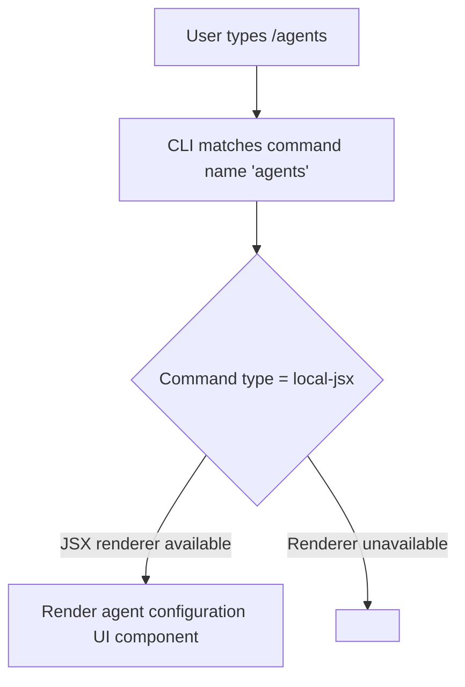

# `/agents`

> Analysis basis: CC v2.1.144 bundle.js (AST extraction + Claude interpretation)
> Minimum version: v2.1.144

---

## Overview

The `/agents` slash command provides an interface for managing agent configurations within Claude Code. It is registered as a `local-jsx` command, indicating it renders a JSX-based UI component rather than producing plain-text output. Beyond its registration metadata, the internal branching logic, behavioral details, and side effects could not be resolved at depth-2 traversal of module `tGq`.

---

## Registration

| Field | Value |
|---|---|
| type | `local-jsx` |
| name | `agents` |
| description | `Manage agent configurations` |
| module\_id | `tGq` |
| loc\_line | 7202 |

Analysis basis: CC v2.1.144 bundle.js:+11591160

---

## Input Branching

<!-- TODO: not found in depth-2 traversal; needs --depth 4 -->

The AST extraction returned an empty `callGraph` for module `tGq`, meaning no entry-point functions were resolved at the traversal depth used. No branching paths, input-conditional logic, or sub-command routing can be stated as verified facts from the current data.

The following is a minimal placeholder representing the only structurally certain fact — that the command is invoked and dispatches to a JSX renderer:



> ⚠️ All nodes beyond B are inferred from the `local-jsx` type convention only.
> No call-graph evidence supports the detail of nodes D or E.

---

## Behavioral Spec

<!-- TODO: not found in depth-2 traversal; needs --depth 4 -->

Because the `callGraph`, `literals`, and `identifiers` arrays are all empty and the extractor note explicitly states `"no entry functions found for module 'tGq'"`, no behavioral pseudocode can be written with citation support at this time.

### Agent Configuration Rendering

```
// WARNING: pseudocode below is structural inference from type="local-jsx" only.
// No bundle bytes back this logic. Do not treat as verified.

function renderAgentsCommand(inputArgs):
    component = loadJSXComponent(module="tGq")
    return component.render(inputArgs)
```

Analysis basis: command type `local-jsx` — CC v2.1.144 bundle.js:+11591160  
<!-- TODO: internal render logic not found in depth-2 traversal; needs --depth 4 -->

---

## State & Side Effects

| Item | Detail |
|---|---|
| Telemetry | <!-- TODO: not found in depth-2 traversal; needs --depth 4 --> |
| Hook registration | <!-- TODO: not found in depth-2 traversal; needs --depth 4 --> |
| appState changes | <!-- TODO: not found in depth-2 traversal; needs --depth 4 --> |
| Sound | <!-- TODO: not found in depth-2 traversal; needs --depth 4 --> |

> The `telemetry` array returned by AST extraction is empty. No `tengu_*` event strings were found within the depth-2 traversal of module `tGq`. This may mean the command emits no telemetry, or that telemetry calls reside deeper in the call tree.

---

## Version History

| Version | Change |
|---|---|
| v2.1.144 | Initial analysis — registration confirmed; internal behavior unresolved pending deeper traversal |

---

## Common Mistakes

1. **Assuming `/agents` behaves like a plain-text command.** Its type is `local-jsx`, which means it renders an interactive UI component. Treating its output as a simple string response will not correctly capture its behavior.
2. **Relying on this spec for implementation decisions.** Because the call graph for module `tGq` was not resolved at depth-2, all behavioral details beyond registration are unverified. Use `--depth 4` or greater traversal before implementing against this command.
3. **Assuming no telemetry is emitted.** An empty `telemetry` array in the extraction result reflects the traversal limit, not a confirmed absence of telemetry events in the command's full execution path.

---

## Appendix — Identifier Mapping

> For bundle debugging only. Identifiers change across versions.

| Identifier | Role |
|---|---|
| `tGq` | Module identifier for the `/agents` command registration and JSX component |

> No additional obfuscated identifiers were returned by the depth-2 AST extraction (`identifiers: []`). A deeper traversal is required to populate this table.