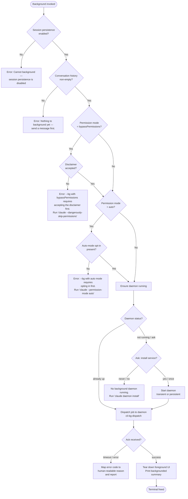

# `/background`

> Analysis basis: CC v2.1.144 bundle.js (AST extraction + Claude interpretation)
> Minimum version: v2.1.144

---

## Overview

The `/background` command (alias: `/bg`) detaches the current interactive Claude Code session from the terminal and hands it off to the background daemon process, freeing the terminal for other work. It validates pre-conditions (session persistence, conversation history, permission-mode gates), forks the job into the daemon, and — once acknowledged — tears down the foreground UI while printing a status summary. If no daemon is running, it optionally starts one as a transient or persistent service.

---

## Registration

| Field | Value |
|---|---|
| type | `local-jsx` |
| name | `background` |
| description | `Send this session to the background and free the terminal` |
| aliases | `["bg"]` |
| argumentHint | `[prompt]` |
| immediate | `null` |
| module_id | `Oyq` |
| load_inline | `true` |
| loc_byte | `12049179` |
| loc_byte_end | `12049419` |
| loc_line | `7993` |
| arbor_handler.name | `xm7` |
| arbor_handler.fqn | `claude-2.1.144::xm7` |
| arbor_handler.kind | `AsyncFunction` |
| arbor_handler.resolution_path | `module_id` |
| arbor_handler.n_hits | `0` |

Analysis basis: CC v2.1.144 bundle.js:+12049179

---

## Input Branching

Six or more distinct pre-condition branches exist before the dispatch path is entered, so a Mermaid flowchart is used.



Analysis basis: CC v2.1.144 bundle.js:+12045186, +12048545, +12048626, +12048802, +12042757, +12042919

---

## Behavioral Spec

### Handler Entry Point (`xm7`)

The Arbor-resolved handler `xm7` is an `AsyncFunction` reached via `module_id → Oyq`.

```
async function backgroundCommandHandler(args, appState):
    // Guard: session persistence
    if not sessionPersistenceEnabled(appState):
        return errorResult("Cannot background — session persistence is disabled, ...")

    // Guard: non-empty conversation
    if conversationHistory is empty:
        return errorResult("Nothing to background yet — send a message first.")

    // Build daemon dispatch arguments from current session
    dispatchArgs = buildDispatchArgs(appState, args)

    // Render JSX result (local-jsx type)
    return createElement(BackgroundComponent, { dispatchArgs, appState })
```

Analysis basis: CC v2.1.144 bundle.js:+12048545, +12048557, +12048593, +12048626, +12048802, +12048872

---

### Permission-Mode Gate (`permissionModeGate` — derived from `Rm7`)

Before forking, the permission flags carried on the CLI launch are checked.

```
function permissionModeGate(currentArgs, settings):
    // Check for bypassPermissions flag
    if "--dangerously-skip-permissions" in currentArgs
       or "--allow-dangerously-skip-permissions" in currentArgs:
        if not disclaimerAccepted(settings):
            throw "--bg with bypassPermissions requires accepting the disclaimer first. ..."

    // Check for auto-permission mode
    mode = resolvePermissionMode(currentArgs)   // reads --permission-mode
    if mode == "auto":
        if not autoModeOptInPresent(settings):
            throw "--bg with auto mode requires opting in first. ..."
```

Analysis basis: CC v2.1.144 bundle.js:+12042514, +12042554, +12042557, +12042588, +12042620, +12042709, +12042757, +12042919

---

### Daemon Ensure-Running (`daemonEnsureRunning` — derived from `OU`)

```
async function daemonEnsureRunning(options):
    status = readDaemonStatus()    // reads daemon.status.json
    if status == "up":
        return  // already running

    platform = detectPlatform()   // "macos" | "linux"
    if options.policy == "ask":
        answer = promptUser("Install as a service now? [y/N/never, or 'once' just for now] ")
        emit telemetry: tengu_bg_daemon_cold_start_ask_answer
        if answer in ["yes", "y"]:
            installDaemonService()
            emit telemetry: tengu_bg_daemon_install
            waitForDaemon(timeout=5000ms)
            // If not reachable within 5 s → error
        elif answer == "once":
            spawnTransientDaemon()
        elif answer in ["never", "no"]:
            emit telemetry: tengu_bg_daemon_cold_start_ask
            throw "No background daemon is running. Run 'claude daemon install' ..."
    else:
        // Non-interactive: spawn transient
        spawnTransientDaemon(args=["run","--origin","transient","--spawned-by",callerPid])
        waitForDaemon(timeout=30000–60000ms)
        if unreachable:
            emit telemetry: tengu_bg_daemon_ensure_transient_unreachable
            throw

    if staleBinaryDetected:
        emit telemetry: tengu_bg_daemon_service_stale_exec
        // fall back to transient spawn
```

Daemon service polling status values observed: `"up"`, `"ask"`, `"run"`.
Timeout constants: cold-start poll 30 000 ms (bundle.js:+11991145), maximum 60 000 ms (bundle.js:+11991167), service-install poll 5 000 ms (bundle.js:+11994495).

Analysis basis: CC v2.1.144 bundle.js:+11989437, +11989457, +11989480, +11989525, +11989598, +11990051, +11990445, +11990503, +11990568, +11990875, +11991145, +11991167, +11994495

---

### Job Dispatch (`dispatchJob` — derived from `cQ_`)

```
async function dispatchJob(dispatchArgs, daemonSocket, options):
    // Build job ID: random bytes via akq.randomBytes (12021716)
    jobId = generateJobId()

    // Write dispatch file to jobs directory (x28.mkdir, x28.unlink)
    dispatchFilePath = joinPaths(jobsDir, jobId)
    writeDispatchFile(dispatchFilePath, dispatchArgs)

    // Connect to daemon control socket
    socket = connectToDaemonSocket("cli-bg-dispatch")   // protocol label

    // Send job and await ack within 6000 ms
    ackResult = await awaitAck(socket, timeout=6000)

    if ackResult.code == "EALIVE":
        // Duplicate job ID; report collision
        return { error: "id collision with a prior job" }
    elif ackResult.code == "ESTALE":
        // Dispatch file race; retry or report
        ...
    elif ackResult.code == "ESTARTING":
        // Daemon still starting; back off 200 ms then retry
        waitMs(200)
        return dispatchJob(...)  // recursive retry

    // Cleanup dispatch file on success
    x28.unlink(dispatchFilePath)
    return { success: true, jobId }
```

Error codes mapped to human-readable messages at bundle.js:+12032344–+12032560:

| Internal code | UI message |
|---|---|
| `not running` | `not running` |
| `ack-timeout` | `timed out` |
| `dispatch-write` | `couldn't write dispatch file` |
| `enoconn` | `socket missing` |
| `estarting` | `service still starting` |
| `short-alive` / `stale-short` | `id collision with a prior job` |
| `daemon-unreachable` | `not running` (fallback) |

Retry/rescue path emits `tengu_bg_dispatch_rescued` (bundle.js:+12028997).

Analysis basis: CC v2.1.144 bundle.js:+12021370, +12021512, +12021620, +12021649, +12021657, +12021716, +12021790, +12021861, +12021902, +12021963, +12022093, +12022516, +12022612, +12023474, +12024000

---

### Argument Forwarding (`buildArgs` — derived from `Em7`)

The command reconstructs a `claude` CLI invocation to be run inside the daemon. Flags parsed and forwarded:

| CLI flag | Notes |
|---|---|
| `--agent` | forwarded verbatim |
| `--name` / `-n` | session name |
| `--resume=<id>` / `-r=<id>` / `--resume` / `-r` | resume-session flags; prefix stripped at lengths 9 and 3 |
| `--session-id=<id>` / `--session-id` | session ID passthrough |
| `--fork-session` | fork mode |
| `-c` / `--continue` | continue mode |
| `--add-dir` | additional directories |
| `--model` | model override |
| `--effort` | effort level |
| Environment vars forwarded: `CLAUDE_CONFIG_DIR`, `CLAUDE_INTERNAL_FC_OVERRIDES`, `AWS_REGION`, `AWS_DEFAULT_REGION`, `AWS_PROFILE`, `GOOGLE_APPLICATION_CREDENTIALS`, `GOOGLE_CLOUD_PROJECT`, `GCLOUD_PROJECT` | |

Job type label written as `"bg"` (bundle.js:+12027259). Conversation origin is written as `"exec"` (bundle.js:+12027241). Session prompt source is one of `"slash"` (bundle.js:+12028063), `"resume"` (bundle.js:+12028149), `"prompt"` (bundle.js:+12028240).

Analysis basis: CC v2.1.144 bundle.js:+12026236, +12026279, +12026306, +12026322, +12026345, +12026382, +12026409, +12026419, +12026459, +12026509, +12026520, +12026540, +12026600, +12027189, +12027241, +12027259, +12045433, +12045455, +12045477

---

### Foreground Teardown (`teardownForeground` — derived from `u28`)

After successful dispatch acknowledgement, the foreground session is wound down:

```
function teardownForeground(sessions, appState):
    // Collect all active sessions via K.values()
    activeSessions = Array.from(sessions.values())

    // Filter to non-null/live sessions (Boolean filter)
    liveSessions = activeSessions.filter(Boolean)

    // Register shutdown hook via h1 / OHA.register
    registerShutdownHook()

    // Emit background-spawn-failed telemetry if any session failed to transfer
    if transferError:
        emit tengu_background_spawn_failed

    // Emit primary background telemetry
    emit tengu_background

    // Build CLI flags for remaining sessions (flatMap)
    remainingFlags = liveSessions.flatMap(sessionToFlags)

    // Add --add-dir, --model, --effort with "default" fallback
    appendDerivedFlags(remainingFlags)

    // Set AbortSignal timeout = 120 s (bundle.js:+12046322) for graceful cleanup
    signal = AbortSignal.timeout(120_000)

    // Shut down foreground process state (C6H, Az6, _ZH)
    shutdownAppState(appState, signal)

    // Print "(backgrounded)" status string (bundle.js:+12046519)
    printStatus("(backgrounded)")
```

Analysis basis: CC v2.1.144 bundle.js:+12045186, +12045224, +12045235, +12045300, +12045307, +12045340, +12045354, +12045408, +12045417, +12045582, +12045766, +12045793, +12045856, +12045906, +12045916, +12045975, +12045979, +12045990, +12046028, +12046083, +12046272, +12046322, +12046519

---

### Detach Protocol (`detachRequest` — derived from `vLH`)

After the foreground is torn down, a `"detach-request"` message is sent over the daemon worker channel:

```
function sendDetachRequest(daemonWorkerChannel):
    writeToChannel(daemonWorkerChannel, { type: "detach-request" })
    // Daemon worker also receives "task" message type for job metadata
```

Analysis basis: CC v2.1.144 bundle.js:+10141563, +10141582, +10141588, +10141597, +10141643

---

### Background-Already-Running Guard

If the session is already running in background mode when `/background` is re-invoked, the command emits `tengu_background_already_bg` and returns immediately.

Analysis basis: CC v2.1.144 bundle.js:+12048559

---

### Job Listing (`jobList` — derived from `Em7` → `lU`)

The command can enumerate existing background jobs (flag: `"list"` at bundle.js:+12028816). Job states encountered:

| State | Notes |
|---|---|
| `working` | job actively processing |
| `active` | job alive |
| `short_alive` / `stale_short` | session still shutting down or stale |
| `blocked` | permission gate blocking progress |
| `fleet` / `spare` | daemon pool states |

Analysis basis: CC v2.1.144 bundle.js:+12028816, +12029858, +12029998, +12027148, +12027161, +12027520

---

## State & Side Effects

| Item | Detail |
|---|---|
| Telemetry — primary | `tengu_background` (bundle.js:+12045864) — emitted on every successful background invocation |
| Telemetry — spawn failure | `tengu_background_spawn_failed` (bundle.js:+12045795) |
| Telemetry — already backgrounded | `tengu_background_already_bg` (bundle.js:+12048559) |
| Telemetry — daemon cold start ask | `tengu_bg_daemon_cold_start_ask` (bundle.js:+11990503) |
| Telemetry — cold start answer | `tengu_bg_daemon_cold_start_ask_answer` (bundle.js:+11994039) |
| Telemetry — daemon install | `tengu_bg_daemon_install` (bundle.js:+11989938) |
| Telemetry — stale exec | `tengu_bg_daemon_service_stale_exec` (bundle.js:+11989555) |
| Telemetry — spawn failed | `tengu_bg_daemon_spawn_failed` (bundle.js:+11990937) |
| Telemetry — dispatch | `tengu_bg_dispatch` (bundle.js:+12023474) |
| Telemetry — dispatch fallback | `tengu_bg_dispatch_fallback` (bundle.js:+12024000) |
| Telemetry — dispatch rescued | `tengu_bg_dispatch_rescued` (bundle.js:+12028997) |
| Telemetry — daemon unavailable | `daemon_unavailable` status written (bundle.js:+12030134) |
| Telemetry — config | `tengu_config_parse_error`, `tengu_config_lock_contention`, `tengu_config_stale_write`, `tengu_config_auth_loss_prevented` |
| Telemetry — daemon config reload | `tengu_daemon_config_reload` (bundle.js:+14556317) |
| Telemetry — amber anchor | `tengu_amber_anchor` (bundle.js:+3158495) |
| Hook registration | `OHA.register` called via `h1` (bundle.js:+57049) — shutdown hook registered before teardown |
| appState changes | Active sessions map cleared; foreground UI destroyed; AbortSignal timeout 120 s applied |
| Filesystem side effects | Dispatch file written to `jobs/` directory then deleted on ack; daemon `daemon.status.json` read; config files read/written with lock |
| IPC | Unix domain socket connection to daemon (`"cli-bg-dispatch"` channel); detach-request message sent over daemon-worker channel |
| Terminal | Terminal is freed — process exits or transfers TTY ownership |
| Sound | None observed in depth-2 traversal |

---

## Version History

| Version | Change |
|---|---|
| v2.1.144 | Initial analysis |

---

## Common Mistakes

1. **Running `/background` before sending any message.** The command requires at least one message in conversation history. Error: `"Nothing to background yet — send a message first."` (bundle.js:+12048802).
2. **Using `/background` with `--dangerously-skip-permissions` without prior interactive acceptance.** The disclaimer must be accepted in a foreground session first (bundle.js:+12042757).
3. **Using `/background` with `--permission-mode auto` without opt-in.** Auto-mode requires a prior interactive `claude --permission-mode auto` run (bundle.js:+12042919).
4. **No daemon installed.** If no daemon is running and the user declines installation, the command fails. Run `claude daemon install` to set up a persistent service.
5. **Calling `/background` when the session is already backgrounded.** This is a no-op and emits `tengu_background_already_bg`; no second background job is created.
6. **Assuming session persistence is always enabled.** In environments where persistence is disabled, the command exits immediately with an error (bundle.js:+12048626).
7. **Expecting immediate terminal release if the daemon is not yet running.** On cold start, the 30–60 s transient daemon poll timeout (bundle.js:+11991145, +11991167) means the terminal is not freed instantly.

---

## Appendix — Identifier Mapping

> For bundle debugging only. Identifiers change across versions.

| Identifier | Role |
|---|---|
| `xm7` | Main handler (`AsyncFunction`) for `/background` command; Arbor-resolved entry point |
| `u28` | Foreground teardown / session-collection orchestrator |
| `m28` | JSX render helper / backgrounded-status display component |
| `Em7` | Argument reconstruction and job-dispatch coordinator |
| `Rm7` | Permission-mode gate checker |
| `Td` | Job initializer / session forker (generates UUID, creates jobs directory) |
| `cQ_` | Core dispatch function: writes dispatch file, connects to daemon socket, awaits ack |
| `OU` | Daemon ensure-running orchestrator |
| `LT6` | Daemon service installer / cold-start helper |
| `QQ_` | Dispatch error classifier / human-readable error mapper |
| `DJ8` | Lease-connection helper for daemon control socket |
| `V3` | Low-level control socket connect function |
| `uNH` | Dispatch file writer |
| `okq` | Ack-await loop with timeout |
| `vLH` | Detach-request sender over daemon-worker channel |
| `bLq` | Daemon worker channel writer |
| `jr` | Channel write helper |
| `lJH` | Background component renderer (JSX, environment detection) |
| `G9` | Daemon-worker context accessor |
| `JMH` | Daemon-worker channel reference |
| `Vm7` | Job-list formatter |
| `Mz` | Background-service label helper |
| `E$H` | Background-service string builder |
| `k1H` | Shutdown-hook registration helper |
| `us` | Shutdown-hook registrar |
| `C6H` | App-state shutdown sequencer |
| `t6` | Config / working-directory state manager |
| `K9_` | Config file lock-and-write helper |
| `y6` | Config snapshot / backup writer |
| `V$H` | Config read/write with backup rotation |
| `fCL` | Config file watcher |
| `NR` | Settings loader (userSettings / localSettings / flagSettings / policySettings) |
| `V8` | Settings resolution helper |
| `eQ_` | Shutdown event emitter |
| `DL` | Shutdown event dispatcher |
| `h1` | Shutdown hook registry |
| `sf` | Session filter helper |
| `GV` | Session-value extractor |
| `S3H` | Context / project directory resolver |
| `B9` | Job-state reader / writer |
| `v5` | Atomic file writer for job state |
| `fz` | Atomic filesystem write helper |
| `FX` | Job-state cache eviction |
| `Gt` | Working / active status classifier |
| `x4` | Path redaction / sanitization helper |
| `ikq` | Arg-list display formatter |
| `hm7` | Prompt-arg accumulator |
| `Sm7` | Session-ID flag parser |
| `Kyq` | Resume-flag parser |
| `Lyq` | Fork-session / session-ID flag parser |
| `bm7` | Agent / permission-flag detector |
| `lU` | Job-list enumerator |
| `kaH` | Tool-schema builder context |
| `Hk` | Tool-schema orchestrator |
| `hRq` | Query / API-call loop (reached transitively) |
| `OkH` | Tool-schema executor |
| `yj8` | History serializer |
| `qP` | Compact-boundary marker |
| `E3` | Compact-boundary slicer |
| `Az6` | App-state field accessor |
| `_ZH` | App-state field accessor |
| `FV8` | Session-flags extractor |
| `GH` | String coercion / display helper |
| `CH` | JSON serialization wrapper |
| `A8` | Error formatting helper |
| `b6` | JSON.parse wrapper |
| `O8` | Error metadata helper |
| `C6` | AsyncLocalStorage context reader |
| `kR6` | Async store accessor |
| `q_` | Logging / display pipeline |
| `WV` | Log sink |
| `PK` | Jobs-directory path builder |
| `B0` | Base jobs-directory resolver |
| `SG6` | Daemon status path builder |
| `NVq` | Daemon status reader |
| `Qa` | Daemon status cache |
| `n9` | AsyncLocalStorage store reader |
| `r8` | Socket timeout/abort helper |
| `bR6` | Platform detection helper |
| `Tm7` | Shell type resolver |
| `GV` | Session values map accessor |
| `WK` | Tool filter |
| `$u` | Whitespace trimmer |
| `joH` | Slash-command name checker |
| `n3` | Shutdown display node |
| `cp` | Backgrounded display node |
| `jSq` | Environment string classifier |
| `qR` | JSX render helper |
| `SwH` | Daemon-worker message parser |
| `$g6` | Daemon-worker channel initializer |
| `h6H` | Detach-request UI update |
| `vAK` | Heartbeat sender |
| `xs` | Heartbeat payload builder |