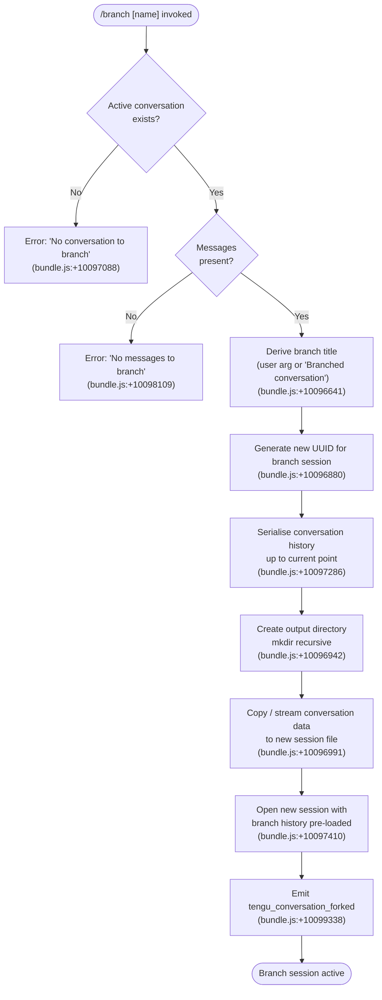

# `/branch`

> Analysis basis: CC v2.1.145 bundle.js (AST extraction + Claude interpretation)
> Minimum version: v2.1.145

---

## Overview

The `/branch` command (also aliased as `/fork`) creates a divergent copy of the current conversation at the point it is invoked. It serialises the existing conversation history up to that moment, spawns a fresh session pre-loaded with that history, and emits a `tengu_conversation_forked` telemetry event to record the fork. An optional name argument can be supplied to label the new branch.

---

## Registration

| Field | Value |
|---|---|
| type | `local-jsx` |
| name | `branch` |
| description | `Create a branch of the current conversation at this point` |
| argumentHint | `[name]` |
| aliases | `["fork"]` |
| module_id | `hx_` |
| load_inline | `true` |
| loc_byte | `11532798` |
| loc_byte_end | `11532992` |
| loc_line | `7069` |
| arbor_handler.name | `gD7` |
| arbor_handler.fqn | `claude-2.1.145::gD7` |
| arbor_handler.kind | `AsyncFunction` |
| arbor_handler.resolution_path | `module_id` |
| arbor_handler.n_hits | `0` |

Analysis basis: CC v2.1.145 bundle.js:+11532798

---

## Input Branching

The command has four distinct control-flow paths based on the state of the current conversation, making a Mermaid flowchart the appropriate representation.



---

## Behavioral Spec

### Entry point — `branchCommandHandler` (`gD7`)

The Arbor-resolved handler is `gD7` (AsyncFunction, reached via `module_id` → `hx_`). It acts as the top-level orchestrator for the branch operation.

```
async function branchCommandHandler(userArg, appContext):
    sessionTitle = userArg if userArg is non-empty
                   else "Branched conversation"        # bundle.js:+10096641

    conversation = lookupCurrentConversation(appContext)
    if conversation is null:
        raise Error("No conversation to branch")       # bundle.js:+10097088

    messages = conversation.messages                   # type "text"  bundle.js:+10096714
    if messages is empty:
        raise Error("No messages to branch")           # bundle.js:+10098109

    branchId  = crypto.randomUUID()                    # bundle.js:+10096880
    branchDir = resolveStorePath(branchId)

    await forkConversationData(conversation, branchDir)
    await launchForkSession(branchDir, sessionTitle)

    emit("tengu_conversation_forked")                  # bundle.js:+10099338
    return branchId
```

Analysis basis: CC v2.1.145 bundle.js:+10100123

---

### History preparation — `prepareBranchPipeline` (`TLq`)

`TLq` is called by `gD7` and coordinates the sub-steps needed to snapshot conversation state.

```
async function prepareBranchPipeline(conversation, branchDir, options):
    # Resolve working directory & worktree information
    worktreeInfo = detectWorktree(conversation.cwd)     # bundle.js:+10099034

    # Identify the correct up-to-date session entry
    sessionEntry = findCurrentSessionEntry(conversation) # bundle.js:+10099205

    # Compute a timestamp label for the branch
    isoTimestamp = new Date().toISOString()             # bundle.js:+10099428

    # Detect branch name ("fork" fallback literal)      # bundle.js:+10099859
    resolvedName = options.name ?? "fork"

    # Invoke the data-copy pipeline
    await copyConversationData(conversation, branchDir, options)

    # Log / emit the fork telemetry                     # bundle.js:+10099338
    logEvent("tengu_conversation_forked", { branchDir, resolvedName })
```

Analysis basis: CC v2.1.145 bundle.js:+10099034

---

### Data-copy pipeline — `copyConversationData` (`GLq`)

`GLq` performs the actual I/O: it reads the source conversation stream, writes a target file, and parses inter-message boundaries.

```
async function copyConversationData(sourcePath, destDir, opts):
    # Create destination directory (recursive, mode 0o448 if needed)
    await fs.mkdir(destDir, { recursive: true })        # bundle.js:+10096942

    # Open source as a read stream (encoding "utf8")    # bundle.js:+10097024
    readStream = fs.createReadStream(sourcePath, { encoding: "utf8" })

    # Wait for the "open" event before proceeding       # bundle.js:+10097050
    await once(readStream, "open")

    # Create a write stream for the branch copy
    writeStream = fs.createWriteStream(destDir + "/conversation.json")

    # Create readline interface for line-by-line parsing
    rl = readline.createInterface({ input: readStream })

    # Map each line through content-replacement pass    # bundle.js:+10097568
    processedLines = []
    for line in rl:
        transformed = applyContentReplacement(line)     # bundle.js:+10097286
        processedLines.push(transformed)

    # Write processed output; drain after 100 lines     # bundle.js:+10096808
    for chunk in processedLines:
        writeStream.write(chunk)
        if bufferedCount >= 100:
            await drainWriteStream(writeStream)         # bundle.js:+10097448

    # Pipe progress events (384-byte progress interval) # bundle.js:+10097183
    emitProgress(processedLines.length)                 # bundle.js:+10098005

    # Destroy streams and clean up on error
    on error:
        readStream.destroy()                            # bundle.js:+10097333
        fs.unlink(partialDestFile)                      # bundle.js:+10097351

    await stream.finished(writeStream)                  # bundle.js:+10098519
```

Analysis basis: CC v2.1.145 bundle.js:+10096880

---

### Message-boundary detection — `messageNameNormaliser` (`WLq`)

`WLq` is called inside `TLq` to sanitise the optional branch name provided by the user.

```
function normalise BranchName(rawInput, existingNames):
    # Find any conflicting name in the existing session list
    conflict = existingNames.find(n => n matches rawInput)  # bundle.js:+10096693

    # Append a numeric suffix to resolve conflicts
    safeName = rawInput.replace(conflictPattern, suffix)    # bundle.js:+10096771

    return safeName
```

Analysis basis: CC v2.1.145 bundle.js:+10096693

---

### Duplicate-detection tracker — `forkDeduplication` (`FD7`)

`FD7` prevents re-forking a conversation that has already been branched under the same name in the current run.

```
function trackFork(forkId, seenForks):
    parsed = parseInt(forkId)                           # bundle.js:+10098912
    if seenForks.has(parsed):
        return false   # already forked
    seenForks.add(parsed)                               # bundle.js:+10098906
    return true
```

Analysis basis: CC v2.1.145 bundle.js:+10098711

---

### Session launch — `launchBranchSession` (`TLq` → session infrastructure)

After data preparation, `TLq` calls into the general background-session machinery (identifier `w` / process-manager layer) to open a new interactive session loaded with the branch history.

```
async function launchBranchSession(branchDir, title):
    sessionConfig = buildSessionConfig(branchDir, title)
    newSession    = await sessionManager.spawn(sessionConfig) # bundle.js:+10097410

    # Register session entry in the roster
    addRosterEntry(newSession)                          # bundle.js:+10097693 / +10097816

    # Close any lingering write-side resources
    newSession.outputStream.close()                     # bundle.js:+10097745

    return newSession.id
```

Analysis basis: CC v2.1.145 bundle.js:+10097410

---

## State & Side Effects

| Item | Detail |
|---|---|
| Telemetry | `tengu_conversation_forked` (bundle.js:+10099338) — fired on successful fork |
| Telemetry (indirect, background session machinery) | `tengu_bg_spare_claim`, `tengu_bg_spare_spawn`, `tengu_bg_dispatch_sigkill_escalate`, `tengu_bg_sendclaim_failed`, `tengu_bg_attach`, `tengu_bg_attach_stall_ms`, `tengu_bg_attach_kick` |
| File system | Creates a new subdirectory under the session store path; writes a copy of the conversation file; temporary partial file cleaned up on error |
| UUID generation | `crypto.randomUUID()` assigns the new branch a unique session ID (bundle.js:+10096880) |
| Session roster | New branch entry is inserted into the session registry (bundle.js:+10097693) |
| New session launched | A fresh interactive session backed by the copied history is spawned (bundle.js:+10097410) |
| appState changes | Active session context switches to the newly created branch session after launch |
| Sound | <!-- TODO: not found in depth-2 traversal; needs --depth 4 --> |
| Hook registration | <!-- TODO: not found in depth-2 traversal; needs --depth 4 --> |

---

## Version History

| Version | Change |
|---|---|
| v2.1.145 | Initial analysis |

---

## Common Mistakes

1. **Invoking `/branch` before any messages exist** — the command errors with `"No messages to branch"` (bundle.js:+10098109). At least one exchange must be present in the current conversation.
2. **Invoking `/branch` outside an active conversation** — if no conversation context is loaded the command errors immediately with `"No conversation to branch"` (bundle.js:+10097088). Start a conversation first.
3. **Confusing `/branch` with `/fork`** — both aliases trigger identical behaviour; there is no functional difference between them.
4. **Expecting the original conversation to be affected** — the branch is a snapshot copy; changes in the branch do not propagate back to the parent conversation.
5. **Reusing an identical branch name** — the name-normaliser (`WLq`) appends a numeric suffix automatically to avoid conflicts (bundle.js:+10096693), so the resulting branch name may differ from what was typed.

---

## Appendix — Identifier Mapping

> For bundle debugging only. Identifiers change across versions.

| Identifier | Role |
|---|---|
| `gD7` | Top-level async handler for `/branch` (Arbor-resolved entry point) |
| `TLq` | Branch pipeline orchestrator; coordinates history prep, copy, and session launch |
| `GLq` | Conversation data-copy pipeline (stream I/O, readline, write-stream) |
| `WLq` | Branch-name normaliser; deduplicates against existing session names |
| `FD7` | Fork-deduplication tracker; prevents re-forking under the same ID |
| `Mx` | Session title / custom-label writer (emits `tengu_session_renamed`) |
| `pLH` | Agent-name setter (emits `tengu_agent_name_set`) |
| `wd` | Worktree detection and completion-list builder |
| `IkH` | Worktree list parser (emits `tengu_worktree_detection`) |
| `dSq` | Filesystem directory-scan helper used during worktree resolution |
| `lkH` | Buffer-packing helper for worktree data |
| `Rs_` | Background-session lifecycle manager (spawn, retire, roster management) |
| `Is_` | Background-session claim/connect helper (send-claim protocol) |
| `vs_` | Background spare-session spawner (emits `tengu_bg_spare_spawn`) |
| `w` | Process-manager core; maps session IDs to worker processes |
| `C` | Worker-process constructor / supervisor process factory |
| `R1K` | Realpath + stat resolver for worker binary |
| `J55` | Worker metadata builder |
| `D` | Background-session cleanup / GC routine |
| `NH` | Log-writer / ring-buffer logger |
| `u1` | Session-file stat & cache manager |
| `Dj` | Session active-state updater |
| `y5` | Session path resolver |
| `EaH` | Session timing / timestamp helper |
| `nLH` | Session path-join helper |
| `ek` | Session log-line splitter |
| `_U` | Session state reader |
| `W06` | Session directory initialiser (mkdir + write) |
| `Y` | Session roster / config-reload handler (emits `tengu_daemon_config_reload`) |
| `u` | Session retire-if-settled helper (emits `tengu_daemon_idle_exit`) |
| `d75` | Send-claim timeout handler |
| `Q75` | Claim-frame builder |
| `t75` | Background PTY attach / repaint manager |
| `s75` | Attach pre-flight (history read, path resolve) |
| `a75` | Scroll-offset calculator for repaint |
| `f1K` | Attach stall detector (emits `tengu_bg_attach_stall_ms`) |
| `P` | Socket message framer / read-side protocol handler |
| `Q5` | Socket end-handler |
| `DV6` | Socket write helper |
| `M` | MCP update + session-state reconciler |
| `ONH` | MCP server connection manager |
| `y_K` | MCP update applier |
| `nL5` | MCP client-set builder |
| `N` | Away-summary scheduler (emits `tengu_away_summary_generate`) |
| `D98` | Away-summary API caller |
| `Z_5` | Away-summary eligibility checker |
| `u1q` | Away-summary UUID generator |
| `g2` | Agent-loop / turn executor (hook dispatch, tool execution) |
| `Ll_` | Hook-filter / plugin-hook matcher |
| `Kl_` | Third-party hook filter |
| `T6H` | Hook environment-variable builder |
| `ec_` | HTTP-hook executor |
| `_Cq` | HTTP-hook response parser |
| `X08` | Command/shell-hook spawner |
| `Hl_` | MCP-tool hook executor |
| `P08` | Hook plain-text output parser |
| `hZ` | HTTP abort-controller with timeout |
| `DOH` | Config-change event dispatcher |
| `w4` | Config-change handler core |
| `Sy` | Effort-level resolver |
| `O2` | Model-compatibility checker |
| `HZ` | High-effort mode configurator |
| `b6` | Effort + queue-name resolver |
| `W` | Skills-change broadcaster |
| `VFH` | Skills active-check helper |
| `V6H` | Skills event emitter |
| `CrH` | Skills cache clearer |
| `o` | Voice-session controller |
| `s` | Voice toggle-silence handler |
| `e` | Voice focus-silence handler |
| `g` | MCP tool-use permission checker |
| `A6` | Tool-use filter |
| `YH` | Orphaned-permission tracker |
| `l` | PTY filter helper |
| `c` | Session inner handler |
| `In_` | Inner-session initialiser |
| `Z1` | String slice utility (indexOf + slice) |
| `ox` | Shell-escape helper (replace special chars) |
| `zF` | Config file read/write with timestamp |
| `cK6` | Config file atomic writer |
| `RH` | JSON.stringify wrapper |
| `GH` | String cast utility |
| `I` | Message-role formatter |
| `sZ` | Session-path builder |
| `s5` | Storage path join helper |
| `k6` | App-state accessor |
| `q_` | Storage root resolver |
| `IV` | State-store getter |
| `xH` | String coercion helper |
| `x_` | Error constructor helper |
| `O8` | ENOENT error checker |
| `A8` | Error code extractor |
| `u6` | JSON.parse wrapper |
| `bp` | <!-- TODO: not found in depth-2 traversal; needs --depth 4 --> |
| `ACq` | Agent-loop context builder |
| `KCq` | Context key helper |
| `T8H` | Turn-state helper |
| `YV` | Yield-value wrapper |
| `D08` | Dispatch-result builder |
| `yXH` | Feature-flag OK/bad reporter (emits `tengu_feature_ok` / `tengu_feature_bad`) |
| `b4H` | Effort + model metadata pair |
| `Hm` | Policy-settings accessor |
| `j4H` | <!-- TODO: not found in depth-2 traversal; needs --depth 4 --> |
| `XvH` | <!-- TODO: not found in depth-2 traversal; needs --depth 4 --> |
| `NY8` | <!-- TODO: not found in depth-2 traversal; needs --depth 4 --> |
| `eqH` | Skills event emitter helper |
| `ez8` | Skills event type |
| `xs1` | Skills subscriber |
| `tG` | PTY path joiner |
| `UV` | PTY path sub-joiner |
| `EO` | PTY path normaliser |
| `l$` | Realpath normaliser |
| `x5H` | File-line reader (open + readline) |
| `Tz` | Background-service label resolver |
| `y$H` | Background-service Z6 caller |
| `Z6` | Memory/feature-flag checker (emits `tengu_amber_anchor`) |
| `bT6` | macOS memory helper (emits `tengu_bg_low_mem_mb`) |
| `g8` | Timer/queue helper |
| `G` | MCP client-presence checker |
| `F` | Conversation history slice helper |
| `ap` | Binary protocol frame builder |
| `OM` | <!-- TODO: not found in depth-2 traversal; needs --depth 4 --> |
| `C4H` | Log file appender (emits `tengu_session_renamed`) |
| `U6` | Log path resolver |
| `jL` | Log directory helper |
| `h9` | Worker-registry registrar |
| `t3` | Session-type resolver |
| `Lrq` | <!-- TODO: not found in depth-2 traversal; needs --depth 4 --> |
| `R38` | UI-state getter |
| `CH` | Daemon-stop handler (emits `tengu_daemon_control`) |
| `hH` | Daemon-stop-failed handler |
| `z` | Daemon write-stream |
| `oN` | <!-- TODO: not found in depth-2 traversal; needs --depth 4 --> |
| `kx` | <!-- TODO: not found in depth-2 traversal; needs --depth 4 --> |
| `k8` | Background-session on-event handler |
| `J` | Session-kill dispatcher |
| `j` | Worker-kill iterator |
| `y` | Worker write + kill helper |
| `p` | Write-with-backoff helper |
| `Z` | Interval / tick helper |
| `g6H` | <!-- TODO: not found in depth-2 traversal; needs --depth 4 --> |
| `X` | Repaint coordinator |
| `kZ8` | <!-- TODO: not found in depth-2 traversal; needs --depth 4 --> |
| `S` | Dispose-on-settle helper |