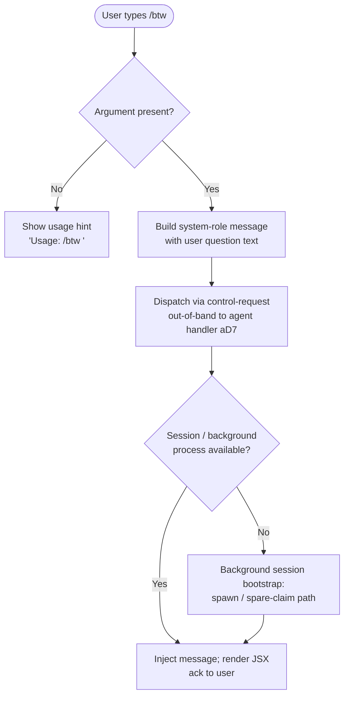

# `/btw`

> Analysis basis: CC v2.1.145 bundle.js (AST extraction + Claude interpretation)
> Minimum version: v2.1.145

---

## Overview

`/btw` ("by the way") lets a user inject a quick side question or remark as a system-level message without displacing the current main-conversation turn. Because the registration marks it as `immediate: true` and routes it through `thinClientDispatch: "control-request"`, the message is dispatched to the agent out-of-band, bypassing normal user-turn queuing. The rendered output is produced via a JSX element, classifying it as a `local-jsx` command.

---

## Registration

| Field | Value |
|---|---|
| type | `local-jsx` |
| name | `btw` |
| description | Ask a quick side question without interrupting the main conversation |
| argumentHint | `<question>` |
| immediate | `true` |
| thinClientDispatch | `control-request` |
| module_id | `VLq` |
| load_inline | `true` |
| loc_byte | `10105918` |
| loc_byte_end | `10106157` |
| loc_line | `5571` |
| arbor_handler.name | `aD7` |
| arbor_handler.fqn | `claude-2.1.145::aD7` |
| arbor_handler.kind | `AsyncFunction` |
| arbor_handler.resolution_path | `module_id` |
| arbor_handler.n_hits | `0` |

Analysis basis: CC v2.1.145 bundle.js:+10105918

---

## Input Branching

Three distinct paths exist depending on whether the user supplied an argument and how the downstream session-dispatch layer handles the result:



Analysis basis: CC v2.1.145 bundle.js:+10105514 (usage string), +10105555 (system role literal), +10105624 (JSX render)

---

## Behavioral Spec

### 1. Handler Entry — `asyncBtwHandler` (`aD7`)

```
async function asyncBtwHandler(commandInput, context):
    if commandInput.argument is empty:
        display "Usage: /btw <your question>"   // bundle.js:+10105516
        return

    message = buildSystemMessage(commandInput.argument)
    // role = "system"                           // bundle.js:+10105555

    sessionHandle = await acquireOrBootstrapSession(context)
    // calls delayWithJitter (H) for retry back-off
    // calls configReadWrite (H8) to load/persist session state

    result = renderBtwElement(message, sessionHandle)
    // HL.createElement call                     // bundle.js:+10105624
    return result
```

Analysis basis: CC v2.1.145 bundle.js:+10105514

---

### 2. Jitter Delay — `delayWithJitter` (`H`)

Called from `asyncBtwHandler` before retrying session acquisition.

```
function delayWithJitter(baseMs):
    jitter = Math.random() * 2 - 1   // range [-1, +1]  // bundle.js:+12704956, +12704972
    await setTimeout(baseMs + jitter * baseMs)
```

Analysis basis: CC v2.1.145 bundle.js:+12704958, +12704995

---

### 3. Config Read/Write — `configReadWrite` (`H8`)

Invoked to read and possibly persist session/configuration state before the message is dispatched.

```
function configReadWrite(context):
    baseline = loadBaseline(context)          // B0
    currentState = readCurrentState()         // H (state reader variant)
    permissions = resolvePermissions()        // UpH
    entryMap = buildEntryMap()                // Xv9 — uses Object.entries
    timestamps = recordTimestamp()            // BpH — uses Date.now
    messageContext = buildMessageContext()    // I
    fileState = readFileState()               // R$H
    extraData = loadExtraData()               // n56
    persistedData = persistData()             // d
    fallbackWarning = checkAuthLoss()
    // logs: "saveGlobalConfig fallback: re-read config is missing auth
    //        that cache has; refusing to write. See GH #3117."
    //                                        // bundle.js:+3164504
    symlinkHandler = resolveSymlinks()        // _q_
    return composedConfig
```

Analysis basis: CC v2.1.145 bundle.js:+10105578, +3164301

---

### 4. Config File I/O — `configFileIO` (`Aq_`)

Manages on-disk config access with file locking, backup rotation, and stale-write protection.

```
function configFileIO(path, options):
    dir = DY.dirname(path)
    ensureDir(dir)                    // U6, L.mkdirSync
    L.mkdirSync(dir, {recursive:true})

    lockStart = Date.now()
    acquireLock()
    if lockDuration > threshold:
        emit telemetry("tengu_config_lock_contention")
        // "Lock acquisition took longer than expected -
        //  another Claude instance may be running"   // bundle.js:+3167206

    if staleWriteDetected:
        emit telemetry("tengu_config_stale_write")
        // "saveConfigWithLock: re-read config is missing auth that cache has;
        //  refusing to write to avoid wiping ~/.claude.json. See GH #3117."
        //                                             // bundle.js:+3167622

    if authLossDetected:
        emit telemetry("tengu_config_auth_loss_prevented")  // bundle.js:+3167774

    rawBytes = q.readFileSync(path, "utf-8")          // bundle.js:+3169295, +3169322
    parsed = jsonParse(rawBytes)                       // u6 → JSON.parse

    if parseError:
        emit telemetry("tengu_config_parse_error")    // bundle.js:+3169876

    // Backup rotation (up to 5 backups)              // bundle.js:+3168225
    backupDir = DY.join(configDir, "backups")         // bundle.js:+3168807
    rotateBackups(backupDir)

    // Atomic write via temp file + rename
    tmpPath = buildTempPath()
    q.copyFileSync(src, tmpPath)                      // bundle.js:+3170384
    timestamp = Date.now()                            // bundle.js:+3170366

    if ENOENT error:                                  // bundle.js:+3167561
        handleMissingFile()
    if EEXIST error:                                  // bundle.js:+3170090
        handleExistingLock()

    return parsedConfig
```

Analysis basis: CC v2.1.145 bundle.js:+3164297, +3167295

---

### 5. Message Context Builder — `buildMessageContext` (`I`)

Constructs the structured message object that is sent to the agent.

```
function buildMessageContext(role, text, options):
    if options.debug:                          // "debug"  // bundle.js:+201601
        logDebug(JSON.stringify(context))      // RH → JSON.stringify

    content = formatContent(text)             // X86, y$K
    method = role.toUpperCase()               // _.toUpperCase  // bundle.js:+201727
    body = buildBody(content, method)         // B4
    trimmed = body.trim()                     // H.trim  // bundle.js:+201750

    filePart = resolveFilePart()              // fN
    requestShape = buildRequestShape()        // RSH → x_A
    contextBlock = buildContextBlock()        // R$K
    return {role, body: trimmed, filePart, contextBlock}
```

Analysis basis: CC v2.1.145 bundle.js:+201625

---

### 6. Background Session Dispatch — `bgSessionDispatch` (`w`)

When no foreground session is available, the command falls through to the background session layer.

```
function bgSessionDispatch(sessionMap, options):
    handle = sessionMap.get(sessionId)         // A.get
    if handle.shouldKill:
        handle.process.kill("SIGKILL")         // bundle.js:+14655378
        await setTimeout(killTimeoutMs)        // bundle.js:+14655389
        emit telemetry("tengu_bg_dispatch_sigkill_escalate")  // bundle.js:+14655330

    memFree = FZ8.freemem()
    memUsedMB = Math.round(memFree / 1024)    // bundle.js:+14655803
    if memUsedMB < lowMemThreshold:
        emit telemetry("tengu_bg_dispatch_low_mem")           // bundle.js:+14655909

    // Spare session management
    spareSession = findSpare(sessionMap)       // "spare"  // bundle.js:+14656044
    if spareSession:
        emit telemetry("tengu_bg_spare_enable")               // bundle.js:+14656548
        claimed = claimSpare(spareSession)
        if claimed:
            emit telemetry("tengu_bg_spare_claim")            // bundle.js:+14656669
        else:
            emit telemetry("tengu_bg_spare_claim_fail")       // bundle.js:+14656932

    // Retire settled sessions
    for session in sessionMap.values():
        session.retireIfSettled()

    newSession = TU.spawn(execArgs)            // "exec"  // bundle.js:+14656158
    sessionMap.set(sessionId, newSession)      // A.set
    return newSession
```

Analysis basis: CC v2.1.145 bundle.js:+14655212, +14655640

---

### 7. Atomic File Write — `atomicSymlinkWrite` (`y96`)

Used during config persistence within the `configFileIO` path.

```
function atomicSymlinkWrite(targetPath, data, options):
    if lstat(targetPath).isSymbolicLink():
        linkTarget = q.readlinkSync(targetPath)
        resolved = M5.isAbsolute(linkTarget)
                   ? linkTarget
                   : M5.resolve(M5.dirname(targetPath), linkTarget)

    randomSuffix = Om8.randomBytes(6).toString("hex")   // bundle.js:+1001875, +1001891, +1001903
    tmpFile = resolved + "." + randomSuffix

    fd = Ff.openSync(tmpFile, flags)
    Ff.writeFileSync(fd, data)
    if originalPermissions:
        Ff.fchmodSync(fd, originalMode)
        // "Applied original permissions to temp file"  // bundle.js:+1002390
    Ff.fsyncSync(fd)
    Ff.closeSync(fd)

    q.renameSync(tmpFile, resolved)
    // On error ELOOP or ENOTDIR:              // bundle.js:+1001536, +1001549
    //   fallback to direct write
    // On unlink needed:
    //   q.unlinkSync(tmpFile)
```

Analysis basis: CC v2.1.145 bundle.js:+1001163

---

## State & Side Effects

| Item | Detail |
|---|---|
| Telemetry: `tengu_config_lock_contention` | Fired when config file lock acquisition is slower than expected, indicating a concurrent Claude instance (bundle.js:+3167295) |
| Telemetry: `tengu_config_stale_write` | Fired when a save is refused because auth data would be overwritten (bundle.js:+3167431) |
| Telemetry: `tengu_config_parse_error` | Fired when the config file fails JSON parsing (bundle.js:+3169876) |
| Telemetry: `tengu_config_auth_loss_prevented` | Fired when auth-loss guard blocks a write (bundle.js:+3167774) |
| Telemetry: `tengu_bg_dispatch_sigkill_escalate` | Fired when a background session process is force-killed (bundle.js:+14655330) |
| Telemetry: `tengu_bg_dispatch_low_mem` | Fired when free memory falls below threshold during dispatch (bundle.js:+14655909) |
| Telemetry: `tengu_bg_spare_enable` | Fired when a spare background session is made available (bundle.js:+14656548) |
| Telemetry: `tengu_bg_spare_claim` | Fired on successful spare session claim (bundle.js:+14656669) |
| Telemetry: `tengu_bg_spare_claim_fail` | Fired when spare session claim fails (bundle.js:+14656932) |
| Dispatch mode | `thinClientDispatch: "control-request"` — message bypasses normal user-turn queue |
| Message role | Injected as `"system"` role (bundle.js:+10105555) |
| Config side effects | Config may be read and written with lock; up to 5 backups retained in `backups/` subdirectory (bundle.js:+3168807, +3168225) |
| Background session | May spawn a new background process via `TU.spawn` if no session is available (bundle.js:+14656991) |
| Session map | `sessionMap.set` / `sessionMap.get` used to track background sessions (bundle.js:+14655212, +14656631) |
| Atomic writes | Config writes go through a temp-file + rename cycle with optional fchmod and fsync (bundle.js:+1002311, +1002435, +1002563) |
| JSX rendering | Final output is a JSX element via `HL.createElement` (bundle.js:+10105624) |
| Sound | <!-- TODO: not found in depth-2 traversal; needs --depth 4 --> |

---

## Version History

| Version | Change |
|---|---|
| v2.1.145 | Initial analysis |

---

## Common Mistakes

1. **Omitting the argument**: `/btw` with no text displays only the usage hint (`Usage: /btw <your question>`) and sends nothing to the agent. Always include the question text.
2. **Expecting a user-turn reply**: Because `immediate: true` and `thinClientDispatch: "control-request"` are set, the injected message is handled out-of-band. It does not create a user turn and may not receive a visible reply in the normal conversation thread.
3. **Assuming synchronous config access**: The config layer uses file locking and may emit `tengu_config_lock_contention` if another Claude instance holds the lock. Commands relying on fresh config state immediately after `/btw` may observe transient inconsistencies.
4. **Conflating `/btw` with a normal message**: The message role is `"system"`, not `"user"`. This affects how the model treats the injected content contextually.
5. **Expecting background availability**: If no background session exists, the command triggers a full background session bootstrap (spare-claim or spawn), which adds latency before the question is processed.

---

## Appendix — Identifier Mapping

> For bundle debugging only. Identifiers change across versions.

| Identifier | Role |
|---|---|
| `aD7` | Main async handler for `/btw` (`asyncBtwHandler`); AsyncFunction resolved via `module_id` path |
| `H` | Jitter-delay / retry helper (`delayWithJitter`); uses `Math.random` + `setTimeout` |
| `H8` | Config read/write orchestrator (`configReadWrite`) |
| `Aq_` | Config file I/O with locking and backup rotation (`configFileIO`) |
| `_` | Filesystem abstraction layer (read/stat/readdirString) |
| `U6` | Path existence / directory creation utility |
| `L` | Locked file handle / filesystem wrapper used in config writes |
| `q` | Secondary filesystem module (readFileSync, statSync, mkdirSync, etc.) |
| `f` | File handle with `finally` cleanup (open/close lifecycle) |
| `B69` | Config object builder (`buildConfigObject`); calls `Oa8`, `Object.assign` |
| `Oa8` | Inner config factory used by `B69` |
| `I` | Message context builder (`buildMessageContext`) |
| `y$K` | Content formatter called by `buildMessageContext` |
| `RH` | JSON serialization helper; wraps `JSON.stringify` |
| `B4` | Request body builder; handles replace/slice/lastIndexOf operations |
| `RSH` | Request shape helper (`buildRequestShape`); calls `x_A` |
| `R$K` | Context block builder (`buildContextBlock`); handles file path, buffer byte-length, temp file logic |
| `d` | Data persistence / write helper |
| `A8` | Generic async utility / error wrapper |
| `R$H` | File-state reader (`readFileState`); handles parse, symlink, backup, copy |
| `u6` | JSON parse wrapper; calls `JSON.parse` |
| `hR` | String prefix stripper; uses `startsWith` + `slice` |
| `Wv9` | Backup directory walker (`walkBackupDir`); uses `readdirStringSync`, `basename`, `join` |
| `NH` | Error notification / log-error aggregator; calls `gc.logError`, pushes to `GCH` |
| `qq_` | Path join utility for backup paths; calls `DY.join` + `l8` |
| `w` | Background session dispatcher (`bgSessionDispatch`) |
| `n56` | Extra-data loader helper |
| `A` | Lowercase-normalizing map wrapper; calls `f.toLowerCase` |
| `Z` | String with `startsWith` check (likely file-path filter) |
| `X` | SDK/MCP connection orchestrator; uses `Promise.all`, `kZ8`, `ck`, `Rp` |
| `kZ8` | Connection-type selector (http/sse/dynamic literals) |
| `x_` | Error constructor helper; wraps `Error` + `String` |
| `V` | Slice-able array/buffer in config rotation |
| `y96` | Atomic symlink-aware file writer (`atomicSymlinkWrite`) |
| `O` | Stat result wrapper; `isSymbolicLink` check |
| `O8` | Async error boundary helper; calls `A8` |
| `UpH` | Permission resolver used in `configReadWrite` |
| `Xv9` | Entry-map builder; uses `Object.entries` |
| `BpH` | Timestamp recorder; uses `Date.now` |
| `_q_` | Symlink-resolve + write helper (`resolveSymlinks`); calls `y96`, `DY.dirname`, `U6`, `DN`, `RH` |

---

Note: index built via Arbor fallback; some signals (telemetry, literals) may be missing — see arbor-fallback.js.