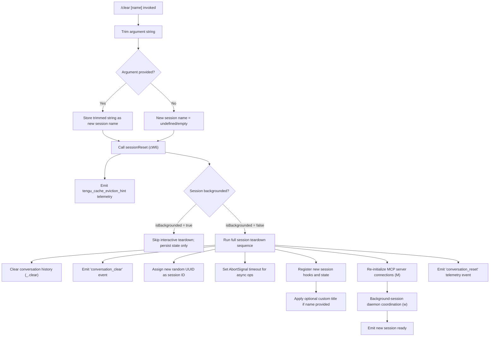

# `/clear`

> Analysis basis: CC v2.1.145 bundle.js (AST extraction + Claude interpretation)
> Minimum version: v2.1.145

---

## Overview

`/clear` (also available as `/reset` and `/new`) starts a fresh conversation session with an empty context window. The previous session is persisted to disk and remains resumable via `/resume`. An optional `[name]` argument allows the new session to be given a custom title at creation time.

---

## Registration

| Field | Value |
|---|---|
| type | `local` |
| name | `clear` |
| description | `Start a new session with empty context; previous session stays on disk (resumable with /resume)` |
| argumentHint | `[name]` |
| aliases | `reset`, `new` |
| supportsNonInteractive | `true` |
| thinClientDispatch | `post-text` |
| module_id | `Y4q` |
| load_inline | `true` |
| loc_byte | `10145497` |
| loc_byte_end | `10145788` |
| loc_line | `5591` |
| arbor_handler.name | `Rw7` |
| arbor_handler.fqn | `claude-2.1.145::Rw7` |
| arbor_handler.kind | `AsyncFunction` |
| arbor_handler.resolution_path | `module_id` |
| arbor_handler.n_hits | `0` |

Analysis basis: CC v2.1.145 bundle.js:+10145497

---

## Input Branching

The command has 3+ distinct branches determined by argument presence and session backgrounding state.



Analysis basis: CC v2.1.145 bundle.js:+10145323 (argument trim), +10143389 (session reset entry), +10143528 (conversation_clear literal), +10143596 (isBackgrounded check), +10144722 (conversation_reset literal)

---

## Behavioral Spec

### Handler Entry Point — `sessionClearHandler` (Rw7)

```
async function sessionClearHandler(args, context):
    trimmedName = args.trim()                      // loc +10145323
    result = await sessionReset(trimmedName, context)  // loc +10145359
    return result
```

The handler is an `AsyncFunction` resolved via the `module_id` → `Y4q` path by Arbor. It receives the raw argument string, trims it, and delegates entirely to the internal session-reset orchestrator.

Analysis basis: CC v2.1.145 bundle.js:+10145323, +10145359

---

### Session Reset Orchestrator — `sessionReset` (cW6)

```
async function sessionReset(newName, context):
    // 1. Validate context token budget
    tokenBudget = parseContextWindowLimit(context)     // nW6 loc +10143389

    // 2. Emit telemetry
    emit("tengu_cache_eviction_hint")                  // loc +10143493

    // 3. Retrieve backgrounded flag
    backgrounded = context["isBackgrounded"]           // loc +10143596

    // 4. Gather current MCP server state
    mcpServers = Object.values(serverMap)              // loc +10143659

    // 5. Orchestrate full or lightweight teardown
    if not backgrounded:
        await fullTeardownAndReinit(newName, context)
    else:
        persistStateOnly()

    // 6. Assign new conversation UUID
    newSessionId = crypto.randomUUID()                 // loc +10144761

    // 7. Register updated session notification (Kv8)
    emitSessionReset(newSessionId)                     // loc +10144779

    // 8. Re-run hook loader for new session (t3, lW6)
    reloadHooks()

    // 9. Apply custom session name if supplied
    if newName != "":
        setSessionTitle(newName)                       // via Mx / C4H

    // 10. Persist session state and return
    persistConversationReset()                         // loc +10144722
```

Analysis basis: CC v2.1.145 bundle.js:+10143389, +10143449, +10143528, +10143596, +10143659, +10144761, +10144779

---

### Context Window Limit Parsing — `parseContextWindowLimit` (nW6)

```
function parseContextWindowLimit(rawValue):
    parsed = parseInt(rawValue, 10)                  // loc +12297020, +12297031
    if not Number.isFinite(parsed):
        return defaultLimit                          // via wY / Z8
    clamped = Math.max(MIN, Math.min(MAX, parsed))   // loc +12297238, +12297251
    scaledMs = clamped * 1000                        // loc +12297207
    return clamped
```

Parses a numeric context-window token value; clamps to safe bounds using `Math.max`/`Math.min`.

Analysis basis: CC v2.1.145 bundle.js:+12297020, +12297031, +12297207, +12297238, +12297251

---

### Full Session Teardown — `fullSessionTeardown` (mNH → g2)

```
async function fullSessionTeardown(newName, context):
    // Emit SessionEnd hook event (literal "SessionEnd")
    emitHookEvent("SessionEnd")                     // loc +12287745

    // Run main agent loop teardown (g2)
    await agentLoopTeardown(context)                // loc +12287718 → g2

    // Clear conversation history store
    history.clear()

    // Re-initialize tool registry (k6)
    reloadToolRegistry()                            // loc +12287973

    // Reload plugin state (uP6)
    reloadPluginState()                             // loc +12287978
```

The `"SessionEnd"` string literal at +12287745 confirms the hook event name fired when the old session context is closed.

Analysis basis: CC v2.1.145 bundle.js:+12287718, +12287745, +12287776, +12287973, +12287978

---

### Agent Loop / New-Session Bootstrap — `agentLoopInit` (g2)

This is the largest sub-function in the call graph. Key responsibilities:

```
async function agentLoopInit(context, sessionId, name):
    // Build initial message representation
    headerText = buildHeaderText(context)            // xH, Hm
    hookConfig = loadHookConfiguration()             // I, b4H

    // Compute tool list
    tools = buildToolList(context)                   // Ll_, Kl_

    // Filter active tools
    activeTools = tools.filter(isEnabled)            // O.filter

    // Resolve abort/timeout handle
    abortHandle = newAbortHandle()                   // hZ

    // Generate fresh session UUID
    sessionId = crypto.randomUUID()                  // ikH.randomUUID loc +12336007

    // Register session callback
    registerCallback(sessionId)                      // J.callback loc +12336032

    // Run pre-session hooks
    await runHooks("SessionStart", context)           // X08

    // Start background I/O (XvH)
    startBackgroundIO()

    // Await all async init tasks
    await Promise.all([...])                         // loc +12340327

    // Return bootstrapped session handle
    return sessionHandle
```

Analysis basis: CC v2.1.145 bundle.js:+12335220, +12335309, +12335499, +12335512, +12335579, +12335977, +12336007, +12336032, +12340327

---

### Session UUID Emission — `emitSessionReset` (Kv8)

```
function emitSessionReset(uuid):
    newId = crypto.randomUUID()                     // loc +39851
    eventEmitter.emit("conversation_reset", newId)  // av6.emit loc +39945
```

Broadcasts the reset event with a freshly generated UUID so any attached listeners (UI, telemetry, background daemon) can associate subsequent messages with the new session.

Analysis basis: CC v2.1.145 bundle.js:+39851, +39945, +10144722

---

### Working Directory Validation — `validateWorkingDirectory` (WD)

When `/clear` transitions to the new session, the working directory is validated:

```
function validateWorkingDirectory(rawPath):
    if not path.isAbsolute(rawPath):
        rawPath = path.resolve(rawPath)             // loc +7853449
    stat = checkPathExists(rawPath)                 // O8 loc +7853519
    if stat is error:
        throw Error("invalid cwd")                  // loc +7853531
    normalized = normalizePath(rawPath)             // _m8 loc +7853575
    emit("tengu_shell_set_cwd")                     // loc (telemetry table)
    return normalized
```

Analysis basis: CC v2.1.145 bundle.js:+7853429, +7853449, +7853519, +7853531, +7853575

---

### MCP Server Reconnection — `mcpServerManager` (M → nL5 → ONH)

After clearing, MCP connections are re-evaluated:

```
async function reconnectMcpServers(serverMap):
    entries = Object.entries(serverMap)
    for each [name, config] in entries:
        clientState = getClientState(name)           // nL5 loc +14384164
        if clientState needs reconnect:
            await connectServer(config)              // ONH loc +14384511
            applyMcpUpdate(config)                   // y_K loc +14384520
    return Object.fromEntries(results)               // loc +14384529
```

Analysis basis: CC v2.1.145 bundle.js:+14383455, +14383465, +14383474, +14384117, +14384511, +14384520, +14384529

---

### Hook Flushing — `flushPendingHooks` (hz → A08)

Pending hooks from the old session are flushed before the new context is established:

```
function flushPendingHooks():
    pendingSet.add(flushPromise)                    // LRq.add loc +12254642
    flushPromise.finally(() => pendingSet.delete()) // loc +12254653, +12254667
    cache.get(hookKey).flush()                      // loc +12256070, +12256092
    cache.delete(hookKey)                           // loc +12256102
```

Analysis basis: CC v2.1.145 bundle.js:+12254642, +12254653, +12256049, +12256070, +12256092, +12256102

---

## State & Side Effects

| Item | Detail |
|---|---|
| Telemetry — `tengu_cache_eviction_hint` | Fired at session reset entry (bundle.js:+10143493) |
| Telemetry — `tengu_run_hook` | Fired during hook dispatch for the new session (bundle.js:+12335641) |
| Telemetry — `tengu_repl_hook_finished` | Fired after REPL hook completes (bundle.js:+12319738) |
| Telemetry — `tengu_feature_ok` / `tengu_feature_bad` | Fired on feature flag evaluation outcome (bundle.js:+955923, +955981) |
| Telemetry — `tengu_shell_set_cwd` | Fired when working directory is validated/set (bundle.js:+7853588) |
| Telemetry — `tengu_session_renamed` | Fired when a custom session name is applied (bundle.js:+12201593) |
| Telemetry — `tengu_hook_plugin_metrics` | Fired during plugin hook metric collection (bundle.js:+12314330) |
| Telemetry — `tengu_hook_plugin_injected` | Fired when a plugin hook is injected (bundle.js:+12333987) |
| Hook event — `SessionEnd` | Dispatched to hooks for the closing session (bundle.js:+12287745) |
| Hook event — `SessionStart` | Dispatched to hooks for the new session (bundle.js:+12315404) |
| Event — `conversation_clear` | Internal event literal broadcast on clear (bundle.js:+10143528) |
| Event — `conversation_reset` | Internal reset event with new UUID (bundle.js:+10144722) |
| Session UUID | Replaced with a new `crypto.randomUUID()` value (bundle.js:+10144761) |
| Conversation history | Cleared in-memory via `_.clear()` (bundle.js:+10143809) |
| MCP server connections | Re-evaluated and reconnected as needed (bundle.js:+14383455) |
| Working directory | Re-validated and normalized (bundle.js:+7853429) |
| Plugin hooks | Flushed then reloaded for the new session (bundle.js:+10142383) |
| appState — `isBackgrounded` | Read to choose between full teardown and lightweight persist (bundle.js:+10143596) |
| Disk persistence | Old session written to disk; remains resumable via `/resume` (registration description) |
| Sound | <!-- TODO: not found in depth-2 traversal; needs --depth 4 --> |

---

## Version History

| Version | Change |
|---|---|
| v2.1.145 | Initial analysis |

---

## Common Mistakes

1. **Confusing `/clear` with a destructive wipe.** The old session is persisted to disk and is always recoverable with `/resume`. No conversation history is permanently deleted.
2. **Omitting the name argument when a custom title is desired.** The `[name]` argument must be passed inline (e.g. `/clear my-feature-work`); there is no subsequent prompt for a name.
3. **Using `/clear` inside a backgrounded session expecting immediate UI teardown.** When `isBackgrounded` is `true` the command takes the lightweight path — interactive teardown steps are skipped (bundle.js:+10143596).
4. **Assuming MCP tools are instantly available after clearing.** MCP server reconnection is asynchronous; tools may not be ready for the first prompt sent immediately after `/clear`.
5. **Treating `/reset` and `/new` as separate commands.** Both are aliases registered to the same handler (`Rw7`) with identical behavior.

---

## Appendix — Identifier Mapping

> For bundle debugging only. Identifiers change across versions.

| Identifier | Role |
|---|---|
| `Rw7` | Handler entry point (`sessionClearHandler`) — AsyncFunction resolved via module_id Y4q |
| `cW6` | Session reset orchestrator — coordinates full teardown and new-session bootstrap |
| `nW6` | Context-window token-budget parser — parseInt + clamp logic |
| `wY` | Default context-limit resolver |
| `Z8` | Policy-settings reader |
| `cx` | Internal state accessor (IV-backed) |
| `_m` | Token-count helper via `Xq_` |
| `Xq_` | Token computation sub-helper (`dv9`) |
| `mNH` | Session-end coordinator — emits `SessionEnd`, delegates to agent loop teardown |
| `w4` | Tool registry builder |
| `k6` | Core state store accessor |
| `Sy` | State synchronizer (IV-backed) |
| `O2` | Model-capability checker — references claude-3/opus/sonnet/haiku model strings |
| `HZ` | Effort/budget configurator |
| `sZ` | Summary formatter joining tool results |
| `b6` | Action-queue helper |
| `g2` | Agent loop initializer / new-session bootstrap |
| `xH` | String-coercion utility |
| `Hm` | Header-message builder (Z8-backed) |
| `I` | Logging/debug utility — `debug`, `verbose` levels |
| `b4H` | Hook configuration loader |
| `Ll_` | Tool-list builder — maps hook types (PreToolUse, PostToolUse, …) |
| `ACq` | Active-context collector |
| `Kl_` | Third-party tool filter |
| `KCq` | Key-context query builder |
| `d` | Application-state snapshot accessor |
| `RH` | JSON-stringify wrapper |
| `NH` | Notification/error dispatcher — `gc.logError` |
| `CH` | Context-state reader |
| `yXH` | Feature-flag reader (`FR6`) |
| `hZ` | Abort-handle / timeout manager |
| `J` | Callback registry |
| `T8H` | Task-state handler |
| `YV` | Yield/value helper |
| `D08` | Dispatch sub-orchestrator |
| `Hl_` | MCP-tool result handler |
| `P08` | Hook output parser — plain text vs JSON |
| `T6H` | Tool-input transformer (`Object.fromEntries`) |
| `ec_` | HTTP hook executor (`s8.post`) |
| `_Cq` | HTTP-body parser — empty-body handling |
| `j4H` | Job/task handle |
| `X08` | Subprocess hook spawner (`w08.spawn`) |
| `XvH` | Background I/O starter |
| `hH` | App-state writer |
| `uP6` | Plugin-state reloader |
| `dH6` | Daemon health checker |
| `M` | MCP server manager (top-level) |
| `ONH` | MCP server connector — handles stdio/sse/ws transport types |
| `Qe` | MCP client factory |
| `rv` | MCP reconnect helper |
| `K` | Session-roster map |
| `e8` | String underscore helper |
| `i26` | MCP capability enumerator |
| `pf7` | MCP timestamp recorder |
| `J18` | MCP key mapper |
| `j18` | MCP base-key resolver |
| `_8` | MCP debug logger (`gc.logMCPDebug`) |
| `$R_` | OAuth flow initiator |
| `OR_` | OAuth callback handler |
| `A_q` | Auth-state poller |
| `fR_` | Auth-flow teardown |
| `FJ_` | Auth-tool capability filter |
| `j` | Process-kill set |
| `y` | Write-stream wrapper |
| `O7` | MCP error logger (`gc.logMCPError`) |
| `GH` | String coercion utility |
| `t8q` | MCP metric aggregator |
| `r26` | MCP retry-count parser |
| `KC_` | MCP keepalive parser |
| `y_K` | MCP-update applier (`applyMcpUpdate`) |
| `Aw8` | MCP-ack writer |
| `A` | MCP cleanup coordinator |
| `vI` | MCP client-pool cleaner |
| `L` | Session-roster list manager |
| `q` | File-cleanup set |
| `f` | Connection finalizer |
| `$` | Dispatch-queue helper (`dvq`) |
| `dvq` | Session-dispatch record builder |
| `nL5` | Remote-server retry manager |
| `_` | Sub-helper string/object utility |
| `X18` | Auth-state checker (`D04`, `w04`) |
| `g8` | Retry timer manager |
| `VoH` | RH-backed validation helper |
| `lJ` | Session-list accessor |
| `w` | Daemon background-worker manager |
| `C` | Worker-process controller (`R1K`, `NH`, `J55`) |
| `R1K` | Realpath/stat resolver |
| `J55` | Worker bootstrap helper |
| `z` | Stream writer |
| `bT6` | Memory-threshold helper |
| `Z6` | Memory-pressure monitor |
| `u` | Worker idle-timeout manager |
| `S` | Worker sentinel |
| `x` | Worker timer ref |
| `Is_` | Worker claim sender (`TU.claim`) |
| `ul_` | Session-file writer (`E8H.writeFile`) |
| `d75` | Claim timeout handler |
| `Q75` | Claim-frame builder (`TU.buildClaimFrame`) |
| `A8` | Error-propagation helper |
| `ap` | Binary frame encoder (`Buffer.allocUnsafe`) |
| `Rs_` | Session-roster entry manager |
| `JK` | Path join helper |
| `u1` | File-state reader (`aP.readFile`) |
| `Dj` | Active-state transition helper |
| `y5` | Roster-path helper |
| `EaH` | Session-start watcher |
| `nLH` | Session-log path resolver |
| `ek` | Log-path splitter |
| `_U` | Variant path resolver |
| `W06` | Directory creator helper |
| `Y` | Config-reload manager |
| `D` | Daemon lifecycle controller |
| `vs_` | Spare-session spawner (`Bun.spawn`) |
| `Dw` | Dispatch-wait helper |
| `ex_` | Full-clear reset cascade (clears many caches) |
| `rx_` | Reset pre-check |
| `V6H` | View-state resetter |
| `eqH` | Equation/state cache |
| `ez8` | Extra-state clearer |
| `xs1` | Extra-store-1 cleaner |
| `NY8` | Extra-store-2 cleaner |
| `xo9` | Conversation-map clearer (`xm.clear`) |
| `ZEH` | Session-file writer for reset |
| `$66` | Feature-flag reset helper |
| `Zr` | Full post-clear re-initializer |
| `HqH` | Subagent-main re-initializer |
| `tY8` | Subagent-exit handler |
| `a36` | Session-start trigger |
| `Fn` | Compact-state reset |
| `J6H` | Agent-init pair (`iI8`, `AN8`) |
| `AD8` | Judgment-cache clearer (`j9q.clear`) |
| `NP1` | Dual-cache clearer (`AD6`, `QX_`) |
| `lh1` | History-list initializer |
| `MDH` | Message-display resetter |
| `jP` | Output-token tracker resetter |
| `kS_` | Key-state resetter |
| `CrH` | Image-cache clearer (`iz8.clear`) |
| `wl1` | Edit-cache dual clearer (`EIH`, `BN_`) |
| `mh1` | Timeline-cache dual clearer (`tlH`, `uj6`) |
| `Yp8` | Block-cache clearer (`BCH.clear`) |
| `Vg9` | Misc-state resetter |
| `CO1` | Response-cache clearer (`r98.clear`) |
| `dI8` | Has-check helper |
| `em8` | Permission-cache clearer (`pCH.clear`) |
| `Ie1` | Init-event resetter |
| `BR1` | Dual-list clearer (`li`, `jDH`) |
| `WD` | Working-directory validator |
| `U6` | Path-normalization utility |
| `O8` | Existence-check wrapper |
| `_m8` | Store-path normalizer |
| `f_H` | Path-normalize helper |
| `q_` | Queue-flush helper (IV-backed) |
| `vTH` | View-transition helper |
| `ov` | Override-state accessor |
| `hz` | Hook-flush manager |
| `A08` | Pending-hook set manager (`LRq`) |
| `lQH` | CLI-latch helper (`VK1`) |
| `VK1` | CLI state-machine claimant |
| `z4q` | Background-task queue |
| `b7H` | Background-queue item |
| `t3` | Hook-type loader |
| `jL` | Hook-list loader |
| `h9` | Hook registrar (`w6A.register`) |
| `RS` | Reset-state helper |
| `s5` | Session-path formatter |
| `tU` | Path-building utility (IV-backed) |
| `lW6` | Late-hook loader |
| `Kv8` | Session-reset event emitter (`av6.emit`) |
| `jd` | Journal dispatcher |
| `Mx` | Session-title setter (emits `tengu_session_renamed`) |
| `C4H` | File-based session title writer |
| `BIH` | Task-symlink manager |
| `nc_` | Task-directory creator |
| `znH` | Task-path resolver |
| `m$` | Task-path helper |
| `hO8` | Task-file opener |
| `WT` | Worktree-state helper |
| `kf` | Key-fence helper |
| `qM` | Queue-manager |
| `eb` | Event-bus emitter (`lw8.emit`) |
| `B6H` | Background-log writer |
| `FSq` | File-system log appender |
| `Cp` | Plugin-hook loader |
| `RK` | Plugin-registry key builder |
| `AGH` | Policy-settings accumulator |
| `mCH` | Plugin-clone metrics tracker |
| `G8` | Log-file writer |
| `gP6` | Per-session agent spawner |
| `C2` | Full agent-conversation driver |
| `f9` | Feature-UUID generator (`Es1.randomUUID`) |

---

Note: index built via Arbor fallback; some signals (telemetry, literals) may be missing — see arbor-fallback.js.