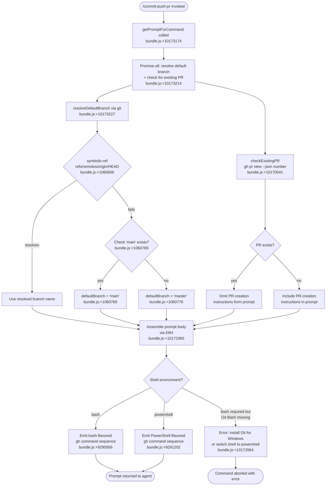

# `/commit-push-pr`

> Analysis basis: CC v2.1.145 bundle.js (AST extraction + Claude interpretation)
> Minimum version: v2.1.145

---

## Overview

`/commit-push-pr` is a `prompt`-type slash command that instructs the Claude Code agent to perform a complete Git workflow: stage and commit all current changes, push the branch to the remote, and open a pull request via the GitHub CLI (`gh`). The command's prompt is assembled at runtime by `getPromptForCommand`, which resolves the current branch's default base branch and checks whether an existing PR already exists before constructing the final instruction string.

---

## Registration

| Field | Value |
|---|---|
| type | `prompt` |
| name | `commit-push-pr` |
| description | Commit, push, and open a PR |
| loc_byte | `10172964` |
| loc_byte_end | `10173576` |
| loc_line | `5714` |
| handler_method | `getPromptForCommand` |
| handler_method_start | `10173168` |
| handler_method_end | `10173575` |
| prompt_body.length | `203` |
| prompt_body.trace | `call→E6H(...) (1 literals)` |
| arbor_handler.name | `getPromptForCommand` |
| arbor_handler.kind | `Method` |
| arbor_handler.resolution_path | `direct` |
| arbor_handler.fqn | `claude-2.1.145::getPromptForCommand` |
| arbor_handler.n_hits | `3` |

Analysis basis: CC v2.1.145 bundle.js:+10172964

---

## Input Branching

The handler resolves through several distinct paths depending on: (1) whether a PR already exists for the current branch, (2) what the default base branch is, (3) whether the shell environment is `bash` or `powershell`, and (4) whether `gh` is available. This constitutes 4+ distinct branches and requires a flowchart.



---

## Behavioral Spec

### Handler Entry Point: `getPromptForCommand`

The handler is an `ObjectMethod` declared inline on the registration object. Arbor resolved it as `direct` with `n_hits: 3`.

```
function getPromptForCommand(context):
    # Step 1 — Parallel resolution
    [defaultBranch, existingPR] = await Promise.all([
        resolveDefaultBranch(context),          # → FV / Y_ pipeline
        checkExistingPR(context)                # → pK / H7q pipeline
    ])

    # Step 2 — Assemble prompt
    prompt = buildPromptBody(context, defaultBranch, existingPR)  # → E6H
    return prompt
```

Analysis basis: CC v2.1.145 bundle.js:+10173174, +10173214, +10173365

---

### Sub-feature 1: Default Branch Resolution (`resolveDefaultBranch`)

Identifier chain: `FV` → `Y_` → `QXH`. The function runs a Git subprocess to discover the default branch of the remote.

```
async function resolveDefaultBranch(context):
    # Primary attempt: ask git for the remote HEAD symbolic ref
    result = await runGitCommand(
        ["symbolic-ref", "--short", "refs/remotes/origin/HEAD"]
    )
    if result.exitCode == 0:
        branch = result.stdout.trim()           # loc +1060726
        return branch                           # strips "origin/" prefix

    # Fallback 1: check whether "main" exists as a remote ref
    mainExists = await runGitCommand(
        ["show-ref", "--verify", "--quiet", "refs/remotes/origin/main"]
    )                                           # loc +1060838, +1060849, +1060860
    if mainExists.exitCode == 0:
        return "main"                           # loc +1060769

    # Fallback 2: assume legacy default
    return "master"                             # loc +1060776
```

The `defaultBranch` key is stored for use in the prompt template (literal `"defaultBranch"` at bundle.js:+1049875).

Analysis basis: CC v2.1.145 bundle.js:+1060589, +1060622, +1060631, +1060646, +1060656, +1060726, +1060769, +1060776, +1060838

---

### Sub-feature 2: Existing PR Detection (`checkExistingPR`)

Identifier chain: `H7q` → `pK`. The function shells out to the GitHub CLI to determine whether a PR already exists for the current branch.

```
async function checkExistingPR(context):
    shell = context.shellType   # "bash" or "powershell"

    if shell == "powershell":
        cmd = "gh pr view --json number 2>$null; if (-not $?) { \"\" }"
        # loc +10170088
    else:
        cmd = "gh pr view --json number 2>/dev/null || true"
        # loc +10170041

    result = await runShellCommand(cmd)

    if result contains a PR number:
        return { exists: true, number: prNumber }
    else:
        return { exists: false }
```

When a PR already exists, the prompt body omits the PR-creation step and instead instructs the agent to push commits to the existing PR.

Analysis basis: CC v2.1.145 bundle.js:+10170036, +10170041, +10170088

---

### Sub-feature 3: Prompt Body Assembly (`buildPromptBody`)

Identifier chain: `__handler_commit-push-pr` → `E6H`. This is the core function that constructs the natural-language instruction string returned to the agent. The `prompt_body.length` is 203 characters and is assembled by one literal substitution (`trace: call→E6H(...) (1 literals)`).

```
function buildPromptBody(context, defaultBranch, existingPR):
    # Validate shell availability
    if context.shellType == "bash" and not gitBashAvailable():
        raise Error(
            "Skill requires bash (shell: bash in frontmatter) but Git Bash "
            "was not found. Install Git for Windows "
            "(https://git-scm.com/downloads/win), or change the skill's "
            "frontmatter to `shell: powershell`."
        )
        # loc +10172964 (prompt_body trace)

    # Determine attribution suffix
    if context.attributionEnabled:
        attributionSuffix = ", ending with the attribution text shown "
                          + "in the example below"
                          # loc +10171224
    else:
        attributionSuffix = ""

    # Select PR-related instruction block
    if existingPR.exists:
        prInstruction = buildPushToExistingPRInstruction(existingPR.number)
    else:
        prInstruction = buildCreatePRInstruction(defaultBranch, attributionSuffix)

    # Compose final prompt
    return joinInstructions([
        commitInstruction,
        pushInstruction,
        prInstruction
    ])
```

The literal `"/commit-push-pr"` at bundle.js:+10173554 is used as a self-reference tag within the prompt (e.g., for attribution or metadata annotation).

Analysis basis: CC v2.1.145 bundle.js:+10173365, +10171224, +10173554

---

### Sub-feature 4: Context Gathering (`CAq` pipeline)

Before the prompt is assembled, `CAq` gathers repository context in parallel. This includes: reading conversation history for compact-boundary detection (`b$7`), collecting file/diff information (`S$7` → `vj_`), and resolving memory/settings (`O1`, `V1`).

```
async function gatherRepoContext(context):
    [mcpServers, diffSummary, conversationSlice] = await Promise.all([
        collectMCPServers(context),                # S$7 → vj_
        buildDiffSummary(context),                 # vj_ → gz4 / GK1
        sliceConversationHistory(context)          # b$7 → h$7 / C$7
    ])

    modelInfo  = resolveModelInfo(context)         # O1 / V1
    memories   = loadMemories(context)             # loc +9723467, +9723476

    return RepoContext(
        mcpServers   = mcpServers,
        diffSummary  = diffSummary,
        conversation = conversationSlice,
        model        = modelInfo,
        memories     = memories
    )
```

The diff pipeline (`vj_`) calls `git diff --cached --name-status` (literals at bundle.js:+5304636, +5304643, +5304654) with a 5 000 ms timeout (bundle.js:+5304693) and `git diff --stat` (bundle.js:+5304233).

The PR-attribution log literal `"PR Attribution: returning default (no data)"` (bundle.js:+9723392) is emitted when attribution metadata is unavailable.

Analysis basis: CC v2.1.145 bundle.js:+9722611, +9722764, +9723178, +9723204, +9723353, +9723392, +9723467

---

### Sub-feature 5: Shell Execution Infrastructure (`QXH` / `wiH` pipeline)

All shell commands issued by this command flow through the shared bash/subprocess execution stack (`QXH` → `VDA`, `Qm8`, `dm8`, `lm8`). Key behavioral properties:

```
function runShellCommand(cmd, options):
    process = spawnProcess(cmd, {
        encoding: "utf8",          # loc +1037372
        shell: detectShell()       # "win32" check at loc +1037491
    })

    # Platform-specific shell selection
    if platform == "win32":        # loc +1037491
        if gitBashPresent:
            shell = gitBashPath    # ends with ".exe", loc +1037523
        else:
            shell = ["cmd", "/q"]  # loc +1037533, +1037549

    # Timeout enforcement
    withTimeout(process, options.timeoutMs)   # SYA → setTimeout/clearTimeout/Promise.race

    # Stream capture
    captureStreams(process, ["stdout", "stderr", "all"])  # loc +1026950, +1027010, +1027066

    # On SIGTERM → kill process
    onSignal("SIGTERM", () => process.kill())             # loc +1025783

    return awaitResult(process)
```

The `defaultBranch` state key is read from an internal cache (`t_H.get` at bundle.js:+1049867) rather than re-queried on every invocation when already warm.

Analysis basis: CC v2.1.145 bundle.js:+1037372, +1037491, +1037523, +1037533, +1037549, +1025783, +1026950, +1027010, +1027066, +1049867

---

### Sub-feature 6: Permission / Tool-Call Handling (`wiH` / `n37`)

When the agent executes shell commands on behalf of this prompt, the standard tool-permission pipeline applies:

```
function checkBashPermission(toolCall, permissionContext):
    if permissionContext.mode == "bypassPermissions":   # loc +9801250
        return ALLOW

    if isDangerousOperation(toolCall.input):
        # "Dangerous rm operation"   loc +9801393
        # "Dangerous rmdir operation" loc +9801440
        return ASK

    decision = classifyWithAutoMode(toolCall)           # PY6 classifier pipeline

    switch decision:
        case "allow":      return ALLOW                 # loc +9801630
        case "deny":       return DENY                  # loc +9800470
        case "ask":        return PROMPT_USER           # loc +9800701
        case "passthrough": return PASSTHROUGH          # loc +9800779
```

In headless/async-agent mode (`"asyncAgent"` at bundle.js:+9804283), interactive prompts are unavailable and any `ask`-classified action raises:
`"Action requires interactive approval and permission prompts are not available in this context"` (bundle.js:+9804303).

Analysis basis: CC v2.1.145 bundle.js:+9801250, +9801393, +9801440, +9800470, +9800701, +9800779, +9804283, +9804303

---

## State & Side Effects

| Item | Detail |
|---|---|
| Telemetry — `tengu_bg_spare_enable` | Fired when background spare process pool is enabled (bundle.js:+14654747) |
| Telemetry — `tengu_bg_spare_spawn` | Fired when a spare background PTY process is spawned (bundle.js:+14655107) |
| Telemetry — `tengu_bg_low_mem_mb` | Fired on low-memory condition in macOS daemon (bundle.js:+12029322) |
| Telemetry — `tengu_daemon_config_reload` | Fired when daemon supervisor config is reloaded (bundle.js:+14669513) |
| Telemetry — `tengu_daemon_control` | Fired on daemon start/stop control events (bundle.js:+14690669) |
| Telemetry — `tengu_cobalt_ridge` | Fired during shell-command routing (bundle.js:+3200295) |
| Telemetry — `tengu_auto_mode_fallback_to_ask` | Fired when auto-mode classifier falls back to interactive ask (bundle.js:+9804424) |
| Telemetry — `tengu_auto_mode_decision` | Fired with the classifier's allow/deny/ask decision (bundle.js:+9805132) |
| Telemetry — `tengu_bash_allowlist_strip_all` | Fired when the entire bash allowlist is stripped (bundle.js:+9806376) |
| Telemetry — `tengu_iron_gate_closed` | Fired when the auto-mode classifier denies and the fail-closed gate triggers (bundle.js:+9808880) |
| Telemetry — `tengu_auto_mode_denial_limit_exceeded` | Fired when consecutive denial limit is exceeded in headless mode (bundle.js:+9798638) |
| Telemetry — `tengu_tool_empty_result` | Fired when a tool call returns an empty result (bundle.js:+4873409) |
| Telemetry — `tengu_tool_result_persisted` | Fired when a tool result is successfully persisted to the transcript (bundle.js:+4873649) |
| appState changes | `getAppState` / `setAppState` called during agent loop (`wiH` pipeline); `defaultBranch` cached in internal map `t_H` (bundle.js:+1049867) |
| Hook registration | Tool-permission hooks registered via `H.on("exit", …)` and `H.on("error", …)` within the subprocess wrapper (bundle.js:+1032959, +1033006) |
| File system | Temp files written/unlinked for PTY host communication (`CU.mkdir`, `CU.unlink` in `vs_`; bundle.js:+14635081, +14635140) |
| Sound | <!-- TODO: not found in depth-2 traversal; needs --depth 4 --> |
| Self-reference literal | `"/commit-push-pr"` embedded at bundle.js:+10173554 (used in prompt metadata or attribution) |

---

## Version History

| Version | Change |
|---|---|
| v2.1.145 | Initial analysis |

---

## Common Mistakes

1. **Running on Windows without Git Bash installed.** The command requires a `bash` shell by default. On Windows, if Git Bash is not present the command aborts with an error directing the user to install Git for Windows (`https://git-scm.com/downloads/win`) or switch the shell to `powershell`. Analysis basis: CC v2.1.145 bundle.js:+10172964.

2. **No `gh` CLI installed.** The command shells out to `gh pr view` and `gh pr create`. If the GitHub CLI is absent, both the PR-detection step and the PR-creation step will fail silently or produce empty results, causing the agent to create a PR from scratch even when one already exists.

3. **Invoking in a detached HEAD state.** The default-branch resolution calls `git symbolic-ref refs/remotes/origin/HEAD`. In a shallow clone or detached HEAD without a configured remote HEAD, this falls back first to `main` then to `master`, which may not match the repository's actual default branch.

4. **Expecting interactive permission prompts in headless/pipe mode.** When `CC` is running in `asyncAgent` or pipe mode, any bash tool call that the auto-mode classifier scores as `ask` will be hard-rejected with an error rather than prompting the user. Ensure the bash allow-list covers `git commit`, `git push`, and `gh pr create` before invoking this command non-interactively.

5. **Confusing this command with a simple commit helper.** The command performs the full three-step workflow (commit → push → PR) as a single agent task. Invoking it when only a commit (without push) is desired will still attempt to push the branch and open or update a PR.

---

## Appendix — Identifier Mapping

> For bundle debugging only. Identifiers change across versions.

| Identifier | Role |
|---|---|
| `__handler_commit-push-pr` | Synthetic BFS entry node for the command handler; real handler is `getPromptForCommand` |
| `FV` | Default-branch resolver: entry point, orchestrates git subcommand calls |
| `qp8` | Reads `defaultBranch` from internal state cache (`t_H.get`) |
| `Y_` | Async shell-execution wrapper; spawns subprocess and collects output |
| `QXH` | Core subprocess execution engine; wires streams, timeout, and signal handling |
| `VDA` | Subprocess argument/option builder; handles platform path normalization |
| `Qm8` | stdout stream capture helper |
| `dm8` | stderr stream capture helper |
| `lm8` | Combined stream ("all") capture helper |
| `RYA` | Numeric-option validator (`Number.isFinite` guard) |
| `S96` | Error formatter for subprocess failures |
| `gm8` | Reflect-based property attachment for stream descriptors |
| `MDA` | Process event-listener registrar (`exit`, `error` hooks) |
| `SYA` | Timeout enforcer (`setTimeout` / `clearTimeout` / `Promise.race`) |
| `CYA` | Process kill handler; invoked on abort |
| `yYA` | Process stdout data handler |
| `hYA` | Process SIGTERM handler |
| `LDA` | Parallel stream aggregator (`Promise.all` over stream readers) |
| `x96` | Exit-code extractor |
| `qDA` | Pipe/pipeline builder for stream chaining |
| `KDA` | Stream transformer registration (`HDA.default`) |
| `mYA` | Output buffer binder |
| `D` | Background daemon process orchestrator |
| `Z6` | Platform/feature registry lookup |
| `bT6` | macOS low-memory guard for daemon |
| `vs_` | Daemon PTY-host spawner (`Bun.spawn`) |
| `NH` | Error logger / error push to global error list |
| `YCK` | String coercion utility |
| `_N` | Internal flag/constant reference |
| `I` | API request dispatcher (model calls) |
| `y$K` | Request context builder |
| `RH` | JSON serializer for request payloads |
| `B4` | Request body formatter / truncator |
| `RSH` | Request signing / header builder |
| `R$K` | HTTP transport layer; handles fetch, buffer, and retry |
| `A8` | Response parser |
| `CAq` | Repository context aggregator; gathers diff, history, memories, model info |
| `ihH` | Conversation message reader |
| `T36` | Message type discriminator |
| `zD` | Environment/endpoint resolver |
| `t_` | Module export initializer |
| `q` | File-system cleanup utility (`unlinkSync`) |
| `YO_` | Endpoint URL builder |
| `k14` | URL component encoder |
| `g_` | Settings/config loader entry point |
| `Gu` | Settings load coordinator |
| `OR` | Settings cache initializer |
| `f1` | Settings deduplication guard |
| `yU8` | Settings disk-read and parse pipeline |
| `UB` | Settings validation and merge |
| `cv6` | Settings post-process / finalize |
| `S$7` | MCP server list builder |
| `vj_` | Git diff and file-stats collector |
| `FzH` | Git command runner (used by diff and stat sub-tasks) |
| `k6` | Path normalization utility |
| `Y` | MCP server state manager (start/stop/updateConfig) |
| `z` | Daemon control interface (stop/stop-failed events) |
| `XK1` | File extension / language classifier |
| `gz4` | Cached-diff runner (`git diff --cached --name-status`) |
| `GK1` | Diff-stat runner (`git diff --stat`); parses changed-file counts |
| `L` | Async task queue with add/delete/finally |
| `b$7` | Conversation history slicer; finds last compact-boundary |
| `s5` | Conversation entry point / path resolver |
| `tU` | Internal constant IV user |
| `q_` | Internal constant IV user (path) |
| `wC6` | File binary-head reader (BOM/encoding detection) |
| `ZSK` | Buffer-from-string utility |
| `NSK` | UTF-8 BOM detector |
| `kSK` | Multi-byte sequence boundary finder |
| `ySK` | Buffer copy with source offset |
| `hSK` | Buffer copy helper |
| `SSK` | Encoding probe helper |
| `rXH` | NDJSON / streaming-JSON message parser |
| `iCK` | NDJSON line tokenizer |
| `rCK` | JSON object boundary finder |
| `aCK` | JSON chunk accumulator |
| `oCK` | Raw line push helper |
| `K` | Column-pad formatter |
| `h$7` | User-message filter (removes sidechain / meta / compactSummary messages) |
| `y$7` | Individual message classifier (checks `isSidechain`, `isMeta`, `isCompactSummary`) |
| `C$7` | Assistant-message tool-use extractor |
| `BC_` | Team-member file checker |
| `O1` | Model-info resolver; maps model ID to display name |
| `MF6` | Model config object builder |
| `tw` | Model-name normalizer (toLowerCase, includes, replace) |
| `bP` | Model display-name formatter |
| `V1` | Context window / token-budget calculator |
| `ea` | Token budget entry point |
| `fF` | System prompt assembler (trims, maps, filters) |
| `n1` | Model-tier classifier (opusplan / sonnet / haiku / opus / best) |
| `zT` | Model-display-name adapter |
| `FAH` | Banned-model-name checker |
| `qv` | Context-window size lookup |
| `juH` | Cache-budget size lookup |
| `Av` | Model provider resolver |
| `oH9` | Provider fallback wrapper |
| `cM` | Provider config fetcher |
| `xg6` | Extended-thinking tier checker |
| `JuH` | Model string coercer |
| `jJ` | Full system-prompt builder |
| `iX` | System-prompt section assembler |
| `ZK1` | Model capability flag checker (`H.includes`) |
| `H7q` | PR context resolver: checks existing PR + resolves branch context |
| `PNH` | Branch/PR metadata fetcher |
| `GMH` | Model-suffix extender (appends " (1M context)" etc.) |
| `Ro8` | Model long-name builder |
| `_7q` | Prompt string sanitizer / replacer |
| `pK` | Shell command runner for PR/branch queries |
| `E6H` | Prompt body builder: calls `pK`, handles bash/powershell dispatch, assembles final string |
| `qm` | Shell-type / platform detector |
| `xH` | String coercion (String constructor wrapper) |
| `lq` | Locale-aware string coercion |
| `n88` | String replace utility |
| `S2` | Agent loop executor (main tool-call dispatch) |
| `wiH` | Permission check and tool-execution loop |
| `n37` | Bash-tool permission evaluator |
| `k_` | App-state reader with `allowed_tools` / `avoid_prompts` keys |
| `fW6` | <!-- TODO: not found in depth-2 traversal; needs --depth 4 --> |
| `uoH` | App-state writer (`setAppState`) |
| `S9q` | <!-- TODO: not found in depth-2 traversal; needs --depth 4 --> |
| `$d` | Recursive safety-check / subcommand-result accumulator |
| `Tw8` | Recursive tool-call processor |
| `N9q` | <!-- TODO: not found in depth-2 traversal; needs --depth 4 --> |
| `R1` | Permission rule evaluator (`Object.hasOwn`, `startsWith` for `mcp__`) |
| `Ww8` | <!-- TODO: not found in depth-2 traversal; needs --depth 4 --> |
| `lx` | <!-- TODO: not found in depth-2 traversal; needs --depth 4 --> |
| `fP_` | <!-- TODO: not found in depth-2 traversal; needs --depth 4 --> |
| `dh1` | Tool-call tracking set adder |
| `PY6` | Auto-mode classifier pipeline |
| `$DH` | Tool-call tracking set remover |
| `Cg6` | WMH wrapper (permission context updater) |
| `FH6` | Input-token counter |
| `jP` | Output-token counter |
| `gH6` | Cache-read-token counter |
| `QH6` | Cache-creation-token counter |
| `QE` | Agent-loop exit trigger |
| `C9q` | <!-- TODO: not found in depth-2 traversal; needs --depth 4 --> |
| `J9q` | <!-- TODO: not found in depth-2 traversal; needs --depth 4 --> |
| `l37` | Headless-mode denial-limit enforcer |
| `R9q` | <!-- TODO: not found in depth-2 traversal; needs --depth 4 --> |
| `c37` | Hook-rewrite and tool-permission-context setter |
| `h9q` | <!-- TODO: not found in depth-2 traversal; needs --depth 4 --> |
| `cJ` | Stop-sequence / message-limit checker |
| `J1q` | Agent loop termination handler |
| `M` | Conversation message store (get/values/set) |
| `kgH` | Tool-result mapper (`mapToolResultToToolResultBlockParam`) |
| `$s9` | Tool-result serializer and truncator |
| `xL4` | Tool-result text trimmer / type checker |
| `Ys9` | Tool-result array inspector |
| `Ds9` | Tool-result reducer |
| `lOH` | Tool-result content builder (handles EEXIST, non-text, image) |
| `iOH` | <!-- TODO: not found in depth-2 traversal; needs --depth 4 --> |
| `nOH` | Line-count appender for tool results |
| `fs9` | Token-budget enforcer for tool results (`Math.min`, `Number.isFinite`) |
| `Xe1` | Prompt string joiner (trim, push, join) |
| `PL7` | Attribution-text appender |
| `GH` | String constructor wrapper (display) |

---

Note: index built via Arbor fallback; some signals (telemetry, literals) may be missing — see arbor-fallback.js.