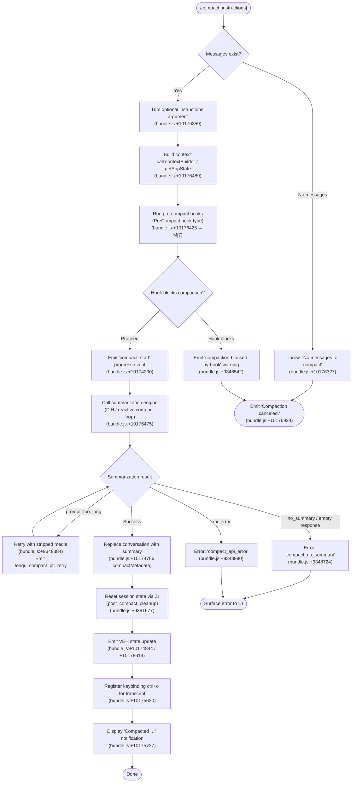

# `/compact`

> Analysis basis: CC v2.1.145 bundle.js (AST extraction + Claude interpretation)
> Minimum version: v2.1.145

---

## Overview

`/compact` frees up context window space by summarizing the current conversation and replacing the message history with a concise summary. The command accepts an optional argument for custom summarization instructions, runs pre-compact hooks, calls the summarization engine, then resets session state and renders a post-compact UI notification. It also serves as the engine for automatic (reactive) compaction triggered by the runtime when the context window approaches its limit.

---

## Registration

| Field | Value |
|---|---|
| type | `local` |
| name | `compact` |
| description | `Free up context by summarizing the conversation so far` |
| argumentHint | `<optional custom summarization instructions>` |
| supportsNonInteractive | `true` |
| thinClientDispatch | `post-text` |
| module_id | `f7q` |
| load_inline | `true` |
| loc_byte | `10177309` |
| loc_byte_end | `10177622` |
| loc_line | `5720` |
| arbor_handler.name | `fj7` |
| arbor_handler.fqn | `claude-2.1.145::fj7` |
| arbor_handler.kind | `AsyncFunction` |
| arbor_handler.resolution_path | `module_id` |
| arbor_handler.n_hits | `0` |

Analysis basis: CC v2.1.145 bundle.js:+10177309

---

## Input Branching

The handler has 4+ distinct paths depending on message availability, cancellation, and compaction result outcome.



---

## Behavioral Spec

### Entry point — handler `fj7`

```
async function compactCommandHandler(userInput, context):
    // Validate message list
    messageList = getConversationMessageList(context)  // h3 → bundle.js:+10176296
    if messageList is empty:
        throw Error("No messages to compact")          // bundle.js:+10176327

    // Parse optional custom instructions
    customInstructions = userInput.trim()              // bundle.js:+10176359

    // Load context (system prompt, app state, tool list)
    contextData = await buildContextForCompact(context)  // TLH → bundle.js:+10176405

    // Run pre-compact lifecycle
    preCompactResult = await runPreCompactPhase(context, contextData, customInstructions)
                                                          // Mj7 → bundle.js:+10176425

    if preCompactResult.blocked:
        emit("compaction-blocked-by-hook", "warning")     // bundle.js:+9346542
        emit("Compaction canceled.")                      // bundle.js:+10176924
        return

    // Invoke summarization and apply result
    summary = await runSummarizationLoop(context, customInstructions)  // DiH → bundle.js:+10176475

    // Post-compact: update state, render UI
    await applyPostCompactState(summary, context)         // Zr, VEH, K7q
    displayCompactionNotification(summary)                // bundle.js:+10175727

    // Log cancellation path if user aborted mid-flow
    if userCanceled:
        emit("Compaction canceled.")                      // bundle.js:+10176924
```

Analysis basis: CC v2.1.145 bundle.js:+10176296–10177062

---

### Pre-compact phase — `Mj7`

```
async function runPreCompactPhase(context, contextData, instructions):
    startTime = performance.now()                          // bundle.js:+10173809

    // Build the summarization prompt from current conversation
    summarizationPrompt = buildSummarizationPrompt(context, contextData)  // wZ → bundle.js:+10173831

    // Collect context: app state, allowed tools, system prompt
    [appStateSnapshot, toolSnapshot] = await Promise.all([
        loadAppStateForCompact(context),                   // L7q → bundle.js:+10173946
        loadToolContext(context)                           // _d  → bundle.js:+10173871
    ])

    // Emit progress indicator
    emitProgressEvent("compact_progress", "compacting")   // bundle.js:+10173672, +10173788

    // Fire PreCompact hook
    hookResult = await runHook("PreCompact", { messages, instructions })
                                                          // bundle.js:+12283292
    emitEvent("hooks_start")                             // bundle.js:+10173703
    emitEvent("pre_compact")                             // bundle.js:+10173726

    if hookResult.decision == "block":
        return { blocked: true }

    // Emit SDK status
    emitEvent("sdk_status", "compacting")                // bundle.js:+10173768, +10173788

    return { blocked: false, prompt: summarizationPrompt, tools: toolSnapshot }
```

Analysis basis: CC v2.1.145 bundle.js:+10173809–10173957

---

### Summarization loop — `DiH` (reactive compact engine)

```
async function runSummarizationLoop(context, customInstructions):
    // Determine compact mode: manual vs auto
    mode = context.isManual ? "compact_manual" : "compact_auto"
                                                          // bundle.js:+9347200, +9347185

    // Guard: require sufficient message count
    messageGroups = groupMessagesForCompaction(context)   // h3, se1
    if messageGroups.length < 2:
        logWarning("Reactive compact: fewer than 2 groups, nothing to compact")
                                                          // bundle.js:+9366816
        emitEvent("too_few_groups")                      // bundle.js:+9366906
        return null

    // Run compaction agent (text-only, no tool use allowed)
    attempt = 0
    while true:
        attempt++
        result = await callCompactionAgent(messageGroups, customInstructions)
                                                          // _47 → bundle.js:+9367750

        if result.error == "prompt_too_long":
            emitTelemetry("tengu_compact_ptl_retry")     // bundle.js:+9348384
            messageGroups = stripMediaFromGroups(messageGroups)
            if not strippable:
                emitError("media_unstrippable")          // bundle.js:+9368377
                break
            continue  // retry stripped

        if result.error == "no_assistant_message":
            emitError("no assistant message in summarization response")  // bundle.js:+9365533
            break

        if result.summary is empty:
            logWarning("Reactive compact: empty summary text")           // bundle.js:+9365976
            emitError("summarization produced empty response")           // bundle.js:+9366072
            break

        // Summarization succeeded
        emitTelemetry("tengu_compact")                   // bundle.js:+9350287
        return result.summary

    // Failure paths
    emitError("compact_no_summary")                      // bundle.js:+9348724
    return null
```

Analysis basis: CC v2.1.145 bundle.js:+9347185–9351837

---

### Compaction agent call — `_47`

```
async function callCompactionAgent(messageGroups, customInstructions):
    // Tool use is blocked during compaction
    onToolUseAttempt → return { decision: "deny",
                                reason: "Tool use is not allowed during compaction" }
                                                          // bundle.js:+9357682

    // System prompt for compaction agent
    systemPrompt = "You are a helpful AI assistant tasked with summarizing conversations."
                                                          // bundle.js:+9360006

    // Construct summarization request
    request = buildSummarizationRequest(messageGroups, customInstructions)

    // Call the model
    response = await callModel(request)                   // IZ, HHq sub-pipeline

    // Validate: must contain text content
    if response has no text block:
        return { error: "no_summary" }

    // Validate: must not be whitespace-only
    if response.text.trim() == "":
        return { error: "empty_summary" }

    return { summary: response.text }
```

Analysis basis: CC v2.1.145 bundle.js:+9357667–9360006

---

### Message grouping helper — `h3` / `BO7`

```
function buildCompactBoundarySlice(messages):
    // Inserts a synthetic "compact_boundary" marker at position [1, 0]
    // to delimit the conversation region to summarize
    boundary = { role: "system", type: "compact_boundary" }
                                                          // bundle.js:+9895204, +9895226
    slicedMessages = H.slice(messages, ...)               // bundle.js:+9895379
    return [boundary, ...slicedMessages]
```

Analysis basis: CC v2.1.145 bundle.js:+9895204–9895379

---

### Post-compact cleanup — `Zr`

```
async function postCompactCleanup(context, summary):
    // Finalise compaction metadata in app state
    storeCompactMetadata(summary)                          // bundle.js:+10174766

    // Clear transient caches
    clearPrecomputedCompactCache()                         // AD8 → bundle.js:+9391750
    clearNormalisationCaches()                             // NP1 → bundle.js:+9391756

    // Reset UI state flags
    resetAutonomousLoopDelivered()                         // T47 → bundle.js:+9391788
    resetSessionHistorySlice()                             // lh1, MDH → bundle.js:+9391762, +9391768

    // Clear session timers
    clearActiveTimers()                                    // jP → bundle.js:+9391838

    // Fire PostCompact hook
    await runHook("PostCompact")                           // bundle.js:+12315487

    emitEvent("post_compact_cleanup")                      // bundle.js:+9391677
```

Analysis basis: CC v2.1.145 bundle.js:+9391661–9391944

---

### Context builder — `TLH`

```
async function buildCompactContext(context):
    // Snapshot current conversation message list
    messages = getMessageList()              // qoH → bundle.js:+9392724

    // Resolve current token counts / model limits
    tokenCounts = resolveTokenLimits()       // m0  → bundle.js:+9392742

    // Check auto-compact setting
    autoCompactEnabled = getConfigValue("autoCompactEnabled")
                                             // bundle.js:+9402179

    // Build prompt payload
    promptPayload = buildPromptPayload(messages, tokenCounts)
                                             // qD8 → bundle.js:+9392783

    return { messages, tokenCounts, promptPayload, autoCompactEnabled }
```

Analysis basis: CC v2.1.145 bundle.js:+9392724–9392783

---

### Auto-compact threshold detector — `qD8` / `bS_`

```
function evaluateAutoCompactThreshold(tokenCount, contextWindow):
    // Parse percentage or absolute value from "autoCompactEnabled" config
    // Accepts "auto", numeric percentages, or absolute token counts
    // (bundle.js:+9400121 for "auto" literal)
    if value == "auto":
        threshold = deriveAdaptiveThreshold(contextWindow)
    else if value.endsWith("%"):
        threshold = parseFloat(value) / 100 * contextWindow
                                             // bundle.js:+9400168
        threshold = Math.round(threshold)    // bundle.js:+9400335
    else:
        threshold = parseInt(value, 10)      // bundle.js:+9400242

    // Clamp to sane range [100, 1000] token units
    // bundle.js:+9400226 (1000), +9400262 (100)
    return tokenCount >= threshold
```

Analysis basis: CC v2.1.145 bundle.js:+9400091–9400335

---

### Error message mapping

| Failure key | User-facing message |
|---|---|
| `prompt_too_long` | `"Compaction failed · conversation could not be reduced below the context limit"` (bundle.js:+10174434) |
| `media_too_large` | `"Compaction failed · attached media exceeds size limits"` (bundle.js:+10174557) |
| unknown | `"unknown error"` (bundle.js:+10174682) |
| Cancellation | `"Compaction canceled."` (bundle.js:+10176924) |

---

## State & Side Effects

| Item | Detail |
|---|---|
| Telemetry — compact lifecycle | `tengu_compact` (bundle.js:+9350287), `tengu_compact_ptl_retry` (+9348384), `tengu_compact_failed` (+9361285), `tengu_compact_cache_prefix` (+9347912), `tengu_compact_cache_sharing_success` (+9358559), `tengu_compact_cache_sharing_fallback` (+9359189) |
| Telemetry — reactive compact | `tengu_reactive_compact_attempt` (+9367539), `tengu_reactive_compact_failed` (+9396007), `tengu_reactive_compact_succeeded` (+9398154) |
| Telemetry — post-compact file restore | `tengu_post_compact_file_restore_success` (+9361767), `tengu_post_compact_file_restore_error` (+9361809) |
| Telemetry — precomputed compact | `tengu_precomputed_compact_discarded` (+9375235) |
| Hook — PreCompact | Fires before summarization; `block` decision aborts compaction (bundle.js:+12283292) |
| Hook — PostCompact | Fires after summary is stored (bundle.js:+12315487) |
| appState changes | `compactMetadata` written to app state (+10174766); autonomous-loop counters reset; session history slice replaced with summary message |
| Progress events | `compact_progress`, `hooks_start`, `pre_compact`, `sdk_status`, `compact_start`, `compact_end` (bundle.js:+10173672–10175310) |
| Keybinding registration | `ctrl+o` → `app:toggleTranscript` registered after successful compact (bundle.js:+10175620) |
| Cache cleared | `AD8` clears pre-compact cache; `NP1` clears normalisation caches (bundle.js:+9391750, +9391756) |
| Tool use during compaction | Blocked: model receives `deny` decision with message "Tool use is not allowed during compaction" (bundle.js:+9357682) |
| Sound | Not observed in depth-2 traversal |

---

## Version History

| Version | Change |
|---|---|
| v2.1.145 | Initial analysis |

---

## Common Mistakes

1. **Invoking `/compact` on an empty session.** The command throws immediately with `"No messages to compact"` (bundle.js:+10176327) if the message list is empty; this is not a recoverable error — start a conversation first.
2. **Passing multi-line custom instructions via a single-line CLI argument.** The argument is trimmed (bundle.js:+10176359) but not further parsed; complex multi-line prompts should be concise enough to fit in a single argument string.
3. **Expecting tool results to survive compaction.** The compaction agent operates in tool-use-denied mode, and all prior tool results are reduced to a text summary. References to specific tool-result IDs will be invalid after `/compact`.
4. **Assuming `/compact` respects `disallowedTools` for the summary call.** The summarization sub-agent runs with an internal system prompt and its own tool policy (`deny` for all tool use), independent of the session's normal tool permissions.
5. **Relying on the `compact_boundary` marker being present in the summarized history.** The `compact_boundary` synthetic message (bundle.js:+9895226) is a transient delimiter used during summarization only; it does not appear in the final summarized conversation.
6. **Not accounting for `PreCompact` hook blocking.** If a `PreCompact` hook returns a block decision, the operation emits a warning and cancels silently — no summary is generated and the conversation is left unchanged.

---

## Appendix — Identifier Mapping

> For bundle debugging only. Identifiers change across versions.

| Identifier | Role |
|---|---|
| `fj7` | Main `/compact` command handler (AsyncFunction, Arbor-resolved) |
| `h3` | Message list retrieval / compact boundary slicer |
| `BO7` | Compact boundary insertion helper |
| `jX` | Conversation message list accessor |
| `TLH` | Compact context builder (messages + token counts + prompt payload) |
| `qoH` | Message snapshot reader |
| `E_` | Session/state event emitter |
| `Z6` | Token usage / context-window state manager |
| `m0` | Token limit resolver (model lookup, parseInt, isNaN guards) |
| `zT` | Max-token derivation helper |
| `dAH` | Per-model token-count reader |
| `wl` | Model-family capability resolver |
| `O1` | Model identifier normaliser |
| `Kh` | First-party model classifier |
| `iD` | Provider-type resolver (firstParty / anthropicAws / foundry …) |
| `QAH` | Token-budget query builder |
| `nn6` | Token count aggregator |
| `qD8` | Auto-compact threshold evaluator |
| `PG` | Auto-compact config accessor (reads `autoCompactEnabled`) |
| `j7` | Config profile selector (legacyGlobalConfig / default) |
| `bS_` | Threshold string parser (%, absolute, "auto") |
| `Mj7` | Pre-compact phase orchestrator (hooks, progress, context load) |
| `wZ` | Summarization prompt builder |
| `q77` | Prompt content assembler for summarization request |
| `LgH` | Conversation serialiser for summarization |
| `sS_` | Message-normalisation/attachment expansion pipeline |
| `_d` | Tool-context loader for compact |
| `w4` | Effort/tool-schema builder |
| `g2` | Main turn-execution engine (used inside compaction agent) |
| `L7q` | App-state and system-prompt fetcher for compact |
| `YG` | System prompt assembly (all sections) |
| `k_` | Allowed-tools / app-state snapshot reader |
| `Tx_` | App-state snapshot accessor |
| `ob` | System prompt thread fetcher |
| `QY8` | Tool-use policy normaliser |
| `zS_` | Stream-mode / request parameters builder |
| `RS_` | Summarization API request orchestrator |
| `Gj` | API client selector |
| `Ge` | API endpoint capability check |
| `rY8` | Reactive compact main loop |
| `_Hq` | Group-window math helper (max, floor) |
| `_47` | Compaction agent caller (single attempt) |
| `A47` | Group-window size calculator |
| `i0` | Model / effort context builder |
| `Ew` | App-state reader (within turn) |
| `EHq` | Full turn executor (streaming + tool dispatch) |
| `HqH` | Model response handler |
| `IwH` | Tool-schema + message assembler for API call |
| `Zr` | Post-compact cleanup and state reset |
| `tY8` | Pre-computed compact cache discard handler |
| `qHq` | Pre-computed compact metadata reader |
| `AD8` | Pre-compact cache clear |
| `NP1` | Normalisation cache clear |
| `lh1` | Session history slice resetter |
| `MDH` | Autonomous loop state resetter |
| `jP` | Timer/interval cleanup |
| `VEH` | App state `setState` updater (post-compact) |
| `K7q` | Post-compact UI notification builder |
| `CdH` | Model selector for compaction display |
| `IJ` | Keybinding registration handler |
| `DiH` | Summarization loop entry (manual + reactive) |
| `rrH` | Initial state guard for summarization |
| `UY8` | Summary text trimmer |
| `w8` | Message ID factory |
| `HHq` | Compaction agent turn runner (streams response, enforces text-only) |
| `Fa1` | Pre-computed compact cache lookup |
| `Nz8` | Cache-entry fetcher |
| `Ba1` | Cache-entry writer |
| `IZ` | Streaming turn loop |
| `IN_` | App-state updater within turn |
| `se1` | Message-slice builder for compaction window |
| `sBH` | Token estimation helper |
| `gp` | Tool-use gate check (returns deny for compaction) |
| `JG` | Message normaliser / conversation formatter |
| `tCq` | Full REPL turn orchestrator (called by compaction sub-agent) |
| `wrH` | Hook execution wrapper |
| `iS_` | Hook type dispatcher |
| `WLH` | Max-output-tokens resolver (`CLAUDE_CODE_MAX_OUTPUT_TOKENS`) |
| `P$H` | Output token limit capper |
| `We` | Token limit validator (valid / invalid / capped) |
| `dY8` | File-reference restoration after compact |
| `tL7` | File-reference path validator |
| `H47` | File-reference attachment builder |
| `sy_` | At-mention / file-read handler |
| `E17` | File read + PDF reference handler |
| `iY8` | Local-agent context injector |
| `cY8` | Plan-file reference injector |
| `nY8` | Additional context injector |
| `lY8` | Task-context injector |
| `SrH` | Tool permission context builder |
| `RrH` | Tool permission state updater |
| `Hs1` | MCP instructions pool manager |
| `Cp` | Plugin-hook loader |
| `DiH` | (duplicate entry; same as summarization-loop entry above) |
| `ee1` | Compaction error surface handler |
| `rh` | Error deduplication cache |
| `pS_` | Progress-event emitter for compact phases |
| `oOH` | OTEL metrics emitter (compaction telemetry) |
| `zL` | OTEL span/event builder |
| `CgH` | OTEL metric attribute builder |
| `je` | UI state updater (post-compact) |
| `uo9` | Direct `setState` caller |
| `gP` | `gP` — working-directory / path context builder |
| `X$H` | Model capability flag reader |
| `Qn` | API model header builder |
| `$f6` | Memory/CLAUDE.md prompt builder |
| `sg7` | Tool policy section builder |
| `KQ7` | Environment info (worktree / cwd) assembler |
| `qQ7` | Additional working-directory prompt builder |
| `fQ7` | Background-session mode descriptor |
| `MQ7` | Model display-name resolver |
| `zQ7` | Brief-mode detector |
| `wQ7` | Context-management section builder |
| `HQ7` | Growthbook / feature-flag section builder |
| `yr1` | Memory-file reader (CLAUDE.md) |
| `El_` | System-prompt section merger |
| `jQ7` | System-prompt section deduplicator |
| `FX6` | Feature-flag / AB-test section injector |
| `Bg7` | Worktree context section builder |
| `pg7` | Code-style guideline section builder |
| `Ug7` | Scratchpad section builder |
| `lg7` | Compaction-reminder section builder |
| `ng7` | Tool-verified-paths section builder |
| `ig7` | Section identity mapper |
| `rg7` | Routine / schedule section builder |
| `tg7` | Session-specific guidance section builder |
| `uI9` | Auto-memory section builder |
| `gg7` | Ant-model-override section builder |
| `dg7` | Language / output-style section builder |
| `Qg7` | FRC (fast-response) section builder |
| `$Q7` | Reproduce-verify workflow section builder |
| `eg7` | Background-task section builder |
| `cg7` | Companion-intro section builder |

Note: index built via Arbor fallback; some signals (telemetry, literals) may be missing — see arbor-fallback.js.