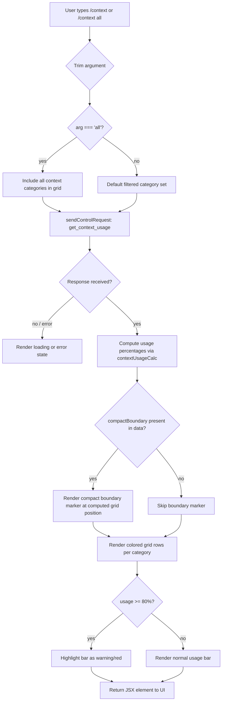

# `/context`

> Analysis basis: CC v2.1.145 bundle.js (AST extraction + Claude interpretation)
> Minimum version: v2.1.145

---

## Overview

`/context` is a local-JSX command that visualizes the current conversation's context-window usage as a colored, categorized grid. It dispatches a `get_context_usage` control request to the active agent session, collects token-count data for each context category (system prompt, tools, memory files, messages, etc.), and renders a summary display — including a compact boundary indicator and a percentage bar — directly in the UI.

---

## Registration

| Field | Value |
|---|---|
| type | `local-jsx` |
| name | `context` |
| description | `Visualize current context usage as a colored grid` |
| argumentHint | `[all]` |
| thinClientDispatch | `control-request` |
| module_id | `mfq` |
| load_inline | `true` |
| loc_byte | `10575263` |
| loc_byte_end | `10575489` |
| loc_line | `5772` |
| arbor_handler.name | `L27` |
| arbor_handler.fqn | `claude-2.1.145::L27` |
| arbor_handler.kind | `AsyncFunction` |
| arbor_handler.resolution_path | `module_id` |
| arbor_handler.n_hits | `0` |

Analysis basis: CC v2.1.145 bundle.js:+10575263

---

## Input Branching

The command has four or more distinct branches depending on the argument value, the context-data availability, and the presence of a compact boundary. A Mermaid flowchart is used.



Analysis basis: CC v2.1.145 bundle.js:+10573903, +10574023, +10574364, +10574097

---

## Behavioral Spec

### Handler Entry Point (`L27`)

The Arbor-resolved handler `L27` is an `AsyncFunction` registered via `module_id` resolution (module `mfq`).

```
async function contextCommandHandler(rawArg, appContext):
    arg = rawArg.trim()                       // bundle.js:+10573903
    isShowAll = (arg === 'all')               // bundle.js:+10573928

    // Dispatch control request to running agent
    controlResult = await sendControlRequest('get_context_usage', appContext)
                                              // bundle.js:+10573963, +10573993

    // Register event listener for the response
    responseData = await listenForControlResponse(controlResult)
                                              // bundle.js:+10574023

    // Build JSX visualization
    return renderContextGrid(responseData, isShowAll)
                                              // bundle.js:+10574027
```

Analysis basis: CC v2.1.145 bundle.js:+10573897

---

### Control Request Dispatch (`sendControlRequest`)

The command uses `thinClientDispatch: "control-request"`, meaning it sends a structured control message to the agent subprocess rather than injecting a chat prompt.

```
function sendControlRequest(requestType, context):
    // requestType = 'get_context_usage'
    request = buildControlMessage(requestType)
    K.sendControlRequest(request)             // bundle.js:+10573963
    return requestHandle
```

Analysis basis: CC v2.1.145 bundle.js:+10573963

---

### Response Listener (`$lH`)

After dispatching, the handler attaches a `data` event listener on the control channel and converts the raw buffer to a string for parsing.

```
function attachResponseListener(channel):
    channel.on('data', handler)               // bundle.js:+7450987 (literal "data")
    rawString = buffer.toString()             // bundle.js:+7451024
    parsed = parseControlResponse(rawString) // bundle.js:+7451051
    return parsed
```

Analysis basis: CC v2.1.145 bundle.js:+10574023

---

### Context-Usage Calculation (`z06`)

`z06` is the main computation function that takes the raw context-usage payload and produces the display-ready data structure.

```
function computeContextUsage(rawData, isShowAll):
    // Filter entries by category visibility
    visibleEntries = rawData.filter(shouldShowEntry(isShowAll))
                                              // bundle.js:+10572001
    // Locate compact boundary entry (if present)
    boundaryEntry = visibleEntries.find(isCompactBoundary)
                                              // bundle.js:+10572319

    // Build display rows
    rows = []
    for entry in visibleEntries:
        label = String(entry.label)           // bundle.js:+10573237
        percentage = computePercentage(entry.tokenCount, totalTokens)
        color = pickColor(entry.category)
        rows.append({ label, percentage, color })

    // Add context-efficiency section
    efficiencyBlock = buildEfficiencyDisplay(visibleEntries)
                                              // bundle.js:+10573656

    return { rows, boundaryEntry, efficiencyBlock }
```

Known category label strings (from literals): `"Free space"` (+10572036), `"Autocompact buffer"` (+10572059), `"Project"` (+10573005), `"User"` (+10573042), `"Local"` (+10573077), `"Flag"` (+10573112), `"Policy"` (+10573148), `"Plugin"` (+10573178), `"Built-in"` (+10573210), `"System prompt"` (+9412956), `"System tools"` (+9413035), `"MCP tools"` (+9413099), `"MCP tools (deferred)"` (+9413175), `"System tools (deferred)"` (+9413261), `"Custom agents"` (+9413350), `"Memory files"` (+9413417), `"Skills"` (+9413479), `"Messages"` (+9413979).

Analysis basis: CC v2.1.145 bundle.js:+10572001

---

### Percentage Formatter (`to`)

Rounds a fractional ratio to a display string with at most one decimal place.

```
function formatPercentage(ratio):
    rounded = Math.round(ratio * 1000) / 10   // bundle.js:+207169
    if rounded ends with '.0':
        return String(rounded) stripped of '.0' // literal ".0" at +207111
    return rounded + '%'
```

The locale formatter is invoked with `"en-US"` and `"compact"` notation (literals at +209119 and +209137), using a precision threshold of 20 (literal at +207140) with a `"< 20"` label string (literal at +207149) and a step size of 10 (literal at +207182).

Analysis basis: CC v2.1.145 bundle.js:+10573736

---

### Compact Boundary Marker (`K27` / `h3`)

When the context-usage data contains a compact-boundary entry, the renderer computes its grid position and inserts a visual divider.

```
function renderCompactBoundary(boundaryEntry, totalRows):
    position = lookupCompactBoundaryPosition(boundaryEntry)
                                              // bundle.js:+9895356
    // Slice rows at boundary
    before = rows.slice(0, position)          // bundle.js:+9895379
    after  = rows.slice(position)
    return [before, BOUNDARY_DIVIDER, after]
```

The string key `"compact_boundary"` (literal at +9895226) is used as the identifier for the boundary entry during the `find` call.

Analysis basis: CC v2.1.145 bundle.js:+10574306

---

### Warning Threshold

The grid bar changes rendering style when usage reaches or exceeds **80%**:

> Warning threshold: 80% (bundle.js:+10574364)

```
function pickBarStyle(usagePercent):
    if usagePercent >= 80:                    // bundle.js:+10574364
        return WARNING_STYLE
    return NORMAL_STYLE
```

---

### State Update (`je`)

After rendering, the command updates application state to record that a context-usage display has been shown in the current session.

```
function recordContextDisplayShown(appState):
    stateStore.setState(update)               // bundle.js:+4779307
```

Analysis basis: CC v2.1.145 bundle.js:+10574332

---

### System-Prompt Assembly (`MD8`)

The broader system-prompt builder (`MD8`) is invoked as part of the context-usage pipeline to provide accurate token counts for the system-prompt category. It assembles sub-components in a fixed order:

```
function buildSystemPromptTokenData(session):
    promptParts = []

    // Core identity / task section
    promptParts.push(buildAgentIdentitySection())         // bundle.js:+9411998
    // Environment info
    promptParts.push(buildEnvironmentSection())            // bundle.js:+9412104
    // Memory files
    promptParts.push(buildMemorySection())                 // bundle.js:+9412148 (ob)
    // Tool definitions
    promptParts.push(buildToolSection(S47, R47, C47))      // bundle.js:+9412682, +9412731, +9412737
    // Per-message context additions
    promptParts.push(buildMessageContextSection())         // bundle.js:+9412752 (u47)
    // Agent listing
    promptParts.push(buildAgentListingSection())           // bundle.js:+9412767 (m47)
    // Background task data
    promptParts.push(buildBackgroundTaskSection())         // bundle.js:+9412774 (b47)

    tokenCounts = countTokensForParts(promptParts)
    return tokenCounts
```

Analysis basis: CC v2.1.145 bundle.js:+9411998

---

## State & Side Effects

| Item | Detail |
|---|---|
| Telemetry | `tengu_amber_creek` (+3338751), `tengu_pewter_brook` (+3338659), `tengu_marlin_porch` (+3699038), `tengu_slate_harrier` (+12398965), `tengu_sparrow_ledger` (+12389388), `tengu_memdir_loaded` (+3258843), `tengu_memdir_disabled` (+3264712), `tengu_herring_clock` (+3264908), `tengu_team_memdir_disabled` (+3264936) |
| Control request | Sends `get_context_usage` via `thinClientDispatch: "control-request"` to the active agent daemon (bundle.js:+10573963) |
| JSX rendering | Returns a JSX element rendered in the CLI UI panel; does not write to the conversation transcript |
| App state update | Calls `stateStore.setState` via `je`/`uo9` to mark that the context grid has been displayed (bundle.js:+10574332) |
| Hook registration | `h9` calls `w6A.register` (bundle.js:+57267) — registers a shutdown/cleanup hook associated with the log-writer pipeline |
| Sound | None observed in depth-2 traversal |

---

## Version History

| Version | Change |
|---|---|
| v2.1.145 | Initial analysis |

---

## Common Mistakes

1. **Forgetting the `[all]` argument**: Without `all`, only a filtered subset of context categories is shown. High-token categories like deferred MCP tools may be hidden by default. Pass `/context all` to see the complete breakdown.
2. **Running outside an active session**: `/context` requires a live agent daemon to respond to the `get_context_usage` control request. Running it before the agent has initialized will yield a loading or error state.
3. **Misreading the compact boundary marker**: The divider line in the grid marks where the auto-compact window begins, not the total context limit. Token usage above this line is eligible for compaction.
4. **Ignoring the 80% warning**: The bar turns to warning style at ≥ 80% usage. At that point, context compaction (`/compact`) or conversation pruning is advisable to avoid truncation.
5. **Confusing "Free space" with actual remaining capacity**: The "Free space" row reflects an internal accounting estimate; actual available tokens depend on model limits set via `CLAUDE_CODE_MAX_OUTPUT_TOKENS` and the active model's context window.

---

## Appendix — Identifier Mapping

> For bundle debugging only. Identifiers change across versions.

| Identifier | Role |
|---|---|
| `L27` | Main async handler for `/context` command (Arbor-resolved entry point) |
| `oA` | Context-usage data fetcher / aggregator |
| `OCH` | Set membership check used during context-category filtering |
| `VK_` | Color-code lookup for context-category grid cells |
| `lq` | String conversion utility (color/label) |
| `xH` | Secondary string converter |
| `_n` | Terminal-detection helper (used for display mode selection) |
| `imL` | iTerm/tmux detection helper |
| `nmL` | Terminal name prefix checker (`H.startsWith`) |
| `z06` | Context-usage computation and row-building function |
| `AL` | Locale-aware number formatter |
| `oq` | Inner number-format helper (`x$K`) |
| `iCH` | Context-efficiency block builder |
| `to` | Percentage formatter (`Math.round`) |
| `GH` | String coercion wrapper |
| `K27` | Compact-boundary row renderer |
| `h3` | Compact-boundary position lookup (`BO7`, `H.slice`) |
| `BO7` | Compact-boundary grid position calculator |
| `jX` | Inner position index helper |
| `je` | App-state updater post-render |
| `uo9` | State-store `setState` caller |
| `MD8` | System-prompt token-count assembler |
| `YT` | Agent identity / task section builder |
| `ea` | Core identity text assembler |
| `fF` | Model-name / persona text formatter |
| `Av` | Provider-type helper |
| `cM` | Provider-kind classifier |
| `PM` | Provider-display-name builder |
| `qv` | Secondary provider helper |
| `PG` | Auto-compact config reader |
| `j7` | Legacy global config reader |
| `Pu` | Config set membership helper |
| `Z8` | State-pool helper |
| `Vr` | Compact-window validator/parser |
| `We` | `CLAUDE_CODE_AUTO_COMPACT_WINDOW` env-var parser |
| `qD8` | Compact-window resolution (env → settings) |
| `bS_` | Float/int context-window token parser |
| `YG` | Full system-prompt assembler (orchestrates sub-builders) |
| `Xl_` | Terminal-width helper |
| `b6` | Async-local-storage context getter |
| `AC6` | Store lookup + `Mc` call |
| `q_` | Inner value resolver (`IV`) |
| `oz8` | Object-values enumerator for tool map |
| `pg7` | Tool-definition section builder |
| `Eq_` | Tool-entry formatter |
| `Tq_` | Tool-entry alternate formatter |
| `Ug7` | Tool-section aggregator |
| `El_` | Tool-list element builder |
| `jQ7` | Tool-list wrapper |
| `FX6` | Tool context-section injector |
| `Bg7` | Tool context wrapper |
| `sg7` | Memory-and-skills section builder |
| `AB` | Availability-check helper |
| `eD` | `xH`-based string sanitizer |
| `og7` | Session-guidance section builder |
| `Jw_` | Guidance formatter |
| `CT` | Guidance applicator |
| `c4` | Category tag helper |
| `ag7` | Tone-and-style section builder |
| `M4H` | Style-section dispatcher |
| `np` | Content flat-mapper |
| `$f6` | Memory-file section builder |
| `nK` | Memory-directory reader |
| `_1H` | Memory-directory mkdir helper |
| `rl` | File-stat/type checker |
| `hH` | Directory entry helper |
| `YY` | Memory directory validator |
| `NI9` | Combined memory prompt path builder |
| `OGH` | Memory-overlay helper |
| `II9` | Instruction memory loader |
| `vI9` | Variable memory loader |
| `pq_` | Memory push/overlay builder |
| `d` | Generic async deferred resolver |
| `gg7` | GrowthBook feature-flag section |
| `KQ7` | Model-override section builder |
| `rX` | Model display-name formatter |
| `Wl_` | Model section inner builder |
| `qQ7` | Environment-info section builder |
| `Tl_` | OS info collector (`okH.version/release/type`) |
| `qM` | Working-directory helper |
| `Gl_` | Shell-type detector |
| `Qg7` | Language section builder |
| `dg7` | Output-style section builder |
| `fQ7` | Worktree-mode section builder |
| `WZ_` | Worktree-detection helper |
| `MQ7` | Scratchpad section builder |
| `G8H` | Scratchpad store reader |
| `MJH` | Scratchpad path builder |
| `$Q7` | FRC section builder |
| `zQ7` | Brief-mode checker |
| `wQ7` | Focus section builder |
| `HQ7` | Reproduce-verify-workflow section |
| `yr1` | Away-summary hook |
| `u7H` | Away-summary compute helper |
| `nI8` | Away-summary nonce helper |
| `eg7` | Agent listing section |
| `cg7` | Companion-intro section |
| `lg7` | Tool-injection-warning section |
| `Fg7` | Prompt-injection notice formatter |
| `ng7` | System reminder section |
| `ig7` | System-reminder element wrapper |
| `rg7` | Permission-mode section builder |
| `gP` | Permission label formatter |
| `tg7` | Tone/style note section |
| `uI9` | User-memory section (thin) |
| `xI9` | User-memory inner builder |
| `X$H` | Provider-credential helper |
| `BE` | Credential-type classifier |
| `c7` | Constant/value coercer |
| `wA` | Provider config accessor |
| `ob` | Agent-memory (system prompt) loader |
| `KK` | Memory load helper |
| `Ej` | Memory entry formatter |
| `S47` | Built-in tool section assembler |
| `h47` | Tool entry parser |
| `OD8` | MCP tool section assembler |
| `LQ7` | MCP tool list builder |
| `mI9` | MCP tool entry formatter |
| `JCq` | Tool-schema slice/prefix parser |
| `foH` | Tool-definition formatter (ANH + NH) |
| `ANH` | API-facing tool definition builder |
| `NH` | Cached tool-definition helper |
| `yHq` | Tool-metadata formatter |
| `R47` | Additional system-tool section |
| `s36` | Tool-filter helper |
| `C47` | Deferred-tool section builder |
| `M` | MCP server state manager |
| `ONH` | MCP server connection orchestrator |
| `y_K` | MCP server update applier |
| `$` | MCP server state getter |
| `nL5` | MCP client list reconciler |
| `NwH` | Tool-section wrapper for deferred tools |
| `zD8` | MCP tool schema normalizer |
| `z` | Background-session event router |
| `CH` | Directory-entry checker |
| `oN` | Session-path helper |
| `kx` | Process-exit racer |
| `G` | Set/map keyed by connection id |
| `i26` | Connection id generator |
| `kZ8` | Connection key hasher |
| `P` | IPC buffer/protocol handler |
| `J` | IPC message queue |
| `w` | Worker/subprocess manager |
| `Q5` | IPC stream end helper |
| `t75` | PTY session message dispatcher |
| `u47` | Per-message context token counter |
| `S5` | Token-count rounder |
| `O` | OS-info map |
| `k8` | OS helper |
| `D` | Daemon instance manager |
| `bT6` | Background low-memory handler |
| `vs_` | Spare-session spawner |
| `m47` | Agent-listing token counter |
| `b47` | Background-task token counter |
| `Vw_` | Availability-flag resolver |
| `kqH` | Context-flag filter |
| `kHq` | Context-lookup helper |
| `tq` | Deep config property walker |
| `F47` | Final-section token counter |
| `p47` | Per-part RH token helper |
| `U47` | Usage-map accumulator |
| `B47` | Buffer byte-length helper |
| `JG` | Message-array normalizer and conversation builder |
| `jO7` | Message-block builder |
| `Gb_` | Thinking-block filter |
| `TO7` | Tool-result normalizer |
| `GO7` | Media-type dispatcher (document/image/text) |
| `EO7` | Array/object content checker |
| `N` | Away-summary cache entry |
| `Vw8` | Some-predicate helper for messages |
| `SO7` | Random UUID generator for messages |
| `w8` | Message UUID helper |
| `dW` | Message deduplicator |
| `EN_` | Empty-content filler |
| `vw8` | Thinking-block wrapper |
| `zS` | Standard system-prompt injector |
| `Vb_` | Tool-removal notice injector |
| `JO7` | Tool-reference extractor |
| `T` | Remote-control keyboard handler |
| `V` | MCP server instance |
| `PO7` | Array content presence checker |
| `vL` | Value-lookup helper |
| `d1q` | Message-dedup id builder |
| `VO7` | Content filter/splitter |
| `Y` | Supervisor session output writer |
| `I1q` | Content-push pair helper |
| `sS_` | System-message injection builder |
| `RO7` | Role-order fixer |
| `W` | Skill-set manager |
| `ZO7` | Thinking-block index helper |
| `iP6` | Thinking-block orphan filter |
| `gO7` | Message-at-position reader |
| `nP6` | Thinking-block push helper |
| `QO7` | Array-content trimmer |
| `vO7` | Message-slice helper |
| `v1q` | Message findLastIndex wrapper |
| `N1q` | Message append helper |
| `WO7` | Message-array window builder |
| `x47` | Expanded context builder for deferred tools |
| `vw_` | Deferred-availability flag resolver |
| `mE` | Model-entry formatter |
| `n1` | Model display-name normalizer |
| `$26` | Context-size estimator |
| `lh_` | Context-size lookup helper |
| `x_` | Error/string wrapper |
| `G6H` | Context-window size getter (min clamp) |
| `WLH` | Context-window resolver (env + settings) |
| `P$H` | Max-output-token parser (`CLAUDE_CODE_MAX_OUTPUT_TOKENS`) |
| `_H` | Voice-recording state array |
| `Q` | Voice-module manager |
| `w06` | Voice audio file reader |
| `YMq` | Voice audio file unlinker |
| `i` | Voice session inner handler |
| `c` | Voice session connector |
| `g88` | Feature-flag gate helper |
| `Ge` | Feature-flag set checker |
| `TLH` | Context-stats section builder |
| `qoH` | Context-stats error formatter |
| `nH` | Worker-session connector |
| `OH` | Worker-session event queue |
| `t` | Sequence-tracker |
| `HH` | Session-state array |
| `bH` | Session-id formatter |
| `un_` | Worker-event bridge |
| `Dw1` | Bridge reconnect helper |
| `o28` | HTTP post helper (bridge) |
| `XT6` | Transcript log replacer |
| `w6` | Worker-connect orchestrator |
| `G8` | Log-file appender |
| `u` | Idle-timer manager |
| `tH` | Batch event writer |
| `D6` | Plugin route parser |
| `DVq` | Bridge ingress message handler |
| `VH` | Worker state/metadata reporter |
| `wVq` | Bridge egress message writer |
| `oH` | Worker spawn config builder |
| `G6` | GrowthBook schedule helper |
| `F` | Schedule task runner |
| `JH` | Job-history array |
| `TH` | Job-type classifier |
| `SH` | Active-session array |
| `zF9` | Session formatter |
| `hu_` | Session display builder |
| `Cj8` | Session model display formatter |
| `jJ` | Session model name helper |
| `NTH` | Session thinking-level display |
| `ye6` | Session extra-info display |
| `Q3H` | Session stats display |
| `Q_` | Config writer with lock |
| `VO` | Config write validator |
| `kU8` | Config persistence helper |
| `GP` | Global-config path builder |
| `O8` | File write helper |
| `Rp8` | Config write timestamp recorder |
| `H2H` | Config write pre-check |
| `y96` | Atomic file-write helper |
| `az` | Cache-clear helper |
| `QC6` | Project-config reader/writer |
| `xR` | Settings path resolver |
| `H8` | Global-config in-memory manager |
| `Aq_` | Config-file rotation/backup manager |
| `UpH` | Config upload helper |
| `Xv9` | Config entries enumerator |
| `BpH` | Config timestamp helper |
| `R$H` | Config file reader |
| `n56` | Config-field normalizer |
| `_q_` | Config-file write helper |
| `O2` | Effort-level config setter |
| `Kh` | Effort-level classifier |
| `iD` | Effort-level display formatter |
| `z6` | Headless-mode startup orchestrator |
| `mCH` | Log-write helper (G8 caller) |
| `Tq8` | Startup-config validator |
| `Qe` | MCP-config reconciler |
| `pqH` | MCP-server config parser |
| `ge` | MCP-entry builder |
| `DY6` | MCP-server dedup cache |
| `A9K` | Plugin/marketplace install orchestrator |
| `dm` | xH-based string cleaner |
| `LY8` | Marketplace plugin loader |
| `JwH` | Plugin cache clearer |
| `uT` | Plugin install trigger |
| `E91` | Plugin zip-cache path builder |
| `Z91` | Plugin archive path builder |
| `_x` | Plugin registry entry reader |
| `sE8` | Plugin install state manager |
| `I91` | Plugin install completion handler |
| `H9K` | Plugin diff/change detector |
| `U08` | Plugin MCP reconcile helper |
| `Xx` | Math.round wrapper |
| `W$` | VPH-based argument pre-processor |
| `VPH` | Argument validation/normalization |
| `$lH` | Control-response listener builder |
| `Jm` | JSX response renderer |
| `P7_` | React createElement wrapper |
| `X1H` | Grid outer container component |
| `eUH` | Grid inner component (assembles oA, _n, xH, Z6) |
| `rmL` | Full-screen mode disabler |
| `Z6` | Session-store subscription helper |
| `F56` | Store field getter |
| `g56` | Store field setter |
| `ls` | Store subscription pair |
| `qo6` | Store deduplicated subscription |
| `h6` | Store timestamp/event helper |
| `ZK_` | Boolean-flag coercion helper |