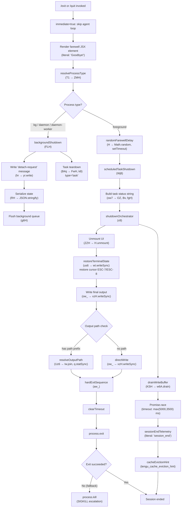

# `/exit`

> Analysis basis: CC v2.1.145 bundle.js (AST extraction + Claude interpretation)
> Minimum version: v2.1.145

---

## Overview

`/exit` (aliased as `/quit`) terminates the current Claude Code CLI session. It is classified as an `immediate` command, meaning it executes without requiring further agent processing; upon invocation it renders a farewell JSX element ("Goodbye!"), then orchestrates a graceful shutdown sequence that flushes pending I/O, tears down background daemon connections, kills child processes, and finally calls `process.exit`.

---

## Registration

| Field | Value |
|---|---|
| type | `local-jsx` |
| name | `exit` |
| description | `null` |
| aliases | `["quit"]` |
| immediate | `true` |
| module_id | `LVq` |
| load_inline | `true` |
| loc_byte | `11694389` |
| loc_byte_end | `11694550` |
| loc_line | `7216` |
| arbor_handler.name | `GC7` |
| arbor_handler.fqn | `claude-2.1.145::GC7` |
| arbor_handler.kind | `AsyncFunction` |
| arbor_handler.resolution_path | `module_id` |
| arbor_handler.n_hits | `1` |

Analysis basis: CC v2.1.145 bundle.js:+11694389

---

## Input Branching

The command has more than three distinct execution paths (normal foreground exit, daemon/background-session teardown, process-kill escalation, and abort/timeout race), so a Mermaid flowchart is used.



Analysis basis: CC v2.1.145 bundle.js:+11693638, +11693650, +11693654, +11693671, +11693685, +11693715, +11693821

---

## Behavioral Spec

### 1. Handler Entry (`GC7` — `exitCommandHandler`)

The async handler is resolved via `module_id` → `LVq`. Arbor confirms a single hit (`n_hits: 1`). On invocation it immediately:

1. Calls `resolveProcessType` (identifier `T1`) to determine whether the current process is a background daemon variant.
2. Calls `randomFarewellDelay` (identifier `H`) for any cosmetic delay.
3. Calls `backgroundShutdownIfNeeded` (identifier `FLH`).
4. Reads scheduled-task state via `readScheduledTasks` (identifier `qM`).
5. Builds the task-status display string via `buildTaskStatusDisplay` (identifier `Wj8`).
6. Creates a `cg_.createElement` JSX node (the farewell UI element).
7. Calls `shutdownOrchestrator` (identifier `x9`) and awaits it.
8. Emits `prompt_input_exit` telemetry literal (bundle.js:+11693826).

Analysis basis: CC v2.1.145 bundle.js:+11693638–11693821

```
async function exitCommandHandler(context):
    processType  = resolveProcessType()          // T1
    farewell     = renderFarewellElement()        // cg_.createElement, literal "Goodbye!"
    if processType in ["bg","daemon","daemon-worker"]:
        backgroundShutdownIfNeeded()             // FLH
    taskStatus   = buildTaskStatusDisplay()      // Wj8
    await shutdownOrchestrator(taskStatus)       // x9
    emit("prompt_input_exit")
```

---

### 2. Process-Type Resolution (`T1` → `ZMH`)

Determines the runtime role of the current process by inspecting an internal role store (`ZMH`). Recognized values are the string literals `"bg"`, `"daemon"`, and `"daemon-worker"` (bundle.js:+2173475, +2173485, +2173499).

```
function resolveProcessType():
    role = processRoleStore.get()   // ZMH
    return role   // one of "bg" | "daemon" | "daemon-worker" | foreground
```

Analysis basis: CC v2.1.145 bundle.js:+2173552

---

### 3. Farewell Delay (`H`)

Generates a small cosmetic delay using `Math.random` (range 0–2, step 1) and `setTimeout`. The numeric literals `2` and `1` appear at bundle.js:+12704956 and +12704972.

```
function randomFarewellDelay():
    delay = Math.floor(Math.random() * 2) + 1   // 1 or 2 units
    await setTimeout(delay)
```

Analysis basis: CC v2.1.145 bundle.js:+12704958, +12704995

---

### 4. Background Shutdown (`FLH`)

When the process is a background/daemon variant, this routine:

1. Calls `daemonTaskTeardown` (`B4q`) — iterates active tasks of type `"task"` (literal bundle.js:+10158016), calling `FwH` and `k8` on each.
2. Writes a `"detach-request"` message (literal bundle.js:+10163423) to the daemon channel via `hr` → `yr.write`.
3. Serialises state with `RH` → `JSON.stringify`.
4. Flushes the daemon queue via `g6H`.

```
function backgroundShutdownIfNeeded():
    for task in activeTasks where task.type == "task":
        daemonTaskTeardown(task)      // B4q → FwH, k8
    channel.write("detach-request")  // hr → yr.write
    payload = JSON.stringify(state)  // RH
    daemonQueueFlush()               // g6H
```

Analysis basis: CC v2.1.145 bundle.js:+10163389, +10163408, +10163414, +10163469

---

### 5. Scheduled-Task Status Display (`Wj8` / `ow7`)

Builds the human-readable status string shown before exit for any background scheduled tasks:

- `z0` → `IV`: resolves the display format reference.
- `ow7` → `OZ`: formats each task entry. The label `"scheduled task"` (literal bundle.js:+10156935) is used as the display category.
- `Bv` → `l14`: parses cron-like schedule strings; numeric literals `3`, `6` indicate weekday range constants.
- `fgH`: computes the next-run time using `Date` arithmetic (`setSeconds`, `setMinutes`, `setHours`, `setDate`, `setMonth`, `getDay`, etc.).
- `x1`: formats time-until values using `Math.floor` / `Math.round`.
- `Lq` / `$8` / `t9`: handle terminal width measurement via `Bun.stringWidth` for alignment.

```
function buildTaskStatusDisplay():
    tasks = getScheduledTasks()
    lines = []
    for task in tasks:
        schedule  = parseSchedule(task.schedule)    // Bv, l14
        nextRun   = computeNextRun(schedule)        // fgH
        timeUntil = formatDuration(nextRun - now)   // x1
        width     = measureTerminalWidth(timeUntil) // Lq, $8, t9
        lines.push(pad("scheduled task", width) + timeUntil)
    return lines.join("\n")
```

Analysis basis: CC v2.1.145 bundle.js:+10156916, +10156935, +10156962, +10157048, +10157065, +10157081, +10157140

---

### 6. Shutdown Orchestrator (`x9`)

This is the central async shutdown function. It coordinates all teardown steps:

1. **Unmount UI** (`ZZH`): calls `H.unmount`, writes `xzH.writeSync`, retrieves state via `Z4.get`, calls `Gh` and `us6`.
2. **Restore terminal** (`us6`): writes ANSI escape sequences ESC-7 (`\x1b7`) and ESC-8 (`\x1b8`) via `wt.writeSync` to restore saved cursor position (bundle.js:+3672525, +3672536). Calls `bGH` (terminal-capability detection for Ghostty ≥1.2.0, iTerm.app ≥3.6.6, tmux, screen) and `hGH`, `Q0` (handles tmux double-escape `\x1b\x1b` replacement, bundle.js:+3330413).
3. **Write final output** (`ow_`): resolves output path (`Uz6` → `Iw.join`, `q.statSync`), escapes backslashes and double-quotes (literals `"\\\\"` and `"\\\""`, bundle.js:+5256103, +5256126), writes with `xzH.writeSync`, applies dim styling (`M6.dim`).
4. **Drain write buffer** (`KSH` → `w6A.drain`).
5. **Session-end telemetry** (`Y` + `dH6`): fires `"session_end"` (literal bundle.js:+5258328). Also calls `_JH` (session summary writer), `Wkq` (stats formatter), and updates supervisor state (`V.stop`, `V.updateConfig`, `V.start`).
6. **Cache eviction hint**: emits `tengu_cache_eviction_hint` event.
7. **Abort/timeout race** (`Promise.race`, `AbortSignal.timeout`): maximum wait is `Math.max(5000, 3500)` = 5000 ms (literals bundle.js:+5257957, +5257964).
8. **Startup profiling flush** (`V86` → `rk8` → `PAA`): writes startup profiling report if enabled; uses `perf_hooks` `require`, `"startup-perf"` label, `"mark"` events, file sync-write via `Z_H` (`E_H.openSync`, `writeFileSync`, `fsyncSync`, `closeSync`). Limit: 1 048 576 bytes (literal bundle.js:+211431).
9. **Hard exit** (`aw_`): clears any pending timeout, calls `process.exit`; if the process does not exit, escalates with `process.kill` (fallback SIGKILL path; literal `"unreachable"` at bundle.js:+5256465).

```
async function shutdownOrchestrator(taskStatusLines):
    unmountUI()                          // ZZH
    restoreTerminalCursor()             // us6 → wt.writeSync (ESC-7, ESC-8)
    resolvePath = resolveOutputPath()   // Uz6
    writeOutputToTerminal(taskStatusLines, resolvePath)  // ow_
    await drainWriteBuffer()            // KSH → w6A.drain
    await Promise.race([
        sessionEndSequence(),           // Y, _JH, Wkq, dH6
        AbortSignal.timeout(5000)
    ])
    emitCacheEvictionHint()             // tengu_cache_eviction_hint
    flushStartupProfilingIfEnabled()    // V86 → rk8 → PAA
    hardExit()                          // aw_ → process.exit / process.kill
```

Analysis basis: CC v2.1.145 bundle.js:+5257860, +5257928, +5257934, +5257940, +5257948, +5257957, +5257964, +5257973, +5258053, +5258077, +5258131, +5258154, +5258202, +5258219, +5258255, +5258268, +5258280, +5258291, +5258371, +5258397

---

### 7. Session-End Summary (`Y` / `_JH`)

`Y` performs a final summary write:

- `_JH` retrieves session context (`Q1` → `yoL.getStore`), formats metrics (`A8`, `Yd_`, `GH` → `String`), iterates output keys (`Object.keys`), checks pending items (`K.has`).
- `Wkq` formats the statistics table using `Object.keys`, `Math.max` for column width, and `TO` for rendering.
- Stops, reconfigures, and restarts the supervisor (`V.stop`, `V.updateConfig`, `V.start`).
- Updates heartbeat state (`y1K` → `is`, literal `"heartbeat"`).
- Writes via `q.write` with `"supervisor"` label (literal bundle.js:+14668720).
- Emits `tengu_daemon_config_reload` (bundle.js:+14669513).

Analysis basis: CC v2.1.145 bundle.js:+14668695, +14668712, +14668914, +14668968, +14668988, +14669108, +14669117, +14669135, +14669237, +14669282, +14669293, +14669511, +14669513

---

### 8. Hard Exit (`aw_`)

```
function hardExit():
    clearTimeout(pendingTimer)
    appState = Z4.get()
    process.exit(0)
    // Fallback — should be unreachable:
    process.kill(process.pid, "SIGKILL")
    throw new Error("unreachable")
```

Analysis basis: CC v2.1.145 bundle.js:+5256311, +5256344, +5256392, +5256417, +5256459, +5256465

---

## State & Side Effects

| Item | Detail |
|---|---|
| Telemetry — `tengu_bg_dispatch_sigkill_escalate` | Fired when a background process requires SIGKILL escalation (bundle.js:+14655330) |
| Telemetry — `tengu_bg_dispatch_low_mem` | Fired when low-memory condition detected during background dispatch (bundle.js:+14655909) |
| Telemetry — `tengu_bg_spare_enable` | Fired when spare background session enabled (bundle.js:+14656548) |
| Telemetry — `tengu_bg_spare_claim` | Fired when spare session claimed (bundle.js:+14656669) |
| Telemetry — `tengu_bg_spare_claim_fail` | Fired when spare session claim fails (bundle.js:+14656932) |
| Telemetry — `tengu_bg_spare_spawn` | Fired when spare session spawned (bundle.js:+14655107) |
| Telemetry — `tengu_daemon_config_reload` | Fired after supervisor config is updated during shutdown (bundle.js:+14669513) |
| Telemetry — `tengu_startup_perf` | Fired when startup profiling report is flushed (bundle.js:+211777) |
| Telemetry — `tengu_scroll_summary` | Fired as part of shutdown summary output (bundle.js:+5257260) |
| Telemetry — `tengu_amber_creek` | Fired by fullscreen/terminal-mode detection during teardown (bundle.js:+3338751) |
| Telemetry — `tengu_pewter_brook` | Fired by fullscreen/terminal-mode detection during teardown (bundle.js:+3338659) |
| Telemetry — `tengu_cache_eviction_hint` | Fired at end of session to hint cache eviction (bundle.js:+5258293) |
| Literal event — `session_end` | Written as part of final session-end output (bundle.js:+5258328) |
| Literal event — `prompt_input_exit` | Emitted immediately on command invocation (bundle.js:+11693826) |
| Terminal state | ESC-7 / ESC-8 cursor save/restore sequences written to stdout (bundle.js:+3672525, +3672536) |
| UI unmount | Ink/React component tree unmounted via `H.unmount` (bundle.js:+5255792) |
| Process exit | `process.exit` called; escalates to `process.kill` with SIGKILL if needed (bundle.js:+5256392, +5256417) |
| Background tasks | Active tasks of type `"task"` are torn down before disconnect (bundle.js:+10158016) |
| Daemon channel | `"detach-request"` message sent on daemon channel (bundle.js:+10163423) |
| Write buffer drain | Awaited via `w6A.drain` with up to 5000 ms timeout (bundle.js:+57310, +5257957) |
| Startup profiling file | Written synchronously (`E_H.openSync` → `writeFileSync` → `fsyncSync` → `closeSync`) if profiling enabled; max 1 048 576 bytes (bundle.js:+211431) |
| appState changes | Supervisor stopped, config updated, restarted; session map updated (`f.get`, `f.set`, `f.delete`) |
| Sound | <!-- TODO: not found in depth-2 traversal; needs --depth 4 --> |

---

## Version History

| Version | Change |
|---|---|
| v2.1.145 | Initial analysis |

---

## Common Mistakes

1. **Using `/exit` during an active agent turn**: because `immediate: true` bypasses the agent loop, invoking `/exit` mid-response will hard-terminate without waiting for the agent to finish. Unsaved partial output may be lost.
2. **Expecting instant termination in daemon mode**: when the process type is `"daemon"` or `"daemon-worker"`, the shutdown path sends a `"detach-request"` and drains the background queue before exiting. This can add a noticeable delay.
3. **Confusing `/quit` and `/exit`**: both are identical — `"quit"` is registered as an alias. There is no behavioral difference.
4. **Relying on the 5 000 ms drain window**: the `Promise.race` timeout is at most 5 000 ms (bundle.js:+5257957). Any pending async writes not completed within this window will be abandoned before `process.exit` is called.
5. **Running inside tmux with iTerm2 integration**: the terminal-restore path detects `tmux -CC` mode and emits a specific fullscreen-disabled warning, and the double-escape sequence (`\x1b\x1b`) is rewritten for tmux compatibility (bundle.js:+3330413). Unexpected terminal state may result if this environment is not accounted for.

---

## Appendix — Identifier Mapping

> For bundle debugging only. Identifiers change across versions.

| Identifier | Role |
|---|---|
| `GC7` | `exitCommandHandler` — main async handler for `/exit` |
| `T1` | `resolveProcessType` — reads current process role |
| `ZMH` | `processRoleStore` — internal store holding the process role string |
| `H` | `randomFarewellDelay` / also used as generic container in multiple call sites |
| `FLH` | `backgroundShutdownIfNeeded` — daemon/bg teardown routine |
| `dg6` | `daemonChannelGet` — retrieves daemon channel reference |
| `B4q` | `daemonTaskTeardown` — tears down individual background tasks |
| `FwH` | `taskFlush` — flushes a single task |
| `k8` | `taskKill` — kills a single task |
| `hr` | `daemonChannelWrite` — writes to the daemon channel |
| `RH` | `jsonSerialize` — thin wrapper around `JSON.stringify` |
| `g6H` | `daemonQueueFlush` — flushes the daemon message queue |
| `qM` | `readScheduledTasks` — reads active scheduled tasks |
| `Wj8` | `buildTaskStatusDisplay` — builds pre-exit task status string |
| `z0` | `displayFormatResolver` — resolves display format reference (`IV`) |
| `IV` | `internalFormatRef` — format/layout reference |
| `ow7` | `formatTaskEntry` — formats a single task entry for display |
| `OZ` | `formatScheduleLabel` — formats schedule description (parses cron-style) |
| `K` | `columnPadder` — pads column strings for alignment |
| `w` | `processStatusCollector` — collects process status, memory, and subprocess info |
| `L` | `pendingPromiseTracker` — tracks pending promise set (add/delete/finally) |
| `j` | `subprocessKillIterator` — iterates and kills subprocesses on exit |
| `D` | `disposalChain` — disposes resources recursively |
| `$` | `matchGroupExtractor` — extracts regex match groups |
| `J` | `dateCalculator` — performs UTC date arithmetic for next-run computation |
| `Bv` | `scheduleParser` — parses a schedule string into structured fields |
| `l14` | `cronFieldParser` — parses individual cron fields (split, match, parseInt, Set) |
| `A` | `lowerCaseNormalizer` — lowercases identifiers; also generic array in some contexts |
| `fgH` | `nextRunComputer` — computes next scheduled run time using Date methods |
| `O` | `dateTimeContainer` — wraps a Date for mutation; also used for background session state |
| `f` | `sessionMap` — map of active sessions (get/set/delete); also `A.close` / `q.close` |
| `q` | `fileSystemRef` — `fs`-style object (`statSync`, `unlinkSync`, etc.) |
| `x1` | `durationFormatter` — converts millisecond durations to human strings |
| `Lq` | `terminalLineWrapper` — wraps lines to terminal width using `indexOf`/`substring` |
| `$8` | `stringWidthMeasurer` — measures display width via `Bun.stringWidth` |
| `t9` | `wrappedWidthHelper` — helper combining `$8` and `Oz` for wrapped-line width |
| `Oz` | `unicodeWidthFallback` — fallback Unicode width computation |
| `WC7` | `farewellElementFactory` — creates the farewell JSX element |
| `x9` | `shutdownOrchestrator` — central async shutdown coordinator |
| `ZZH` | `uiUnmounter` — unmounts the Ink UI and writes final sync bytes |
| `Gh` | `ghosttyCapabilityCheck` — checks Ghostty terminal capabilities |
| `us6` | `terminalStateRestorer` — writes ESC cursor-restore sequences |
| `bGH` | `terminalEmulatorDetector` — detects Ghostty/iTerm/tmux/screen |
| `hGH` | `terminalModeHandler` — handles terminal mode edge cases |
| `Q0` | `tmuxEscapeRewriter` — rewrites tmux double-escape sequences |
| `xH` | `stringCoercer` — coerces value to `String` |
| `ow_` | `finalOutputWriter` — writes final output to terminal with path resolution |
| `kV` | `outputPathKey` — key for output path lookup |
| `zR` | `outputRedirectResolver` — resolves output redirection target |
| `k6` | `pathExistsChecker` — checks path existence via `IV` |
| `Uz6` | `outputPathResolver` — resolves and joins output path; `statSync` check |
| `tU` | `pathJoinHelper` — joins path segments |
| `q_` | `dirExistsHelper` — checks directory existence |
| `U6` | `mkdirHelper` — creates directory if needed |
| `t3` | `pathResolvePipeline` — pipeline combining `k6` and `jL` |
| `jL` | `canonicalPathResolver` — resolves canonical path via `h9` |
| `Fq1` | `dimStyleApplier` — applies dim terminal styling |
| `aw_` | `hardExitExecutor` — calls `process.exit`, escalates to `process.kill` |
| `KSH` | `writeBufferDrainer` — drains `w6A` write buffer |
| `Y` | `sessionEndSequence` — writes session-end summary and updates supervisor |
| `_JH` | `sessionSummaryWriter` — composes and writes the session summary |
| `Q1` | `asyncStoreGetter` — retrieves current async-local-storage context |
| `A8` | `metricAccumulator` — accumulates session metrics |
| `Yd_` | `summaryFieldFormatter` — formats individual summary fields |
| `GH` | `stringFormatter` — wraps `String()` for safe coercion |
| `Wkq` | `statsTableFormatter` — formats statistics as an aligned table |
| `T` | `inputEventStopper` — stops input events, calls `x.preventDefault` |
| `YW` | `userSettingsUpdater` — updates `"userSettings"` / `"remoteControlAtStartup"` |
| `V` | `supervisorController` — controls supervisor (stop/updateConfig/start) |
| `y1K` | `heartbeatStateUpdater` — updates heartbeat state |
| `is` | `heartbeatWriter` — writes heartbeat entry |
| `Z` | `secondarySupervisor` — secondary supervisor started at end of shutdown |
| `d` | `genericDisposer` — generic resource disposal helper |
| `V86` | `startupProfilingFlusher` — flushes startup profiling report |
| `rk8` | `perfReportBuilder` — builds the perf report data structure |
| `sx` | `requireHelper` — thin wrapper around `require` (loads `perf_hooks`) |
| `PAA` | `profilingReportWriter` — writes profiling report to file |
| `GAA` | `profilingPathBuilder` — builds the profiling output path |
| `Z_H` | `syncFileWriter` — `openSync` → `writeFileSync` → `fsyncSync` → `closeSync` |
| `DAA` | `profilingDataFormatter` — formats profiling checkpoint data |
| `I` | `envVarFormatter` — formats environment variable entries for output |
| `L98` | `scrollSummaryEmitter` — emits `tengu_scroll_summary` and associated data |
| `Bq1` | `scrollMetricsCollector` — collects scroll metrics |
| `Uq1` | `scrollTimingCalculator` — calculates scroll timing using `Date.now`, `Math.max/round` |
| `mq1` | `scrollRateComputer` — computes scroll rate |
| `oA` | `fullscreenTeardown` — tears down fullscreen mode, emits amber-creek / pewter-brook |
| `OCH` | `fullscreenCapabilityChecker` — checks `VyK` for fullscreen support |
| `VK_` | `fullscreenRestorer` — restores pre-fullscreen terminal state |
| `_n` | `imLWrapper` — wraps `imL` for internal mode check |
| `ZK_` | `fullscreenDisabler` — disables fullscreen, coerces Boolean |
| `g_` | `guiContextChecker` — checks GUI context via `Gu` |
| `rmL` | `fullscreenCleanupChain` — chain that calls `Z6` to dispose resources |
| `Z6` | `resourceDisposalRegistry` — disposes registered resources (F56, g56, ls, etc.) |
| `dH6` | `cacheEvictionHintEmitter` — emits `tengu_cache_eviction_hint` |
| `f98` | `raceableShutdownStep` — wraps a shutdown step in `Promise.race` with 500 ms fallback |
| `g8` | `timedPromise` — creates a promise with `setTimeout`-based timeout and `clearTimeout` |

---

Note: index built via Arbor fallback; some signals (telemetry, literals) may be missing — see arbor-fallback.js.