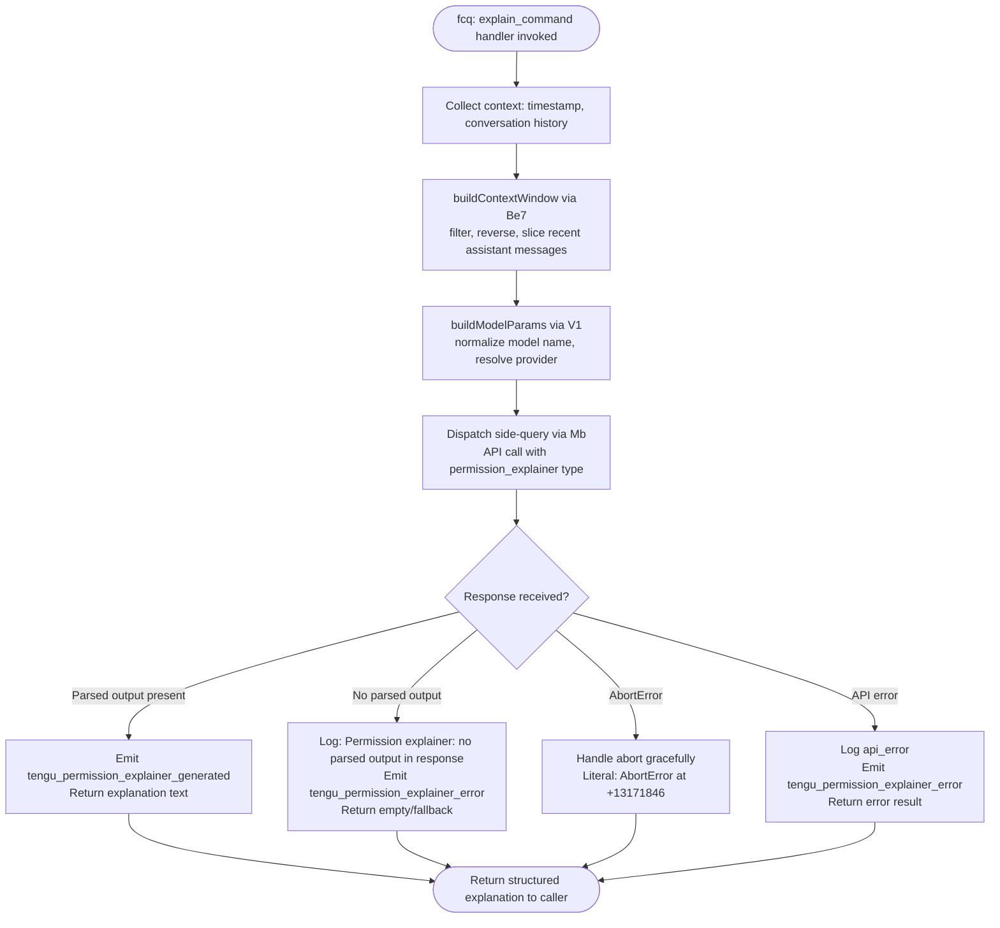

# `/explain_command`

> Analysis basis: CC v2.1.145 bundle.js (AST extraction + Claude interpretation)
> Minimum version: v2.1.145

---

## Overview

The `explain_command` slash command is a **tool-type** command that generates human-readable explanations for tool permission requests (the "permission explainer" feature). When invoked, it dispatches a side-query to the AI backend, collects recent conversation context, and returns a structured natural-language explanation of why a given tool or command requires a particular permission. It is used internally by the permission UI to surface justifications to the user.

---

## Registration

| Field | Value |
|---|---|
| type | `tool` |
| name | `explain_command` |
| description | `null` (not set in registration object) |
| loc_byte | `13170693` |
| loc_byte_end | `13170729` |
| loc_line | `9522` |
| arbor_handler.name | `fcq` |
| arbor_handler.fqn | `claude-2.1.145::fcq` |
| arbor_handler.kind | `AsyncFunction` |
| arbor_handler.resolution_path | `direct` |
| arbor_handler.n_hits | `1` |

Analysis basis: CC v2.1.145 bundle.js:+13170693

---

## Input Branching

The handler (`fcq`) has 4+ distinct branches based on call-graph and literal analysis: normal generation path, abort path, API error path, and a "no parsed output" fallback. A Mermaid flowchart is used.



---

## Behavioral Spec

### Main Handler: `fcq` (permissionExplainerHandler)

```
async function permissionExplainerHandler(toolInput, context):
    startTime = Date.now()                          // +13170412

    // Step 1: Load configuration
    config = loadConfig(context)                    // mr_ -> h6 -> R$H at +13170388

    // Step 2: Build recent conversation context window
    contextWindow = buildContextWindow(             // Be7 at +13170451
        messages = context.conversationHistory,
        strategy = {
            filterBy: "assistant",                  // literal "assistant" at +13169987
            maxMessages: 3,                         // literal 3 at +13170007
            truncateAfter: 1000,                    // literal 1000 at +13169952
            suffixIfTruncated: "...",               // literal "..." at +13170188
            contentType: "text"                     // literal "text" at +13170090
        }
    )

    // Step 3: Normalize model and build model params
    modelParams = buildModelParams(                 // V1 at +13170598
        modelName = resolveModelName(context),      // n1 inside V1 call graph
        providerConfig = context.provider
    )

    // Step 4: Dispatch side-query to AI backend
    result = await dispatchSideQuery(              // Mb at +13170611
        queryType = "side_query",                  // literal "side_query" at +12455843
        purpose = "permission_explainer",          // literal "permission_explainer" at +13170751
        contextWindow = contextWindow,
        modelParams = modelParams,
        abortSignal = context.abortSignal
    )

    // Step 5: Emit telemetry
    telemetry.emit("tengu_permission_explainer_generated", {  // +13171176
        durationMs: Date.now() - startTime,
        ...result.metrics
    })

    // Step 6: Parse and validate response
    if not result.parsedOutput:                    // literal at +13171523
        log("Permission explainer: no parsed output in response")
        telemetry.emit("tengu_permission_explainer_error")  // +13171388
        return fallbackExplanation()

    // Step 7: Return structured explanation
    return {
        type: "tool",                              // literal "tool" at +13170699
        name: "explain_command",                   // literal "explain_command" at +13170711
        explanation: result.parsedOutput
    }

exception AbortError:                              // literal "AbortError" at +13171846
    return abortedExplanation()

exception APIError:                                // literal "api_error" at +13171917
    telemetry.emit("tengu_permission_explainer_error")
    return errorExplanation(error)
```

Analysis basis: CC v2.1.145 bundle.js:+13170388

---

### Sub-feature: Config Loading (`h6` → `R$H` — configLoader)

```
function configLoader(configPath):
    // Guard: config must be accessed only after initialization
    if not configAccessAllowed:
        throw Error("Config accessed before allowed.")  // literal at +3169239

    // Read config file
    raw = fs.readFileSync(configPath, "utf-8")         // literal "utf-8" at +3169322
    parsed = JSON.parse(raw)                           // via u6 at +3169342

    // Handle prefix stripping on values via hR
    normalized = stripPrefix(parsed)                   // hR at +3169345

    // If ENOENT: return defaults
    if error.code == "ENOENT":                         // literal at +3169469
        return defaultConfig()

    // Backup management via Wv9 (backupManager)
    backupDir = path.join(configDir, "backups")        // literal "backups" at +3168807
    ensureBackupDirectory(backupDir)

    // Persist file stats
    stats = fs.statSync(configPath)                    // at +3169836

    // Copy to backup
    backupPath = path.join(backupDir, basename + Date.now())  // +3170366
    fs.copyFileSync(configPath, backupPath)                   // +3170384

    return parsed
```

Analysis basis: CC v2.1.145 bundle.js:+3166123

---

### Sub-feature: Context Window Builder (`Be7` — contextWindowBuilder)

```
function contextWindowBuilder(messages, options):
    // Filter to assistant messages only
    filtered = messages.filter(m => m.role == "assistant")  // "assistant" at +13169987

    // Reverse to get most-recent-first order
    reversed = filtered.reverse()                           // A.reverse at +13170032

    // Take up to maxMessages (3)
    recent = reversed.slice(0, 3)                          // literal 3 at +13170007

    // Join with separator, truncate if needed
    joined = recent.map(m => truncate(m.content, 1000))    // literal 1000 at +13169952
                   .join(separator)

    // Prepend "..." if content was truncated
    if wasTruncated:
        result = "..." + joined                            // literal "..." at +13170188

    return result
```

Analysis basis: CC v2.1.145 bundle.js:+13169964

---

### Sub-feature: Model Parameter Builder (`V1` → `ea` / `fF` — modelParamBuilder)

```
function modelParamBuilder(rawModelName, providerConfig):
    // Normalize model name (n1 — modelNameNormalizer)
    normalized = normalizeModelName(rawModelName)
    // Handles aliases: "opusplan", "sonnet", "haiku", "opus", "best"
    // Maps shorthand to canonical model IDs
    // literals: "opusplan" +2164357, "sonnet" +2164398, "haiku" +2164437,
    //           "opus" +2164476, "best" +2164513

    // Validate provider prefix
    if normalized.startsWith("anthropic."):         // literal "anthropic." at +2158503
        useDirectProvider()
    else if normalized.startsWith("claude-"):       // literal "claude-" at +2158124
        useDefaultProvider()

    // Check for Bedrock / Vertex / other provider via wA
    provider = resolveProvider(providerConfig)
    // Provider kinds: "bedrock" +2022501, "vertex" +2022709,
    //                 "foundry" +2022551, "mantle" +2022661,
    //                 "gateway" +2023190, "anthropicAws" +2023170

    return { model: normalized, provider: provider }
```

Analysis basis: CC v2.1.145 bundle.js:+2160497

---

### Sub-feature: Side-Query Dispatcher (`Mb` — sideQueryDispatcher)

```
async function sideQueryDispatcher(params):
    // Compute cache hash via Vl_ (SHA-256 hash of relevant inputs)
    cacheKey = sha256Hash(params)                          // Vl_ -> ZCq.createHash at +12410169

    // Check existing / build request
    requestBody = buildAnthropicRequest(params)            // iZH at +12456674

    // Set model prompt-cache control
    cacheControl = "1h"                                    // literal "1h" at +12456693
    // Telemetry: tengu_prompt_cache_1h_config             // +12416935

    // Dispatch via iu (anthropicClientCall)
    response = await anthropicClientCall(                  // iu at +12455811
        endpoint = "https://api.anthropic.com",            // literal at +2211595
        headers = {
            "User-Agent": ...,                             // literal at +2890106
            "X-Claude-Code-Session-Id": ...,               // literal at +2890124
            "x-client-app": ...,                           // literal at +2890248
            "x-claude-code-agent-id": ...,                 // literal at +2890282
        },
        body = requestBody,
        signal = AbortSignal.timeout(...)                  // OQ6 at +2211698
    )

    // Emit success telemetry
    tengu.emit("tengu_api_success", {                      // +12457294
        durationMs = performance.now() - startMark,
        ...responseMetrics
    })

    // Return parsed completion
    return parseCompletion(response)                       // bP at +12456878
```

Analysis basis: CC v2.1.145 bundle.js:+12455811

---

### Sub-feature: MCP Tool Identity Check (`R1` — mcpToolChecker)

```
function mcpToolChecker(toolName):
    // Check ownership via Object.hasOwn
    if Object.hasOwn(toolRegistry, toolName):              // +3120403
        // Distinguish mcp_tool vs built-in
        if toolName.startsWith("mcp_tool"):                // literal "mcp_tool" at +3120483
            return { kind: "mcp_tool" }
    return { kind: "builtin" }
```

Analysis basis: CC v2.1.145 bundle.js:+13171226

---

## State & Side Effects

| Item | Detail |
|---|---|
| Telemetry: `tengu_permission_explainer_generated` | Emitted on successful explanation generation (bundle.js:+13171176) |
| Telemetry: `tengu_permission_explainer_error` | Emitted when no parsed output or API error occurs (bundle.js:+13171388) |
| Telemetry: `tengu_api_success` | Emitted by underlying API client on HTTP success (bundle.js:+12457294) |
| Telemetry: `tengu_prompt_cache_1h_config` | Emitted when 1-hour prompt cache is configured for the side-query (bundle.js:+12416935) |
| Telemetry: `tengu_config_parse_error` | Emitted if config file parsing fails (bundle.js:+3169876) |
| Telemetry: `tengu_config_auth_loss_prevented` | Emitted when a config write that would lose auth credentials is blocked (bundle.js:+3164632) |
| Hook registration | `h9` → `w6A.register` (bundle.js:+57267): registers a file-watch hook during config load |
| Config file watch | `YxL` → `jo6.watchFile` / `jo6.unwatchFile` (bundle.js:+3165635, +3165962): watches config file for changes |
| Config backup | On each config read, a timestamped backup copy is written to `<configDir>/backups/` (bundle.js:+3170384) |
| appState changes | None observed at depth-2; command operates as a read-query with no direct UI state mutations |
| Sound | None observed |
| Network | Issues an HTTPS request to `https://api.anthropic.com` (or configured endpoint) via the Anthropic SDK client (bundle.js:+2211595) |
| OAuth token refresh | May trigger OAuth refresh via `GA_` if token is near expiry (bundle.js:+2930779) |

---

## Version History

| Version | Change |
|---|---|
| v2.1.145 | Initial analysis |

---

## Common Mistakes

1. **Assuming `/explain_command` is a user-facing chat command.** It is registered as type `tool`, not `prompt`. It is invoked programmatically by the permission UI subsystem, not directly by the user typing `/explain_command` in the REPL.
2. **Expecting a `description` field.** The `description` is `null` in the registration object (bundle.js:+13170693). Do not rely on it for help text or auto-complete hints.
3. **Conflating the "no parsed output" path with a hard error.** When the AI response lacks a parseable explanation, the handler emits `tengu_permission_explainer_error` and returns a fallback — it does not throw. Callers should check the return value rather than catching exceptions for this case.
4. **Ignoring the `AbortError` path.** The command respects an abort signal passed by the caller. If the user dismisses the permission dialog before the explanation is ready, the in-flight API call is cancelled cleanly.
5. **Expecting real-time streaming output.** The side-query result is collected as a completed response before being returned; there is no incremental streaming of the explanation text to the caller.

---

## Appendix — Identifier Mapping

> For bundle debugging only. Identifiers change across versions.

| Identifier | Role |
|---|---|
| `fcq` | Main async handler for `explain_command` (permissionExplainerHandler) |
| `mr_` | Config resolution helper called at handler entry |
| `h6` | Config file loader / watcher setup |
| `R$H` | Config file reader, parser, and backup writer |
| `Wv9` | Backup directory manager (reads dir, ensures existence) |
| `YxL` | File-watch lifecycle manager (watchFile / unwatchFile) |
| `h9` | Hook registration helper (`w6A.register`) |
| `u6` | JSON.parse wrapper |
| `hR` | String prefix stripper for config values |
| `A8` | Config value accessor/transformer |
| `qq_` | Backup path joiner |
| `Ue7` | Response serializer (JSON.stringify wrapper) |
| `Be7` | Context window builder (filter/reverse/slice/join) |
| `V1` | Model parameter builder entry point |
| `ea` | Model parameter assembly |
| `fF` | Provider / model name normalizer |
| `n1` | Model alias resolver (opusplan, sonnet, haiku, opus, best) |
| `MF6` | Model feature flags checker |
| `wuH` | Model include-list checker |
| `rH9` | Model index-of helper |
| `YzL` | Model string includes helper |
| `FAH` | Model include-list membership test |
| `DzL` | Model prefix validator |
| `jJ` | Model parameter wrapper |
| `iX` | Provider/model dispatch hub |
| `$A` | First-party provider config builder |
| `MF` | Max-plan provider config |
| `TMH` | Team-plan provider config |
| `PuH` | Enterprise provider config |
| `Av` | Provider abstraction layer |
| `CP` | Provider composition helper |
| `cM` | Provider config merger |
| `wA` | Bedrock/base provider builder |
| `PM` | Provider model resolver |
| `qv` | Provider query helper |
| `Mb` | Side-query dispatcher (main API dispatch) |
| `iu` | Anthropic API client call orchestrator |
| `fY` | Async store getter (context store) |
| `YkL` | Header x-app value splitter/parser |
| `T1` | Background session type resolver |
| `ZMH` | Session type constant map |
| `Ul` | Async store helper (H69 store) |
| `ug6` | H69 store getter |
| `k6` | Feature flag accessor |
| `IV` | Feature flag constant |
| `uo8` | URL encoder for headers |
| `xH` | String coercion helper |
| `XM` | OAuth token manager entry |
| `GA_` | OAuth token refresh orchestrator |
| `_69` | Boolean coercion helper |
| `LD` | Authentication loader / credential resolver |
| `RK` | Credential key resolver |
| `wv` | Auth provider router |
| `Q3` | Auth config query |
| `sj` | Auth credential sanitizer |
| `i$` | API key / OAuth token resolver |
| `S9H` | Auth header builder |
| `WO` | Workspace options accessor |
| `OkL` | Auth config option loader |
| `smH` | Auth session metadata builder |
| `E_` | Environment variable accessor |
| `Ap6` | Proxy auth helper executor |
| `N2H` | Proxy helper spawner |
| `UCA` | Proxy config resolver |
| `deK` | Integer parser with NaN guard |
| `gR` | Proxy credentials getter |
| `EP` | Error payload builder |
| `jkL` | HTTP request builder and dispatcher |
| `c7` | Content-type header setter |
| `JkL` | Request header redactor (authorization → `<opaque>`) |
| `wkL` | Stream watchdog setup |
| `KA_` | Retry limit calculator |
| `DkL` | Streaming response reader (byte watchdog + ReadableStream) |
| `iD` | Request body serializer |
| `LF6` | Body builder for JSON requests |
| `xML` | Content-type prefix checker |
| `KF6` | Model ID case-normalizer |
| `Wz` | Proxy config builder |
| `Kl` | Proxy URL parser |
| `Qb6` | Proxy credential resolver |
| `BCA` | Proxy Authorization header builder |
| `zkL` | Tool call / function-call assembler |
| `dn6` | Tool input processor |
| `yV` | Tool output formatter |
| `MSH` | Tool metadata helper |
| `vPH` | Tool prefix validator |
| `K9` | OAuth URL validator |
| `NMH` | Gateway token refresh orchestrator |
| `GI8` | Gateway refresh timer |
| `$YL` | Gateway token refresh POST dispatcher |
| `wI6` | Gateway refresh state tracker |
| `WI8` | Timestamp helper (Date.now wrapper) |
| `Q76` | Response header lowercaser |
| `J$H` | SDK error logger |
| `C` | Supervisor / daemon write stream manager |
| `R1K` | File realpath + stat resolver |
| `J55` | Daemon write helper |
| `z` | Daemon stream wrapper |
| `h` | Away-summary generator (blurred/focused logic) |
| `rF` | Away-summary sub-helper |
| `N` | Away-summary API call handler |
| `Z` | Away-summary state machine |
| `Lrq` | Away-summary rate-limit checker |
| `V` | Tool call permission gate |
| `aw` | API key / OAuth token resolver (alternate path) |
| `kuH` | WIF credentials resolver |
| `OQ6` | WIF token exchange HTTP call |
| `hH` | Feature ok reporter |
| `CH` | Feature bad reporter |
| `DYL` | WIF invalid_grant classifier |
| `T` | Remote control / terminal input handler |
| `x` | Terminal input processor |
| `YW` | User settings accessor |
| `Y` | Terminal session manager |
| `P` | Background daemon IPC client |
| `J` | Daemon job map |
| `Q5` | Daemon connection finisher |
| `t75` | Daemon protocol handler (main message dispatcher) |
| `e75` | Daemon event helper |
| `$` | Daemon output stream |
| `Tz` | PTY terminal type resolver |
| `ys_` | Daemon ack tracker |
| `f1K` | Daemon timeout / connection timer |
| `g8` | Promise-with-timeout helper |
| `X` | Daemon repaint orchestrator |
| `tG` | Terminal working-dir join helper |
| `l$` | File realpath normalizer |
| `x5H` | Line-by-line file reader |
| `a75` | Attach stall timer |
| `p` | Daemon write-throttle helper |
| `g6H` | Daemon resize helper |
| `JK` | Socket path joiner |
| `s75` | Daemon session respawn helper |
| `s` | Voice toggle silence timer |
| `u` | Daemon idle-exit timer |
| `e` | Voice focus silence timer |
| `W` | Skills batch emitter |
| `g` | MCP tool filter |
| `F` | Composite tool filter |
| `l` | Tool list filterer |
| `i` | Daemon input pipe |
| `c` | Daemon permission response handler |
| `DV6` | Daemon write/destroy helper |
| `G` | Daemon repaint session helper |
| `GH` | String coercion (to-String) wrapper |
| `V0H` | Model capability flags builder |
| `O1` | Model feature / content formatter |
| `tw` | Model string lowercaser / includes checker |
| `eI8` | Model feature extra helper |
| `bP` | Response text replacer / completion parser |
| `Kh` | Provider wA config shim |
| `tQ7` | Cache key finder (user / hash lookup) |
| `Vl_` | SHA-256 hash builder (`ZCq.createHash`) |
| `pg6` | Prompt cache header builder |
| `lq` | String coercion (lq → String) |
| `Go6` | Context builder (wA shim) |
| `iZH` | Request body assembler with cache-control |
| `oI8` | Cache annotation helper |
| `Z6` | Conversation context assembler |
| `F56` | Context item factory |
| `g56` | Context item transformer |
| `ls` | Context item serializer |
| `qo6` | Context dedup tracker |
| `aI8` | Context suffix checker |
| `BE` | Auth header builder (xH + zA_) |
| `zA_` | Auth wA config builder |
| `eCq` | Response metrics extractor |
| `an6` | Response post-processor |
| `nX` | Message mapper |
| `l3H` | Request final assembler |
| `au` | Config + session bootstrapper |
| `H8` | Session initializer (R$H + config merge) |
| `z5` | LD + h6 combined config loader |
| `R7H` | API response time recorder |
| `bEH` | Cache-control patch applier |
| `H44` | Cache-control header updater |
| `CEH` | Cache-control value builder |
| `dg` | Agent subtype resolver |
| `eL4` | Agent prefix parser |
| `H_8` | Agent ID transformer |
| `JO_` | String index/slice helper |
| `e1H` | Agent type prefix checker |
| `cH6` | Cache/context cleanup helper |
| `R1` | MCP tool ownership checker |
| `K8` | Error / fallback state reporter |
| `U6` | Config path resolver |
| `a1_` | Config schema validator |
| `NH` | Error logger with stack push |
| `d` | General error/debug helper |
| `I` | Log-level dispatcher (debug/error/warn) |
| `_` | Filesystem abstraction (statSync, readdirStringSync) |
| `cl` | Config change callback |
| `RH` | JSON.stringify wrapper |