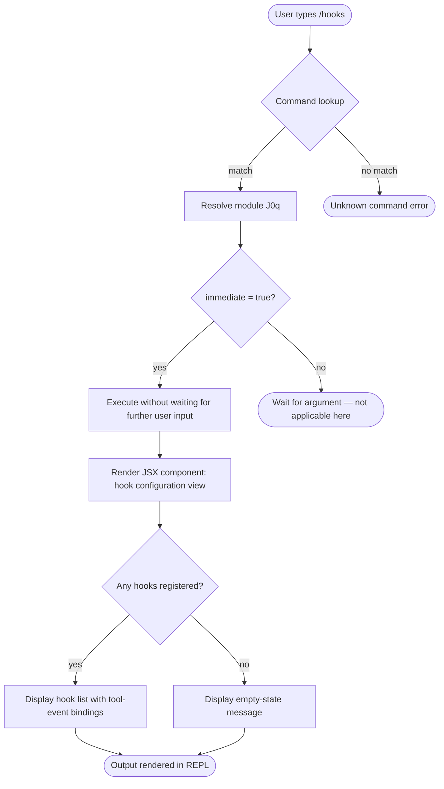

# `/hooks`

> Analysis basis: CC v2.1.144 bundle.js (AST extraction + Claude interpretation)
> Minimum version: v2.1.144

---

## Overview

The `/hooks` command displays the current hook configurations that have been registered for tool events within Claude Code. It is a read-only, immediate inspection command that renders its output as a JSX component directly in the REPL interface. No arguments are required or accepted.

---

## Registration

| Field | Value |
|---|---|
| type | `local-jsx` |
| name | `hooks` |
| description | `View hook configurations for tool events` |
| immediate | `true` |
| module\_id | `J0q` |

Analysis basis: CC v2.1.144 bundle.js:+11495201

---

## Input Branching

Because the AST traversal for module `J0q` did not resolve any entry functions at depth ≤ 2, the internal branching logic cannot be fully charted from extracted data alone. The following flowchart captures what can be inferred from the registration fields and the `local-jsx` command type contract.



<!-- TODO: not found in depth-2 traversal; needs --depth 4 -->
> The concrete branch conditions inside the JSX renderer (module `J0q`) were not reachable at the configured traversal depth. The flowchart above is derived from the `immediate: true` flag and the `local-jsx` type contract. A deeper traversal is required for full branch coverage.

---

## Behavioral Spec

### Command Dispatch

When the CLI resolves `/hooks`, it looks up a registered command whose `name` field equals `"hooks"` and whose `type` is `"local-jsx"`. Commands of this type are rendered as React/JSX components rather than producing plain-text output, meaning the result is displayed as a structured UI element within the terminal REPL.

```
function dispatchHooksCommand(userInput):
    cmd = lookupCommand(name = "hooks")
    if cmd is null:
        raise UnknownCommandError("/hooks")

    if cmd.immediate == true:
        // Execute immediately; do not prompt for additional arguments
        component = resolveModule(cmd.module_id)   // resolves J0q
        renderJSX(component, props = {})
    else:
        waitForArguments(cmd)   // not reached for this command
```

Analysis basis: CC v2.1.144 bundle.js:+11495201

### Immediate Execution Semantics

The `immediate: true` flag in the registration record means the command fires as soon as the user confirms the slash-command selection, without requesting any additional text input. This is consistent with the command's read-only, zero-argument design.

```
function handleImmediateCommand(cmd):
    // Called by the REPL input handler when a slash-command is confirmed
    if cmd.immediate == true:
        skipArgumentPrompt()
        return executeNow(cmd)
    else:
        return promptForArguments(cmd)
```

Analysis basis: CC v2.1.144 bundle.js:+11495201

### Hook Configuration Rendering

The JSX module (`J0q`) is responsible for reading the current hook configuration from application state and rendering it. Based on the command description (`"View hook configurations for tool events"`), the rendered output is expected to enumerate tool-event bindings that have been registered via the hooks system.

```
function renderHookConfigurationView(appState):
    hooks = appState.getHookRegistrations()

    if hooks is empty:
        return renderEmptyState(
            message = "No hooks configured."
        )
    else:
        return renderHookList(hooks)

function renderHookList(hooks):
    for each hook in hooks:
        renderHookEntry(
            event      = hook.toolEvent,
            handler    = hook.handlerPath,
            conditions = hook.conditions
        )
```

<!-- TODO: not found in depth-2 traversal; needs --depth 4 -->
> The exact field names, rendering order, and empty-state message text for the JSX component in module `J0q` were not recovered at depth ≤ 2. The pseudocode above is a structural inference from the command description and the `local-jsx` type contract.

---

## State & Side Effects

| Item | Detail |
|---|---|
| Telemetry | None detected at depth ≤ 2 traversal <!-- TODO: not found in depth-2 traversal; needs --depth 4 --> |
| Hook registration | Read-only; `/hooks` does not register, modify, or delete any hooks |
| appState changes | None; the command is a pure read of existing hook configuration state |
| Sound | None detected |
| Side effects | None; output is display-only within the REPL JSX renderer |

---

## Version History

| Version | Change |
|---|---|
| v2.1.144 | Initial analysis — command registered as `local-jsx`, `immediate: true`, module `J0q` |

---

## Common Mistakes

1. **Expecting argument support.** `/hooks` accepts no arguments. Because `immediate: true` is set, the REPL executes the command instantly; any trailing text typed after `/hooks` is not forwarded to the component.

2. **Confusing `/hooks` with a hook-editing interface.** This command is strictly a viewer. To add, modify, or remove hooks, use the appropriate configuration file or a dedicated settings interface — `/hooks` will only reflect changes already saved.

3. **Assuming plain-text output.** The `local-jsx` type means output is rendered as a structured JSX component. Attempting to pipe or redirect the output as plain text may produce unexpected results depending on terminal capabilities.

4. **Running `/hooks` before any hooks are configured and concluding the feature is broken.** If no hooks have been registered, the command renders an empty state rather than an error; an empty list is normal behavior.

5. **Expecting telemetry confirmation.** No `tengu_*` telemetry events were found for this command at the analyzed traversal depth, so there is no observable analytics side-effect to rely on for debugging invocation.

---

## Appendix — Identifier Mapping

> For bundle debugging only. Identifiers change across versions.

| Identifier | Role |
|---|---|
| `J0q` | Module ID for the `/hooks` command JSX renderer (not a mangled runtime identifier, but recorded here as the only module reference found in the registration object) |

> No obfuscated runtime function identifiers (`mw8`-style) were recovered for this command at depth ≤ 2. A deeper traversal (`--depth 4` or greater) targeting module `J0q` is required to populate this table fully.
> <!-- TODO: not found in depth-2 traversal; needs --depth 4 -->