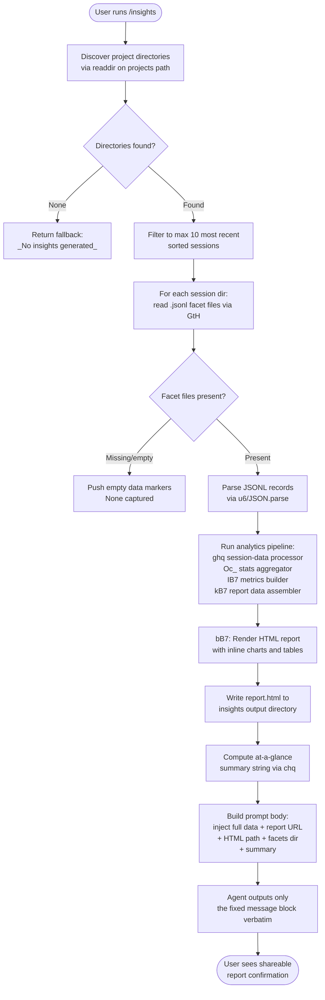

# `/insights`

> Analysis basis: CC v2.1.145 bundle.js (AST extraction + Claude interpretation)
> Minimum version: v2.1.145

---

## Overview

`/insights` generates a shareable HTML usage report that aggregates and analyzes the user's Claude Code session data. When invoked, the command collects session facets from disk, computes an at-a-glance summary, writes an `report.html` file, and instructs the agent to present a fixed confirmation message directing the user to the generated report. The user sees only the pre-composed message; the raw analytics data and report path are injected into the prompt for context only.

---

## Registration

| Field | Value |
|---|---|
| type | `prompt` |
| name | `insights` |
| description | `Generate a report analyzing your Claude Code sessions` |
| loc_byte | `12159352` |
| loc_byte_end | `12160656` |
| loc_line | `8871` |
| handler_method | `getPromptForCommand` |
| handler_method_start | `12159526` |
| handler_method_end | `12160655` |
| prompt_body.length | `513` |
| prompt_body.trace | `call→chq(...) (1 literals)` |
| arbor_handler.name | `getPromptForCommand` |
| arbor_handler.kind | `Method` |
| arbor_handler.fqn | `claude-2.1.145::getPromptForCommand` |
| arbor_handler.resolution_path | `direct` |
| arbor_handler.n_hits | `1` |

Analysis basis: CC v2.1.145 bundle.js:+12159352

---

## Input Branching

The command has 3+ distinct execution branches (session discovery, data processing, report generation, and output path selection), so a Mermaid flowchart is used.



---

## Behavioral Spec

### Top-Level Handler: `getPromptForCommand`

The handler is an inline `ObjectMethod` on the registration object (resolved via Arbor `direct` path). It calls the session-data collector (`dhq`) and then formats the prompt body via `chq`.

```
function getPromptForCommand(context):
    // Phase 1: collect and process session data
    sessionReport = collectInsightsData(context)   // dhq

    // Phase 2: compute at-a-glance summary
    summary = formatAtAGlanceSummary(sessionReport)  // chq

    // Phase 3: build the prompt body (513 chars)
    // Injects: full insights data, report URL, HTML file path,
    // facets directory, at-a-glance summary.
    // Instructs agent to output ONLY the <message>…</message> block verbatim.
    promptText = buildPromptBody(sessionReport, summary)

    return { prompt: promptText }
```

Analysis basis: CC v2.1.145 bundle.js:+12159526

---

### Session Directory Discovery: `sessionDirectoryScanner` (`uB7`)

Scans the `projects` subdirectory of the Claude data root for session directories.

```
function sessionDirectoryScanner(rootPath):
    projectsPath = pathJoin(rootPath, "projects")   // literal "projects" :+3199241
    entries = fs.readdir(projectsPath)
    dirs = entries.filter(entry => entry.isDirectory())

    // Batch in groups of 10/9 for concurrent processing
    // limits: batchSize=10, concurrency=9  :+12146277, :+12146282
    // top-N cap: 50 sessions max, slice to 200 candidates
    // literals 50 :+12146419, 200 :+12146424

    // Use setImmediate to yield between batches :+12146307
    sorted = dirs.sort(byModificationTime)
    return sorted
```

Analysis basis: CC v2.1.145 bundle.js:+12146008

---

### Facet File Reader: `facetFileReader` (`GtH`)

Reads `.jsonl` files from a single session's facets directory and collects their stat metadata.

```
function facetFileReader(sessionDir):
    entries = fs.readdir(sessionDir)

    // Filter to files whose name passes the JSONL pattern test (Pi/y04.test)
    // extension filter: ".jsonl"  :+12226603
    jsonlFiles = entries.filter(e => e.isFile() && isJsonlFilename(e))

    fileStats = []
    for each file in jsonlFiles:
        basename = path.basename(file)           // Iw.basename :+12226631
        fullPath = path.join(sessionDir, file)   // Iw.join :+12226705
        stat     = await fs.stat(fullPath)       // gL.stat :+12226806
        fileStats.push({ name: basename, path: fullPath, stat })

    return await Promise.all(fileStats)          // :+12226738
```

Analysis basis: CC v2.1.145 bundle.js:+12226497

---

### Session Data Collector: `sessionDataCollector` (`dhq`)

Orchestrates reading session-level data files, then routes each session through the analytics pipeline.

```
async function sessionDataCollector(options):
    // 1. Discover session directories (uB7)
    sessionDirs = await sessionDirectoryScanner(dataRoot)

    // 2. Slice to most-recent N sessions :+12146473
    recentDirs = sessionDirs.slice(0, limit)

    // 3. For each dir, read usage-data and session-meta files (ZB7)
    sessionRecords = await Promise.all(
        recentDirs.map(dir => readSessionFiles(dir))   // ZB7
    )

    // 4. Parse session metadata (Oc_)
    parsedSessions = sessionRecords.map(parseSessionRecord)  // Oc_

    // 5. Build facets data (CW8)
    facetsData = await buildFacetsData(parsedSessions)  // CW8

    // 6. Compute per-session analytics (IB7)
    analyticsData = computeAnalytics(facetsData)        // IB7

    // 7. Assemble full report data object (kB7)
    reportData = assembleReportData(analyticsData)      // kB7

    // 8. Generate HTML report (bB7) → writes "report.html" :+12148657
    htmlPath = await generateHtmlReport(reportData)     // bB7

    // 9. Write output files to insights directory (VB7, EB7)
    await writeInsightsOutputFiles(reportData, htmlPath)

    return { reportData, htmlPath, facetsDir }
```

Analysis basis: CC v2.1.145 bundle.js:+12146400

---

### Session File Reader: `sessionFileReader` (`ZB7`)

Reads the two canonical per-session data files: `usage-data` and `session-meta`.

```
async function sessionFileReader(sessionDir):
    // Resolve usage-data path via lT6 helper
    usageDataPath = resolveSubPath(sessionDir, "usage-data")   // literal :+12085795
    // Resolve session-meta path via Mc_ helper
    sessionMetaPath = resolveSubPath(sessionDir, "session-meta")  // literal :+12085891

    rawUsage = await fs.readFile(usageDataPath, "utf-8")       // :+12091926
    parsed   = safeJsonParse(rawUsage)                         // u6 → JSON.parse :+182358

    return { usageData: parsed, sessionMetaPath, sessionDir }
```

Analysis basis: CC v2.1.145 bundle.js:+12091859

---

### Session Record Parser: `sessionRecordParser` (`Oc_`)

Parses raw session records into a normalized form, computing durations and rounding values.

```
function sessionRecordParser(rawRecord):
    parsed = parseSessionData(rawRecord)          // ghq
    stats  = computeSessionStats(parsed)          // OM helper

    // Duration rounded :+12088619
    stats.durationMinutes = Math.round(stats.rawSeconds / 60)

    // Trim whitespace from string fields :+12088827
    stats.summary = stats.summary.trim()

    return stats
```

Analysis basis: CC v2.1.145 bundle.js:+12088565

---

### Raw Session Data Parser: `rawSessionDataParser` (`ghq`)

Walks individual JSONL records, classifies tool uses, and accumulates per-session metrics.

```
function rawSessionDataParser(records):
    result = { tools: {}, errors: [], timeline: [], commits: 0, pushes: 0 }

    for each record in records:
        // Detect tool-use records
        if Array.isArray(record) and record starts with expected prefix:
            toolName = classifyTool(record)    // checks Edit, Write, WebSearch, WebFetch :+12086619

            // Accumulate file-edit events
            if toolName in ["Edit", "Write"]:
                result.tools[toolName]++

            // Detect git commit / git push :+12086875, :+12086907
            if record contains "git commit": result.commits++
            if record contains "git push":   result.pushes++

        // Classify error outcomes
        if isErrorRecord(record):
            reason = classifyError(record)
            // Categories: Command Failed, User Rejected, Edit Failed,
            //   File Changed, File Too Large, File Not Found :+12087506–12087902
            result.errors.push(reason)

        // Timestamp bucketing for time-of-day chart
        if record has valid timestamp:
            hour = new Date(record.timestamp).getHours()
            bucket = mapHourToBucket(hour)
            // Buckets: Morning(6-12), Afternoon(12-18),
            //          Evening(18-24), Night(0-6) :+12103418–12103571
            result.timeline.push({ bucket, hour })

    return result
```

Analysis basis: CC v2.1.145 bundle.js:+12086329

---

### Analytics Metrics Builder: `analyticsMetricsBuilder` (`IB7`)

Produces structured metric objects for the report, including response-time histograms and token counts.

```
function analyticsMetricsBuilder(sessions):
    metrics = {
        responseTimes: {},
        tokenUsage:    {},
        toolFrequency: {},
        peakHours:     {}
    }

    for each session in sessions:
        // Response-time bucketing
        // Buckets: 2-10s, 10-30s, 30s-1m, 1-2m, 2-5m, 5-15m, >15m
        // Thresholds 120s :+12102790, 900s :+12102872
        bucketResponseTime(session.responseMs, metrics.responseTimes)

        // Accumulate token counts via Qhq helper
        accumulateTokens(session.tokens, metrics.tokenUsage)  // Qhq :+12097455

        // Sort tools by frequency
        rankTools(session.tools, metrics.toolFrequency)

    // Math.floor for percentile :+12097190
    // Math.round for averages   :+12097369
    return metrics
```

Analysis basis: CC v2.1.145 bundle.js:+12095188

---

### Report Data Assembler: `reportDataAssembler` (`kB7`)

Converts raw analytics into the final data object passed to the HTML renderer, capping token context at 4096.

```
async function reportDataAssembler(analyticsData):
    // Load per-session facet snapshots (Bhq)
    facetSnapshots = await Promise.all(
        analyticsData.sessions.map(s => loadFacetSnapshot(s))  // Bhq :+12098981
    )

    // Context token cap: 4096 :+12093301
    trimmedData = trimToTokenBudget(facetSnapshots, 4096)

    // Build at_a_glance summary key :+12099597
    atAGlance = buildAtAGlanceSummary(trimmedData)

    // Round percentages :+12098516
    percentages = Object.entries(trimmedData).map(
        ([k, v]) => [k, Math.round(v * 100)]
    )

    return { trimmedData, atAGlance, percentages }
```

Analysis basis: CC v2.1.145 bundle.js:+12098051

---

### HTML Report Generator: `htmlReportGenerator` (`bB7`)

Renders the full HTML report string with inline charts.

```
function htmlReportGenerator(reportData):
    // HTML-escape all user-facing strings (e5 / r7)
    // Replacements: &amp; &lt; &gt; &quot; &apos; :+4638250–4638373

    sections = []

    // Tool-usage section (R4H) :+12140213
    // Chart colors: #2563eb, #0891b2, #10b981, #8b5cf6 :+12140235–12140688
    sections.push(renderToolUsageSection(reportData))

    // Error breakdown section (SB7) :+12140905
    // Error color: #dc2626 :+12143951
    // Fallback: "<p class='empty'>No tool errors</p>" :+12143962
    sections.push(renderErrorSection(reportData))

    // Response-time histogram (RB7) :+12143738
    sections.push(renderResponseTimeSection(reportData))

    // Time-of-day usage chart
    // Fallback: "<p class='empty'>No time data</p>" :+12103368
    sections.push(renderTimeOfDaySection(reportData))

    // Markdown list items use "• " bullet prefix :+12104319
    // Bold via <strong>$1</strong> :+12104276
    // Line breaks via <br> :+12104349
    // "Add to CLAUDE.md" suggestions :+12107914

    html = assembleHtmlDocument(sections)
    return html
```

Analysis basis: CC v2.1.145 bundle.js:+12104204

---

### Report Writer: `reportWriter` (`VB7` / `EB7`)

Writes the rendered HTML and associated JSON data files to the insights output directory.

```
async function reportWriter(htmlContent, reportData, outputDir):
    await fs.mkdir(outputDir, { recursive: true })  // Oy.mkdir :+12092000

    // Resolve output directory using lT6/Mc_ path helpers
    reportPath = pathJoin(outputDir, "report.html")   // literal :+12148657

    // Serialize report data to JSON (RH → JSON.stringify :+181618)
    jsonData = JSON.stringify(reportData)

    // Write HTML report
    await fs.writeFile(reportPath, htmlContent, encoding)   // Oy.writeFile :+12092081

    // Write companion JSON files (EB7 path: RW8 prefix :+12091695)
    await writeJsonCompanion(outputDir, jsonData)

    return reportPath
```

Analysis basis: CC v2.1.145 bundle.js:+12092000

---

### At-a-Glance Formatter: `atAGlanceFormatter` (`chq`)

Produces the compact summary string injected into the prompt body (for model context only — not shown to the user directly).

```
function atAGlanceFormatter(reportData):
    // Called once from getPromptForCommand :+12160558
    // Uses Math.round for all displayed counts :+12159913
    // Separator literal " · " :+12159984
    // Fallback when no data: "_No insights generated_" :+12160423

    parts = []
    if reportData has session count:
        parts.push(formatSessionCount(reportData.sessionCount))
    if reportData has token total:
        parts.push(formatTokenTotal(reportData.tokenTotal))
    // … additional facets …

    if parts is empty:
        return "_No insights generated_"

    return parts.join(" · ")
```

Analysis basis: CC v2.1.145 bundle.js:+12160558

---

### Prompt Body Construction

The `getPromptForCommand` method (513 characters) builds a prompt that:

1. States the user ran `/insights` to generate a usage report.
2. Injects the **full insights data** payload (private context for the model).
3. Provides the **Report URL**, **HTML file path**, and **Facets directory** paths.
4. Provides the **at-a-glance summary** (explicitly marked as model-only context — "the user has not seen any output yet").
5. Instructs the model to output **only** the text between `<message>` tags verbatim, without omitting any line.
6. The `<message>` block confirms the report is ready, provides the shareable link fragment, and asks whether the user wants to explore any section or follow suggestions.

The key behavioral constraint: the agent **must not paraphrase or supplement** the `<message>` block — it is to be reproduced verbatim.

Analysis basis: CC v2.1.145 bundle.js:+12159526

---

## State & Side Effects

| Item | Detail |
|---|---|
| Filesystem reads | `readdir` on projects path; `.jsonl` facet files read per session; `usage-data` and `session-meta` files read per session directory |
| Filesystem writes | `report.html` written to insights output directory (`Oy.writeFile` :+12092081, :+12148685); companion JSON data files written (`EB7` :+12091774); output directory created with `mkdir` if absent |
| JSON serialization | `JSON.stringify` via `RH` (:+181618); `JSON.parse` via `u6` (:+182358) |
| Telemetry | No `tengu_insights_*` events found in depth-2 traversal; telemetry events present in reachable call graph are infrastructure-level (see table below) |
| Hook registration | None detected in depth-2 traversal |
| appState changes | None detected in depth-2 traversal |
| Sound | None detected |
| Token budget | Context trimmed to 4096 tokens (:+12093301) for facet snapshot data |
| Concurrency limits | Session batch size: 10 (:+12146277); concurrency: 9 (:+12146282); candidate cap: 200 (:+12146424); top sessions processed: 50 (:+12146419) |
| Session warmup flag | `warmup_minimal` string present (:+12148215); `record_facets` string (:+12146857) suggests facet recording mode |
| Fallback output | `_No insights generated_` returned when no session data is found (:+12160423) |

### Telemetry Events (Infrastructure — reachable but not insights-specific)

| Event | loc_byte |
|---|---|
| `tengu_daemon_yield` | 14673599 |
| `tengu_daemon_control` | 14690669 |
| `tengu_daemon_config_reload` | 14669513 |
| `tengu_bg_spare_enable` | 14654747 |
| `tengu_bg_spare_spawn` | 14655107 |
| `tengu_bg_dispatch_sigkill_escalate` | 14655330 |
| `tengu_bg_dispatch_low_mem` | 14655909 |
| `tengu_bg_spare_claim` | 14656669 |
| `tengu_bg_spare_claim_fail` | 14656932 |
| `tengu_transcript_phantom_parent` | 12212442 |
| `tengu_daemon_idle_exit` | 14674514 |
| `tengu_relink_walk_broken` | 12192927 |
| `tengu_voice_circuit_breaker_tripped` | 13248605 |
| `tengu_voice_recording_started` | 13250153 |
| `tengu_voice_stream_early_retry` | 13251593 |
| `tengu_transcript_parent_cycle` | 12216001 |
| `tengu_chain_parent_cycle` | 12194519 |
| `tengu_chain_timestamp_fallback` | 12194668 |
| `tengu_chain_parallel_tr_recovered` | 12196534 |

---

## Version History

| Version | Change |
|---|---|
| v2.1.145 | Initial analysis |

---

## Common Mistakes

1. **Expecting conversational output.** The agent is instructed to output only the fixed `<message>` block verbatim. If the model adds any preamble, commentary, or omits a line, it is deviating from the prompt instruction.
2. **Running `/insights` in a fresh environment with no sessions.** If no `.jsonl` facet files exist under any project directory, the command returns the fallback string `_No insights generated_` and no HTML file is written.
3. **Assuming the report is always at a fixed global path.** The HTML file path is computed dynamically (injected into the prompt as "HTML file: …") and depends on the resolved insights output directory for the current environment.
4. **Conflating the at-a-glance summary with user-visible output.** The summary injected into the prompt is explicitly marked as context for the model only; the user sees only the `<message>` block.
5. **Expecting token-unlimited context.** Facet snapshot data fed into the report assembler is capped at 4096 tokens (:+12093301); very large session histories will be trimmed.
6. **Expecting real-time data.** The command reads persisted `.jsonl` facet files and `usage-data`/`session-meta` written by previous sessions — it does not reflect the current in-progress session.

---

## Appendix — Identifier Mapping

> For bundle debugging only. Identifiers change across versions.

| Identifier | Role |
|---|---|
| `__handler_insights` | Synthetic BFS entry point for the `/insights` command handler |
| `dhq` | Session data collector — top-level orchestrator for insights data gathering |
| `uB7` | Session directory scanner — reads and sorts project subdirectories |
| `lF` | Path helper — joins root with `"projects"` subdirectory name |
| `GtH` | Facet file reader — lists and stats `.jsonl` files in a session directory |
| `Pi` | JSONL filename predicate — tests filenames against expected pattern |
| `ZB7` | Session file reader — reads `usage-data` and `session-meta` files |
| `Mc_` | Session-meta path resolver |
| `lT6` | Usage-data path resolver |
| `u6` | Safe JSON parser wrapper around `JSON.parse` |
| `ONH` | MCP server connection manager (infrastructure, reachable via call graph) |
| `Qe` | MCP tool schema builder |
| `rv` | MCP response handler |
| `e8` | Error classifier utility |
| `pf7` | Timestamp-based metric utility |
| `J18` | Object-key enumerator helper |
| `j18` | Key batch processor |
| `_8` | MCP debug logger |
| `$R_` | OAuth flow initiator |
| `OR_` | OAuth callback handler |
| `A_q` | Async queue processor |
| `fR_` | MCP failure reporter |
| `FJ_` | Tool-inclusion filter |
| `O7` | MCP error logger |
| `GH` | String coercion utility |
| `t8q` | Token metric helper |
| `r26` | Integer parser (parseInt wrapper) |
| `KC_` | Integer parser variant |
| `y_K` | MCP server update applier |
| `Aw8` | Server reconnect helper |
| `vI` | Server cleanup runner |
| `dvq` | Session timestamp recorder |
| `nL5` | MCP server list refresher |
| `X18` | Server capability checker |
| `g8` | Retry-with-timeout utility |
| `VoH` | MCP server health validator |
| `CW8` | Facets data builder — aggregates session facets into report structure |
| `O6H` | Session state store — manages per-session metadata map |
| `sB7` | Session store initializer |
| `bp` | Session batch processor |
| `B_A` | Array/object normalizer |
| `jX` | Session key indexer |
| `xH` | String formatter utility |
| `VF7` | Binary JSONL file parser (large files, sync read) |
| `vF7` | Binary file reader (sync, small files) |
| `ESq` | Session relink walker |
| `ZF7` | Binary JSONL file parser variant |
| `rXH` | File codec selector |
| `NH` | Error logger with GCH push |
| `USq` | Session entry aggregator |
| `qLH` | Session chain builder |
| `YF7` | NaN-safe value validator |
| `DF7` | Session deduplication and sort helper |
| `OF7` | Session queue processor |
| `HrH` | Session map transformer |
| `Ic_` | Compact summary text processor |
| `IG6` | Inline content extractor |
| `kc_` | Content type filter |
| `wF7` | Array/string content validator |
| `jF7` | Content inclusion tester |
| `QW8` | Session metadata cache updater |
| `dW8` | Session value array builder |
| `jB7` | NaN guard for numeric fields |
| `Oc_` | Session record parser — normalizes raw records, computes durations |
| `ghq` | Raw session data parser — walks JSONL records, classifies tools and errors |
| `cT6` | Tool classification helper |
| `wB7` | File extension extractor |
| `BOH` | Diff computation helper |
| `U4` | Index-of search helper |
| `OM` | Session stats aggregator |
| `$c_` | Session cache key builder |
| `VB7` | Report writer — writes HTML and JSON files to output directory |
| `RH` | JSON serializer (`JSON.stringify` wrapper) |
| `TB7` | Temporary session file reader and cleaner |
| `RW8` | Output subdirectory path resolver |
| `lhq` | Temporary file cleanup helper |
| `vB7` | Report generation pipeline orchestrator |
| `GB7` | Batch report section generator |
| `PB7` | Per-session HTML section builder |
| `zwH` | Report context assembler |
| `KK` | Report template constants provider |
| `JD8` | File-based cache manager with SHA-1 hashing |
| `w8` | Random UUID generator wrapper |
| `hkH` | Assistant message extractor |
| `g0` | Report finalization helper |
| `Fhq` | Report output path resolver |
| `Av` | Path computation utility (`cM`/`PM` helpers) |
| `PK` | Record filter for report data |
| `x_` | Error string normalizer |
| `EB7` | Companion JSON file writer |
| `mB7` | Object key enumerator for report sections |
| `IB7` | Analytics metrics builder — response times, token counts, tool rankings |
| `WtH` | Object entries iterator for metrics |
| `Z1` | Index-slice string helper |
| `Qhq` | Token accumulator — sorts and buckets token usage per session |
| `kB7` | Report data assembler — trims to 4096-token budget, builds at_a_glance |
| `Bhq` | Facet snapshot loader per session |
| `OB7` | Single-session facet path resolver |
| `bB7` | HTML report generator — renders full report with charts and tables |
| `r7` | HTML text renderer with escape and markdown conversion |
| `e5` | HTML entity escape function |
| `SW8` | Section markdown-to-HTML converter |
| `CB7` | JSON serializer for HTML embedding |
| `R4H` | Tool-usage chart section renderer |
| `SB7` | Error breakdown chart section renderer |
| `RB7` | Response-time histogram renderer |
| `chq` | At-a-glance summary formatter — produces the model-context summary string |

---

Note: index built via Arbor fallback; some signals (telemetry, literals) may be missing — see arbor-fallback.js.