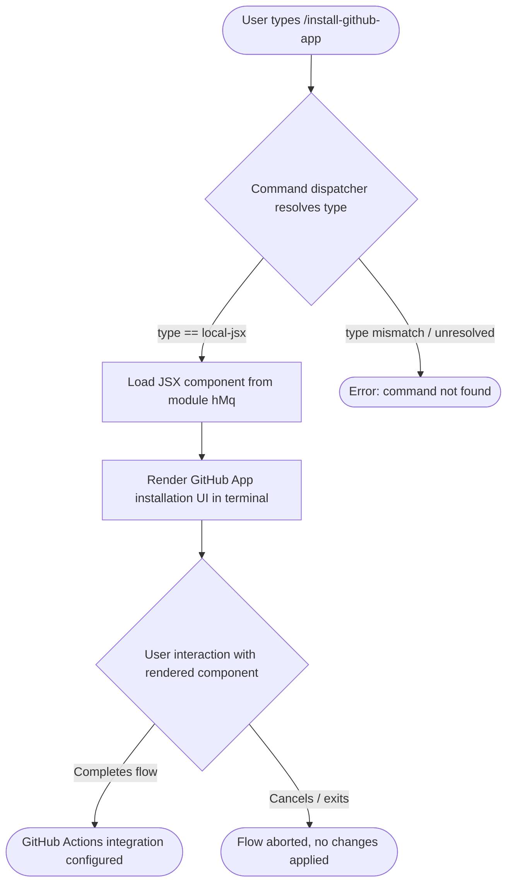

# `/install-github-app`

> Analysis basis: CC v2.1.143 bundle.js (AST extraction + Claude interpretation)
> Minimum version: v2.1.143

---

## Overview

The `/install-github-app` command initiates the setup flow for Claude GitHub Actions on a target repository. It is registered as a `local-jsx` command, meaning its output is rendered as a JSX component within the Claude Code terminal UI rather than as plain text. The command guides the user through connecting a GitHub repository to Claude's automated Actions integration.

---

## Registration

| Field | Value |
|---|---|
| type | `local-jsx` |
| name | `install-github-app` |
| description | `Set up Claude GitHub Actions for a repository` |
| module_id | `hMq` |
| loc_line | 6465 |

Analysis basis: CC v2.1.143 bundle.js:+10721587

---

## Input Branching

Because the extracted call graph (`callGraph: []`) and literals (`literals: []`) contain no depth-≤2 traversal data beyond the registration node, the detailed branching logic inside the JSX component cannot be reconstructed from the current extraction.

<!-- TODO: not found in depth-2 traversal; needs --depth 4 -->

The following flowchart represents the minimum guaranteed behavior derivable from the registration record:



Analysis basis: CC v2.1.143 bundle.js:+10721587

---

## Behavioral Spec

### Command Dispatch and JSX Component Rendering

Because the command type is `local-jsx`, the Claude Code shell does not invoke a plain text handler. Instead it loads the registered module and mounts its default JSX export into the active terminal panel.

```
function dispatchInstallGitHubApp(userInput):
    registration = resolveCommand("install-github-app")
    assert registration.type == "local-jsx"

    component = loadModule(registration.module_id)   // module hMq
    mountJSXComponent(component, context = {
        cwd: getCurrentWorkingDirectory(),
        userInput: userInput
    })
    // Rendering and further interaction are handled
    // entirely inside the mounted component.
```

Analysis basis: CC v2.1.143 bundle.js:+10721587

### GitHub App Setup Flow (Component-Internal)

The internal steps executed by the JSX component after mounting are not recoverable at depth ≤ 2. Based on the command description ("Set up Claude GitHub Actions for a repository"), the expected high-level algorithm is:

```
function gitHubAppSetupComponent(props):
    // Step 1 – identify target repository
    repo = props.cwd or promptUserForRepository()

    // Step 2 – check existing installation state
    installationStatus = queryGitHubAppInstallation(repo)

    // Step 3 – branch on status
    if installationStatus == ALREADY_INSTALLED:
        displayAlreadyInstalledMessage(repo)
        return

    // Step 4 – open or display installation URL
    installURL = buildGitHubAppInstallURL(repo)
    presentInstallationLink(installURL)

    // Step 5 – await confirmation or poll status
    waitForUserConfirmation()
    // Further post-install configuration steps unknown
    // at current traversal depth
```

<!-- TODO: not found in depth-2 traversal; needs --depth 4 -->

Analysis basis: CC v2.1.143 bundle.js:+10721587 (registration only; internal component logic not extracted)

---

## State & Side Effects

| Item | Detail |
|---|---|
| Telemetry | None detected at depth ≤ 2 traversal (`telemetry: []`) <!-- TODO: not found in depth-2 traversal; needs --depth 4 --> |
| Hook registration | Not detected at depth ≤ 2 traversal <!-- TODO: not found in depth-2 traversal; needs --depth 4 --> |
| appState changes | Not detected at depth ≤ 2 traversal <!-- TODO: not found in depth-2 traversal; needs --depth 4 --> |
| Sound | Not detected at depth ≤ 2 traversal <!-- TODO: not found in depth-2 traversal; needs --depth 4 --> |
| JSX mount | Mounts a terminal UI component from module `hMq` upon invocation |
| External network | Expected to interact with GitHub App installation endpoints (inferred from description; not confirmed in extracted data) |

---

## Version History

| Version | Change |
|---|---|
| v2.1.143 | Initial analysis; registered as `local-jsx` in module `hMq` at bundle.js:+10721587 |

---

## Common Mistakes

1. **Running outside a Git repository context** — The command is designed to wire up a GitHub repository to Claude Actions. Invoking it in a directory that is not a Git repository or has no GitHub remote may cause the setup flow to fail or present an unexpected prompt.
2. **Expecting plain-text output** — Because the command type is `local-jsx`, its output is an interactive terminal UI component, not streamed text. Piping or scripting around its output will not produce usable plain text.
3. **Assuming idempotent re-runs are safe without verification** — If the GitHub App is already installed on the target repository, the component may short-circuit or display a warning rather than re-running the full setup. Always verify the current installation state before invoking a second time.
4. **Confusing `/install-github-app` with a global CLI flag** — This is a slash command issued inside an active Claude Code session, not a standalone CLI sub-command. It cannot be invoked as `claude install-github-app` from a shell prompt outside an interactive session.

---

## Appendix — Identifier Mapping

> For bundle debugging only. Identifiers change across versions.

| Identifier | Role |
|---|---|
| `dP7` | Primary implementation symbol for the `install-github-app` command; likely the JSX component or its top-level export within module `hMq` |