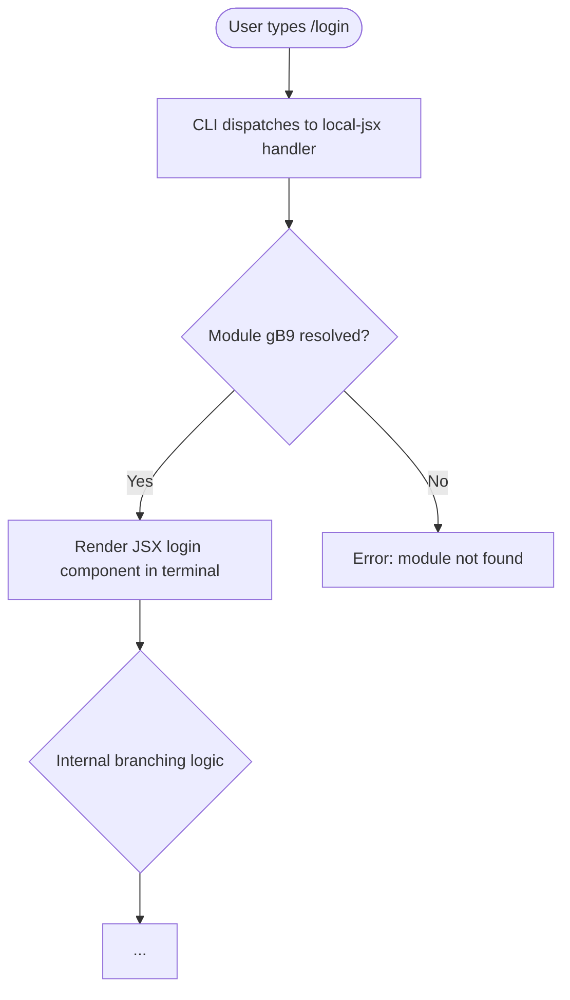

# `/login`

> Analysis basis: CC v2.1.144 bundle.js (AST extraction + Claude interpretation)
> Minimum version: v2.1.144

---

## Overview

The `/login` command is a local JSX slash command registered in CC v2.1.144 that initiates or manages the user authentication flow within the Claude Code CLI. Based on its registration type of `local-jsx`, it renders a JSX component directly in the terminal interface rather than executing a purely imperative script. The exact interactive steps and authentication mechanism could not be fully resolved at AST traversal depth ≤ 2.

---

## Registration

| Field | Value |
|---|---|
| type | `local-jsx` |
| name | `login` |
| description | `null` |
| loc\_line | 6331 |
| module\_id | `gB9` |

Analysis basis: CC v2.1.144 bundle.js:+10694092

---

## Input Branching

The AST traversal at depth ≤ 2 returned an empty call graph and no string literals for module `gB9`. The branching logic internal to the command's JSX component could not be statically resolved at this traversal depth.

<!-- TODO: not found in depth-2 traversal; needs --depth 4 -->

The following flowchart represents the structurally confirmed entry point only:



---

## Behavioral Spec

### Command Dispatch

The CLI identifies `/login` as a `local-jsx` type command. Upon invocation, the command dispatcher resolves module `gB9` and delegates rendering to the JSX runtime embedded in the CLI terminal layer. No argument parsing, sub-commands, or flag handling were found at the current traversal depth.

```
function dispatchLoginCommand(userInput):
    command = resolveSlashCommand(userInput)  // matches "login"
    if command.type == "local-jsx":
        module = loadModule(command.module_id)  // module_id = "gB9"
        renderJSXComponent(module, terminalContext)
    else:
        raiseDispatchError("unexpected command type")
```

Analysis basis: CC v2.1.144 bundle.js:+10694092

### JSX Component Rendering

Because the command type is `local-jsx`, the command's output is rendered as a JSX tree within the CLI's terminal UI layer rather than printing plain text. The specific component tree, props, and internal state transitions within the login flow are not resolvable at traversal depth ≤ 2.

```
function renderLoginComponent(moduleExports, context):
    component = moduleExports.default  // assumed convention for local-jsx
    mountToTerminal(component, context)
    // Internal state, hooks, and side effects:
    // <!-- TODO: not found in depth-2 traversal; needs --depth 4 -->
```

Analysis basis: CC v2.1.144 bundle.js:+10694092

### Description Field

The `description` field for this command is explicitly `null` in the registration object. This means `/login` does not surface a help string in command picker UIs or `--help` output through the standard description mechanism.

```
function getCommandDescription(command):
    if command.description == null:
        return ""  // no description shown in picker
    else:
        return command.description
```

Analysis basis: CC v2.1.144 bundle.js:+10694092

---

## State & Side Effects

| Item | Detail |
|---|---|
| Telemetry | None found at traversal depth ≤ 2. <!-- TODO: not found in depth-2 traversal; needs --depth 4 --> |
| Hook registration | <!-- TODO: not found in depth-2 traversal; needs --depth 4 --> |
| appState changes | <!-- TODO: not found in depth-2 traversal; needs --depth 4 --> |
| Sound | <!-- TODO: not found in depth-2 traversal; needs --depth 4 --> |
| Authentication side effects | <!-- TODO: not found in depth-2 traversal; needs --depth 4 --> |
| Module | `gB9` (resolved at runtime by local-jsx dispatcher) |

---

## Version History

| Version | Change |
|---|---|
| v2.1.144 | Initial analysis. Command registered as `local-jsx` in module `gB9` at bundle byte offset 10694092, line 6331. |

---

## Common Mistakes

1. **Expecting a plain-text description in the command picker**: The `description` field is `null`, so `/login` will not display a descriptive hint in autocomplete or help listings that rely on the registration description field. Analysis basis: CC v2.1.144 bundle.js:+10694092
2. **Treating `/login` as a purely imperative command**: Because its type is `local-jsx`, the command renders a component rather than printing output sequentially. Tooling that intercepts stdout only may miss interactive login UI elements.
3. **Assuming argument support without verification**: No argument literals or parameter-parsing call edges were found at depth ≤ 2. Passing arguments to `/login` has unverified behavior. <!-- TODO: not found in depth-2 traversal; needs --depth 4 -->
4. **Assuming telemetry is absent**: The empty `telemetry` array reflects the limit of the current traversal depth, not a confirmed absence of telemetry events in the full component tree. <!-- TODO: not found in depth-2 traversal; needs --depth 4 -->

---

## Appendix — Identifier Mapping

> For bundle debugging only. Identifiers change across versions.

| Identifier | Role |
|---|---|
| `gB9` | Module ID for the `/login` command's local-jsx implementation |

> No obfuscated short-name function identifiers were returned by the depth-2 AST traversal for this command. If additional identifiers are needed, re-run extraction with `--depth 4` targeting module `gB9`.