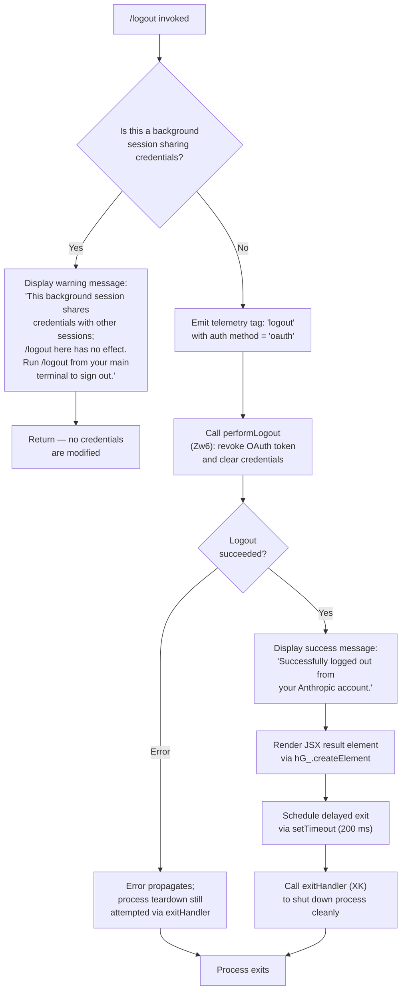

# `/logout`

> Analysis basis: CC v2.1.145 bundle.js (AST extraction + Claude interpretation)
> Minimum version: v2.1.145

---

## Overview

The `/logout` command signs the user out of their Anthropic account by revoking the current OAuth session, clearing all stored credentials, and tearing down all active API connections. It guards against accidental credential loss in background/daemon sessions by detecting shared-credential contexts and refusing to perform the logout operation there, instead instructing the user to run the command from their main terminal.

---

## Registration

| Field | Value |
|---|---|
| type | `local-jsx` |
| name | `logout` |
| description | Sign out from your Anthropic account |
| loc_byte | `10716785` |
| loc_byte_end | `10716973` |
| loc_line | `6311` |
| module_id | `jv1` |
| load_inline | `true` |
| arbor_handler.name | `Mm4` |
| arbor_handler.fqn | `claude-2.1.145::Mm4` |
| arbor_handler.kind | `AsyncFunction` |
| arbor_handler.resolution_path | `module_id` |
| arbor_handler.n_hits | `0` |

Analysis basis: CC v2.1.145 bundle.js:+10716785

---

## Input Branching

The command has 3+ distinct execution paths (background-session guard, successful OAuth logout, and failure/error handling), so a Mermaid flowchart is used.



Analysis basis: CC v2.1.145 bundle.js:+7443944 – +7444348

---

## Behavioral Spec

### 1. Background-Session Guard

Before performing any credential operation, the handler `Mm4` checks whether the running session is a background (daemon/worker) context that shares its credential store with a parent terminal session.

```
async function logoutHandler(context):
    isBackground = checkSessionType(T1)  // examines "bg", "daemon", "daemon-worker" mode flags

    if isBackground:
        displayMessage(
            "This background session shares credentials with other sessions; " +
            "/logout here has no effect. Run /logout from your main terminal to sign out."
        )
        return   // abort — no credentials touched
```

The background-session type constants observed are `"bg"`, `"daemon"`, and `"daemon-worker"`.

Analysis basis: CC v2.1.145 bundle.js:+7444052 (message literal), +2173475, +2173485, +2173499 (mode constants)

---

### 2. Telemetry Tagging Before Logout

Immediately after passing the background-session guard, the handler records the intent of the operation with a tag pair before any destructive action is taken.

```
function tagLogoutEvent():
    emit tag key = "logout"         // literal at +7443967
    emit tag key = "oauth"          // literal at +7443998
```

Analysis basis: CC v2.1.145 bundle.js:+7443967, +7443998

---

### 3. OAuth Token Revocation and Credential Teardown (`Zw6`)

The core logout routine is `Zw6` (OAuth credential teardown). It is an async function that performs the following steps in sequence:

```
async function performLogout():
    // Step 1 — resolve any outstanding async work
    await Promise.resolve()

    // Step 2 — revoke the OAuth token via the auth service (yG_)
    await revokeOAuthToken()          // yG_ at +7443186

    // Step 3 — call the connection close helper (A)
    closeActiveConnections()          // A at +7443207
        // internally: A.toLowerCase-normalises identifiers,
        //             f.close() and q.close() shut down open handles,
        //             q uses _1K.unlinkSync to remove lock/socket files

    // Step 4 — clear the credential cache (T1 → ZMH)
    clearCredentialCache()            // T1 at +7443211, ZMH at +2173552

    // Step 5 — run the extended session-state reset (Ew6)
    await resetSessionState()         // Ew6 at +7443223
        // sub-steps inside resetSessionState:
        //   uY6 — clear user-context data
        //   sn6 — clear subscription state
        //   tn6 → aw9.clear — wipe the in-memory auth/token cache
        //   T$H — clear terminal-related state
        //   s0H — run the full API-client shutdown sequence
        //          (ls → xH/pF, CpH → clearInterval/process.removeListener,
        //           multiple Set/Map .clear() calls, RpH.emit "exit" event,
        //           NH error-queue flush)
        //   Kj1 — remove OAuth token files from disk
        //          (fj1, fX_ → AJA path helper, LAH, D16 → _JA.join/l8,
        //           AVH.unlink to delete the file)
        //   h3_ — unlink session lock/state files
        //          (v3_ → S3_/clearTimeout, f36.unlink, g68 → $i9.join/l8)

    // Step 6 — delete per-project config credentials (go)
    clearProjectCredentials()         // go at +7443285

    // Step 7 — persist updated global config (xA_)
    await saveGlobalConfig()          // xA_ at +7443300
        // xA_ → fj9 (keychain/credential path resolution via YnA → Hv)
        //      → I  (telemetry write helper)
        //      → GH (string coercion)
        //  Also reads system user info (xE → GF6.userInfo),
        //  hashes the username with SHA-256/NFC/hex/8-char prefix,
        //  checks for "claude-code-user" group membership.
        //  On failure emits "Failed to delete keychain entry" error.
        //  Also triggers H8 (global config file write with backup rotation,
        //  lock acquisition, and stale-write protection per GH #3117).

    // Step 8 — flush in-memory credential store (bK)
    await flushCredentialStore()      // bK at +7443312
        // bK → n69: handles primary secure storage, async-storage fallback,
        //           _WH/_YL (AsyncLocalStorage context), Promise.all for
        //           parallel flush, telemetry tags for write outcomes:
        //           "secure_storage_credentials_write",
        //           "primary_transient_skip_fallback",
        //           "plaintext_fallback_used",
        //           "primary_and_fallback_failed"

    // Step 9 — clear OTEL/telemetry session maps (TPH)
    clearTelemetrySession()           // TPH at +7443326

    // Step 10 — write final global config snapshot (H8)
    await writeConfigSnapshot()       // H8 at +7443348
        // Uses lock file, backup rotation (max 5 backups, 60 000 ms timeout),
        // and the stale-write safety guard.

    // Step 11 — record the oauth_logout hH event
    recordOAuthLogoutEvent()          // hH at +7443722, literal "oauth_logout" at +7443725
```

Analysis basis: CC v2.1.145 bundle.js:+7443156 – +7443722

---

### 4. Subscription-Switch Detection

During the OAuth teardown phase the literal `"subscription-switch"` is present in the credential-state logic at +7443570, indicating that the logout handler also considers the case where a credential change is due to a subscription tier switch rather than a plain sign-out, and handles the credential state accordingly.

Analysis basis: CC v2.1.145 bundle.js:+7443570

---

### 5. Success UI and Process Exit (`Mm4` post-logout)

After `Zw6` resolves successfully the handler renders a success notice and schedules a clean exit:

```
function renderSuccessAndExit():
    displaySystemMessage("Successfully logged out from your Anthropic account.")
    // literal at +7444253, role "system" at +7444206

    element = hG_.createElement(...)    // JSX result node, +7444228

    setTimeout(exitHandler, 200)        // 200 ms delay literal at +7444348
    // exitHandler = XK → x9
    //   x9 orchestrates: ZZH (unmount Ink UI, write final bytes),
    //                    ow_ (write exit line to stdout),
    //                    aw_ (clearTimeout, process.exit / process.kill SIGKILL),
    //                    KSH (drain write stream),
    //                    Promise.race / AbortSignal.timeout,
    //                    L98 (scroll summary — tengu_scroll_summary),
    //                    V86 (startup profiling flush — tengu_startup_perf),
    //                    f98 (parallel promise cleanup),
    //                    session_end event at +5258328
```

Analysis basis: CC v2.1.145 bundle.js:+7444253, +7444316, +7444332, +7444348

---

### 6. Config Write Safety Guards

The global-config write helpers (`H8`, `Aq_`, `R$H`) implement two well-documented safety nets:

- **Stale-write prevention (GH #3117):** Before persisting a new config snapshot the helper re-reads the file from disk and compares the `auth` field. If the on-disk file is missing auth data that the in-memory cache still holds, the write is refused and the literal message `"saveConfigWithLock: re-read config is missing auth that cache has; refusing to write to avoid wiping ~/.claude.json. See GH #3117."` is emitted (also the global variant: `"saveGlobalConfig fallback: re-read config is missing auth that cache has; refusing to write. See GH #3117."`). Telemetry event `tengu_config_auth_loss_prevented` is fired. Analysis basis: CC v2.1.145 bundle.js:+3167622, +3164504, +3167774

- **Lock contention guard:** Lock acquisition uses a 60 000 ms timeout. If another Claude instance holds the lock beyond expected duration, the message `"Lock acquisition took longer than expected - another Claude instance may be running"` is logged and `tengu_config_lock_contention` is emitted. Analysis basis: CC v2.1.145 bundle.js:+3167206, +3167976, +3167295

- **Backup rotation:** Up to 5 config backups are kept in the `backups/` sub-directory, identified by a `.backup.` infix in the filename. Analysis basis: CC v2.1.145 bundle.js:+3168807, +3168092, +3168225

---

## State & Side Effects

| Item | Detail |
|---|---|
| Telemetry — `tengu_config_lock_contention` | Fired when config-lock wait exceeds threshold during credential write (bundle.js:+3167295) |
| Telemetry — `tengu_config_stale_write` | Fired when a stale config write is detected (bundle.js:+3167431) |
| Telemetry — `tengu_config_parse_error` | Fired on JSON parse failure of the config file (bundle.js:+3169876) |
| Telemetry — `tengu_config_auth_loss_prevented` | Fired when a write is refused to protect existing auth data (bundle.js:+3167774) |
| Telemetry — `tengu_feature_ok` / `tengu_feature_sad` / `tengu_feature_bad` | Feature-gate outcome events (bundle.js:+955923, +956058, +955981) |
| Telemetry — `tengu_daemon_config_reload` | Emitted when the daemon reloads config (bundle.js:+14669513) |
| Telemetry — `tengu_startup_perf` | Startup profiling report flushed at exit (bundle.js:+211777) |
| Telemetry — `tengu_scroll_summary` | Terminal scroll summary recorded at exit (bundle.js:+5257260) |
| Telemetry — `tengu_pewter_brook` | UI display-mode event (bundle.js:+3338659) |
| Telemetry — `tengu_cache_eviction_hint` | Cache eviction event at process teardown (bundle.js:+5258293) |
| Credential store | OAuth token files deleted from disk via `AVH.unlink`; secure storage cleared via `n69` write-path |
| Session state | In-memory auth/token cache cleared (`aw9.clear`, `k$H.clear`, `Ao6.clear`, `U56.clear`, `x1_.clear`, `UF.clear`) |
| Process listeners | `clearInterval`, `process.removeListener`, `process.off` called during API client shutdown |
| Config file | Global `~/.claude.json` re-written with auth fields removed; up to 5 backups retained |
| Lock files / socket files | Removed via `_1K.unlinkSync` during connection teardown |
| appState changes | Credential and session-related state maps cleared; OTEL metric maps cleared |
| Process exit | `process.exit` (or `process.kill SIGKILL` as fallback) called 200 ms after success message is displayed |
| Sound | <!-- TODO: not found in depth-2 traversal; needs --depth 4 --> |

---

## Version History

| Version | Change |
|---|---|
| v2.1.145 | Initial analysis |

---

## Common Mistakes

1. **Running `/logout` in a background or daemon session** — The command detects background sessions (mode flags `"bg"`, `"daemon"`, `"daemon-worker"`) and refuses to sign out, displaying an informational message. Only a `/logout` from the primary terminal will actually revoke credentials.

2. **Expecting the shell to remain usable after logout** — The handler schedules a full process exit 200 ms after displaying the success message. Any pending work or unsaved state will be lost.

3. **Concurrent Claude instances during logout** — If another Claude Code process holds the config-file lock, the logout may stall for up to 60 seconds before proceeding. The warning `"Lock acquisition took longer than expected - another Claude instance may be running"` will appear in logs.

4. **Assuming credential removal is instantaneous** — The logout sequence involves multiple async steps (OAuth revocation, keychain deletion, config re-write, secure-storage flush). Killing the process mid-sequence could leave partially-cleared credentials on disk; the stale-write guard (`GH #3117`) is designed to prevent accidental auth loss in this scenario.

5. **Confusing `/logout` with a simple config clear** — The command is a full sign-out: it revokes the OAuth token server-side (via `yG_`), removes token files, clears all in-memory caches, and exits the process. It is not a soft credential reset.

---

## Appendix — Identifier Mapping

> For bundle debugging only. Identifiers change across versions.

| Identifier | Role |
|---|---|
| `Mm4` | Main logout handler (AsyncFunction; arbor_handler) |
| `Zw6` | OAuth credential teardown / core logout routine |
| `Ew6` | Extended session-state reset orchestrator |
| `T1` | Background-session type checker / credential cache clearer |
| `ZMH` | Credential cache clear implementation |
| `uY6` | User-context data clear |
| `sn6` | Subscription state clear |
| `tn6` | Auth/token in-memory cache clear (`aw9.clear`) |
| `T$H` | Terminal state clear |
| `s0H` | Full API client shutdown sequence |
| `ls` | API client teardown sub-step (string/path helper) |
| `xH` | String coercion utility |
| `pF` | Path/string helper (`su`) |
| `CpH` | Clears intervals, process listeners, multiple Maps/Sets |
| `F1_` | Clears interval + removes process listener |
| `NH` | Error-queue flush / log-error helper |
| `x_` | Error constructor/wrapper |
| `Hq` | Essential-traffic queue helper |
| `mhK` | Queue shift/push manager (`aR6`) |
| `Kj1` | OAuth token file unlink orchestrator |
| `fj1` | Token file path resolver |
| `fX_` | File path helper (→ `AJA`) |
| `AJA` | Path join/resolve utility |
| `LAH` | Path constant for token storage |
| `D16` | Token directory path builder (`_JA.join`) |
| `h3_` | Session lock/state file unlink |
| `v3_` | Session lock file teardown with clearTimeout |
| `S3_` | Lock file sub-helper |
| `g68` | State file path builder (`$i9.join`) |
| `go` | Per-project credential clear |
| `xA_` | Global config save (persists credential removal) |
| `fj9` | Keychain/credential path resolver |
| `YnA` | Credential path computation (hashing, user-info) |
| `Hv` | NFC-normalise + SHA-256 hash utility |
| `EP` | Keychain read helper |
| `xE` | System user-info reader (`GF6.userInfo`) |
| `I` | Telemetry write helper |
| `y$K` | Telemetry sub-path helper |
| `H` | Random/timeout scheduler |
| `RH` | JSON serialiser |
| `B4` | String replacement/slice helper |
| `RSH` | Redaction helper (`x_A`) |
| `R$K` | Telemetry event batcher/sender |
| `GH` | String coercion helper |
| `H8` | Global config file writer with backup rotation |
| `Aq_` | Config file write with lock and backup logic |
| `U6` | File-system existence / mkdir helper |
| `B69` | Object assign / merge helper |
| `d` | General utility / state accessor |
| `A8` | Config object accessor |
| `R$H` | Config file read/parse with safety checks |
| `n56` | Config snapshot helper |
| `qq_` | Backup directory path builder |
| `Z` | String/path state object |
| `X` | SDK connection manager |
| `V` | Renderer/display controller |
| `y96` | Atomic file write (temp + rename, fchmod, fsync) |
| `UpH` | Path utility |
| `Xv9` | Object.entries iterator for config |
| `BpH` | Date.now timestamp helper |
| `_q_` | Config directory write helper |
| `Ja8` | Additional config persistence helper |
| `bK` | In-memory credential store flusher |
| `n69` | Secure storage async read/write/delete manager |
| `_WH` | AsyncLocalStorage context wrapper |
| `_YL` | Storage context initialiser and resolver |
| `hH` | Feature-event recorder (`tengu_feature_ok`) |
| `K8` | Feature-sad event recorder (`tengu_feature_sad`) |
| `CH` | Feature-bad event recorder (`tengu_feature_bad`) |
| `TPH` | OTEL/telemetry session map clear |
| `bgH` | OTEL attribute builder |
| `GE` | OTEL string helper |
| `zL` | OTEL event emitter / attribute setter |
| `lv8` | OTEL metric label helper |
| `CgH` | OTEL resource/attribute assembler |
| `au` | Random-bytes / session-ID generator |
| `k6` | IV/nonce generator |
| `dz_` | String-to-xH coercion for OTEL |
| `z5` | OTEL label + hash helper |
| `ps9` | OTEL key constants (`L44`, `K44`) |
| `q_8` | OTEL attribute freeze/build helper |
| `z66` | OTEL sequence counter |
| `XK` | Exit handler (delegates to `x9`) |
| `x9` | Full process-exit sequencer |
| `K` | Column padding / map helper |
| `ZZH` | Ink UI unmount + final write |
| `Gh` | Terminal restore helper |
| `us6` | Raw stdout write + cursor restore |
| `ow_` | Exit line writer to stdout |
| `kV` | Terminal state accessor |
| `zR` | Terminal mode helper |
| `Uz6` | Working-directory stat helper |
| `t3` | Terminal cleanup helper |
| `Fq1` | Exit line formatter |
| `aw_` | Final exit dispatcher (process.exit / SIGKILL) |
| `KSH` | Write-stream drain waiter |
| `Y` | Ink render loop / supervisor |
| `_JH` | Ink render state machine |
| `Wkq` | Ink layout / column calculator |
| `T` | Input event / keypress handler |
| `y1K` | Heartbeat checker |
| `V86` | Startup profiling flush |
| `rk8` | Startup perf mark recorder |
| `PAA` | Perf log path builder |
| `L98` | Scroll summary recorder |
| `Bq1` | Scroll summary sub-helper |
| `Uq1` | Scroll metrics calculator |
| `oA` | Local-agent display mode resolver |
| `dH6` | Cache eviction hint helper |
| `f98` | Parallel promise cleanup |
| `g8` | Timeout-guarded promise wrapper |