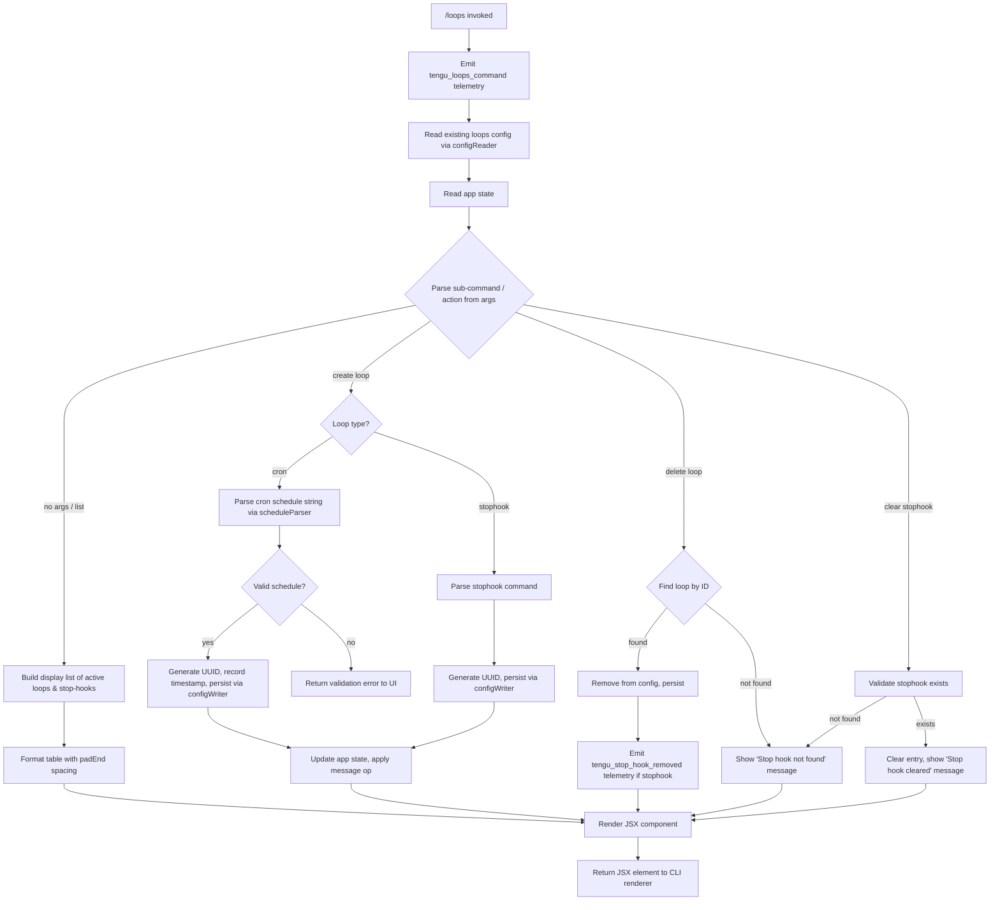

# `/loops`

> Analysis basis: CC v2.1.145 bundle.js (AST extraction + Claude interpretation)
> Minimum version: v2.1.145

---

## Overview

The `/loops` command provides an interactive management interface for Claude Code's recurring background loop system and stop-hooks. It allows users to list currently active loops and stop-hooks, create new ones (specifying schedule type and parameters), and delete existing entries. The command renders a local JSX UI component and coordinates with the daemon/background session infrastructure to persist and apply changes.

---

## Registration

| Field | Value |
|---|---|
| type | `local-jsx` |
| name | `loops` |
| description | `List, create, and delete recurring loops and stop-hooks` |
| loc_byte | `11532574` |
| loc_byte_end | `11532756` |
| loc_line | `7069` |
| immediate | `true` |
| module_id | `xGq` |
| load_inline | `true` |
| arbor_handler.name | `bh7` |
| arbor_handler.fqn | `claude-2.1.145::bh7` |
| arbor_handler.kind | `AsyncFunction` |
| arbor_handler.resolution_path | `module_id` |
| arbor_handler.n_hits | `0` |

Analysis basis: CC v2.1.145 bundle.js:+11532574

---

## Input Branching

The handler has five or more distinct input/action branches (list, create-cron, create-stophook, delete-cron, delete-stophook, and sub-branches for schedule validation), so a Mermaid flowchart is used.



Analysis basis: CC v2.1.145 bundle.js:+11531531 (handler entry), +11531714 (stophook branch), +11531628 (cron branch), +11531973 (not-found message), +11531995 (cleared message)

---

## Behavioral Spec

### 1. Handler Entry and Telemetry

The primary handler (`bh7`) is an `AsyncFunction` resolved via `module_id` path through module `xGq`.

```
async function loopsCommandHandler(toolInput, context):
    emit telemetry("tengu_loops_command")          // +11531533
    configData  = await readLoopsConfig(context)   // calls configReader (d) +11531531
    loopStore   = await getLoopStore(context)       // calls loopStoreLoader (ze) +11531571
    appState    = context.getAppState()             // +11531582
    ...
```

Analysis basis: CC v2.1.145 bundle.js:+11531531, +11531571, +11531582

---

### 2. Configuration Loading (`configReader`)

The `configReader` function (identifier `PEH`) loads loop configuration from the filesystem.

```
async function configReader(context):
    configPath = pathResolver(context)             // _qH: joins X88 path + aK +4722303
    raw        = await fs.readFile(configPath, "utf-8")  // +4722372, encoding "utf-8" +4722400
    parsed     = parseConfigFormat(raw)            // S9 +4722422
    validated  = validateConfig(parsed)            // NH +4722444
    if not Array.isArray(validated):               // +4722516
        items = []
    else:
        items = mapConfigItems(validated)          // I +4722695
    serialized = serializeForDisplay(items)        // RH +4722742
    schedule   = parseScheduleString(items)        // Bv +4722764
    items.push(schedule)                           // L.push +4722859
    return items
```

Error codes handled during file read: `ENOENT`, `EACCES`, `EPERM`, `ENOTDIR`, `ELOOP`, `EROFS`
(Analysis basis: CC v2.1.145 bundle.js:+172632–+172701)

---

### 3. Display / List Formatting (`displayBuilder`)

```
function displayBuilder(loopEntries):
    columnMap = new Map()
    for entry in loopEntries:
        columnMap.set(label, formatRow(entry))    // HwH: K.set +8650901
        padded = label.padEnd(width, "  ")        // K: f.padEnd +14678577, pad char "  " +14678598
        mapped = entry.map(rowMapper)             // Sc1: H.map +8650670
    result = []
    result.push(formatted)                        // loH: A.push +9938288
    return result
```

The formatter uses a column width of 40 characters (bundle.js:+14680569).

Analysis basis: CC v2.1.145 bundle.js:+9938164, +8650901, +14678577

---

### 4. Schedule Parsing (`scheduleParser`)

Two schedule types are supported: `"cron"` (+11531628) and `"stophook"` (+11531714).

```
function scheduleParser(scheduleString):
    trimmed = scheduleString.trim()               // OZ: H.trim +4720144
    if match = trimmed.match(cronPattern):        // K.match +4720285
        minute  = parseInt(match.minute)          // parseInt +4720320
        display = minute == 0  ? "Every hour"     // +4720481
                : minute == 1  ? "Every minute"   // +4720264
                : formatMinutes(minute)
        nextRun = computeNextRunDate(display)     // date arithmetic: J.getUTCDay +4721021,
                                                  // J.setUTCDate +4721040, J.getUTCDate +4721053,
                                                  // J.setUTCHours +4721071, J.getDay +4721100
        return {type: "cron", schedule: display, nextRun: nextRun.toString()}
    if match = trimmed.match(stophookPattern):    // L.match +4720555
        return {type: "stophook", ...parseStophook(match)}
    return null

function weekdayRangeParser(spec):               // l14
    parts = spec.split(separator)                // H.split +4718393
    for part in parts:
        if match = part.match(rangePattern):     // L.match +4718413
            start = parseInt(match[0])           // parseInt +4718458, max field 10 +4718472
            for day in range(start, end):
                if day in [3,6,7]:               // literals +4718634, +4718670, +4718676
                    validDays.add(day)           // K.add +4718519
    return Array.from(validDays)                 // +4718921
```

Day-of-week range: valid values include `3`, `6`, `7` and spec format `"1-5"` (+4721188).
Cron field limits: minutes 0–59 (+11531298), hours 0–23 (+11531369), days 1–31 (+11531422), with Math.max/Math.ceil/Math.round applied (+11531241, +11531252, +11531325).

Analysis basis: CC v2.1.145 bundle.js:+4720144, +4720264, +4720481, +11531628

---

### 5. Loop Creation — Cron (`cronCreator`)

```
async function cronCreator(params, context):    // zgH
    id        = crypto.randomUUID()             // Cr9.randomUUID +4723700
    timestamp = Date.now()                      // +4723762
    entry     = buildEntry(params, id, timestamp)  // EPH +4723808
    await configWriter(entry, context)          // PEH +4723852
    configList.push(entry)                      // M.push +4723865
    appState  = context.getAppState()           // k6 +4723897
    label     = formatLabel(entry)              // Jl +4723946
    await configWriterFull(context)             // OgH +4723959
```

The `.claude` directory constant is used for storage path construction (+4723541).
Analysis basis: CC v2.1.145 bundle.js:+4723700, +4723808, +4723852

---

### 6. Loop Creation — Stop-hook (`stophookCreator`)

```
async function stophookCreator(params, context):   // ioH
    loopCount   = getLoopCount(context)             // k6 +9938952
    displayList = buildDisplayList(context)         // loH +9938959
    current     = context.getAppState()             // H.getAppState +9938963
    newState    = current.setAppState({...})        // H.setAppState +9939092
    op          = buildMessageOp("append", params)  // H.applyMessageOp +9939161, "append" +9939184
    msgId       = generateUUID()                    // Oqq: fqq.randomUUID +9939308
    context.applyMessageOp(op, msgId)
    emit telemetry("tengu_stop_hook_added")         // +9938850
    return result                                   // d +9939216
```

Message op types found in context: `"goal"` (+9939249), `"attachment"` (+9939290), `"goal_status"` (+9939377).
Analysis basis: CC v2.1.145 bundle.js:+9938952, +9939092, +9938850

---

### 7. Loop Deletion (`loopDeleter`)

```
async function loopDeleter(id, context):    // noH
    gateChecks = [
        checkHooksGate(context),            // Bb_: "hooks_gate" +9938360
        checkTrustGate(context)             // "trust_gate" +9938414
    ]
    goalSet     = getGoalSet(context)       // "goal_set" +9938492
    loopCount   = getLoopCount()            // k6 +9938527
    displayList = buildDisplayList()        // loH +9938545
    appState    = context.getAppState()     // +9938549
    if not findEntryById(id):
        return {message: "Stop hook not found"}  // +11531973
    timestamp = Date.now()                  // +9938713
    tokens    = computeTokenBudget()        // jP: outputTokens +41911 +9938738
    context.setAppState(newState)           // +9938751
    context.applyMessageOp(deleteOp)        // +9938793
    msgId = generateUUID()                  // Oqq +9938835
    emit telemetry("tengu_stop_hook_removed")  // +9939218
    context.d(result)                       // +9938848
    notify(hH)                              // +9938910
    return {message: "Stop hook cleared"}   // +11531995
```

Analysis basis: CC v2.1.145 bundle.js:+11531973, +11531995, +9939218

---

### 8. Cron Expression Validation (`cronValidator`)

```
function cronValidator(expr):                // Ch7
    match   = expr.match(cronRegex)          // H.match +11531119
    if not match: return null
    minute  = parseInt(match[1])             // +11531156
    bounded = Math.max(0, Math.ceil(minute)) // +11531241, +11531252
    rounded = Math.round(bounded)            // +11531325
    limits:
        minutes: 0–59  (max field 59)        // +11531298
        hours:   0–23  (max field 23)        // +11531369
        days:    1–31  (max field 31)        // +11531422
    schedule = parseScheduleString(expr)     // Bv +11531489
    return schedule
```

Analysis basis: CC v2.1.145 bundle.js:+11531119, +11531241, +11531298

---

### 9. Config Persistence Writer (`configWriter`)

```
async function configWriter(entry, context):   // OgH
    configDir = pathResolver(context)          // aK +4723509
    await fs.mkdir(configDir, {recursive:true}) // P88.mkdir +4723520
    filePath  = path.join(configDir, ".claude") // X88.join +4723530, ".claude" +4723541
    mapped    = entries.map(serializer)         // H.map +4723581
    await fs.writeFile(filePath, mapped)        // P88.writeFile +4723617
    checksum  = computeChecksum()               // _qH +4723631
    serialized = serialize(mapped)              // RH +4723638
    return serialized
```

Analysis basis: CC v2.1.145 bundle.js:+4723509, +4723530, +4723541

---

### 10. Daemon / Background Session Integration

The `/loops` handler reaches into daemon and background-session infrastructure to coordinate loop execution. Key behaviors observed in the call graph:

- **Process lifecycle**: daemon sessions are spawned via `Bun.spawn` (+14635220) with flags `--bg-pty-host`, `--bg-spare`, `--`, `200`, `50` (+14635238–+14635279).
- **Spare session pool**: `tengu_bg_spare_enable` (+14656548), `tengu_bg_spare_claim` (+14656669), `tengu_bg_spare_spawn` (+14655107), `tengu_bg_spare_claim_fail` (+14656932).
- **Memory guard**: free memory checked via `os.freemem` (+14655739); threshold 1024 MB on macOS (+12029344); `tengu_bg_low_mem_mb` (+12029322) and `tengu_bg_dispatch_low_mem` (+14655909) emitted when below threshold.
- **Signal handling**: SIGKILL (+14655378) escalation emits `tengu_bg_dispatch_sigkill_escalate` (+14655330); SIGTERM used for graceful stop (+14636753).
- **Daemon stop**: `daemon_stop` (+14690594), `daemon_stop_failed` (+14690631).
- **Session timeout**: 300000 ms (5 minutes) idle timeout constant (+14661512); idle exit emits `tengu_daemon_idle_exit` (+14674514).
- **Send-claim timeout**: 5000 ms (+14636936); failure emits `tengu_bg_sendclaim_failed` (+14636515).
- **Retry limit**: 2000 ms retry window (+14655040).

Analysis basis: CC v2.1.145 bundle.js:+14635220, +14655378, +14661512, +14636936

---

### 11. MCP Server Refresh (side effect)

The creation/deletion of loops may trigger an MCP server refresh cycle (call chain reaches `nL5` → `ONH`). Observed MCP transport types: `stdio` (+9594508), `sse` (+9594542), `http` (+9594574), `sse-ide` (+9594607), `ws-ide` (+9594643). OAuth flow strings also present in depth-2 traversal (+9477763, +9478008).

Analysis basis: CC v2.1.145 bundle.js:+14384511, +9594508

---

## State & Side Effects

| Item | Detail |
|---|---|
| Telemetry — primary | `tengu_loops_command` (emitted on every invocation, +11531533) |
| Telemetry — stop-hook add | `tengu_stop_hook_added` (+9938850) |
| Telemetry — stop-hook remove | `tengu_stop_hook_removed` (+9939218) |
| Telemetry — daemon control | `tengu_daemon_control` (+14690669) |
| Telemetry — daemon idle exit | `tengu_daemon_idle_exit` (+14674514) |
| Telemetry — daemon yield | `tengu_daemon_yield` (+14673599) |
| Telemetry — daemon config reload | `tengu_daemon_config_reload` (+14669513) |
| Telemetry — bg spare enable | `tengu_bg_spare_enable` (+14656548) |
| Telemetry — bg spare claim | `tengu_bg_spare_claim` (+14656669) |
| Telemetry — bg spare spawn | `tengu_bg_spare_spawn` (+14655107) |
| Telemetry — bg spare claim fail | `tengu_bg_spare_claim_fail` (+14656932) |
| Telemetry — bg dispatch SIGKILL escalate | `tengu_bg_dispatch_sigkill_escalate` (+14655330) |
| Telemetry — bg dispatch low mem | `tengu_bg_dispatch_low_mem` (+14655909) |
| Telemetry — bg low mem MB | `tengu_bg_low_mem_mb` (+12029322) |
| Telemetry — send-claim failed | `tengu_bg_sendclaim_failed` (+14636515) |
| Telemetry — bg session create | `daemon_bg_session_create` (+14655640) |
| Telemetry — dup retry exhausted | `dup_retry_exhausted` (+14655667) |
| Telemetry — bg spare refill | `daemon_bg_spare_refill` (+14634981) |
| Telemetry — feature gate ok/bad/sad | `tengu_feature_ok` (+955923), `tengu_feature_bad` (+955981), `tengu_feature_sad` (+956058) |
| Filesystem writes | Config persisted to `.claude` directory (+4723541) via `fs.mkdir` + `fs.writeFile`; config file read with `utf-8` encoding (+4722400) |
| appState changes | `setAppState` called on create (+9939092) and delete (+9938751); `applyMessageOp` with op types `append`, `goal`, `attachment`, `goal_status` |
| Daemon process | May spawn background session via `Bun.spawn` with `--bg-pty-host` / `--bg-spare` flags; SIGTERM/SIGKILL lifecycle managed |
| Sound | <!-- TODO: not found in depth-2 traversal; needs --depth 4 --> |
| Hook registration | Stop-hooks stored under key `stophook` (+11531714); cleared via `cz.unlink` / `cz.rm` in the daemon runner path (+14660035, +14661098) |
| MCP side-effect | Loop changes may trigger MCP server reconnection cycle (`ONH` path) |

---

## Version History

| Version | Change |
|---|---|
| v2.1.145 | Initial analysis |

---

## Common Mistakes

1. **Providing an invalid cron expression**: The validator (`cronValidator`) enforces numeric bounds (minutes 0–59, hours 0–23, days 1–31). Non-numeric or out-of-range fields return `null` and the UI shows no confirmation. Always use a well-formed cron string.
2. **Deleting a stop-hook by wrong ID**: The deleter performs an exact ID match. If the ID is not found, the message `"Stop hook not found"` is returned with no side effects. Use `/loops` with no arguments first to list IDs.
3. **Assuming immediate execution after creation**: Newly created cron loops are scheduled from the next computed UTC trigger time (via `J.setUTCHours` / `J.setUTCDate` logic); they do not run immediately on creation.
4. **Running on Windows with stop-hooks**: The `windows` literal (+14661086) appears in a branch that may restrict stop-hook functionality; behavior may differ on Windows hosts.
5. **Confusing `stophook` with `cron`**: These are distinct loop types handled by separate branches. A stophook fires on session stop events; a cron loop fires on a time schedule. Mixing up the creation syntax results in the wrong type being registered.

---

## Appendix — Identifier Mapping

> For bundle debugging only. Identifiers change across versions.

| Identifier | Role |
|---|---|
| `bh7` | Primary handler (AsyncFunction) for `/loops` command |
| `d` | Low-level utility / async helper (called at handler entry) |
| `ze` | Loop store loader (calls configReader + z0) |
| `PEH` | Config file reader (filesystem read + parse + validate) |
| `U6` | Config path utility |
| `_qH` | Config path resolver (joins base path via aK) |
| `aK` | Path construction helper (calls IV) |
| `S9` | Config format parser (calls A8) |
| `A8` | Lower-level parse helper |
| `NH` | Config validator / error handler (calls x_, xH, Hq, mhK) |
| `x_` | Error constructor wrapper |
| `xH` | String converter |
| `Hq` | Validation branch helper (calls JOA) |
| `mhK` | Queue shift/push helper |
| `I` | Config item mapper |
| `y$K` | Item mapping sub-helper |
| `H` | General-purpose context / state object (also random/setTimeout host) |
| `RH` | JSON serializer (calls JSON.stringify) |
| `B4` | Path/string formatter |
| `RSH` | String utility (calls x_A) |
| `R$K` | Config writer with byte-length check |
| `Bv` | Schedule string parser (calls l14) |
| `l14` | Weekday/range parser (split, match, parseInt) |
| `A` | Array-like accumulator (toLowerCase host) |
| `L` | Promise / resource wrapper (add, finally, delete) |
| `q` | Resource set (add / unlinkSync host) |
| `f` | File handle / stream (close, finally host) |
| `z0` | Loop store initializer (calls IV) |
| `IV` | Core initialization primitive |
| `loH` | Display list builder (calls HwH, A.push) |
| `HwH` | Column map setter (calls K.set, Sc1) |
| `K` | Column map (map, padEnd host) |
| `Sc1` | Row mapper (H.map) |
| `k6` | Loop count / state reader (calls IV) |
| `OZ` | Schedule parser / next-run calculator |
| `w` | Background worker / session runner |
| `C` | Session constructor / spawn helper |
| `R1K` | Realpath + stat resolver |
| `J55` | Worker helper (calls w38) |
| `z` | Writer / stream (write, daemon_stop host) |
| `CH` | Channel / close helper (calls d) |
| `hH` | Notification / close helper (calls d) |
| `bT6` | Memory check helper (calls c6, Z6) |
| `Z6` | Platform feature gate (macOS, memory threshold) |
| `u` | Retire-if-settled helper (timeout + write) |
| `S` | Settled-state object |
| `x` | Timer unref helper |
| `Is_` | Send-claim IPC helper (connect, write, end) |
| `ul_` | Config directory writer (mkdir + writeFile) |
| `d75` | Claim timeout / error handler |
| `Q75` | Claim frame builder (TU.buildClaimFrame) |
| `GH` | String helper (calls String) |
| `ap` | IPC buffer encoder (Buffer.from, allocUnsafe, writeUInt32BE) |
| `Rs_` | Session roster manager (lifecycle orchestration) |
| `JK` | Session path joiner |
| `u1` | Session file reader / state loader |
| `Dj` | Active-state helper (calls eE) |
| `y5` | Session path helper (Gz, sP.join, RH, tP) |
| `EaH` | Async dispatch helper (Date.now, p27) |
| `nLH` | Session join helper (p$.join, AkH) |
| `ek` | Session split/join helper |
| `_U` | Session path + VM helper |
| `W06` | Workspace dir creator (p$.join, Nm_) |
| `Y` | Session registry manager (get, delete, stop/start/updateConfig) |
| `D` | Daemon supervisor loop (recursive, Z6, bT6, c6, vs_) |
| `$` | Disposable resource (dvq host) |
| `vs_` | Spare background session spawner (Bun.spawn, randomBytes) |
| `j` | Active session map (values, kill) |
| `y` | Session killer (z.write, d) |
| `J` | Date/next-run calculator (w host, UTC methods) |
| `Oe` | Config filter / loop selector |
| `co` | Existence checker (_.has) |
| `OgH` | Config persistence writer (mkdir + writeFile to .claude) |
| `ioH` | Stop-hook creator (setAppState, applyMessageOp, UUID) |
| `Oqq` | UUID generator (fqq.randomUUID) |
| `Ch7` | Cron expression validator (match, parseInt, Math.max/ceil/round) |
| `zgH` | Cron loop creator (randomUUID, Date.now, EPH, PEH, OgH) |
| `EPH` | Cron entry builder |
| `M` | MCP server manager (ONH, y_K, L.get, nL5) |
| `ONH` | MCP connection orchestrator (multi-transport) |
| `Qe` | MCP connection builder |
| `rv` | MCP retry helper |
| `e8` | MCP event helper |
| `i26` | MCP filter helper |
| `pf7` | MCP timing helper (Date.now) |
| `J18` | MCP key enumerator (Object.keys) |
| `j18` | MCP map helper (bK) |
| `_8` | MCP debug logger (GCH.push, gc.logMCPDebug) |
| `$R_` | OAuth / MCP auth flow handler |
| `OR_` | OAuth callback handler |
| `A_q` | MCP async query helper |
| `fR_` | MCP format helper |
| `FJ_` | MCP include checker |
| `O7` | MCP error logger (GCH.push, gc.logMCPError) |
| `t8q` | MCP timing wrapper (mn) |
| `r26` | MCP parseInt wrapper |
| `KC_` | MCP parseInt wrapper (variant) |
| `y_K` | MCP server update applier (applyMcpUpdate, cleanup) |
| `Aw8` | MCP update serializer (RH) |
| `vI` | MCP cleanup helper (VoH, K.cleanup) |
| `nL5` | MCP roster builder (Object.entries, filter, getClients) |
| `X18` | MCP capability checker (D04.has, w04.has) |
| `g8` | Retry/timeout helper (K, Error, setTimeout, clearTimeout) |
| `VoH` | MCP version helper (RH) |
| `Jl` | Label formatter (lAH) |
| `lAH` | Text trimmer/slicer (Ta, _.trim) |
| `Ta` | Slice/IDA/b6 text utility |
| `noH` | Loop / stop-hook deleter (gate checks, setAppState, UUID) |
| `Bb_` | Gate checker (Hm, wY, E_, D7) |
| `Hm` | Policy settings reader (Z8) |
| `Z8` | Settings accessor (pb6, UB) |
| `wY` | Trust gate reader (Z8, LA) |
| `E_` | Extra gate helper |
| `D7` | Display/render helper (MxL) |
| `MxL` | Multi-column renderer (xH, shH, T1, h6, gpH, CB, b6) |
| `K8` | Keyboard/input handler (d) |
| `jP` | Token budget calculator (FhH, Object.values, outputTokens) |

---

Note: index built via Arbor fallback; some signals (telemetry, literals) may be missing — see arbor-fallback.js.