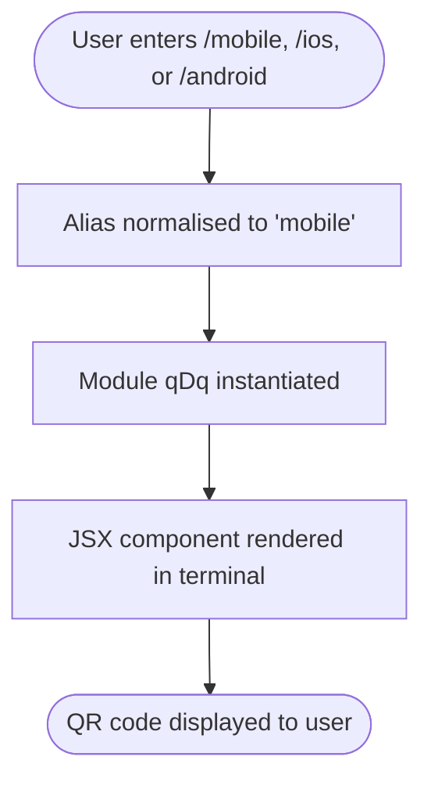

# `/mobile`

> Analysis basis: CC v2.1.144 bundle.js (AST extraction + Claude interpretation)
> Minimum version: v2.1.144

---

## Overview

The `/mobile` command renders a QR code within the Claude Code CLI interface, giving users a quick way to navigate to the Claude mobile app download page on their device. It is a purely presentational, local-JSX command with no server round-trips, no user input processing, and no persistent side effects. The command is also reachable via the aliases `/ios` and `/android`.

---

## Registration

| Field | Value |
|---|---|
| type | `local-jsx` |
| name | `mobile` |
| description | `Show QR code to download the Claude mobile app` |
| aliases | `ios`, `android` |
| module\_id | `qDq` |
| aliases (count) | 2 |

Analysis basis: CC v2.1.144 bundle.js:+11054309

---

## Input Branching

Because the depth-2 AST traversal returned an empty call graph and no extracted literals, no branching logic was resolved from the bundle for this command.



> Note: The flowchart above is derived from the registration metadata and the `local-jsx` command type convention. No additional branching paths were found at depth ≤ 2.

Analysis basis: CC v2.1.144 bundle.js:+11054309

---

## Behavioral Spec

### Alias Resolution

When the user invokes `/ios` or `/android`, the CLI normalises the input to the canonical name `mobile` before dispatching to module `qDq`. This is a standard alias resolution step common to all commands that declare the `aliases` field.

```
function resolveAlias(rawInput):
    canonicalName = lookupAlias(rawInput)   // "ios" -> "mobile", "android" -> "mobile"
    return dispatchCommand(canonicalName)
```

Analysis basis: CC v2.1.144 bundle.js:+11054309

### QR Code Rendering

The command type `local-jsx` indicates that the implementation renders a React/JSX component directly in the terminal output stream rather than emitting plain text. The component is expected to encode the Claude mobile app download URL into a QR code graphic suitable for terminal display.

```
function renderMobileCommand():
    url = CLAUDE_MOBILE_APP_DOWNLOAD_URL   // exact URL not resolved at depth ≤ 2
    qrCode = generateQRCode(url)
    return renderJSX(<TerminalQRCode data={qrCode} />)
```

<!-- TODO: not found in depth-2 traversal; needs --depth 4 -->
The exact download URL constant, QR code generation library, and any conditional platform-specific branching (e.g., App Store vs. Google Play) were not reachable at the current traversal depth.

Analysis basis: CC v2.1.144 bundle.js:+11054309

---

## State & Side Effects

| Item | Detail |
|---|---|
| Telemetry | None detected at depth ≤ 2 (telemetry array empty) |
| Hook registration | <!-- TODO: not found in depth-2 traversal; needs --depth 4 --> |
| appState changes | None detected at depth ≤ 2 |
| Sound | None detected at depth ≤ 2 |
| Network calls | None detected at depth ≤ 2; command is `local-jsx` type |
| Persistence | None detected at depth ≤ 2 |

---

## Version History

| Version | Change |
|---|---|
| v2.1.144 | Initial analysis; command registered as `local-jsx` with aliases `ios` and `android` |

---

## Common Mistakes

1. **Expecting platform-specific output** — Because `/ios` and `/android` are both aliases for the same `mobile` command, they produce identical output. There is no platform-specific QR code or URL differentiation observable from registration metadata alone.
2. **Assuming network activity** — The `local-jsx` command type renders output entirely client-side. The command does not fetch a URL or call any Anthropic API endpoint at invocation time.
3. **Treating the QR code as interactive** — The rendered output is a static terminal graphic. Clicking or selecting it in the terminal has no effect managed by Claude Code itself; any navigation depends on the user's terminal emulator or mobile camera app.
4. **Overlooking the alias at depth-2** — Automated tooling scanning only for the string `"mobile"` will miss invocations via `/ios` or `/android` unless alias expansion is accounted for.

---

## Appendix — Identifier Mapping

> For bundle debugging only. Identifiers change across versions.

| Identifier | Role |
|---|---|
| `qDq` | Module identifier for the `/mobile` command implementation |

> No additional obfuscated identifiers were returned by the depth-2 AST traversal (`identifiers` array was empty). Run a deeper traversal (`--depth 4`) against module `qDq` to recover internal function and variable identifiers.