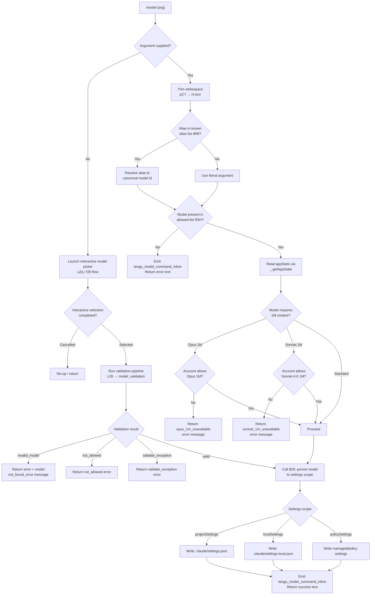

# `/model`

> Analysis basis: CC v2.1.145 bundle.js (AST extraction + Claude interpretation)
> Minimum version: v2.1.145

---

## Overview

The `/model` command sets the active AI model for the current Claude Code session. It accepts an optional model name argument; when a name is provided it is validated against the account's available models, whereas when invoked with no argument it presents an interactive picker. The command reads and mutates application state and persists the selection to the appropriate settings scope.

---

## Registration

| Field | Value |
|---|---|
| type | `local` |
| name | `model` |
| description | Set the AI model for Claude Code |
| argumentHint | `<model>` |
| supportsNonInteractive | `true` |
| module_id | `kVq` |
| load_inline | `true` |
| loc_byte | `11718225` |
| loc_byte_end | `11718399` |
| loc_line | `7220` |
| arbor_handler.name | `pC7` |
| arbor_handler.fqn | `claude-2.1.145::pC7` |
| arbor_handler.kind | `AsyncFunction` |
| arbor_handler.resolution_path | `module_id` |
| arbor_handler.n_hits | `0` |

Analysis basis: CC v2.1.145 bundle.js:+11718225

---

## Input Branching

Four distinct top-level paths exist: no argument (interactive picker), inline model name (immediate switch), rejected/blocked model, and validation failure — a Mermaid flowchart is used.



---

## Behavioral Spec

### Handler entry point (`pC7`)

Analysis basis: CC v2.1.145 bundle.js:+11710623

```
async function handleModelCommand(input, appContext):
    rawArg = input.trim()                        // H.trim @ +11710623

    if rawArg is not empty:
        // Inline / non-interactive path
        canonicalId = resolveAlias(rawArg, knownAliases)  // dR6.includes @ +11710639
        if canonicalId not in allowedModels:              // R5H.includes @ +11710726
            emit("tengu_model_command_inline")            // @ +11710781
            return errorText("model not allowed")

        state = appContext.getAppState()                  // _.getAppState @ +11710662
        check1MConstraints(canonicalId, state)            // d @ +11710779

        persistModelSelection(canonicalId, appContext)    // $28 @ +11710706
        emit("tengu_model_command_inline")
        return successText(canonicalId)

    else:
        // Interactive picker path
        return launchModelPicker(appContext)              // f28 @ +11710846
```

### Alias / model name resolution (`mK6`, `n1`)

Analysis basis: CC v2.1.145 bundle.js:+2162972 / +2164261

The resolver normalises a raw token into a canonical model identifier. Short aliases recognised include (but are not limited to):

| Alias token | Resolves to |
|---|---|
| `sonnet` | canonical Sonnet model id (bundle.js:+2164398) |
| `haiku` | canonical Haiku model id (bundle.js:+2164437) |
| `opus` | canonical Opus model id (bundle.js:+2164476) |
| `best` | highest-capability model id (bundle.js:+2164513) |
| `opusplan` | Opus in plan mode, else Sonnet (bundle.js:+2162915) |
| `[1m]` suffix | 1 M-context variant (bundle.js:+2164383) |

```
function resolveModelAlias(token):
    normalised = token.trim().toLowerCase()              // n1 @ +2164261
    normalised = normalised.replace(specialChars, "")   // A.replace @ +2164300
    if normalised matches short alias:
        return canonicalIdForAlias(normalised)
    if normalised starts with "anthropic.":             // K.startsWith @ +2158490
        return stripPrefix(normalised)
    return normalised
```

Analysis basis: CC v2.1.145 bundle.js:+2164272

### Interactive model picker (`f28`, `uZq`, `L28`)

Analysis basis: CC v2.1.145 bundle.js:+11675070 / +11675687 / +11675715

The interactive path builds a rich list of selectable models, annotates each entry with status badges (fast mode, credit consumption), runs a live validation probe against the API, then writes the chosen model.

```
async function launchModelPicker(appContext):
    modelList = buildModelList(appContext)    // fF @ +11675070
    // fF filters: anthropic. prefix, claude- prefix, startsWith checks
    // assigns display flags: "[1m]", "Opus Plan" label

    annotatedList = annotateModelEntries(modelList, appContext)  // uZq @ +11675687
    // Each entry may have suffix:
    //   " · Fast mode ON"          (bundle.js:+11676210)
    //   " · Fast mode OFF"         (bundle.js:+11676307)
    //   " · Draws from usage credits" (bundle.js:+11676261)
    // Badges sourced from appState fast-mode flag and billing tier

    showBillingTierInfo(annotatedList)       // iR7 @ +11676339
    // Displays source: model / projectSettings / localSettings /
    //                  policySettings / "Managed settings"
    //                  (bundle.js:+11676451..+11676613)

    selection = await promptUserPick(annotatedList)   // interactive UI

    if selection is null:
        return  // user cancelled

    validationResult = validateModelWithApi(selection, appContext)  // L28 @ +11675715
    handleValidationOutcome(validationResult, selection, appContext)
```

### API validation (`L28`, `nR7`, `Mb`)

Analysis basis: CC v2.1.145 bundle.js:+11673284

```
async function validateModelWithApi(modelId, appContext):
    if modelId.trim() is empty:
        return error("Model name cannot be empty")   // bundle.js:+11673321

    if modelId.toLowerCase() in bannedList:          // BAH.includes @ +11673463
        return error("not_allowed")

    if modelId in validationCache (xZq):             // xZq.has @ +11673565
        return cachedResult

    // Send probe request via Mb (API client)
    cacheKey = computeHash(modelId)                  // Vl_ @ +12456004
    probePayload = {
        model: modelId,
        messages: [{ role: "user", content: "Hi" }],  // bundle.js:+11673729
        max_tokens: 1,
        cache_control: "ephemeral"                    // bundle.js:+11673754
    }

    try:
        response = await apiCall(probePayload)        // Mb @ +12455811
        xZq.set(modelId, "valid")                    // xZq.set @ +11673773
        return "valid"
    catch AuthError:
        return error("Authentication failed. ...")    // bundle.js:+11674020
    catch NetworkError:
        return error("Network error. ...")            // bundle.js:+11674122
    catch NotFoundError where message contains "model:":
        emit("model_validation")                     // bundle.js:+11673660
        return error("invalid_model")                // bundle.js:+11675759
    catch other:
        emit("validate_exception")                   // bundle.js:+11675867
        return error(details)
```

### 1M-context availability guard (`oR7`, `aR7`, `rR7`)

Analysis basis: CC v2.1.145 bundle.js:+11675216 / +11675433 / +11675659

```
function check1MContextAvailability(modelId, state):
    if modelId matches Opus-1M pattern:
        if not state.accountAllows1MOpus:
            return {
                code: "opus_1m_unavailable",
                message: "Opus with 1M context is not available..."
                    // full URL: https://code.claude.com/docs/en/model-config#extended-context-with-1m
                    // bundle.js:+11675286
            }

    if modelId matches "sonnet[1m]" or "sonnet-4-6[1m]":  // bundle.js:+11676941, +11676967
        if not state.accountAllows1MSonnet:
            return {
                code: "sonnet_1m_unavailable",
                message: "Sonnet 4.6 with 1M context is not available..."
                    // bundle.js:+11675505
            }

    return null  // no constraint
```

### Settings persistence (`$28`, `dS`, `iX`)

Analysis basis: CC v2.1.145 bundle.js:+11677086 / +11677007 / +11677014

```
function persistModelSelection(modelId, appContext):
    settingsLayer = determineSettingsLayer(appContext)
    // Layers: projectSettings → .claude/settings.json
    //         localSettings   → .claude/settings.local.json  (bundle.js:+1198981)
    //         policySettings  → managed/org settings

    writeModelToLayer(settingsLayer, modelId)   // iX @ +2161204
    updateAppStateModel(appContext, modelId)    // _ @ +11677217
```

### Model list construction (`fF`, `wuH`, `YzL`, `DzL`)

Analysis basis: CC v2.1.145 bundle.js:+2158350

```
function buildModelList(appContext):
    baseList = getKnownModels()                  // LA @ +2158350
    enriched = baseList.map(entry => {
        name = entry.trim()                      // M.trim @ +2158438
        if name.startsWith("anthropic."):        // K.startsWith @ +2158490
            name = stripPrefix(name)
        if not isSupported(name):                // q.includes @ +2158518
            skip
        tier = resolveModelTier(name)            // MF6 @ +2158547
        if isDeprecated(name):                   // wuH @ +2158597, zzL.includes @ +2157691
            skip
        rank = computeRank(name)                 // rH9 @ +2158606
        displayName = formatDisplayName(name)    // YzL @ +2158661
        return { name, displayName, tier, rank }
    })
    return sortByRank(enriched)
```

---

## State & Side Effects

| Item | Detail |
|---|---|
| Telemetry: `tengu_model_command_inline` | Fired on inline (non-interactive) model switch, both success and not-allowed paths (bundle.js:+11710781) |
| Telemetry: `tengu_feature_ok` | Fired on successful feature flag evaluation (bundle.js:+955923) |
| Telemetry: `tengu_feature_bad` | Fired on failed feature flag evaluation (bundle.js:+955981) |
| Telemetry: `tengu_prompt_cache_1h_config` | Fired when prompt cache 1-hour TTL is configured during API probe (bundle.js:+12416935) |
| Telemetry: `tengu_api_success` | Fired after a successful API call during validation (bundle.js:+12457294) |
| appState changes | `model` field in app state updated to new canonical model id via `_.getAppState` / `$28` path (bundle.js:+11710662, +11710706) |
| Settings file write | Writes `model` key to `.claude/settings.json` or `.claude/settings.local.json` depending on active settings layer (bundle.js:+1198909, +1198919, +1198981) |
| Validation cache | Model id keyed in `xZq` Map after a successful probe; avoids repeated API round-trips (bundle.js:+11673565, +11673773) |
| API probe request | A minimal `{"messages":[{"role":"user","content":"Hi"}],"max_tokens":1}` request is sent to validate unknown models (bundle.js:+11673729, +11673754) |
| Hook registration | None observed in depth-2 traversal |
| Sound | None observed in depth-2 traversal |

---

## Version History

| Version | Change |
|---|---|
| v2.1.145 | Initial analysis |

---

## Common Mistakes

1. **Passing an unresolved alias for a 1M-context model without account entitlement** — e.g. `/model sonnet[1m]` will return a `sonnet_1m_unavailable` error if the account is not provisioned for 1M-context Sonnet 4.6. Check your plan at `https://code.claude.com/docs/en/model-config#extended-context-with-1m`.
2. **Using a bare model name that starts with `anthropic.`** — The resolver strips that prefix automatically, but supplying only the prefix portion (e.g. `/model anthropic.`) will result in an empty string after stripping, triggering the "Model name cannot be empty" error (bundle.js:+11673321).
3. **Expecting a persistent global change when project settings override** — The model is written to the *active* settings layer. If `projectSettings` is active, the choice is scoped to that project's `.claude/settings.json` and does not affect other projects or user-global config.
4. **Using the command non-interactively without an argument** — `supportsNonInteractive: true` applies only when an argument is provided. Invoking `/model` with no argument in a non-interactive context will launch the interactive picker, which may hang in a headless environment.
5. **Assuming all short aliases are stable** — Alias resolution (`dR6` list) is version-specific. Aliases such as `opusplan`, `best`, and `[1m]` suffix behaviour may change between bundle versions; prefer explicit canonical model identifiers in scripts.

---

## Appendix — Identifier Mapping

> For bundle debugging only. Identifiers change across versions.

| Identifier | Role |
|---|---|
| `pC7` | Main async handler for `/model` command (arbor_handler) |
| `H` | Generic utility / string helper (trim, includes, random, setTimeout) |
| `_` | App context / state accessor object |
| `$28` | Persist model selection to settings layer |
| `dS` | Settings write dispatcher |
| `mK6` | Model alias resolver entry point |
| `wJ` | Model alias table lookup |
| `n1` | String normalisation helper (trim, toLowerCase, replace) |
| `iX` | Settings layer read/write coordinator |
| `$A` | Settings object factory / reader |
| `MF` | Tier "max" settings handler |
| `TMH` | Tier "team" / "default_claude_max_5x" settings handler |
| `PuH` | Tier "enterprise" / "enterprise_usage_based" settings handler |
| `Av` | Model entry builder (cM + PM) |
| `CP` | Settings layer composer (firstParty path) |
| `cM` | Core model metadata accessor |
| `wA` | Provider type resolver (bedrock, foundry, mantle, vertex, gateway) |
| `PM` | Model permission / availability checker |
| `qv` | Model display entry composer |
| `d` | Feature-flag evaluator |
| `f28` | Interactive model picker orchestrator |
| `fF` | Model list builder / filterer |
| `A` | Generic array/map helper |
| `f` | Stream / connection handle |
| `M` | MCP server manager |
| `ONH` | MCP server connection handler |
| `y_K` | MCP update applier |
| `L` | Promise-based connection pool |
| `I` | Model id formatter / uppercaser |
| `$` | Async queue / deferred resolver |
| `nL5` | MCP client list builder |
| `K` | Array display formatter (padEnd, map) |
| `q` | File/sync utility (unlinkSync) |
| `MF6` | Model tier resolver |
| `g_` | Tier lookup helper |
| `wuH` | Deprecated-model checker (zzL list) |
| `rH9` | Model rank scorer |
| `YzL` | Model display-name formatter |
| `FAH` | "BAH includes" guard (blocked model list check) |
| `DzL` | Secondary model display formatter |
| `iH9` | "startsWith claude-" prefix guard |
| `CH` | Feature-flag side-effect handler |
| `oR7` | Opus-1M availability check |
| `ie` | Usage/limit status code handler |
| `dAH` | HTTP request builder |
| `tD1` | API limit status dispatcher |
| `aR7` | Sonnet-1M availability check |
| `oqH` | Sonnet usage/limit status handler |
| `rR7` | BAH-includes + toLowerCase model ban check |
| `uZq` | Model picker display/annotation builder |
| `hH` | Feature-flag ok emitter helper |
| `YK` | Terminal output writer (wA + xH) |
| `xH` | String coercion to terminal output |
| `XMH` | Extended model hint formatter |
| `AD` | Model status badge composer |
| `Yl` | Status flag formatter |
| `swH` | Fast-mode badge annotator (sonnet-4-6 path) |
| `jJ` | Model + settings entry combiner |
| `zT` | HTTP-based model status checker |
| `iR7` | Settings-source display builder |
| `A2H` | Settings-path builder (Pu + Z8) |
| `Z8` | Path joiner (pb6 + UB) |
| `xR` | Settings path string joiner (.claude/…) |
| `Dl` | Model display label finaliser |
| `L28` | Model API validation pipeline |
| `Mb` | API client / request executor |
| `iu` | Core HTTP/API request implementation |
| `P` | Binary stream reader / buffer accumulator |
| `V0H` | Response status/tier classifier |
| `G` | Model inclusion list (i26 + kZ8) |
| `tQ7` | Token/session finder |
| `Vl_` | SHA-256 hash utility (validation cache key) |
| `pg6` | Request header builder |
| `Go6` | Response error mapper |
| `iZH` | Prompt-cache TTL configurator |
| `BE` | Error envelope builder |
| `N` | Away-summary / token-usage tracker |
| `eCq` | Response chunk accumulator |
| `bP` | Response text sanitiser |
| `an6` | Temperature / model-specific param injector |
| `nX` | Message array mapper |
| `l3H` | Request body finaliser |
| `R7H` | Request timeout handler |
| `bEH` | Billing event emitter |
| `dg` | Usage-metric delta calculator |
| `cH6` | Cache-control header setter |
| `lR7` | Validation result dispatcher |
| `nR7` | Per-tier model validation check |
| `GH` | String-to-output coercer |