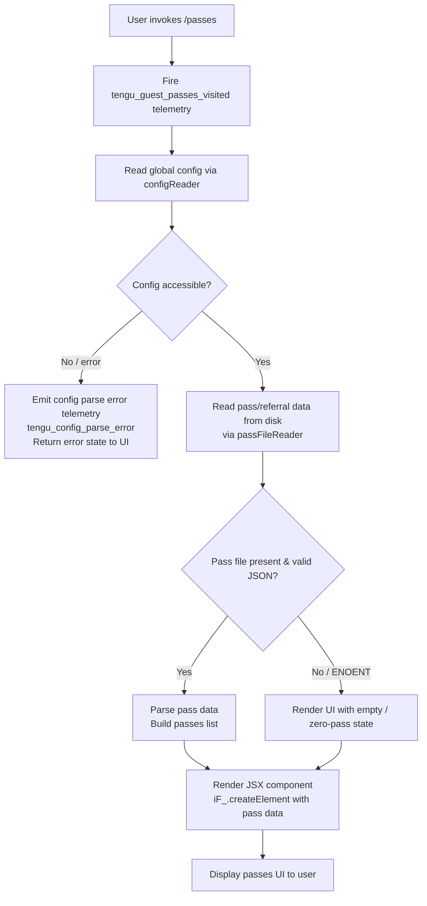

# `/passes`

> Analysis basis: CC v2.1.145 bundle.js (AST extraction + Claude interpretation)
> Minimum version: v2.1.145

---

## Overview

`/passes` is a referral/gifting command that allows the current Claude Code user to share a free week of access with friends. When invoked, it renders a JSX-based UI component (type `local-jsx`) and fires a dedicated telemetry event to record that the guest-passes screen was visited. The handler is an async function (`Yh7`) resolved via module `r0q`.

---

## Registration

| Field | Value |
|---|---|
| type | `local-jsx` |
| name | `passes` |
| description | `Share a free week of Claude Code with friends` |
| loc_byte | `11481635` |
| loc_byte_end | `11481957` |
| loc_line | `6975` |
| isHidden | `null` (not hidden) |
| module_id | `r0q` |
| load_inline | `true` |
| arbor_handler.name | `Yh7` |
| arbor_handler.fqn | `claude-2.1.145::Yh7` |
| arbor_handler.kind | `AsyncFunction` |
| arbor_handler.resolution_path | `module_id` |
| arbor_handler.n_hits | `2` |

Analysis basis: CC v2.1.145 bundle.js:+11481635

---

## Input Branching

The command has a relatively linear flow: it is invoked, fires a telemetry event, reads configuration and pass-file state, then renders a JSX UI. Three meaningful branches exist based on the state of existing config/pass data.



Analysis basis: CC v2.1.145 bundle.js:+11481318 (handler entry `Yh7`), +11481507 (`iF_.createElement` call), +11481458 (telemetry fire), +3169876 (config parse error path), +3169295 (readFileSync in pass-file reader)

---

## Behavioral Spec

### 1. Command Handler Entry (`Yh7`)

The top-level async handler is resolved from module `r0q` via `arbor_handler` (resolution path: `module_id`).

```
async function passesCommandHandler(context):
    fire telemetry event "tengu_guest_passes_visited"

    configData  = await readGlobalConfig()        // calls configReader (h6)
    passFileDir = buildPassFileDirectory(context) // calls passFileLocator (mP8 → z5)
    uiState     = await buildPassesUiState(       // calls passesUiBuilder (H8)
                      configData,
                      passFileDir
                  )

    return createElement(PassesComponent, uiState) // iF_.createElement
```

Analysis basis: CC v2.1.145 bundle.js:+11481318 (`Yh7→h6`), +11481352 (`Yh7→mP8`), +11481358 (`Yh7→H8`), +11481507 (`iF_.createElement`), +11481456 (`Yh7→d`)

---

### 2. Global Config Reader (`h6`)

Reads and validates the global Claude configuration. Internally delegates to several sub-functions for path resolution, timestamp bookkeeping, file watching, and lock acquisition.

```
function readGlobalConfig():
    configPath = resolveConfigPath()        // U6
    lockResult = acquireConfigLock(configPath)  // a1_

    if lock not acquired within timeout:
        emit "tengu_config_lock_contention"
        // literal: "Lock acquisition took longer than expected..."
        // bundle.js:+3167206

    rawConfig  = readConfigFile(configPath) // R$H → q.readFileSync, utf-8
    parsed     = parseJson(rawConfig)       // u6 → JSON.parse

    validateAuthPresence(parsed)
    startFileWatcher(configPath)            // YxL → jo6.watchFile / unwatchFile

    return parsed
```

Analysis basis: CC v2.1.145 bundle.js:+3166123 (`h6→U6`), +3166137 (`h6→B0`), +3166156 (`h6→a1_`), +3166160 (`h6→R$H`), +3169295 (`R$H→q.readFileSync`), +3169322 (utf-8 literal), +3167295 (`tengu_config_lock_contention`), +3166265 (`h6→YxL`)

---

### 3. Config File Low-Level Reader (`R$H`)

Handles the actual file I/O for config, including error guarding, backup directory management, and config state classification.

```
function configFileReader(configPath):
    if config not yet allowed to be accessed:
        throw Error("Config accessed before allowed.")  // literal bundle.js:+3169239

    try:
        raw = fs.readFileSync(configPath, "utf-8")  // bundle.js:+3169295, +3169322
    catch err:
        if err.code == "ENOENT":           // bundle.js:+3169469
            return defaultConfig()
        emit "tengu_config_parse_error"    // bundle.js:+3169876
        log error at level "error"         // literal bundle.js:+3169790
        return defaultConfig()

    parsed = safeJsonParse(raw)            // u6 → JSON.parse

    configState = classifyConfigState(parsed)
    // Possible states (literals bundle.js:+3164936–3165163):
    //   "unknown", "local", "migrated", "native", "installed",
    //   "disabled", "enabled", "no_permissions", "global", "not_configured"

    return parsed
```

Analysis basis: CC v2.1.145 bundle.js:+3169233 (`R$H→Error`), +3169239 (error message), +3169280 (`R$H→U6`), +3169295, +3169342 (`R$H→u6`), +3169345 (`R$H→hR`), +3169362 (`R$H→_`), +3169469 (ENOENT), +3169816 (`R$H→q.statSync`), +3169874 (`R$H→d`), +3169876 (parse error telemetry)

---

### 4. Pass-File Directory Locator (`mP8` → `z5`)

Resolves the on-disk path where guest-pass data files are stored. Delegates to the general config-directory locator (`z5`) which calls the app-loader (`LD`).

```
function passFileLocator():
    baseDir    = getAppConfigDirectory()   // z5 → LD
    passesDir  = path.join(baseDir, "passes")
    return passesDir
```

Analysis basis: CC v2.1.145 bundle.js:+11481352 (`Yh7→mP8`), +11141384 (`mP8→z5`), +2933110 (`z5→LD`), +11141432 (`mP8→h6`)

---

### 5. Passes UI State Builder (`H8`)

Orchestrates building the data model that the JSX component will render. Reads directory contents, parses each pass file, and classifies passes by status.

```
async function buildPassesUiState(config, passesDir):
    ensureDirectoryExists(passesDir)          // Aq_ → L.mkdirSync (bundle.js:+3167022)

    entries = fs.readdirStringSync(passesDir) // Aq_ → L.readdirStringSync (+3167984)

    passes = []
    for each entry in entries:
        if entry.startsWith(".backup."):      // literal bundle.js:+3168092
            skip
        if Number.isNaN(Number(namePart)):    // bundle.js:+3168115
            skip

        passData = loadPassEntry(entry, passesDir) // _q_

        passes.push(passData)

    // Keep only the 5 most recent backup slots
    // (literal 5 at bundle.js:+3168225)

    nowMs     = Date.now()                    // bundle.js:+3167067
    uiPayload = buildUiPayload(config, passes, nowMs)  // BpH → Date.now (+3166025)

    return uiPayload
```

Analysis basis: CC v2.1.145 bundle.js:+3164297 (`H8→Aq_`), +3164301 (`H8→B0`), +3164321 (`H8→H`), +3164353 (`H8→UpH`), +3164372 (`H8→Xv9`), +3164397 (`H8→BpH`), +3164413 (`H8→I`), +3164478 (`H8→R$H`), +3164494 (`H8→n56`), +3164630 (`H8→d`), +3164744 (`H8→_q_`)

---

### 6. Pass Entry File Loader (`_q_`)

Reads a single pass entry from disk, resolves its path, and deserialises it.

```
function loadPassEntry(entryName, passesDir):
    dir      = path.dirname(passesDir)      // _q_ → DY.dirname (+3166837)
    fullPath = resolveConfigPath(dir)       // _q_ → U6 (+3166851)
    display  = buildDisplayName(entryName) // _q_ → DN (+3166875)
    raw      = safeJsonStringify(...)       // _q_ → RH (+3166887)
    result   = atomicFileSave(fullPath, raw) // _q_ → y96 (+3166905)
    return result
```

Analysis basis: CC v2.1.145 bundle.js:+3166837–3166905

---

### 7. Atomic / Safe File Save (`y96`)

Used for reliably writing pass state to disk without corruption.

```
function atomicFileSave(targetPath, data):
    lstat = fs.lstatSync(targetPath)        // bundle.js:+1001645
    if lstat.isSymbolicLink():
        linkTarget = fs.readlinkSync(targetPath) // +1001250
        if not path.isAbsolute(linkTarget):
            linkTarget = path.resolve(path.dirname(targetPath), linkTarget) // +1001289

    tmpName   = crypto.randomBytes(6).toString("hex") // +1001875, +1001891, "hex" +1001903
    tmpPath   = path.join(dir, tmpName)

    fd        = fs.openSync(tmpPath, flags, 0o600) // permissions 384 = 0o600 (+3168507)
    fs.writeFileSync(fd, data)             // +1002311
    fs.fchmodSync(fd, originalMode)        // +1002369 ("Applied original permissions..." +1002390)
    fs.fsyncSync(fd)                       // +1002435
    fs.closeSync(fd)                       // +1001396
    fs.renameSync(tmpPath, targetPath)     // +1002563

    on error:
        fs.unlinkSync(tmpPath)             // +1002720
        throw
```

Analysis basis: CC v2.1.145 bundle.js:+1001163 (`y96→U6`), +1001250, +1001270, +1001289, +1001300, +1001317, +1001396, +1001409, +1001523, +1001565, +1001645, +1001663, +1001827, +1001875, +1002311, +1002369, +1002435, +1002563, +1002720

---

### 8. JSX Rendering

The handler's final step is to call `iF_.createElement` with the resolved UI state, producing the interactive passes UI.

```
function renderPassesUI(uiState):
    return iF_.createElement(PassesComponent, uiState)
```

Analysis basis: CC v2.1.145 bundle.js:+11481507

---

## State & Side Effects

| Item | Detail |
|---|---|
| Telemetry — `tengu_guest_passes_visited` | Fired immediately on command invocation (bundle.js:+11481458) |
| Telemetry — `tengu_config_parse_error` | Fired if the global config file cannot be parsed (bundle.js:+3169876) |
| Telemetry — `tengu_config_lock_contention` | Fired if config lock acquisition times out (bundle.js:+3167295) |
| Telemetry — `tengu_config_stale_write` | Fired if a stale config write is detected (bundle.js:+3167431) |
| Telemetry — `tengu_config_auth_loss_prevented` | Fired to guard against wiping auth from `~/.claude.json` (bundle.js:+3167774) |
| File I/O — read | Reads global config (`~/.claude.json`) and pass files from the passes sub-directory |
| File I/O — write (atomic) | May atomically update pass-entry files via temp-file + rename strategy (`y96`) |
| File I/O — mkdir | Creates passes directory if absent (`L.mkdirSync`, bundle.js:+3167022) |
| Config file watcher | Registers a file watcher on the global config via `jo6.watchFile` / `jo6.unwatchFile` (bundle.js:+3165635, +3165962) |
| Hook registration | `h9` calls `w6A.register` (bundle.js:+57267) — suggests a cleanup/hook registration on init |
| appState changes | None directly observed in depth-2 traversal |
| Sound | None detected |
| Background daemon interactions | Call graph reaches daemon-management functions (`w`, `Is_`, `Rs_`, `Z6`) via shared config infrastructure; these are side effects of config access, not of `/passes` itself |

---

## Version History

| Version | Change |
|---|---|
| v2.1.145 | Initial analysis |

---

## Common Mistakes

1. **Expecting plain text output** — `/passes` renders a JSX component (`local-jsx` type), not a Markdown text response. Programmatic consumers must handle the JSX render path rather than parsing stdout as text.
2. **Invoking while config is locked** — If another Claude Code instance holds the config lock, the command will log a contention warning (`tengu_config_lock_contention`) and may return partial state. Wait for the other instance to release the lock.
3. **Missing passes directory** — The command automatically creates the passes directory if it does not exist; deleting it between invocations is safe, but external tools should not assume the directory pre-exists.
4. **Conflating the backup slot limit** — Only 5 backup-named pass files are retained (bundle.js:+3168225). Files with names starting with `.backup.` are silently skipped when building the UI list; do not rely on them for pass enumeration.
5. **Auth-loss guard confusion** — The config writer will refuse to persist a config that drops authentication fields (see literal "saveConfigWithLock: re-read config is missing auth…" at bundle.js:+3167622). This is not a bug in `/passes`; it is a deliberate safety guard in the shared config layer.

---

## Appendix — Identifier Mapping

> For bundle debugging only. Identifiers change across versions.

| Identifier | Role |
|---|---|
| `Yh7` | Top-level async command handler for `/passes` (arbor_handler) |
| `h6` | Global config reader |
| `U6` | Config path resolver |
| `a1_` | Config lock acquirer |
| `R$H` | Low-level config file I/O function |
| `u6` | Safe JSON parse wrapper |
| `hR` | String prefix/slice utility (used in config key processing) |
| `H` | Random / timer utility (Math.random + setTimeout) |
| `_` | Filesystem abstraction object (readdirStringSync, statSync, toUpperCase etc.) |
| `A8` | Shared utility (used across config and UI paths) |
| `Wv9` | Backup directory scanner |
| `qq_` | Backup path builder (path.join + l8) |
| `M` | MCP / session registry map helper |
| `$` | General utility / dvq caller |
| `I` | Message/content builder (includes file reading and buffer operations) |
| `y$K` | Content variant builder (CV, k$K, J6A) |
| `RH` | JSON.stringify wrapper |
| `B4` | String replacement / last-index utility |
| `RSH` | Extra string-processing helper (x_A) |
| `R$K` | File-read + buffer-length path (reads content with byte-length check) |
| `NH` | Log/error queue manager (push/shift, gc.logError) |
| `x_` | Error string normaliser |
| `xH` | String coercion helper |
| `Hq` | Essential-traffic queue helper (JOA) |
| `mhK` | Circular log buffer (shift + push on aR6) |
| `d` | Shared state/context object |
| `w` | Background-session process manager (spawn, kill, memory check) |
| `A` | Process map (get/set/values, f.toLowerCase) |
| `C` | Worker/child-process wrapper (R1K, NH, J55, z.write) |
| `CH` | Helper that reads from context `d` |
| `hH` | Helper that reads from context `d` (variant) |
| `bT6` | Memory classification helper (c6, Z6; macos literal) |
| `u` | Daemon idle/timeout manager (clearTimeout, setTimeout, Math.round) |
| `Z6` | Background-session slot manager (F56, g56, ls, k$H, qo6, U56, UF, h6) |
| `Is_` | IPC connection establisher (TU.claim, pZ8.connect, f.on/once/write/end) |
| `Rs_` | Background-session lifecycle manager (done/killed/stopped/failed/crashed states) |
| `L` | Promise-set tracker (q.add, f.finally, q.delete) |
| `D` | Daemon loop / watchdog (Z6, $.dispose, bT6, Date.now, self-recursion) |
| `S` | Settable/clearable timer handle |
| `YxL` | Config file watcher (jo6.watchFile / unwatchFile) |
| `cl` | Watch-event callback helper |
| `h9` | Hook registrar (w6A.register) |
| `mP8` | Pass-file directory resolver (calls z5 and h6) |
| `z5` | App config directory resolver (LD, h6) |
| `LD` | App loader / startup orchestrator (RK, wv, Q3, LA, sj, i$, S9H) |
| `RK` | String-to-xH coercion (startup) |
| `wv` | Transport/network resolver (wF6, S9H, zl, jv, xH) |
| `Q3` | First-party auth checker (wA) |
| `sj` | Configuration value accessor |
| `i$` | Auth/API-key validator (ANTHROPIC_API_KEY, apiKeyHelper, none) |
| `S9H` | Node type normaliser (xH, N5H) |
| `H8` | Passes UI state builder (orchestrates Aq_, BpH, R$H, _q_, n56) |
| `Aq_` | Directory-based pass file enumerator and copier |
| `B69` | Object-assign merge helper (Oa8, Object.assign) |
| `Oa8` | Default config value supplier (U69) |
| `n56` | Pass count / numeric helper |
| `Z` | String with startsWith check (pass entry filter) |
| `X` | MCP connection handler (kZ8, ck, Rp, Promise.all, kLH, pn, NH, x_) |
| `kZ8` | MCP transport factory |
| `V` | Array slice target (backup window) |
| `y96` | Atomic file-save (temp + rename strategy) |
| `O` | lstat result / symbolic-link checker (k8) |
| `O8` | Error-augmentation helper (A8) |
| `f` | File handle / stream object |
| `UpH` | UI prop helper |
| `Xv9` | Object.entries iterator (used in UI state build) |
| `BpH` | Timestamp-aware UI payload builder (Date.now) |
| `_q_` | Single pass-entry file loader (dirname, U6, DN, RH, y96) |