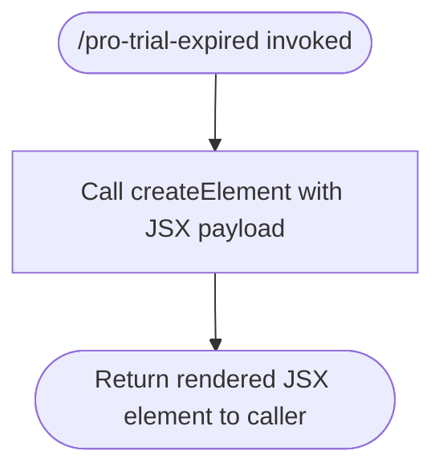

# `/pro-trial-expired`

> Analysis basis: CC v2.1.143 bundle.js (AST extraction + Claude interpretation)
> Minimum version: v2.1.143

---

## Overview

The `/pro-trial-expired` command is a hidden, local JSX command that renders a UI panel presenting options to users whose Claude Code Pro plan trial has ended. It is not surfaced in the standard command palette and is invoked programmatically when the runtime detects trial expiry. The command's sole implementation responsibility is constructing and returning a JSX element via React's `createElement`.

---

## Registration

| Field | Value |
|---|---|
| type | `local-jsx` |
| name | `pro-trial-expired` |
| description | `Options shown when the Pro plan Claude Code trial has ended` |
| isHidden | `true` |
| module_id | `IEq` |

Analysis basis: CC v2.1.143 bundle.js:+11676353

---

## Input Branching

The depth-2 call graph contains a single call edge: the command's render function calls `createElement` to produce its output. No conditional branches, no input parameters, and no literals were found within the traversal depth. The command appears to be a pure rendering unit with no user-supplied input processing.



Analysis basis: CC v2.1.143 bundle.js:+11676233

---

## Behavioral Spec

### Render Pro Trial Expired Panel

```
function renderProTrialExpiredPanel():
    element = createElement(
        componentType  = <UI panel component>,
        props          = <trial-expiry options props>,
        children       = <option elements>
    )
    return element
```

- The function takes no explicit user input arguments.
- It delegates all visual structure to `createElement`, consistent with a React functional component pattern.
- The returned element is handed back to the CLI's slash-command dispatch layer for display in the terminal UI.

Analysis basis: CC v2.1.143 bundle.js:+11676233

> **Note on depth limitation:** Only one call edge (`renderProTrialExpiredPanel` → `createElement`) was recovered at depth ≤ 2. The internal props structure, child component tree, and any conditional rendering within the panel (e.g., upgrade CTA vs. downgrade option) are not resolvable at this traversal depth.
> <!-- TODO: not found in depth-2 traversal; needs --depth 4 -->

---

## State & Side Effects

| Item | Detail |
|---|---|
| Telemetry | None detected at depth ≤ 2 traversal |
| Hook registration | <!-- TODO: not found in depth-2 traversal; needs --depth 4 --> |
| appState changes | <!-- TODO: not found in depth-2 traversal; needs --depth 4 --> |
| Sound | <!-- TODO: not found in depth-2 traversal; needs --depth 4 --> |
| Visibility | Command is hidden (`isHidden: true`); does not appear in `/help` or command palette |
| Invocation pattern | Programmatic only; not intended for direct user typing |

---

## Version History

| Version | Change |
|---|---|
| v2.1.143 | Initial analysis |

---

## Common Mistakes

1. **Attempting to invoke `/pro-trial-expired` manually**: Because `isHidden` is `true`, the command is not listed in the command palette. Typing it directly in a session where trial expiry has not been detected may produce no visible effect or an unexpected no-op, depending on the dispatch layer's guard logic.
2. **Assuming this command accepts arguments**: The registration and call graph contain no input parameters or argument-parsing literals. Passing any text after the command name is unlikely to alter its behavior.
3. **Conflating this command with a settings or billing API call**: The command is a pure JSX rendering unit. Any actual subscription management actions (e.g., upgrading a plan) are handled by components rendered *inside* the panel, not by this command's own implementation.
4. **Expecting telemetry from this command directly**: No `tengu_*` events are emitted at the command registration or render layer. Telemetry, if any, would originate from child components or user interaction handlers within the rendered panel — not captured at this traversal depth.

---

## Appendix — Identifier Mapping

> For bundle debugging only. Identifiers change across versions.

| Identifier | Role |
|---|---|
| `ZS7` | Pro trial expired panel render function (the command's JSX component implementation) |