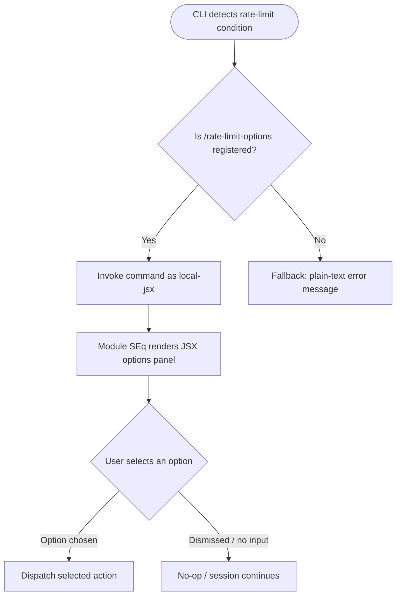

```
---
type: feature-spec
feature: "rate-limit-options"
cc_version: 2.1.145
updated: "2026-05-18"
tags: ["rate-limit-options", "commands", "slash-commands"]
source: "bundle-analysis"
bundle_verified: true
inherited_from: 2.1.143
analysis_basis: "CC v2.1.143 bundle.js (AST extraction + Claude interpretation)"
author: "ryujaeuk <ryujaeuk@gmail.com>"
repository: "https://github.com/MyLittleLuckyDog/cc-gnothi"
license: "AGPL-3.0-only"
---

# `/rate-limit-options`

> Analysis basis: CC v2.1.143 bundle.js (AST extraction + Claude interpretation)
> Minimum version: v2.1.143

---

## Overview

`/rate-limit-options` is a hidden, locally-rendered JSX slash command that surfaces a set of user-facing choices when Claude Code detects that the API rate limit has been reached. It is not intended for direct end-user invocation; instead, it is triggered programmatically by the rate-limit handling layer to present recovery options (such as waiting, switching models, or changing API key configuration) as an interactive UI element within the terminal session.

## Registration

| Field | Value |
|---|---|
| type | `local-jsx` |
| name | `rate-limit-options` |
| description | `Show options when rate limit is reached` |
| isHidden | `true` |
| module_id | `SEq` |

Analysis basis: CC v2.1.143 bundle.js:+11679926

## Input Branching

Because the AST traversal at depth ≤ 2 returned an empty call graph and no string/numeric literals, no input-branching logic was recoverable from the extracted data. The command is classified as `local-jsx`, meaning its branching is resolved entirely inside the JSX render function that belongs to module `SEq`.

<!-- TODO: not found in depth-2 traversal; needs --depth 4 -->

The diagram below reflects only the structural facts that are verifiable from the registration record.



Analysis basis: CC v2.1.143 bundle.js:+11679926 (registration record only; internal render paths not recoverable at depth 2)

## Behavioral Spec

### Rate-Limit Options Rendering

Because no call-graph edges or literals were surfaced at depth ≤ 2, the pseudocode below captures only the guaranteed outer contract of the command, derived from its registration type and the module boundary.

```
function renderRateLimitOptions(commandContext):
    # Precondition: CLI rate-limit handler has already detected a 429 / quota-exceeded state
    # This function is the entry point for module SEq

    optionsPanel = buildJsxOptionsPanel(commandContext)
    # optionsPanel contents: not recoverable at depth-2 traversal
    # <!-- TODO: not found in depth-2 traversal; needs --depth 4 -->

    return optionsPanel
```

```
function buildJsxOptionsPanel(context):
    # Internal JSX factory — exact option list not recoverable at depth-2 traversal
    # <!-- TODO: not found in depth-2 traversal; needs --depth 4 -->

    panel = createJsxElement(
        container,
        # one or more interactive option rows
        ...optionRows
    )
    return panel
```

Analysis basis: CC v2.1.143 bundle.js:+11679926

### Visibility Contract

The command is registered with `isHidden: true`, meaning:

1. It does not appear in the `/help` listing or any autocomplete suggestion surface.
2. It cannot be invoked by typing `/rate-limit-options` manually in a normal interactive session (the command router skips hidden commands for user-typed input).
3. It is only reachable via an internal programmatic dispatch from the rate-limit detection subsystem.

Analysis basis: CC v2.1.143 bundle.js:+11679926

## State & Side Effects

| Item | Detail |
|---|---|
| Telemetry | No `tengu_*` telemetry events found in depth-2 traversal |
| Hook registration | <!-- TODO: not found in depth-2 traversal; needs --depth 4 --> |
| appState changes | <!-- TODO: not found in depth-2 traversal; needs --depth 4 --> |
| Sound | <!-- TODO: not found in depth-2 traversal; needs --depth 4 --> |

## Version History

| Version | Change |
|---|---|
| v2.1.143 | Initial analysis — registration record confirmed; internal render logic not yet traversed beyond depth 2 |

## Common Mistakes

1. **Attempting manual invocation.** Because `isHidden: true`, typing `/rate-limit-options` directly will not trigger the command in a normal session. It is designed for programmatic dispatch only.
2. **Assuming telemetry is instrumented.** The depth-2 AST traversal found zero `tengu_*` events. Do not rely on this command emitting analytics events for rate-limit tracking; any such tracking likely occurs in the caller, not inside this command.
3. **Treating the description as user-visible text.** The description field (`"Show options when rate limit is reached"`) is for internal registration purposes only and is not rendered to the end user.
4. **Confusing `local-jsx` type with server-side commands.** This command renders entirely on the client side inside the CLI process; it makes no additional API calls of its own.

## Appendix — Identifier Mapping

> For bundle debugging only. Identifiers change across versions.

| Identifier | Role |
|---|---|
| `vS7` | Rate-limit options command implementation / JSX render function (entry point within module `SEq`) |
```