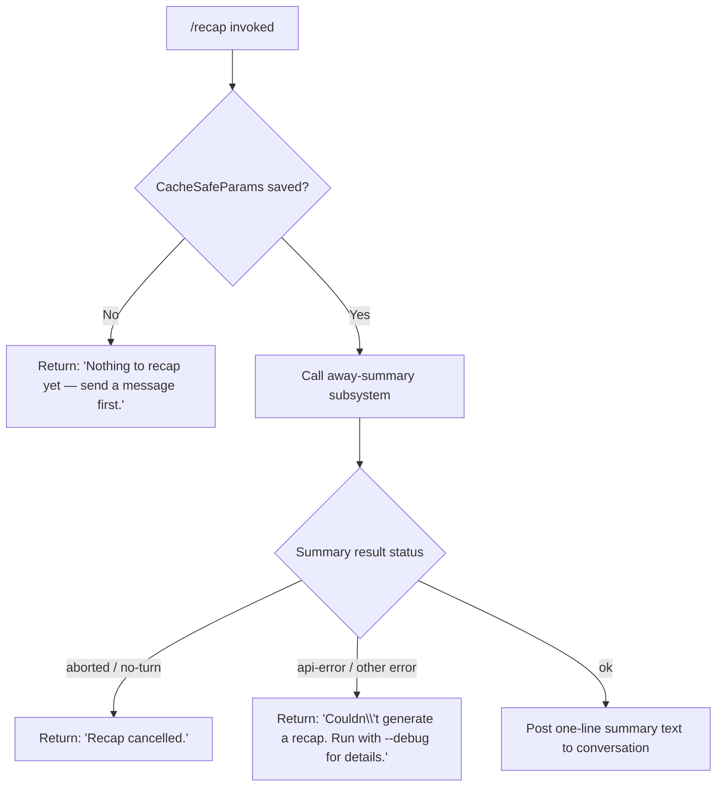

# `/recap`

> Analysis basis: CC v2.1.145 bundle.js (AST extraction + Claude interpretation)
> Minimum version: v2.1.145

---

## Overview

The `/recap` command immediately triggers a one-line summary of the current session by invoking the away-summary subsystem inline, without waiting for the normal periodic recap schedule. It reads cached session parameters, calls the model to produce a compact summary, and posts the resulting text back to the conversation. If no conversation turns have occurred yet, or if the summary call fails, it surfaces a short human-readable error instead.

---

## Registration

| Field | Value |
|---|---|
| type | `local` |
| name | `recap` |
| description | `Generate a one-line session recap now` |
| loc_byte | `11989230` |
| loc_byte_end | `11989446` |
| loc_line | `7752` |
| supportsNonInteractive | `false` |
| thinClientDispatch | `post-text` |
| load_inline | `true` |
| load_ident | `Pp7` |
| arbor_handler.name | `Pp7` |
| arbor_handler.kind | `AsyncFunction` |
| arbor_handler.fqn | `claude-2.1.145::Pp7` |
| arbor_handler.resolution_path | `load_ident` |
| arbor_handler.n_hits | `0` |

Analysis basis: CC v2.1.145 bundle.js:+11989230

The handler was inlined as `load: () => Promise.resolve({ call: Pp7 })`. Arbor resolved it via the `load_ident` path; `n_hits: 0` indicates no additional cross-references were found beyond the direct inline binding.

---

## Input Branching

Four distinct outcome branches exist in the handler, warranting a Mermaid flowchart.



Analysis basis: CC v2.1.145 bundle.js:+11988838 (handler entry `Pp7`), +11988980 ("Nothing to recap yet"), +11989072 ("Recap cancelled."), +11989130 ("Couldn't generate a recap."), +5289032 ("[awaySummary] no CacheSafeParams saved, skipping")

---

## Behavioral Spec

### Top-Level Handler — `recapCommandHandler` (`Pp7`)

```
async function recapCommandHandler(commandContext):
    result = await awaySummaryDispatcher(commandContext)

    if result is null or result.status == "no-turn":
        return postText("Nothing to recap yet — send a message first.")

    if result.status == "aborted":
        return postText("Recap cancelled.")

    if result.status in ["api-error", "other"]:
        return postText("Couldn't generate a recap. Run with --debug for details.")

    // result.status == "ok"
    return postText(result.summaryText)
```

Analysis basis: CC v2.1.145 bundle.js:+11988838

The `thinClientDispatch: "post-text"` registration field confirms that the successful path delivers output as plain text posted back to the conversation stream.

---

### Away-Summary Dispatcher — `awaySummaryDispatcher` (`D98`)

```
async function awaySummaryDispatcher(context):
    cacheSafeParams = loadCacheSafeParams(context)  // yZH

    if cacheSafeParams is null:
        log.debug("[awaySummary] no CacheSafeParams saved, skipping")
        return { status: "no-turn" }

    abortController = new AbortController()
    context.signal.addEventListener("abort", () => abortController.abort())

    summaryResult = await runAwaySummaryQuery(
        cacheSafeParams,
        abortController.signal
    )  // IZ

    if summaryResult.status == "aborted":
        return { status: "aborted" }

    if summaryResult.status == "api-error":
        latestApiError = findLatestApiError(summaryResult)  // q.find
        return { status: "api-error", error: latestApiError }

    if summaryResult.status == "ok":
        flatLines = flattenSummaryLines(summaryResult)  // YK1 → H.flatMap
        return { status: "ok", summaryText: flatLines.join(", ") }

    return { status: "other" }
```

Analysis basis: CC v2.1.145 bundle.js:+5289011 (`yZH`), +5289032 (no-CacheSafeParams log literal), +5289090 (`"no-turn"`), +5289127 (`addEventListener`), +5289158 (`abort`), +5289205 (`IZ`), +5289550 (`"aborted"`), +5289639 (`"api-error"`), +5289700 (`"ok"`), +5289567 (`q.find`), +5289656 (`YK1`)

Key observations:

- The literal `"[awaySummary] no CacheSafeParams saved, skipping"` is logged at the `debug` level (confirmed by the `"debug"` literal at +201601) when the pre-requisite cached parameters are absent, meaning the user has not yet exchanged any messages with the model this session.
- A dedicated `AbortController` is wired to the parent context signal so that if the user cancels (e.g., Ctrl-C) while the recap model call is in flight, the sub-call is also aborted cleanly.
- The `"deny"` path with message `"Away summary cannot use tools"` (+5289323, +5289338) is enforced inside the away-summary subsystem: tool-use is unconditionally blocked during a recap inference run.

---

### Away-Summary Query Engine — `awaySummaryQueryEngine` (`IZ`)

```
async function awaySummaryQueryEngine(cacheSafeParams, signal):
    startTime = Date.now()
    sessionMessages = getMainConversationTail(cacheSafeParams)  // IN_

    if sessionMessages is empty:
        return { status: "no-turn" }

    formattedContext = buildFormattedContext(sessionMessages)  // f6H
    turnBuffer = buildTurnBuffer(formattedContext)  // I

    abortedEntry = turnBuffer.at("main")  // G.at, literal "main"
    randomId = generateRandomHex(8)  // em → PY1.randomBytes, literal "hex"

    modelResponse = await runCoreQuery(
        turnBuffer,
        { signal, noTools: true, mode: "away_summary" }
    )  // ib → fD7

    if signal.aborted:
        return { status: "aborted" }

    summaryLines = modelResponse.flatMap(extractTextLines)  // D.map
    return {
        status: "ok",
        lines: summaryLines,
        elapsedMs: Date.now() - startTime
    }
```

Analysis basis: CC v2.1.145 bundle.js:+10068740 (`Date.now`), +10068856 (`IN_`), +10069045 (`"main"`), +10069070 (`G.at`), +10069096 (`em`), +10069120 (`f6H`), +10069140 (`I`), +10069271 (`ib`), +10070009 (`D.map`), +10070231 (`d`), +10070325 (`GD7`)

---

### Core Agent Query — `coreAgentQuery` (`fD7`)

This is the shared agent query function used by the recap path (via `ib`) as well as normal conversational turns. When invoked from the recap path, it runs in a restricted mode:

- Tool use is denied (literal `"Away summary cannot use tools"` at +5289338, denial type `"deny"` at +5289323)
- The `avoid_prompts` flag is active (literal at +10066694), suppressing system-prompt injection
- The model call proceeds through the standard streaming pipeline (`D.callModel` at +10036279), but tool-use blocks are rejected before execution

Key internal lifecycle markers emitted during this call (visible as string literals in `fD7`'s scope):

| Phase marker | Byte offset |
|---|---|
| `stream_request_start` | +10032203 |
| `query_fn_entry` | +10032230 |
| `query_started` | +10032262 |
| `query_setup_start` | +10035084 |
| `query_setup_end` | +10035316 |
| `query_api_loop_start` | +10036147 |
| `query_api_streaming_start` | +10036230 |
| `query_api_streaming_end` | +10039330 |

Analysis basis: CC v2.1.145 bundle.js:+10030859 (`fD7` entry via `ib`)

---

### Conversation Log Writer — `conversationLogWriter` (`R$K`)

```
async function conversationLogWriter(entry, context):
    logDir = path.dirname(context.logPath)  // UPH.dirname
    ensureDir(logDir)  // CV

    rotationState = getRotationState(logDir)  // I_H
    existingSize = Buffer.byteLength(serialize(entry))  // Buffer.byteLength
    
    if shouldRotate(existingSize, rotationState):  // AAA
        await rotateLogs(logDir, context)  // bN6.then → S$K

    await appendEntry(entry, context)  // S$K.bind
    await signalLogUpdate()  // h9 → w6A.register
```

Analysis basis: CC v2.1.145 bundle.js:+201113 (`qSH`), +201138 (`I_H`), +201146 (`UPH.dirname`), +201176 (`CV`), +201191 (`U6`), +201266 (`M86`), +201283 (`HAA`), +201315 (`e_A`), +201321 (`Buffer.byteLength`), +201354 (`AAA`), +201371 (`bN6.then`), +201380 (`S$K.bind`), +201476 (`h9`)

Log rotation uses file extension `.txt` (+200571), takes a slice offset of 4 characters (+200593), and uses `LN.stat`, `LN.rename`, `LN.unlink` for file management.

---

### Session-State Loader — `sessionStateLoader` (`IN_`)

```
async function sessionStateLoader(context):
    appState = context.getAppState()  // H.getAppState
    conversationHistory = loadConversation(appState)  // MqH → cC, _.load, H.dump
    
    applyFeatureFlags(context, appState)  // F3H
    mergedState = mergeSessionParams(appState, context)  // Os9
    
    updatedAppState = Object.assign({}, appState, mergedState)
    context.setAppState(updatedAppState)  // H.setAppState
    
    sessionToken = generateSessionToken()  // em → PY1.randomBytes(8, "hex")
    sessionUUID = crypto.randomUUID()  // QKq.randomUUID
    
    return { history: conversationHistory, state: updatedAppState, token: sessionToken }
```

Analysis basis: CC v2.1.145 bundle.js:+10066464 (`H.getAppState`), +10066694 (`"avoid_prompts"`), +10066823 (`MqH`), +10067073 (`F3H`), +10067179 (`Os9`), +10067320 (`H.setAppState`), +10067419 (`Object.assign`), +10068222 (`em`), +10068316 (`QKq.randomUUID`)

---

## State & Side Effects

| Item | Detail |
|---|---|
| Telemetry (direct path) | No `tengu_*` events are fired directly from `Pp7` or `D98` in the recap-specific code paths. Telemetry events listed below come from the shared query engine (`fD7`) reachable via `ib`. |
| `tengu_auto_compact_rapid_refill_breaker` | Fired if auto-compaction rapid-refill circuit breaker trips (+10033182) |
| `tengu_auto_compact_succeeded` | Fired after successful auto-compaction (+10033643) |
| `tengu_ptl_surfaced_to_user` | Fired when prompt-too-long is surfaced (+10035642) |
| `tengu_orphaned_messages_tombstoned` | Fired when orphaned messages are tombstoned (+10037687) |
| `tengu_model_fallback_triggered` | Fired on model fallback (+10040327) |
| `tengu_query_error` | Fired on query error (+10040652) |
| `tengu_model_response_keyword_detected` | Fired when a response keyword is detected (+10041296) |
| `tengu_malformed_tool_use_response` | Fired on malformed tool-use response (+10044650) |
| `tengu_stop_hook_block_count` | Fired with stop-hook block count (+10045604) |
| `tengu_forked_agent_default_turns_exceeded` | Fired when forked-agent turn limit exceeded (+10070233) |
| `tengu_fork_agent_query` | Fired on fork-agent query (+10070676) |
| `tengu_feature_ok` / `tengu_feature_bad` | Fired by feature-flag check helper `NH` (+955923, +955981) |
| AbortController wiring | A fresh `AbortController` is created per `/recap` invocation; its signal is chained to the parent command context signal (+5289127–+5289158) |
| Tool use | Unconditionally blocked during away-summary inference; any tool-use attempt returns `"deny"` with message `"Away summary cannot use tools"` (+5289323–+5289338) |
| Log append | If conversation logging is active, the summary result is appended via the shared log-rotation writer (`R$K` / `S$K`) with `LN.appendFile` (+200926) |
| Hook registration | `h9` calls `w6A.register` (+57267) to signal log-update listeners after a log write; this is part of the shared logging path, not specific to `/recap` |
| appState changes | `H.setAppState` is called inside `IN_` (+10067320) to merge updated session parameters; the recap path reads but does not independently mutate app state beyond what the shared session-state loader does |
| Sound | No sound effects found in the depth-2 traversal for this command |
| `supportsNonInteractive` | `false` — the command cannot be used in non-interactive (piped / headless) mode |

---

## Version History

| Version | Change |
|---|---|
| v2.1.145 | Initial analysis |

---

## Common Mistakes

1. **Running `/recap` before sending any message.** The command returns `"Nothing to recap yet — send a message first."` if `CacheSafeParams` have not been saved (i.e., no model turn has completed). You must have at least one completed conversation turn before a recap can be generated.

2. **Expecting tool use during recap.** The away-summary subsystem unconditionally blocks tool calls. If your session involves tool-heavy workflows, the recap is generated solely from the conversation text; no tool re-execution occurs.

3. **Interpreting a cancellation as failure.** If you press Ctrl-C while `/recap` is generating, the response is `"Recap cancelled."` — this is a clean abort, not an error. Re-running `/recap` after the interruption will start a new attempt.

4. **Using `/recap` in non-interactive mode.** The registration field `supportsNonInteractive: false` means piping input or running in headless CI contexts will not invoke this command.

5. **Expecting verbose output.** `/recap` is designed to produce a single condensed line. The away-summary subsystem is invoked with a minimal prompt that specifically requests one-line output; asking the model to expand further is outside this command's scope.

---

## Appendix — Identifier Mapping

> For bundle debugging only. Identifiers change across versions.

| Identifier | Role |
|---|---|
| `Pp7` | Top-level `/recap` command handler (`recapCommandHandler`, AsyncFunction) |
| `D98` | Away-summary dispatcher — orchestrates param lookup, abort wiring, and result routing |
| `yZH` | CacheSafeParams loader — retrieves persisted session parameters |
| `I` | Turn-buffer builder — assembles conversation turns for the model call |
| `y$K` | Conversation serializer — formats messages into the wire representation |
| `J6A` | Message-part encoder — encodes individual message parts |
| `H` | Ambient utility / timer object (context-dependent; see `Math.random`, `setTimeout` edges) |
| `RH` | JSON serializer wrapper (calls `JSON.stringify`) |
| `_` | Generic collection helper (varied usages across call sites) |
| `B4` | Path/string utility — handles `lastIndexOf`, `slice`, `replace` on path-like strings |
| `n_A` | Map-over-segments helper (`Z$K.map`) |
| `q` | File-system utility object (includes `unlinkSync`, `find`, `at`) |
| `A` | File-system / string collection (includes `toLowerCase`, `lastIndexOf`, `slice`) |
| `RSH` | Log-record writer wrapper |
| `x_A` | Stream write helper (`H.write`) |
| `R$K` | Conversation log writer — handles rotation, append, and update signalling |
| `qSH` | Timer-queue manager (`clearTimeout`, `setTimeout`, `setImmediate`, join/push operations) |
| `I_H` | Rotation-state inspector — reads current log directory metadata |
| `U6` | Log-path utility |
| `M86` | EISDIR error classifier (`A8`) |
| `HAA` | Log-path joiner (`UPH.join`, `k6`) |
| `e_A` | Log-file rotator (`LN.stat`, `LN.rename`, `LN.unlink`) |
| `S$K` | Log-append executor (`LN.mkdir`, `LN.appendFile`, rotation helpers) |
| `h9` | Log-update signal registrar (`w6A.register`) |
| `IZ` | Away-summary query engine — drives the model call for recap generation |
| `IN_` | Session-state loader — reads/merges app state, generates session tokens |
| `jk` | Core query initializer (sets up abort, binds response handlers) |
| `MqH` | Conversation loader (`cC`, `_.load`, `H.dump`) |
| `F3H` | Feature-flag applier for session context |
| `Os9` | Session-parameter merger |
| `f` | Resource-closer helper (`A.close`, `q.close`) |
| `Ww8` | Session-metadata builder |
| `em` | Random hex generator (`PY1.randomBytes`) |
| `G` | Message-array wrapper (includes `i26`, `kZ8` sub-helpers) |
| `i26` | Message-array entry helper (sub of `G`) |
| `kZ8` | Message-array entry helper (sub of `G`) |
| `f6H` | Context formatter — builds formatted conversation context for the model |
| `jL` | Hook invoker helper (calls `h9`) |
| `HNH` | Message filter — filters by provider type `"ant"` |
| `ib` | Core query dispatcher — routes to `fD7` (core agent query) or `tY8` (subagent exit) |
| `fD7` | Core agent query engine — full streaming model-call loop |
| `tY8` | Subagent-exit handler (`aY8`, `qx.get/delete`, `wS_.delete`) |
| `hH` | Turn-type checker (literal `"turn"`) |
| `CH` | Conversation-history helper |
| `$W6` | Tool-use-summary membership checker (`MO7.has`) |
| `lwH` | Low-watermark helper for conversation trimming |
| `ew8` | Extra-context injector |
| `e9q` | Tool-use-summary entry builder (calls `$W6`) |
| `D` | Background-daemon manager (spawn, dispose, memory checks) |
| `Z6` | Background-process registry helper |
| `$` | Disposable resource manager (`dvq`) |
| `bT6` | Background-process bootstrap helper |
| `vs_` | Background spare-process spawner (`Bun.spawn`, `CU.mkdir/unlink`) |
| `d` | Shared error/logger instance |
| `NH` | Feature-flag evaluator (emits `tengu_feature_ok` / `tengu_feature_bad`) |
| `GD7` | Forked-agent query wrapper (emits `tengu_fork_agent_query`) |
| `w8` | Background-session manager (`rZ.randomUUID`, `J`, `j`) |
| `J` | Background-worker lifecycle controller |
| `w` | Background-worker pool manager (spawn, kill, memory monitoring) |
| `j` | Background-worker kill helper |
| `y` | Background-worker stdio writer |
| `YK1` | Summary-line flattener (`H.flatMap`) |

---

Note: index built via Arbor fallback; some signals (telemetry, literals) may be missing — see arbor-fallback.js.