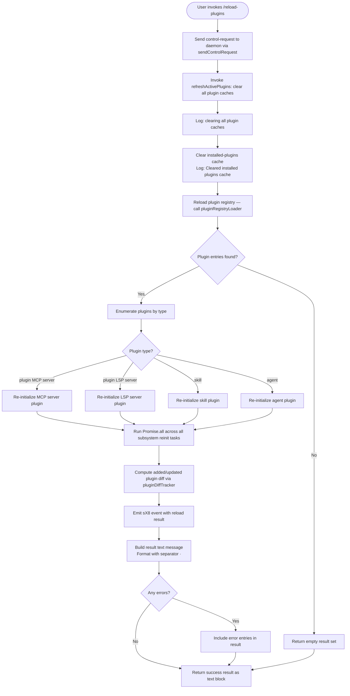

# `/reload-plugins`

> Analysis basis: CC v2.1.145 bundle.js (AST extraction + Claude interpretation)
> Minimum version: v2.1.145

---

## Overview

`/reload-plugins` activates pending plugin changes in the current Claude Code session without requiring a full restart. It works by dispatching a control request to the daemon layer, clearing all cached plugin state, and then re-initializing every plugin subsystem (MCP servers, LSP servers, skill/agent plugins) so that newly installed or modified plugins become immediately active.

---

## Registration

| Field | Value |
|---|---|
| type | `local` |
| name | `reload-plugins` |
| description | `Activate pending plugin changes in the current session` |
| supportsNonInteractive | `false` |
| thinClientDispatch | `"control-request"` |
| module_id | `EEq` |
| load_inline | `true` |
| loc_byte | `11623112` |
| loc_byte_end | `11623331` |
| loc_line | `7184` |
| arbor_handler.name | `rS7` |
| arbor_handler.fqn | `claude-2.1.145::rS7` |
| arbor_handler.kind | `AsyncFunction` |
| arbor_handler.resolution_path | `module_id` |
| arbor_handler.n_hits | `0` |

Analysis basis: CC v2.1.145 bundle.js:+11623112

---

## Input Branching

The command has more than three distinct behavioral paths: the control-request dispatch path, the cache-clearing path, and the per-subsystem re-initialization paths (MCP servers, LSP servers, skills/agent plugins). A Mermaid flowchart is used.



Analysis basis: CC v2.1.145 bundle.js:+11622135, +11622172, +11622247, +11622543, +11620018, +11620127, +11621107, +11622515

---

## Behavioral Spec

### 1. Control-Request Dispatch

When the command is invoked, `rS7` (the main async handler) first calls the transport helper (`W$`) to send a `"reload_plugins"` control request token to the daemon process. The constant `"ccr"` is used as the channel identifier, and `"reload_plugins"` is the request type string.

```
async function reloadPluginsHandler(context):
    sendControlRequest(channel="ccr", type="reload_plugins")
    result = await refreshAndReinit(context)
    return formatResult(result)
```

Analysis basis: CC v2.1.145 bundle.js:+11622153, +11622202, +11622172

### 2. Cache Invalidation (`refreshActivePlugins`)

The `refreshActivePlugins` routine (`ijH`) begins by logging `"refreshActivePlugins: clearing all plugin caches"`. It then calls the installed-plugins cache clearer (`_t1`), which logs `"Cleared installed plugins cache"`.

The plugin registry loader (`N$`) is then triggered. Inside, it calls:
- `pluginRootResolver` (`dN_`) — resolves the `"pluginRoot"` key from settings
- `pluginEntryLoader` (`c17`) — loads individual plugin descriptors from disk (reads `manifest.json` entries, LSP config `.lsp.json` files, and MCP config `.mcp.json` files)
- `lspConfigCacheCleared` (`CrH`) — explicitly calls `iz8.clear()` to wipe the LSP config cache

```
async function refreshActivePlugins(context):
    log("refreshActivePlugins: clearing all plugin caches")
    clearInstalledPluginsCache()   // logs "Cleared installed plugins cache"
    pluginRoot = resolvePluginRoot(context.settings)
    entries = await loadPluginEntries(pluginRoot)
    clearLspConfigCache()
    return entries
```

Analysis basis: CC v2.1.145 bundle.js:+11620018, +9160145, +9160147, +8714744, +11620078

### 3. Plugin Re-Initialization by Type

After the cache is cleared and the fresh entry list is available, `ijH` iterates over the plugin list and dispatches re-initialization per plugin type. The four recognized type strings are:

| Type literal | Subsystem |
|---|---|
| `"plugin"` | Generic plugin MCP server |
| `"skill"` | Skill plugin |
| `"agent"` | Agent plugin |
| `"plugin MCP server"` | Explicit MCP server plugin |
| `"plugin LSP server"` (hook-only) | LSP server plugin |

All re-initialization tasks are gathered and executed concurrently via `Promise.all`.

The `wi` helper is responsible for loading plugin configurations from disk (reading `.mcp.json`, `.mcpb`, `.dxt` files). The `ZvH` helper handles reading `.lsp.json` config files and schema-validating them. The `nS7` and `iS7` functions compute the diff of newly added/updated plugins (compared against a `Set` of previously seen plugin keys).

```
async function reinitializeAllPlugins(entries, context):
    tasks = []
    for entry in entries:
        if entry.type in ["plugin", "skill", "agent", "plugin MCP server"]:
            tasks.append(reinitMcpPlugin(entry, context))
        if entry.type == "plugin LSP server":
            tasks.append(reinitLspPlugin(entry, context))
    results = await Promise.all(tasks)
    added   = computeAddedPlugins(previousSet, results)   // nS7
    updated = computeUpdatedPlugins(previousSet, results)  // iS7
    emitReloadEvent(results)
    return { added, updated, results }
```

Analysis basis: CC v2.1.145 bundle.js:+11622267, +11622298, +11622326, +11622358, +11620127, +11621498, +11621580, +11621773

### 4. Plugin Registry and Marketplace Resolution (`aLH` / `Oz6`)

During re-initialization, the plugin registry resolver (`aLH`) is called to reconcile each plugin's declared dependencies and their installation state. It:

1. Reads `known_marketplaces.json` (`m5`) to validate marketplace references.
2. Reads the per-plugin `marketplace.json` (`ZqH`) from `.claude-plugin/marketplace.json`.
3. Calls the dependency resolver (`Oz6`), which walks the dependency graph checking for:
   - `"dependency-unsatisfied"` — a required plugin is not installed
   - `"not-found"` — plugin not found in any registry
   - `"blocked-by-policy"` / `"marketplace-blocked-by-policy"` — policy blocks the source
   - `"resolution-failed"` — graph traversal failed
   - `"range-conflict"` — conflicting version requirements
   - `"installed-unsatisfied"` — installed version does not satisfy range
4. Calls `mEH` to enumerate `Object.entries` of each plugin's dependency map and resolves each via the `Z8` / `UB` sub-resolvers.
5. Writes the resolved state to the plugin set map via `O.set`, `X.set`, `Q.set`, and `l.set`.

```
async function resolvePluginRegistry(pluginList, policySettings):
    knownMarketplaces = await readKnownMarketplaces()
    for plugin in pluginList:
        marketplaceData = await readMarketplaceJson(plugin)
        depResult = resolveDependencyGraph(plugin, knownMarketplaces, policySettings)
        if depResult.status in errorStatuses:
            markPlugin(plugin, depResult.status)
        else:
            registerPlugin(plugin, depResult)
    emitPluginInstalledTelemetry(plugin)
```

Analysis basis: CC v2.1.145 bundle.js:+10832385, +10832547, +10832570, +10832925, +9131791, +9152703, +5116361, +5117572

### 5. Result Formatting and Output

After all re-initialization completes, `rS7` calls `Ze` (the result formatter). It formats a text response with the separator literal `" · "` between plugin name entries. Any plugin that reported an `"error"` status produces an error entry. The final output is returned as a `{ type: "text", content: ... }` block.

```
function formatReloadResult(results):
    parts = []
    for result in results:
        label = result.name + " · " + result.status
        parts.append(label)
    if any error in results:
        parts.prepend("error")
    return { type: "text", content: join(parts) }
```

Analysis basis: CC v2.1.145 bundle.js:+11622385, +11622440, +11622515, +11622618

### 6. Daemon Control-Request Transport (`W$` → `VPH`)

The `sendControlRequest` helper (`W$`) delegates to the lower-level transport primitive (`VPH`). In thin-client mode (`thinClientDispatch: "control-request"`), the command is dispatched over the daemon IPC channel rather than handled in-process.

Analysis basis: CC v2.1.145 bundle.js:+11622135, +4047156

### 7. MCP Server Plugin Re-initialization Detail (`Oz6` / `$z6`)

For each MCP server plugin, `Oz6` calls `$z6` (the install/extract orchestrator), which:
- Uses a temporary directory via `Date.now` + `N91.randomBytes` for safe extraction
- Extracts `.mcpb` archives (binary plugin packages), reading `manifest.json` inside them
- Falls back to `manifest.json` at the plugin root for non-archive plugins
- Computes an MD5 hash (8-hex-char prefix) of the plugin binary for integrity tracking
- Calls `TQH` for final plugin layout validation and activation
- Cleans up temp directories via `GQH.rm` and `uL.rm`

Analysis basis: CC v2.1.145 bundle.js:+5112229, +5112750, +5112736, +5101061, +5112575, +5138343

---

## State & Side Effects

| Item | Detail |
|---|---|
| Telemetry | `tengu_daemon_control` (bundle.js:+14690669); `tengu_daemon_yield` (bundle.js:+14673599); `tengu_bg_dispatch_sigkill_escalate` (bundle.js:+14655330); `tengu_bg_dispatch_low_mem` (bundle.js:+14655909); `tengu_bg_spare_enable` (bundle.js:+14656548); `tengu_bg_spare_claim` (bundle.js:+14656669); `tengu_bg_spare_claim_fail` (bundle.js:+14656932); `tengu_session_resumed` (bundle.js:+13673314) |
| Plugin OTEL metrics emitted | `plugin_installed` event with attributes `plugin.name`, `plugin.version`, `marketplace.name`, `marketplace.is_official`, `install.trigger` (bundle.js:+5122078) |
| Cache cleared | Installed-plugins cache (bundle.js:+9160145); LSP config cache via `iz8.clear()` (bundle.js:+9104565) |
| IPC / daemon side effect | Control request `"reload_plugins"` sent over channel `"ccr"` (bundle.js:+11622153, +11622202) |
| Event emitted | `sX8.emit` called with reload results (bundle.js:+11621107) |
| File I/O | Reads: `manifest.json`, `.mcp.json`, `.lsp.json`, `.mcpb`/`.dxt` archives, `known_marketplaces.json`, `marketplace.json`, `settings.json`; Writes: extracted plugin files to temp dir, renamed atomically |
| Non-interactive | `supportsNonInteractive: false` — command is blocked in non-interactive sessions |
| Thin-client dispatch | Routes as `"control-request"` in thin-client environments |

---

## Version History

| Version | Change |
|---|---|
| v2.1.145 | Initial analysis |

---

## Common Mistakes

1. **Running in non-interactive mode**: The command sets `supportsNonInteractive: false`. Invoking it from a script or piped session will be rejected. Use interactive mode only.
2. **Expecting instant MCP server availability**: The command clears caches and re-initializes asynchronously. Some MCP servers (especially those sourced from `.mcpb` archives) require extraction and hash verification before becoming active; there may be a short delay.
3. **Assuming all plugin types are reloaded equally**: LSP server plugins follow a different config path (`.lsp.json`) from MCP server plugins (`.mcp.json` / `.mcpb`). A reload will pick up changes to both, but LSP servers are subject to an additional schema validation step that can silently reject malformed configs (logged as `"lsp-config-invalid"`).
4. **Confusing `/reload-plugins` with a full restart**: This command operates within the current session. It does not reset conversation state, tool permissions, or daemon process identity. For changes that require process-level restart, a full `claude` restart is needed.
5. **Policy-blocked plugins silently failing**: If a plugin's source or marketplace is blocked by enterprise policy, the reload will complete without error for the session as a whole, but the affected plugin will be marked `"blocked-by-policy"` or `"marketplace-blocked-by-policy"` and will not be active. Check the result output for these status strings.

---

## Appendix — Identifier Mapping

> For bundle debugging only. Identifiers change across versions.

| Identifier | Role |
|---|---|
| `rS7` | Main async handler for `/reload-plugins` (Arbor-resolved) |
| `W$` | Control-request sender (delegates to transport layer) |
| `VPH` | Low-level daemon IPC transport primitive |
| `hd` | Pre-reload setup helper |
| `k8` | Utility called by pre-reload setup |
| `ijH` | `refreshActivePlugins` — cache-clear and full plugin re-init orchestrator |
| `I` | Generic async utility / logger used throughout |
| `y$K` | Logger subsystem helper |
| `J6A` | Log-output routing utility |
| `RH` | JSON serialization helper |
| `B4` | String/path formatting helper |
| `n_A` | Path-map helper |
| `RSH` | Write-stream helper |
| `x_A` | Raw write helper |
| `R$K` | File-based logging sink (mkdir, appendFile, rotation) |
| `qSH` | Buffered log flush with batching and `setImmediate` |
| `I_H` | Log-line builder |
| `M86` | Log rotation helper |
| `HAA` | Log path joiner |
| `e_A` | Log file rename/unlink helper |
| `S$K` | Log file append-and-rotate helper |
| `h9` | Performance/trace register helper |
| `_t1` | Installed-plugins cache clearer |
| `N$` | Plugin registry loader / entry dispatcher |
| `c17` | Plugin entry loader (reads manifests, LSP, MCP configs) |
| `uT` | Plugin config deserialization helper |
| `ez8` | Plugin type validator |
| `BA8` | Plugin schema builder |
| `XO8` | Plugin schema validator |
| `dN_` | Plugin root resolver (reads `"pluginRoot"` from settings) |
| `NH` | Error aggregator / logger for plugin loading |
| `TA8` | Plugin activation helper |
| `fh_` | Plugin filter utility |
| `Fs1` | Plugin finalization step |
| `V6H` | Plugin reload event dispatcher |
| `eqH` | Event payload builder |
| `xs1` | Event serializer |
| `NY8` | Notification helper |
| `Xw_` | Plugin schema builder (alternate path) |
| `Iw_` | Plugin install state checker |
| `CrH` | LSP config cache clearer (`iz8.clear()`) |
| `aY1` | Session plugin state accessor |
| `wR1` | Plugin watcher reset helper |
| `q_` | Async queue utility |
| `IV` | Queue item processor |
| `K` | MCP server connection formatter (padEnd, map) |
| `wi` | Plugin file config loader (.mcp.json, .mcpb, .dxt) |
| `kJ_` | MCP config file reader (reads `.mcp.json` as UTF-8) |
| `O8` | Error-code classifier (ENOENT, EISDIR) |
| `u6` | JSON parse wrapper |
| `HQ` | File extension checker (`.mcpb`, `.dxt`) |
| `gO1` | Plugin source/status resolver |
| `Az6` | MCPB/DXT archive extractor and manifest parser |
| `GH` | String coercion utility |
| `ZvH` | LSP config file loader (`.lsp.json`) |
| `pd4` | LSP plugin path validator and config reader |
| `md4` | Path relativity checker for LSP configs |
| `$` | MCP entry reduce/accumulate helper |
| `dvq` | Daemon status reporter |
| `Jl` | Logging async helper |
| `Q1` | AsyncLocalStorage store accessor |
| `KT6` | Daemon status file path builder (`daemon.status.json`) |
| `O` | Background session reduce helper |
| `nS7` | Added-plugin diff tracker (filter + map) |
| `TEq` | Plugin key equality checker |
| `iS7` | Updated-plugin diff tracker (filter + map) |
| `aLH` | Plugin dependency registry resolver |
| `_Q` | Known-marketplace file reader |
| `m5` | Known-marketplace JSON loader (`known_marketplaces.json`) |
| `KY8` | Marketplace file path builder |
| `mEH` | Plugin dependency map enumerator |
| `Z8` | Dependency resolution node processor |
| `pb6` | Dependency source classifier |
| `UB` | Dependency type dispatcher (npm, git, github, url, etc.) |
| `PZ` | Error thrower for invalid plugin scopes |
| `IA` | Scope string parser (includes / split) |
| `AX` | Permissions/policy checker for plugin installation |
| `WO6` | Host-pattern policy checker |
| `D_8` | Policy settings extractor |
| `Lt9` | Host-pattern matcher |
| `ft9` | Path-pattern policy evaluator |
| `T44` | GitHub source policy checker |
| `ve` | Policy-settings reader (alternate) |
| `G44` | Tool-origin policy evaluator |
| `ZqH` | Per-plugin `marketplace.json` reader |
| `iX6` | Marketplace JSON path builder |
| `Oh_` | Marketplace JSON schema validator |
| `A8` | Error-code string extractor |
| `_G` | Cross-plugin dependency resolver (reads multiple config files) |
| `Mw_` | Plugin config file reader for dependency checks |
| `t07` | Dependency cycle detector |
| `Oz6` | Full plugin install/resolve orchestrator |
| `GZ` | Policy-settings object extractor |
| `hA8` | Scoped permissions checker |
| `K16` | Relative-path prefix validator (`"./"`) |
| `b6` | Context store accessor |
| `AC6` | AsyncLocalStorage context reader |
| `xT` | Plugin config file reader with entry enumeration |
| `Yh_` | Sync plugin config file reader |
| `Dh_` | Config entry enumerator |
| `j` | Running process set (values, kill) |
| `y` | Daemon write stream |
| `X` | MCP server connection manager (set, get, connect) |
| `kZ8` | MCP connection factory |
| `x_` | Error/string wrapper |
| `iC` | Scope validator |
| `_S` | Scope normalizer |
| `M_8` | Semver validity checker (valid, coerce, satisfies) |
| `W` | Plugin-set debounced reloader (add, setTimeout, clear, emit) |
| `z` | Plugin daemon set (add, clear, hH, CH, oN, kx) |
| `DOH` | Config-change event builder |
| `VFH` | Skills-list change detector |
| `rs9` | Dependency graph walker and cycle detector |
| `M` | Plugin registry map (get, set, values, has) |
| `Q_` | Settings loader and merger (all scopes) |
| `VO` | Settings flag loader |
| `kU8` | Settings file reader with JSON parse |
| `GP` | Settings path resolver |
| `Rp8` | Settings read timestamp recorder |
| `H2H` | Settings merge builder |
| `y96` | Atomic file writer (write, fchmod, fsync, rename) |
| `az` | Settings cache clearer (dv6, eV8) |
| `QC6` | Settings disk writer (mkdir, readFile, writeFile, appendFile) |
| `xR` | Settings path joiner (`.claude/settings.json`) |
| `Gu` | Settings-from-disk loader (flagSettings, userSettings, etc.) |
| `Mz6` | Plugin path sandbox validator |
| `F` | MCP tool filter set |
| `g` | Tool availability filter |
| `Q` | Plugin file cache map (get, set) |
| `w06` | Plugin file reader with cache |
| `YMq` | Plugin file unlinker with cache |
| `KH` | MCP server process launcher queue |
| `MH` | MCP server process enqueue helper |
| `w` | Daemon worker/process manager |
| `l` | Plugin filter set (filter) |
| `o` | Voice recording session manager |
| `DO6` | Semver range validator and splitter |
| `iz_` | Semver range parser |
| `vA8` | Plugin archive validator |
| `P91` | Archive content type detector |
| `IA8` | Git-source tag resolver |
| `w34` | Git URL parser |
| `Y8` | Git subprocess runner |
| `$z6` | Plugin install/extract/activate orchestrator |
| `TQH` | Plugin layout finalizer and activator |
| `RA8` | Plugin post-install hook runner |
| `k91` | Plugin manifest validator |
| `Re` | Plugin hash/fingerprint calculator (SHA-256) |
| `fS` | Plugin status file reader |
| `P` | Daemon IPC framing / chunk reader |
| `w_8` | Node package directory scanner |
| `dm` | Plugin config string encoder |
| `VzH` | Plugin status writer |
| `yA8` | Plugin temp dir cleaner |
| `Hw_` | Plugin entry list updater (findIndex, push) |
| `h` | Away-summary focus/blur handler |
| `rF` | Focus event classifier |
| `N` | Away-summary generator |
| `Z` | Rate-limit checker |
| `Lrq` | Away-summary prompt builder |
| `$H` | Main session loop / turn processor |
| `C` | Output writer |
| `fX8` | Tool-call filter |
| `GT` | Base64 encoder/decoder |
| `OM` | Message normalizer |
| `_LH` | Live-session lister |
| `$6H` | Session resume handler |
| `d` | Debug logger |
| `dG` | Event emitter wrapper |
| `w2` | Session metadata accessor |
| `GZ6` | Transcript file rotator |
| `jd` | Journal logger |
| `M98` | Metrics recorder |
| `CNH` | Conversation journal writer |
| `NyH` | Session state initializer |
| `T` | Remote-control startup handler |
| `VZ6` | Tool permission map builder |
| `xX` | UI state variable |
| `ZZ6` | Session cleanup handler |
| `zF` | Session timestamp recorder |
| `X8H` | Session metadata reappender |
| `vZ6` | Working-directory change handler |
| `P8H` | Session metadata append handler |
| `S` | Session disposal helper |
| `i` | Permission mode resolver |
| `c` | Permission string normalizer |
| `R` | Output renderer |
| `e` | Voice silence timeout handler |
| `G` | MCP connection state ref |
| `G34` | Plugin permission consolidator |
| `x` | Plugin permission map |
| `Pk` | Plugin name case-normalizer |
| `EM` | String encoding helper |
| `xH` | String-to-string converter |
| `zL` | OTEL metrics emitter for plugin events |
| `lv8` | OTEL attribute builder |
| `CgH` | OTEL resource attribute setter |
| `z66` | OTEL event sequencer |
| `Ze` | Reload result text formatter (separator `" · "`) |